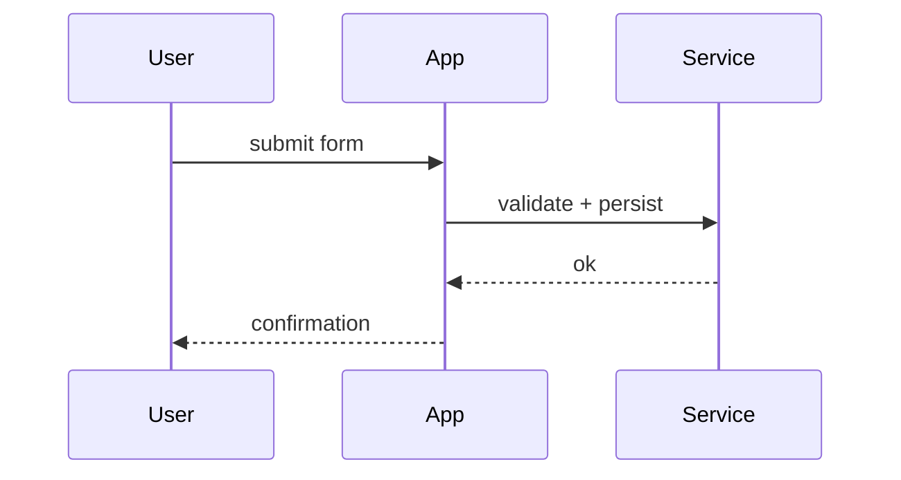

# Sequence (a time-ordered INTERACTION)

**Pick this when:** who-calls-whom over time, an ordered exchange between actors or systems (a
handshake, an API round-trip, a protocol). The ORDER in time is the point. If you only care that
data moves A&rarr;B&rarr;C (not the back-and-forth timing), that is a flow (`flow.md`), not a
sequence.

**Author with a mermaid `sequenceDiagram` fence:**

````mdx

````

**Gotchas:**
- `->>` is a solid call, `-->>` a dashed return. Declare `participant`s in the order you want them
  left-to-right.
- Do NOT animate a sequence with the flow-dot (it is not a flow).
- A mermaid label needing a dash uses the `&#8212;` entity (the em-dash hook blocks a literal one).

**Owner:** `author-mermaid` (the `sequenceDiagram` mechanics + the site conventions).
