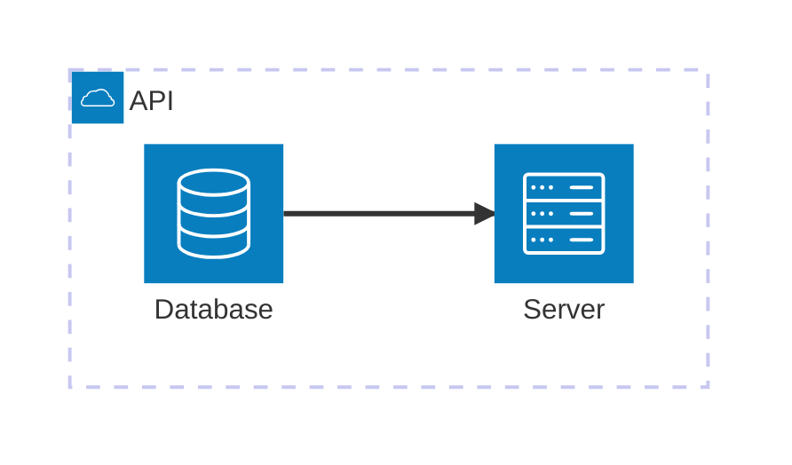

# Topology (what a system TOUCHES / how it is BUILT)

**Pick this when:** you are showing a system's neighbors, stores, and dependencies at its boundary,
or the grouped services that make it up. Hub-and-spoke, NOT a time sequence, NOT a flow.

**Disambiguate first (the three confusable diagrams):**
- **Flow** (`flow.md`): something MOVES through steps.
- **Context / topology** (THIS): what a system TOUCHES at the boundary.
- **Use-case** (`use-case.md`): which ACTORS use which capabilities.

**Author with mermaid `architecture-beta`:**

````mdx

````

Real provider/brand icons via the registered iconify `logos` pack: `logos:aws-lambda`,
`logos:google-cloud`, `logos:nodejs-icon`, etc. Built-ins: `cloud database disk internet server`.

**Gotchas:**
- Edge syntax is `id:DIR --> DIR:id` where DIR is `T|B|L|R` (pick the port that FACES the target),
  NOT `id --> id`. A wrong icon name silently renders nothing.
- Order services so connected ones are adjacent (declaration order drives layout).
- Inside a JSX component, use `<Mermaid value={theString}/>` from `@theme/Mermaid`, not a fence.
- Do NOT animate a context diagram with the flow-dot.

**Owner:** `author-mermaid` (the `architecture-beta` / C4 mechanics, the `logos` icon wiring, the
context-hub recipe).
