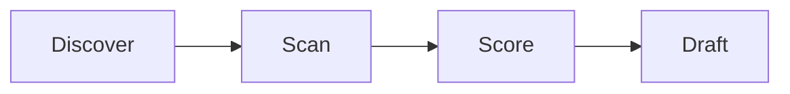
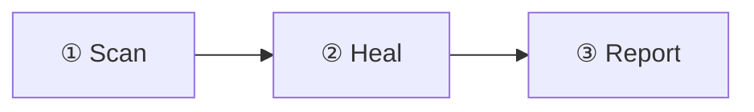

# Upgrade a post with the site's components

Turn a plain post or doc into a richer one by adding the right reusable component. This
skill is the **catalog + decision guide**: what each component is, when it earns its place,
the MDX to drop in, and what bites. It is content-origin-agnostic — use it on any
`blog/`, `designs/`, or `docs/` page.

> **Where the components live:** Walkthrough, Mockup, Gif, DiagramWithFootnotes, and Assumption
> now ship from the published **`@omars-lab/blog-ui`** package (source in `packages/blog-ui/`).
> Import them as `import {Mockup, Walkthrough} from '@omars-lab/blog-ui'`. The blog registers
> them + imports the bundled styles (`@omars-lab/blog-ui/style.css`) once in
> `src/theme/MDXComponents.tsx`, so in a `docs/`/`blog/` page they're available with no import;
> in a `designs/` mockup sidecar you DO import from the package. (Card/Carousel/Premium/etc.
> remain in `bytesofpurpose-blog/src/components/`.)

There are TWO doc surfaces this complements, don't duplicate them:
- **Reader-facing** how-to lives in `docs/craft/blogging/` (`embed-code`, `embed-diagrams`,
  `embed-external-components`, `embed-structural-components`, `diagramming/`). Those teach a
  reader to do it; THIS skill is the agent-facing "which component, when, and the gotchas."
- **Authoring mechanics** (frontmatter, MDX build-breakers) live in `author-post`.

## First, the universal gotchas (every component)

- **Em-dash hook is BLOCKING.** Any literal `—` (U+2014) in reader-facing content
  (`docs/blog/designs/changelog` + `src/`) fails the edit. Use commas / periods / colons.
- **MDX build-breakers**: bare `<br>` (use `<br/>`), unescaped `{braces}`, a stray `<`
  before a space/digit, and bare `<https://…>` autolinks all break the build. See
  `author-post`.
- **Draft discipline**: a content page needs an explicit `draft:` field; drafts render in
  dev (`:3000`) only, never in the prod build.
- **Re-import clobber**: on a page produced by `import-co-design`, anything you hand-add to
  the BODY is overwritten on the next re-import. Only enrich a finalized page you won't
  re-import, OR push the enrichment into the importer so it's reproducible. (The animated-
  diagram wrapper IS reproducible — it's stamped by the importer.)

## The catalog — what / when / how

### Animated mermaid diagram (marching dashes + traveling flow-dot)

WHAT: a mermaid diagram whose edges flow (marching-ants dashes) and, on FLOW diagrams, a
single dot that travels the edges in sequence. WHEN: a data/activity flow worth drawing the
eye through (pipelines, request/response, an experiment loop). NOT for static
context/relationship diagrams (the dot looks random there).

HOW: wrap the diagram in the opt-in class; state flow-intent via the wrapper class.

```mdx
<div className="mermaid-animated flow-dot">



</div>
```

- The marching dashes apply to ALL `.mermaid-animated` diagrams.
- The traveling DOT is gated CONTENT-wise by the WRAPPER CLASS: `flow-dot` forces it,
  `no-flow-dot` suppresses it; plain `mermaid-animated` lets the edge-label-verb heuristic
  decide. Mark genuine flows explicitly — the heuristic misses flows whose verbs are in node
  names with unlabeled edges.
- NOTE for co-design imports: the SOURCE mermaid block uses an `%% animate: flow|none`
  comment instead, and the importer converts it to the `flow-dot`/`no-flow-dot` class.
  Hand-authored diagrams use the class directly (above) — the `%%` comment is invisible at
  runtime (mermaid strips it), so it only works through the importer.
- Colors: do NOT hardcode `classDef`/`style fill:` — the site mermaid theme (light `base` +
  `dark`) handles both modes. Hardcoded fills break dark mode.
- Mechanism: CSS in `src/css/custom.css` + the `src/mermaid-flow-dot.js` client module.
  Honors `prefers-reduced-motion`. Full writeup: `docs/craft/blogging/diagramming/animated-diagrams`.

### DiagramWithFootnotes (numbered legend)

WHAT: a diagram + a generated numbered legend (①②③) tying badges in the mermaid labels to
explanations. WHEN: a diagram with steps that each need a sentence of context. HOW:

```mdx
import {DiagramWithFootnotes} from '@omars-lab/blog-ui';

<DiagramWithFootnotes notes={['Scanner finds CRO problems', 'Agent ideates + tests', 'Winners ship']}>

</DiagramWithFootnotes>
```

Registered in `MDXComponents` (no import needed in docs, but importing is harmless). MANUAL
opt-in — a re-import would clobber it, so only on finalized pages.

### FlowDiagram (prop-driven flow, built-in legibility gate)

WHAT: a directed-flow figure rendered as inline SVG from a `nodes`/`edges` spec (data, not a
mermaid string, not an image). Five shapes, usually INFERRED from the graph so you rarely pass
`shape`: `pipeline` (A → B → C), `loop` (a cycle: a back-edge to an earlier node), `sequence`
(a vertical stack), `branch` (a fork / decision fan-out: a node with 2+ out-edges), `swimlane`
(labeled owner bands via each node's `lane`). WHEN: a flow/loop/handoff/decision you'd have
hand-drawn in mermaid. It fails the BUILD on a dangling edge id or a tangled (crossing) layout,
so a flow ships only when it reads cleanly. HOW:

```mdx
<FlowDiagram
  title="The habit loop"
  desc="A cue triggers a routine, which delivers a reward; craving closes the loop."
  legend
  nodes={[
    {id: 'cue', label: 'Cue', detail: 'The trigger that starts the loop.'},
    {id: 'routine', label: 'Routine', detail: 'The behavior you run on autopilot.'},
    {id: 'reward', label: 'Reward', detail: 'The payoff that makes it worth repeating.'},
  ]}
  edges={[
    {from: 'cue', to: 'routine'},
    {from: 'routine', to: 'reward'},
    {from: 'reward', to: 'cue', label: 'craving'},
  ]}
/>
```

- Registered in `MDXComponents` (no import needed). `title` is required (SVG a11y + id salt);
  pass `desc` for the accessible description (a missing `desc` warns to the console).
- Node `kind`: `store` (datastore), `external` (outside the system, dashed), `edge` (trust
  boundary). `legend` shows a key for the special kinds actually used.
- A node with `detail` becomes clickable and opens a focus modal listing what feeds it / what
  it feeds. All motion (edges draw in, boxes fade in) respects `prefers-reduced-motion`.
- The overlap gate THROWS (fails `make build`) past 25% crossing edges. If a diagram is
  legitimately dense, pass `allowOverlap` to downgrade it to a warning; better, reorder nodes
  so the flow reads without backtracking, or split it.
- WHEN NOT: for a diagram with steps that each need a sentence but no strong flow, or a
  non-flow (class/ER/context) diagram, reach for `DiagramWithFootnotes` (mermaid + numbered
  legend) instead. FlowDiagram is for flows; it is deliberately not a general mermaid renderer.

### Decision kit: ComparisonMatrix + Accordion

WHAT: two components for a post that argues a CHOICE. `ComparisonMatrix` is the head-to-head
table (options are columns, criteria rows, the `chosen` column highlighted + badged;
`yes`/`no`/`partial` render as ●/○/◐ marks with sr-only labels, any other string as literal
text). `Accordion` is the narrative (foldable options on native `<details>`, zero JS, each
with a `summary`, a React `body`, an optional `open`, and either `chosen: true` (a solid green
CHOSEN pill) or a `verdict` on the rest (a quiet grey CONSIDERED pill, so only one pill draws
the eye)). WHEN: a
decision/comparison/critique post. The matrix answers "how do they score"; the accordion
answers "why". HOW:

```mdx
<ComparisonMatrix title="Where to store the data" desc="Three stores vs our needs."
  options={[{id:'pg',label:'Postgres'},{id:'sq',label:'SQLite',chosen:true}]}
  criteria={[
    {label:'Zero-ops', cells:{pg:'no', sq:'yes'}},
    {label:'Cost', cells:{pg:'$$', sq:'free'}},
  ]}/>

<Accordion label="The options" items={[
  {summary:'Rebuild from scratch', verdict:'considered', body:<>Slow; loses the edge cases.</>},
  {summary:'Keep SQLite', chosen:true, open:true, body:<>Zero-ops, durable, free.</>},
]}/>
```

- Both registered in `MDXComponents` (no import). Live demo: `/handbook/components/structural/decision-kit`.
- ComparisonMatrix THROWS at build if a cell is keyed to an option id that is not in `options`.
  It scrolls inside its own wrapper on mobile (never pushes the page sideways).
- JUSTIFY A RATING: a cell can be `{rating, note, footnotes}` instead of a bare string. A cell
  with a `note` renders its mark as a clickable button (a small "why" dot hints it) that opens a
  focus modal with the justification (any React content, incl. `<sup>` footnote refs) + a
  `footnotes: [{id, content}]` definition list. Plain-string cells stay static; zero client JS
  ships unless a cell has a note. E.g.
  `cells={{sqlite: {rating:'yes', note:<>Single file, no server.<sup>1</sup></>, footnotes:[{id:'1', content:<>In-process.</>}]}}}`.
- LEGEND: pass `legend` to render a small key under the table (● yes / ○ no / ◐ partial, only the
  marks in use), plus a "clickable for the reasoning" hint when any cell has a note. Rendered from
  the mark map so it can't drift. Off by default; opt in per matrix. (Modeled on `<PowerLegend>`.)
- WHEN NOT: `OptionGrid`/`OptionTile`/`DecisionNote` show explored DESIGN directions with a
  chosen ring + WHY (a design specimen). ComparisonMatrix is the feature-by-feature decision
  TABLE. Use the matrix for "which option scores better", OptionGrid for "which mock we picked".

### UseCaseDiagram (UML use-case, built-in legibility gates)

WHAT: a UML use-case diagram as inline SVG. Actors sit OUTSIDE a system boundary; use cases
are ovals INSIDE; a solid line is an `association`, dashed `«include»`/`«extend»` arrows relate
use cases. WHEN: a "who uses X and what they do" figure (Mermaid has no real use-case support,
so this is the only way to author one here). HOW:

```mdx
<UseCaseDiagram title="Bytes of Purpose" desc="Who works with the blog and what they do."
  actors={[
    {id:'author', label:'Author', kind:'internal'},
    {id:'reader', label:'Reader'},
    {id:'cron', label:'Scheduled job', kind:'system'},
  ]}
  useCases={[
    {id:'write', label:'Write a post', detail:'Draft in MDX, run the validators.'},
    {id:'publish', label:'Publish', detail:'Build and deploy.'},
    {id:'read', label:'Read a post'},
  ]}
  links={[
    {from:'author', to:'write'}, {from:'author', to:'publish'}, {from:'cron', to:'publish'},
    {from:'reader', to:'read'}, {from:'publish', to:'write', type:'include'},
  ]}/>
```

- Registered in `MDXComponents` (no import). Live demo: `/handbook/components/diagrams/use-case`.
- Actor `kind`: `internal` (a filled mark) + `system` (a gear) pull LEFT; `external` (default,
  a line person) pulls RIGHT, so lines fan to the nearest edge. The layout is deterministic.
- TWO build-time gates THROW (fail `make build`): the overlap gate (>25% crossing lines) and the
  actor line-angle BALANCE gate (an actor whose lines fan lopsidedly, i.e. it sits off-center from
  its use cases). If a diagram legitimately needs it, pass `allowOverlap` to downgrade both to
  warnings; better, give each actor use cases that straddle it vertically, reorder, or split.
- A use case with `detail` opens a click-to-focus modal (Used by / Includes / Extends).

### MindMap (themed, clickable mind map from Mermaid text)

WHAT: a mind map rendered as inline SVG from ordinary [Mermaid mindmap](https://mermaid.js.org/syntax/mindmap.html)
text (the author writes `mindmap` syntax as children, so the SAME text also renders on
mermaid.live). On top of mermaid it adds the two things mermaid's mindmap renderer cannot do:
real clickable nodes and theming. A node whose whole label is a markdown link `[Text](href)`
becomes an `<a>`. WHEN: an idea tree / brainstorm / role map / concept hierarchy where you want
the branches to be navigable (jump to a heading or another page). HOW:

```mdx
<MindMap title="Orchestrating Roles" theme="blog">{`
mindmap
  root((Orchestrating Roles))
    [The Starter](#the-starter)
    [The Executor](#the-executor)
    [The Finisher](/initiatives/other-post#finisher)
`}</MindMap>
```

- Registered in `MDXComponents` (no import). Live demo: `/handbook/components/diagrams/diagrams-mindnode`.
- Pass the mermaid text as CHILDREN in a **template literal** so `#`, parens, and newlines
  survive MDX. Malformed text THROWS (fails `make build`) rather than shipping a broken diagram.
- Links: `[Text](#heading)` (same page), `[Text](/initiatives/slug#anchor)` (another page: use
  the REAL route, `/initiatives/...` not `/blog/...`), or an `https://` link (opens in a new tab).
- `theme`: default **`theme="blog"`** for a NEW map authored in a post (it uses the site's green/tea
  design tokens, so it matches everything else). Use `theme="mindnode"` (cream/brown) only when the
  map is imported from, or meant to evoke, an Apple MindNode file. Both respect light + dark mode.
- `layout` (`ltr` default | `spread` two-sided), `density` (`comfortable` | `compact` for big maps),
  `caption`, and `className`/`style` passthrough (override any `--bopmind-*` token inline).
- Per-node accent tint via a mermaid `:::name` class (`green`/`mint`/`pink`/`blue`/`amber`/`violet`),
  e.g. `Ship it:::green` (a space, `Ship it ::: green`, is tolerated too).
- WHEN NOT: for a directed flow (A → B → C, a loop, a decision fan-out) use `FlowDiagram`; for a
  non-hierarchy mermaid diagram (ER/class/state/sequence) use a plain ```mermaid fence or
  `DiagramWithFootnotes`. To turn an actual `.mindnode` file into one of these, see the
  **import-mindnode** skill (it runs the converter + preview loop for you).

### Mockup (UX mockups — show what it LOOKS like)

WHAT: a framed, theme-aware wrapper (`browser` / `window` / `phone` / `none` chrome) that
turns LIVE HTML/CSS into a UI mockup. WHEN: a design post needs to paint the picture — what
a screen/layout would look like — not just how it works. The "screen" is real HTML so it
adapts to light/dark, scales, and is version-controlled (no screenshots, no external embeds).
HOW:

```mdx
import {Mockup} from '@omars-lab/blog-ui';

<Mockup chrome="browser" title="Review Studio" url="review.studio/doc/hld" caption="…">
  <div style={{display:'flex'}}>
    <nav>…sidebar…</nav>
    <main>…document + comment pins…</main>
    <aside>…comment thread + a CTA button…</aside>
  </div>
</Mockup>
```

- Keep the inner HTML simple + semantic (a few divs/buttons with light inline styles using
  `var(--ifm-*)` tokens so it stays on-brand and theme-aware). It is an impression, not a
  pixel-perfect build.
- **On an imported co-design**, do NOT hand-add the mockup to the post body (a re-import
  clobbers it). Put it in a **sidecar component** `designs/_mockups/<name>.mdx` (a default-
  exported React component of `<Mockup>` blocks) and link it from the post's frontmatter
  `mockups: ./_mockups/<name>.mdx`. The importer injects `import Mockups … <Mockups/>` after
  the truncate marker and **preserves it across re-imports**, and never regenerates the
  sidecar. See `import-co-design`.

### Gif (animated media — show it in MOTION)

WHAT: a framed, captioned, accessible figure for an animated GIF (or short clip) — a recorded
or synthesized terminal session, a screen capture. WHEN: you want to show real motion that a
scripted `<Walkthrough>` can't (an actual CLI run, a screen recording). Unlike a bare
``, it lazy-loads, frames the media to match `<Mockup>` (a `terminal` frame
reads as a CLI on any theme), and is motion-accessible: it starts on a static `poster` for
`prefers-reduced-motion` and gives everyone a play/pause toggle (a GIF can't pause natively, so
it swaps to the poster). HOW:

```mdx
import {Gif} from '@omars-lab/blog-ui';

<Gif src="/img/<post>/session.gif" poster="/img/<post>/session-poster.png"
     alt="Claude Code running the stock-analyzer agent" frame="terminal" title="claude code"
     caption={<><b>A real session.</b> The agent runs its skills, then pauses for approval.</>} />
```

- Put the `.gif` (and a `poster` first-frame `.png`, recommended) under `static/img/<post>/` and
  reference by absolute path, or `import` it in a sidecar. `alt` is required; `poster` is what
  reduced-motion users see.
- To GENERATE a synthesized Claude-Code-session gif (no live recording), see the
  `author-terminal-gif` skill — it feeds straight into this component.

### Admonitions (callouts)

WHAT: `:::note / :::tip / :::info / :::warning / :::danger` styled boxes (enabled by default).
WHEN: a scope note, an assumption, a caveat, a "do this" tip — anything that should stand
apart from body prose. HOW:

```mdx
:::note[Scope]
Phase 1 only; self-healing is out of scope.
:::
```

`import-co-design` auto-converts labeled blockquotes (`> **Scope note:** …`) to these.

### Carousel / CategoryCarousel

WHAT: a horizontally-scrollable card row. WHEN: a set of links/resources/comparisons (e.g.
reference carousels). HOW: `import Carousel from '@site/src/components/Carousel'` →
`<Carousel items={[…]} />`. For a post's reference carousels, prefer the `refresh-references`
skill (it manages the data file + provenance) over hand-authoring.

### SvgVariantGrid

WHAT: a grid of SVG variants with a light/dark toggle + fixed preview heights. WHEN: showing
design iterations / a gallery of generated SVGs (e.g. logo or pattern variants). HOW:
`<SvgVariantGrid variants={VARIANTS} group="final" previewHeights={[40]} />` (variants from a
sibling `_*-variants.js`). Model: the binary-pyramid / rosette design posts.

### Premium / PremiumGate

WHAT: `<Premium>…</Premium>` soft-gates an inline span (blurred for anonymous); `<PremiumGate>`
is the whole-doc hard gate (injected by the rehype plugin when `premium: true`). WHEN:
gating paid/exclusive content. The POLICY ("should this be premium?") is owned by
`manage-premium-content`; the marking mechanics by `author-post`. Don't gate casually.

### ShareButton

WHAT: a copy/email/LinkedIn/X share row with ingress-attributed URLs. Mostly auto-placed by
the theme near the H1; rarely hand-added. Tune the share text via the `description:`
frontmatter (see `manage-frontmatter-descriptions`).

### Evidence footnotes

WHAT: GFM caret-style footnotes whose definition is an Evidence component (attrs: repo, sha,
path, lines, note) that renders a pinned GitHub permalink (privacy-gated). WHEN: citing a
specific commit/line range in a sibling repo as proof. Validated by `validate-footnotes.js`
(the SHA/path/lines must resolve). For plain external-URL citations, use a normal GFM
footnote without the Evidence component; `import-co-design` produces those. See an existing
post that uses Evidence (e.g. the image-to-DSL Thoughts post) for the exact syntax.

### SectionBanner (question-set section rationale)

WHAT: a left-accent callout placed immediately under an H2 heading, explaining *why the
questions in that section matter*. It renders as italic secondary-colored text with a
3px primary-color left bar and a subtle surface background — quieter than an admonition,
more like a narrator aside. WHEN: any post in the `question-set` tag class ("What I Ask
Myself: …" series), or any post where H2 sections contain clustered questions that each
need a one-sentence rationale. NOT for general docs or posts without clustered H2 sections.

```mdx
## Core purpose

<SectionBanner why="These are the hardest questions to answer and the most important to keep asking. Most people live their whole lives without a clear answer -- and that gap shows up as restlessness, drift, and doing things for the wrong reasons." />

<Question ...>…</Question>
```

- `why` is a 1-2 sentence rationale. No em-dashes (blocking hook). Write honestly, not generically.
- Registered in `MDXComponents.tsx` — no import needed in `.mdx` blog posts.
- The file must be `.mdx` (not `.md`) to use JSX components.

### Question (introspective question card + detail modal + badges)

WHAT: replaces a plain bullet-list question with a clickable card carrying glanceable
**badges** (power icons + priority/frequency/depth pills). Clicking opens an app-wide
modal showing the badges (labeled) plus per-question metadata: why it matters, how often
to ask it, when to ask it, how often to record answers. Only rows/badges where the prop
is set are rendered. WHEN: any `question-set` post where per-question metadata is
available. NOT for questions in general docs — only introspective/journaling posts.

```mdx
<Question
  power={['fire', 'anvil']}
  priority="core"
  cron="yearly"
  depth="deep"
  why="Without a clear answer, every decision defaults to what feels comfortable, not what's deepest."
  howOften="Once per year, and any time you feel like you're going through the motions"
  when="During quiet periods of reflection, journaling sessions, or spiritual retreats"
  record="Write a paragraph-length answer; revisit it annually to see how your answer has shifted">
  What is the purpose of your life?
</Question>
```

- `children` = the question text (plain string in the card + modal heading).
- **Every badge dimension now has its own ICON** (so the card scans fast), and every badge
  is wrapped in a `<Tooltip>` that explains it on hover/focus/tap (e.g. "Priority: Medium —
  Useful, but not foundational"; "Depth: Deep — Sit with it; this one takes time"). The
  glosses live in the `*_META` objects in `Question/index.tsx` (single source of truth).
- **Badge props (all optional):**
  - `power` — the "power of a question" charge(s). One value or an array. The taxonomy
    (a forge metaphor, rendered with `react-icons/gi` SVG glyphs, theme-aware):
    `'spark'` (GiLightningArc — a jolt that wakes you up),
    `'fire'` (GiFlame — a burn that confronts you),
    `'chisel'` (GiChisel — carves away what isn't you),
    `'anvil'` (GiAnvil — reshapes who you become). Omit `power` for a calm/no-icon
    question. A question may carry MULTIPLE (e.g. `power={['fire','anvil']}`).
  - `priority` — `'core' | 'high' | 'medium' | 'low'`. Pill + a `LuFlag` (Lucide) flag
    icon COLORED by tier (red core, orange high, amber medium, grey low).
  - `cron` — RECURRING cadence: `'daily' | 'weekly' | 'monthly' | 'quarterly' | 'yearly' |
    'adhoc'`. Pill + a `GiCycle` recurring icon. Think of it as the question's schedule (a
    "cron job" for self-reflection); `adhoc` = ask when it applies. **`cron` replaces the
    old free-text `frequency` prop** — `frequency` still works for back-compat (a recognized
    cadence word maps to `cron`; anything else renders as a plain text pill), but new posts
    should use `cron`.
  - `depth` — `'quick' | 'moderate' | 'deep'`. Pill + a `LuBrain` (Lucide) brain icon whose
    OPACITY scales with depth (faint quick → solid deep).
- All detail props (`why`, `howOften`, `when`, `record`) are optional; the modal renders
  only the rows with values. A card opens the modal if it has ANY badge or detail.
- Modal is pub/sub via `CustomEvent('bop:question-modal')`. The `QuestionModalHost` is
  mounted once in `src/theme/Root.tsx` — already wired; don't add it again.
- **MDX children extraction**: MDX wraps even plain-text children in React elements.
  The component handles this with a `nodeToText()` helper — write the question as plain
  text (no nested JSX) and it will extract cleanly.
- Registered in `MDXComponents.tsx` — no import needed in `.mdx` blog posts.
- The file must be `.mdx` (not `.md`).

### QuestionSection (sort a section's questions by priority)

WHAT: a wrapper around the `<Question>` cards under one H2 that renders them sorted by
`priority` (core > high > medium > low), preserving the authored order WITHIN each tier
(stable sort). Questions with no `priority` sort last. WHEN: every section in a
`question-set` post that has 2+ questions — so the reader meets the most-foundational
questions first. HOW: wrap the section's questions (after the `<SectionBanner>`):

```mdx
## Core purpose

<SectionBanner why="…" />

<QuestionSection>

<Question priority="high" …>…</Question>
<Question priority="core" …>…</Question>   {/* renders FIRST despite being authored second */}

</QuestionSection>
```

- One `<QuestionSection>` per H2 section; never nest, never wrap across an H2 boundary.
- Put blank lines around the open/close tags so MDX parses the children as blocks.
- Trailing prose AFTER the last question stays OUTSIDE the wrapper (close right after the
  last `<Question>`). A pure-prose section (no questions) gets no wrapper.
- Authors keep writing questions in any order; the component sorts at render time, so you
  never hand-reorder cards. Registered in `MDXComponents.tsx`.

### PowerLegend (the canonical power-taxonomy legend)

WHAT: renders the "power of a question" legend (spark/fire/chisel/anvil + calm) from the
SAME `POWER_META` source the card badges use, so the reader-facing legend can never drift
from the icons on the cards. WHEN: only in the **"What I Ask Myself" keystone post**
(`blog/2026-01-24-what-i-ask-myself.mdx`) — that post is the single legend the whole
series shares. Drop it in with no props:

```mdx
<PowerLegend />
```

- Do NOT hand-author the legend as a markdown table with approximate emoji — emoji render
  per-OS and won't match the `react-icons` glyphs on the cards. Always use `<PowerLegend>`.
- **LOCKSTEP RULE — taxonomy + legend post move together.** The `POWER_META` object in
  `packages/blog-ui/src/components/Question/index.tsx` is the source of truth for the
  power taxonomy. `<PowerLegend>` renders straight from it, so the *icons + glosses* stay
  in sync automatically. BUT the keystone post also has **prose** describing the taxonomy
  (the intro to the legend, the "a question can carry more than one" example). Whenever you
  change the taxonomy (add/rename/recolor a power, change a gloss), update that post's prose
  in the SAME change so the narrative doesn't drift from the icons. The component doc-comment
  and this skill both point at that post as the canonical legend.

### Quote kit (the quotes-that-moved-me kit): EditorialQuote + PosterQuote + QuoteSet

WHAT: the quote analog of the question kit, but a DELIBERATELY DIFFERENT CX. A question is
something you ACT on (a clickable card with scheduling badges + a modal); a quote is something
you RECEIVE and savor. The kit has TWO renderers:

- **`<EditorialQuote>`** (also exported as the back-compat alias **`<Quote>`**) is an editorial
  pull-quote: the quote text is the hero (large display type, a green left-border, generous
  space), the attribution is quiet beneath it, and "why it moved me" REVEALS on demand. No
  badges, no priority sort, no modal.
- **`<PosterQuote>`** is a general TYPOGRAPHIC-POSTER construct: a stack of `<Beat>`s, each a
  small quiet line paired with a giant display line. Mix and match small + big lines freely (a
  cascade, a manifesto, a lone punchy line). NOT tied to any one quote.

Both renderers take an optional **`video`** prop: a quiet "watch" external link (new tab) to a
related video that talks through the quote. (Use the `find-quote-video` skill to find AND verify
the right link before pasting it.)

WHEN: a `quote-set` post (the `💬` kind in `blog-kinds.json`) or the `/mindset` page — anywhere
you present curated quotes. HOW:

```mdx
## On the work itself

<SectionBanner why="The lines I reach for when I am tempted to chase a breakthrough." />

<QuoteSet>

<EditorialQuote source="Will Durant" cite="often attributed to Aristotle"
  video="https://www.youtube.com/watch?v=VIDEO_ID"
  reflection="It reframed mastery as something I build in the small reps rather than chase in a breakthrough.">
We are what we <Focus>repeatedly do</Focus>. Excellence, then, is not an act, but a <Focus>habit</Focus>.
</EditorialQuote>

<PosterQuote source="Lao Tzu" cite="attribution disputed">
<Beat lead="Watch your" big="THOUGHTS" />
<Beat lead="they become your" big="WORDS" />
<Beat lead="it becomes your" big="DESTINY" />
</PosterQuote>

</QuoteSet>
```

- **`<EditorialQuote>` props:** the quote text is the children (write it plain, NO surrounding
  `"` — the component renders the typographic quotation marks). `source` = attribution (quiet,
  with a leading em-dash supplied by CSS). `cite` (optional) = the work/origin (italic after the
  source). `reflection` (optional) = why it moved me, behind a "why it moved me ›" toggle.
  `video` (optional) = the watch link. `<Focus>` marks the powerful word(s) — a mint highlight
  sweeps in under them on hover (reduced-motion safe).
- **`<PosterQuote>` props:** `source`/`cite`/`video` like above; children are `<Beat>`s.
  **`<Beat>` props:** `big` (the giant line) and/or `lead` (the small line); either is optional
  so you can stack big-only, small-only, or paired beats. `leadBelow` puts the small line under
  the big one (a caption). The giant words carry the same mint highlight sweep on hover. There
  are NO connector marks between beats — it is a general stack, not a forced chain.
- **`<QuoteSet>`** wraps the quotes in a theme and lays them out as a VERTICAL READING FLOW
  (room to breathe), not a grid. Optional `theme` prop renders a small eyebrow label when the
  set is not already under an H2. No sort — quotes render in authored order. One `<QuoteSet>`
  per H2 section; blank lines around the tags so MDX parses blocks.
- The `quote-set` kind's outline (validate-post-outline) wants themed H2 sections + quote
  components (an `<EditorialQuote>`/`<Quote>` or a `<PosterQuote>`) + a `description`. The
  `/mindset` page is the front door; quote sets live with Mindset, not Thoughts.
- **Attribute honestly.** Before setting `source=`/`cite=`, run `verify-quote-attribution` if the
  name is a magnet (Aristotle / Einstein / Gandhi / Lao Tzu / Buddha / Twain on a punchy line) —
  many circulated quotes are misattributed. Use `find-quote-video` to fill (and verify) `video=`.
- All are in `@omars-lab/blog-ui` and registered in `MDXComponents.tsx` — no import in `.mdx`.
  The file must be `.mdx`. After changing the kit, rebuild + relink the package — see the
  `modify-blog-ui-component` skill (it owns the rebuild loop + the stale-dist gotcha).

### react-icons in blog-ui (bundling gotcha)

The Question badges use `react-icons/gi`. `react-icons` is a **regular dependency** of
`blog-ui` and tsup **bundles** it into `dist` (via `noExternal: ['react-icons']` in
`tsup.config.ts`), tree-shaken to just the icons imported. This is REQUIRED: the blog
consumes `blog-ui` via a `file:` ref and does NOT install react-icons, so if it were left
external the runtime import resolves to nothing and Question crashes ("Element type is
invalid"). If you add an icon from a new react-icons subpath, it's already covered by the
`noExternal` glob — just rebuild + re-copy dist (see the build/copy workflow below).

### Timeline / Card / Tabs

- `Timeline` + `TimelineItem` — sequenced events (retrospectives, phases).
- `Card` — a boxed callout with optional shadow.
- `Tabs` + `TabItem` (`@theme/Tabs`) — alternative views of the same thing (per-platform,
  per-option). Model: the genai-agent-design post.

## Workflow — upgrading a page

1. **Read the page** and identify what's flat: a wall of prose, a static diagram, a list of
   links, an un-styled caveat, repeated "see X" references.
2. **Match to a component** from the catalog (one per problem; don't over-decorate).
3. **Check re-import safety**: is this page produced by `import-co-design`? If so, either
   only add re-import-safe enrichments (the animated wrapper) or push the change into the
   importer. Otherwise hand-edit freely.
4. **Add the MDX**, mindful of the universal gotchas (no `—`, valid JSX, draft field).
5. **Verify**: `yarn build` (clean) and, for anything client-rendered (mermaid, the flow-dot,
   Premium), a real-browser check (`yarn start` :3000, or a Playwright spec) — static HTML
   can't prove client-rendered components.

## Troubleshooting

| Symptom | Cause | Fix |
|---|---|---|
| Edit blocked on an em-dash | `—` in the new text | Use a comma/period/colon. |
| `MDX compilation failed … Unexpected character` | bare `<url>`, stray `<`, or unescaped `{` | wrap URLs as `[text](url)`, escape `<` to `&lt;`, escape/space braces. |
| Mermaid diagram doesn't animate | missing the `.mermaid-animated` wrapper, or the CSS selector doesn't match | wrap it; the edge selector is `path.flowchart-link` under `.docusaurus-mermaid-container`. |
| Flow-dot missing on a real flow | the label heuristic didn't see verbs (they're in node names) | add `%% animate: flow` to the mermaid block. |
| Diagram colors wrong in dark mode | hardcoded `classDef`/`style fill:` overriding the theme | remove the color directives; let the light/dark theme color it. |
| Component renders blank / build OK but nothing shows | client-only component not registered, or `draft:true` hiding the page in prod | register in `MDXComponents`; check on the dev server. |

## Files

- `bytesofpurpose-blog/src/components/` — the components (DiagramWithFootnotes, Carousel,
  SvgVariantGrid, Premium, PremiumGate, ShareButton, Timeline, Card, …).
- `bytesofpurpose-blog/src/theme/MDXComponents.tsx` — what's globally available in MDX.
- `bytesofpurpose-blog/src/mermaid-flow-dot.js` + `src/css/custom.css` — the animation.
- `docs/handbook/components/*` (the showcase docs, kind: showcase) — the reader-facing component reference.

## Learnings log (newest first)

- 2026-06-24 (latest) — **Every badge dimension got an icon + a custom Tooltip, `cron`
  replaced `frequency`, and `QuestionSection` sorts by priority.** Priority → a `LuFlag`
  (Lucide) flag colored by tier (red/orange/amber/grey); depth → a `LuBrain` (Lucide) brain
  whose opacity scales with depth; cron (new, replaces the free-text `frequency`) → a
  `GiCycle` recurring icon with enum cadences (daily…yearly/adhoc). A reusable `<Tooltip>`
  component wraps every badge so hovering an ambiguous label ("Medium"/"Moderate") explains
  it. `<QuestionSection>` wraps a section's cards and stable-sorts them by priority at render
  time (authors never hand-reorder). Lucide icons import from `react-icons/lu` and bundle the
  same way as `gi` (the `noExternal` glob already covers all of react-icons). Applied across
  all 23 question-set posts (badge icons are automatic; QuestionSection wrapping was a
  per-section edit done by parallel agents). Gotcha: a `{/* JSX comment */}` inside a `/** */`
  JSDoc block breaks the tsup build — keep example JSX comments out of doc-comments.
- 2026-06-24 (later) — Added the **badge system** to `Question` (`power`/`priority`/
  `frequency`/`depth`) + the `PowerLegend` component. The "power of a question" taxonomy is a
  forge metaphor rendered with `react-icons/gi` SVG glyphs (spark=GiLightningArc,
  fire=GiFlame, chisel=GiChisel, anvil=GiAnvil), `power` accepts a single value OR an array.
  Two load-bearing gotchas: (1) `react-icons` must be BUNDLED into blog-ui's dist
  (`noExternal: ['react-icons']` in tsup.config.ts) — the blog consumes via `file:` and
  doesn't install it, so leaving it external crashes Question at runtime. Verify after build:
  `grep -E 'from .react-icons' dist/index.js` should return NOTHING. (2) The reader-facing
  legend is the `<PowerLegend>` component (renders from the same `POWER_META` source as the
  cards) embedded in the "What I Ask Myself" keystone post — NEVER a hand-authored emoji table
  (emoji render per-OS and won't match the SVG glyphs). Taxonomy changes + that post's prose
  move in lockstep. Also created two companion posts: the keystone `what-i-ask-myself`
  (carries the legend) and `how-i-ask-others-questions` (outward-facing prose).
- 2026-06-24 — Added `SectionBanner` and `Question` catalog entries for the `question-set`
  post class ("What I Ask Myself: …" series). Key gotcha: MDX wraps plain-text children in
  React elements even for bare strings, so `typeof children === 'string'` is false; use the
  `nodeToText()` recursive helper (already in `Question/index.tsx`) to extract the plain
  question string for the modal. Yarn 1 `file:` protocol copies the package at install time
  (not a symlink) -- after any `packages/blog-ui` rebuild, manually `cp -r packages/blog-ui/dist/
  bytesofpurpose-blog/node_modules/@omars-lab/blog-ui/dist/` + clear webpack cache
  (`rm -rf bytesofpurpose-blog/node_modules/.cache/webpack/`) + restart dev server from the
  blog CWD.
- 2026-06-22 — Created. Carved the component catalog out of import-co-design so enrichment is
  a reusable concern. Animated-diagram nuances (two-tier dashes+dot, `%% animate` directive,
  no hardcoded colors) are the most load-bearing entries; full reader writeup is the
  diagramming/animated-diagrams doc.
