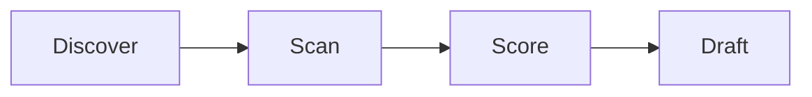
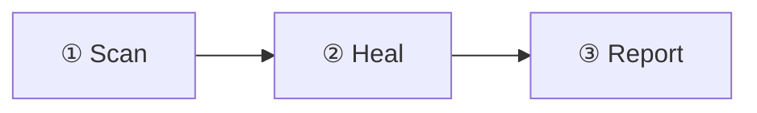

# Upgrade a post with the site's components

Turn a plain post or doc into a richer one by adding the right reusable component. This
skill is the **catalog + decision guide**: what each component is, when it earns its place,
the MDX to drop in, and what bites. It is content-origin-agnostic — use it on any
`blog/`, `designs/`, or `docs/` page.

There are TWO doc surfaces this complements, don't duplicate them:
- **Reader-facing** how-to lives in `docs/craft/blogging/` (`embed-code`, `embed-diagrams`,
  `embed-external-components`, `embed-structural-components`, `diagramming/`). Those teach a
  reader to do it; THIS skill is the agent-facing "which component, when, and the gotchas."
- **Authoring mechanics** (frontmatter, MDX build-breakers) live in `author-blog-post`.

## First, the universal gotchas (every component)

- **Em-dash hook is BLOCKING.** Any literal `—` (U+2014) in reader-facing content
  (`docs/blog/designs/changelog` + `src/`) fails the edit. Use commas / periods / colons.
- **MDX build-breakers**: bare `<br>` (use `<br/>`), unescaped `{braces}`, a stray `<`
  before a space/digit, and bare `<https://…>` autolinks all break the build. See
  `author-blog-post`.
- **Draft discipline**: a content page needs an explicit `draft:` field; drafts render in
  dev (`:3000`) only, never in the prod build.
- **Re-import clobber**: on a page produced by `import-co-design`, anything you hand-add to
  the BODY is overwritten on the next re-import. Only enrich a finalized page you won't
  re-import, OR push the enrichment into the importer so it's reproducible. (The animated-
  diagram wrapper IS reproducible — it's stamped by the importer.)

## The catalog — what / when / how

### Animated mermaid diagram (marching dashes + traveling flow-dot)

WHAT: a mermaid diagram whose edges flow (marching-ants dashes) and, on FLOW diagrams, a
single dot that travels the edges in sequence. WHEN: a data/activity flow worth drawing the
eye through (pipelines, request/response, an experiment loop). NOT for static
context/relationship diagrams (the dot looks random there).

HOW: wrap the diagram in the opt-in class; state flow-intent via the wrapper class.

```mdx
<div className="mermaid-animated flow-dot">



</div>
```

- The marching dashes apply to ALL `.mermaid-animated` diagrams.
- The traveling DOT is gated CONTENT-wise by the WRAPPER CLASS: `flow-dot` forces it,
  `no-flow-dot` suppresses it; plain `mermaid-animated` lets the edge-label-verb heuristic
  decide. Mark genuine flows explicitly — the heuristic misses flows whose verbs are in node
  names with unlabeled edges.
- NOTE for co-design imports: the SOURCE mermaid block uses an `%% animate: flow|none`
  comment instead, and the importer converts it to the `flow-dot`/`no-flow-dot` class.
  Hand-authored diagrams use the class directly (above) — the `%%` comment is invisible at
  runtime (mermaid strips it), so it only works through the importer.
- Colors: do NOT hardcode `classDef`/`style fill:` — the site mermaid theme (light `base` +
  `dark`) handles both modes. Hardcoded fills break dark mode.
- Mechanism: CSS in `src/css/custom.css` + the `src/mermaid-flow-dot.js` client module.
  Honors `prefers-reduced-motion`. Full writeup: `docs/craft/blogging/diagramming/animated-diagrams`.

### DiagramWithFootnotes (numbered legend)

WHAT: a diagram + a generated numbered legend (①②③) tying badges in the mermaid labels to
explanations. WHEN: a diagram with steps that each need a sentence of context. HOW:

```mdx
import DiagramWithFootnotes from '@site/src/components/DiagramWithFootnotes';

<DiagramWithFootnotes notes={['Scanner finds CRO problems', 'Agent ideates + tests', 'Winners ship']}>

</DiagramWithFootnotes>
```

Registered in `MDXComponents` (no import needed in docs, but importing is harmless). MANUAL
opt-in — a re-import would clobber it, so only on finalized pages.

### Mockup (UX mockups — show what it LOOKS like)

WHAT: a framed, theme-aware wrapper (`browser` / `window` / `phone` / `none` chrome) that
turns LIVE HTML/CSS into a UI mockup. WHEN: a design post needs to paint the picture — what
a screen/layout would look like — not just how it works. The "screen" is real HTML so it
adapts to light/dark, scales, and is version-controlled (no screenshots, no external embeds).
HOW:

```mdx
import Mockup from '@site/src/components/Mockup';

<Mockup chrome="browser" title="Review Studio" url="review.studio/doc/hld" caption="…">
  <div style={{display:'flex'}}>
    <nav>…sidebar…</nav>
    <main>…document + comment pins…</main>
    <aside>…comment thread + a CTA button…</aside>
  </div>
</Mockup>
```

- Keep the inner HTML simple + semantic (a few divs/buttons with light inline styles using
  `var(--ifm-*)` tokens so it stays on-brand and theme-aware). It is an impression, not a
  pixel-perfect build.
- **On an imported co-design**, do NOT hand-add the mockup to the post body (a re-import
  clobbers it). Put it in a **sidecar component** `designs/_mockups/<name>.mdx` (a default-
  exported React component of `<Mockup>` blocks) and link it from the post's frontmatter
  `mockups: ./_mockups/<name>.mdx`. The importer injects `import Mockups … <Mockups/>` after
  the truncate marker and **preserves it across re-imports**, and never regenerates the
  sidecar. See `import-co-design`.

### Admonitions (callouts)

WHAT: `:::note / :::tip / :::info / :::warning / :::danger` styled boxes (enabled by default).
WHEN: a scope note, an assumption, a caveat, a "do this" tip — anything that should stand
apart from body prose. HOW:

```mdx
:::note[Scope]
Phase 1 only; self-healing is out of scope.
:::
```

`import-co-design` auto-converts labeled blockquotes (`> **Scope note:** …`) to these.

### Carousel / CategoryCarousel

WHAT: a horizontally-scrollable card row. WHEN: a set of links/resources/comparisons (e.g.
reference carousels). HOW: `import Carousel from '@site/src/components/Carousel'` →
`<Carousel items={[…]} />`. For a post's reference carousels, prefer the `refresh-references`
skill (it manages the data file + provenance) over hand-authoring.

### SvgVariantGrid

WHAT: a grid of SVG variants with a light/dark toggle + fixed preview heights. WHEN: showing
design iterations / a gallery of generated SVGs (e.g. logo or pattern variants). HOW:
`<SvgVariantGrid variants={VARIANTS} group="final" previewHeights={[40]} />` (variants from a
sibling `_*-variants.js`). Model: the binary-pyramid / rosette design posts.

### Premium / PremiumGate

WHAT: `<Premium>…</Premium>` soft-gates an inline span (blurred for anonymous); `<PremiumGate>`
is the whole-doc hard gate (injected by the rehype plugin when `premium: true`). WHEN:
gating paid/exclusive content. The POLICY ("should this be premium?") is owned by
`manage-premium-content`; the marking mechanics by `author-blog-post`. Don't gate casually.

### ShareButton

WHAT: a copy/email/LinkedIn/X share row with ingress-attributed URLs. Mostly auto-placed by
the theme near the H1; rarely hand-added. Tune the share text via the `description:`
frontmatter (see `manage-frontmatter-descriptions`).

### Evidence footnotes

WHAT: GFM caret-style footnotes whose definition is an Evidence component (attrs: repo, sha,
path, lines, note) that renders a pinned GitHub permalink (privacy-gated). WHEN: citing a
specific commit/line range in a sibling repo as proof. Validated by `validate-footnotes.js`
(the SHA/path/lines must resolve). For plain external-URL citations, use a normal GFM
footnote without the Evidence component; `import-co-design` produces those. See an existing
post that uses Evidence (e.g. the image-to-DSL Thoughts post) for the exact syntax.

### Timeline / Card / Tabs

- `Timeline` + `TimelineItem` — sequenced events (retrospectives, phases).
- `Card` — a boxed callout with optional shadow.
- `Tabs` + `TabItem` (`@theme/Tabs`) — alternative views of the same thing (per-platform,
  per-option). Model: the genai-agent-design post.

## Workflow — upgrading a page

1. **Read the page** and identify what's flat: a wall of prose, a static diagram, a list of
   links, an un-styled caveat, repeated "see X" references.
2. **Match to a component** from the catalog (one per problem; don't over-decorate).
3. **Check re-import safety**: is this page produced by `import-co-design`? If so, either
   only add re-import-safe enrichments (the animated wrapper) or push the change into the
   importer. Otherwise hand-edit freely.
4. **Add the MDX**, mindful of the universal gotchas (no `—`, valid JSX, draft field).
5. **Verify**: `yarn build` (clean) and, for anything client-rendered (mermaid, the flow-dot,
   Premium), a real-browser check (`yarn start` :3000, or a Playwright spec) — static HTML
   can't prove client-rendered components.

## Troubleshooting

| Symptom | Cause | Fix |
|---|---|---|
| Edit blocked on an em-dash | `—` in the new text | Use a comma/period/colon. |
| `MDX compilation failed … Unexpected character` | bare `<url>`, stray `<`, or unescaped `{` | wrap URLs as `[text](url)`, escape `<` to `&lt;`, escape/space braces. |
| Mermaid diagram doesn't animate | missing the `.mermaid-animated` wrapper, or the CSS selector doesn't match | wrap it; the edge selector is `path.flowchart-link` under `.docusaurus-mermaid-container`. |
| Flow-dot missing on a real flow | the label heuristic didn't see verbs (they're in node names) | add `%% animate: flow` to the mermaid block. |
| Diagram colors wrong in dark mode | hardcoded `classDef`/`style fill:` overriding the theme | remove the color directives; let the light/dark theme color it. |
| Component renders blank / build OK but nothing shows | client-only component not registered, or `draft:true` hiding the page in prod | register in `MDXComponents`; check on the dev server. |

## Files

- `bytesofpurpose-blog/src/components/` — the components (DiagramWithFootnotes, Carousel,
  SvgVariantGrid, Premium, PremiumGate, ShareButton, Timeline, Card, …).
- `bytesofpurpose-blog/src/theme/MDXComponents.tsx` — what's globally available in MDX.
- `bytesofpurpose-blog/src/mermaid-flow-dot.js` + `src/css/custom.css` — the animation.
- `docs/craft/blogging/embed-*` + `diagramming/` — the reader-facing how-to docs.

## Learnings log (newest first)

- 2026-06-22 — Created. Carved the component catalog out of import-co-design so enrichment is
  a reusable concern. Animated-diagram nuances (two-tier dashes+dot, `%% animate` directive,
  no hardcoded colors) are the most load-bearing entries; full reader writeup is the
  diagramming/animated-diagrams doc.
