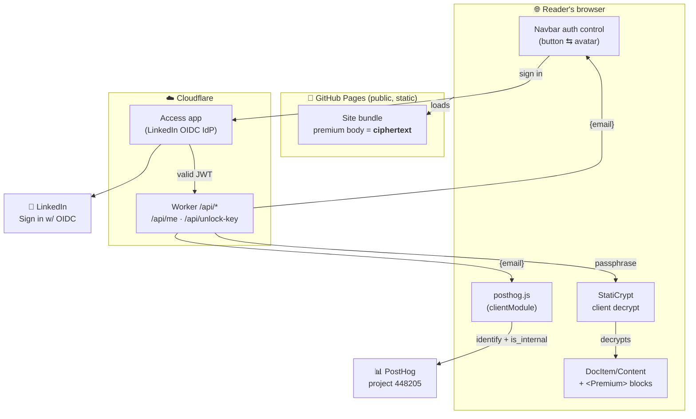
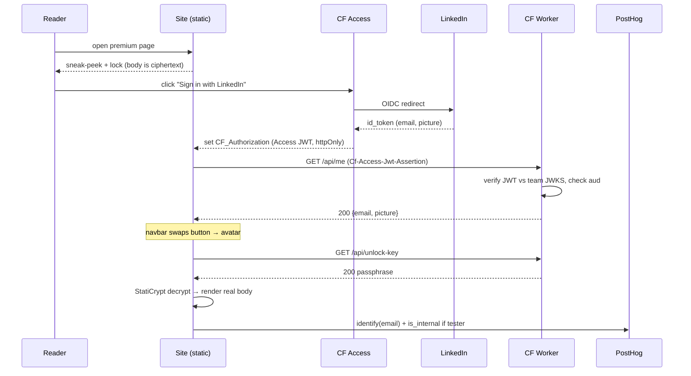
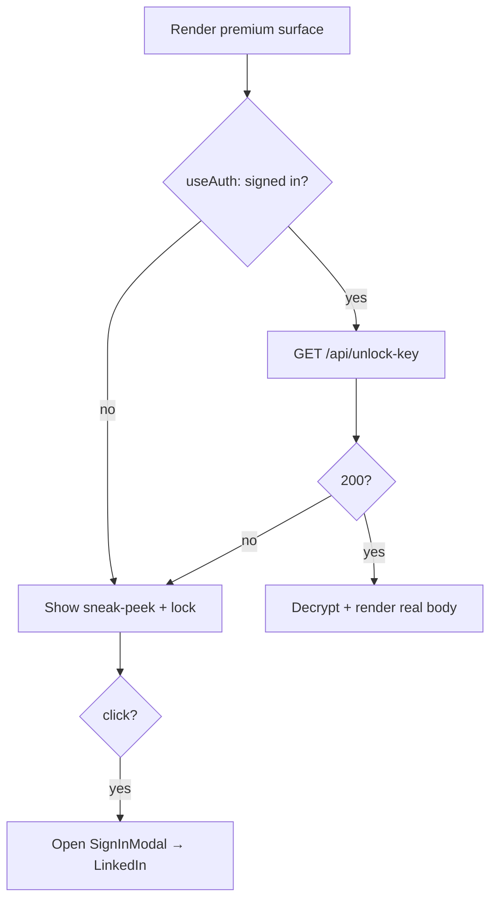

# Plan: Internal-analytics filtering + Debug links + LinkedIn-gated premium content

## ⏱ STATUS (last updated 2026-06-02)

**✅ CODE-COMPLETE — all phases done, committed to branch `feat/premium-content-gating`
(commit `ea20f66e`, 54 files). NOT yet live; go-live blocked only on user Cloudflare steps.**

Session-final additions (all verified, all in the commit):
- F-polish: #17 localhost sign-in toast (`isApiUnreachable()` in `auth.tsx`), #16
  `premium_interest` interest button on SignInModal (+ posthog-integration-plan catalog),
  #18 `make build-premium` cache-bust target + cache-gotcha docs (deploy-site + memory),
  #15 brand theming of PremiumGate/SignInModal/Premium + #15b Playwright theming assertions.
- Skills: S2 setup-posthog internal-user filtering; S4 author-blog-post premium mechanics;
  S5 new `manage-premium-content` policy skill.
- #14 white-on-white easter egg + honest "gate protects deployed site not public source"
  caveat; #11 Phase G design-doc reconciled to the shipped impl.
- VERIFIED: premium e2e 2/2 (hard-gate + decrypt round-trip + brand-border assertions),
  navbar-auth 2/2, Worker JWT 7/7, V5 clean on a cache-busted encrypted build,
  validate-structure 0 errors, validate-links clean, 383 MDX compile. Changelog batch
  archived (2026-06-02) + generate-changelog-data run; completed tasks pruned.

**REMAINING (all user-owed; tracked as live tasks #19–#24):**
- #19 add `Workers Scripts/Routes: Edit` to `CF_API_TOKEN`.
- #20 set a REAL `STATICRYPT_PASSPHRASE` in gitignored `.env` (must == Worker secret).
- #21 `wrangler secret put PREMIUM_PASSPHRASE` (== #20) + `wrangler deploy` the access-gate
  Worker — until done `/api/unlock-key` 404s and premium never decrypts in prod.
- #23 deploy-site (`make build-premium` → V5 → gh-pages) — blocked on #20.
- #24 (optional) un-draft `designs/2026-06-02-premium-content-gating.mdx`.

---

**Done & verified (with runnable evidence):**
- **Phase A** ✅ — DebugMenu "Links" section. New
  `src/components/DebugMenu/sections/LinksSection.tsx` + registered in
  `index.tsx` SECTIONS + `.links/.link` CSS. Verified: section renders live;
  `make test-prod-checks` 35/35 pass (incl. dev-only-surfaces — nothing leaks to prod).
- **Phase B** ✅ — Internal-analytics filtering. B1 `?internal=1` super-prop +
  URL-strip in `src/posthog.js`; B2 `src/internal-testers.ts` (consumed in D).
  Verified live: `is_internal=true` + `localStorage.bop_internal` set; URL stripped;
  fresh isolated browser clean. B0 (PostHog UI filter) + S2 doc still TODO (task #15).
- **Decrypt-crux prototype** ✅ — StatiCrypt's `lib/cryptoEngine.js`+`codec.js` expose a
  programmatic `decode(msg, hashedPassword, salt)` (fixed passphrase, NO prompt UI):
  AES-CBC + PBKDF2(600k) + HMAC-SHA256. **Proven end-to-end:** Node-encrypted body
  decrypts in the real browser via `window.crypto` in ~51ms; wrong passphrase rejected.
  Decision: use staticrypt's engine (don't hand-roll); ship salt+ciphertext in the
  bundle (salt isn't secret), Worker vends only the passphrase; ONE global passphrase.
- **Phase C** ✅ — Worker + Access. `workers/access-gate/` (`src/index.ts`,
  `wrangler.toml`, `package.json`, `tsconfig.json`, `test/worker.test.mjs`):
  `/api/me` + `/api/unlock-key`, validates `Cf-Access-Jwt-Assertion` vs team JWKS,
  checks `aud`, CORS-locked, no-store. **7/7 JWT-gate unit tests pass** (`npm test`,
  real jose verify w/ injected local keyset via `__jwksResolver` test seam);
  `wrangler deploy --dry-run` builds for workerd.
  - **KEY FINDING:** the LinkedIn OIDC IdP **already exists** on this account — the
    sibling repo `/Users/omareid/workplace/git/private-site` configured it
    (`agent/sync-access-emails.sh`, IdP id `cf942d89-9ecb-49a0-909c-f46dcdd9f9e8`,
    team domain `bytesofpurpose.cloudflareaccess.com`, JWKS live). So **the Access
    side is fully CLI — no dashboard.**
  - **S1** ✅ — `manage-cloudflare-access` extended: `cf_access.py` gained
    `list-idps`, `show-idp`, `create-gated-app <paths…> --policy linkedin-any`
    (resolves the IdP id from an existing policy → needs only `Apps:Edit`),
    `delete-app <id>`. SKILL.md documents it all + token-scope + Worker deploy.
  - **LIVE:** one consolidated Access app `Access Gate (blog /api/*)`
    (id `844eef3a-a277-44a5-8f28-8c3a634c8d07`) covers BOTH `/api/me` and
    `/api/unlock-key` → single **`POLICY_AUD = fe391e80ed513298c3bd38a0c10765691337d568cf495c09d54d631a63555326`**
    (written into `wrangler.toml`; `TEAM_DOMAIN` also pre-filled). Verified:
    `curl -I .../api/me` → 302 to LinkedIn login. *(Worker not yet deployed → a
    signed-in request passes Access but 404s at GH-Pages origin until deploy.)*
- **Phase G** 🟡 STARTED — `designs/2026-06-02-premium-content-gating.mdx`
  (`draft: true`, slug `design-premium-gating`, sidebar_position 5). Renders live
  with all 3 Mermaid diagrams as SVG; FAQ added (no-password sign-in flow; "premium
  needs no URL prefix — Access gates only /api/*"; why-not-React; key security;
  localhost). validate-structure/links clean. *Final pass deferred until F settles.*

**Manual steps the USER still owes (only these block go-live; not code):**
1. Add **`Workers Scripts: Edit` + `Workers Routes: Edit`** to `CF_API_TOKEN`.
2. `cd workers/access-gate && npx wrangler secret put PREMIUM_PASSPHRASE`
   (MUST equal `STATICRYPT_PASSPHRASE` used by the encrypt step) `&& npx wrangler deploy`.
   *(LinkedIn dev-app + CF login method are ALREADY done via private-site — skip.)*

**Left to build (all code-only; D & E degrade gracefully w/o the deployed Worker):**
- **Phase D** ✅ DONE — `/api/me` → `identify()` + internal-tester filter wired in
  `posthog.js`. Verified live on :3000 (localhost returns 200+HTML → `r.json()` throws →
  `.catch` no-ops → stays anonymous; zero console errors). Comment corrected (localhost
  is 200+HTML, not 404).
- **Phase E (+V4)** ✅ DONE — `src/lib/auth.tsx` (`AuthProvider`/`useAuth`/`signIn`/
  `signOut`, one shared `/api/me` in `Root.tsx`); `src/components/AuthNavbarItem`
  (BrowserOnly button⇆avatar+dropdown); `'custom-auth'` registered; navbar item
  `position:right`. Verified live (anon=Sign in; stubbed JSON=avatar OE+dropdown);
  V4 e2e `test/e2e/navbar-auth.spec.ts` 2/2 pass; 9/9 dev specs no regression.
- **M1** ✅ DONE — `premium-gating-architecture.md` memory + MEMORY.md pointer.
- **Phase F** (+V1,V2,V3,V5,S3,S4,S5) 🟡 IN PROGRESS — see the F-progress block below.
- **S2** — PostHog internal-filter docs (with B0). **Phase G** finalize after F.

**⚙️ Phase F progress + the OPEN DECISION (2026-06-02):**
DONE in F so far (verified where noted):
- Decrypt crux RE-PROVEN in Node: staticrypt `encode`/`decode` round-trips, wrong
  passphrase rejected, ciphertext excludes plaintext (enc ~83ms). staticrypt added as
  devDependency.
- **Lockstep trio (V1+V2+hook)** ✅ — `validate-docs-structure.js` `premium-type` /
  `premium-draft-conflict` / `premium-needs-teaser` warn rules; `draft-docs` plugin now
  also publishes `premiumPermalinks` (V2); `validate-docs-structure-hook.sh` premium
  advisory. ALL verified with fixtures (good=clean, bad=premium-type, conflict=both
  rules + hook prints + exits 0).
- `src/lib/premium-crypto.ts` (client decrypt via staticrypt engine), `fetchUnlockKey()`
  in `auth.tsx` (matched to the Worker's actual `{passphrase}` shape, NOT `{key}`).
- `src/components/SignInModal` (+ host mounted in `Root.tsx`) — event-dispatch modal,
  `openSignInModal({what})`.
- **CRUX FINDING (proven):** post-build HTML strip is NOT a hard gate — the body also
  ships in a JS chunk (`build/assets/js/*.js`, verified verbatim). DECISION (user):
  **encrypt at MDX-compile time** via a remark plugin so plaintext is in neither the HTML
  nor the JS bundle. `scripts/encrypt-premium.js` + `scripts/verify-premium-encrypted.js`
  + `scripts/lib/premium-docs.js` + `PremiumGate` were first written for the HTML-strip
  model and are being REPLACED/REWORKED for the compile-time model.
- `plugins/remark-premium-encrypt.js` — written (premium body → ciphertext sidecar
  `static/premium/<id>.json`, body replaced with `<PremiumGate payload teaser/>`).

**DECISIONS MADE (user-confirmed):**
- Render-after-decrypt → **encrypt rendered HTML at the rehype stage**; client decrypts +
  `dangerouslySetInnerHTML`. Tradeoff accepted: interactive MDX React components inside a
  premium body won't rehydrate (prose/code/images fine).
- Crypto impl → **depend on the staticrypt package** for the BUILD encrypt (codec/engine),
  but the CLIENT decrypt is a small pure-WebCrypto re-impl (byte-compatible, PROVEN) — the
  staticrypt engine `require("node:crypto")`s, which webpack can't bundle for the browser.

**DONE in F (proven with evidence):**
- `plugins/rehype-premium-encrypt.js` — encrypts `premium:true` body HTML at compile to
  `static/premium/<id>.json`, replaces body with `<PremiumGate payload teaser/>`. Preserves
  top-level `mdxjsEsm` nodes (else `Cannot compile unknown node 'mdxjsEsm'`).
- HARD-GATE PROVEN on a CLEAN cache-cleared build: sentinel `PREMIUMSENTINELBODY` in
  NEITHER the HTML NOR any JS chunk NOR anywhere in build/ — only the ciphertext sidecar.
- `src/lib/premium-crypto.ts` pure-WebCrypto decrypt; `src/components/PremiumGate` (fetch
  key+payload→decrypt→inject); `src/components/Premium` (inline SOFT gate, blur); both
  registered in `MDXComponents`; `SignInModal` + host in `Root.tsx`; sidebar `LockBadge`
  (prod-visible, mirrors draftBadge) wired into `DocSidebarItem/Link`.
- V5 `scripts/verify-premium-encrypted.js` REWRITTEN for the compile-time model: greps the
  WHOLE build (HTML+JS+JSON) for each premium doc's body fingerprints (must be absent) +
  sidecar present & ciphertext. PROVEN to catch an injected leak (exit 2) and pass clean
  (exit 0). Wired: deploy-site step 3b + `.githooks/pre-push` + `make verify-premium`.
- `scripts/lib/premium-docs.js` shared enumerator (payloadId in lockstep w/ the plugin).
- e2e `test/e2e/premium-gating.spec.ts` + `premium` Playwright project + `make
  test-premium-e2e`: the UNLOCK round-trip test PASSES against the real encrypted build
  (signed-in decrypt works end-to-end); anonymous V3 test being finalized (payload-URL
  lookup fix).
- Skills: S3 deploy-site updated (encrypt env + V5 gate + token scope). Demo fixture
  `docs/craft/premium-gating-demo.mdx`.

**⚠️ CACHE GOTCHA (found, dangerous):** `node_modules/.cache` (webpack) + `.docusaurus` can
serve a premium doc's STALE compiled output, so the rehype plugin doesn't re-run → no
sidecar → V5 fails (deploy aborts, good) but a naive build looks "done" while shipping
plaintext. Clearing `node_modules/.cache` makes the encrypt deterministic. → task #18.

**STILL TODO in F + follow-ups (all tracked as tasks; user-requested additions noted):**
- Finalize the anonymous V3 e2e assertion (#13).
- **#16 (user):** SignInModal gets a "track interest in making this public" button →
  PostHog `premium_interest` event (+ catalog in posthog-integration-plan.md).
- **#17 (user):** sign-in on localhost must degrade gracefully (today `/api/me?redirect_url`
  404s in dev) — toast instead of dead nav, for navbar + modal CTAs.
- **#18 (user):** cache-bust premium encryption (clear node_modules/.cache in deploy +
  e2e; maybe a postBuild copy/assert plugin; document the gotcha).
- **#15 (user):** theme the premium gate + SignInModal to feel part of the blog (branded);
  NB our arch uses NO staticrypt password page — the reader-facing surfaces are the gate +
  modal; theme the staticrypt password_template.html only if a no-JS fallback is wanted.
- **#14 (user):** white-on-white easter egg in the System Design: premium is free via the
  public GitHub repo (source MDX is public; only the BUILT site encrypts) — honest + fun.
- S4 author-blog-post (how to mark premium) + S5 new `manage-premium-content` skill.
- Phase G (#11) finalize; S2 (#9) PostHog internal-filter docs.

**KEY HONEST CAVEAT to document (Phase G):** the hard-gate protects the DEPLOYED site, not
the source. The repo is PUBLIC, so the premium MDX is readable on GitHub. The easter egg
(#14) turns this into a wink rather than a hidden gap.

See the per-phase sections + the V/S/M checklist below for specifics.

## Context

Two needs, which the conversation merged into one coherent system:

1. **Filter the author's own (and testers') traffic out of analytics.** Today every
   visitor is anonymous (`src/posthog.js`; `person_profiles: 'identified_only'`, no
   `identify()` call). PostHog drops bot UAs but has no notion of "internal." The user
   wants internal traffic keyed off **a signed-in email being on an internal-tester
   list**, plus quick layers that work before sign-in.
2. **Quick debugging launchpad.** A "Links" section in the existing localhost-only
   floating DebugMenu pointing at PostHog settings, GitHub Actions, and GA4.

These pulled in a larger feature the user wants built end-to-end:

3. **LinkedIn sign-in + premium/gated content.** Mark content `premium: true` in
   frontmatter; non-signed-in readers see a **sneak-peek/placeholder with a lock**, and
   clicking it opens a **modal nudging them to sign in with LinkedIn**. Sign-in is via
   **Cloudflare Access with the native LinkedIn OIDC IdP**. The auth control lives in the
   **navbar next to the light/dark toggle** — a "Sign in" button when anonymous, a
   **profile avatar/picker** when signed in. Internal-tester filtering then keys off the
   signed-in email.

### The hard problem and the chosen answer

The site is **static (GitHub Pages behind Cloudflare proxy)**, so swizzle-based gating is
client-side only — premium MDX would still ship in the page source. The user's insight
resolves this: combine **StatiCrypt-style encryption** with a **Cloudflare Worker that
vends the decryption key only to signed-in users**. Premium content ships **encrypted**
in the public bundle; the Worker (sitting behind Cloudflare Access) returns the passphrase
only when the request carries a valid Access JWT (a logged-in LinkedIn user). The client
decrypts in-browser. This is genuinely hard-gated yet keeps the static deploy model — no
content proxying required, only a tiny key endpoint.

### System architecture (how the pieces fit)



### Auth + key-vend sequence (the hard gate)



Verified facts grounding this plan:
- DebugMenu (`src/components/DebugMenu/index.tsx`) is double-gated (`NODE_ENV!=='production'`
  && `isLocalhost()`) with a pluggable `SECTIONS: DebugSection[]` array (line 17). Sections
  conform to `DebugSection` (`types.ts`); `ExperimentsSection.tsx` is the model.
- `src/posthog.js` is a Docusaurus clientModule; its `loaded` callback (line 63) is the
  hook point. `person_profiles: 'identified_only'` means a single `identify(email)` promotes
  a visitor to a real person.
- The **`draft-docs` plugin** (`plugins/draft-docs/index.js`) already reads a per-doc
  frontmatter flag (`draft: true`) and publishes permalinks as global plugin data; a
  swizzled `DocSidebarItem/Link/index.tsx` renders a badge via `useAllPluginInstancesData`,
  and `DocItem/Content/index.tsx` is already swizzled. **`premium: true` mirrors this
  exactly.**
- Custom navbar items are already supported via `src/theme/NavbarItem/ComponentTypes.tsx`
  (a `custom-coffee` precedent exists) — so the auth control drops in as a custom navbar
  item with **no full Navbar swizzle**.
- Cloudflare Access has a **native LinkedIn OIDC IdP** ("Sign in with LinkedIn"); identity
  (email) flows downstream in the Access JWT (`Cf-Access-Jwt-Assertion` header),
  validated against the team JWKS at `/cdn-cgi/access/certs`.
- `manage-cloudflare-access` (`cf_access.py`) only does wildcard-private + per-host bypass
  today — **no Workers, no IdP, no path-scoped apps.** It must be extended.
- `welcome.mdx` no longer exists (folded into the homepage); the homepage is
  `src/pages/index.tsx`.

---

## Phase A — DebugMenu "Links" section *(ships nothing to prod)*

**Create** `src/components/DebugMenu/sections/LinksSection.tsx` — mirror
`ExperimentsSection.tsx`: export a `DebugSection` const (`id: 'links'`, `title: 'Links'`).
A one-line-to-extend `LINKS` array:

```ts
const LINKS = [
  {label: 'PostHog · internal-user filtering',
   href: 'https://us.posthog.com/project/448205/settings/project-product-analytics#internal-user-filtering'},
  {label: 'GitHub Actions', href: 'https://github.com/omars-lab/omars-lab.github.io/actions'},
  {label: 'GA4 · Intelligent Home',
   href: 'https://analytics.google.com/analytics/web/#/a195952157p286298793/reports/intelligenthome'},
];
```

`render` maps to `<a target="_blank" rel="noopener noreferrer">`.

**Modify** `src/components/DebugMenu/index.tsx`: import `linksSection`, add it to `SECTIONS`
(line 17).

**Modify** `src/components/DebugMenu/styles.module.css`: add `.links` (flex column) + `.link`
anchor styling reusing `--ifm-color-primary` and `word-break: break-all`.

**Verify:** `make` dev server, open FAB → "Links" section, click each. The prod-build e2e
`test/e2e/dev-only-surfaces.spec.ts` stays green (gate unchanged).

---

## Phase B — Layered internal-analytics filtering

**B0 (PostHog UI, no code):** In project `448205` → internal-user filtering, add filters on
`$host = localhost / 127.0.0.1` and on `is_internal = true`. Document in `setup-posthog`.

**B1 — opt-in super property** in `src/posthog.js`, inside `loaded` (after
`window.posthog = ph;`, ~line 66):

```js
const p = new URLSearchParams(window.location.search);
if (p.get('internal') === '1') localStorage.setItem('bop_internal', '1');
if (localStorage.getItem('bop_internal') === '1') ph.register({is_internal: true});
```

`register` persists the super-prop, so `/?internal=1` is a one-time visit per browser.
(Optionally strip `internal` from the URL via `replaceState`, matching the `im`-marker strip.)

**B2 — email-list filter** (wired once auth lands, Phase D). **Create** `src/internal-testers.ts`:

```ts
export const INTERNAL_TESTER_EMAILS: ReadonlyArray<string> = ['omar_eid21@yahoo.com'];
export const isInternalTester = (e: string) =>
  INTERNAL_TESTER_EMAILS.some(x => x.toLowerCase() === e.toLowerCase());
```

**Verify:** load `/?internal=1`, console-check `posthog.persistence.props.is_internal`; confirm
a fresh browser is clean; confirm PostHog reports hide tagged events (`query-posthog`).

---

## Phase C — Auth infra: LinkedIn IdP + Cloudflare Worker (key-vending + identity)

> **UPDATE (2026-06-02): the LinkedIn IdP already exists — the Access side is now
> fully CLI, no dashboard.** The sibling infra repo `private-site` already
> configured a *Sign in with LinkedIn* OIDC login method on **the same Cloudflare
> account** (`e22f4531704a3141ddb150ac47eabc87`); its `*.bytesofpurpose.com`
> "Private Site" app gates on `login_method id = cf942d89-9ecb-49a0-909c-f46dcdd9f9e8`
> (`private-site/agent/sync-access-emails.sh`). The team domain
> `bytesofpurpose.cloudflareaccess.com` is verified live (JWKS → 200, 2 keys).
> So the original manual steps 1–3 below are **already done / now scripted**:
> - LinkedIn dev app + CF login method → **already exist** (reused, not recreated).
> - Creating the path-scoped Access app → **`cf_access.py create-gated-app`** (CLI).
>   It resolves the LinkedIn IdP id from an existing app policy, so it needs only
>   `Access: Apps: Edit` (the token has it) — NOT the `Identity Providers: Read`
>   scope that *listing* IdPs requires. Verified: `resolve_linkedin_idp_id()`
>   returns `cf942d89-…` with the current `omars-lab` token.
>
> The ONLY genuinely-manual items left for the auth infra are the **Worker secret +
> deploy** (and adding `Workers Scripts: Edit` + `Workers Routes: Edit` to
> `CF_API_TOKEN`) — see "Deploy the Worker" in `manage-cloudflare-access`.

**Original manual dashboard steps — superseded by the UPDATE above (kept for record):**
1. ~~LinkedIn developer app~~ → already exists (private-site).
2. ~~CF Zero Trust → Login methods → Sign in with LinkedIn~~ → already configured.
3. **Create the path-scoped Access app** → now `cf_access.py create-gated-app
   blog.bytesofpurpose.com/api/me --policy linkedin-any` (+ `/api/unlock-key`).
   It prints the **AUD tag** → the Worker's `POLICY_AUD`.

**Create the Worker** (new repo dir `workers/access-gate/`):
- `workers/access-gate/src/index.ts` with two routes (both behind the Access app):
  - **`GET /api/me`** — validate `Cf-Access-Jwt-Assertion` against the team JWKS
    (`createRemoteJWKSet` of `https://<team>.cloudflareaccess.com/cdn-cgi/access/certs`),
    check `aud` == `POLICY_AUD`, return `{email}` (200) or 401. CORS allow
    `https://blog.bytesofpurpose.com`, `credentials: include`.
  - **`GET /api/unlock-key`** — same validation; on success return the **StatiCrypt
    passphrase** (the `PREMIUM_PASSPHRASE` Worker secret). Anonymous → 401 (Access 302s to
    LinkedIn before the Worker even runs). This is the key-vending endpoint.
- `workers/access-gate/wrangler.toml` — routes `blog.bytesofpurpose.com/api/me` and
  `/api/unlock-key`; `account_id = e22f4531704a3141ddb150ac47eabc87`; vars `TEAM_DOMAIN`,
  `POLICY_AUD`; secret `PREMIUM_PASSPHRASE` (via `wrangler secret put`). Bundle `jose`.

**Extend `manage-cloudflare-access`** (`cf_access.py` + `SKILL.md`): add `create-gated-app
<path> --policy linkedin-any` (POST an Access app on the `/api/*` paths, returns the AUD
tag), `list-idps`/`show-idp` (read-only). `create-gated-app` resolves the LinkedIn IdP id
via `resolve_linkedin_idp_id()` (reads it off an existing app policy → only needs
`Apps: Edit`, with `cf942d89-…` as a known fallback). Document `wrangler deploy` for the
Worker. **`CF_API_TOKEN`** needs `Workers Scripts: Edit` (+ `Workers Routes: Edit`) added
for `wrangler deploy` — the Access side works with the current token. **DONE** (Phase C):
Worker built + 7/7 JWT-gate unit tests pass; `wrangler deploy --dry-run` builds for
workerd; resolver verified live; `TEAM_DOMAIN` pre-filled in `wrangler.toml`.

**Verify:** unauthenticated `curl -I .../api/me` → 302 to `*.cloudflareaccess.com`. After
LinkedIn login in a browser, `fetch('/api/me',{credentials:'include'})` → `{email}`;
`/api/unlock-key` → passphrase. `curl` without cookie → 401.

---

## Phase D — `identify()` + internal-email filter wired to auth

**Modify** `src/posthog.js`, inside `loaded` (after B1), import `isInternalTester`:

```js
fetch('/api/me', {credentials: 'include'})
  .then(r => r.ok ? r.json() : null)
  .then(d => {
    if (!d?.email) return;
    ph.identify(d.email);                              // promotes to a real person
    if (isInternalTester(d.email)) ph.register({is_internal: true});
  })
  .catch(() => {});                                    // localhost / anon: silently no-op
```

On localhost `/api/me` 404s → `.catch` swallows it; dev stays anonymous (B1 still tags it).

**Verify:** tester signs in → PostHog person `distinct_id = email`, `is_internal:true`;
non-tester → identified, no flag; anonymous → no identify.

---

## Phase E — Navbar auth control (button → avatar)

**Create** `src/components/AuthNavbarItem/index.tsx` (+ `styles.module.css`), wrapped in
`<BrowserOnly>` (it touches `fetch`/`window`):
- On mount, `fetch('/api/me', {credentials:'include'})`.
- **Anonymous** → a **"Sign in with LinkedIn"** button linking the Access entry point
  (hitting any `/api/*` or a dedicated `/cdn-cgi/access/login/<team>` URL triggers the
  LinkedIn flow, then returns).
- **Signed in** → a **profile picker**: avatar (LinkedIn picture if the OIDC `picture`
  claim is returned via `/api/me`, else initials) + a small dropdown (email, "Sign out" →
  `/cdn-cgi/access/logout`).
- Expose the signed-in email/state via a tiny React context (`src/lib/auth.tsx`,
  `useAuth()`) so `<Premium>` (Phase F) and the modal reuse one `/api/me` fetch instead of
  refetching.

**Register** the navbar item: in `src/theme/NavbarItem/ComponentTypes.tsx` add
`'custom-auth': AuthNavbarItem` (follow the `custom-coffee` precedent); in
`docusaurus.config.js` `navbar.items` add `{type: 'custom-auth', position: 'right'}` so it
renders on the right, **next to the color-mode toggle** (Docusaurus places the toggle at the
end of the right group; a right-positioned custom item sits beside it).

**Verify:** anonymous → "Sign in with LinkedIn" beside the dark-mode toggle; after login →
avatar + dropdown with email and sign-out.

---

## Phase F — Premium frontmatter + encrypted gating + locked-component UX

**Frontmatter flag + sidebar lock badge** (mirror the draft mechanism):
- **Extend** `plugins/draft-docs/index.js` to also read `data.premium === true` and publish
  `premiumPermalinks` alongside `draftPermalinks` in the plugin's global data.
- **Add** a `LockBadge` (copy `src/theme/DocSidebarItem/draftBadge.tsx`) and render it in
  `src/theme/DocSidebarItem/Link/index.tsx` via a `useIsPremium(href)` hook reading
  `useAllPluginInstancesData('draft-docs-plugin')`.
- **Extend** `scripts/validate-docs-structure.js` (per CLAUDE.md's "structure decisions must
  update the checks" convention) with a `premium-*` warn-tier rule set.

**Encryption pipeline (StatiCrypt, hard gate):**
- **Build step** `scripts/encrypt-premium.js` (run post-Docusaurus-build, before deploy):
  walks the built `premium` HTML/MDX-rendered output, encrypts the article body with
  StatiCrypt CLI using `STATICRYPT_PASSPHRASE` (the same secret the Worker vends), and
  replaces the body with ciphertext + a placeholder/sneak-peek. Wire into the `deploy-site`
  flow (extend that skill + the `Makefile` build target).
- **Blocking safety gate** `scripts/verify-premium-encrypted.js` (V5) runs immediately
  after encryption and **before any `gh-pages` push**: it fails the deploy if any
  `premium: true` doc's built body still contains cleartext. The encrypt step is fallible
  (skipped, frontmatter typo, build-order regression); this gate guarantees no premium
  content is ever distributed unencrypted. It is a hard precondition + a pre-push hook.
- **Page-level gate** in the already-swizzled `src/theme/DocItem/Content/index.tsx`: if the
  doc is premium, render the **sneak-peek/placeholder** (first N words / a teaser already
  left in clear) + a lock; on the reader being signed in (`useAuth()`), `fetch('/api/unlock-
  key')`, decrypt the ciphertext client-side with the StatiCrypt decrypt routine, and render
  the real body. Anonymous → placeholder stays; clicking it opens the modal (below).

**`<Premium>` MDX wrapper** for inline blocks — **create**
`src/components/Premium/index.tsx`, register in `src/theme/MDXComponents.tsx`. Wrap any MDX
block: signed-in → render children (decrypted); anonymous → render a **blurred/placeholder
sneak-peek with a lock overlay**; click → opens the sign-in modal. Same decrypt path as the
page gate for truly-encrypted inline blocks (the build step encrypts marked regions); for
non-sensitive teasers it can simply blur the in-bundle children.

**Per-render gating logic:**



**Sign-in modal** — **create** `src/components/SignInModal/index.tsx` (+ a `ToastHost`-style
host, or reuse the existing modal/dialog styling from DebugMenu's `.panel`). Triggered by
clicking any locked surface: shows what the content is, a "Sign in with LinkedIn to unlock"
CTA (same Access entry as the navbar), and a dismiss. A small `useSignInModal()` context
opens it from anywhere (locked page, locked `<Premium>` block, navbar).

**Verify:** mark a doc `premium: true`; anonymous → sidebar lock badge, page shows
sneak-peek + lock, click → modal; **view-source confirms the body is ciphertext, not
plaintext** (the hard-gate proof). Sign in → key vended, body decrypts and renders. Add an
e2e: anonymous prod build → premium page body is encrypted and the modal CTA is present.

---

## Phase G — Document the design as a published System Design entry

The user wants this architecture documented as a first-class **System Design** (how the
blog itself is built), not just an internal plan. The site already serves these at
**`/designs`** via a blog-plugin instance (`docusaurus.config.js:178-201`, content in
`bytesofpurpose-blog/designs/`, dated `.mdx`, frontmatter `slug` + `sidebar_position` +
`draft`, intro → `<!-- truncate -->` → `## H2` sections). Note an existing
`2025-12-31-blog-design.md` — the new entry complements/supersedes it.

**Create** `bytesofpurpose-blog/designs/<today>-premium-content-gating.mdx` (use the
**`documenting-tech-designs`** skill to author it), `draft: true` until reviewed:
- `slug: design-premium-gating`, next free `sidebar_position`.
- Sections: **Problem** (gate content on a static site), **Constraints** (GitHub Pages +
  Cloudflare proxy, httpOnly JWT, no server), **Architecture** (embed the three Mermaid
  diagrams from this plan), **Why StatiCrypt + Worker key-vend** (the static-hard-gate
  insight), **Identity & analytics** (LinkedIn OIDC → `/api/me` → `identify` + internal
  filter), **Trade-offs**, **What ships to prod vs dev-only**.
- Reuse the Mermaid diagrams verbatim (the blog instance renders Mermaid via
  `@docusaurus/theme-mermaid` if enabled — verify it's in the config; if not, add it).

**Verify:** `make` dev → `/designs/design-premium-gating` renders with diagrams; runs
through `validate-docs-structure` / link checks clean.

---

## Validations & skills to add/update (tracked checklist)

Per CLAUDE.md ("structure/decision changes must update the checks" + "information goes in
the proper skill"), these are required as part of the work — not optional follow-ups:

| # | Artifact | Change |
|---|---|---|
| V1 | `scripts/validate-docs-structure.js` | Add `premium-*` warn-tier rules (frontmatter `premium: true` shape; mutually-sane with `draft`); register in the SEVERITY map. |
| V2 | `plugins/draft-docs/index.js` | Read `premium: true` → publish `premiumPermalinks` (mirrors `draftPermalinks`). |
| V3 | `test/e2e/dev-only-surfaces.spec.ts` (or a new spec) | Anonymous prod build: premium page body is **ciphertext** (not plaintext) + sign-in modal CTA present; `/api/me` & `/api/unlock-key` 401 without auth. |
| V4 | New e2e | Navbar shows "Sign in" anonymous / avatar when signed in; graceful degrade when `/api/*` unreachable. |
| **V5** | **New `scripts/verify-premium-encrypted.js` — BLOCKING deploy gate** | **The safety net for the whole hard-gate model. After the StatiCrypt encrypt step and before `gh-pages` push, scan the built output: for every doc whose source frontmatter is `premium: true`, assert its built HTML body does **not** contain the cleartext (compare against a known sentinel/marker injected into premium bodies, or hash the source body and grep its absence). Any premium doc whose plaintext is present, or any encrypt step that was skipped → **non-zero exit, deploy aborts**. Wire into `deploy-site` (after encrypt, as a hard precondition) AND as a `Stop`/pre-push hook so it can't be bypassed. This is ERROR-tier, not warn — unencrypted premium leaking is a silent security failure.** |
| S1 | `manage-cloudflare-access` (SKILL.md + `cf_access.py`) | LinkedIn IdP setup, path-scoped Access app (`create-gated-app`), Worker-route docs; note current wildcard/bypass-only model. |
| S2 | `setup-posthog` | `$host` + `is_internal` internal-user filters; `?internal=1` opt-in convention. |
| S3 | `deploy-site` + root `Makefile` | StatiCrypt encrypt build step (post-build, pre-deploy); `Workers Scripts: Edit` on `CF_API_TOKEN`; `wrangler deploy`. |
| S4 | `author-blog-post` (or `review-reader-experience`) | How to mark content `premium`, the sneak-peek/teaser convention, `<Premium>` usage. |
| **S5** | **New skill `manage-premium-content`** | **Owns the editorial *policy*, not the mechanics: the criteria for what is premium vs free vs draft (e.g. depth/originality/effort thresholds, lead-magnet intent), how to pick the sneak-peek/teaser portion, the tiering decision checklist, and how it composes with `draft`. The "should this be premium?" source of truth; S4 stays about the how-to-mark mechanics. Cross-links the V1/V5 validators so policy and enforcement stay in lockstep (per CLAUDE.md's skill-ownership convention).** |
| M1 | New memory file + `MEMORY.md` pointer | Auth/premium architecture (Cloudflare Access + Worker key-vend + StatiCrypt); link `[[craft-self-ia-split]]`, `[[cloudflare-and-analytics-setup]]`. |

These will be created as TaskCreate items at implementation start so progress is tracked
and the eventual changelog batch is accurate.

## Risks & trade-offs

1. **StatiCrypt + Worker-vended key is the crux.** StatiCrypt's CLI takes a fixed passphrase
   (`STATICRYPT_PASSPHRASE` env) and ships a client AES-CBC/PBKDF2 decrypt routine — so the
   same passphrase the Worker vends decrypts the page. The decrypt function must be invoked
   programmatically (not via StatiCrypt's password prompt UI); confirm the bundled
   `staticrypt` JS exposes a usable decrypt entry, else hand-roll the equivalent WebCrypto
   AES-CBC + PBKDF2(600k) decrypt (small, well-specified). **This is the first thing to
   prototype** — everything downstream depends on it.
2. **Access in front of `/api/*` only** (not the whole site) — keeps the public site fast and
   anonymous-readable while gating just the key endpoint. Avoids GitHub-Pages-origin proxy
   loops entirely (we never proxy content, only vend a key).
3. **LinkedIn OIDC email/picture scope** — email only returns if the app product is approved
   and the member grants it; `picture` claim availability varies. `/api/me` 401s if email is
   absent (can't identify or gate by tester list); avatar falls back to initials.
4. **e2e dev-only test** stays green (Phases A/B don't touch the gate). New public components
   (navbar auth, premium gate, modal) ship to prod and **must degrade gracefully when
   `/api/*` is unreachable** (show "Sign in" / placeholder). Add the new e2e assertions noted
   per phase.
5. **Localhost parity** — `/api/*` doesn't exist in dev; auth/identify/decrypt no-op there.
   Document so devs don't think it's broken (B1 `?internal=1` still works).
6. **Secrets** — LinkedIn secret in CF IdP config; `PREMIUM_PASSPHRASE`/`STATICRYPT_PASSPHRASE`
   as a Worker secret + a deploy-time build env var (gitignored `.env`, never committed; the
   gitleaks pre-commit hook guards this).

## Suggested build order
A → B (quick wins, shippable) → **C + F-encryption prototype** (de-risk the hard part) →
D → E → F (full premium UX) → G (design doc, once architecture is settled). A and B can
ship independently before any auth work. V/S/M tracking items land alongside the phase
that introduces them (e.g. V1/V2 with F, S1 with C).
