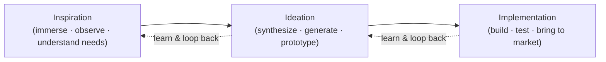

These are my reflections on human-centered design, drawn from time spent with the
design-thinking literature that came out of IDEO and the Stanford d.school. It's not
a summary of any one source. It's the framework and the mindset shifts that I found
genuinely changed how I approach building things for people.

<!-- truncate -->

## A system of spaces, not a sequence of steps

The first reframing: design thinking isn't a checklist you run top to bottom. It's a
set of **overlapping spaces** you move between. The literature names three:
inspiration, ideation, and implementation. You don't graduate cleanly from one to
the next; you loop back as you learn.

What I like about holding it as spaces rather than steps is that it gives you
permission to go backwards. Discovering in implementation that you misread a need
isn't failure, it's the loop working.

## Inspiration: people can't tell you what they want

The phase that changed my instincts the most is the first one. The temptation is to
start by asking people what they need, through surveys and focus groups. The
uncomfortable truth the field keeps surfacing is that **people often can't tell you
what they want.** Stated preferences are weak signal.

What's strong signal is **behavior**. You learn more by going out and observing how
people actually live and work than by asking them to introspect. The job in this
phase is to embed yourself in their world deeply enough that their unmet needs become
visible, the ones they'd never have named.

There's a craft point here too about the **brief** you start from. Too abstract and
the team wanders; too specific and you get something incremental and safe. A good
brief constrains just enough to leave room for the unexpected.

## Ideation: have a lot of ideas

The middle space is about synthesis and volume. You distill what you observed into
insights, then deliberately generate *many* competing ideas rather than committing
early to the obvious one. The point worth internalizing: more choices mean more
complexity, and the natural human reflex is to cut that complexity by retreating to
the safe, incremental option. Resisting that reflex is most of the work.

I keep coming back to Linus Pauling's line, that to have a good idea you should have
a lot of ideas. Testing ideas against each other is what makes the eventual one
bolder than what you'd have reached by defending your first guess.

## Implementation: make it real, then make it last

The last space is the path from a project into people's actual lives. The questions
shift from "what should this be" to "how do I make it real, how do I tell if it's
working, and how do I make it sustainable." It's also where the earlier loops pay
off or expose themselves: a solution that was never prototyped against real needs
tends to fail here, not because the idea was bad but because it was never tested
against the people it was for.

## The mindset matters more than the method

The part I underestimated is that design thinking is as much a **mindset** as a
process. A few of the shifts that stuck with me:

[Step 1] **Empathy.** You can't generate anything new if you only ever live inside
your own experience. The core skill is stepping into someone else's perspective and
solving the problem from there.

[Step 2] **Embrace ambiguity.** Start from genuinely not knowing the answer.
Permission to not know is what makes room to be creative.

[Step 3] **Creative confidence.** The belief that everyone is creative, that
creativity is a way of approaching the world rather than a talent for drawing or
sculpting. Anyone can approach a problem like a designer.

[Step 4] **Optimism.** Treat the answer as out there and findable, even when you
can't see it yet.

[Step 5] **Iterate relentlessly.** Continual refining is what gets you more ideas,
more approaches, and a faster path to something that works.

## Why this is a "third way"

The framing that ties it together for me: leaning entirely on analysis carries real
risk, and leaning entirely on gut feeling carries just as much. What design thinking
does is braid the two together. It's a deeply human process that values ideas with emotional
meaning *and* functional rigor, and that's what makes it a real third way rather than
a softer synonym for "brainstorming."

## What I took from it

Watch behavior, not stated preferences. Generate many ideas before committing.
Prototype against real people early. And treat empathy, ambiguity, and iteration as a
mindset you bring, not steps you check off. The method is useful, but the mindset is
what travels to every problem.

*Reflections on human-centered design, drawn from the IDEO / Stanford d.school
design-thinking literature.*
