import Tabs from '@theme/Tabs';
import TabItem from '@theme/TabItem';

I wanted to document the fundamentals of Gen AI that I have been iteratively learning about; thus I made this post with the help of gen AI :)

<!-- truncate -->

# The Fundamentals of Agentic Systems

<Tabs>
<TabItem value="purpose" label="Purpose of Guide" default>

This comprehensive glossary explains essential GenAI concepts, why they matter, and provides practical implementation examples. It focuses on clarifying the differences between commonly confused components.

**What This Guide Covers:**
- Essential GenAI concepts and their importance
- Practical implementation examples for each concept
- Key differences between similar-sounding components
- Interactive learning diagram with clickable navigation
- Real-world applications and use cases

</TabItem>
<TabItem value="questions" label="Core Questions">

- What are the key concepts I need to know in GenAI?
- Why do these concepts matter for building AI systems?
- What are the differences between similar-sounding components?
- What are practical examples and implementations of each concept?
- How do these concepts work together in real systems?
- What are the key applications and use cases for GenAI?

</TabItem>
<TabItem value="when" label="When to Use">

- You're new to GenAI and need to understand the fundamentals
- You need to understand key concepts before making design decisions
- You want to learn why certain technologies are important
- You're preparing to work with GenAI systems
- You need to distinguish between similar components
- You're building or designing AI-powered applications
- You need to understand the GenAI technology landscape

```mermaid
---
config:
  theme: 'base'
  themeVariables:
    primaryColor: '#2563eb'
    primaryTextColor: '#1e40af'
    primaryBorderColor: '#2563eb'
    lineColor: '#64748b'
    secondaryColor: '#7c3aed'
    tertiaryColor: '#2563eb'
---
flowchart TD
    subgraph "GenAI Fundamentals"
        subgraph "Core Concepts"
            FM[["Foundation Models<br/>*<<🧠 The Brain>>*"]]
            P[["Prompting<br/>*<<📝 Instructions>>*"]]
            RAG[["RAG<br/>*<<📚 Knowledge Access>>*"]]
            VD[["Vector Databases<br/>*<<🔍 Semantic Search>>*"]]
        end
        
        subgraph "Memory & Context"
            MEM[["Memory Systems<br/>*<<💾 Remembering>>*"]]
            KB[["Knowledge Bases<br/>*<<📖 Information>>*"]]
        end
        
        subgraph "Action & Integration"
            AG[["Agentic Systems<br/>*<<🤖 Taking Action>>*"]]
            TI[["Tool Integration<br/>*<<🔧 Connections>>*"]]
            MCP[["MCP Protocol<br/>*<<🔌 Standards>>*"]]
        end
        
        subgraph "Quality & Safety"
            EV[["Evaluation<br/>*<<✅ Testing>>*"]]
            SEC[["Security<br/>*<<🛡️ Safety>>*"]]
        end
    end
    
    %% Core concept relationships
    FM --> P
    P --> RAG
    RAG --> VD
    
    %% Memory relationships
    VD --> MEM
    MEM --> KB
    RAG --> KB
    
    %% Integration relationships
    FM --> AG
    AG --> TI
    TI --> MCP
    
    %% Quality relationships
    AG --> EV
    AG --> SEC
    TI --> SEC
    
    %% Cross-connections
    AG -.-> MEM
    TI -.-> AG
    
    %% Styling
    classDef coreConcept fill:#f8fafc,stroke:#2563eb,stroke-width:2px
    classDef memory fill:#f8fafc,stroke:#7c3aed,stroke-width:2px
    classDef action fill:#f8fafc,stroke:#059669,stroke-width:2px
    classDef quality fill:#f8fafc,stroke:#d97706,stroke-width:2px
    
    class FM,P,RAG,VD coreConcept
    class MEM,KB memory
    class AG,TI,MCP action
    class EV,SEC quality
    
    %% Clickable links
    click FM href "#foundation-models-llms" "Foundation Models"
    click P href "#prompting" "Prompting"
    click RAG href "#rag-retrieval-augmented-generation" "RAG"
    click VD href "#vector-databases" "Vector Databases"
    click MEM href "#memory-systems" "Memory Systems"
    click KB href "#knowledge-bases" "Knowledge Bases"
    click AG href "#agentic-systems" "Agentic Systems"
    click TI href "#tool-integration" "Tool Integration"
    click MCP href "#model-context-protocol-mcp" "MCP Protocol"
    click EV href "#evaluation-and-testing" "Evaluation"
    click SEC href "#security-and-guardrails" "Security"
```

</TabItem>
<TabItem value="learn" label="What You'll Learn">



</TabItem>
</Tabs>

## GenAI Domain Overview

<iframe style={{border: "1px solid rgba(0, 0, 0, 0.1)"}} width="100%" height="450" src="https://embed.figma.com/board/DE44pLgNmB4Hz88OENhEKA/The-GenAI-Domain?embed-host=share" allowfullscreen></iframe>

## GenAI Fundamentals Glossary

### Foundation Models (LLMs)

<Tabs>
<TabItem value="definition" label="Definition & Why It Matters" default>

**What it is**: Large language models that can understand and generate human-like text.

**Why it matters**: These are the "brains" that power your AI system. Without them, you can't have AI.

**Key Characteristics**:
- Trained on massive datasets (trillions of tokens)
- Capable of text generation, reasoning, and conversation
- Foundation for all other GenAI components

</TabItem>
<TabItem value="types" label="Model Types">

**By Capability**:
- **Text Generation**: GPT-4, Claude, Llama
- **Multimodal**: GPT-4V, Claude 3.5, Gemini Pro
- **Code Specialized**: Claude 3.5 Sonnet, GitHub Copilot
- **Open Source**: Llama 3, Mistral, CodeLlama

**By Provider**:
- **OpenAI**: GPT-4, GPT-4V, GPT-3.5
- **Anthropic**: Claude 3.5 Sonnet, Claude 3 Haiku
- **Google**: Gemini Pro, Gemini Ultra
- **Meta**: Llama 3, Code Llama
- **AWS**: Amazon Nova, Titan

</TabItem>
<TabItem value="implementations" label="Popular Implementations">

**Commercial Models**:
- **GPT-4**: OpenAI's flagship, excellent for complex reasoning
- **Claude 3.5 Sonnet**: Anthropic's model, great for analysis and coding
- **Gemini Pro**: Google's model, strong for multimodal tasks
- **Amazon Nova**: AWS's model, optimized for enterprise use

**Open Source Models**:
- **Llama 3**: Meta's open-source model, good for customization
- **Mistral**: High-performance open-source alternative
- **CodeLlama**: Specialized for code generation
- **Phi-3**: Microsoft's efficient small model

**Key Metrics**:
- **Response Quality**: How good are the answers?
- **Speed**: How fast does it respond?
- **Cost**: How much does each response cost?
- **Context Window**: How much text can it process at once?

</TabItem>
</Tabs>

### Prompting

<Tabs>
<TabItem value="definition" label="Definition & Why It Matters" default>

**What it is**: The instructions you give to AI models to get them to do what you want.

**Why it matters**: Good prompts = good results. Bad prompts = useless results.

**Key Characteristics**:
- Clear, specific instructions
- Context and examples when needed
- Iterative refinement process
- Foundation for all AI interactions

</TabItem>
<TabItem value="types" label="Prompt Types">

**By Structure**:
- **Zero-shot**: Single instruction without examples
- **Few-shot**: Instruction with 2-5 examples
- **Chain-of-Thought**: Step-by-step reasoning prompts
- **Role-playing**: Character-based prompts

**By Purpose**:
- **Creative Writing**: Storytelling, content creation
- **Code Generation**: Programming assistance
- **Analysis**: Data interpretation, research
- **Conversation**: Chat, customer service

</TabItem>
<TabItem value="implementations" label="Tools & Platforms">

**Prompt Engineering Platforms**:
- **OpenAI Playground**: Interactive prompt testing
- **Anthropic Console**: Claude prompt development
- **LangSmith**: Prompt debugging and optimization
- **PromptLayer**: Prompt versioning and analytics

**Best Practices**:
- Be specific with context and requirements
- Provide examples of desired output
- Iterate and refine based on results
- Test with different model versions

**Key Metrics**:
- **Prompt Effectiveness**: How often do good prompts lead to good results?
- **Token Efficiency**: How many words do you need to get good results?

</TabItem>
</Tabs>

### RAG (Retrieval Augmented Generation)

<Tabs>
<TabItem value="definition" label="Definition & Why It Matters" default>

**What it is**: A way to let AI access your company's documents, databases, and knowledge to give better answers.

**Why it matters**: Without RAG, AI only knows what it learned during training. With RAG, it can access your specific information.

**Key Characteristics**:
- Combines information retrieval with text generation
- Provides access to real-time, specific data
- Reduces hallucinations by grounding responses in facts
- Essential for enterprise AI applications

</TabItem>
<TabItem value="types" label="RAG Types">

**By Architecture**:
- **Basic RAG**: Simple retrieval + generation
- **Advanced RAG**: Query rewriting, reranking, hybrid search
- **Agentic RAG**: Multi-step reasoning and tool use
- **Graph RAG**: Knowledge graph integration

**Advanced RAG Patterns**:
- **Hybrid Retriever**: Combines semantic search with keyword-based search (TF/IDF, BM25)
- **Query Rewriting**: Uses LLM to generate multiple query variations for better retrieval
- **Reranker**: Ranks retrieved documents by relevance before sending to LLM

**By Data Source**:
- **Document RAG**: PDFs, Word docs, web pages
- **Database RAG**: Structured data from databases
- **API RAG**: Real-time data from external APIs
- **Hybrid RAG**: Multiple data sources combined

</TabItem>
<TabItem value="implementations" label="Components & Tools">

**Vector Databases**:
- **Pinecone**: Managed vector database service
- **Weaviate**: Open-source vector database
- **Chroma**: Lightweight vector database
- **Qdrant**: High-performance vector database
- **AWS OpenSearch**: Managed search and analytics

**Embedding Models**:
- **OpenAI Embeddings**: text-embedding-ada-002, text-embedding-3-large
- **Cohere Embed**: Multilingual embedding model
- **Sentence Transformers**: Open-source embedding models
- **AWS Bedrock Embeddings**: Amazon's embedding models

**Document Processing**:
- **LangChain**: Document loaders and processors
- **LlamaIndex**: Document indexing and retrieval
- **Unstructured**: Document parsing and extraction
- **Apache Tika**: Content extraction from files

**Key Metrics**:
- **Retrieval Accuracy**: How often does it find the right information?
- **Response Relevance**: How often are the answers actually helpful?

</TabItem>
</Tabs>

### Vector Databases

<Tabs>
<TabItem value="definition" label="Definition & Why It Matters" default>

**What it is**: Special databases that can find similar information even when you don't use the exact same words.

**Why it matters**: Humans search by meaning, not exact words. Vector databases let AI do the same.

**Key Characteristics**:
- Store high-dimensional vectors (embeddings)
- Enable semantic search and similarity matching
- Optimized for approximate nearest neighbor (ANN) search
- Essential for RAG and semantic search applications

</TabItem>
<TabItem value="types" label="Database Types">

**By Deployment**:
- **Managed Services**: Pinecone, Weaviate Cloud, AWS OpenSearch
- **Self-hosted**: Chroma, Qdrant, Milvus
- **Cloud-native**: AWS OpenSearch, Azure Cognitive Search
- **Hybrid**: LanceDB with S3 integration

**By Architecture**:
- **In-memory**: Fast but limited by RAM
- **Disk-based**: Persistent but slower
- **Distributed**: Scalable across multiple nodes
- **Serverless**: Auto-scaling managed services

</TabItem>
<TabItem value="implementations" label="Popular Implementations">

**Managed Services**:
- **Pinecone**: Fully managed, excellent performance
- **Weaviate Cloud**: Open-source with managed hosting
- **AWS OpenSearch**: Integrated with AWS ecosystem
- **Azure Cognitive Search**: Microsoft's search service

**Self-hosted Options**:
- **Chroma**: Lightweight, easy to deploy
- **Qdrant**: High-performance, Rust-based
- **Milvus**: Scalable, enterprise-grade
- **Weaviate**: Open-source, feature-rich

**Key Metrics**:
- **Search Accuracy**: How often does it find what you're looking for?
- **Search Speed**: How fast can it search through millions of documents?

</TabItem>
<TabItem value="differentiating" label="Differentiating Factors">

**How to Choose Between Vector Database Types**:

**Managed vs. Self-hosted**:
- **Managed Services** (Pinecone, Weaviate Cloud): Best for quick deployment, no infrastructure management
- **Self-hosted** (Chroma, Qdrant, Milvus): Best for data control, customization, cost optimization

**Performance vs. Simplicity**:
- **High Performance** (Pinecone, Qdrant): Best for production workloads with high query volumes
- **Simple Setup** (Chroma): Best for prototyping and small-scale applications

**Cloud vs. On-premises**:
- **Cloud-native** (AWS OpenSearch, Azure Cognitive Search): Best for cloud-first architectures
- **Multi-cloud** (Weaviate, Milvus): Best for hybrid or multi-cloud deployments

**Key Decision Factors**:
- **Scale Requirements**: Vector count and query volume
- **Performance Needs**: Search latency and throughput  
- **Cost Considerations**: Storage and compute costs
- **Integration Complexity**: Ease of integration with existing systems

</TabItem>
</Tabs>

### Memory Systems

<Tabs>
<TabItem value="definition" label="Definition & Why It Matters" default>

**What it is**: Ways for AI to remember what happened in previous conversations.

**Why it matters**: Without memory, every conversation starts from scratch. With memory, AI can build on past interactions.

**Key Characteristics**:
- Persistent storage across conversations
- Context retrieval and injection
- User preference learning
- Essential for personalized AI experiences

</TabItem>
<TabItem value="types" label="Memory Types">

**By Duration**:
- **Short-term Memory**: Session context, conversation history
- **Long-term Memory**: User preferences, learned facts
- **Working Memory**: Current context and state
- **Episodic Memory**: Specific events and conversations

**By Content**:
- **Semantic Memory**: Facts and knowledge storage
- **Procedural Memory**: Task and workflow memory
- **Conversational Memory**: Chat history and context
- **Preference Memory**: User settings and preferences

</TabItem>
<TabItem value="implementations" label="Storage Solutions">

**Short-term Memory**:
- **Redis**: In-memory data store for session storage
- **Memcached**: Distributed memory caching
- **DynamoDB**: NoSQL database for conversation state
- **PostgreSQL**: Relational database for structured memory

**Long-term Memory**:
- **AgentCore Memory**: AWS's agent memory service
- **Weaviate**: Vector database for semantic memory
- **Pinecone**: Managed vector storage for knowledge
- **Custom Solutions**: Built-in memory systems

**Key Metrics**:
- **Memory Accuracy**: How often does it remember correctly?
- **Memory Persistence**: How long does it remember important information?

</TabItem>
<TabItem value="differentiating" label="Differentiating Factors">

**How to Choose Between Memory System Types**:

**Short-term vs. Long-term Memory**:
- **Short-term** (Redis, Memcached): Best for session management, real-time context
- **Long-term** (AgentCore Memory, Weaviate): Best for persistent user preferences, learning

**Performance vs. Persistence**:
- **High Performance** (Redis, Memcached): Best for real-time applications, low latency
- **Persistent Storage** (DynamoDB, PostgreSQL): Best for data durability, complex queries

**Cloud vs. Self-hosted**:
- **Managed Services** (AgentCore Memory): Best for AWS ecosystems, minimal management
- **Self-hosted** (Redis, PostgreSQL): Best for data control, custom requirements

**Key Decision Factors**:
- **Memory Duration**: How long data needs to be stored
- **Performance Needs**: Access speed and latency requirements
- **Data Complexity**: Structured vs. unstructured memory needs
- **Scalability**: Multi-user and multi-agent support

</TabItem>
</Tabs>

### Agentic Systems

<Tabs>
<TabItem value="definition" label="Definition & Why It Matters" default>

**What it is**: AI systems that can not just talk, but actually do things like send emails, update databases, or make API calls.

**Why it matters**: Most AI just talks. Agentic AI actually gets things done.

**Key Characteristics**:
- Autonomous task execution
- Tool and system integration
- Multi-step reasoning and planning
- Real-world action capabilities

</TabItem>
<TabItem value="types" label="Agent Types">

**By Architecture**:
- **Single Agent**: One AI system handling all tasks
- **Multi-Agent**: Multiple specialized agents working together
- **Hierarchical**: Supervisor agents coordinating worker agents
- **Swarm**: Decentralized agents with emergent behavior

**By Capability**:
- **Browser Automation**: Web interaction and data extraction
- **API Integration**: External service connections
- **Database Operations**: Data management and queries
- **Communication**: Email, Slack, Teams integration

</TabItem>
<TabItem value="implementations" label="Frameworks & Tools">

**Agent Frameworks**:
- **Strands Agents**: AWS's agent development platform
- **LangGraph**: Multi-agent workflow framework
- **CrewAI**: Collaborative agent framework
- **LlamaIndex**: Agent and tool integration
- **AutoGen**: Microsoft's multi-agent framework

**Agent Capabilities**:
- **Browser Automation**: Nova Act, Playwright agents
- **API Integration**: REST, GraphQL, gRPC connections
- **Database Operations**: CRUD operations, queries
- **File Operations**: Read, write, process files
- **Communication**: Email, Slack, Teams integration

**Key Metrics**:
- **Task Completion Rate**: How often does it successfully complete tasks?
- **Action Accuracy**: How often does it do the right thing?

</TabItem>
<TabItem value="differentiating" label="Differentiating Factors">

**How to Choose Between Agent Framework Types**:

**Single vs. Multi-Agent**:
- **Single Agent** (Simple frameworks): Best for straightforward tasks, easier to manage
- **Multi-Agent** (CrewAI, LangGraph): Best for complex workflows, specialized agents

**Cloud vs. Self-hosted**:
- **Managed Services** (Strands Agents): Best for AWS ecosystems, minimal infrastructure
- **Open Source** (LangGraph, CrewAI): Best for customization, cost control

**Capability Focus**:
- **Browser Automation** (Nova Act): Best for web-based tasks
- **API Integration** (Custom frameworks): Best for system integration
- **Communication** (Slack/Teams bots): Best for user interaction

**Key Decision Factors**:
- **Task Complexity**: Simple vs. complex multi-step workflows
- **Integration Needs**: Existing system integration requirements
- **Development Speed**: Time to market vs. customization needs
- **Team Expertise**: Developer skill levels and preferences

</TabItem>
</Tabs>

### Tool Integration

<Tabs>
<TabItem value="definition" label="Definition & Why It Matters" default>

**What it is**: Ways to connect AI to your existing tools and systems (databases, APIs, software).

**Why it matters**: AI is only useful if it can work with your existing systems and data.

**Key Characteristics**:
- Standardized interfaces for tool access
- Secure authentication and authorization
- Real-time data access and manipulation
- Essential for practical AI applications

</TabItem>
<TabItem value="types" label="Integration Types">

**By Protocol**:
- **MCP (Model Context Protocol)**: Standardized tool access
- **Direct API Integration**: REST, GraphQL, gRPC
- **Embedded Tools**: Built-in functionality
- **Hybrid Integration**: Multiple approaches combined

**By Function**:
- **Database Tools**: SQL, NoSQL database access
- **API Tools**: External service integration
- **File Tools**: Document and data processing
- **Communication Tools**: Email, messaging, notifications

</TabItem>
<TabItem value="implementations" label="Tools & Standards">

**MCP Servers**:
- **Database MCP**: SQL and NoSQL database connections
- **File System MCP**: File operations and management
- **API MCP**: REST and GraphQL integrations
- **Custom MCP**: Specialized tool implementations

**Direct API Integration**:
- **REST APIs**: HTTP-based integrations
- **GraphQL**: Query-based data access
- **gRPC**: High-performance RPC calls
- **WebSocket**: Real-time communication

**MCP Benefits**:
- **Standardization**: Consistent tool interfaces
- **Interoperability**: Cross-platform compatibility
- **Extensibility**: Easy tool addition
- **Security**: Controlled access patterns

**Key Metrics**:
- **Integration Reliability**: How often do the connections work?
- **Data Accuracy**: How often does it access the right data?

</TabItem>
</Tabs>

### Evaluation and Testing

<Tabs>
<TabItem value="definition" label="Definition & Why It Matters" default>

**What it is**: Ways to test and measure whether your AI system is working correctly.

**Why it matters**: AI can seem to work but actually be wrong or harmful. Testing helps catch problems.

**Key Characteristics**:
- Systematic evaluation of AI performance
- Automated testing and validation
- Human feedback integration
- Continuous improvement through metrics

</TabItem>
<TabItem value="types" label="Evaluation Types">

**By Method**:
- **Automated Testing**: Systematic evaluation of responses
- **Human Evaluation**: Qualitative assessment by experts
- **A/B Testing**: Comparative performance analysis
- **User Feedback**: Real-world usage metrics

**By Focus**:
- **Accuracy Testing**: Correctness of responses
- **Safety Testing**: Harmful content detection
- **Performance Testing**: Speed and efficiency
- **User Experience**: Satisfaction and usability

</TabItem>
<TabItem value="implementations" label="Tools & Frameworks">

**Evaluation Frameworks**:
- **LangSmith**: LLM evaluation and debugging
- **Weights & Biases**: Experiment tracking and evaluation
- **MLflow**: Model evaluation and versioning
- **Evidently AI**: Data and model monitoring

**Testing Tools**:
- **Pytest**: Python testing framework
- **Playwright**: End-to-end testing
- **Postman**: API testing and validation
- **Custom Test Suites**: Specialized evaluation tools

**Key Metrics**:
- **Accuracy Rate**: Correctness of responses
- **Response Time**: Latency and performance
- **Task Completion**: Success rate of actions
- **User Satisfaction**: Human feedback scores

</TabItem>
</Tabs>

### Security and Guardrails

<Tabs>
<TabItem value="definition" label="Definition & Why It Matters" default>

**What it is**: Systems that prevent AI from doing harmful things or accessing sensitive information.

**Why it matters**: AI can be powerful but also dangerous if not properly controlled.

**Key Characteristics**:
- Content filtering and safety controls
- Access control and authentication
- Data protection and privacy
- Compliance and audit capabilities

</TabItem>
<TabItem value="types" label="Security Types">

**By Function**:
- **Content Safety**: Harmful content detection and filtering
- **Access Control**: Authentication and authorization
- **Data Protection**: Encryption and privacy controls
- **Compliance**: Regulatory and policy adherence

**By Level**:
- **Basic Security**: Standard authentication and filtering
- **Enterprise Security**: Advanced controls and compliance
- **Custom Security**: Domain-specific safety rules
- **Zero Trust**: Comprehensive security architecture

</TabItem>
<TabItem value="implementations" label="Tools & Services">

**Content Safety**:
- **AWS Guardrails**: Content filtering and safety
- **Azure Content Safety**: Microsoft's safety services
- **OpenAI Moderation**: Content moderation API
- **Custom Filters**: Specialized safety rules

**Access Control**:
- **OAuth 2.0**: Standard authentication protocol
- **JWT Tokens**: Secure session management
- **RBAC**: Role-based access control
- **API Keys**: Service authentication

**Data Protection**:
- **Encryption**: Data at rest and in transit
- **PII Detection**: Personal information identification
- **Data Masking**: Sensitive data protection
- **Audit Logging**: Security event tracking

**Key Metrics**:
- **Security Incidents**: How often does it try to do something it shouldn't?
- **Compliance Rate**: How often does it follow your company's rules?

</TabItem>
</Tabs>

### MCP (Model Context Protocol)

<Tabs>
<TabItem value="definition" label="Definition & Why It Matters" default>

**What it is**: A standard way for AI systems to connect to tools and data sources.

**Why it matters**: Without standards, every AI system needs custom connections. MCP makes it easier to connect AI to different tools.

**Key Characteristics**:
- Standardized protocol for tool access
- Interoperability between different AI systems
- Secure and controlled tool access
- Extensible architecture for new tools

</TabItem>
<TabItem value="types" label="MCP Components">

**By Role**:
- **MCP Servers**: Tool implementations that expose capabilities
- **MCP Clients**: AI systems that consume tool capabilities
- **MCP Protocols**: Standardized communication protocols
- **MCP Tools**: Specific tool implementations

**By Function**:
- **Database MCP**: SQL and NoSQL database connections
- **File System MCP**: File operations and management
- **API MCP**: REST and GraphQL integrations
- **Custom MCP**: Specialized tool implementations

</TabItem>
<TabItem value="implementations" label="Tools & Examples">

**MCP Servers**:
- **Database MCP**: SQL and NoSQL database connections
- **File System MCP**: File operations and management
- **API MCP**: REST and GraphQL integrations
- **Custom MCP**: Specialized tool implementations

**MCP Clients**:
- **Claude Desktop**: Native MCP support
- **Custom Clients**: Application-specific implementations
- **SDK Libraries**: Development frameworks
- **Integration Tools**: Connection utilities

**MCP Benefits**:
- **Standardization**: Consistent tool interfaces
- **Interoperability**: Cross-platform compatibility
- **Extensibility**: Easy tool addition
- **Security**: Controlled access patterns

**Key Metrics**:
- **Connection Success Rate**: How often do MCP connections work?
- **Tool Availability**: How many tools can you easily connect?

</TabItem>
</Tabs>

### Infrastructure as Code (IaC)

<Tabs>
<TabItem value="definition" label="Definition & Why It Matters" default>

**What it is**: A way to manage and provision infrastructure using code instead of manual processes.

**Why it matters**: IaC makes GenAI deployments reproducible, scalable, and maintainable by treating infrastructure as software.

**Key Characteristics**:
- Version-controlled infrastructure definitions
- Automated deployment and configuration
- Consistent environments across development, staging, and production
- Easy rollback and disaster recovery

</TabItem>
<TabItem value="types" label="IaC Types">

**By Tool**:
- **AWS CDK**: Programmatic infrastructure with familiar programming languages
- **Terraform**: Declarative infrastructure management
- **CloudFormation**: AWS-native infrastructure as code
- **Pulumi**: Multi-cloud infrastructure with real programming languages

**By Approach**:
- **Declarative**: Define desired state, tool figures out how to achieve it
- **Imperative**: Define exact steps to create infrastructure
- **Hybrid**: Combine declarative and imperative approaches

</TabItem>
<TabItem value="implementations" label="Popular Implementations">

**AWS CDK**:
- **Languages**: TypeScript, Python, Java, C#
- **Benefits**: Type safety, IDE support, reusable components
- **Use Cases**: Complex AWS architectures, team collaboration

**Terraform**:
- **Multi-cloud**: Works with AWS, Azure, GCP, and others
- **State Management**: Tracks infrastructure state
- **Modules**: Reusable infrastructure components

**CloudFormation**:
- **AWS Native**: Deep integration with AWS services
- **Templates**: JSON or YAML infrastructure definitions
- **Stack Management**: Automated stack operations

**Key Benefits**:
- **Reproducibility**: Same infrastructure every time
- **Version Control**: Track infrastructure changes
- **Automation**: Eliminate manual configuration errors
- **Scalability**: Easy to replicate and scale

**Production Deployment Patterns**:
- **Crawl-Walk-Run**: Gradual rollout (internal → limited external → full production)
- **SageMaker JumpStart**: Rapid model deployment with pre-built solutions
- **Enterprise Solutions**: AgentCore runtime with comprehensive services

</TabItem>
<TabItem value="differentiating" label="Differentiating Factors">

**How to Choose Between IaC Tools**:

**AWS CDK vs. Terraform**:
- **AWS CDK**: Best for AWS-only projects, team prefers programming languages
- **Terraform**: Best for multi-cloud or when you need vendor neutrality

**CloudFormation vs. CDK**:
- **CloudFormation**: Best for simple AWS deployments, JSON/YAML preference
- **CDK**: Best for complex logic, type safety, and reusable components

**Terraform vs. Pulumi**:
- **Terraform**: Best for declarative approach, large community
- **Pulumi**: Best for imperative approach, real programming languages

**Key Decision Factors**:
- **Cloud Strategy**: Single cloud vs. multi-cloud
- **Team Expertise**: Programming languages vs. configuration languages
- **Complexity**: Simple deployments vs. complex logic requirements
- **Community**: Support and ecosystem considerations

</TabItem>
</Tabs>


## How These Concepts Work Together

Think of building an AI system like building a house:

- **Foundation Models** = The foundation (everything else builds on this)
- **Prompting** = The blueprints (how you tell it what to do)
- **RAG** = The library (access to information)
- **Vector Databases** = The filing system (organizing information)
- **Memory** = The family history (remembering past interactions)
- **Agentic Systems** = The hands (actually doing things)
- **Tool Integration** = The utilities (connecting to existing systems)
- **Evaluation** = The inspection (making sure everything works)
- **Security** = The locks and alarms (keeping things safe)
- **MCP** = The standard electrical outlets (easy connections)

## How These Concepts Differ

### Vector Databases vs. Knowledge Bases

<div style={{display: 'flex', gap: '20px'}}>

<div style={{flex: '1'}}>

**Vector Databases**:
- **Focus**: Storage and retrieval of embeddings
- **Purpose**: Fast semantic search
- **Scope**: Technical infrastructure component
- **Examples**: Pinecone, Weaviate, Chroma

</div>

<div style={{flex: '1'}}>

**Knowledge Bases**:
- **Focus**: Document processing, chunking, and retrieval logic
- **Purpose**: Comprehensive knowledge management
- **Scope**: End-to-end RAG solution
- **Examples**: Amazon Bedrock Knowledge Bases, Custom solutions

</div>

</div>

**Key Difference**: Vector databases are infrastructure; knowledge bases are complete solutions.

### Agent Frameworks vs. Tool Systems

<div style={{display: 'flex', gap: '20px'}}>

<div style={{flex: '1'}}>

**Agent Frameworks**:
- **Focus**: Overall agent infrastructure and orchestration
- **Purpose**: Agent development and management
- **Scope**: Complete agent lifecycle
- **Examples**: Strands Agents, LangGraph, CrewAI

</div>

<div style={{flex: '1'}}>

**Tool Systems**:
- **Focus**: External system integration
- **Purpose**: Tool access and execution
- **Scope**: Tool-specific functionality
- **Examples**: MCP Servers, API integrations, Database connectors

</div>

</div>

**Key Difference**: Frameworks are broader; tool systems are more focused.

### Memory Systems vs. Knowledge Bases

<div style={{display: 'flex', gap: '20px'}}>

<div style={{flex: '1'}}>

**Memory Systems**:
- **Focus**: Conversation context and user preferences
- **Purpose**: Personalized AI experiences
- **Scope**: User-specific data
- **Examples**: AgentCore Memory, Redis, DynamoDB

</div>

<div style={{flex: '1'}}>

**Knowledge Bases**:
- **Focus**: Domain knowledge and factual information
- **Purpose**: Accurate information retrieval
- **Scope**: Organization-wide data
- **Examples**: Document stores, Vector databases, RAG systems

</div>

</div>

**Key Difference**: Memory is personal; knowledge is organizational.

### Model Serving vs. Agent Frameworks

<div style={{display: 'flex', gap: '20px'}}>

<div style={{flex: '1'}}>

**Model Serving**:
- **Focus**: Running foundation models efficiently
- **Purpose**: Model execution and scaling
- **Scope**: Infrastructure for model hosting
- **Examples**: Amazon Bedrock, SageMaker, Azure OpenAI

</div>

<div style={{flex: '1'}}>

**Agent Frameworks**:
- **Focus**: Agent-specific capabilities and orchestration
- **Purpose**: Agent development and management
- **Scope**: Complete agent functionality
- **Examples**: Strands Agents, LangGraph, CrewAI

</div>

</div>

**Key Difference**: Model serving is infrastructure; agent frameworks are application layer.


## Example Agentic Applications

<Tabs>
<TabItem value="content" label="Content Creation" default>

* **Text Generation**: Articles, code, documentation
* **Image Generation**: Visual content, design assets
* **Audio/Video**: Voice synthesis, video creation
* **Code Generation**: Programming assistance, automation

</TabItem>
<TabItem value="business" label="Business Applications">

* **Customer Service**: Chatbots, support automation
* **Data Analysis**: Insights, reporting, visualization
* **Process Automation**: Workflow optimization, task automation
* **Decision Support**: Analysis, recommendations, forecasting

</TabItem>
<TabItem value="infrastructure" label="Technical Infrastructure">

* **Cloud Platforms**: AWS, Google Cloud, Azure AI services
* **Open Source**: Hugging Face, Ollama, local deployment
* **Enterprise**: Custom models, private deployment
* **Edge Computing**: On-device AI, mobile applications

</TabItem>
</Tabs>


## Next Steps

Ready to dive deeper? Check out:
- [Designing GenAI Systems](./designing-genai-systems) for architectural decisions
- [Preparing GenAI Systems for Production](./preparing-genai-systems-for-production) for production readiness

---

*This guide gives you the foundation you need to understand and work with GenAI systems. Each concept builds on the others, so understanding all of them helps you make better decisions about your AI projects.*

<details>
<summary>🤖 AI Metadata</summary>
```
# AI METADATA - DO NOT REMOVE OR MODIFY
# AI_UPDATE_INSTRUCTIONS:
# This document should be updated when new agentic system fundamentals emerge,
# core concepts evolve, or foundational technologies change.
#
# 1. SCAN_SOURCES: Monitor agentic AI research, foundation model updates,
#    core technology developments, and fundamental concept evolution
# 2. EXTRACT_DATA: Extract new fundamental concepts, core technologies,
#    component relationships, and foundational patterns from authoritative sources
# 3. UPDATE_CONTENT: Add new fundamentals, update component descriptions,
#    and ensure all foundational concepts remain current and relevant
# 4. VERIFY_CHANGES: Cross-reference new content with multiple sources and ensure
#    consistency with existing fundamental concepts and component relationships
# 5. MAINTAIN_FORMAT: Preserve the structured format with clear concept descriptions,
#    component relationships, and foundational understanding
#
# CONTENT_PATTERNS:
# - Core Concepts: Direct Prompting, RAG, Memory Management, Vector Stores, Infrastructure as Code
# - Component Relationships: How different agentic system components work together
# - Key Technologies: Language models, vector databases, agent frameworks, deployment patterns
# - Core Questions: Educational questions for understanding agentic system fundamentals
#
# DATA_SOURCES:
# - Agentic AI Research: Foundation models, core concepts, fundamental technologies
# - Component Analysis: Agentic system components and their roles and relationships
# - Technology Landscape: Language models, vector databases, agent frameworks, IaC
# - Additional Resources: Core agentic system concepts, foundational technologies
#
# RESEARCH_STATUS:
# - Fundamentals: Core agentic system concepts and component relationships documented
# - Educational Focus: Content structured for understanding agentic system fundamentals
# - Component Analysis: Comprehensive agentic system components and their roles documented
# - Blog Post Structure: Adheres to /prompts/author/blog-post-structure.md
# - Content Integration: Merged from multiple sources (domain overview, intermediate concepts)
# - Document Evolution: Transformed from documentation to comprehensive blog post
#
# CONTENT_SECTIONS:
# 1. Purpose Section (Purpose of Guide, Core Questions, When to Use, What You'll Learn)
# 2. Core Concepts (Foundation Models, Prompting, RAG, Vector Databases, Memory Systems, etc.)
# 3. Example Applications (Content Creation, Business Applications, Technical Infrastructure)
# 4. Component Relationships (How components work together)
# 5. Practical Considerations (Implementation, development, future, challenges)
# 6. Next Steps (Design decision guidance)
#
# FUNDAMENTAL_CONCEPTS:
# - Direct Prompting: Simple, effective, limited to model knowledge
# - RAG: Retrieval Augmented Generation, combines retrieval with generation
# - Memory Management: Conversation context and user preferences
# - Vector Stores: Semantic search and similarity matching
# - Agent Frameworks: Autonomous AI agent infrastructure
# - Infrastructure as Code: Automated, reproducible agentic system deployments
#
# STRUCTURING_APPROACH:
# - Interactive Learning Diagram: High-level Mermaid flowchart showing concept relationships
# - Clickable Navigation: Direct links from diagram nodes to detailed sections
# - Tabbed Content: Each concept has Definition, Types, Implementations, Differentiating Factors
# - Two-Column Comparisons: Side-by-side layout for "How These Concepts Differ" section
# - Visual Hierarchy: Clear progression from fundamentals to differences to next steps
# - Emoji Integration: Visual cues with italicized angle-bracket formatting (*<<emoji description>>*)
# - Color-Coded Categories: Distinct colors for Core Concepts, Memory, Action, Quality
# - Clean Background: Light gray/white background with colored borders for distinction
#
# ITERATION_HISTORY:
# - Initial: Comprehensive glossary with tabbed sections for each concept
# - Enhanced: Added interactive Mermaid diagram with clickable links
# - Refined: Simplified diagram to focus on core concepts and relationships
# - Improved: Added two-column layout for concept comparisons
# - Polished: Clean color scheme with light background and distinct borders
# - Final: Interactive diagram with direct navigation, no redundant text links
#
# DIAGRAM_STRUCTURE:
# - High-Level Overview: Shows GenAI fundamentals and their relationships
# - Category Grouping: Core Concepts, Memory & Context, Action & Integration, Quality & Safety
# - Relationship Mapping: Solid lines for direct relationships, dotted for cross-connections
# - Interactive Elements: Clickable nodes that link to detailed sections
# - Visual Design: Clean, professional appearance with subtle background colors
# - Navigation Integration: Seamless connection between diagram and content sections
#
# BLOG_POST_EVOLUTION:
# - Original Purpose: Documentation-style glossary of GenAI fundamentals
# - Content Integration: Merged domain overview and intermediate concepts
# - Structure Enhancement: Added tabbed purpose section and example applications
# - Visual Improvements: Interactive Mermaid diagram with clickable navigation
# - Content Consolidation: Removed duplicate sections and integrated advanced patterns
# - Final Form: Comprehensive blog post covering fundamentals through applications
#
# INTEGRATION_HISTORY:
# - Domain Overview: Merged Figma embed and application examples from understanding-genai-domain.md
# - Intermediate Concepts: Integrated advanced RAG patterns and deployment strategies
# - Content Organization: Properly categorized Infrastructure as Code as separate concept
# - Pattern Integration: Moved advanced patterns into appropriate existing sections
# - Structure Optimization: Converted Key Applications to tabbed Example Agentic Applications
```
</details>

