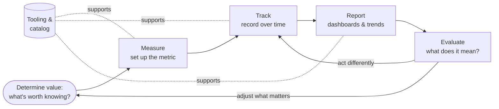

What if you ran your own life the way a business runs itself, with metrics, dashboards, weekly reports, and a clear sense of what's trending up or down? That's the premise of what I call the **Analyzer**: a role I play that treats my own behavior, time, and growth as a system worth measuring.

<!-- truncate -->

I used to keep this as a flat list of two dozen "activities." But once you look closely, they're not two dozen separate things. They're a handful of **verbs** applied across many **domains**. You *measure* what matters, *track* it over time, *report* on how it trends, and *evaluate* what it means, and the evaluation changes what you measure next. One loop.

The rest of this post walks the loop. Under each step I've kept the actual **planning questions** I work through, not a summary of them, deduplicated so each unique question appears once.

## [Step 0] Determine value: what's even worth measuring?

Before you measure anything, decide what deserves the attention. Measurement has a cost; spend it where it creates leverage.

- How do you measure the value of something?
- What criteria should I use to evaluate value?
- How do I compare different options?
- What factors contribute to long-term value?
- How do I assess return on investment?
- What metrics indicate value creation?
- How do I evaluate both quantitative and qualitative value?
- What value frameworks should I apply to different decisions?
- What value do I get out of analyzing these metrics, and how does that analysis change my behavior?

## [Step 1] Measure: define the metrics

Identify and implement the measurement systems, and the specific personal metrics that matter most for growth and success. (This merges what used to be two near-identical lists, "measuring things" and "identifying personal metrics.")

- What are all the different things I am measuring?
- How do you measure effectively, and what should you measure?
- What tools and tech can you measure with?
- What metrics about me am I capturing?
- What are all the different metrics I want to identify about myself?
- What are all the different things I want to measure about myself?
- How will I quantify improvements in different aspects of my life?
- Can I apply business-level metrics to myself? What kinds of metrics do businesses capture?
- What personal metrics are most important for my goals?
- How do I balance different types of metrics?
- What leading vs lagging indicators should I track?

## [Step 2] Track: record over time

Systematically monitor and record data over time. Tracking is the same activity whatever the subject, so I keep one set of meta-questions, then a list of the **domains** I actually track.

**The questions:**

- What should I track about myself, and what do I constantly need to keep track of?
- What am I currently keeping track of?
- What are my personal commitments, and what are the things I have to do every day?
- How will I master my trade?
- When should I organize myself, and how frequently do I clean up my notes?
- Should I start tracking when I clean up my notes? Can that be auto-derived from when tasks get simultaneously closed?
- Which personal metrics can be automatically derived, and which need special work to derive?
- How do I measure progress within each thing I track?
- How do I ensure data quality and consistency?

**The domains I track** (each is the *same* activity pointed at a different part of life):

- **Time**: methods, categories, allocation, patterns, and avoiding time-wasters without making tracking a burden.
- **Computer usage**: digital productivity, time-wasting apps, behavioral patterns, and privacy considerations.
- **Initiatives**: milestones, success measures, when to adjust, required resources, risks, and progress communication.
- **Learnings**: learning activities, progress, knowledge gaps, retention, effective methods, and skill development.
- **Roles**: success per role, relevant metrics, balancing competing demands, satisfaction, and engagement.
- **Sales**: activities, performance, opportunities, trends, and forecasting.
- **Spirituality**: practices, growth, engagement, consistency, goals, and community.
- **Thoughts**: capturing ideas, spotting patterns, organizing/categorizing, and mining them for personal growth.
- **Activities & artifacts**: how often I do/use things, how many processes a document touches, how often I open or edit it, and which provide the most value.

## [Step 3] Report: surface the trends

Turn recorded data into reports, dashboards, and visualizations so you can actually *see* what's happening and decide. (This consolidates the old "reporting things," "generating reports," "structuring weekly reports," and "crafting dashboards" into one step.)

**Reports & dashboards:**

- How do I track my progress and view my accomplishments?
- Of the things I'm tracking, how are they trending, and in the right direction?
- How often should I generate reports, and in what format?
- What key insights should reports highlight, and how do I make them actionable?
- What automation can I implement for reporting, and how do I ensure accuracy and consistency?
- What audience am I creating reports for, and how do I evolve them as needs change?
- What data belongs on a dashboard, and how do I design effective visualizations?
- What layout, update cadence, and alerts make a dashboard actionable?
- How do I keep dashboards relevant over time?

**The weekly cadence** (the one report I run on a fixed rhythm):

- What should be included in weekly reports, and how do I structure them for clarity?
- Which metrics matter most for a weekly review, and how do I compare week-over-week?
- What actions should result from weekly reports, and how do I keep the format consistent?
- What templates make this efficient, and how do I ensure it actually drives improvement?

## [Step 4] Evaluate: what does it mean, and what changes?

Close the loop. Assess your own performance against the data, then let the verdict reshape what you measure and how you act.

- How do I evaluate my own performance, and what criteria keep it objective?
- What feedback mechanisms should I use?
- How do I track personal growth over time, and how do I maintain objectivity in self-assessment?
- What areas need improvement?
- How do I celebrate achievements?
- What goals should I set based on these evaluations?
- How productive was my day/week/month, and what factors drove it?
- What patterns emerge, and how can I improve the underlying metrics?

## The tooling layer (cuts across every step)

Two supporting activities don't sit *in* the loop; they hold it up: keeping an inventory of what you track, and using the right tools to do it.

**Cataloging what you track:**

- What am I currently tracking, and how do I organize it into sensible categories?
- How do I ensure I don't lose track of important items, and how do I prioritize what to track?
- What should I *stop* tracking, and how do I maintain the system over time?

**Leveraging tools:**

- What tools are available, and how do I choose and integrate the right ones?
- What automation can I implement, and how do I ensure data quality and consistency?
- What backup and security measures do I need?
- How do I train myself to use tools well, and which give the best ROI?

## Why bother?

The point of all this isn't surveillance of the self. It's leverage. Vague intentions ("be more productive," "grow spiritually," "use my time better") don't move until they're attached to something you can observe and steer. Pick even one lap around the loop (decide what's worth measuring, measure it, track it, report on it, evaluate it) and a fuzzy ambition becomes a system with a feedback loop. That's the whole game: measure what matters, watch how it trends, and let what you see change what you do next.
