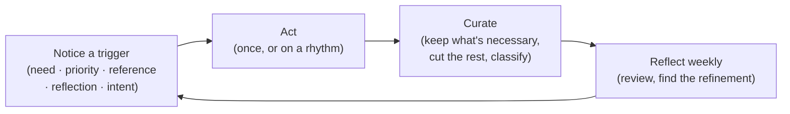

I spent a long time confusing *being busy* with *doing the right things*. The fix
wasn't a better to-do app. It was getting clear about the small number of things
that should actually trigger action, and the loop that keeps that action pointed at
what matters. This is that framework: the anatomy of doing.

<!-- truncate -->

## What pulls you into action

Most of the noise in a productivity system comes from treating every input the same.
In practice, almost everything I act on traces back to one of a few triggers:

- **A need.** Something has to grow, get organized, or get built, including the
  tools I need and the tools I *want* to make. The discipline here is ranking:
  when needs compete, which one actually matters most, and how do I weigh an urgent
  need against a long-term one?
- **A priority.** Some things need doing now; some can wait. The work is deciding
  which is which, separating urgent from important, and protecting deadlines
  instead of reacting to whatever is loudest.
- **A reference.** Notes, links, and captured information are worthless if they only
  accumulate. The question that keeps them alive: what does this reference actually
  ask me to *do*, and how do I make sure captured information turns into action
  rather than clutter?
- **A reflection.** Insight is the input that's easiest to waste. When I notice a
  pattern in how I'm working, the only thing that makes the reflection real is
  translating it into a concrete next step.
- **An intent.** Underneath all of it is the question of *why* I'm doing this at
  all. Capturing the intent behind an action, and checking that the action still
  aligns with it, is what keeps the whole system from drifting into motion for its
  own sake.

If a task can't be traced back to one of these, that's usually a sign it doesn't
belong on the list.

## Keeping action consistent

Triggers get you moving. Consistency is what compounds. Two things matter here.

The first is **rhythm**: recurring action on the right cadence. Not everything
deserves the same frequency, so the useful move is to sort recurring work by time
scale (daily, weekly, monthly, quarterly, yearly). Once it's sorted, the system's
job is just to make sure nothing recurring quietly falls off, and to keep improving
the recurring work instead of running it on autopilot forever.

The second is a **weekly iteration**. Once a week I review what I did, find the one
or two things worth refining, and feed that back in. Weekly is short enough to
correct course and long enough to see a pattern. The trap to avoid is letting the
review *replace* the doing. Iteration is in service of execution, not a substitute
for it.

## Curating, not just accumulating

The failure mode of a productive person isn't idleness. It's doing a lot of
unnecessary things efficiently. So a real part of doing is *curation*: deciding
what's genuinely necessary and cutting the rest. That means having criteria for
"necessary," staying alert to work that only *feels* productive, and (just as
important) making sure nothing genuinely necessary is slipping through while I'm
busy trimming.

The same instinct applies to understanding your own action. It helps to **classify**
what you do, to know the categories of work you actually engage in, because you
can't balance or optimize a set of activities you've never named.

## When you don't know what to do

Some of the time the honest answer is *I'm not sure what to do next.* That's its own
skill. The move is to widen the field before narrowing it, to list what you *can*
do before deciding what you *will*:

- ideas you can refine
- projects you can work on
- things you can tinker with
- experiments you can run
- books you can read and topics you can learn
- scripts you can write and processes you can establish

Seeing the options laid out usually makes the next action obvious. And when it
doesn't, that's a decision-making process to improve, not a personal failing.

## The environment around the work

None of this survives contact with a bad environment. Part of doing is deliberately
crafting the surroundings (the workspace, the tools, the background conditions)
that keep me focused and motivated by default, and adapting that environment to the
kind of work in front of me rather than fighting it.

## The loop

Put together, doing isn't a list of tasks. It's a loop:

[Step 1] **Notice the trigger:** a need, a priority, a reference, a reflection, or
an intent worth acting on.

[Step 2] **Act**, on the right cadence. Once for one-offs, on a rhythm for
recurring work.

[Step 3] **Curate:** keep what's necessary, cut what isn't, classify what's left so
you can see it clearly.

[Step 4] **Reflect weekly:** review, find the refinement, and feed it back into the
triggers so the next pass is sharper.

The goal was never to do *more*. It was to make sure the doing stays pointed at what
actually matters, and to have a loop that catches it when it drifts.
