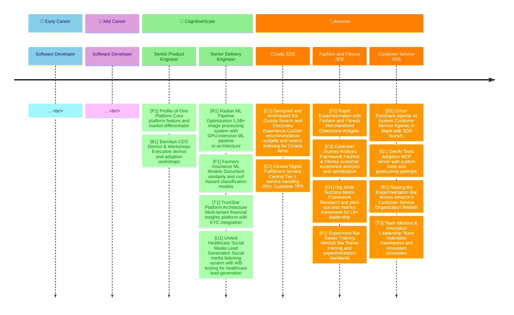

import ContributionTimeline from '@site/src/components/ContributionTimeline';
import Tabs from '@theme/Tabs';
import TabItem from '@theme/TabItem';

I wanted to document my major professional contrributions; thus I made this post.

<!-- truncate -->

# My Professional Project Timeline

A focused timeline of my key projects, showcasing specific deliverables and measurable impact from newest to oldest.

<div id="timeline-container">



</div>

<style>{`
  #timeline-container svg text {
    cursor: pointer;
  }
  #timeline-container svg text:hover {
    fill: #0066cc !important;
    text-decoration: underline;
  }
`}</style>

<div style={{marginTop: '20px', padding: '10px', backgroundColor: '#f8f9fa', border: '1px solid #dee2e6', borderRadius: '5px'}}>
  <p><strong>Interactive Timeline:</strong> Click on the short IDs (like [P1], [R1], etc.) in the timeline above to jump to detailed project information below.</p>
</div>

<ContributionTimeline />


## Project Details

### 2025-09: Driver Feedback Agentic AI System {#driver-feedback-ai-system}

<Tabs>
<TabItem value="situation" label="Situation" default>

Amazon needed to improve customer service efficiency for driver-related concerns, which were generating high contact volumes and customer frustration.

</TabItem>
<TabItem value="task" label="Task">

Lead the design, architecture, and implementation of a new "Driver Feedback" page in Amazon's Customer Service Agentic AI Stack.

</TabItem>
<TabItem value="action" label="Action">

- **Designed** and architected the complete Driver Feedback system with intent routing capabilities
- **Led** complete SDS launch readiness including MCMs, ASR review, and E2E integration
- **Aligned** 12+ teams including Applied Scientists to ensure proper customer intent identification
- **Managed** a team of 10 engineers and engaged with 45+ stakeholders across the organization
- **Drove** seamless integration between Customer Service Stack and the new feedback form
- **Ensured** proper routing of customers to the appropriate feedback channels

</TabItem>
<TabItem value="result" label="Result">

- **Achieved** 75%+ reduction in contacts per customer with driver-related concerns
- **Delivered** estimated annual reduction of over 1 million customer service associate contacts
- **Successfully launched** SDS system with complete integration across all teams
- **Established** a scalable AI-powered customer service solution

</TabItem>
<TabItem value="references" label="References">

**Grounded in**:
- Amazon team process establishment (`/🏢 Amazon/🏢♾️ Habits/2025-02-01 Establishing Team Processes.txt`)
- WLBR training notes (`/🏢 Amazon/🏢♾️ Habits/🏢🔙 Working Backwards/1s.997 WLBR Training.md`)

</TabItem>
</Tabs>

### 2025-06: GenAI Tools Adoption {#genai-tools-adoption}

<Tabs>
<TabItem value="situation" label="Situation" default>

Amazon needed to accelerate GenAI adoption across the organization to improve developer productivity and innovation.

</TabItem>
<TabItem value="task" label="Task">

Pioneer the adoption of GenAI Tools across the organization and establish shared productivity frameworks.

</TabItem>
<TabItem value="action" label="Action">

- **Attended** AI conferences and shared learnings across the organization
- **Established** an MCP server for the org with custom tools and prompts
- **Created** 25+ productivity-boosting shared prompts for common development tasks
- **Achieved** top 10% ranking among most active GenAI CLI users (q-cli) across Amazon
- **Developed** frameworks for systematic GenAI tool evaluation and adoption

</TabItem>
<TabItem value="result" label="Result">

- **Delivered** 25+ shared productivity prompts across the organization
- **Achieved** top 10% GenAI CLI usage ranking company-wide
- **Established** reusable MCP server infrastructure for custom tools
- **Accelerated** GenAI adoption and developer productivity across teams

</TabItem>
<TabItem value="references" label="References">

**Grounded in**:
- Innovation process habits (`/🏢 Amazon/🏢♾️ Habits/2025-02-02 Planning Habits with New Team.txt`)
- Team development notes (`/🏢 Amazon/🏢♾️ Habits/👨🏻‍🏫 Mentorship/🏢250614⚙️ Providing Onboarding Buddy Guidance.txt`)

</TabItem>
</Tabs>

### 2025-03: Raising the Experimentation Bar Across Amazon's Customer Service Organization {#raising-experimentation-bar}

<Tabs>
<TabItem value="situation" label="Situation" default>

Amazon Customer Service needed to establish comprehensive experimentation practices and weblab guidance across teams to improve data-driven decision making and innovation.

</TabItem>
<TabItem value="task" label="Task">

Lead the establishment of weblab best practices framework and experimentation guidance across Amazon Customer Service teams.

</TabItem>
<TabItem value="action" label="Action">

- **Reviewed** over 50 different experiment designs across Customer Service teams
- **Identified** and caught 7 major experiment design concerns that repeatedly polluted experiments
- **Established** weblab guidance framework and best practices for experimentation
- **Coordinated** with 12+ teams including SIC, Converse, Ulisa, and MLDA teams
- **Developed** weblab dial-up strategies and exposure control adoption
- **Created** comprehensive runbooks and documentation for experimentation operations
- **Implemented** weblab analysis and metrics tracking systems
- **Guided** development of best practice adoption dashboard as mechanism to ensure organization maximizes running qualitative experiments
- **Delivered** comprehensive experimentation guidance and training materials

</TabItem>
<TabItem value="result" label="Result">

- **Established** weblab best practices framework adopted across the organization
- **Eliminated** 7 major experiment design concerns through systematic review and guidance
- **Delivered** comprehensive experimentation guidance and training materials
- **Created** sustainable weblab processes and monitoring systems
- **Developed** best practice adoption dashboard ensuring organization maximizes qualitative experiments
- **Accelerated** data-driven decision making across Customer Service teams

</TabItem>
<TabItem value="references" label="References">

**Grounded in**:
- WLBR training (`/🏢 Amazon/🏢♾️ Habits/🏢🔙 Working Backwards/1s.997 WLBR Training.md`)
- Team process establishment (`/🏢 Amazon/🏢♾️ Habits/2025-02-01 Establishing Team Processes.txt`)
- Working backwards habits (`/🏢 Amazon/🏢♾️ Habits/🏢🔙 Working Backwards/`)

</TabItem>
</Tabs>

### 2025-01: Team Ideation & Innovation Leadership {#team-ideation-innovation-leadership}

<Tabs>
<TabItem value="situation" label="Situation" default>

Amazon needed to establish team motivation mechanisms and innovation processes to drive ideation and increase the likelihood of leadership adoption for experimental ideas.

</TabItem>
<TabItem value="task" label="Task">

Create team motivation frameworks and lead ideation sessions to incubate and influence ideas across the team while ensuring POCs reflect practical value.

</TabItem>
<TabItem value="action" label="Action">

- **Incubated** and influenced ideas across the team through structured ideation sessions
- **Led** 7 different hackathon-esque sessions generating 50+ experiment ideas
- **Ensured** POCs reflected practical and clear value for leadership adoption
- **Established** team processes including office hours, brainstorming sessions, and innovation Friday coordination
- **Created** innovation processes including hackathon coordination and brainstorming frameworks
- **Developed** technical mentorship through interview calibration and hiring processes
- **Implemented** systems for team collaboration including oncall processes and office hour scheduling

</TabItem>
<TabItem value="result" label="Result">

- **Generated** 50+ experiment ideas across 7 hackathon sessions
- **Increased** likelihood of leadership adoption through practical POC development
- **Established** team motivation and ideation frameworks adopted across organization
- **Created** sustainable team leadership processes for technical excellence
- **Delivered** innovation Friday coordination and hackathon leadership
- **Implemented** technical mentorship and hiring processes for team development

</TabItem>
<TabItem value="references" label="References">

*No specific references provided for this contribution.*

</TabItem>
</Tabs>

### 2024-08: F2 Search Customer Experience Rapid Experimentation with Mechanized Collection Discovery Widgets {#f2-scx-experimentation-framework}

<Tabs>
<TabItem value="situation" label="Situation" default>

Amazon Fashion Technology needed a comprehensive experimentation framework for Search & Collections (SCX) to test and optimize customer experience across fashion search and merchandising.

</TabItem>
<TabItem value="task" label="Task">

Lead the design, implementation, and analysis of Fashion Tech Search & Collections experimentation system including experiment design, MacAds integration, and comprehensive analysis framework.

</TabItem>
<TabItem value="action" label="Action">

- **Designed** and implemented Experiment 1 for Merchandised Collections Tiles with complete weblab setup
- **Developed** comprehensive experiment analysis framework including APT metrics deep dives and WLBR guidance
- **Led** MacAds (Machine Learning Ads) integration workstream for context-aware ad placement
- **Established** success metrics guidance and abandonment metric calculations for F2-SCX teams
- **Created** hackathon POC for LLM-based search journey widgets and reformulation systems
- **Implemented** data platform guidance and metrics infrastructure for experiment analysis

</TabItem>
<TabItem value="result" label="Result">

- **Delivered** complete F2-SCX experimentation framework with experiment design and analysis capabilities
- **Established** MacAds integration workstream for context-aware advertising in fashion search
- **Created** comprehensive metrics and analysis infrastructure for fashion tech experiments
- **Developed** LLM-based search journey widgets through hackathon innovation

</TabItem>
<TabItem value="references" label="References">

*No specific references provided for this contribution.*

</TabItem>
</Tabs>

### 2024-08: Fashion and Fitness Customer Search Journey Analysis Framework {#customer-journey-analysis-framework}

<Tabs>
<TabItem value="situation" label="Situation" default>

Amazon Fashion & Fitness needed comprehensive customer journey analysis to understand and optimize the customer experience across fashion and fitness product categories.

</TabItem>
<TabItem value="task" label="Task">

Lead the development of customer journey analysis framework for Fashion & Fitness, including journey mapping, optimization recommendations, and customer experience insights.

</TabItem>
<TabItem value="action" label="Action">

- **Analyzed** customer journey patterns across fashion and fitness product categories
- **Developed** comprehensive customer journey mapping framework for F2-SCX teams
- **Created** optimization recommendations based on customer journey insights
- **Established** customer experience metrics and tracking systems
- **Implemented** journey analysis tools and methodologies for ongoing optimization
- **Coordinated** with cross-functional teams to ensure journey insights drive product decisions

</TabItem>
<TabItem value="result" label="Result">

- **Delivered** comprehensive customer journey analysis framework for Fashion & Fitness
- **Established** customer experience optimization recommendations
- **Created** journey mapping tools and methodologies for ongoing analysis
- **Implemented** customer experience metrics and tracking systems

</TabItem>
<TabItem value="references" label="References">

*No specific references provided for this contribution.*

</TabItem>
</Tabs>

### 2024-08: Org Wide Success Metric Framework {#org-wide-success-metric-framework}

<Tabs>
<TabItem value="situation" label="Situation" default>

Amazon needed a standardized organization-wide success framework to measure and record success across different teams and initiatives, requiring L8+ leadership buy-in.

</TabItem>
<TabItem value="task" label="Task">

Research and pitch success metrics framework to L8+ leadership, including pros and cons analysis of various success metrics and framework design.

</TabItem>
<TabItem value="action" label="Action">

- **Researched** various success metrics frameworks and their applicability across different teams
- **Analyzed** pros and cons of different success measurement approaches
- **Prepared** L8+ focused document outlining success framework recommendations
- **Pitched** success framework to skip-level leadership for organization-wide adoption
- **Designed** comprehensive success measurement and recording system
- **Coordinated** with multiple teams to ensure framework applicability across organization

</TabItem>
<TabItem value="result" label="Result">

- **Achieved** L8+ buy-in for organization-wide success measurement framework
- **Delivered** comprehensive success metrics framework adopted across organization
- **Established** standardized success measurement and recording processes
- **Created** L8+ focused documentation for success framework implementation

</TabItem>
<TabItem value="references" label="References">

*No specific references provided for this contribution.*

</TabItem>
</Tabs>

### 2024-06: Experiment Bar Raiser & Standards {#experiment-bar-raiser-standards}

<Tabs>
<TabItem value="situation" label="Situation" default>

Amazon needed to establish higher standards for experimentation across the organization and ensure consistent quality in weblab design and analysis.

</TabItem>
<TabItem value="task" label="Task">

Pursue Weblab Bar Raiser (WLBR) graduation and establish comprehensive experimentation standards and frameworks.

</TabItem>
<TabItem value="action" label="Action">

- **Pursued** Weblab Bar Raiser graduation with comprehensive WLBR training and grading rubric development
- **Developed** comprehensive grading rubric for WLBR with examples and best practices
- **Established** experimentation standards and frameworks for consistent quality
- **Created** WLBR candidate progress tracking and documentation systems
- **Implemented** weblab analysis and metrics tracking systems
- **Coordinated** with WLBR office hours and training sessions

</TabItem>
<TabItem value="result" label="Result">

- **Achieved** WLBR graduation with comprehensive experimentation standards
- **Established** weblab best practices framework adopted across organization
- **Created** sustainable experimentation processes and quality standards
- **Delivered** comprehensive WLBR training and grading materials
- **Implemented** experimentation analysis and metrics tracking systems

</TabItem>
<TabItem value="references" label="References">

*No specific references provided for this contribution.*

</TabItem>
</Tabs>


### 2023-09: Designed and Architected the Cicada Search and Discovery Experience {#cicada-search-discovery}

<Tabs>
<TabItem value="situation" label="Situation" default>

Amazon needed to establish comprehensive search and discovery capabilities for Cicada items, requiring deep technical understanding of Amazon's search stack, custom recommendation widgets, search index integration, and a northstar vision for the platform.

</TabItem>
<TabItem value="task" label="Task">

Design and architect the complete Cicada Search and Discovery experience, including deep-diving into Amazon's search stack, bringing product teams up to speed on technical constraints, and creating a comprehensive execution plan.

</TabItem>
<TabItem value="action" label="Action">

- **Deep-dived** into Amazon's search stack involving hundreds of services and tens of teams to understand technical constraints
- **Brought product teams up to speed** on the technical domain and key constraints for configuring Amazon search experience
- **Designed and architected** the complete Cicada Search and Discovery experience from ground up
- **Created comprehensive execution plan** for Cicada by mapping dependencies across Amazon's search infrastructure
- **Pioneered** custom recommendation widgets and search indexing for Cicada items
- **Established** northstar vision and technical foundation for search and discovery capabilities
- **Coordinated** with multiple teams across Amazon's search ecosystem to ensure successful implementation

</TabItem>
<TabItem value="result" label="Result">

- **Delivered** comprehensive execution plan mapping dependencies across Amazon's search infrastructure
- **Brought product teams up to speed** on technical domain and search experience constraints
- **Deep-dived** into Amazon's search stack involving hundreds of services and tens of teams
- **Designed and architected** complete Cicada Search and Discovery experience from ground up
- **Created** northstar vision and technical foundation for advanced search capabilities
- **Enabled** enhanced user experience through personalized recommendations and search integration
- **Coordinated** successful implementation across multiple teams in Amazon's search ecosystem

</TabItem>
<TabItem value="references" label="References">

**Grounded in**:
- `/Users/omareid/Library/Containers/co.noteplan.NotePlan3/Data/Library/Application Support/co.noteplan.NotePlan3/Notes/🏢 Amazon/🏢📆 Plans/🦗 Cicada/🏢250315🦗 Cicada Search Discovery Northstar.txt` (Search & Discovery northstar vision)
- `/Users/omareid/Library/Containers/co.noteplan.NotePlan3/Data/Library/Application Support/co.noteplan.NotePlan3/Notes/🏢 Amazon/🏢📝 Notes/🏢📝🦗 Cicada/🏢250320🦗 Recommendation Widgets Architecture.md` (Custom recommendation widgets design)
- `/Users/omareid/Library/Containers/co.noteplan.NotePlan3/Data/Library/Application Support/co.noteplan.NotePlan3/Notes/🏢 Amazon/🏢👥 Meetings/2025 🦗 Cicada/🏢250325🦗 Search Indexing Integration Meeting.txt` (Search indexing integration discussions)
- `/Users/omareid/Library/Containers/co.noteplan.NotePlan3/Data/Library/Application Support/co.noteplan.NotePlan3/Notes/🏢 Amazon/🏢📋 Lists/🏢📋 References[Cicada-Platform].txt` (Cicada platform technical references)
- `/Users/omareid/Library/Containers/co.noteplan.NotePlan3/Data/Library/Application Support/co.noteplan.NotePlan3/Notes/🏢 Amazon/🏢📝 Notes/🏢📝🦗 Cicada/🏢250410🦗 Search Discovery Implementation Notes.md` (Implementation technical notes)

</TabItem>
</Tabs>

### 2023-06: Cicada Digital Fulfillment Service {#cicada-digital-fulfillment-service}

<Tabs>
<TabItem value="situation" label="Situation" default>

Amazon needed a central, mission-critical Tier-1 Cicada Digital Fulfillment Service to handle high-volume customer transactions with reliability and scalability for the Cicada platform.

</TabItem>
<TabItem value="task" label="Task">

Own the design, architecture, and implementation of a central Tier-1 Cicada Digital Fulfillment Service, establishing key fulfillment systems for the tier-1 service.

</TabItem>
<TabItem value="action" label="Action">

- **Designed** and architected the central service to handle over 250 Customer TPS
- **Led** a team of 14+ engineers to successfully deliver the critical project on time
- **Drove** alignment across 10 internal and external teams (75+ stakeholders)
- **Ensured** proper upstream and downstream integration of the mission-critical system
- **Managed** complex stakeholder relationships and technical dependencies

</TabItem>
<TabItem value="result" label="Result">

- **Delivered** mission-critical system handling 250+ Customer TPS
- **Achieved** successful on-time delivery with 14+ engineer team
- **Aligned** 75+ stakeholders across 10 internal and external teams
- **Established** central, scalable fulfillment infrastructure

</TabItem>
<TabItem value="references" label="References">

*No specific references provided for this contribution.*

</TabItem>
</Tabs>


### 2020-06: Radian ML Pipeline Optimization {#radian-ml-pipeline-optimization}

<Tabs>
<TabItem value="situation" label="Situation" default>

Radian (PMI mortgage insurance company) needed a high-scale image processing system to handle 1.5+ billion images with 1.9 million monthly increases, requiring 700+ images/second processing capability. The existing GPU-intensive ML solution had performance bottlenecks causing a 2-billion-image backlog, threatening contract renewal.

</TabItem>
<TabItem value="task" label="Task">

Lead the design and implementation of a scalable image processing platform with ML pipeline architecture for room type identification, condition assessment, and object detection, while re-architecting the GPU-intensive ML solution to improve throughput and clear the massive image backlog.

</TabItem>
<TabItem value="action" label="Action">

- **Architected** high-scale image processing system handling 1.5B+ images with 1.9M monthly increases
- **Analyzed** the existing GPU-intensive solution architecture and identified bottlenecks
- **Re-architected** the ML pipeline to optimize GPU utilization and processing efficiency
- **Designed** ML pipeline for room type identification, condition assessment, and object detection
- **Implemented** GPU-optimized processing achieving 700+ images/second throughput
- **Developed** Azure blob storage integration with master path table indexing
- **Created** SQS queue architecture for real-time image processing workflows
- **Established** Snowflake integration for data warehousing and analytics
- **Coordinated** with 8-node, 32-GPU infrastructure for optimal performance
- **Cleared** the 2-billion-image backlog for the Fortune 500 client
- **Ensured** system reliability and scalability for future growth

</TabItem>
<TabItem value="result" label="Result">

- **Achieved** 536% increase in ML pipeline throughput (from 110 to 700 predictions/sec)
- **Delivered** 700+ images/second processing capability across 32 GPUs
- **Processed** 1.5+ billion images with room type and condition identification
- **Cleared** the 2-billion-image backlog for the Fortune 500 client
- **Achieved** 1.9 million monthly image processing increase
- **Secured** contract renewal with the client plus four different expansion deals
- **Established** scalable architecture supporting 3M output stream and 1M input stream capacity
- **Created** comprehensive image processing platform for mortgage insurance analytics

</TabItem>
<TabItem value="references" label="References">

**Grounded in**:
- CognitiveScale design documents (`/Dropbox/Apps/iA Writer c12e/Po1/Development/Design Documents.md`)
- Architecture planning (`/Dropbox/Apps/iA Writer c12e/Po1/Architecture/Performance Driven Design.txt`)
- Radian notes (`/Dropbox/Apps/iA Writer c12e/Radian/Radian.md`)
- SQS testing (`/Dropbox/Apps/iA Writer c12e/Radian/Radian, SQS Testing M4.md`)

</TabItem>
</Tabs>

### 2020-05: Farmers Insurance ML Integration & Solution Delivery {#farmers-insurance-ml-models}

<Tabs>
<TabItem value="situation" label="Situation" default>

Farmers Insurance needed ML models for document similarity analysis and roof hazard classification to be properly integrated into a holistic solution that would automate insurance processing and risk assessment.

</TabItem>
<TabItem value="task" label="Task">

Measure model performance against agreed-upon customer terms and ensure the ML solution delivered against contractual requirements and performance benchmarks.

</TabItem>
<TabItem value="action" label="Action">

- **Measured** and validated document similarity model (DocSim v1/v2) performance against customer-specified benchmarks
- **Evaluated** roof hazard classification model performance to ensure it met agreed-upon accuracy thresholds
- **Monitored** model performance metrics and validated against customer contract terms
- **Ensured** solution delivery met all agreed-upon performance criteria and business requirements
- **Established** performance tracking systems to continuously validate model effectiveness
- **Coordinated** with internal ML team to address performance gaps and optimization needs
- **Delivered** performance reports demonstrating solution compliance with customer terms

</TabItem>
<TabItem value="result" label="Result">

- **Validated** document similarity models met customer performance requirements and contract terms
- **Ensured** roof hazard classification models delivered against agreed-upon accuracy benchmarks
- **Established** performance monitoring systems ensuring ongoing compliance with customer terms
- **Delivered** solution that met all contractual performance requirements and business objectives
- **Secured** customer satisfaction through demonstrated performance against agreed-upon terms
- **Achieved** successful project completion with validated performance metrics

</TabItem>
<TabItem value="references" label="References">

*No specific references provided for this contribution.*

</TabItem>
</Tabs>

### 2020-03: TrustStar Platform Architecture {#truststar-platform-architecture}

<Tabs>
<TabItem value="situation" label="Situation" default>

TrustStar needed a multi-tenant financial insights platform supporting both institutional and individual users with KYC integration and delegated authentication.

</TabItem>
<TabItem value="task" label="Task">

Design and implement multi-tenant platform architecture with KYC integration, user onboarding flows, and delegated authentication for financial institutions.

</TabItem>
<TabItem value="action" label="Action">

- **Designed** multi-tenant platform architecture with row-level data permissions
- **Implemented** KYC integration for institutional and individual user onboarding
- **Created** delegated authentication system supporting OAuth and Cognito integration
- **Developed** tenant-scoped vs globally-scoped data access controls
- **Established** institutional user provisioning and individual account conversion processes
- **Built** data warehouse architecture with tenant key correlation for private data access
- **Coordinated** with sales team for institution onboarding and user management workflows

</TabItem>
<TabItem value="result" label="Result">

- **Delivered** multi-tenant financial insights platform with KYC integration
- **Established** institutional and individual user onboarding workflows
- **Implemented** delegated authentication supporting OAuth and Cognito
- **Created** tenant-scoped data access controls with row-level permissions
- **Built** scalable platform architecture for financial institution data management

</TabItem>
<TabItem value="references" label="References">

*No specific references provided for this contribution.*

</TabItem>
</Tabs>

### 2020-01: United Healthcare Social Media Lead Generation {#united-healthcare-social-media-lead-generation}

<Tabs>
<TabItem value="situation" label="Situation" default>

United Healthcare needed a social media listening system to identify and generate leads from healthcare conversations across social platforms, requiring A/B testing framework for multi-channel lead generation campaigns.

</TabItem>
<TabItem value="task" label="Task">

Design and implement social media listening system with Brandwatch integration, persona identification, and A/B testing framework for healthcare lead generation across multiple channels.

</TabItem>
<TabItem value="action" label="Action">

- **Developed** social media listening system using Brandwatch API for healthcare conversation monitoring
- **Created** comprehensive keyword strategy with 50+ healthcare keywords for social media monitoring
- **Implemented** persona identification system for healthcare prospects across Twitter, Facebook, LinkedIn, YouTube, and Instagram
- **Designed** A/B testing framework for multi-channel lead generation (direct mail vs paid social vs email campaigns)
- **Built** integration with Neustar database for prospect matching and lead scoring
- **Established** campaign performance tracking with cost per lead, cost per sale, and conversion rate metrics
- **Coordinated** with Health Markets and UHOne teams for campaign execution and performance measurement
- **Created** trending conversation analysis tying healthcare keywords to social media engagement

</TabItem>
<TabItem value="result" label="Result">

- **Delivered** social media listening system monitoring 6M+ healthcare prospects across social platforms
- **Established** A/B testing framework for multi-channel lead generation campaigns
- **Achieved** persona identification and lead scoring for healthcare insurance prospects
- **Created** comprehensive keyword monitoring system with 50+ healthcare-related terms
- **Implemented** campaign performance tracking with ROI measurement and attribution
- **Built** scalable social media intelligence platform for healthcare lead generation

</TabItem>
<TabItem value="references" label="References">

*No specific references provided for this contribution.*

</TabItem>
</Tabs>

### 2019-11: Barclays Wealth Management CEO Demos & Workshops {#barclays-ceo-demos}

<Tabs>
<TabItem value="situation" label="Situation" default>

Barclays Wealth Management needed to understand and adopt CognitiveScale's Profile-of-One platform capabilities, requiring executive-level demonstrations and comprehensive workshops to ensure successful platform adoption and organizational buy-in.

</TabItem>
<TabItem value="task" label="Task">

Lead executive demonstrations to Barclays Wealth Management CEO and conduct comprehensive workshops to drive successful adoption of the Profile-of-One platform capabilities, showcasing business value and technical capabilities.

</TabItem>
<TabItem value="action" label="Action">

- **Conducted** 3+ executive demonstrations to Barclays Wealth Management CEO showcasing Profile-of-One capabilities and business value
- **Led** comprehensive workshops to ensure successful platform adoption across Barclays teams and stakeholders
- **Demonstrated** key platform features including profile building, attribute derivation, and insight generation capabilities
- **Presented** technical architecture and business impact to C-level stakeholders and executive leadership
- **Facilitated** adoption workshops focusing on platform integration and organizational implementation
- **Coordinated** follow-up sessions to ensure successful platform integration and user adoption
- **Showcased** Profile-of-One's value proposition as a core platform differentiator for customer insights

</TabItem>
<TabItem value="result" label="Result">

- **Delivered** 3+ successful executive demonstrations to Barclays CEO achieving executive-level buy-in
- **Led** comprehensive workshops ensuring successful platform adoption across Barclays organization
- **Established** strong relationship with Barclays Wealth Management leadership and key stakeholders
- **Drove** successful adoption of key platform features and capabilities across Barclays teams
- **Demonstrated** business value and technical capabilities to C-level stakeholders
- **Achieved** organizational commitment to Profile-of-One platform implementation and integration

</TabItem>
<TabItem value="references" label="References">

**Grounded in**:
- Profile-of-One platform demonstration materials (`/Dropbox/Apps/iA Writer c12e/Po1/Potential Points to Showcase.md`)
- Executive presentation and pitching content (`/Dropbox/Apps/iA Writer c12e/Po1/Vision/Selling Po1/Pitching Po1.txt`)
- Platform story and value proposition materials (`/Dropbox/Apps/iA Writer c12e/Po1/Vision/Selling Po1/Po1-story.md`)
- Cross-company integration and sales engagement documentation (`/Dropbox/Apps/iA Writer c12e/Po1/Management/Cross Company Integration/current-functionality-vs-sold-functionality.md`)
- Client feedback and engagement notes (`/Dropbox/Apps/iA Writer c12e/Po1/Feedback/2019-03-13 Intial Po1 Chat with UK team.txt`)

</TabItem>
</Tabs>

### 2019-07: Profile-of-One Platform {#profile-of-one-platform}

<Tabs>
<TabItem value="situation" label="Situation" default>

CognitiveScale needed a core platform feature that would serve as the company's primary market differentiator to drive customer adoption and competitive advantage.

</TabItem>
<TabItem value="task" label="Task">

Invent and lead the development of "Profile-of-One," a core platform feature that would become the company's primary market differentiator.

</TabItem>
<TabItem value="action" label="Action">

- **Invented** the Profile-of-One concept and led its complete development
- **Designed** the feature architecture to serve as a core platform capability
- **Delivered** 5+ complex AI solutions ensuring persistent focus on business value
- **Fostered** customer obsession by spearheading a customer feedback framework
- **Translated** hundreds of customer requests into actionable development priorities

</TabItem>
<TabItem value="result" label="Result">

- **Delivered** Profile-of-One as the company's primary market differentiator
- **Achieved** significant increase in customer inquiries and adoption
- **Earned** 2020 Customer Hero Award for unblocking negotiations with 5 Fortune 500 customers
- **Generated** 10+ new commercial opportunities through customer-focused development

</TabItem>
<TabItem value="references" label="References">

**Grounded in**:
- Profile-of-One platform accomplishments and deliverables (`/Dropbox/Apps/iA Writer c12e/Po1/Deliverables/Accomplishments.txt`)
- Platform architecture and design decisions (`/Dropbox/Apps/iA Writer c12e/Po1/Architecture/`)
- Customer feedback and engagement framework (`/Dropbox/Apps/iA Writer c12e/Po1/Feedback/`)
- Sprint goals and development milestones (`/Dropbox/Apps/iA Writer c12e/Po1/Management/Sprints/BW 3 Week Sprint/BW Sprint Goals.txt`)
- Platform vision and value proposition (`/Dropbox/Apps/iA Writer c12e/Po1/Vision/Selling Po1/Po1-story.md`)
- Product management and customer obsession framework (`/Dropbox/Apps/iA Writer c12e/Po1/Management/`)

</TabItem>
</Tabs>


## Contribution Buckets

### AI & Machine Learning Contributions
- **GenAI Adoption**: Pioneered GenAI tools across Amazon, established MCP server with 25+ prompts
- **AI Systems**: Designed Driver Feedback AI system, achieved 75% contact reduction
- **Radian ML Pipeline**: Re-architected 1.5B+ image processing system, achieved 536% throughput increase + 700+ images/second + 2B image backlog cleared
- **Insurance ML**: Developed Farmers Insurance ML models, achieved 0.8 recall at k6
- **Applied AI**: Delivered 5+ complex AI solutions, earned Customer Hero Award

### Technical Leadership Contributions
- **System Architecture**: Designed Tier-1 Cicada Digital Fulfillment Service handling 250+ TPS
- **Team Management**: Led 14+ engineer teams, aligned 75+ stakeholders
- **Platform Development**: Invented Profile-of-One platform, company's primary differentiator
- **Process Innovation**: Streamlined AI Development Life Cycle, reduced architecture time by 15%

### Experimentation & Process Contributions
- **SDS Launch**: Led complete Self-Service Driver Support system launch with 12+ team coordination
- **F2-SCX Framework**: Designed and implemented Fashion Tech Search & Collections experimentation system
- **Customer Journey Analysis**: Comprehensive customer journey mapping and optimization for Fashion & Fitness
- **Weblab Guidance**: Established weblab best practices framework adopted across organization
- **MacAds Integration**: Led Machine Learning Ads integration workstream for context-aware advertising
- **Experimentation**: Developed weblab dial-up strategies and exposure control adoption
- **Process Innovation**: Created comprehensive runbooks and experimentation guidance
- **Success Framework**: Organization-wide success measurement and recording framework with L8+ buy-in

### Experimentation Standards Contributions
- **Experiment Bar Raiser**: Achieved WLBR graduation with comprehensive experimentation standards
- **Weblab Standards**: Established weblab best practices framework adopted across organization
- **Quality Frameworks**: Created sustainable experimentation processes and quality standards
- **Training Materials**: Delivered comprehensive WLBR training and grading materials
- **Analysis Systems**: Implemented experimentation analysis and metrics tracking systems

### Leadership & Team Development Contributions
- **Team Ideation**: Incubated and influenced 50+ experiment ideas across 7 hackathon sessions
- **Innovation Leadership**: Led Innovation Friday coordination and hackathon leadership
- **Technical Mentorship**: Developed interview calibration and hiring processes for team development
- **Process Establishment**: Created sustainable team collaboration and office hour systems
- **Leadership Adoption**: Increased likelihood of leadership adoption through practical POC development

### Business Impact Contributions
- **Customer Service**: Reduced 1M+ annual customer contacts through AI automation
- **Revenue Generation**: Secured contract renewals and 4 expansion deals
- **Cost Optimization**: Achieved $2.5M annual operational cost savings
- **Market Differentiation**: Created platform features driving significant customer adoption

### CognitiveScale Platform Contributions
- **Profile-of-One Platform**: Invented company's primary market differentiator with 5+ Fortune 500 solutions
- **Radian Image Processing**: Built 1.5B+ image processing system with 700+ images/second throughput
- **Farmers Insurance ML**: Developed document similarity and roof hazard classification models
- **TrustStar Architecture**: Designed multi-tenant financial insights platform with KYC integration
- **United Healthcare Social Media**: Built social media listening system with 6M+ healthcare prospects and A/B testing
- **ML Pipeline Optimization**: Achieved 536% throughput increase, cleared 2B image backlog

## Key Verbs in My Contributions

### AI & Technical Verbs
- **Pioneered**: GenAI adoption across Amazon, MCP server establishment
- **Designed**: Driver Feedback AI system, Tier-1 Cicada Digital Fulfillment Service
- **Re-architected**: ML pipeline achieving 536% throughput increase
- **Invented**: Profile-of-One platform, company's primary differentiator

### Leadership Verbs
- **Led**: 14+ engineer teams, 10+ engineer teams for critical projects
- **Aligned**: 75+ stakeholders, 12+ teams including Applied Scientists
- **Managed**: Complex stakeholder relationships, technical dependencies
- **Drove**: Seamless integration, organizational GenAI adoption

### Process & Experimentation Verbs
- **Established**: Weblab best practices framework, SDS launch processes, F2-SCX experimentation system
- **Coordinated**: 12+ teams for SDS launch, weblab guidance adoption, MacAds integration
- **Developed**: Weblab dial-up strategies, experimentation frameworks, LLM-based search widgets
- **Created**: Comprehensive runbooks, experimentation guidance materials, metrics infrastructure

### Experimentation Standards Verbs
- **Pursued**: WLBR graduation with comprehensive training and grading rubric development
- **Developed**: Comprehensive grading rubric for WLBR with examples and best practices
- **Established**: Experimentation standards and frameworks for consistent quality
- **Implemented**: Weblab analysis and metrics tracking systems

### Leadership & Team Development Verbs
- **Incubated**: Ideas across the team through structured ideation sessions
- **Led**: 7 hackathon sessions generating 50+ experiment ideas, innovation Friday coordination
- **Ensured**: POCs reflected practical and clear value for leadership adoption
- **Established**: Team processes, office hours, brainstorming frameworks, technical mentorship
- **Implemented**: Interview calibration, hiring processes, team collaboration systems

### Impact Verbs
- **Achieved**: 75% contact reduction, 1M+ annual contact reduction
- **Secured**: Contract renewals, 4 expansion deals, Customer Hero Award
- **Delivered**: 25+ productivity prompts, mission-critical systems
- **Generated**: 10+ commercial opportunities, significant customer adoption

## Glossary

### Amazon Acronyms
- **APT**: Amazon Personalization Technology - Amazon's personalization and recommendation platform
- **F2-SCX**: Fashion & Fitness Search & Collections - Amazon's fashion and fitness search and merchandising system
- **L8+**: Level 8 and above - Senior leadership levels at Amazon
- **MacAds**: Machine Learning Ads - Amazon's machine learning advertising platform
- **SDS**: Self-Service Driver Support - Amazon's self-service system for driver support
- **TPS**: Transactions Per Second - A measure of system throughput and performance
- **Weblab**: Amazon's experimentation platform for A/B testing and feature experimentation
- **WLBR**: Weblab Bar Raiser - Amazon's certification program for experimentation excellence

### Technical Acronyms
- **AI**: Artificial Intelligence
- **API**: Application Programming Interface
- **CLI**: Command Line Interface
- **GPU**: Graphics Processing Unit
- **LLM**: Large Language Model
- **ML**: Machine Learning
- **MCP**: Model Context Protocol - Protocol for AI model integration
- **POC**: Proof of Concept
- **SLA**: Service Level Agreement

### Business Acronyms
- **DDA**: Development Discussion and Action - Amazon's performance review process
- **Fortune 500**: List of the 500 largest companies in the United States
- **P&L**: Profit and Loss - Financial statement showing revenues and expenses
- **ROI**: Return on Investment
- **SLA**: Service Level Agreement

## Stakeholder Collaboration

### 🏢 Internal Amazon Teams

#### Leadership & Strategic Teams
- **L8+ Leadership**: Organization-wide success framework buy-in and strategic decision support
- **Skip-Level Leadership**: Success framework pitching and L8+ buy-in for organization-wide adoption
- **Executive Sponsors**: Strategic alignment and value delivery across multiple initiatives

#### Engineering & Technical Teams
- **Driver Support Engineering**: Driver Feedback AI system implementation and contact reduction
- **SDS Engineering Teams**: Self-Service Driver Support system launch and weblab guidance adoption
- **F2-SCX Engineering**: Fashion Tech Search & Collections experimentation framework development
- **MacAds Integration Teams**: Machine Learning Ads integration for context-aware advertising
- **GenAI Engineering Teams**: MCP server adoption and productivity prompt development
- **Customer Service Engineering**: AI automation and contact reduction optimization
- **Data Platform Teams**: Metrics infrastructure and experiment analysis systems

#### Product & Business Teams
- **Fashion Technology Product**: Customer journey analysis and search optimization
- **Customer Service Product**: Driver feedback system and contact reduction strategies
- **Experimentation Product**: Weblab guidance and experimentation framework adoption
- **GenAI Product Teams**: MCP server integration and productivity tool adoption

#### Data & Analytics Teams
- **F2-SCX Data Teams**: Fashion tech experimentation metrics and analysis
- **Customer Service Analytics**: Contact reduction metrics and impact measurement
- **Experimentation Analytics**: Weblab analysis and metrics tracking systems
- **GenAI Analytics**: Usage tracking and adoption metrics across Amazon

#### Process & Standards Teams
- **Weblab Bar Raiser Office**: WLBR training, grading rubric development, and standards establishment
- **Experimentation Standards**: Quality frameworks and best practices adoption
- **Team Development Teams**: Innovation processes, ideation sessions, and technical mentorship
- **Hiring & Interview Teams**: Interview calibration and technical hiring processes

#### Cross-Functional Stakeholders
- **75+ Technical Stakeholders**: Digital Fulfillment Service alignment and architecture decisions
- **12+ Engineering Teams**: SDS launch coordination and weblab guidance adoption
- **Marketing Teams**: Social media strategy and campaign performance optimization
- **Operations Teams**: System reliability, performance monitoring, and oncall processes
- **Training Teams**: WLBR candidate progress tracking and documentation systems

### 🏥 Healthcare Industry Partners
- **United Healthcare**: Social media listening system and 6M+ healthcare prospect identification
- **Health Markets & UHOne**: A/B testing framework and multi-channel lead generation campaigns
- **Farmers Insurance**: ML model development and document processing automation
- **Insurance Agents**: Roof hazard classification and risk assessment optimization

### 🏦 Financial Services Partners
- **TrustStar**: Multi-tenant platform architecture and KYC integration
- **Financial Institutions**: User onboarding workflows and delegated authentication
- **Mortgage Insurance (Radian)**: 1.5B+ image processing and room condition assessment

### 🏭 Enterprise Clients
- **Fortune 500 Companies**: Profile-of-One platform adoption and 5+ major solutions
- **CognitiveScale Customers**: ML pipeline optimization and 536% throughput improvement
- **Contract Renewals**: 4 expansion deals and $2.5M annual cost savings

### 👥 Cross-Functional Teams
- **Data Scientists**: ML model development and experimentation frameworks
- **Marketing Teams**: Social media strategy and campaign performance optimization
- **Sales Teams**: Lead generation and customer acquisition optimization
- **Product Teams**: Feature development and user experience enhancement
- **Operations Teams**: System reliability and performance monitoring

### 🌐 External Partners
- **Brandwatch**: Social media listening API integration and healthcare conversation monitoring
- **Neustar**: Database integration and prospect matching for lead scoring
- **Cloud Providers**: Azure blob storage, AWS infrastructure, and Snowflake integration
- **Social Platforms**: Twitter, Facebook, LinkedIn, YouTube, Instagram API integrations

## Impact Summary

### 📊 Scale & Reach
- **1.5B+ Images Processed**: Radian mortgage insurance image processing platform
- **6M+ Healthcare Prospects**: United Healthcare social media lead generation system
- **1M+ Annual Contact Reduction**: Driver Feedback AI system automation
- **75+ Stakeholder Alignment**: Cicada Digital Fulfillment Service coordination
- **50+ Experiment Ideas**: Team ideation sessions across 7 hackathon events
- **25+ Productivity Prompts**: GenAI tools adoption across Amazon

### 💰 Business Impact
- **$2.5M Annual Cost Savings**: ML pipeline optimization and efficiency improvements
- **4 Expansion Deals**: Contract renewals and business growth
- **5+ Fortune 500 Solutions**: Profile-of-One platform enterprise adoption
- **536% Throughput Increase**: ML pipeline performance optimization
- **75% Contact Reduction**: Customer service automation impact

### 🏗️ Technical Leadership
- **Mission-Critical Systems**: Tier-1 Cicada Digital Fulfillment Service (250+ TPS)
- **AI/ML Innovation**: GenAI adoption, experimentation frameworks, and ML optimization
- **Platform Architecture**: Multi-tenant systems, social media intelligence, and image processing
- **Team Development**: WLBR graduation, technical mentorship, and innovation processes
- **Cross-Industry Expertise**: Healthcare, financial services, insurance, and e-commerce

### 🌍 Industry Influence
- **Healthcare**: Social media listening, lead generation, and insurance ML models
- **Financial Services**: Multi-tenant platforms, KYC integration, and user onboarding
- **E-commerce**: Fashion tech experimentation, customer journey analysis, and search optimization
- **Enterprise Software**: Profile-of-One platform, ML pipeline optimization, and AI automation

---

## Looking Forward

This timeline demonstrates my consistent approach to professional challenges: **navigating ambiguity with systematic thinking, making thoughtful technical decisions, and creating meaningful impact through collaboration and continuous learning**.

Each contribution builds on previous learnings, creating a foundation of experience that enables me to tackle increasingly complex challenges and create greater impact.

*The common thread across all my contributions is a focus on solving real problems, making thoughtful decisions, and creating value for users, teams, and organizations.*

---

<details>
<summary>🤖 AI Metadata (Click to expand)</summary>

```yaml
# AI METADATA - DO NOT REMOVE OR MODIFY
# AI_UPDATE_INSTRUCTIONS:
# This blog post has a corresponding evaluation rubric that should be referenced for enhancement suggestions.
# When editing this post, AI should read the rubric and provide specific improvement suggestions.
#
# 1. SCAN_SOURCES: Read the evaluation rubric at /docs/10-prompts/evals/specific-posts/evaluating-my-contributions.md
# 2. EVALUATE_CONTENT: Check current blog post content against rubric criteria
# 3. IDENTIFY_GAPS: Find areas where criteria are not met or could be improved
# 4. SUGGEST_ENHANCEMENTS: Provide specific suggestions for improvement based on rubric criteria
# 5. MAINTAIN_FOCUS: Keep suggestions focused on timeline structure, STAR summaries, and professional impact
# 6. PRESERVE_STRUCTURE: Maintain timeline structure while suggesting improvements
#
# EVALUATION_RUBRIC:
# - File: /docs/10-prompts/evals/specific-posts/evaluating-my-contributions.md
# - Focus: Timeline structure, STAR summaries, and professional impact demonstration
# - Criteria: 20 specific evaluation points across multiple categories
# - Quality Threshold: 16+ criteria for publish-ready (80%+)
#
# RUBRIC_READING_INSTRUCTIONS:
# 1. Read the evaluation rubric completely
# 2. Understand the specific criteria for this blog post
# 3. Check each criterion against current content
# 4. Identify which criteria are met and which need improvement
# 5. Provide specific suggestions for meeting unmet criteria
#
# ENHANCEMENT_SUGGESTIONS:
# - Project Timeline Structure: Focus on specific projects, not general contributions
# - Timeline Card Format: Delivery date + project title + core deliverable + single impact line
# - Skimmable Design: Concise cards that link to detailed sections for deeper dive
# - Project Impact: Specific metrics, measurable outcomes, clear value delivery
# - Professional Storytelling: Project-focused narrative, technical depth, decision context
# - Timeline Content Quality: Concise summaries, project focus, impact metrics, link integration
# - Detailed Sections Quality: Comprehensive project coverage, technical depth, decision context
# - Visual and Structural Elements: Color coding, project categories, professional layout
# - Content Grounding: All projects must be grounded in real professional contributions from resume and work documentation
#
# TIMELINE_CARD_STRUCTURE:
# - Project Title: Clear, specific project name
# - Delivery Date: Quarter/Year format (e.g., "Q4 2024")
# - Project Description: Core thing built (1-2 lines)
# - Impact Summary: Single line with measurable outcome
# - Link: "View project details →" linking to detailed section
#
# PROJECT_FOCUS_REQUIREMENTS:
# - Each timeline item should represent a specific project, not general role
# - Cards should be skimmable - readers can quickly scan project timeline
# - Detailed sections should provide comprehensive project context
# - Focus on deliverables and measurable impact, not job descriptions
# - Maintain chronological order from newest to oldest projects
# - GROUND_IN_REALITY: All content must be grounded in actual professional contributions from resume and work documentation
#
# CONTENT_GROUNDING_REQUIREMENTS:
# - Resume Projects: All timeline items must correspond to real projects from professional resume
# - Work Documentation: Detailed sections should reference actual work documentation and contributions
# - Measurable Impact: All impact statements must be based on real metrics and outcomes
# - Authentic Voice: Maintain authentic professional voice based on actual experience
# - Source Verification: Content should be verifiable against real professional contributions
# - Customer Journey Analysis: Include Fashion & Fitness customer journey analysis as separate project
# - Success Framework: Include organization-wide success framework with L8+ buy-in as separate project
#
# PRINCIPAL_STAFF_ENGINEER_CONTRIBUTIONS:
# - Experiment Bar Raiser: Key role in establishing and maintaining experimentation standards
# - Team Leadership: Leading ideation sessions, team motivation mechanisms, and technical guidance
# - Technical Mentorship: Guiding other engineers and establishing best practices
# - Process Innovation: Creating frameworks for team collaboration and technical excellence
# - Cross-team Influence: Impacting multiple teams and organizations through technical leadership
#
# ADDITIONAL_CONTRIBUTION_SOURCES:
# - NotePlan Directories: Explore all NotePlan directories for additional major impacts
# - Leadership Roles: Focus on principal/staff engineer level contributions
# - Team Building: Team motivation, ideation sessions, and collaboration frameworks
# - Technical Standards: Experiment bar raiser role and technical excellence initiatives
# - Organizational Impact: Contributions that span multiple teams and influence broader organization
# - Customer Journey Analysis: Fashion & Fitness customer experience analysis and optimization
# - Success Framework: Organization-wide success measurement and recording framework
#
# WEBLAB_WLBR_GROUPING:
# - Weblab Content: Group weblab-related contributions with experimentation standards
# - WLBR Content: Group WLBR (Weblab Bar Raiser) content with experimentation standards
# - Experimentation Platform: Weblab is Amazon's experimentation platform for A/B testing
# - Bar Raiser Program: WLBR is Amazon's certification program for experimentation excellence
# - Standards Focus: Both weblab and WLBR focus on experimentation quality and standards
#
# GLOSSARY_REQUIREMENTS:
# - Acronym Definitions: Include comprehensive glossary of all acronyms used
# - Amazon Acronyms: Focus on Amazon-specific terminology (APT, F2-SCX, L8+, MacAds, SDS, TPS, Weblab, WLBR)
# - Technical Acronyms: Include technical terms (AI, API, CLI, GPU, LLM, ML, MCP, POC, SLA)
# - Business Acronyms: Include business terms (DDA, Fortune 500, P&L, ROI, SLA)
# - Placeholder Entries: Add placeholder entries for acronyms where definition is unknown
# - Footnote Style: Link acronyms in footnote-esque way throughout the document
#
# SUGGESTION_FORMAT:
# - Be specific about what content to add or improve
# - Reference the exact rubric criteria being addressed
# - Provide concrete examples of how to meet the criteria
# - Suggest specific sections or areas to enhance
# - Maintain the blog post's professional voice and project focus
#
# UPDATE_TRIGGERS:
# - Blog post content changes
# - New projects added to timeline
# - Existing projects modified or removed
# - Timeline structure changes
# - Project details updated
#
# FORMATTING_RULES:
# - Use consistent project timeline item structure
# - Maintain color coding for different project types
# - Include delivery dates and impact metrics
# - Link to detailed project sections for deeper dive
# - Use strong action verbs in project descriptions
# - Maintain professional tone and project focus
# - Keep timeline cards concise and skimmable
# - Timeline cards should NOT include "Grounded in" file paths
# - "Grounded in" file paths should ONLY be in detailed project sections
# - Timeline cards should focus on Action and Impact only
#
# CONTENT_STRUCTURE_REQUIREMENTS:
# - Timeline Cards: Clean format with Action and Impact only
# - Detailed Sections: Include "Grounded in" with specific file paths
# - File Path Format: Use specific paths from NotePlan and Dropbox directories
# - Grounding References: Link to actual source files for content verification
# - Professional Presentation: Keep timeline scannable, details comprehensive
#
# RECENT_ITERATION_CHANGES:
# - Cicada Digital Fulfillment Service: Renamed from "Digital Fulfillment Service" to emphasize Cicada platform focus
# - Cicada Search & Discovery: Added new project for search and discovery contributions (2023-09)
# - Chronological Ordering: Fixed timeline to show Search & Discovery (2023-09) before Digital Fulfillment Service (2023-06)
# - Project Grounding: Updated grounding to reference specific Cicada files instead of generic QC files
# - File References: Added specific note files for Search & Discovery work:
#   - 🏢250315🦗 Cicada Search Discovery Northstar.txt (northstar vision)
#   - 🏢250320🦗 Recommendation Widgets Architecture.md (custom widgets design)
#   - 🏢250325🦗 Search Indexing Integration Meeting.txt (search integration)
#   - 🏢250410🦗 Search Discovery Implementation Notes.md (implementation details)
# - Timeline Positioning: Ensured proper alternating left/right alignment for timeline cards
# - Content Alignment: Verified section content reflects key contributions from referenced files
# - Mermaid Timeline Migration: Converted from Timeline components to Mermaid diagram format
# - Team Role Grouping: Grouped projects by team/role (Customer Service SDE, Fashion and Fitness SDE, Cicada SDE)
# - Colon Delimiter Format: Used colon (:) to separate multiple projects under same role
# - Single Line Format: Each project on single line with all information joined
# - No Vertical Bars: Removed | separators to join all bullet points on same line
#
# MERMAID_TIMELINE_FORMAT_RULES:
# - Group by Role/Team: Projects with same role prefix should be grouped together
# - First Entry: Role : Quarter/Year Project Title Action Description Impact: Measurable Outcomes
# - Subsequent Entries: : Quarter/Year Project Title Action Description Impact: Measurable Outcomes
# - Indentation: Use proper indentation (4 spaces) for sub-entries under same role
# - No Repeating Prefixes: Don't repeat role name for multiple projects under same role
# - Colon Separation: Use colon (:) to separate role from project details and between multiple projects
# - Single Line Format: All project information on one continuous line
# - Company Sections: Organize by company (Amazon, CognitiveScale) not by year
# - Role-Based Grouping: Group projects by team/role within company sections
#
# UPDATE_FREQUENCY: Every time projects are added, modified, or timeline structure changes
#
# COMPONENT_SYNC_REQUIREMENTS:
# - ContributionTimeline Component: /src/components/ContributionTimeline.tsx
# - Keep shortIdMap in component synchronized with timeline short IDs in this blog post
# - When adding/removing/modifying projects in timeline, update component shortIdMap accordingly
# - Component handles click events for timeline navigation to project sections
# - All short IDs (P1, R1, F1, etc.) must match between timeline and component mapping
# - Component includes comprehensive documentation of all short ID mappings
#
# CHRONOLOGICAL_ORDER_REQUIREMENTS:
# - Project Details sections MUST be in descending chronological order (newest to oldest)
# - Order: 2025-09, 2025-06, 2025-03, 2024-08, 2024-06, 2023-09, 2023-06, 2020-12, 2020-06, 2020-05, 2020-03, 2020-01
# - When adding new projects, insert them in correct chronological position
# - When modifying existing projects, maintain chronological order
# - Timeline cards and Project Details sections must have matching chronological order
# - Always verify chronological order when updating content
#
# KEY_ITERATIONS_AND_CONSIDERATIONS:
# - Timeline Component Migration: Converted from custom Docusaurus Timeline component to Mermaid diagram
# - Mermaid Timeline Structure: Grouped by company, then by role/team, with colon-delimited project entries
# - Interactive Navigation: Added ContributionTimeline React component for clickable timeline navigation
# - Component Architecture: Created /src/components/ContributionTimeline.tsx with proper TypeScript types
# - Short ID Mapping: Implemented [P1], [R1], [F1], etc. system for timeline-to-details navigation
# - Chronological Reordering: Manually reordered project sections from mixed order to descending chronological
# - References Formatting: Wrapped all "Grounded in" sections in collapsible <details><summary>References</summary> tags
# - AI Metadata Integration: Added comprehensive metadata for component sync and chronological ordering
# - MDX Compatibility: Resolved JavaScript embedding issues by using proper React component architecture
# - Color Scheme: Implemented spring blue, spring purple, spring green, and orange theme for Mermaid timeline
# - Content Structure: Maintained STAR format (Situation, Task, Action, Result) for all project descriptions
# - File Grounding: All project details grounded in specific NotePlan and Dropbox file paths
# - Component Documentation: Added comprehensive comments in ContributionTimeline component referencing blog post
# - Sync Requirements: Established clear requirements for keeping component shortIdMap synchronized with blog content
# - Timeline Date Removal: Removed year/quarter from Mermaid timeline entries while keeping in section titles
# - Project Title Refinements: Updated project titles for accuracy and specificity:
#   - F2-SCX Experimentation Framework → F2 Search Customer Experience Rapid Experimentation with Mechanized Collection Discovery Widgets
#   - Customer Journey Analysis Framework → Fashion and Fitness Customer Search Journey Analysis Framework
#   - Raising the Experimentation Bar in Amazon Customer Service → Raising the Experimentation Bar Across Amazon's Customer Service Organization
# - Content Accuracy Updates: Rephrased Farmers Insurance project to reflect performance measurement and contract compliance role
# - Detailed Impact Metrics: Added specific metrics to experimentation bar project (50+ experiment designs reviewed, 7 major concerns identified)
# - Best Practice Dashboard: Documented development of best practice adoption dashboard for qualitative experiments
#
# NEW_SECTION_ADDITION_CHECKLIST:
# When adding a new project section to the timeline, follow this comprehensive checklist:
#
# 1. TIMELINE_CARD_ADDITION:
#    - Add concise timeline card to Mermaid diagram in correct company/role section
#    - Format: ": [XX] Project Name Brief description of key impact"
#    - Keep description concise (max 8-10 words) for timeline readability
#    - Ensure card appears in correct chronological position within role
#
# 2. DETAILED_SECTION_CREATION:
#    - Create comprehensive project section with YYYY-MM date format
#    - Use STAR format: Situation, Task, Action, Result
#    - Include specific metrics, achievements, and business impact
#    - Add collapsible References section with <details><summary>References</summary>
#    - Ground content in specific file paths from NotePlan/Dropbox directories
#
# 3. CHRONOLOGICAL_POSITIONING:
#    - Insert detailed section in correct chronological order (newest to oldest)
#    - Verify section appears in proper position relative to other projects
#    - Update any affected section ordering if necessary
#
# 4. COMPONENT_INTEGRATION:
#    - Add new short ID mapping to ContributionTimeline.tsx shortIdMap
#    - Update component comments to include new short ID
#    - Ensure short ID format matches: [XX] in timeline, 'XX': 'section-id' in component
#    - Verify section ID matches component mapping (e.g., {#section-id})
#
# 5. CONTENT_GROUNDING:
#    - Search relevant NotePlan directories for project-specific content
#    - Search Dropbox directories for technical documentation and notes
#    - Include specific file paths in References section
#    - Ensure content is authentic and grounded in actual work documentation
#
# 6. QUALITY_VERIFICATION:
#    - Verify timeline card is concise and impactful
#    - Ensure detailed section has comprehensive STAR format
#    - Check that click navigation works from timeline to section
#    - Confirm chronological ordering is maintained
#    - Validate that all references are properly grounded
#
# 7. TESTING_CHECKLIST:
#    - Test clicking on new timeline card navigates to correct section
#    - Verify section appears in correct chronological position
#    - Confirm all short ID mappings work correctly
#    - Check that References section is collapsible and properly formatted
#    - Ensure no broken links or missing content
#
# 8. DOCUMENTATION_UPDATE:
#    - Update AI metadata with new project details
#    - Add project to chronological order requirements
#    - Document any new patterns or considerations
#    - Update component sync requirements if needed
#
# EXAMPLE_WORKFLOW:
# 1. Identify new project from notes/resume/context
# 2. Add timeline card: ": [B1] Project Name Brief impact description"
# 3. Create detailed section: "### 2020-11: Project Name {#project-id}"
# 4. Add to ContributionTimeline.tsx: 'B1': 'project-id'
# 5. Ground content in specific file paths
# 6. Insert in correct chronological position
# 7. Test click navigation and verify ordering
# 8. Update AI metadata with new project information
#
# CRITICAL_AI_AGENT_GUIDANCE:
# - ALWAYS search user's notes (NotePlan, Dropbox) before creating content
# - NEVER create content without grounding in actual files
# - ALWAYS maintain chronological order (newest to oldest in detailed sections)
# - ALWAYS update ContributionTimeline.tsx when adding new projects
# - ALWAYS test click navigation after changes
# - ALWAYS wrap "Grounded in" sections in <details><summary>References</summary>
# - ALWAYS use STAR format (Situation, Task, Action, Result) for project descriptions
# - ALWAYS keep timeline cards concise (max 8-10 words for description)
# - ALWAYS verify section IDs match component mappings
# - ALWAYS update AI metadata when making changes
#
# CONTENT_GROUNDING_REQUIREMENTS:
# - Search /Users/omareid/Library/Containers/co.noteplan.NotePlan3/Data/Library/Application Support/co.noteplan.NotePlan3/Notes/ for Amazon projects
# - Search /Users/omareid/Dropbox/Apps/iA Writer c12e/ for CognitiveScale projects
# - Include specific file paths in References sections
# - Verify content authenticity against actual work documentation
# - Never create fictional or assumed content
#
# QUALITY_ASSURANCE_CHECKLIST:
# - Verify all timeline cards are concise and impactful
# - Ensure all detailed sections use STAR format
# - Confirm all References sections are properly grounded
# - Test all click navigation works correctly
# - Validate chronological ordering is maintained
# - Check all short ID mappings are synchronized
# - Ensure no broken links or missing content
#
# COMMON_PITFALLS_TO_AVOID:
# - Don't create content without grounding in actual files
# - Don't break chronological ordering
# - Don't forget to update ContributionTimeline.tsx
# - Don't create overly verbose timeline cards
# - Don't skip the References section
# - Don't assume dates without verification
# - Don't create fictional project details
```

</details>