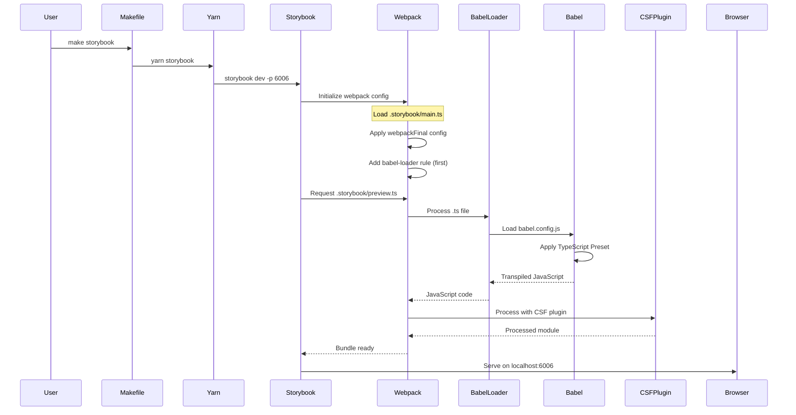
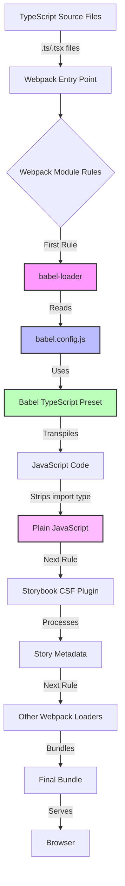
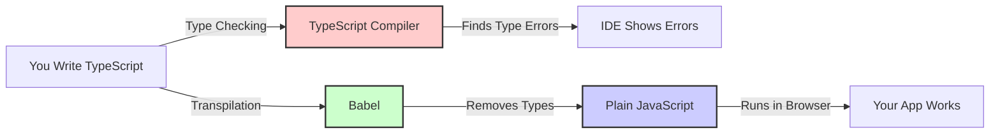
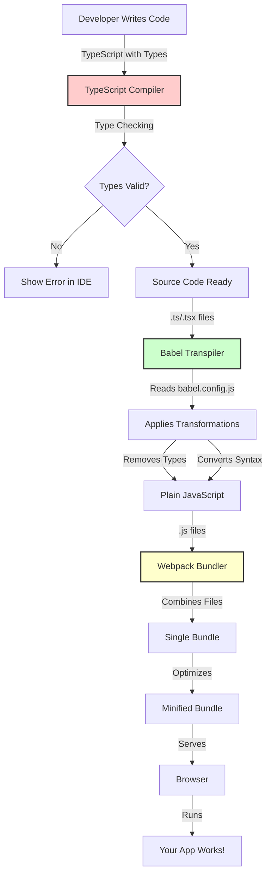
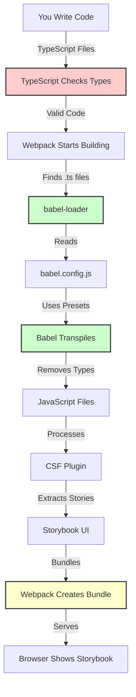
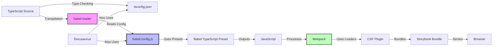

Recently, I spent significant time debugging why Storybook wasn't processing TypeScript files correctly. The error was cryptic: `Module parse failed: Unexpected token` when encountering `import type` syntax. This post documents the solution and explains how the build pipeline actually works.

<!-- truncate -->

## The Problem

When running Storybook with TypeScript files, webpack was trying to parse TypeScript syntax (like `import type`) directly, which it cannot do. Webpack needs JavaScript, not TypeScript. The error looked like this:

```
ERROR in ./.storybook/preview.ts 1:12
Module parse failed: Unexpected token (1:12)
> import type { Preview } from '@storybook/react';
```

## The Solution: A Unified Babel Configuration

The key insight is that **Babel handles TypeScript transpilation**, and we need to ensure babel-loader runs **before** webpack tries to parse the files. Here's how we set it up:

### 1. Babel Configuration (`babel.config.js`)

The main Babel configuration lives at the project root and is shared between Docusaurus and Storybook:

```javascript
module.exports = {
  presets: [
    [require.resolve('@babel/preset-typescript'), { 
      isTSX: true, 
      allExtensions: true 
    }],
    require.resolve('@docusaurus/core/lib/babel/preset'),
  ],
};
```

**What this does:**
- `@babel/preset-typescript` - Strips TypeScript syntax (including `import type`) and converts it to JavaScript
- `@docusaurus/core/lib/babel/preset` - Docusaurus-specific transformations

### 2. Storybook Configuration (`.storybook/main.ts`)

Storybook needs to be told to use babel-loader for TypeScript files:

```typescript
webpackFinal: async (config, { configDir }) => {
  // ... other config ...
  
  // Ensure babel-loader processes TypeScript files FIRST
  if (config.module?.rules) {
    config.module.rules.unshift({
      test: /\.(ts|tsx)$/,
      exclude: /node_modules/,
      use: [
        {
          loader: require.resolve('babel-loader'),
          // babel-loader automatically uses babel.config.js from project root
        },
      ],
    });
  }
  
  return config;
}
```

**Key points:**
- `unshift()` adds the rule at the **beginning** of the rules array
- This ensures babel-loader runs **before** Storybook's CSF plugin
- babel-loader automatically finds and uses `babel.config.js`

### 3. TypeScript Configuration (`tsconfig.json`)

We consolidated to a single `tsconfig.json` that works for both Docusaurus and Storybook:

```json
{
  "extends": "@docusaurus/tsconfig",
  "compilerOptions": {
    "baseUrl": ".",
    "module": "ESNext",
    "moduleResolution": "bundler",
    "allowSyntheticDefaultImports": true,
    "isolatedModules": true
  },
  "include": [
    "src/**/*",
    ".storybook/**/*"
  ]
}
```

## How the Build Process Works

Let me break down what happens when you run `make storybook`:

### Step-by-Step Execution Flow



### The Build Pipeline Architecture



## Understanding TypeScript and Babel: A Layman's Guide

Before we dive into the technical details, let's understand what these tools actually do in simple terms.

### What is TypeScript?

Think of TypeScript as a **safety net** for JavaScript. When you write JavaScript, you can accidentally do things like:

```javascript
function add(a, b) {
  return a + b;
}

add("hello", 5); // Returns "hello5" - probably not what you wanted!
```

TypeScript lets you add **type annotations** to catch these mistakes:

```typescript
function add(a: number, b: number): number {
  return a + b;
}

add("hello", 5); // ❌ Error: "hello" is not a number!
```

**Key Point**: TypeScript is like a spell-checker for your code. It checks for errors **before** your code runs, but it doesn't actually run your code. The type information is like comments that help developers and tools understand the code better.

### What is Babel?

Babel is like a **translator**. Imagine you wrote a book in modern English, but you need to publish it in a language that older readers can understand. Babel does something similar for code:

1. **You write**: Modern JavaScript with TypeScript types
2. **Babel reads it**: Understands the modern syntax
3. **Babel translates**: Converts it to older JavaScript that browsers can run
4. **Babel removes**: All the TypeScript type annotations (they're not needed at runtime)

Here's what Babel does:

```typescript
// What you write (TypeScript):
function greet(name: string): string {
  return `Hello, ${name}!`;
}
```

```javascript
// What Babel produces (JavaScript):
function greet(name) {
  return "Hello, " + name + "!";
}
```

Notice that:
- The `: string` type annotations are **removed** (they were just for checking)
- The template string is converted to regular string concatenation (for older browser support)

**Key Point**: Babel **transpiles** (transforms + compiles) your code. It doesn't check types - it just converts syntax.

### How They Work Together



**The Flow:**
1. **You write TypeScript** → TypeScript checks for type errors (in your IDE)
2. **Babel transpiles** → Removes types and converts to JavaScript
3. **Browser runs** → The JavaScript executes

**Important**: TypeScript and Babel have different jobs:
- **TypeScript**: "Is this code correct?" (type checking)
- **Babel**: "Can I convert this to runnable JavaScript?" (transpilation)

### The Complete Picture: From Source to Browser



## Layman's Guide to All Tools

Here's a simple explanation of every tool in our stack, using everyday analogies:

### The Writing Tools (Development)

**TypeScript** (`tsconfig.json`)
- **Analogy**: Like a grammar checker for code
- **What it does**: Checks if your code makes sense before you run it
- **Example**: Catches mistakes like trying to add a number to a word
- **When it runs**: While you're writing code (in your editor)

**Babel** (`babel.config.js`)
- **Analogy**: Like a translator that converts modern language to older language
- **What it does**: Converts your modern TypeScript/JavaScript to code that old browsers can understand
- **Example**: Converts `const x = 5` to `var x = 5` for older browsers
- **When it runs**: During the build process

**babel-loader**
- **Analogy**: Like a worker who takes files to Babel and brings back the translated version
- **What it does**: Connects Webpack (the build system) to Babel (the translator)
- **Example**: "Hey Babel, translate this TypeScript file for me"
- **When it runs**: During the build process, for each file

### The Assembly Line (Build System)

**Webpack**
- **Analogy**: Like a factory assembly line that takes raw materials and creates a finished product
- **What it does**: Takes all your code files, processes them through various tools, and bundles them into files the browser can use
- **Example**: Combines 100 small files into 3 optimized files
- **When it runs**: During the build process

**Storybook CSF Plugin**
- **Analogy**: Like a specialized worker on the assembly line who handles component documentation
- **What it does**: Processes Storybook story files to extract component information
- **Example**: Reads your component stories and creates the Storybook UI
- **When it runs**: During the build process, after Babel has converted TypeScript

### The Presentation Tools (Development Environment)

**Storybook**
- **Analogy**: Like a showroom where you can see and test individual components
- **What it does**: Creates an isolated environment to develop and test React components
- **Example**: Shows your button component in different states (clicked, hovered, disabled)
- **When it runs**: When you start the Storybook development server

**Docusaurus**
- **Analogy**: Like a website builder for documentation
- **What it does**: Takes your Markdown files and creates a beautiful documentation website
- **Example**: Converts this blog post from Markdown to HTML
- **When it runs**: When you build or start the documentation site

### The Configuration Files

**`babel.config.js`**
- **Analogy**: Like a recipe card for Babel
- **What it does**: Tells Babel how to translate your code
- **Contains**: Instructions like "remove TypeScript types" and "convert modern JavaScript"

**`tsconfig.json`**
- **Analogy**: Like a style guide for TypeScript
- **What it does**: Tells TypeScript how strict to be and what rules to follow
- **Contains**: Settings like "check all files" and "allow modern JavaScript features"

**`.storybook/main.ts`**
- **Analogy**: Like a blueprint for Storybook
- **What it does**: Tells Storybook where to find stories and how to build them
- **Contains**: Instructions like "use babel-loader for TypeScript files"

### How They All Work Together: The Complete Picture



**The Journey:**
1. **You write** TypeScript code with types
2. **TypeScript checks** if the types are correct (catches errors early)
3. **Webpack starts** the build process
4. **babel-loader** takes each TypeScript file
5. **Babel reads** `babel.config.js` to know how to translate
6. **Babel removes** all the type annotations (they're not needed at runtime)
7. **Babel converts** modern syntax to compatible JavaScript
8. **CSF Plugin** processes the JavaScript to extract Storybook stories
9. **Webpack bundles** everything into optimized files
10. **Browser loads** and runs the final JavaScript

## The Toolchain: What Each Component Does

Before diving into the build process, let's understand each tool in the stack:

### Core Build Tools

#### 1. **TypeScript** (`tsconfig.json`)
- **Purpose**: Type system and developer experience
- **What it does**:
  - Provides static type checking
  - Enables IDE autocomplete and IntelliSense
  - Catches type errors before runtime
  - **Important**: TypeScript does NOT compile code - it only checks types
- **Configuration**: `tsconfig.json` defines compiler options and project structure
- **When it runs**: During development (IDE) and optionally during build (type checking)

#### 2. **Babel** (`babel.config.js` + `babel-loader`)
- **Purpose**: JavaScript transpiler and transformer
- **What it does**:
  - **Transpiles** TypeScript syntax → JavaScript
  - Strips type annotations (`import type`, `: Type`, etc.)
  - Converts modern JavaScript to compatible versions
  - Transforms JSX to JavaScript
  - Applies code transformations (plugins)
- **Configuration**: `babel.config.js` defines presets and plugins
- **When it runs**: At build time via `babel-loader` in webpack
- **Key insight**: Babel is the bridge between TypeScript source and webpack's JavaScript requirement

#### 3. **Webpack**
- **Purpose**: Module bundler and build orchestrator
- **What it does**:
  - Orchestrates the entire build process
  - Manages module resolution and dependencies
  - Processes files through loaders (transformations)
  - Bundles everything into optimized output files
  - Handles code splitting and optimization
- **Configuration**: `.storybook/main.ts` (webpackFinal function)
- **When it runs**: During build/development server startup
- **Key limitation**: Webpack only understands JavaScript - it needs loaders to process other file types

#### 4. **babel-loader**
- **Purpose**: Webpack loader that runs Babel
- **What it does**:
  - Acts as a bridge between webpack and Babel
  - Processes `.ts`/`.tsx` files through Babel
  - Automatically finds and uses `babel.config.js`
  - Returns JavaScript that webpack can understand
- **Configuration**: Defined in webpack rules
- **When it runs**: During webpack's module processing phase

### Development Tools

#### 5. **Storybook**
- **Purpose**: Component development and documentation environment
- **What it does**:
  - Provides isolated component development environment
  - Renders components in different states (stories)
  - Generates interactive documentation
  - Uses webpack under the hood for bundling
  - Adds Storybook-specific loaders (CSF plugin, etc.)
- **Configuration**: `.storybook/main.ts` and `.storybook/preview.ts`
- **When it runs**: Development server (`yarn storybook`) or build (`yarn build-storybook`)

#### 6. **Storybook CSF Plugin**
- **Purpose**: Processes Storybook story files
- **What it does**:
  - Parses `.stories.tsx` files
  - Extracts story metadata
  - Generates story exports
  - **Requires**: JavaScript input (not TypeScript)
- **When it runs**: After babel-loader has transpiled TypeScript

#### 7. **Docusaurus**
- **Purpose**: Documentation and blog platform
- **What it does**:
  - Generates static documentation site
  - Processes Markdown and MDX files
  - Uses the same Babel configuration as Storybook
  - Provides the blog where this post lives!
- **Configuration**: `docusaurus.config.js`
- **When it runs**: During site build or development server

### Configuration Files

#### 8. **`babel.config.js`**
- **Purpose**: Central Babel configuration
- **What it contains**:
  - Presets (TypeScript, Docusaurus)
  - Plugins (transformations)
  - Shared by Docusaurus and Storybook
- **Location**: Project root

#### 9. **`tsconfig.json`**
- **Purpose**: TypeScript compiler configuration
- **What it contains**:
  - Compiler options (module system, target, etc.)
  - Path mappings
  - Include/exclude patterns
- **Location**: Project root (shared)

#### 10. **`.storybook/main.ts`**
- **Purpose**: Storybook configuration
- **What it contains**:
  - Story file patterns
  - Addon configuration
  - Webpack customization (webpackFinal)
  - Babel configuration
- **Location**: `.storybook/` directory

### Tool Interaction Summary



## Understanding the Dependencies

### Tool Responsibilities

1. **TypeScript (`tsconfig.json`)**
   - Provides type checking (when enabled)
   - IDE support and autocomplete
   - **Does NOT compile code** - that's Babel's job

2. **Babel (`babel.config.js` + `babel-loader`)**
   - **Transpiles** TypeScript → JavaScript
   - Strips type annotations (`import type`, `: Type`, etc.)
   - Applies transformations (JSX, modern syntax, etc.)
   - Runs **at build time** via webpack

3. **Webpack**
   - Orchestrates the build process
   - Manages module resolution
   - Bundles everything together
   - **Does NOT understand TypeScript** - needs babel-loader

4. **Storybook**
   - Provides the development environment
   - Uses webpack under the hood
   - Adds Storybook-specific loaders (CSF plugin, etc.)

### Why Order Matters

The webpack loader chain executes in **reverse order** (right to left), but rules are processed **top to bottom**. By using `unshift()`, we ensure:

1. **babel-loader runs first** → TypeScript becomes JavaScript
2. **CSF plugin runs second** → Processes the JavaScript
3. **Other loaders run** → Final processing

If babel-loader runs after the CSF plugin, the plugin tries to parse TypeScript syntax and fails.

## The Complete Setup

Here's what we ended up with:

### File Structure
```
bytesofpurpose-blog/
├── babel.config.js          # Shared Babel config (Docusaurus + Storybook)
├── tsconfig.json            # Shared TypeScript config
├── .storybook/
│   ├── main.ts              # Storybook webpack config
│   └── preview.ts           # Storybook preview config
└── src/
    └── **/*.stories.tsx     # Story files
```

### Configuration Files

**`babel.config.js`** - The single source of truth for transpilation:
```javascript
module.exports = {
  presets: [
    [require.resolve('@babel/preset-typescript'), { 
      isTSX: true, 
      allExtensions: true 
    }],
    require.resolve('@docusaurus/core/lib/babel/preset'),
  ],
};
```

**`.storybook/main.ts`** - Minimal webpack configuration:
```typescript
webpackFinal: async (config) => {
  // Add babel-loader rule FIRST
  config.module.rules.unshift({
    test: /\.(ts|tsx)$/,
    exclude: /node_modules/,
    use: [{ loader: require.resolve('babel-loader') }],
  });
  return config;
}
```

## Key Takeaways

1. **Babel transpiles, TypeScript types** - TypeScript provides types, Babel removes them
2. **Webpack needs JavaScript** - It can't parse TypeScript directly
3. **Loader order matters** - babel-loader must run before other loaders
4. **Unified config is better** - One `babel.config.js` for the whole project
5. **No pre-compilation needed** - babel-loader handles it on-the-fly

## Common Pitfalls

### ❌ Wrong: Adding rule at the end
```typescript
config.module.rules.push({ ... }); // Runs AFTER other rules
```

### ✅ Right: Adding rule at the beginning
```typescript
config.module.rules.unshift({ ... }); // Runs BEFORE other rules
```

### ❌ Wrong: Duplicating Babel config
```typescript
// Don't duplicate presets in webpack config
loader: require.resolve('babel-loader'),
options: {
  presets: [...], // ❌ Already in babel.config.js
}
```

### ✅ Right: Let babel-loader find config
```typescript
// babel-loader automatically uses babel.config.js
loader: require.resolve('babel-loader'),
// No options needed!
```

## Conclusion

Understanding how TypeScript, Babel, and Webpack work together is crucial for debugging build issues. The key insight is that **Babel is the bridge** between TypeScript source code and webpack's JavaScript requirements. By ensuring babel-loader runs first in the webpack pipeline, we maintain a clean, unified build process that works for both Docusaurus and Storybook.

The setup is now simple and maintainable:
- One `babel.config.js` for the entire project
- Minimal webpack configuration in Storybook
- No pre-compilation step needed
- Everything works seamlessly together

## References

- [Storybook TypeScript Configuration](https://storybook.js.org/docs/configure/typescript)
- [Babel TypeScript Preset](https://babeljs.io/docs/en/babel-preset-typescript)
- [Webpack Loaders](https://webpack.js.org/concepts/loaders/)
- [Storybook Webpack Configuration](https://storybook.js.org/docs/builders/webpack)

