# Autonomous Build Agents: Reference Design

_This is a generalized, public reference design derived from an internal design. It is retold in a generic SaaS-delivery domain; customer-, vendor-, and commercial-specific details have been removed._

<!-- truncate -->

import Mockups from './_mockups/autonomous-build-agents.mdx';

<Mockups />

---

## Executive Summary

A delivery organization's delivery-tooling team has shipped AI agents that automate the planning phase of low-code SaaS delivery, turning project documents into sprint-ready work items with technical guidance, estimates, and test steps. But everything after planning is still manual: a developer reads the natural-language guidance, logs into the client's tenant, and builds every configuration by hand. This High-Level Design (HLD) proposes four **Autonomous Build Agents**: Instance Readiness, Auto Developer, Auto Tester, and Knowledge Transfer Writer, that pick up a work item at the "Work In Progress" state and carry it through configuration and validation (see [§7.1 Components](#71-components)).

The central challenge is cross-instance execution: the agents run on the delivery org's own internal build instance but must safely modify a *client's* target system (the client tenant), which the platform's local-only tooling does not natively support. Three architectures are compared (see [§6.2 Architecture Options](#62-architecture-options)): Option A generates a reviewable Instance Commit artifact, Option B is a live supervised partner via a Model Context Protocol (MCP) bridge, and Option C uses an external orchestrator with Agent-to-Agent (A2A) dispatch.

Key decisions and status: the recommendation is to **build Option A first** then evolve toward B (see [§6.4 Recommendation](#64-recommendation)); the primary interaction surface is leaning toward the in-product assistant panel (D13); and tenancy is leaning per-client (D16). Most of the 19 design decisions (D1 to D19) remain TBD pending delivery-consultant input.

Expected value: one delivery consultant can guide many concurrent projects instead of one, with consistent, auditable, reversible builds. <Assumption>Work In Progress through Ready for Testing is 60 to 70% of work-item cycle time.</Assumption> Status is **In Review**. The biggest open questions are the agent location (D1), delivery mechanism (D2), and the Instance Commit generation spike: the single hardest technical risk.

---

## 1. Purpose & Context

### Purpose

This document defines the high-level design for **Autonomous Build Agents**: AI agents for a SaaS-delivery organization, developed within the platform's agent authoring environment by the **delivery-tooling team**. The agents currently assist with the tech design/planning phase of a project but **not the build/configure phase** of delivery.

### Who Is Building This & Why

The **delivery-tooling team** is the internal team responsible for building AI-powered tooling for the delivery organization. The team has already shipped:

- **Create Requirements Epics**: extracts requirements from project documents and generates a full requirement → epic → feature → work item hierarchy
- **Tech Design**: enriches sprint-ready work items with acceptance criteria validation, work-item point estimation, technical guidance, configuration assessment, and test cases

These agents run on the platform's **agent framework** in the **agent authoring environment** on the delivery org's own **internal build instance**. They modify that same instance: tools are internal, not externally callable.

**Why this design matters:** The planning agents have proven the model works. But the highest-value, most time-consuming part of delivery: the actual build; remains entirely manual. Development is slow, requires deep domain expertise, and every implementation is essentially rebuilt from scratch. Fine-tuning and iterating on configurations is a manual feedback loop between the developer and the client tenant. This design closes that gap.

### Context

Once a work item enters a sprint, there is **no AI-assisted support** for the actual implementation work.

```mermaid
%% animate: flow
flowchart TB
    subgraph INSIDE["Within the Delivery Org's Environment"]
        subgraph BUILD["Internal Build Instance"]
            direction TB

            subgraph PLANNING["Planning Workflows (Existing)"]
                WF1["Create Requirements Epics<br/>Doc → Req → Epic → Feature → Work Item"]
                WF2["Tech Design<br/>Work Item → AC Validation → Points →<br/>Tech Guidance → Config Assessment → Tests"]
            end

            subgraph AGENTS_PLAN["Planning Agents"]
                A1["Document & Visual<br/>Insights Agent"]
                A2["Create Req<br/>Epic Feature Agent"]
                A3["Create<br/>Work Items Agent"]
                A4["Work-Item QA Agent"]
                A5["Work-Item Point<br/>Estimator"]
                A6["Technical Guidance<br/>Provider"]
                A7["Config Level<br/>Setter"]
                A8["Work-Item Testing<br/>Agent"]
            end

            subgraph TOOLS_PLAN["Internal Tools (server-side scripting)"]
                T1["Create Req/Epic/Feature Tool"]
                T2["Create Work-Item Tool"]
                T3["Lookup / Update Work-Item Tools"]
            end

            MCP_BUILD["Internal MCP Server<br/>(Build Instance)"]
            A2A["A2A Integration<br/>(Agent-to-Agent)"]
            BUILD_DB[("Build Instance DB<br/>project, requirement,<br/>epic, feature, work item")]

            WF1 --> A1 & A2 & A3
            WF2 --> A4 & A5 & A6 & A7 & A8
            AGENTS_PLAN --> TOOLS_PLAN
            TOOLS_PLAN -->|"read/write<br/>(same instance)"| BUILD_DB
            AGENTS_PLAN -.->|"external calls"| A2A
            TOOLS_PLAN -.-> MCP_BUILD
        end
    end

    subgraph DECISION_ZONE["Decision Zone &#8212; Where Do Build Agents Live? (D1)"]
        subgraph IMPL["Autonomous Build Agents (This Design &#8212; Phase 2)"]
            direction TB
            IRA["Instance Readiness<br/>Agent"]
            ADA["Auto Developer"]
            ATA["Auto Tester"]
            KTA["Knowledge Transfer<br/>Writer"]
        end
        MCP_BRIDGE["MCP Server<br/>(Cross-Instance Bridge)<br/>OAuth Service Account"]
    end

    REPO[("Instance Commit Repository<br/>(Git / object store / source control)<br/>Commit Artifacts")]

    subgraph OUTSIDE["Within the Client's Environment"]
        subgraph CUSTOMERS["Client Target Systems"]
            subgraph CUST1_ENV["Client Tenant A"]
                CUST1[("Dev Environment")]
                MCP_CUST1["Internal MCP Server"]
            end
            subgraph CUST2_ENV["Client Tenant B"]
                CUST2[("Dev Environment")]
                MCP_CUST2["Internal MCP Server"]
            end
        end
    end

    INSIDE ~~~ DECISION_ZONE
    DECISION_ZONE ~~~ OUTSIDE
    BUILD ~~~ IMPL
    IMPL ~~~ CUSTOMERS

    PLANNING -->|"Sprint-ready work items<br/>+ tech guidance"| IMPL

    %% Option A: Instance Commit Generator
    ADA -->|"A: generate commit"| REPO
    REPO -->|"A: pull & preview"| CUST1
    REPO -->|"A: pull & preview"| CUST2

    %% Option B: Supervised Partner (live MCP)
    IMPL -->|"B: live read/write"| MCP_BRIDGE
    MCP_BRIDGE -->|"B: OAuth"| MCP_CUST1
    MCP_BRIDGE -->|"B: OAuth"| MCP_CUST2

    %% Option C: A2A dispatch
    IMPL -.->|"C: A2A dispatch"| MCP_CUST1
    IMPL -.->|"C: A2A dispatch"| MCP_CUST2

```

:::info[Legend]
Solid arrows = primary data flow. `A:` = Option A (Instance Commit via repo). `B:` = Option B (live MCP bridge). `C:` = Option C (A2A agent dispatch). Dashed border on "Decision Zone" = the agent hosting environment is a key design decision ([D1](#d1-agent-location--environment)).
:::

:::info[Phased rollout]
**Phase 1** (current) covers planning and documentation agents. **Phase 2** (this design) adds build agents that cross the instance boundary. The platform's **agent framework** includes an **A2A (Agent-to-Agent) integration**: each instance (the internal build instance and each client tenant) runs its own **internal MCP server** for local tool access.
:::

### Key Decisions This Design Must Resolve

This design hinges on several interdependent architectural decisions. Each is explored in detail in [Section 6.5](#65-key-design-decisions); the summary below orients the reader.

| ID | Decision | Question | Status |
|----|----------|----------|--------|
| **D1** | Agent Location | Where do build agents run: the internal build instance, the client tenant, or external? | TBD |
| **D2** | Delivery Mechanism | Are changes delivered as Instance Commits (reviewable artifacts) or applied directly to the client tenant? | TBD |
| **D3** | Human-in-the-Loop Model | Is the agent autonomous (human reviews output), interactive (human collaborates in real-time), or hybrid? | TBD |
| **D4** | Sandboxing | How do we isolate agent changes from the live client environment until approved? | TBD |
| **D5** | Feedback & Interaction | How does the agent get answers to questions mid-implementation? Who is the user: delivery consultant, partner, client? | TBD |
| **D6** | Triggering Mechanism | Are agents auto-triggered on work-item state change, or manually invoked and pointed at a work item? | TBD |
| **D7** | Agent Boundaries | Are the four "agents" truly separate agents, or skills on a single agent? How do we achieve a unified agent-driven interface within the platform? | TBD |
| **D8** | Agentic Workflow vs Interactive | Should implementation follow the same autonomous workflow pattern as planning, or a different interactive pattern? | TBD |
| **D9** | Skills & Domain Knowledge | How does the agent acquire domain-specific best practices per project type (service management, customer service, HR service delivery, etc.)? | TBD |
| **D10** | Planning + Implementation Unification | Should planning and implementation be one agent system or two separate systems with different interaction patterns? | TBD |
| **D11** | Model Selection | Which LLM(s) power which agents? Can we mix models (e.g., a strong code-gen model for build, a platform-native model for platform tasks)? | TBD |
| **D12** | Guardrails Strategy | What are the hard guardrails (never do), soft guardrails (confirm first), and auto-approve patterns (read-only)? | TBD |
| **D13** | Primary Interaction Surface | Is the in-product assistant panel the primary UX, with external agents/tools called behind it? | Leaning Yes |
| **D14** | Speed vs Dog-Fooding | How much do we build on the platform vs external tools? Balance between showcasing platform capabilities and shipping fast. | TBD |
| **D15** | Knowledge Base & Consultant Feedback Loop | How do we gather delivery-consultant feedback and build an incrementally-improving knowledge base? | TBD |
| **D16** | Tenancy Model | Is the agentic solution tenanted: one agent swarm per client/project tenant? | TBD |
| **D17** | SDK & Framework Choice | A vendor-native SDK vs a framework-agnostic orchestration runtime vs a cloud agent platform vs platform-native? How important is model replaceability? | TBD |
| **D18** | Authentication Strategy | What credential package is needed? OAuth patterns, service accounts, per-client credential management. | TBD |
| **D19** | Security & Permissions Model | Who has read/write access to client tenants? Can agents be scoped? Can clients add guardrails? | TBD |

### Challenges

1. **Cross-instance execution model**: Build agents run on the internal build instance but need to **modify client tenants**. The platform's native agent tools only modify the local instance. Open questions: which MCP implementation, multi-tenancy configuration, MCP vs Instance Commit execution, need for an external orchestrator.

2. **Safe execution on client tenants**: Agents will touch production-adjacent environments. Sandboxing, rollback capability, and safe execution patterns are non-negotiable.

3. **Internal tooling limitations**: The platform's server-side scripting tools execute against the local instance only. Cross-instance patterns must work within or around this constraint.

4. **Manual translation of tech guidance**: Developers read natural-language guidance and manually determine which tables, fields, business rules, and client scripts to create. This translation is time-consuming and inconsistent.

5. **No automated scaffolding**: Repeatable platform configuration patterns are rebuilt manually every time. <Assumption>These repeatable patterns exist and are common enough to justify templating.</Assumption>

6. **Validation gap**: No AI-assisted check that implementation matches acceptance criteria before human review.

7. **Disconnected pipeline**: Planning agents produce structured output but there is no programmatic handoff to implementation. <Assumption>A programmatic handoff is technically feasible despite the cross-instance boundary.</Assumption>

8. **Knowledge silos**: Institutional knowledge about best practices and client-specific patterns lives in senior developers' heads. <Assumption>This tribal knowledge problem is significant enough to address in this design.</Assumption>

### Pain Points Driving This Work

- **Development is slow**: Even with structured tech guidance, translating it into platform configurations is a manual, time-intensive process. Each work item requires a developer to log into the client tenant, mentally map guidance to platform objects, and build by hand.
- **Fine-tuning is a manual feedback loop**: Getting configurations right often takes multiple iterations. Each cycle (build → test → adjust) requires developer context-switching between the work-item record, the client tenant, and their own notes.
- **Institutional knowledge is trapped**: Senior developers carry domain-specific best practices (e.g., "for service-management incident workflows, always configure X before Y") in their heads. When they're unavailable or leave, this knowledge is lost.
- **No mechanism to learn from consultant feedback**: Delivery consultants discover issues and patterns during implementation, but there's no structured way to feed this back into the agent system to improve future generations.
- **Inconsistent quality**: Different developers implement the same pattern differently. There's no enforced standard for how a given configuration type should be built.

### Design Tenets

These principles guide every design decision in this document:

1. **Client trust above all**: The client's tenant is sacred. Every change is transparent, reviewable, and reversible. The client approves before anything lands on their tenant.
2. **Move fast without breaking trust**: Speed matters, but never at the expense of auditability or client confidence. The system should make delivery consultants faster while maintaining full traceability.
3. **Don't get in the consultant's way**: The agent should accelerate the delivery consultant, not slow them down with constant prompts. Auto-approve rules let the consultant dial their oversight level.
4. **Amplify, never replace**: We are not building a system to eliminate delivery consultants. We are building a system so one consultant can take on 10 projects instead of one. The consultant is always at the helm; guiding the agent, making the calls, keeping the client's interests front and center.
5. **Everything is tracked**: Every prompt, execution plan, agent decision, consultant correction, and config change is logged. Nothing is lost. This is the audit trail for the client, for the consultant, and for system improvement.
6. **The system gets better**: Consultant corrections and feedback flow back into agent behavior. Each engagement makes the next one better.

### Motivation

Extending the AI pipeline from "sprint-ready" into "implementation-assisted" would:
- Reduce time-to-implement for standard configuration patterns
- Improve consistency by encoding best practices into agent tools
- Free senior developers from routine configuration work
- Close the gap between planning agents and execution
- Establish safe, repeatable patterns for AI-assisted modification of client tenants
- **Create a feedback loop** where consultant implementation experience improves agent behavior over time

## System Users & Personas

The build agents serve a small set of distinct personas. The **delivery consultant** is the primary user and the one always "at the helm" (Design Tenet 4): every other persona orbits the consultant's workflow. The personas below are derived from D5 (User Persona) and the pain points and tenets in Section 1.

### Personas

| Persona | Role | Primary Interests / Motivations |
|---------|------|---------------------------------|
| **Delivery Consultant** | Primary user. Guides the agent, approves changes, keeps client interests front and center. | Take on 10 projects instead of 1; stay in control; auditable, reversible builds; not get slowed down by constant prompts. |
| **Implementor / Developer** | Builds configurations today by hand; becomes the agent's reviewer/collaborator. | Stop manually translating tech guidance; consistent scaffolding; fewer context switches between work item, instance, and notes. |
| **Delivery-Tooling Team** | Builders of the agent system. | Extend the proven planning pipeline into build; dog-food the platform; ship fast without breaking trust. |
| **Client** | Owns the target system; grants access; approves what lands. | Tenant is sacred: transparent, reviewable, reversible changes; optional client-side guardrails (D19). |
| **Partner** | Possible future delivery user (per D5 persona options). | Same acceleration as in-house consultants, scoped to partner-led engagements. |
| **Senior Developer (SME)** | Source of tribal best-practice knowledge to be captured. | Encode domain patterns once; stop being the single point of knowledge (D15). |

### User-Profiling Diagram

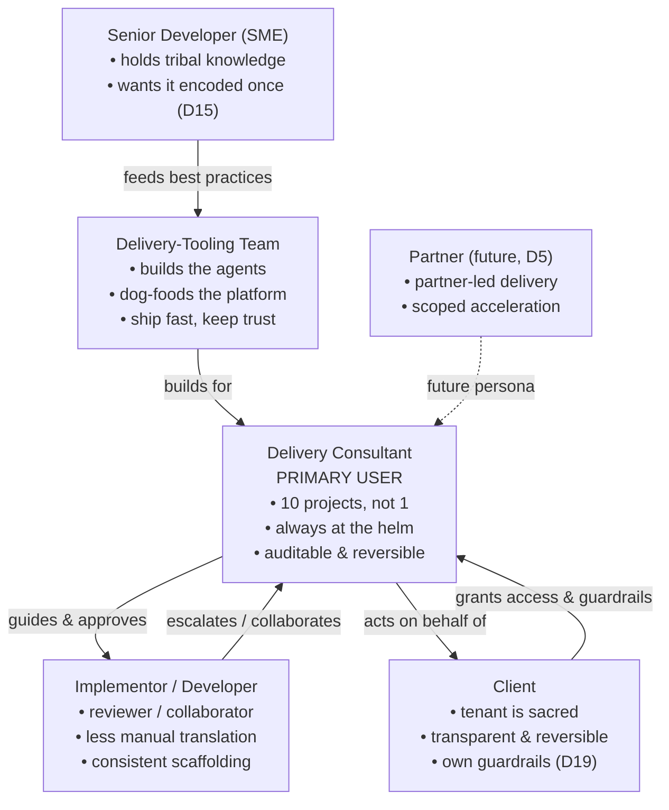

:::note[Note]
The user persona is itself an open decision ([D5](#d5-feedback--interaction--who-is-the-user)); initial scope assumes in-house implementors/consultants, with partners and clients as later expansions.
:::

## 2. Objectives

### 2.1 Business Goals

- **Accelerate implementation velocity**: Reduce time from sprint-ready work item to configured-and-verified by automating routine platform configurations
- **Improve build quality and consistency**: Eliminate variance between consultants by encoding best practices into agent tooling
- **Scale delivery capacity**: Enable more concurrent projects without proportionally scaling headcount

### 2.2 Technical Goals

Build four build agents (see [Section 7.1](#71-components) for detailed component specifications):

1. **Instance Readiness Agent** (Prerequisite): Pre-flight validation of client-tenant compatibility
2. **Auto Developer Agent** (P1 Core): Reads work item + tech guidance, executes configurations autonomously
3. **Auto Tester Agent** (P2): Validates configurations against acceptance criteria
4. **Knowledge Transfer Writer** (P3): Captures structured implementation logs

Additional goals:
- **Solve cross-instance execution** via a secure bridge from the internal build instance to client dev tenants
- **Build within the platform's agent framework**: extend the existing platform, not build a parallel system

### 2.2a Open Decisions Affecting Requirements

The following decisions ([Section 6.5](#65-key-design-decisions)) are unresolved and directly shape the technical requirements:

| Decision | Impact on Requirements | Current Assumption |
|----------|----------------------|-------------------|
| **D1** Agent Location | Determines deployment model, tool access patterns, infrastructure needs | TBD |
| **D2** Delivery Mechanism | Determines whether we build Instance Commit generation or live MCP tooling | TBD: leaning Instance Commits (Option A) |
| **D3** Human-in-the-Loop | Determines UX requirements, assistant-panel integration depth | TBD |
| **D5** User Persona | Determines access control, licensing, training requirements | TBD: assumed in-house implementors initially |
| **D6** Triggering | Determines workflow integration pattern | TBD: manual invocation observed |
| **D7** Agent Boundaries | Determines agent-framework record structure (1 agent vs 4) | TBD: current design assumes 4 separate agents |
| **D8** Workflow Pattern | Determines whether implementation reuses planning workflow infra or needs new patterns | TBD |
| **D9** Domain Skills | Determines knowledge architecture and per-project configuration | TBD |

### 2.3 Success Criteria

- Instance Readiness Agent detects version/capability mismatches and halts before any writes
- Auto Developer Agent autonomously executes at least one standard configuration pattern end-to-end on a client dev tenant
- Auto Tester Agent validates configurations match acceptance criteria without manual QA
- Knowledge Transfer Writer writes a structured log to the work-item record
- All agents operate safely with clear audit trails

### 2.4 Non-Goals (Behavioral Boundaries)

These define what the agents explicitly **do not do**, even within scope:

- **Replacing developers**: Agents handle routine, pattern-based configurations. Complex custom development remains human work
- **Auto-remediation**: Instance Readiness Agent detects problems but does not fix them
- **Auto-commit of Instance Commits**: Generated Instance Commits must always be previewed by a human before commit

## 3. Scope

### 3.1 In Scope

| Area | What's Included |
|------|----------------|
| **Build Agents** | Design of four agents: responsibilities, orchestration, and tooling |
| **Cross-instance execution bridge** | Architecture for agents on the internal build instance to safely read/write on client dev tenants |
| **Planning pipeline integration** | How build agents consume sprint-ready work-item records |
| **Safe execution patterns** | Sandboxing, rollback, audit trails, guardrails |
| **Standard configuration patterns** | Repeatable platform build patterns the Auto Developer Agent will support |
| **Agent framework extension** | How new agents fit into the existing agent-framework data model |

### 3.2 Out of Scope

| Area | Why |
|------|-----|
| **Existing planning workflows** | Documented separately. This design assumes their output exists and is correct. |
| **Deployment / release management** | Dev → test → prod promotion is a separate concern |
| **Complex custom development** | Integrations, scripted solutions, and edge-case configurations remain developer-led |
| **Non-delivery use cases** | Agents are designed for the delivery org's delivery patterns only |
| **LLM model selection / training** | Now partially in scope as D11 (model selection) and D17 (SDK choice). Fine-tuning/training remains out of scope. |
| **General-purpose platform configuration tool** | This is delivery-specific, not arbitrary platform configuration |

### 3.3 System Boundaries

```mermaid
flowchart LR
    subgraph BOUNDARY_IN["This Design Controls"]
        direction TB
        IRA["Instance Readiness Agent"]
        ADA["Auto Developer Agent"]
        ATA["Auto Tester Agent"]
        KTA["Knowledge Transfer Writer"]
        BRIDGE["Cross-Instance Bridge"]
        ORCH["Orchestration / Workflow"]
    end

    subgraph BOUNDARY_UPSTREAM["Upstream (Existing &#8212; Not In Scope)"]
        direction TB
        WF_PLAN["Planning Workflows<br/>(Create Req Epics, Tech Design)"]
        STORY["Sprint-Ready Work-Item Record<br/>Tech Guidance + AC + Test Steps + Points"]
    end

    subgraph BOUNDARY_TARGET["Target (Client Tenant)"]
        direction TB
        CUST_DEV["Client Dev Tenant<br/>Tables, BRs, Client Scripts,<br/>Catalog Items, Workflows"]
    end

    subgraph BOUNDARY_DOWNSTREAM["Downstream (Not In Scope)"]
        direction TB
        PROMOTE["Instance Commit Promotion<br/>Dev → Test → Prod"]
    end

    WF_PLAN -->|"produces"| STORY
    STORY -->|"consumed by"| BOUNDARY_IN
    BRIDGE -->|"reads/writes"| CUST_DEV
    CUST_DEV -.->|"future"| PROMOTE

```

**Handoff point:** The work-item record: once sprint-ready (tech guidance populated, AC validated, work-item points estimated, test steps generated), the build pipeline takes over.

**Downstream boundary:** The client dev tenant with configurations applied. What happens after (promotion, go-live) is outside this design.

## 4. Current State (As-Is)

### Current Delivery Pipeline

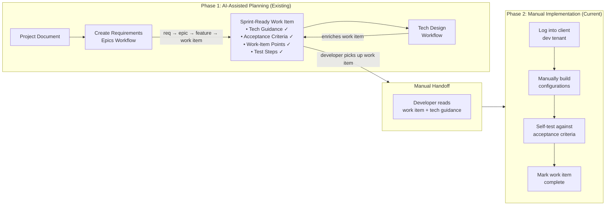

### What Developers Do Today

When a developer picks up a sprint-ready work item: read the work-item record on the internal build instance → mentally translate tech guidance into a configuration plan → log into the client dev tenant → build configurations by hand → self-test against AC → document (inconsistently) → mark complete. There is no structured handoff between planning output and implementation; the tech guidance is natural language, not a machine-readable spec. <Assumption>Documentation of implementation details is inconsistent and often minimal.</Assumption>

### How Cross-Instance Work Happens Today

Developers access client tenants through browser-based login. All configuration work happens through the platform UI or background scripts. There is **no programmatic bridge**: the developer is the bridge. Instance Commits are created *on* the client tenant as a byproduct, not generated externally.

### Work-Item State Machine & Agent Triggers

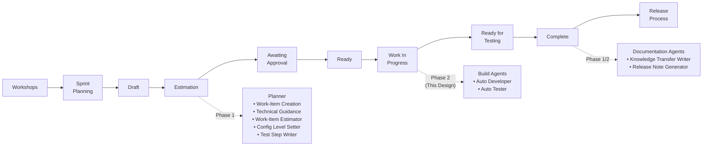

### Current Agent Architecture (Brief)

The agent framework on the internal build instance provides: **Workflows**, **Teams** (Agent Team / Team Member), **Agents**, and **Tools** (server-side scripts, local instance only).

| Workflow | Agents (in order) | Triggers at State |
|----------|-------------------|-------------------|
| **Tech Design** | Technical Guidance Provider → Config Level Setter → Work-Item Point Estimator → Work-Item Testing Agent | Estimation |
| **Create Requirements Epics** | Document & Visual Insights Agent → Create Req Epic Feature Agent → Create Work Items Agent | Manual |
| **Sprint Planner** | Build Sprint with Work Items | Sprint Planning |

**Critical limitation:** Tools operate against the instance they run on: no built-in mechanism for cross-instance operations. The framework does include an **A2A (Agent-to-Agent) integration** capability for inter-instance agent communication, and each instance runs its own **internal MCP server** for local tool access.

**Triggering observation:** Current planning agents appear to require **manual invocation** oriented to a specific work item: they do not auto-trigger when a work item transitions to the expected state. The agent validates the work item is in the correct state before acting, but the trigger itself is manual. This has implications for [D6: Triggering Mechanism](#d6-triggering-mechanism).

## 5. Problem Statement & Gaps

### 5.1 Problem Statement

The AI agent pipeline produces structured output; requirements, work items with AC, tech guidance, config assessments, work-item points, test steps. But this output terminates at the **Estimation** state. At **Work In Progress**, the developer enters a fully manual workflow. The structured output is consumed as *text to read*, not as *instructions to execute*.

### 5.2 Gap Analysis

| # | Challenge (from Section 1) | Capability Gap | Addressed By |
|---|---------------------------|----------------|-------------|
| 1 | Cross-instance execution | No mechanism for agents on the internal build instance to operate on client tenants | **MCP Server bridge** |
| 2 | Safe execution | No sandboxing, rollback, or audit trail for automated writes | **Instance Readiness Agent** + safe execution patterns |
| 3 | Tooling limitations | Server-side scripting tools can't reach remote instances | **MCP-backed tools** |
| 4 | Manual translation | Developers manually interpret guidance | **Auto Developer Agent** |
| 5 | No scaffolding | Repeatable patterns rebuilt manually | **Auto Developer Agent** with pattern templates |
| 6 | Validation gap | No automated AC verification | **Auto Tester Agent** |
| 7 | Disconnected pipeline | No programmatic planning → implementation handoff | **Work-item state machine integration** |
| 8 | Knowledge silos | Implementation knowledge is tribal | **Knowledge Transfer Writer** |
| 9 | No audit trail | No structured logging of agent interactions, decisions, or config changes per work item | **Implementation Audit Trail**: per-work-item log capturing prompts, plans, decisions, consultant approvals/corrections, and config changes |
| 10 | No per-client knowledge | Each agent session starts from zero; consultant tribal knowledge not captured in reusable form | **Per-Client Knowledge Repository**: shared, growing knowledge base scoped per client/project that accumulates instance patterns, consultant corrections, and best practices |

### 5.3 Impact Assessment

- **Time:** Implementation consumes the majority of sprint time. <Assumption>Work In Progress → Ready for Testing is 60-70% of work-item cycle time.</Assumption> Even partial automation significantly reduces sprint velocity bottlenecks.
- **Quality:** Configuration quality varies by experience. Encoding senior developer patterns into agent tools raises the quality floor.
- **Knowledge retention:** When consultants leave, implementation knowledge is lost. The Knowledge Transfer Writer addresses this directly.
- **Scale:** Team capacity is linearly tied to headcount. AI-assisted implementation breaks this for standard patterns.

## 6. Proposed Design

### 6.1 Target State Overview

The target state introduces build agents that trigger at **Work In Progress**, a cross-instance capability, pre-flight validation, and structured implementation logging. The core architectural question is *how* the agent interacts with the client tenant.

### 6.2 Architecture Options

#### Option A: Autonomous Instance Commit Generator (P1 Preference)

The agent runs **autonomously on the internal build instance**, produces an **Instance Commit** (a reviewable, reversible change bundle), and pushes it to a shared repository. No direct live connection required during generation.

```mermaid
flowchart LR
    subgraph BUILD["Internal Build Instance"]
        STORY["Sprint-Ready Work Item<br/>+ Tech Guidance"]
        IRA["Instance Readiness<br/>Agent"]
        ADA["Auto Developer<br/>(Autonomous)"]
        USET["Generated Instance Commit<br/>(reviewable bundle)"]

        STORY --> IRA -->|"pre-flight pass"| ADA -->|"generates"| USET
    end

    REPO[("Shared Repository<br/>(Git / object store / source control)<br/>Push & Pull Instance Commits")]

    subgraph CUSTOMER["Client Dev Tenant"]
        PULL["Pull Instance Commit"]
        PREVIEW["Preview & Review"]
        COMMIT["Apply Instance Commit"]

        PULL --> PREVIEW --> COMMIT
    end

    USET -->|"push"| REPO
    REPO -->|"pull"| PULL

    ATA["Auto Tester<br/>(post-install validation)"]
    COMMIT --> ATA

    KTA["Knowledge Transfer<br/>Writer"]
    ATA -->|"logs what was done"| KTA

```

**How it works:** Work item triggers → Instance Readiness pre-flights via REST → Auto Developer generates config plan → generates an Instance Commit → pushes to shared repo → developer pulls/previews/applies on client tenant → Auto Tester validates → Knowledge Transfer Writer documents.

**Strengths:** Safest (reviewable artifact), familiar (reviewable change bundles are standard), version-controllable, works offline/air-gapped, avoids live MCP dependency.

**Weaknesses:** No real-time feedback during generation, commit generation is complex, preview/apply is manual, limited to commit-expressible configurations.

---

#### Option B: Supervised Implementation Partner (Live Supervised Bridge via MCP)

A **real-time pair-programming partner**: agent proposes configurations, developer reviews/approves via the in-product assistant panel, agent applies via the MCP bridge.

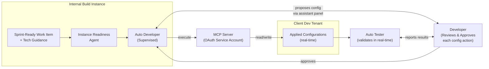

**How it works:** Developer opens the in-product assistant panel → pre-flight via MCP → agent proposes step-by-step plan → developer reviews/approves each action → agent executes via MCP → adapts mid-build by querying the client tenant → real-time validation.

**Strengths:** Real-time feedback, human-in-the-loop per change, dynamic adaptation, developer learns from suggestions.

**Weaknesses:** Requires live MCP throughout, slower (per-action approval), developer still tied to the session, MCP connection is a single point of failure.

---

#### Option C: External Orchestrator with A2A Agents & Review Portal

An **external cloud agent** reads the plan from the internal build instance, coordinates via A2A to a **native platform agent on the client tenant**, with a review portal for team-based approval.

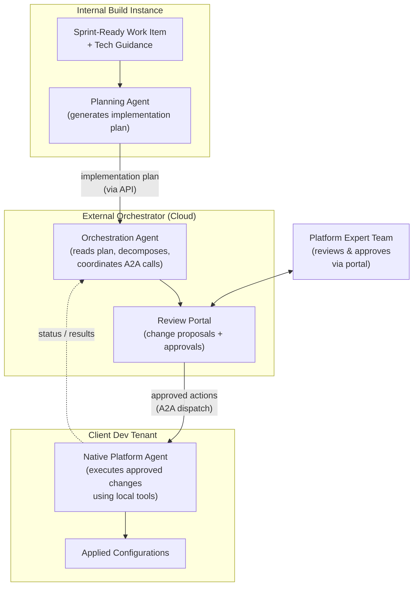

**How it works:** Planning agent generates structured plan → external orchestrator decomposes into steps → review portal for team approval → A2A dispatch to native client-side agent → local execution with native tools → feedback loop to orchestrator.

**Strengths:** A2A bypasses local MCP limitations, team-based review, scalable orchestration, client-side agent has full native tool access.

**Weaknesses:** Highest complexity (three systems), requires agent deployment on client tenants, latency through multiple hops, outside the platform's agent framework.

### 6.3 Comparison Matrix

| Dimension | Option A: Instance Commit Generator | Option B: Supervised Partner | Option C: External Orchestrator |
|-----------|-------------------------------|------------------------------|-------------------------------|
| **Safety** | Highest: declarative, reviewable | High, human approves each action | High, team reviews via portal |
| **Cross-instance approach** | Shared repo (push/pull) | Live MCP bridge | A2A agents on each instance |
| **Real-time feedback** | None during generation | Full | Partial |
| **Complexity to build** | Medium | Medium | High |
| **Fits the agent framework** | Yes | Yes | Partially |
| **Offline/air-gapped** | Yes | No | No |
| **Time to first value** | Fastest | Medium | Slowest |
| **Local tool limitations** | N/A: generates a commit bundle | MCP must replicate tool capabilities | **None: native agents** |

### 6.4 Recommendation

**Phase 2a:** Build **Option A**: fastest to value, safest, sidesteps cross-instance tool limitations. **Phase 2b:** Evolve toward **Option B** as MCP tooling matures. **Future:** **Option C** for scale or compliance-driven on-instance requirements.

### 6.5 Key Design Decisions

These decisions shape the architecture independently of the A/B/C option choice. Several remain open and require team input.

---

#### D1: Agent Location / Environment

**Question:** Where do the build agents physically run?

| Option | Description | Trade-off |
|--------|-------------|-----------|
| **Internal build instance** | Agents run on the same instance as planning agents. Cross-instance via REST/MCP. | Simplest deployment, but limited by local tool constraints |
| **Client tenant** | Agents run natively on each client tenant with full local tool access. | Best tool access, but requires agent deployment per client |
| **External Orchestrator** | Cloud-hosted agent coordinates between instances via A2A. | Most flexible, but highest infrastructure complexity |

**Status:** TBD: the Option A/B/C choice above partially answers this, but the question stands independently.

---

#### D2: Delivery Mechanism: Instance Commits vs Direct Changes

**Question:** Are configurations packaged as reviewable Instance Commit artifacts or applied directly to the client tenant in real-time?

| Option | Description | Trade-off |
|--------|-------------|-----------|
| **Instance Commit** | Agent generates Commit Entries, pushes to a shared repository. Human previews and applies. | Safest, auditable, version-controllable. But commit generation is complex and no real-time feedback. |
| **Direct Apply** | Agent writes configurations live via MCP/REST. | Real-time feedback, simpler code. But riskier, harder to roll back, requires live connection. |
| **Hybrid** | Agent generates an Instance Commit AND can apply directly in a sandboxed scope. | Best of both, but highest implementation effort. |

**Status:** TBD

---

#### D3: Human-in-the-Loop Model

**Question:** What is the developer's role during implementation: reviewer, collaborator, or approver?

| Option | Description | Trade-off |
|--------|-------------|-----------|
| **Autonomous + Review** | Agent runs unattended, produces an artifact (Instance Commit). Human reviews after the fact. | Fastest throughput. Developer is not blocked during generation. But no course-correction mid-build. |
| **Interactive Partner** | Agent proposes each step, developer reviews/approves in real-time via the in-product assistant panel. | Best quality, developer learns, can course-correct. But developer is tied to the session. |
| **Hybrid Autonomy** | Agent runs autonomously for low-complexity patterns, escalates to interactive mode for medium/high. | Balances speed and safety. Config level could drive the mode. |

**Status:** TBD: This is the UX-defining decision.

---

#### D4: Sandboxing

**Question:** How do we maintain an isolated environment for agent changes before they affect the client?

| Option | Description | Trade-off |
|--------|-------------|-----------|
| **Instance Commit preview** | Platform-native. Generated Instance Commit must be previewed before it is applied: built-in safety gate. | Simplest. But only works if delivery mechanism is Instance Commits. |
| **Scoped application** | Agent changes go into a scoped app that can be installed/uninstalled atomically. | Clean isolation. But adds app packaging complexity. |
| **Sub-production clone** | Agent operates on a dev/sandbox clone, not the real dev tenant. | Strongest isolation. But doubles infrastructure. |

**Status:** TBD

---

#### D5: Feedback & Interaction: Who Is the User?

**Question:** How does the agent get answers to questions mid-implementation? And who is the "user" interacting with it?

| Aspect | Options |
|--------|---------|
| **Feedback channel** | (a) Flag work item as "Blocked" with reason, wait for offline resolution. (b) Real-time Q&A via the in-product assistant panel. (c) Structured questionnaire before execution begins. |
| **User persona** | (a) In-house implementors only. (b) Internal users (delivery org + internal teams). (c) Partners. (d) Clients directly. |

**Status:** TBD: Current planning agents use the "flag as blocked" pattern (offline feedback). An interactive build agent would need real-time feedback, which changes the interaction model fundamentally.

---

#### D6: Triggering Mechanism

**Question:** How does a build agent get invoked?

| Option | Description | Trade-off |
|--------|-------------|-----------|
| **Auto-trigger on state change** | Work item moves to "Work In Progress" → agent fires automatically. | Seamless pipeline. But observed behavior suggests current agents don't auto-trigger on state change. |
| **Manual invocation** | User points the agent at a specific work item and says "go." Agent validates the work item is in the correct state before acting. | More control. But adds a manual step. |
| **Hybrid** | Auto-trigger for low-complexity work items, manual for medium/high. | Balances automation with control. |

**Status:** TBD: **[Observation: Current planning agents appear to require manual invocation oriented to a work item, not automatic state-based triggers. The agent checks the work item is in the right state but doesn't fire on state transition.]**

---

#### D7: Agent Boundaries: Agents vs Skills

**Question:** Are the four build "agents" (Instance Readiness, Auto Developer, Auto Tester, Knowledge Transfer Writer) truly separate agents with separate prompts and tool sets, or are they skills/capabilities on a single build agent?

| Option | Description | Trade-off |
|--------|-------------|-----------|
| **Separate agents** (current model) | Four distinct Agent records, each with own prompt and tools, orchestrated by a workflow. | Clean separation. Matches existing planning agent pattern. But more records to maintain and no shared context between agents. |
| **Single agent, multiple skills** | One agent with a rich prompt that can do readiness checks, development, testing, and documentation as needed. | Shared context, more flexible, closer to a unified agent-driven model. But monolithic prompt, harder to test individually. |

**Bigger question:** How would we implement a **unified agent-driven interface** within the platform where a user interacts with a single agent that comes up with a plan, executes it, gets feedback, allows course-correction in real time, and knows how to properly use its tools?

**Status:** TBD

---

#### D8: Agentic Workflow vs Interactive

**Question:** Should build agents follow the same **autonomous workflow** pattern as planning agents (fire-and-forget, flag-if-blocked), or a fundamentally different **interactive** pattern?

| Pattern | Planning Agents (Current) | Build Agents (Options) |
|---------|--------------------------|-------------------------------|
| **Invocation** | Workflow triggers agents in sequence | TBD: same workflow model, or interactive session? |
| **Feedback** | Offline: flag work item as blocked, wait | TBD; real-time via the assistant panel? |
| **Human role** | Content author resolves blocks offline | TBD: developer collaborates in real-time? |
| **Output** | Enriched work-item fields | TBD: Instance Commit, live configs, or both? |

**Status:** TBD: It may be acceptable (and pragmatic) to have **two different patterns**: autonomous workflow for planning, interactive session for implementation.

---

#### D9: Skills & Domain Knowledge

**Question:** Different projects cover different platform domains (service management, customer service, HR service delivery, security operations, etc.). Each domain has different tables, best practices, data models, and configuration patterns. How does the agent acquire the right skill set for a given project?

| Option | Description | Trade-off |
|--------|-------------|-----------|
| **Monolithic knowledge** | Agent has one large prompt/knowledge base covering all domains. | Simpler to maintain. But prompt bloat, risk of cross-domain confusion. |
| **Domain skill packs** | Modular knowledge loaded per project type (e.g., a service-management skill pack knows the change and incident tables and approval flows). | Cleaner, more accurate per domain. But requires building and maintaining skill packs. |
| **Instance-learned** | Agent queries the client tenant to discover what tables/fields exist and adapts. | Most flexible. But slower, requires deep introspection capability. |

**Status:** TBD

---

#### D10: Planning + Implementation Unification

**Question:** Should the planning agent system and the build agent system be **one unified system** or **two separate systems** with potentially different interaction patterns?

| Option | Description | Trade-off |
|--------|-------------|-----------|
| **Unified** | Single agent/workflow handles planning through implementation. Shared context, seamless handoff. | Best continuity. But may be too large/complex for one system. |
| **Separate, same pattern** | Two systems, both using autonomous workflow pattern. | Consistent architecture. But implementation may need interactivity. |
| **Separate, different patterns** | Planning = autonomous workflow. Implementation = interactive partner. | Each optimized for its use case. But two patterns to maintain. |

**Status:** TBD

---

#### D11: Model Selection

**Question:** Which LLM powers which agent? Can we mix models for different tasks?

| Option | Description | Trade-off |
|--------|-------------|-----------|
| **Single model (platform-native)** | All agents use the platform's default model. | Simplest. But the platform-native model may lack code-generation strength for commit generation. |
| **Single model (strong code-gen)** | All agents use a strong external code-gen model via the agent framework integration. | Best code gen. But vendor lock-in to one provider. |
| **Mixed models** | A strong code-gen model for Auto Developer, the platform-native model for Instance Readiness (platform-native tasks). | Optimized per task. But more configuration and cost complexity. |

**Status:** TBD: The platform supports configurable orchestrator LLMs per agent in recent releases. See [Appendix B.4](#b4-external-llm-support).

---

#### D12: Guardrails Strategy

**Question:** What are the hard limits (never do), confirmation gates (ask first), and auto-approve patterns (just do it)?

| Category | Examples | Behavior |
|----------|----------|----------|
| **Hard guardrails** | Never enable/disable platform capabilities (cost implications). Never delete records. Never modify production. Never bypass Instance Commit preview. | Agent cannot perform, even if instructed. |
| **Confirmation required** | Write operations to client tenant. Creating new tables/fields. Modifying existing business rules. | Agent proposes, consultant approves via the assistant panel. |
| **Auto-approve (read-only)** | Query client-tenant state. Read table schemas. List existing configurations. Pre-flight checks. | Agent executes without prompting. |

**Status:** TBD: Start with confirmation-heavy (all writes gated). Relax toward auto-approve as trust builds. **Feedback prompting and explicit confirmation is critical for initial release.**

---

#### D13: Primary Interaction Surface

**Question:** Where does the user interact with the build agents?

| Option | Description | Trade-off |
|--------|-------------|-----------|
| **In-product assistant panel (primary)** | Main orchestration agent lives in the assistant panel. External tools/agents called behind the scenes. | Native platform experience. Consistent with existing agents. Users already know the surface. |
| **External IDE/CLI** | An external dev tool, connecting to the platform via MCP. | More powerful dev experience. But requires external tooling, breaks the platform-native workflow. |
| **Hybrid** | Assistant panel for orchestration + optional external agent for heavy code gen. | Best of both. But two interaction surfaces to maintain. |

**Status:** Leaning toward **the in-product assistant panel as primary**. External agents/tools called behind the scenes via an MCP Client.

---

#### D14: Speed vs Dog-Fooding

**Question:** How much should we build on the platform vs using external tools? There's a tension between showcasing platform capabilities and shipping fast.

| Option | Description | Trade-off |
|--------|-------------|-----------|
| **Full platform-native** | Everything built within the agent authoring environment, assistant panel, and agent framework. | Maximum dog-fooding. Demonstrates platform value. But constrained by platform limitations (tool max, context window, etc.). |
| **External-first** | External orchestrator (external agent swarm), platform for data/UI only. | Fastest to build. Most capable. But doesn't showcase the platform. |
| **Hybrid: platform orchestration, external muscle** | Assistant panel as UX, platform agent as orchestrator, external tools via MCP for heavy lifting. | Balances both. Shows platform strength while using external capabilities where the platform is limited. |

**Status:** TBD: **Speed needs to be evaluated against all options before deciding.** This is a strategic decision, not just technical.

---

#### D15: Knowledge Base & Consultant Feedback Loop

**Question:** How does the system get better over time? How do delivery consultants provide feedback, and how does that feedback improve agent behavior?

| Aspect | Options |
|--------|---------|
| **Feedback collection** | (a) Structured form after each implementation. (b) Inline corrections via the assistant panel. (c) Knowledge article creation. (d) Implicit: track which agent outputs consultants modify. |
| **Knowledge storage** | (a) Platform Knowledge Base articles. (b) Vector store / embeddings (via a docs MCP connector: see Dependencies). (c) Agent prompt refinement. (d) Domain skill packs (see D9). |
| **Feedback → Improvement cycle** | (a) Manual curation by the delivery-tooling team. (b) Automated re-training/fine-tuning. (c) RAG over accumulated feedback. |

**Existing knowledge bases to evaluate:** What knowledge bases does the delivery org already maintain? What formats are they in? How current are they?

**Status:** TBD

---

#### D16: Tenancy Model

**Question:** Is the agentic solution multi-tenant? Does each client/project get its own agent swarm?

| Option | Description | Trade-off |
|--------|-------------|-----------|
| **Shared agents, per-client config** | One set of agents, parameterized by the Target System registry. | Simplest. But shared context window, potential cross-client leakage. |
| **Per-client agent swarm** | Each client/project gets its own agent instances with isolated context, credentials, and knowledge. | Strongest isolation. Scales independently. But more infrastructure to manage. |
| **Per-project swarm** | Swarm per project (finer than client). | Most granular. Best for multi-project clients. But highest overhead. |

**Status:** TBD: **Leaning toward per-client swarm** for isolation and credential management.

---

#### D17: SDK & Framework Choice

**Question:** What framework powers the external/orchestration components? How important is model replaceability?

| Option | Description | Trade-off |
|--------|-------------|-----------|
| **Vendor-native SDK** | Direct API calls to a single model provider. | Simplest, best single-provider integration. But locked to that provider. |
| **Framework-agnostic orchestration runtime** | Orchestration with model swapping. | Model-agnostic. But adds framework complexity and abstraction overhead. |
| **Cloud agent platform** | A managed agent orchestration platform. | Enterprise-grade, cloud integration. But adds a cloud dependency. |
| **Platform-native only** | No external SDK: everything through the agent framework + agent authoring environment. | Purest dog-fooding. But most constrained. |

**Model replaceability matters**: different models may be better for different tasks, and the landscape changes fast. The framework should support swapping models without rewriting agent logic.

**Status:** TBD

---

#### D18: Authentication Strategy

**Question:** What credential package is needed for cross-instance communication?

| Aspect | Consideration |
|--------|--------------|
| **Per-client credentials** | Each client tenant needs its own OAuth config in the Target System registry |
| **Service account provisioning** | Who provisions? How automated is onboarding? |
| **Token rotation** | Automated refresh? Health check in pre-flight? |
| **MCP auth** | API key, OAuth 2.1, or authless (per Appendix B.2) |
| **A2A auth** | OAuth 2.0, API key, or federated token |
| **Credential storage** | Platform's credential store? External vault? |

**Status:** TBD: **Need a well-defined credential package** that can be deployed per client.

---

#### D19: Security & Permissions Model

**Question:** Who has read/write access to client tenants? Can the agent be scoped to read-only? Who grants permissions? Can clients add their own guardrails?

| Aspect | Consideration |
|--------|--------------|
| **Read vs write access** | Can agents be configured as read-only (discovery) vs read-write (execution)? |
| **Permission granting** | Who authorizes the agent to access a client tenant: the consultant, the client, or both? |
| **Client-extensible guardrails** | Can clients restrict which scopes, tables, or operations the agent can touch? (Especially relevant for Option C where local agents run on client tenants) |
| **Least-privilege model** | Should agents start with minimal permissions and escalate as trust builds? |
| **Audit of access** | How is every read and write operation attributed and logged? |

**Status:** TBD: Directly affects client trust. This decision determines whether clients feel safe letting the agent operate on their tenant.

---

## 7. Key Components & Data Model

> Focused on **Option A (Autonomous Instance Commit Generator)**.

### 7.1 Components

| Component | Responsibility | Where It Runs |
|-----------|---------------|---------------|
| **Build Workflow** | Top-level orchestration. Sequences the four agents. Triggers at "Work In Progress." | Internal build instance (Workflow) |
| **Instance Readiness Agent** | Pre-flight: platform version, capability state, active Instance Commits, connectivity. Halts on incompatibility. | Internal build instance (Agent) |
| **Auto Developer Agent** | Reads work item + tech guidance, generates configuration plan, produces an Instance Commit. | Internal build instance (Agent) |
| **Auto Tester Agent** | Post-install validation. Reads test steps, queries client tenant to verify AC. | Internal build instance (Agent) |
| **Knowledge Transfer Writer** | Generates structured implementation log, writes to work-item record. | Internal build instance (Agent) |
| **Instance Commit Repository** | Shared storage. Push from the internal build instance, pull from client tenants. | External / shared |
| **REST Connector (Read-Only)** | Pre-flight and validation queries. OAuth Service Account auth. | Internal build instance → Client tenant |

**Agent-Tool mapping:**

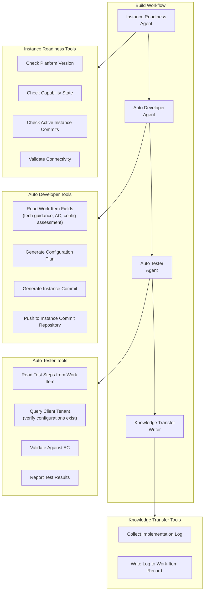

### 7.2 Data Model (generalized, platform-neutral)

This model describes the **ideal entities** an autonomous-build-agent system needs, independent of any host platform. On a low-code SaaS platform these entities map onto whatever the host **agent framework** and **commit-transport** mechanism provide (e.g. a multi-agent runtime plus a transferable, preview-before-apply **Instance Commit**: a reviewable, reversible bundle of changes applied to a target system); the model below prescribes the *shape*, not a specific product's tables.

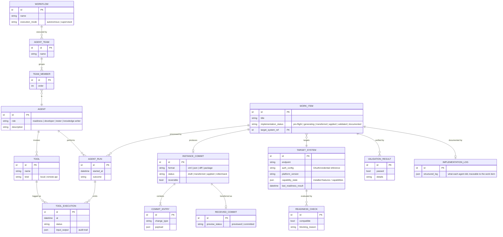

**Entity glossary (generalized ← realized on the host platform):**

| Generalized entity | Represents | Realized on the host platform as |
|--------------------|-----------|-------------------------------------|
| **Workflow** | The autonomous execution workflow definition | the agent-framework *use-case* record (`execution_mode = autonomous`) |
| **Agent / Agent Team / Team Member** | The collaborating agents and their grouping | the framework's *agent / team / team-member* records |
| **Tool** | A capability an agent invokes (local or remote API) | framework *tool* records (script-based or REST-based) |
| **Tool Execution** | Audit record of each tool invocation | the framework's tool-execution log table |
| **Work Item** | The planned unit of work being executed end-to-end | the *work-item* record, extended with status/log/target fields |
| **Target System + Readiness Check** | Registry of remote systems (endpoint, auth, version, capability state) and their pre-flight evaluation | a new *target-instance registry* table |
| **Instance Commit + Commit Entry** | A reviewable, reversible bundle of changes applied to a target instance, and its individual entries; `format` is an attribute (xml/json/diff/package) | a *reviewable change bundle* and its individual change records |
| **Received Commit** | The Instance Commit as received on the target, previewed before it is applied | the *received change bundle* on the client tenant |
| **Validation Result** | Post-apply verification of the work item | validation status written back to the work item |
| **Implementation Log** | Structured, traceable record of what each agent did | knowledge-transfer log on the work item |

> **Capability note:** Agent / Tool / Team are modeled as first-class entities to show the reusable multi-agent shape, but they map onto **whatever agent framework hosts the system** (a platform-native studio, an open-source orchestration runtime, or a custom harness). The reference design does not prescribe a specific framework: only that it can define agents, group them, give them tools, and log every tool execution for audit.

#### 7.2.1 Framework Records & Extensions

The build agents extend the existing agent framework rather than introducing new tables:

| Record Type | Name | Notes |
|------------|------|-------|
| Workflow | Build Workflow | New workflow, `execution_mode = autonomous` |
| Agent Team | Build Team | Groups the 4 agents |
| Team Member | (4 entries) | Instance Readiness (1), Auto Developer (2), Auto Tester (3), Knowledge Transfer Writer (4) |
| Agent | (4 entries) | One per agent above |
| Tool | (per tool above) | Mix of local server-side-script and REST-based tools |

The Instance Commit transport reuses the platform's native reviewable change bundle: the **Instance Commit** container, its individual **Commit Entries**, and the **Received Commit** previewed on the client tenant before it is applied.

<Assumption>The Auto Developer Agent generates Commit Entries programmatically. This requires understanding the payload format for each configuration type.</Assumption>

The Work Item gains `implementation_status`, `implementation_log`, and a `target_system_ref`, and a new **Target System** registry holds each client tenant's endpoint, OAuth config, platform version, capability state, and last pre-flight result. <Assumption>A new Target System registry is needed for the client-tenant inventory.</Assumption>

### 7.3 Data Flows

```mermaid
sequenceDiagram
    participant S as Work Item<br/>(Build Instance)
    participant IRA as Instance Readiness<br/>Agent
    participant CI as Client Tenant<br/>(via REST)
    participant ADA as Auto Developer<br/>Agent
    participant REPO as Instance Commit<br/>Repository
    participant ATA as Auto Tester<br/>Agent
    participant KTA as Knowledge Transfer<br/>Writer

    Note over S: Work-item state → Work In Progress

    S->>IRA: Read work item (target_system, tech_guidance)
    IRA->>CI: Check platform version, capabilities, commits
    CI-->>IRA: Instance state
    alt Incompatible
        IRA->>S: Update status: "Blocked &#8212; [reason]"
        Note over IRA: HALT
    else Compatible
        IRA->>S: Update status: "Pre-flight passed"
    end

    S->>ADA: Read work-item fields (tech guidance, AC, config assessment)
    ADA->>ADA: Generate configuration plan
    ADA->>ADA: Generate Instance Commit
    ADA->>REPO: Push Instance Commit
    ADA->>S: Update status: "Instance Commit generated"

    Note over CI: Developer pulls & applies Instance Commit

    S->>ATA: Read test steps
    ATA->>CI: Query configurations (verify existence & correctness)
    CI-->>ATA: Configuration state
    ATA->>S: Update status: "Validated" or "Failed &#8212; [details]"

    S->>KTA: Read implementation log (from ADA + ATA)
    KTA->>S: Write structured implementation log
    KTA->>S: Update status: "Documented"
```

## Use Cases

The build agents support the following use cases, all centered on the delivery consultant guiding work from "Work In Progress" through validation and documentation.

### Use-Case Diagram

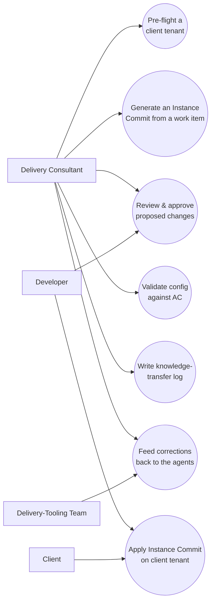

### Use-Case List

- **UC1: Pre-flight a client tenant:** Instance Readiness Agent checks platform version, capability state, active Instance Commits, and connectivity; halts on incompatibility (see [§7.1 Components](#71-components)).
- **UC2: Generate an Instance Commit from a work item:** Auto Developer reads tech guidance + AC and produces Commit Entries, pushed to the shared repo (Option A).
- **UC3: Review & approve proposed changes:** Delivery consultant (and/or developer) reviews the generated plan/Instance Commit before anything lands: confirmation-gated writes (D12).
- **UC4: Apply Instance Commit on client tenant:** Developer/client pulls, previews, and applies the Instance Commit on the client dev tenant: platform-enforced preview gate.
- **UC5: Validate config against AC:** Auto Tester queries the client tenant and verifies configurations satisfy acceptance criteria.
- **UC6: Write knowledge-transfer log:** Knowledge Transfer Writer records a structured implementation log to the work-item record.
- **UC7: Feed corrections back to the agents:** Consultant/delivery-tooling-team corrections flow into the knowledge base so the system improves over time (D15).

## Customer Journey

The delivery consultant is the primary user; their end-to-end journey from picking up a sprint-ready work item to a documented, validated build is shown below.

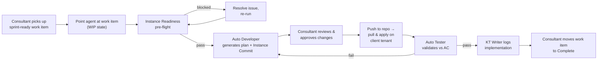

## 8. Architecture Diagrams

### 8.1 Context Diagram

See [Section 1](#1-purpose--context) for the full system context diagram showing the internal build instance, client tenants, and the MCP bridge.

### 8.2 Work-Item State Machine: Build Agent Responsibilities

This diagram shows which agent owns which work-item state, sub-states, and failure paths.

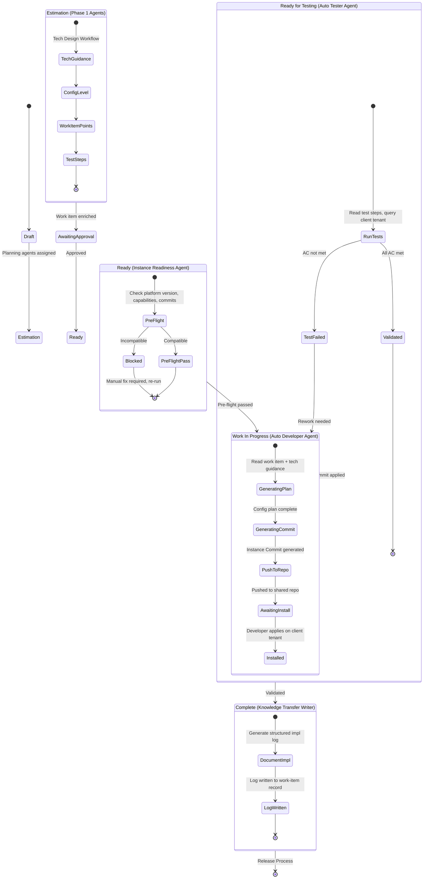

> **Key transitions this design controls:** Ready → Work In Progress → Ready for Testing → Complete.

## 9. Non-Functional Requirements & Constraints

### 9.1 Performance

- **Instance Commit generation:** Target &lt; 5 minutes for a standard work item (up to ~20 config artifacts). <Assumption>Most work items involve 5-15 artifacts.</Assumption>
- **Pre-flight checks:** &lt; 30 seconds (4-5 REST API calls)
- **Post-install validation:** &lt; 2 minutes per work item
- **Concurrency:** Support parallel generation for multiple work items

### 9.2 Security

- **OAuth Service Account** for all cross-instance communication with proper token rotation. No stored plaintext credentials.
- **Least-privilege access:** Pre-flight and validation are **read-only**. Only Instance Commit apply (manual) requires write access.
- **Audit trail:** Every agent action logged via Tool Execution records. Instance Commits include metadata tracing to source work item, agent run, and timestamp.
- **Client isolation:** Each client tenant configured separately in the Target System registry. No shared credentials.
- **Mandatory preview:** Generated Instance Commits must be previewed before they are applied: platform-enforced safety gate.

### 9.3 Scalability

- **Multi-client** via the Target System registry: new tenants onboarded by adding a registry entry
- **Multi-work-item**: concurrent independent workflow runs, no shared state
- **Team growth**: no code changes required to add clients

### 9.4 User Experience

- **Uniform platform experience**: all interactions through the **in-product assistant panel**. No external tools, portals, or CLIs.
- **Consistent with existing workflows**: same invocation pattern (work-item state triggers), same interaction surface, same status visibility.
- **Status visibility**: implementation progress (pre-flight → generating → pushed → installed → validated → documented) visible on the work-item record.

### 9.5 Compliance & Constraints

- **Instance Commit payload complexity**: the Commit Entry format varies by configuration type. Each artifact type has its own payload structure. <Assumption>This mapping is the single hardest technical challenge in the project.</Assumption>
- **Platform version sensitivity**: Instance Commit compatibility depends on target instance version. Instance Readiness Agent must validate.
- **Capability dependencies**: generated Instance Commits should declare platform-capability prerequisites.
- **Instance Commit scope**: must target the correct application scope on the client tenant.
- **No cross-instance server-side scripting**: all cross-instance operations must go through the REST API.
- **Platform tool max (≤15 per workflow)**: No built-in tool discovery mechanism. All tools must be pre-registered. Our design has ~14 tools across 4 agents; at the limit. Adding more capability requires splitting into additional workflows or leveraging MCP.
- **Instance A's tools ≠ Instance B's tools**: Each client tenant has different capabilities, tables, and configurations installed. Tools that work on one instance may not exist on another. Forces the swarm to discover capabilities per-instance.
- **Hard guardrail: AI must never enable/disable platform capabilities**: Capabilities have licensing cost implications and require careful review. If a required capability isn't installed, the agent must flag it and find an alternative path; not install it.
- **Minimize agent creation on client tenants**: Avoid proliferating agents on client tenants. Prefer lightweight MCP connections over deploying native agents per client. Reduces maintenance burden and client-side footprint.
- **MCP must be lightweight**: Favor minimal, focused MCP servers with narrow tool sets over monolithic servers. Reduces attack surface and simplifies debugging.
- **Context window pressure**: the token limit must accommodate: work-item context + tech guidance + instance state + Instance Commit payload + agent instructions. Complex work items may require chunking or multi-turn strategies.

## Phases

Delivery follows the recommendation in [§6.4](#64-recommendation) (build Option A first, evolve toward B, then C) layered over the agent priorities (P1 Auto Developer core, P2 Auto Tester, P3 Knowledge Transfer Writer) and the incremental config-type rollout (v1 to v4 in [FAQ Q5](#104-faq)).

| Phase | What Gets Built | Who Builds It |
|-------|-----------------|---------------|
| **Phase 2a: Option A (Instance Commits)** | Instance Readiness Agent + Auto Developer (commits for tables/columns/business rules), shared repo, Target System registry. | Delivery-tooling team builds; delivery DevOps stands up repo + credentials. |
| **Phase 2b: Validation & KT** | Auto Tester (post-install AC validation), Knowledge Transfer Writer, broader config types (client scripts, UI policies, catalog items). | Delivery-tooling team; consultants validate on live engagements. |
| **Phase 2c: Option B (Supervised Partner)** | Live MCP bridge, assistant-panel interactive mode, real-time approve/apply. | Delivery-tooling team + platform team (MCP enablement). |
| **Phase 3: Option C / Scale (Future)** | External orchestrator, A2A dispatch, per-client swarm, consultant feedback loop into knowledge base. | Delivery-tooling team + delivery DevOps; security team for credential package. |

### RACI Matrix

| RACI. Activity | R (Responsible) | A (Accountable) | C (Consulted) | I (Informed) |
|-----------------|-----------------|-----------------|---------------|--------------|
| Phase 2a. Instance Readiness + Auto Developer (Option A) | Delivery-tooling team | Delivery-tooling lead | Consultant, delivery DevOps | Client |
| Phase 2a. Shared repo + credential setup | Delivery DevOps | Delivery-tooling lead | Security team | Consultant |
| Phase 2b. Auto Tester + KT Writer | Delivery-tooling team | Delivery-tooling lead | Consultant | Developer |
| Phase 2c. Option B MCP bridge / assistant panel | Delivery-tooling team | Delivery-tooling lead | Platform team | Consultant, Client |
| Phase 3. Option C orchestrator + per-client swarm | Delivery-tooling team | Delivery-tooling lead | Security team, delivery DevOps | Client, Partner |
| Per-work-item build run (steady state) | Auto Developer Agent | Consultant | Developer | Client |

## 10. Risks, Dependencies & Open Questions

### 10.1 Risks

| Risk | Likelihood | Impact | Mitigation |
|------|-----------|--------|------------|
| Instance Commit generation produces invalid/incomplete payloads | High (initially) | High | Incremental approach: start with simplest types. Preview step catches errors. |
| Client-tenant version mismatch not caught | Low | High | Version-specific templates. Exhaustive pre-flight. Multi-version testing. |
| OAuth token management across clients | Medium | Medium | Centralized management in the Target System registry. Token rotation. Health check in pre-flight. |
| LLM hallucination in config plan generation | Medium | High | Structured output validation. Plan reviewed before commit generation. Human reviews Instance Commit. |
| Generated Instance Commit conflicts with existing configs | Medium | Medium | Pre-flight snapshots target areas. Default to INSERT (additive) configs. |
| Knowledge Transfer Writer captures incomplete logs | Low | Low | Instance Commit payload + execution log together provide traceability. |
| A2A protocol verbosity; overcommunication between agents | Medium | Medium | Guardrails to limit agent chatter. Rate-limit A2A calls. Define clear handoff protocols with minimal payloads. |
| Platform limitations block key capabilities | Medium | High | Evaluate all options against platform constraints before committing. Maintain escape hatch to external orchestration (D14). |
| Tool discovery gap; agents can't discover available tools dynamically | Medium | Medium | Pre-register tool inventories per instance type. MCP tool listing as partial mitigation. |
| Tracking AI changes per consultant; no audit trail linking changes to orchestrating consultant | Medium | Medium | Tag all agent-generated artifacts with consultant identity, work-item reference, and agent run ID. |

### 10.2 Dependencies

| Dependency | Owner | Status | Impact if Unavailable |
|-----------|-------|--------|----------------------|
| Planning agent output quality | Planning team | In production | Low-quality input → low-quality output |
| Client-tenant REST API access | Client / delivery DevOps | Per-client | Cannot pre-flight or validate |
| OAuth Service Account provisioning | Platform team | Process exists | Cannot connect |
| LLM Provider availability | Platform / model providers | Available | Generation halts |
| Instance Commit repository infrastructure | Delivery DevOps | To be built | Cannot ship Instance Commits |
| Platform commit-format documentation | Platform product docs | Partial | Requires reverse-engineering of undocumented formats |
| Credential package per client | Delivery DevOps / security team | To be defined | Cannot connect to client tenants securely (D18) |
| Docs/vector-store MCP connector | Delivery-tooling team | In development | Knowledge base and RAG capabilities blocked (D15) |
| Native platform MCP Server capability | Platform team | Requires support request to enable | Cannot expose platform skills to external agents |

### 10.3 Open Questions

| Team Question | Where Addressed | Remaining Gaps |
|--------------|----------------|---------------|
| What is the platform landscape? | Section 4 | Need inventory of non-delivery capabilities (e.g., automated test framework) |
| What tasks does the agent need to complete? | Section 7.1 | Need detailed task breakdown per config type |
| What actions are required? | Section 7.3 | REST API action catalog needed per config type |
| What is built right now? | Section 4 | Need live instance audit |
| What data does the agent need? | Section 7.2 | See FAQ Q1 |
| Are there hard platform constraints? | Section 9.5 | Instance Commit payload format needs a dedicated spike |
| How do we track AI-generated changes per consultant? | Section 10.1 (new risk) | Need audit trail design linking agent runs → consultant → work item → artifacts |
| What do we need to deploy per client? | D16, D18 | Credential package, tenancy model, onboarding automation |
| What knowledge bases exist today? | D15 | Need inventory of existing knowledge assets |
| How do consultants provide feedback to improve agents? | D15 | No mechanism exists; need to design the feedback loop |
| How does the agent explore a client tenant? | D9 | Forces read-only MCP into client tenant for discovery |
| How do we handle "settings" (auto-approve read, gate writes)? | D12 | Need permission model with auto-approve/gating patterns |
| What happens on the platform vs externally? | D14 | Responsibility split between platform-native and external components |
| Should we create an agent swarm for planning/creating agents? | Section 6 | Meta-agent pattern; agents that build other agents |
| Option B is simpler with MCP | D3, Section 6.2 | Meeting consensus: MCP simplifies Option B significantly |

### 10.4 FAQ

_This FAQ doubles as a **question-index** into the document: each answer links to the section that covers it in full._

**Q1: What specific data does the Auto Developer Agent need from the work-item record?**
At minimum: `technical_guidance`, `acceptance_criteria`, `configuration_level`, `work_item_points`, `test_steps`, and the `target_system` reference. <Assumption>The tech guidance format is consistent enough to parse programmatically.</Assumption>
→ [§7.2 Data Model](#72-data-model-generalized-platform-neutral) · [§7.1 Components](#71-components)

**Q2: How do we link to multiple client tenants?**
Via the Target System registry (Section 7.2). Each instance has its own entry with endpoint, OAuth config, platform version, and capability state.
→ [§7.2 Data Model](#72-data-model-generalized-platform-neutral)

**Q3: Which MCP server would we use?**
For Option A, MCP is not required for the core flow. REST API integration (Table API + Metadata API) may suffice for read-only pre-flight and validation. <Assumption>Direct REST is simpler than full MCP for Option A.</Assumption>
→ [§6.2 Architecture Options](#62-architecture-options) · [§B.2 MCP Support. Both Client AND Server](#b2-mcp-support--both-client-and-server)

**Q4: What should be done on the client tenant vs on the internal build instance?**
**Internal build instance:** All planning, reasoning, commit generation, work-item management, KT logging. **Client tenant:** Instance Commit apply (manual preview + commit), validation queries (read-only). **Shared repo:** Instance Commit transfer.
→ [§7.1 Components](#71-components) · [§6.2 Architecture Options](#62-architecture-options)

**Q5: Can the agent handle all platform configuration types?**
Incremental rollout:

| Phase | Configuration Types |
|-------|-------------------|
| v1 | Tables, columns, business rules |
| v2 | Client scripts, UI policies, UI actions |
| v3 | Catalog items, variables, record producers |
| v4 | Workflows, workflow-builder flows |

<Assumption>This prioritization aligns with developer frequency.</Assumption>
→ [§6.2 Architecture Options](#62-architecture-options) · [§A.4 Key Observations](#a4-key-observations)

## 11. Revision Log

| Date | Author | Section | Change |
|------|--------|---------|--------|
| 2026-02-26 | Omar Eid | All | Initial scaffold |
| 2026-02-27 | Omar Eid | 1-10 | All sections drafted via co-design session. Three architecture options documented. Status → In Review. 13 assumptions identified, 5 require team validation. |
| 2026-02-27 | Omar Eid | All | **v2 compression.** Consolidated: agent definitions → single source in Section 7.1 (Section 2.2 references); non-goals/scope merged (2.4 = behavioral, 3.2 = scope); state machine → single diagram in 8.2; context diagram deduplicated (Section 1 canonical, 8.1 references); prose trimmed where diagrams convey the same info; cross-instance problem consolidated across sections. |
| 2026-02-27 | Omar Eid | Appendix A | Added illustrative agent-generated work-item examples. |
| 2026-02-27 | Omar Eid | 1, 2, 6 | **v3 decisions.** Added 3-zone context diagram (Inside/Decision Zone/Outside) with A/B/C legend. Added 10 key design decisions (D1 to D10) as a decision framework in Section 6.5 with summary in Context. Added open decisions table in Section 2.2a. Added A2A integration and triggering observations. |
| 2026-02-27 | Omar Eid | Appendix B | Added platform research: agentic capabilities, MCP client/server support, A2A protocol, external LLM options, platform constraints, integration patterns. Informs decisions D3, D5, and Option B/C feasibility. |
| 2026-02-27 | Omar Eid | 1, 6.5, 9.5, 10 | **v4 feedback session.** Rewrote intro with delivery-tooling-team context and pain points. Added 8 new design decisions (D11 to D18): model selection, guardrails, primary surface, speed vs dog-fooding, consultant feedback loop, tenancy, SDK choice, auth. Added 7 new constraints (tool max, instance variance, capability guardrails, lightweight MCP, minimize on-tenant agents, context pressure). Added 4 new risks, 3 new dependencies, 10 new open questions. Updated scope (model selection now partially in scope). |
| 2026-02-27 | Omar Eid | 1, 5.2, 6.5 | **v5 summary alignment.** Added Design Tenets (6 tenets including "amplify never replace", "don't get in the consultant's way"). Added D19 (Security & Permissions Model). Added gap #9 (Implementation Audit Trail) and #10 (Per-Client Knowledge Repository) to Section 5.2. |
| 2026-02-27 | Omar Eid | All | **Generalized public release.** Derived from the internal design; retold in a generic SaaS-delivery domain with vendor-, client-, and commercial-specific details removed. |

## Appendix A: Agent-Generated Work-Item Examples

> **Source:** Illustrative agent-populated technical-guidance examples drawn from a representative engagement (work items spanning Low, Medium, and High complexity).

### A.1 Worked Example: Low Complexity: Role Delegation

**Work Item**: *"Delegate the Portfolio Admin role to any users who will be maintaining the service offering table"* (3 pts, Low)

What each **planning agent** produced for this work item:

| Agent | Field | Output Summary |
|-------|-------|---------------|
| **Work-Item QA Agent** | `acceptance_criteria` | "All users maintaining service/service offering records will be in a group called 'Portfolio Admins' and granted the role 'portfolio_admin'" |
| **Config Level Setter** | `configuration_level` | `low`; standard group + role assignment, no scripting |
| **Work-Item Point Estimator** | `work_item_points` | 3 |
| **Technical Guidance Provider** | `technical_guidance` | 3-step config: (1) Create group "Portfolio Admins" in User Admin > Groups, (2) Assign `portfolio_admin` role via Roles related list, (3) Add users via Group Members. References: identity & access entities (group / membership / role) |
| **Work-Item Testing Agent** | `test_steps` | 12-step process: log in as test user → verify group membership → confirm role → test create/edit on service offerings → verify non-member is denied |

**Why this matters for build agents:** This work item maps directly to 3 well-known platform API operations (create group, assign role, add members). The tech guidance already names the tables and fields: the Auto Developer Agent's job is translation to Commit Entries, not inference.

### A.2 Worked Example: Medium Complexity: Business Rule + UI Policy

**Work Item**: *"Mark Emergency Change non-compliant when no associated Incident"* (8 pts, Medium)

| Agent | Output Summary |
|-------|---------------|
| **Work-Item QA Agent** | AC requires: Emergency Change closed without P1/2/3 Incident → `non_compliant` checkbox = TRUE and read-only |
| **Config Level Setter** | `medium`; requires Business Rule + UI Policy working together |
| **Technical Guidance Provider** | (1) Business Rule on the change-request table, before update, condition: Type=Emergency AND State→Closed. (2) Server-side query on the incident table for P1/P2/P3. (3) UI Policy to lock the field. References: change-request table, incident table, `non_compliant` field |
| **Work-Item Testing Agent** | 9-step process covering both the non-compliant path and the compliant path (add qualifying incident, re-close) |

**Why this matters:** Two coordinated artifacts (BR + UI Policy) that must work together. The Auto Developer Agent needs to understand artifact dependencies: the UI Policy only makes sense if the Business Rule sets the field.

### A.3 Worked Example: High Complexity: Catalog Item with Workflow

**Work Item**: *"Cloud Account"* catalog item (13 pts, High)

| Agent | Output Summary |
|-------|---------------|
| **Work-Item QA Agent** | Form built in Dev, needs manager approval workflow, assignment routing workflow, dedicated change bundle |
| **Config Level Setter** | `high`; catalog item + workflow builder + routing logic |
| **Technical Guidance Provider** | (1) Validate catalog item form in Dev, (2) Workflow builder: manager approval using `Requested for` user's manager, (3) Assignment routing per requirements sheet, (4) Dedicated Instance Commit `Cloud Account Catalog Item Implementation`. Components: catalog-item, request, and request-item tables, workflow builder |
| **Work-Item Testing Agent** | 11-step E2E: locate item in the service portal → fill form → submit → verify approval routes to manager → approve → verify assignment routing → check change bundle completeness |

**Why this matters:** Multiple artifact types (catalog item, variables, workflow-builder flow, assignment rules) plus a human-readable requirements sheet that the agent must interpret. This pushes toward the **Supervised Partner** model (Option B) rather than autonomous generation.

### A.4 Key Observations

- **Tech guidance already names tables and fields**: the translation gap is from natural-language steps → Commit Entry payloads, not from requirements → component identification
- **Low work items** are the strongest Phase 1 candidates: they map to well-known API operations
- **Medium work items** require the agent to understand artifact coordination (e.g., BR + UI Policy)
- **High work items** involve the workflow builder and multi-step workflows: likely Phase 2+
- **All outputs include** an explicit AI-authorship marker: confirming agent authorship

## Appendix B: Platform Agentic Capabilities: Reference Research

> **Purpose:** Inform design decisions D3 (MCP vs REST), D5 (triggering), and Option B/C feasibility by cataloging what a typical low-code SaaS platform supports for agentic workloads.

### B.1 Native Agentic AI Capabilities

A modern low-code SaaS platform typically ships several agentic AI capabilities:

| Capability | What It Does | Relevance to This Design |
|---------|-------------|--------------------------|
| **Agent authoring environment** | No-code/low-code builder: describe outcomes in natural language, it generates agents with tools. Concepts: Workflow, Agent (worker), Tool (skill). | This is the framework our build agents already use (Workflow, Agent, Tool records). |
| **Autonomous workforce** | Digital labor executing jobs previously requiring humans. A common first offering: an L1 service-desk specialist (password resets, software provisioning, network troubleshooting). | Validates the platform's direction toward autonomous agent execution: our design aligns with this trajectory. |
| **Agent fabric** | Communication backbone for multi-agent collaboration. Supports agent-to-agent, agent-to-tool, and system-to-system via **MCP** and **A2A** protocols. | Directly relevant to Option B/C: enables our agents to call external tools or be called by external agents. |
| **AI control tower** | Enterprise governance layer for managing and monitoring all AI agents. | Governance for our build agents in production. |

### B.2 MCP Support: Both Client AND Server

A capable platform supports MCP in **both directions**, which has significant implications for our architecture options.

#### Platform as MCP Client (AI Agents → External Tools)

AI agents on the platform can connect to **external MCP servers** to pull in tools/data from outside systems.

- Configured in the agent authoring environment → Settings
- Auth: API keys, OAuth 2.1, authless
- **Remote only**: no local/stdio MCP servers supported
- Modern protocol version

**Design implication:** Our agents could call an external MCP server that wraps advanced code-generation capabilities (e.g., a server that generates Commit Entry payloads). This supports **Option C** (external dev environment).

#### Platform as MCP Server (External Agents → Platform)

The platform can expose its own skills as tools for **external AI agents** to consume.

- Pick which platform skills to expose
- OAuth authentication
- May require enabling via a platform support request
- Each skill invocation consumes platform usage units

**Design implication:** An external agent (running in an IDE or CLI) could invoke platform skills directly: e.g., triggering the Build Workflow, reading work-item data, or writing results back. This supports **Option B** (Supervised Partner).

#### Community MCP Servers (External → Platform)

Open-source MCP servers commonly exist for external agents to interact with low-code SaaS platforms: record CRUD, table queries, natural-language search/update, and workflow automation; typically pip-installable and compatible with common agent IDEs and desktop clients.

#### MCP Feature Support Matrix

| Feature | Supported? | Notes |
|---------|-----------|-------|
| Streamable HTTP | Yes | Non-streaming + SSE modes |
| Tools | Yes | Core feature |
| Resources | No | On roadmap |
| Prompts | No | On roadmap |
| Stdio transport | No | Remote only |

### B.3 A2A (Agent-to-Agent) Protocol

A2A is an industry protocol enabling cross-platform agent collaboration.

- Create an external AI-agent type in the authoring environment, point to a remote Agent Card URL
- Supports OAuth 2.0, API key, and federated token auth
- Works across major cloud AI platforms
- **Limitations:** No parallel tasking, no artifacts support (both on roadmap)

**Design implication:** A2A could enable a future architecture where an external agent and our platform build agents discover and invoke each other's capabilities dynamically, rather than through hardcoded REST or MCP connections.

### B.4 External LLM Support

A capable platform is **not locked to one LLM provider**:

| LLM | Role | Notes |
|-----|------|-------|
| **Platform-native model** | Default orchestrator | The platform's own model |
| **Strong code-gen model** | Default for build/code tasks | Code generation strength |
| **Alternative provider A** | Supported alternative | Via orchestrator config |
| **Alternative provider B** | Supported alternative | Via orchestrator config |
| **BYOK/BYOLLM** | Bring your own | Bring your own keys or your own LLM |

Orchestrator LLM configurable per agent in recent platform releases.

**Design implication:** We can configure different LLMs for different agents: e.g., a strong code-gen model for the Auto Developer Agent and the platform-native model for the Instance Readiness Agent (platform-native knowledge).

### B.5 Platform Limitations & Constraints

| Constraint | Value | Impact on This Design |
|-----------|-------|----------------------|
| Context window | Bounded (e.g., ~128K tokens) | Limits how much work-item context + tech guidance + Instance Commit payload can fit in a single agent turn |
| Agent Role instructions | Bounded length | Role definition must be concise |
| Agent Instructions | Bounded length | Detailed prompt engineering constrained |
| Tools per workflow | ≤15 recommended | Our design has ~14 tools across 4 agents; at the limit |
| Recursive loop protection | Runs then rate-limited | Relevant if Auto Developer retries generation |
| Non-deterministic output | Inherent to LLMs | Same work item may produce different Instance Commits; validation step is critical |
| MCP Resources/Prompts | Not yet supported | Cannot use MCP resource patterns for context injection |
| MCP Stdio transport | Not supported | All MCP must be remote HTTP |
| A2A parallel tasking | Not supported | Cannot fan out to multiple external agents simultaneously |
| Licensing | Agentic-AI SKU | Cost gating for clients |
| Platform version | Recent supported releases | Client tenants must be on supported versions |

### B.6 Integration Patterns Summary

For reference; the five patterns available for connecting external agents to a low-code SaaS platform:

| Pattern | Direction | Protocol | Best For |
|---------|-----------|----------|----------|
| **A: External Agent → Platform (MCP Server)** | Inbound | MCP | External agent reads/writes platform data |
| **B: Platform Agent → External (MCP Client)** | Outbound | MCP | Platform agents call external tools (code gen, validation) |
| **C: Agent ↔ Agent (A2A)** | Bidirectional | A2A | Cross-platform agent collaboration |
| **D: REST API** | Either | HTTP/REST | Classic integration, no protocol overhead |
| **E: Hybrid Orchestration** | Both | MCP + A2A + REST | An AI control tower governs a mixed agent ecosystem |

**For this design:** Option A (Autonomous) uses Pattern D (REST). Option B (Supervised Partner) could use Pattern A or D. Option C (External Dev Env) would use Pattern B or E.
