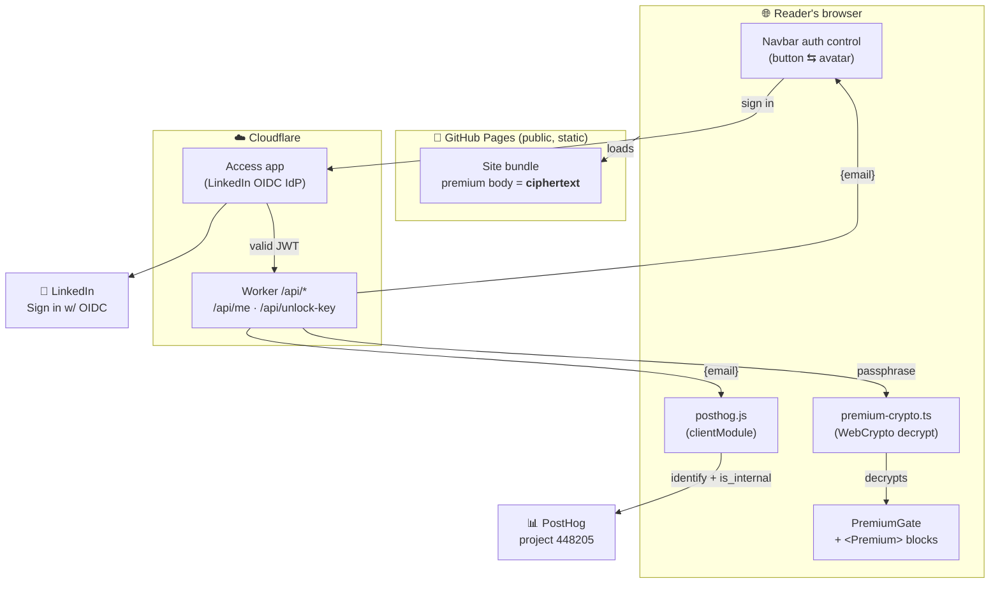
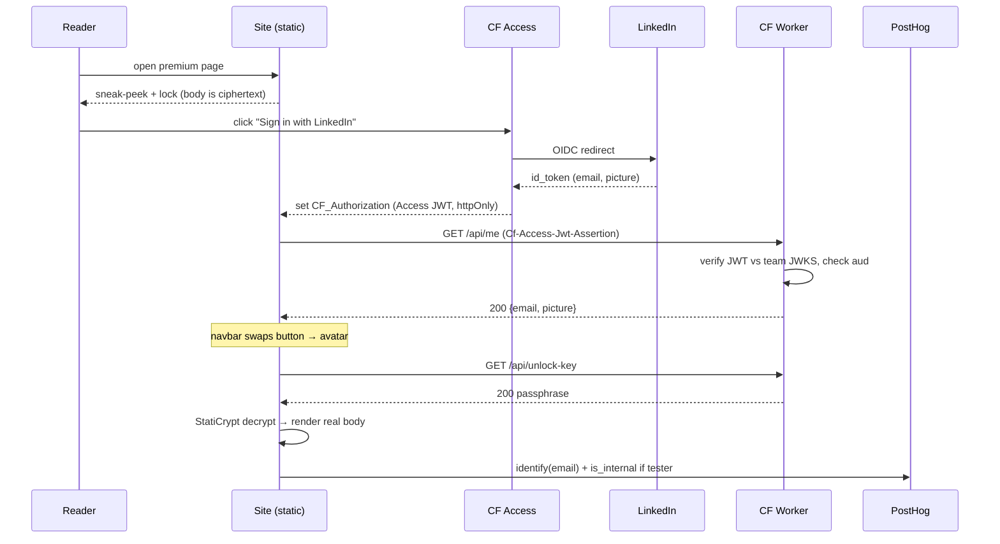
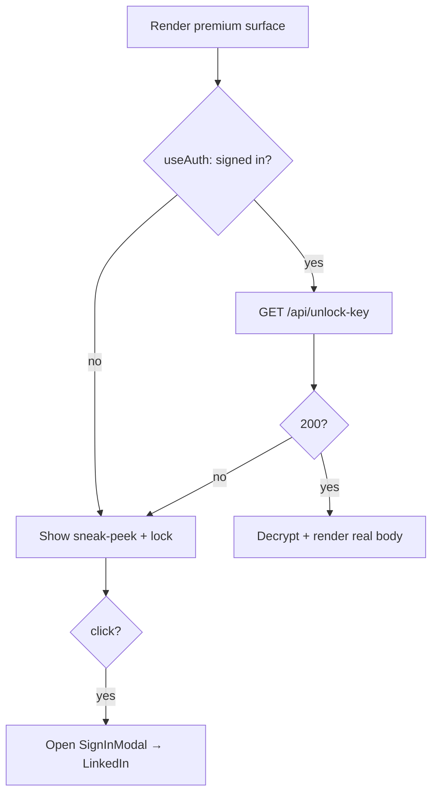

How do you put **truly-locked premium content** on a site that is 100% static
(GitHub Pages behind a Cloudflare proxy), with **no server** to check who's asking
— and without ever making a reader type a password on the page?

<!-- truncate -->

## Problem

The blog is a static Docusaurus build deployed to GitHub Pages. "Gating" content
with a swizzled React component is **cosmetic**: the premium MDX still ships in the
page source, so anyone can read it via View Source. We want a gate that is real —
the premium bytes must be *useless* to an anonymous visitor — while keeping the
static deploy model (fast, crawlable, anonymous-readable for free content).

## Constraints

- **No origin server.** GitHub Pages serves files; it can't run an auth check.
- **Cloudflare proxy in front.** We can run a tiny **Worker** on specific paths,
  and gate paths with **Cloudflare Access**, but we don't want to proxy *content*
  (that would mean an origin loop and kill SEO).
- **httpOnly Access JWT.** Cloudflare Access issues a `CF_Authorization` cookie the
  page JS can't read — identity must be read back through an endpoint.
- **No password UX.** Readers authenticate to LinkedIn, never to us; they must
  never see or type the decryption passphrase.

## Architecture

Premium content ships **encrypted** in the public bundle. A Cloudflare Worker,
sitting behind a **Cloudflare Access** app, returns the decryption passphrase
**only** to a request carrying a valid Access JWT (a signed-in LinkedIn user). The
browser decrypts in-JS. This is genuinely hard-gated yet fully static — we proxy
no content, only vend a key.

### Auth + key-vend sequence (the hard gate)

### Per-render gating logic

## Why StatiCrypt + Worker key-vend

[StatiCrypt](https://github.com/robinmoisson/staticrypt) encrypts an HTML body
with **AES-CBC**, keyed by **PBKDF2 (600k iterations)** over a passphrase, with an
HMAC-SHA256 integrity check. We use its proven codec at **build time** (Node) to
encrypt each premium body. On the **client**, we don't load StatiCrypt's own engine
(it `require`s `node:crypto`, which can't bundle for the browser); instead the site
ships a tiny **pure-WebCrypto re-implementation** (`src/lib/premium-crypto.ts`) that
is byte-compatible with StatiCrypt's format and decrypts via `window.crypto`. Either
way there is **no password-prompt UI** — the passphrase arrives machine-to-machine.

Crucially, the encryption happens at **MDX-compile time** (a rehype plugin), not as a
post-build HTML rewrite. Docusaurus compiles each doc body into a hydrating **JS
chunk**, so stripping only the built HTML would still leak the plaintext in the JS
bundle. Replacing the body with ciphertext *before* it becomes a JS module keeps the
plaintext out of **both** the HTML and the JS.

The insight that makes a static gate real: **separate the ciphertext from the
key.** The ciphertext ships in the public bundle (harmless). The key is held by a
Worker that only releases it to an authenticated request. The reader's browser
fetches the key machine-to-machine and decrypts locally.

## Identity & analytics

The Worker's `GET /api/me` validates the Access JWT against the team JWKS
(`https://bytesofpurpose.cloudflareaccess.com/cdn-cgi/access/certs`), checks the
`aud` matches the Access app's AUD tag, and returns `{email, name?, picture?}`.
The site uses that email to swap the navbar to an avatar and to call PostHog's
`identify(email)` — and, if the email is on the internal-tester roster, to register
`is_internal: true` so the author's own traffic is filtered out of analytics.

## Trade-offs

- **Access gates only `/api/*`, not content.** The public site stays fast and
  anonymous-readable; only the key endpoint requires sign-in. No content proxying,
  no origin loops, SEO intact.
- **One global passphrase** for all premium content (one Worker secret, one salt
  per encrypted body). Simpler than per-doc keys; the gate is "is this a signed-in
  LinkedIn user," not "which doc."
- **Client-side decrypt** means the plaintext exists in the signed-in reader's
  browser (unavoidable for any client-rendered gate) — but never in the public
  bundle, and never without a valid sign-in.
- **The gate protects the *deployed site*, not the *source*.** This repo is
  **public on GitHub**, so the premium MDX is readable there in cleartext — only the
  *built* site encrypts it (the encryption happens at compile time, from that same
  public source). That's an honest, deliberate trade: the gate raises the bar for the
  casual reader on the live site and drives sign-ins, but it is **not** a secret-keeping
  mechanism against someone willing to read the repo. If content must be truly secret,
  it doesn't belong in a public repo at all. (See the wink below.)

## What ships to prod vs dev-only

- **Ships to prod:** encrypted premium bodies, the navbar auth control, the
  `PremiumGate` page gate + `<Premium>` inline component, the themed sign-in modal,
  the sidebar lock badge, the Worker, the Access app.
- **Dev-only (never in the prod bundle):** the floating DebugMenu (incl. its Links
  section); the `/api/*` dev proxy + its injected CF Access **service-token** headers
  (`plugins/dev-api-proxy`, active only under `yarn start`, credentials in gitignored
  `.env`).
- **A blocking safety gate guards every deploy.** Because the encrypt step is fallible
  (a missing passphrase, a stale build cache, a frontmatter typo), a verifier
  (`scripts/verify-premium-encrypted.js`) scans the whole built output — HTML *and* JS
  *and* the sidecar payloads — for any premium body's cleartext and **aborts the deploy**
  (non-zero exit) if a single premium doc leaked. It runs in `deploy-site` and as a
  pre-push hook, so unencrypted premium can never ship silently.

## Verification & assurance (defense in depth)

The architecture above makes the gate *possible*; this layer is what makes it *stay
closed* across edits, refactors, and frontmatter typos. The encrypt step is fallible, so
the design treats the **V5 verifier (`scripts/verify-premium-encrypted.js`) as the real
guarantee** and the encrypt plugin as merely the thing that should make V5 pass. Four
principles, hardened after an adversarial code review of the implementation:

1. **Fail closed when safety is *unprovable*, not just when a leak is *seen*.** V5 proves
   absence by grepping the whole build for distinctive tokens of each premium body. If a
   premium doc yields **no** distinctive tokens, the verifier cannot prove the body is
   absent — so it now **errors and aborts the deploy** rather than warning and passing.
   "Can't prove safe" is treated as "unsafe." (The earlier version logged a warning and
   continued, which is fail-*open* for exactly the docs hardest to fingerprint.)

2. **Layered fingerprints so every body is checkable.** A body of only short, common words
   produces no long single token. Rather than leave it un-fingerprinted, `bodyFingerprints()`
   falls back from **long single tokens → 4-word phrases** (text runs survive HTML
   serialization without entity-escaping, so they're still greppable). Only a genuinely
   empty body reaches principle 1's hard error.

3. **One source of truth for "what is premium."** The set of premium docs is computed in
   exactly one place — `collectPremiumDocs()` (YAML-parsed `premium === true`) — and every
   consumer (the encrypt plugin, the V5 verifier, **and** the deploy's fail-closed abort)
   reads from it. Shell gates do **not** re-derive the set with a parallel `grep` that could
   silently disagree (`premium:true` vs `premium: true`, quoted, etc.). A gate that
   disagrees with the encryptor about which docs to encrypt is a leak waiting to happen.

4. **The passphrase is itself contraband in the build.** V5 also asserts the
   `STATICRYPT_PASSPHRASE` value appears **nowhere** in the built output — if the key ever
   leaked into a bundle, every premium body would be offline-decryptable, so its absence is
   gated with the same severity as the bodies.

> **Known nuance (residual, by design): the post-deploy V5 in `make deploy` is
> detection, not prevention.** `docusaurus deploy` rebuilds *and pushes* in one step, so
> the V5 re-run there validates `build/` **after** the push — it would catch a regression
> but only once it's already public. The genuinely *pre-publish* gate is `build-premium`
> (V5 before any deploy) and the pre-push hook; the post-deploy run is a third,
> belt-and-suspenders check. Because the deploy line exports `STATICRYPT_PASSPHRASE`, the
> rebuild *does* encrypt — so this is defense-in-depth, not an open hole — but a future
> change should make `deploy` build → verify → push so the strongest gate is also the
> pre-publish one.

## Dev/prod parity (design decision)

**Decision: local dev must behave identically to production — same encryption, same
key source.** Earlier iterations left premium bodies in clear on `localhost` (encryption
no-op'd without a passphrase) and made "Sign in" show a toast; that meant the dev
experience didn't match the live gate, which was confusing. The parity rules are:

1. **Dev encrypts too.** `yarn start` runs the same compile-time encryption as a prod
   build, so the premium body is **ciphertext in the dev page source as well** — the
   gate (teaser + lock) looks identical locally. The dev server reads
   `STATICRYPT_PASSPHRASE` the same way the prod build does.

2. **Dev pulls the key from the *real* Worker.** There is **no dev-only key and no
   client-side fallback.** The dev server **proxies `/api/*` to the deployed Cloudflare
   Worker** (`https://blog.bytesofpurpose.com/api/*`, `changeOrigin` so Cloudflare routes
   it). The client code uses relative `/api/*` URLs unchanged; the proxy bridges the
   origin. So `localhost` unlocks premium through the exact same `/api/unlock-key` path
   as prod. (This replaces the previous localhost "Sign in shows a toast" graceful-degrade
   — no longer needed, because `/api/*` now reaches the real Worker in dev.)

3. **Both dev and prod passphrases live in the gitignored `.env`.** `STATICRYPT_PASSPHRASE`
   is a real secret in `.env` (and must equal the Worker's `PREMIUM_PASSPHRASE`); it is
   **never** a hardcoded constant. The dev build and prod build both source it from `.env`.

> **Prerequisite:** dev parity depends on the Worker being **deployed** (the dev proxy
> targets it) — until `wrangler deploy` runs, `/api/unlock-key` returns nothing in dev
> *and* prod alike, so even there the two stay consistent.

### The one real difference: how dev vs prod *authenticates* to the Worker

Encryption, the client code, the `/api/*` paths, and the key source are all identical.
**The only thing that differs is how the unlock request proves who you are** — and it
differs because of an unavoidable browser-security boundary, not a design shortcut:

| | **Prod** (`blog.bytesofpurpose.com`) | **Dev** (`localhost:3000`) |
|---|---|---|
| Identity to Access | LinkedIn login → `CF_Authorization` **cookie** | CF Access **service token** (static `Cf-Access-Client-Id`/`-Secret` header pair) |
| Who supplies it | the reader's browser, automatically | the dev `/api/*` proxy injects it (values from gitignored `.env`) |
| Browser login needed? | yes (once) | **no** — headless |

**Why dev can't just reuse the prod cookie.** The first instinct — "sign in on the
domain, let the proxy forward your `CF_Authorization` cookie to localhost" — **cannot
work**, and we proved it both ways:

- **The login can't run through the proxy.** Access's login nonce is bound to the origin
  that *started* the flow. Start it from `localhost` and the callback lands on
  `blog.bytesofpurpose.com` with a nonce the browser no longer presents → Cloudflare
  shows **"Invalid login session."**
- **A valid cookie still won't reach localhost.** `CF_Authorization` is `HttpOnly` and
  **domain-scoped to `blog.bytesofpurpose.com`**. Browsers attach cookies by domain, and
  `localhost` is a different domain — so the browser never sends it to the dev server, and
  the proxy has nothing to forward. Rewriting the upstream `Host` can't change which cookie
  the *browser* chooses to send.

So dev uses Cloudflare's **documented** answer for headless/localhost testing behind
Access: a **service token**. We add a second policy (action **Service Auth**) to the same
`/api/*` Access app that admits the token; the LinkedIn policy stays untouched, so **prod
browser behavior is unchanged** (a request is admitted if it carries *either* a LinkedIn
session *or* the service-token headers). The dev proxy attaches
`Cf-Access-Client-Id` + `Cf-Access-Client-Secret` (from `.env`) to every proxied `/api/*`
request, Access mints the same JWT the Worker already validates, and dev decrypts with **no
browser login at all** — strictly better than the cookie idea it replaces.

> Service-token credentials are DEV-ONLY and live in the gitignored `.env`
> (`CF_ACCESS_CLIENT_ID` / `CF_ACCESS_CLIENT_SECRET`). They are injected only by the dev
> proxy, which `yarn build` never runs — so they never touch the production bundle. A
> reader on the live site authenticates with LinkedIn exactly as before.

## FAQ

### How is a reader prompted to sign in — and how do they *never* type a password on an encrypted page?

The reader **never types any password** — not their LinkedIn password to us, and
not the StatiCrypt passphrase. Two distinct things make this true:

1. **No passphrase UI exists.** Vanilla StatiCrypt ships a page with a password
   input box; **we deliberately don't use that mode.** The premium page renders a
   *sneak-peek + lock icon* — there is no text field to type a passphrase into. The
   passphrase is fetched **machine-to-machine** by our JS from `/api/unlock-key`
   and passed straight into the decrypt routine. The reader never sees it.

2. **Auth is delegated to LinkedIn, prompted by us.** Clicking the lock (or the
   navbar "Sign in with LinkedIn" button) sends the reader to Cloudflare Access's
   LinkedIn entry point. They authenticate **to LinkedIn** (often already logged
   in — one "Allow" click), and Cloudflare sets the `CF_Authorization` cookie. No
   credential ever touches our pages.

The login prompt fires two ways: **explicitly** (the navbar button and the locked-
content modal both link to the Access login URL), and **implicitly** (if a
signed-in session has expired when JS calls `/api/unlock-key`, Access returns a
302 to LinkedIn; the fetch fails cross-origin, we catch it and show the sign-in
modal — so the reader gets a clear "Sign in to unlock," never a broken page).

### Do premium docs need a special URL prefix (e.g. `/premium/*`) so the Access rule can lock them down?

**No.** The Access rule does **not** gate content URLs — it gates only the two
Worker API paths (`/api/me`, `/api/unlock-key`). Premium content lives at its
normal URL anywhere in the site IA; what marks it premium is `premium: true`
frontmatter, which drives **build-time encryption**. The content URL serves
ciphertext + a sneak-peek to everyone — there is nothing to "lock down" at the
content URL because the bytes are already useless without the key.

Gating content URLs with Access would be **worse**: every premium page would 302
to LinkedIn (killing SEO and the sneak-peek), and we'd need origin proxying. So the
gate is intentionally on the *key*, not the *path*. The Access app is a fixed
two-path rule, independent of how many premium docs exist or where they sit.

### Why not just hide the premium content with a React component?

Because a static build ships the component's children in the page source. Swizzle-
gating is cosmetic; View Source defeats it. Encryption + an off-bundle key is the
only way to make a static gate real.

### What stops someone from reading the key out of the Worker?

The Worker returns the passphrase **only** for a request with a valid Cloudflare
Access JWT (verified against the team JWKS, with a matching `aud`). An anonymous
request is 302'd to LinkedIn by Access *before the Worker even runs*; a forged or
absent token yields 401. The passphrase is a Worker **secret**, never in the repo
or the public bundle.

### Threat model — what each attacker can and can't do

The gate is deliberately scoped: it raises the bar on the **live site** and drives
sign-ins; it is **not** a secret-keeping mechanism against someone who reads the public
repo (see *Trade-offs*). Within that scope, this is the attack surface and what holds it.

| Attacker capability | What stops them | Residual risk |
|---|---|---|
| **Anonymous reader, View-Source on a premium page** | Body ships as **ciphertext** (encrypted at MDX-compile, in neither HTML nor JS chunk); only a teaser is cleartext | None — the bytes are useless without the key |
| **Calls `/api/unlock-key` directly without signing in** | CF Access 302s to LinkedIn *before the Worker runs*; absent/forged JWT → Worker returns **401** (verifies signature + issuer + `aud` against team JWKS) | None within scope; relies on CF Access + JWKS integrity |
| **Forges an Access JWT / replays a stale one** | `jwtVerify` checks RS256 signature, issuer, audience, and expiry against the live team JWKS | Standard JWT/JWKS trust; key rotation handled by Cloudflare |
| **Tampers with the encrypted sidecar payload** | `decryptPremium` **HMAC-verifies before decrypting** and returns null on mismatch — tampered ciphertext never renders | None — integrity is cryptographic |
| **Author error: a premium doc ships in cleartext (typo, stale cache, missing passphrase)** | **V5 verifier** greps the whole build for each body's fingerprints and **aborts the deploy**; fails *closed* even when a body can't be fingerprinted (see *Verification & assurance*) | A regression in `make deploy`'s **post-push** V5 is detected after publish, not before — mitigated by the pre-push hook + `build-premium` running V5 *pre*-publish |
| **The decryption key leaks into the bundle** | V5 asserts the `STATICRYPT_PASSPHRASE` value is **absent** from all built output; deploy aborts on any hit | None at build time; rotate via `make rotate-premium-secret` if ever exposed |
| **Spoofs the `is_internal` analytics flag to hide traffic** | Flag is **server-authoritative** — the Worker derives it from a private roster and returns it; the roster + tester emails never ship to the client | Low — worst case is analytics noise, not content exposure |
| **Reads the premium MDX from the public GitHub repo** | *Out of scope by design* — the repo is public; only the *deployed* site encrypts | **Accepted** — the gate is a nudge, not a vault (see the wink at the end) |

### Does this work on localhost?

**Yes — local dev is designed to behave identically to production** (see *Dev/prod
parity* above). `yarn start` encrypts premium bodies the same way the prod build does,
and the dev server **proxies `/api/*` to the deployed Worker**, so `localhost` unlocks
premium through the exact same `/api/unlock-key` path as prod. The encryption, client
code, and key source are identical; the **only** difference is authentication — dev
uses a CF Access **service token** (headers injected by the proxy, no browser login)
rather than a LinkedIn cookie, because an `HttpOnly` domain-scoped cookie can't cross to
`localhost` and the login nonce is origin-bound (see *The one real difference* above).
There is no dev-only key and no "it no-ops locally" caveat. The `?internal=1` analytics
opt-in also works in dev. *(Parity requires the Worker to be deployed **and** the dev
service token configured; until then `/api/unlock-key` can't vend locally.)*

## One more thing

There's a secret hidden on this page. Highlight the line below (or just drag-select
it) — sometimes the most honest thing a system can do is tell on itself.

  🤫 Psst — every "premium" post on this blog is also free. The source MDX lives in a
  public GitHub repo (omars-lab/omars-lab.github.io); only the <em>deployed</em> site
  encrypts it. So if you ever hit a lock, you can read the original on GitHub. The gate
  isn't here to keep you out — it's a friendly nudge to say hi on LinkedIn. Thanks for
  reading the source. 💙

