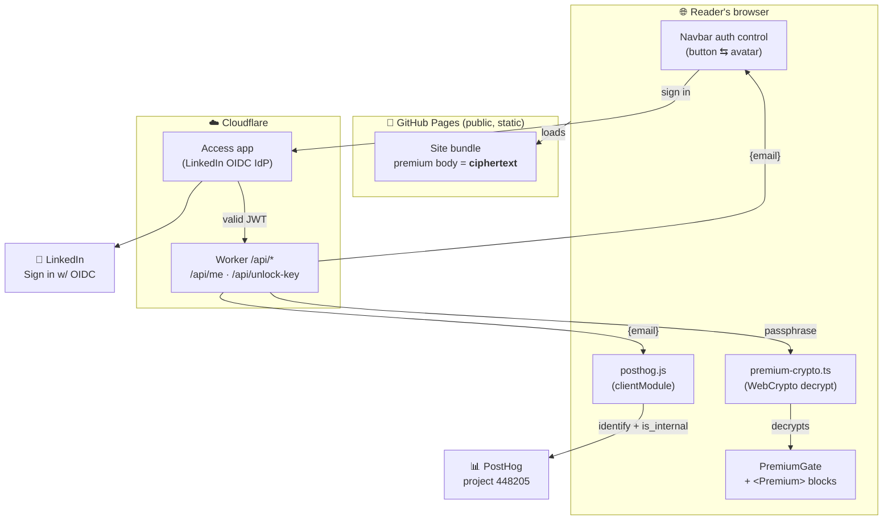
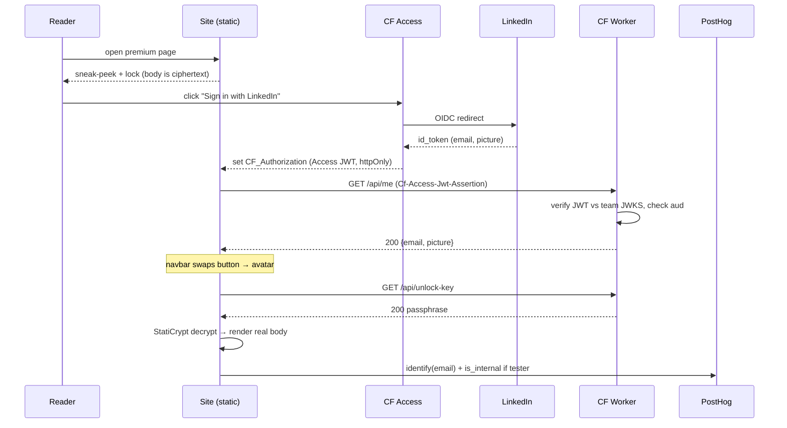
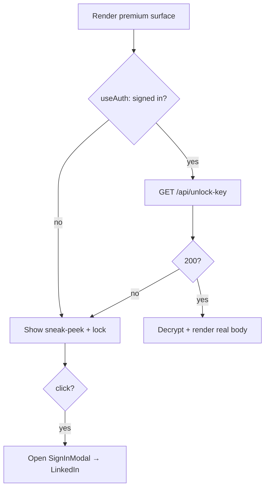

How do you put **truly-locked premium content** on a site that is 100% static
(GitHub Pages behind a Cloudflare proxy), with **no server** to check who's asking
— and without ever making a reader type a password on the page?

<!-- truncate -->

## Problem

The blog is a static Docusaurus build deployed to GitHub Pages. "Gating" content
with a swizzled React component is **cosmetic**: the premium MDX still ships in the
page source, so anyone can read it via View Source. We want a gate that is real —
the premium bytes must be *useless* to an anonymous visitor — while keeping the
static deploy model (fast, crawlable, anonymous-readable for free content).

## Constraints

- **No origin server.** GitHub Pages serves files; it can't run an auth check.
- **Cloudflare proxy in front.** We can run a tiny **Worker** on specific paths,
  and gate paths with **Cloudflare Access**, but we don't want to proxy *content*
  (that would mean an origin loop and kill SEO).
- **httpOnly Access JWT.** Cloudflare Access issues a `CF_Authorization` cookie the
  page JS can't read — identity must be read back through an endpoint.
- **No password UX.** Readers authenticate to LinkedIn, never to us; they must
  never see or type the decryption passphrase.

## Architecture

Premium content ships **encrypted** in the public bundle. A Cloudflare Worker,
sitting behind a **Cloudflare Access** app, returns the decryption passphrase
**only** to a request carrying a valid Access JWT (a signed-in LinkedIn user). The
browser decrypts in-JS. This is genuinely hard-gated yet fully static — we proxy
no content, only vend a key.

### Auth + key-vend sequence (the hard gate)

### Per-render gating logic

## Why StatiCrypt + Worker key-vend

[StatiCrypt](https://github.com/robinmoisson/staticrypt) encrypts an HTML body
with **AES-CBC**, keyed by **PBKDF2 (600k iterations)** over a passphrase, with an
HMAC-SHA256 integrity check. We use its proven codec at **build time** (Node) to
encrypt each premium body. On the **client**, we don't load StatiCrypt's own engine
(it `require`s `node:crypto`, which can't bundle for the browser); instead the site
ships a tiny **pure-WebCrypto re-implementation** (`src/lib/premium-crypto.ts`) that
is byte-compatible with StatiCrypt's format and decrypts via `window.crypto`. Either
way there is **no password-prompt UI** — the passphrase arrives machine-to-machine.

Crucially, the encryption happens at **MDX-compile time** (a rehype plugin), not as a
post-build HTML rewrite. Docusaurus compiles each doc body into a hydrating **JS
chunk**, so stripping only the built HTML would still leak the plaintext in the JS
bundle. Replacing the body with ciphertext *before* it becomes a JS module keeps the
plaintext out of **both** the HTML and the JS.

The insight that makes a static gate real: **separate the ciphertext from the
key.** The ciphertext ships in the public bundle (harmless). The key is held by a
Worker that only releases it to an authenticated request. The reader's browser
fetches the key machine-to-machine and decrypts locally.

## Identity & analytics

The Worker's `GET /api/me` validates the Access JWT against the team JWKS
(`https://bytesofpurpose.cloudflareaccess.com/cdn-cgi/access/certs`), checks the
`aud` matches the Access app's AUD tag, and returns `{email, name?, picture?}`.
The site uses that email to swap the navbar to an avatar and to call PostHog's
`identify(email)` — and, if the email is on the internal-tester roster, to register
`is_internal: true` so the author's own traffic is filtered out of analytics.

## Trade-offs

- **Access gates only `/api/*`, not content.** The public site stays fast and
  anonymous-readable; only the key endpoint requires sign-in. No content proxying,
  no origin loops, SEO intact.
- **One global passphrase** for all premium content (one Worker secret, one salt
  per encrypted body). Simpler than per-doc keys; the gate is "is this a signed-in
  LinkedIn user," not "which doc."
- **Client-side decrypt** means the plaintext exists in the signed-in reader's
  browser (unavoidable for any client-rendered gate) — but never in the public
  bundle, and never without a valid sign-in.
- **The gate protects the *deployed site*, not the *source*.** This repo is
  **public on GitHub**, so the premium MDX is readable there in cleartext — only the
  *built* site encrypts it (the encryption happens at compile time, from that same
  public source). That's an honest, deliberate trade: the gate raises the bar for the
  casual reader on the live site and drives sign-ins, but it is **not** a secret-keeping
  mechanism against someone willing to read the repo. If content must be truly secret,
  it doesn't belong in a public repo at all. (See the wink below.)

## What ships to prod vs dev-only

- **Ships to prod:** encrypted premium bodies, the navbar auth control, the
  `PremiumGate` page gate + `<Premium>` inline component, the themed sign-in modal,
  the sidebar lock badge, the Worker, the Access app.
- **Dev-only (never in the prod bundle):** the floating DebugMenu (incl. its Links
  section). On `localhost` the `/api/*` endpoints don't exist, so auth/identify/
  decrypt no-op and the page shows the sneak-peek — by design (and "Sign in" shows a
  toast instead of a dead redirect).
- **A blocking safety gate guards every deploy.** Because the encrypt step is fallible
  (a missing passphrase, a stale build cache, a frontmatter typo), a verifier
  (`scripts/verify-premium-encrypted.js`) scans the whole built output — HTML *and* JS
  *and* the sidecar payloads — for any premium body's cleartext and **aborts the deploy**
  (non-zero exit) if a single premium doc leaked. It runs in `deploy-site` and as a
  pre-push hook, so unencrypted premium can never ship silently.

## FAQ

### How is a reader prompted to sign in — and how do they *never* type a password on an encrypted page?

The reader **never types any password** — not their LinkedIn password to us, and
not the StatiCrypt passphrase. Two distinct things make this true:

1. **No passphrase UI exists.** Vanilla StatiCrypt ships a page with a password
   input box; **we deliberately don't use that mode.** The premium page renders a
   *sneak-peek + lock icon* — there is no text field to type a passphrase into. The
   passphrase is fetched **machine-to-machine** by our JS from `/api/unlock-key`
   and passed straight into the decrypt routine. The reader never sees it.

2. **Auth is delegated to LinkedIn, prompted by us.** Clicking the lock (or the
   navbar "Sign in with LinkedIn" button) sends the reader to Cloudflare Access's
   LinkedIn entry point. They authenticate **to LinkedIn** (often already logged
   in — one "Allow" click), and Cloudflare sets the `CF_Authorization` cookie. No
   credential ever touches our pages.

The login prompt fires two ways: **explicitly** (the navbar button and the locked-
content modal both link to the Access login URL), and **implicitly** (if a
signed-in session has expired when JS calls `/api/unlock-key`, Access returns a
302 to LinkedIn; the fetch fails cross-origin, we catch it and show the sign-in
modal — so the reader gets a clear "Sign in to unlock," never a broken page).

### Do premium docs need a special URL prefix (e.g. `/premium/*`) so the Access rule can lock them down?

**No.** The Access rule does **not** gate content URLs — it gates only the two
Worker API paths (`/api/me`, `/api/unlock-key`). Premium content lives at its
normal URL anywhere in the site IA; what marks it premium is `premium: true`
frontmatter, which drives **build-time encryption**. The content URL serves
ciphertext + a sneak-peek to everyone — there is nothing to "lock down" at the
content URL because the bytes are already useless without the key.

Gating content URLs with Access would be **worse**: every premium page would 302
to LinkedIn (killing SEO and the sneak-peek), and we'd need origin proxying. So the
gate is intentionally on the *key*, not the *path*. The Access app is a fixed
two-path rule, independent of how many premium docs exist or where they sit.

### Why not just hide the premium content with a React component?

Because a static build ships the component's children in the page source. Swizzle-
gating is cosmetic; View Source defeats it. Encryption + an off-bundle key is the
only way to make a static gate real.

### What stops someone from reading the key out of the Worker?

The Worker returns the passphrase **only** for a request with a valid Cloudflare
Access JWT (verified against the team JWKS, with a matching `aud`). An anonymous
request is 302'd to LinkedIn by Access *before the Worker even runs*; a forged or
absent token yields 401. The passphrase is a Worker **secret**, never in the repo
or the public bundle.

### Does this work on localhost?

Auth, identify, and decrypt **no-op** on `localhost` because `/api/*` doesn't exist
there — the page shows the sneak-peek. This is expected, not a bug. The
`?internal=1` analytics opt-in still works in dev.

## One more thing

There's a secret hidden on this page. Highlight the line below (or just drag-select
it) — sometimes the most honest thing a system can do is tell on itself.

  🤫 Psst — every "premium" post on this blog is also free. The source MDX lives in a
  public GitHub repo (omars-lab/omars-lab.github.io); only the <em>deployed</em> site
  encrypts it. So if you ever hit a lock, you can read the original on GitHub. The gate
  isn't here to keep you out — it's a friendly nudge to say hi on LinkedIn. Thanks for
  reading the source. 💙

