# High-Level Design: Ecommerce Site Scanner & Lead Generation Engine

:::note[Scope]
This document covers **Phase 1: scan → score → outreach** for lead generation. The agent is the front door to a larger **agentic service for self-healing growth-marketing sites** (technical/perf, SEO, CRO, and content auto-remediation). Self-healing is the north-star vision that motivates this work but is **explicitly out of scope** for this design: see Section 3.2.
:::

<!-- truncate -->

import Mockups from './_mockups/ecommerce-site-scanner-and-lead-generation-engine.mdx';

<Mockups />

---

## Executive Summary

A two-person founding team, a technical Growth Operator and a Sales/Business-Development (BD) partner, cannot manually produce a steady flow of qualified ecommerce leads. Today they prospect by hand: Googling niches, eyeballing sites, hunting for an email, and writing each note from scratch. This tops out at a few sites an hour, gives no consistent score, loses most leads at the "who do I email" step, and leaves no audit trail ([§5 Problem Statement & Gaps](#5-problem-statement--gaps)).

The proposal is an autonomous **scanning and lead engine**: a Large-Language-Model (LLM) agent drives a staged, cheap-first pipeline that discovers candidate sites, scans their public pages for growth-marketing problems, estimates size, finds and verifies a contact, scores the lead with explainable reasons, and drafts a personalized outreach message for a human to send ([§6 Proposed Design](#6-proposed-design)). The same scanning intelligence is the foundation for the future self-healing service: Phase 1 builds and validates detection; that service fixes sites later, and is out of scope here ([§3.2 Out of Scope](#32-out-of-scope)).

The most consequential choices are the "how do we get the data" decisions: site discovery (**D1**), size/traffic estimation (**D2**), and contact discovery (**D3**), all currently **leaning** toward layered, cheap-first pipelines; the build-vs-buy recommendation is a **purpose-built engine over best-of-breed APIs** ([§6.5 Key Design Decisions](#65-key-design-decisions)). Outreach stays **draft-only with a human on every send** (D6, decided).

Expected value: <Assumption>50 to 100 qualified, contactable leads/week</Assumption> at a controlled cost per lead, plus a reusable signal taxonomy that de-risks Phase 2. Status is **In Review**. The biggest open questions are the exact ICP, the per-scan page budget, the cost-per-lead ceiling, and the EU-vs-US outreach posture ([§13.3 Open Questions](#133-open-questions)).

---

## 1. Purpose & Context

### 1.1 Purpose

This document defines the high-level architecture for an **autonomous agent that discovers ecommerce sites, scans them for growth-marketing signals, scores them as leads, and produces personalized outreach** for a human to review and send. It covers **Phase 1 (scan → score → outreach)** only. The agent is the front door to a larger **agentic service for self-healing growth-marketing sites**: a service that will eventually auto-remediate the very problems this agent detects. Self-healing is the north star (Section 3.2), not the subject of this design.

### 1.2 Who Is Building This & Why

A two-person founding team; a **Growth Operator** (technical/product) and a **Sales/BD partner** (commercial): building an agentic growth-marketing service for ecommerce merchants.

The strategic thesis: **the scanning intelligence that finds problems on a prospect's site is the same engine that will later fix them.** Building lead generation first is deliberate:

- **It funds the business**: a ranked, insight-rich lead queue drives pipeline from day one.
- **It validates the engine on real sites**: scanning thousands of live ecommerce sites hardens the detection logic before it is trusted to *change* anything.
- **It produces the signal taxonomy**: the catalog of detectable growth-marketing problems (perf, SEO, CRO, content) becomes the action space for the future self-healing agent.

In short: we earn the right to auto-heal sites by first proving we can reliably *find* what's wrong with them; at scale, cheaply, and accurately enough to put in front of a prospect.

### 1.3 Context

The agent sits between **the open web of ecommerce sites** and **the team's sales pipeline**. It turns an unbounded universe of candidate sites into a ranked queue of qualified, insight-rich leads with drafted outreach.

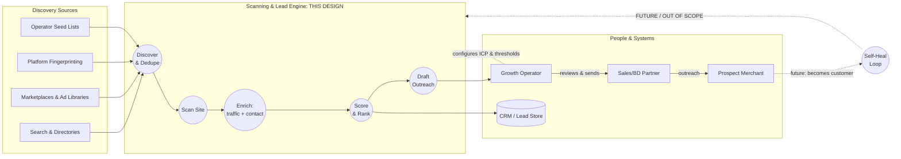

*Legend: solid arrows = Phase 1 data flow; dashed = configuration or out-of-scope future extension. The grey **Self-Heal Loop** is the north-star service this engine is the foundation for: not built in Phase 1.*

### 1.4 System Users & Personas

| Actor | Role | Interaction with the System | Primary Surface |
|-------|------|------------------------------|-----------------|
| **Growth Operator** | Primary user (founder, technical). Configures the Ideal Customer Profile (ICP), discovery sources, scoring weights, and approval thresholds; reviews scored leads and outreach drafts. | Direct | Operator console / CLI / dashboard |
| **Sales/BD Partner** | Secondary user (founder, commercial). Consumes qualified leads + drafts, sends outreach, runs conversations, reports outcomes back. | Direct (read + send) | Lead queue / CRM / email |
| **Scanning Agent** | The autonomous system actor that discovers, scans, enriches, scores, and drafts. Orchestrates tools and external calls. | System-to-system | (headless) |
| **Prospect Merchant** | The ecommerce merchant whose site is scanned. Becomes a customer if converted. Never interacts with the system directly in Phase 1. | Indirect (target) | Their own website (read-only by us) |
| **Discovery & Enrichment Providers** | External services that supply candidate sites, traffic estimates, tech fingerprints, and contact data. | System-to-system | Provider APIs |
| **CRM / Sequencing Tool** | System of record for leads and outreach status. | System-to-system | CRM API |

**User-profiling: who's involved and what they want from the system:**

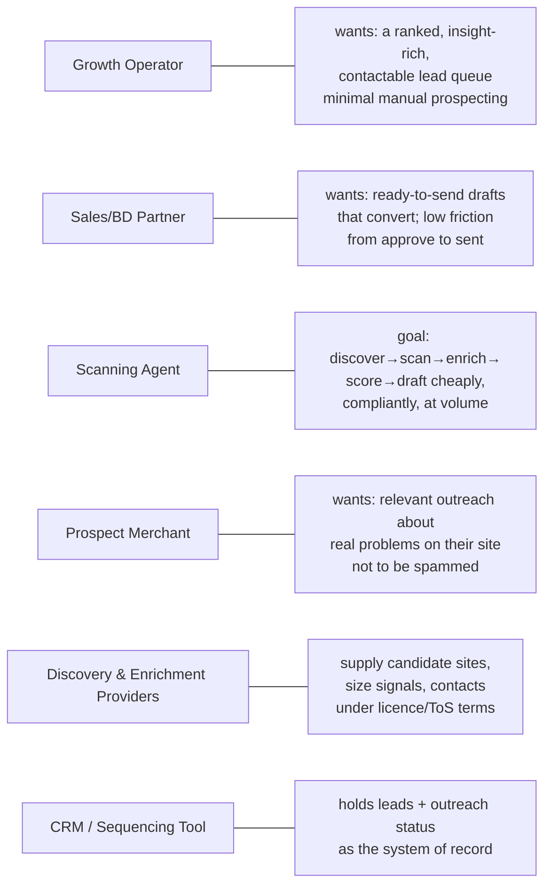

:::info[Terminology]
"**Agent**" in this document means the autonomous scanning/scoring system we are building (an LLM-driven orchestrator with tools), not a sales agent or a person. "**Lead**" means a scored, enriched ecommerce site record. "**Operator**" always means the **Growth Operator** persona.
:::

### 1.5 Key Decisions Summary

These decisions are defined in detail in [Section 6.5](#65-key-design-decisions). The three flagged as **top concerns** by the founding team are D1 to D3 (discovery, traffic, contact): the hardest "how do we actually get this data" questions.

| ID | Decision | Status |
|----|----------|--------|
| **D1** | **Site discovery**: how do we find which ecommerce sites to scan? (search/directories, marketplaces & ad libraries, platform fingerprinting, operator seed lists) | Leaning: layered funnel, Store Leads-primary |
| **D2** | **Traffic discovery**: how do we estimate a site's traffic / revenue / size for ICP fit and scoring? | Leaning: cheap floor + revenue tier, ordinal buckets + confidence |
| **D3** | **Contact discovery**: how do we find a reliable email / contact to reach out to per site? | Leaning: layered pipeline, on-site-first |
| **D4** | Scan depth & rendering: static fetch vs. headless-browser rendering; how many pages per site; signal taxonomy | Leaning: headless, bounded pages |
| **D5** | Scoring model: LLM-judged vs. rules/weights vs. hybrid; which signals (fit, reachability, fixability) | Leaning: hybrid |
| **D6** | Outreach automation level: Phase 1 is **draft → human sends** (HITL on send); thresholds operator-configurable | Decided: draft-only |
| **D7** | Tech stack & data store: orchestration runtime, scan infrastructure, lead storage, LLM provider | TBD |
| **D8** | Compliance posture: crawl ethics (robots.txt, rate limits), anti-spam/consent law for outreach | Decided in principle |

### 1.6 Challenges / Pain Points

The work is driven by three founding-team concerns, framed below by who feels them and what they cost. **Sorted by impact.**

#### Category A: Getting the data (the hard part)

These are the three explicitly tracked key concerns. Each is also a design decision (D1 to D3).

1. **"We can't reliably find which sites to scan." (D1)**: The Growth Operator has no scalable way to surface ecommerce sites matching an ICP. Manual prospecting (Googling niches, browsing marketplaces) is slow, inconsistent, and tops out at a few sites an hour. The funnel is starved before scanning even begins. **No single source is complete**: search misses long-tail stores, fingerprint databases lag, marketplaces only cover their own ecosystem.

2. **"We can't tell how big a site is." (D2)**: Knowing a merchant's traffic/revenue/size is essential for ICP fit and scoring (a 50-visit/month hobby store and a 500K-visit/month brand are not the same lead). But traffic data is **proprietary and estimated**: real analytics are private, third-party estimates cost money and vary wildly, and free signals (rank proxies, review counts) are noisy. The Operator currently guesses.

3. **"We can't find who to email." (D3)**: A perfect lead is worthless without a way to reach the merchant. Contact discovery is **fragmented and decaying**: generic `info@` inboxes get ignored, role/founder emails are hidden behind forms or privacy tools, and contact data goes stale fast. Per-site manual contact hunting is the single most tedious step and the most common point where good leads die.

#### Category B: Turning data into action

4. **"Eyeballing a site for problems doesn't scale." (Scoring)**: Manually judging whether a site has enough growth-marketing problems to be worth pitching is subjective and slow. There's no consistent, repeatable score, so prioritization is gut-feel and the best leads aren't reliably surfaced first.

5. **"Generic outreach gets ignored." (Personalization)**: What converts is *site-specific* insight ("your checkout loads in 8s on mobile; here's what it's costing you"); but producing that per site by hand is expensive, so outreach defaults to generic and conversion suffers.

:::tip[Completeness check]
A sixth concern the Operator would raise; **"How do we not get blocked, sued, or flagged as spam?"**: is captured as a non-functional/compliance concern (D8, Section 11.5) rather than a pain point, since it constrains *how* we do the above rather than being a gap to fill.
:::

### 1.7 Motivation

A repeatable engine that converts the open web of ecommerce sites into a **ranked, insight-rich, contactable lead queue**: cheaply and at volume; so the founding team spends its time on conversations, not prospecting. Secondarily, it builds and validates the **scanning + signal-detection foundation** that the future self-healing service depends on.

### 1.8 Audience

The founding team (Growth Operator + Sales/BD partner) as the primary builders and users; any future engineering hires or contractors implementing the engine; and advisors/investors who need to understand the product thesis and how Phase 1 leads to the self-healing vision.

## 2. Objectives

Each objective notes the **key decisions** (D1 to D8, [Section 6.5](#65-key-design-decisions)) that most affect it, so the reader can trace goals to the choices that determine whether they're met.

### 2.1 Business Goals

| # | Goal | Affected by |
|---|------|-------------|
| B1 | **Produce a steady flow of qualified, contactable ecommerce leads** with minimal manual prospecting: the north-star outcome of Phase 1. | D1, D2, D3 |
| B2 | **Lift outreach conversion** over generic outreach by leading every message with site-specific insight. | D4, D5 |
| B3 | **Keep cost-per-qualified-lead low enough to be profitable** at the target volume (provider + compute spend per lead). | D1, D2, D3, D7 |
| B4 | **Build and validate the scanning foundation** that the future self-healing service will monetize: every scan produces a reusable signal taxonomy. | D4, D5 |

### 2.2 Technical Goals

| # | Goal | Affected by |
|---|------|-------------|
| T1 | **Multi-source discovery** that merges search/directories, marketplaces & ad libraries, platform fingerprinting, and operator seed lists into a single deduplicated candidate pool. | D1 |
| T2 | **Cost-aware enrichment** for traffic/size (D2) and contact (D3), each with a **confidence score** and graceful degradation when a provider has no data. | D2, D3, D7 |
| T3 | **A repeatable, explainable scoring model** spanning *fit*, *reachability*, and *fixability*, where every score carries the reasons behind it (auditable, not a black box). | D5 |
| T4 | **A structured, reusable signal taxonomy** from each scan: the detected growth-marketing problems stored in a form the future self-healing agent can consume. | D4 |
| T5 | **Operator-configurable autonomy with human-in-the-loop on send**: the agent drafts; a human approves and sends; thresholds and ICP are operator-controlled. | D6 |
| T6 | **Full audit trail**: what was discovered, scanned, enriched, scored, drafted, and sent is logged and reconstructable. | D6, D8 |
| T7 | **Respectful, compliant collection**: honor robots/rate limits and anti-spam/consent law as first-class constraints, not afterthoughts. | D8 |

### 2.3 Success Criteria

Phase 1 targets a **lean two-founder operation**. <Assumption>all numeric targets below are starting hypotheses to validate with real runs, not committed SLAs.</Assumption>

| Metric | Target (Phase 1) | Type |
|--------|------------------|------|
| **Qualified-lead volume** *(north-star KPI)* | **50 to 100 qualified, contactable, ICP-matching leads / week** | Primary |
| Candidate-to-qualified yield | ≥ 5% of discovered candidates become qualified leads | Supporting |
| Contact-discovery hit rate | ≥ 70% of qualified leads have a validated contact (D3) | Supporting |
| Traffic-estimate coverage | ≥ 80% of candidates get a traffic/size estimate with a confidence band (D2) | Supporting |
| Cost per qualified lead | Below an operator-set ceiling (provider + compute); proves unit economics | Supporting |
| Outreach reply rate | Personalized outreach beats a generic-outreach baseline (A/B where feasible) | Supporting |
| Scoring explainability | 100% of scores carry machine-readable reasons | Quality |

### 2.4 Non-Goals

Behavioral boundaries for Phase 1 (scope boundaries live in [Section 3.2](#32-out-of-scope)):

- **No auto-remediation.** The agent never *changes* a prospect's site. Detecting problems is in; fixing them (self-healing) is the future service, not Phase 1.
- **No auto-send without approval.** The agent drafts outreach; a human reviews and sends. No unattended sending in Phase 1, regardless of score.
- **Not a general-purpose web crawler.** The agent scans ecommerce sites for a defined signal taxonomy; it is not a search engine or an archive.
- **No access behind logins, paywalls, or checkout.** The agent only reads publicly available pages; it does not create accounts, complete purchases, or bypass access controls.
- **Not a CRM or sequencing tool.** The agent writes leads and drafts into an existing system of record; it does not replace one.
- **No mass/indiscriminate outreach.** Outreach is targeted and per-lead; the agent is not a bulk email blaster.

## 3. Scope

### 3.1 In Scope

| Area | What's included |
|------|-----------------|
| **Discovery** | Finding candidate ecommerce sites across multiple sources (search/directories, marketplaces & ad libraries, platform fingerprinting, operator seed lists) and deduping into one candidate pool. (D1) |
| **Scanning** | Reading publicly available pages of a candidate site and detecting growth-marketing signals across technical/perf, SEO, CRO, and content. Producing a structured signal record per site. (D4) |
| **Enrichment** | Estimating traffic/size (D2) and discovering + validating a contact (D3), each with a confidence score. |
| **Scoring** | Ranking leads across *fit*, *reachability*, and *fixability* with explainable, machine-readable reasons. (D5) |
| **Outreach drafting** | Generating a personalized outreach draft per qualified lead, leading with site-specific insight. |
| **Operator controls** | Configuring ICP, discovery sources, scoring weights, and approval thresholds; reviewing leads + drafts. |
| **Persistence & audit** | Writing leads, signals, scores, drafts, and outreach status to a store; logging the full pipeline for audit. |
| **Human-in-the-loop send** | Surfacing drafts for human review; recording the approve/edit/send decision. (D6) |

### 3.2 Out of Scope

| Area | Why it's out (Phase 1) |
|------|------------------------|
| **Self-healing / auto-remediation** | The north-star service. The agent **detects** problems but never changes a prospect's site. Deferred to a future design that builds on this engine's signal taxonomy. |
| **Unattended auto-send** | Phase 1 keeps a human on the send action. Configurable auto-send is a future autonomy tier (noted in D6) but not built now. |
| **Conversation handling / reply management** | Once outreach is sent, managing the reply thread, follow-ups, and booking is owned by the human / existing tools. |
| **Access behind authentication** | No logins, account creation, checkout completion, or paywall bypass. Public pages only. |
| **CRM / sequencing platform** | We integrate with a system of record; we do not build one. |
| **Deep competitive/market analytics** | The engine scores individual sites; it is not a market-intelligence or competitor-benchmarking product. |
| **Non-ecommerce sites** | The signal taxonomy and ICP are ecommerce-specific in Phase 1. |

> **People-confusion guard:** "Self-healing is out of scope" means the agent does not *modify* prospect sites. It does **not** mean the engine ignores fixable problems: *detecting* fixability is in scope (it's a scoring dimension and the seed of the future service). The boundary is **detect (in) vs. fix (out)**.

### 3.3 System Boundaries

**What this design owns:** the discovery → scan → enrich → score → draft pipeline, its data store, the operator-facing controls, and the audit log.

**What it assumes exists (or integrates with) but does not build:**

- **External discovery & enrichment providers**: search/directory APIs, marketplace/ad-library data, tech-fingerprint sources, traffic-estimate providers, contact-data providers. (Selection is D1 to D3.)
- **The prospect's live website**: read-only, public surface only. We are a guest on someone else's infrastructure and behave accordingly (D8).
- **A CRM / sequencing tool**: system of record for leads and outreach state.
- **An email/sending channel**: used by the human to send approved outreach; the agent does not own the mail transport in Phase 1.
- **LLM provider**: the reasoning engine behind scanning judgment, scoring rationale, and draft generation (stack choice is D7).

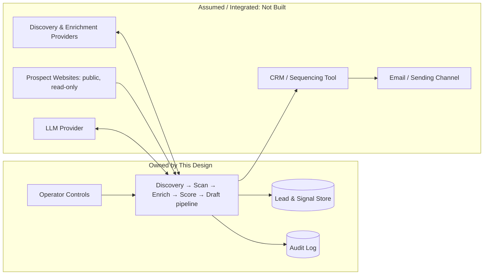

## 4. Current State (As-Is)

This is a **greenfield build**: there is no existing system. The "current state" is the **manual baseline** the founding team runs today, which the agent is meant to replace. Documenting it sets the bar the agent must beat on speed, cost, and consistency.

### 4.1 How Prospecting Works Today (Manual Baseline)

<Assumption>the team currently prospects manually with light tooling (search, spreadsheets, maybe a trial of one enrichment tool) rather than a paid stack.</Assumption> Each step is human-driven, serial, and unrecorded:

| Step | How it's done today | Cost / limitation |
|------|---------------------|-------------------|
| **Discover** | Googling niches, browsing Shopify/marketplace listings, "best store" lists | A few sites/hour; inconsistent; long-tail invisible |
| **Qualify** | Eyeballing the site, guessing size from "vibes" | Subjective; no repeatable score; no real traffic/size signal |
| **Find contact** | Hunting contact/about pages, LinkedIn, guessing `info@` | Tedious; the step where most leads die; no verification |
| **Personalize** | Writing each note from scratch after re-reading the site | Expensive per lead → outreach drifts generic |
| **Track** | Ad-hoc spreadsheet, or nothing | No audit trail; no learning loop; duplicates re-contacted |

### 4.2 What Exists in the Market (Build-vs-Buy Context)

The team is **not** inventing the category: mature point tools exist for each stage (see Appendices A-D). The relevant facts:

- **Discovery:** ecommerce-specific databases ([Store Leads][storeleads-api], [BuiltWith][builtwith-lists]) already expose ICP-queryable APIs.
- **Traffic/size:** estimation providers exist but are [unreliable for small stores][sparktoro]; free floor signals ([CrUX][crux], [Tranco][tranco]) are the robust base.
- **Contact:** a [layered on-site → waterfall → verify pipeline][waterfall-lift] is the known-good pattern; no single provider suffices for small ecommerce.
- **Orchestration:** [Clay.com][clay] already chains these generically.

<Assumption>the team is not currently paying for Clay or an equivalent orchestration stack: the agent is meant to be a purpose-built, ecommerce-specialized, cheaper-at-target-volume alternative, not a wrapper the team would otherwise rent.</Assumption>

### 4.3 Why Not Just Use Clay / Existing Tools?

This is the central as-is tension, carried into Section 5 and the recommendation. In brief: generic orchestration tools (a) aren't ecommerce-specialized (no built-in growth-marketing **signal taxonomy**, which is the whole point of the future self-healing service), (b) get expensive at the target lead volume, and (c) don't produce the structured, reusable scan output that Phase 2 depends on. The agent trades "rent a generic stack" for "own a focused engine that also seeds the next product." Whether to wrap vs. build each layer is captured as decisions in Section 6.5.

## 5. Problem Statement & Gaps

### 5.1 Problem Statement

A two-person team cannot manually produce a steady, high-quality flow of qualified ecommerce leads. The manual baseline (Section 4.1) tops out at a handful of sites per hour, produces no consistent score, loses most leads at the contact-finding step, and leaves no audit trail or learning loop. Meanwhile, the data needed to do this well; **which sites to scan, how big they are, and who to email**: is fragmented across paid providers of uneven quality, with real legal constraints on collection and outreach. The team needs an engine that turns the open web of ecommerce sites into a ranked, contactable, insight-rich lead queue **cheaply and at volume**, while staying compliant: and that, as a byproduct, builds the scanning foundation for the future self-healing service.

### 5.2 Gap Analysis

Each gap maps a current-state limitation (Section 4) to the objective it blocks (Section 2) and the decision that closes it (Section 6.5).

| # | Gap | Today (as-is) | Needed (to-be) | Blocks | Closed by |
|---|-----|---------------|----------------|--------|-----------|
| **G1** | **No scalable discovery** | Manual Googling; long-tail invisible; few sites/hour | Multi-source, ICP-queryable, deduped candidate pool | B1, T1 | D1 |
| **G2** | **No reliable size signal** | Guessing site size from "vibes" | Ordinal size tier + confidence per site, cheaply | B1, B3, T2 | D2 |
| **G3** | **No reliable contact** | Tedious manual hunt; the step where leads die | On-site → waterfall → verified contact w/ confidence | B1, T2 | D3 |
| **G4** | **No consistent score** | Subjective, gut-feel prioritization | Explainable score across fit/reachability/fixability | B1, B2, T3 | D5 |
| **G5** | **No reusable scan output** | Nothing structured captured | Signal taxonomy stored for reuse (seeds Phase 2) | B4, T4 | D4 |
| **G6** | **Generic outreach** | Expensive to personalize → drifts generic | Auto-drafted, insight-led outreach per lead | B2 | D5 |
| **G7** | **No audit / learning loop** | Ad-hoc spreadsheet or nothing | Full audit trail; outcomes feed back | T6 | D6 |
| **G8** | **Compliance is unmanaged** | No systematic robots/anti-spam/consent posture | Hard guardrails encoded (crawl + outreach) | T7 | D8 |

### 5.3 Impact Assessment

**Cost of the status quo (why this matters now):**

- **Starved pipeline.** At a few manually-discovered sites per hour and a high drop-off at contact-finding, a two-person team realistically reaches a small fraction of the **50 to 100 qualified leads/week** north-star (Section 2.3). The business is throughput-bound by human prospecting.
- **Wasted effort on bad-fit leads.** Without a size signal (G2) or score (G4), time goes into sites that are too small to serve or too big to win: the [±100% error on small-site traffic estimates][sparktoro] means even casual paid tooling misleads here.
- **Good leads die at "who do I email."** Contact-finding (G3) is both the most tedious step and the highest-attrition one; manual `info@` guesses also [hurt deliverability and spam reputation][google-bulk].
- **No compounding asset.** Every manual scan is thrown away (G5): nothing accrues toward the signal taxonomy the self-healing service needs, so Phase 1 effort doesn't de-risk Phase 2.
- **Compliance exposure.** Unmanaged scraping and outreach (G8) risk ToS/contract claims, [GDPR enforcement on scraped contacts][kaspr], and [CAN-SPAM penalties up to $53,088/email][canspam]: a material risk for a small company.

**Net:** the gaps compound: weak discovery feeds weak qualification feeds weak contact feeds generic outreach; so point-fixing one stage doesn't move the outcome. The design must address the **pipeline end-to-end**, which is why Section 6 proposes an integrated engine rather than a single tool.

## 6. Proposed Design

### 6.1 Target State Overview

The engine is a **staged pipeline driven by an LLM agent**, where each stage is cheap-first and degrades gracefully: it spends free/low-cost signals on every candidate and escalates to paid providers only as a lead earns it. The pipeline produces a **scored, contactable, insight-rich lead with a drafted outreach message** for human review.

```mermaid
graph LR
    subgraph cfg["Operator Config"]
        ICP[ICP + sources + weights + thresholds]
    end

    subgraph pipe["Scanning & Lead Engine"]
        D1S((1. Discover))
        D4S((2. Scan))
        D2S((3. Size<br/>estimate))
        D3S((4. Contact<br/>find + verify))
        D5S((5. Score<br/>& rank))
        D6S((6. Draft<br/>outreach))
    end

    QUEUE[(Lead Queue + Signal Store)]
    OP[Growth Operator]
    BD[Sales/BD Partner]

    ICP --> pipe
    D1S -->|candidate domains, PII-free| D4S
    D4S -->|signal taxonomy| D2S
    D2S -->|size tier + confidence| D3S
    D3S -->|verified contact + confidence| D5S
    D5S -->|score + reasons| D6S
    D6S --> QUEUE
    QUEUE --> OP
    OP -->|review / edit / approve| BD
    BD -.->|outcome feedback| QUEUE

```

**Design principles carried through every stage:**

1. **Cheap-first, escalate on merit**: free floor signals (CrUX, Tranco, on-site scrape) run on all candidates; paid providers (Store Leads tier, traffic APIs, contact waterfalls) fire only as a lead's score justifies the spend. This is what makes the target volume economical (B3).
2. **Confidence, not certainty**: size (D2) and contact (D3) carry confidence scores, not false-precision values; low-confidence items are flagged, not hidden.
3. **PII-free discovery, governed contact**: the discovery/scan/size stages touch only domains + firmographics; personal data is isolated to the contact stage under a compliance gate (D8).
4. **Every scan is an asset**: the signal taxonomy (D4) is stored structured and reusable, seeding the Phase 2 self-healing service.
5. **Human on the send**: the agent drafts; a human approves (D6).

### 6.2 Architecture Options

The options differ on **how much we build vs. buy** and **where the orchestration lives**. They span a spectrum from "rent a generic stack" to "own a purpose-built engine."

#### Option 1: Wrap an existing orchestrator (Clay-centric)

Build thin logic around [Clay][clay] (or equivalent): Clay handles discovery + waterfall enrichment; we add ecommerce scanning + scoring + drafting on top.

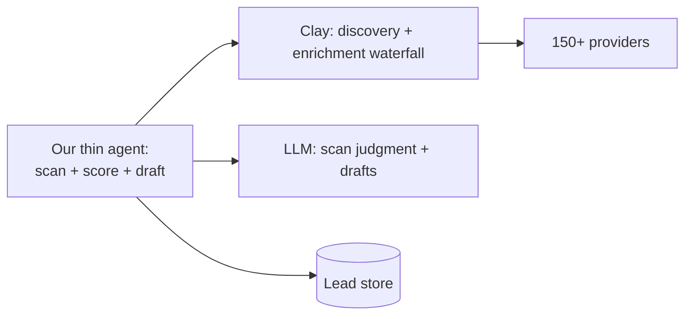

- **Strength:** fastest time-to-first-lead; least infrastructure; proven enrichment quality.
- **Weakness:** [cost compounds at volume][clay-pricing]; not ecommerce-specialized; **no reusable signal taxonomy** (the Phase 2 asset) unless we build scanning ourselves anyway; dependency on a third party's roadmap and pricing.

#### Option 2: Purpose-built engine over best-of-breed APIs (Recommended)

Build the pipeline and orchestration ourselves, calling **specialized APIs per stage** (Store Leads for discovery+size, on-site scrape + Dropcontact/Prospeo/Hunter waterfall + Bouncer for contact), with an LLM agent for scan judgment, scoring rationale, and drafting.

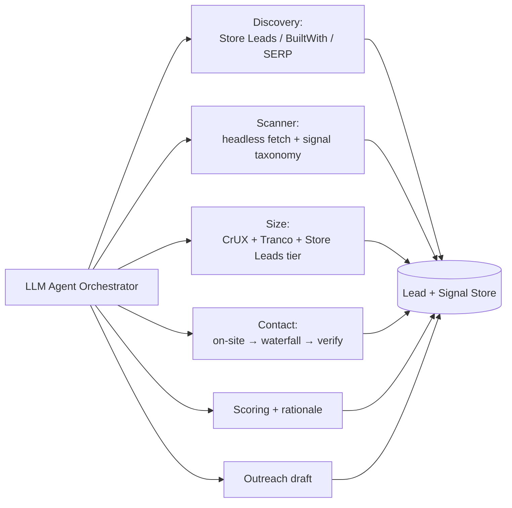

- **Strength:** ecommerce-specialized; **owns the signal taxonomy** (seeds Phase 2); cost-controlled via cheap-first escalation; no single-vendor lock-in (any provider is swappable behind our interface).
- **Weakness:** more to build than Option 1; we own the orchestration, retry, and rate-limit logic; provider integrations are our maintenance burden.

#### Option 3: Maximal in-house (build the data layer too)

Build discovery and size estimation from raw substrate ([Common Crawl][commoncrawl] for discovery, [CrUX][crux]/[Tranco][tranco] + DIY Shopify scraping for size), minimizing paid providers.

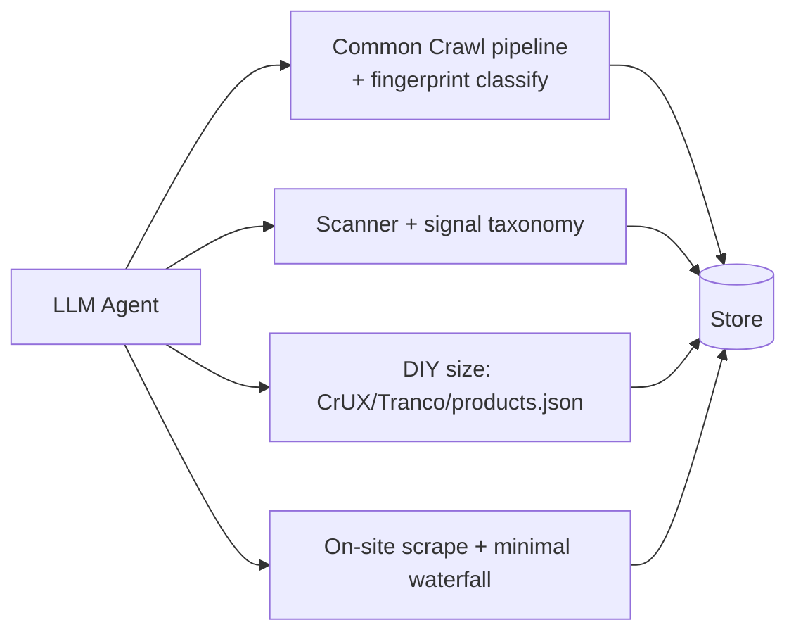

- **Strength:** lowest marginal data cost at scale; maximal control; no provider ToS exposure on discovery.
- **Weakness:** heavy engineering (Athena/Spark over Common Crawl, freshness lag, classification); slow time-to-value; reinvents what Store Leads already does well. Premature for a two-person Phase 1.

### 6.3 Comparison Matrix

| Dimension | Option 1: Wrap Clay | **Option 2: Purpose-built + APIs** | Option 3: Maximal in-house |
|-----------|---------------------|-----------------------------------|----------------------------|
| Time to first lead | **Fastest** | Medium | Slowest |
| Build effort | Low | Medium | High |
| Cost at target volume | High (compounds) | **Medium (controlled)** | Low marginal / high upfront |
| Ecommerce specialization | Low | **High** | High |
| Owns signal taxonomy (Phase 2 asset) | No | **Yes** | Yes |
| Vendor lock-in | High (Clay) | **Low (swappable)** | None |
| Maintenance burden | Low | Medium | **High** |
| Compliance control | Inherited | **Full** | Full |
| Fit for two-person Phase 1 | Good short-term | **Best balance** | Poor (too heavy) |

### 6.4 Recommendation

**Adopt Option 2: a purpose-built engine over best-of-breed APIs; with a pragmatic on-ramp borrowed from Option 1.**

**Phasing rationale:**

- **Phase 1a (validate cheap):** stand up the Option 2 pipeline skeleton but lean on the **highest-leverage paid API per stage** ([Store Leads][storeleads-api] for discovery+size tier; on-site scrape + one waterfall provider + [Bouncer][bouncer] for contact). Prove the scan→score→draft loop and unit economics on real leads fast. Optionally use Clay-style tooling to spot-check enrichment quality.
- **Phase 1b (own the moat):** deepen the **scanner + signal taxonomy** (the Phase 2 asset), add provider fallbacks behind our interface, and tune the cheap-first escalation to hit the cost-per-lead ceiling.
- **Defer Option 3** (Common Crawl / maximal in-house) until volume economics justify the engineering: noted as a future cost-optimization, not a Phase 1 task.

**Why Option 2 over the alternatives:** it's the only option that simultaneously (a) controls cost at the target volume via cheap-first escalation, (b) **produces the reusable signal taxonomy** that de-risks the self-healing Phase 2 (Option 1 doesn't), and (c) avoids the premature engineering load of Option 3 for a two-person team. Every external provider sits behind our own interface, so any single vendor (per Appendices A-C) is swappable without re-architecting.

**How this addresses the Section 5 gaps:** G1→layered discovery (D1); G2→cheap-first size tier + confidence (D2); G3→on-site→waterfall→verify pipeline (D3); G4→explainable LLM+rules scoring (D5); G5→owned signal taxonomy (D4); G6→auto-drafted insight-led outreach (D5); G7→audit trail + outcome feedback (D6); G8→encoded compliance guardrails (D8).

### 6.5 Key Design Decisions

The three founding-team concerns are **D1 (discovery), D2 (traffic), D3 (contact)**: each grounded in Appendices A-D.

---

#### D1: Site Discovery *(top concern; "which sites do we scan?")*

**Question:** How does the agent find candidate ecommerce sites matching the ICP, at volume, without starving the funnel or over-relying on one source?

| Option | Description | Trade-off |
|--------|-------------|-----------|
| Single vertical DB | [Store Leads][storeleads-api] only | Simplest; misses what its index lacks |
| **Layered funnel** | Store Leads/BuiltWith primary + PublicWWW/Common Crawl coverage + SERP long-tail + seed expansion | Best coverage; more integrations to maintain |
| Generic orchestrator | Let [Clay][clay] do discovery | Fast but costly, not ecommerce-tuned |

**Status:** **Leaning: layered funnel, Store Leads-primary** (start with one source in Phase 1a, add layers in 1b). **Rationale:** [no single source is complete][storeleads-api]; the layered approach (Appendix A) maximizes coverage while keeping discovery PII-free. Seed-list expansion = enrich each seed → extract platform/category/sales/app-stack fingerprint → re-query.

---

#### D2: Traffic / Size Discovery *(top concern; "how big is this site?")*

**Question:** How does the agent estimate a site's size/traffic for ICP fit and scoring, given that estimates are unreliable for small stores?

| Option | Description | Trade-off |
|--------|-------------|-----------|
| Paid estimator | [Similarweb][similarweb]/[Semrush][semrush-trends] visit numbers | Precise-looking but [±100% error on small sites][sparktoro]; costly |
| **Cheap floor + revenue tier** | [CrUX][crux] presence + [Tranco][tranco] rank, then [Store Leads][storeleads-api] revenue tier; ordinal buckets + confidence | Robust + cheap; not a precise number |
| Pure DIY | `products.json` catalog size + review counts | Free, works on any store; crude |

**Status:** **Leaning: cheap floor + revenue tier, expressed as ordinal buckets + confidence** (Appendix B). **Rationale:** point estimates are false precision for the long-tail ICP; bucketing is noise-robust. Escalate to a paid visit estimate ([DataForSEO][dataforseo] cheaply) only for borderline high-value leads. Watch [Cloudflare Radar/Tranco CC BY-NC][cloudflare-radar] license terms.

---

#### D3: Contact Discovery *(top concern; "who do we email?")*

**Question:** How does the agent find and verify a contactable email: ideally a decision-maker, not `info@`; for a small ecommerce brand?

| Option | Description | Trade-off |
|--------|-------------|-----------|
| Single provider | [Apollo][apollo]/[Hunter][hunter] only | Simple; [40 to 65% hit-rate, weak on small ecommerce][waterfall-lift] |
| **Layered pipeline** | On-site scrape → waterfall ([Dropcontact][dropcontact]/[Prospeo][prospeo]/Hunter) → [verify (Bouncer)][bouncer] | [80 to 95% hit-rate][waterfall-lift]; more stages |
| Buy a big DB | ZoomInfo/Clearbit | Overkill, costly, weak SMB coverage |

**Status:** **Leaning: layered pipeline, on-site-first** (Appendix C). **Rationale:** [Shopify requires a public contact email][shopify-contact] so on-site extraction is cheapest + highest-reliability; waterfall covers misses; verification is mandatory before a draft is sendable. Emit contact confidence; flag catch-all/role-only for human review. This stage is the **governed PII boundary** (D8).

---

#### D4: Scan Depth, Rendering & Signal Taxonomy

**Question:** How deep does the scanner go, does it render JS, and what's the structured signal output?

| Option | Description | Trade-off |
|--------|-------------|-----------|
| Static fetch only | HTML fetch, no JS | Cheap, fast; misses JS-rendered content + perf signals |
| **Headless render, bounded pages** | Headless browser on key pages (home, product, cart, contact); fixed page budget | Captures real perf/CRO signals; more compute |
| Full crawl | Render entire site | Comprehensive; expensive, slow, overkill Phase 1 |

**Status:** **Leaning: headless render on a bounded page set**, producing a **structured signal taxonomy** (perf/Core Web Vitals, SEO/meta/schema, CRO/CTA/forms, content gaps). **Rationale:** the taxonomy is the Phase 2 asset (G5/B4); a bounded page budget controls cost. Exact page budget = open item (Section 13.3).

---

#### D5: Scoring Model

**Question:** Rules, LLM-judged, or hybrid: and which dimensions?

| Option | Description | Trade-off |
|--------|-------------|-----------|
| Rules/weights | Deterministic weighted score | Transparent, cheap; brittle, misses nuance |
| LLM-judged | LLM scores from scan + enrichment | Flexible, explains itself; cost + consistency risk |
| **Hybrid** | Rules for hard ICP gates (size tier, platform, geo) + LLM for fixability/insight + rationale | Best of both; must manage the boundary |

**Status:** **Leaning: hybrid** across **fit / reachability / fixability** with machine-readable reasons (T3). **Rationale:** hard ICP filters are deterministic and cheap; fixability and outreach insight need judgment. Every score carries reasons (explainability success criterion). Weights are operator-configurable.

---

#### D6: Outreach Automation Level

**Question:** How far does the agent go on outreach?

**Status:** **Decided (Phase 1): draft → human sends (HITL on send).** The agent produces a personalized, insight-led draft; a human reviews/edits/approves/sends. **Rationale:** trust, deliverability, and legal safety (Appendix D) all argue for a human on the send in Phase 1. Configurable auto-send with thresholds is a **future autonomy tier**, explicitly out of scope now (Section 3.2). Approval decisions are logged (D6→T6 audit).

---

#### D7: Tech Stack & Data Store

**Question:** Orchestration runtime, scan infrastructure, lead storage, LLM provider.

| Area | Leaning | Note |
|------|---------|------|
| Agent/orchestration | LLM agent with tool-calling (cheap-first stage logic) | <Assumption>built around Claude as the reasoning engine for scan judgment, scoring rationale, and drafting.</Assumption> |
| Scan infra | Headless browser workers (bounded pages, rate-limited) | Honors D8 crawl guardrails |
| Data store | Lead + signal store + audit log | Schema in Section 7.2 |
| Providers | Best-of-breed per stage, behind our own interface | Swappable (Appendices A-C) |

**Status:** **TBD**: concrete runtime/hosting/DB choices deferred; principles set (modular, provider-swappable, cheap-first). Resolve before build.

---

#### D8: Compliance Posture *(crawl ethics + outreach law)*

**Question:** What hard guardrails govern scanning and outreach?

**Status:** **Decided in principle (Appendix D):** read-only logged-out public pages only; honor robots.txt + rate limits; never bypass anti-bot/CAPTCHA; keep discovery PII-free and isolate contact PII in a governed store with retention limits + lawful-basis/source recorded; every outreach carries sender identity + physical address + working opt-out honored ≤2 days; SPF/DKIM/DMARC + one-click unsubscribe on the sending domain; maintain a suppression list. **Rationale:** [US scraping of public pages is defensible but ToS/DMCA/GDPR risks are real][hiq]; [CAN-SPAM allows opt-out B2B but penalizes violations heavily][canspam]; [EU needs a legitimate-interest basis + disclosure][ico-b2b]. These become NFRs in Section 11.5.

## 7. Key Components & Data Model

### 7.1 Components

Each component is one pipeline stage plus the cross-cutting agent, store, and config. Every external provider sits **behind the component's interface** so it is swappable (the Option 2 recommendation).

| Component | Single-sentence responsibility | Interface (in → out) | Owns / external |
|-----------|-------------------------------|----------------------|-----------------|
| **Agent Orchestrator** | Drives the pipeline, decides cheap-first vs. escalate per lead, calls tools, handles retries/rate limits. | ICP config + candidate → staged tool calls | LLM provider (D7) |
| **Discovery Service** | Produces a deduped pool of candidate domains matching the ICP. | ICP filters → `Candidate[]` | Store Leads / BuiltWith / SERP / Common Crawl (D1) |
| **Scanner** | Reads bounded public pages and emits the structured **signal taxonomy** per site. | domain → `SignalSet` | Headless browser workers (D4) |
| **Size Estimator** | Returns an ordinal size tier + confidence. | domain → `SizeEstimate` | CrUX / Tranco / Store Leads / DataForSEO (D2) |
| **Contact Finder** | Returns a verified contact + confidence via on-site → waterfall → verify. | domain → `Contact` | On-site scrape / Dropcontact / Prospeo / Hunter / Bouncer (D3) |
| **Scorer** | Computes an explainable score across fit / reachability / fixability with reasons. | signals + size + contact → `Score` | Rules + LLM (D5) |
| **Outreach Drafter** | Generates a personalized, insight-led outreach draft. | lead → `OutreachDraft` | LLM (D5) |
| **Lead Store** | Persists leads, signals, scores, drafts, and outreach status. | CRUD | Owned (D7) |
| **Audit Log** | Records every pipeline action and operator decision. | append-only events | Owned (D6/D8) |
| **Operator Console** | Configures ICP/sources/weights/thresholds; reviews leads + drafts; approves sends. | operator UI | Owned |
| **Compliance Gate** | Enforces crawl + outreach guardrails; manages suppression list + lawful-basis records. | checks at scan + send | Owned (D8) |

### 7.2 Data Model

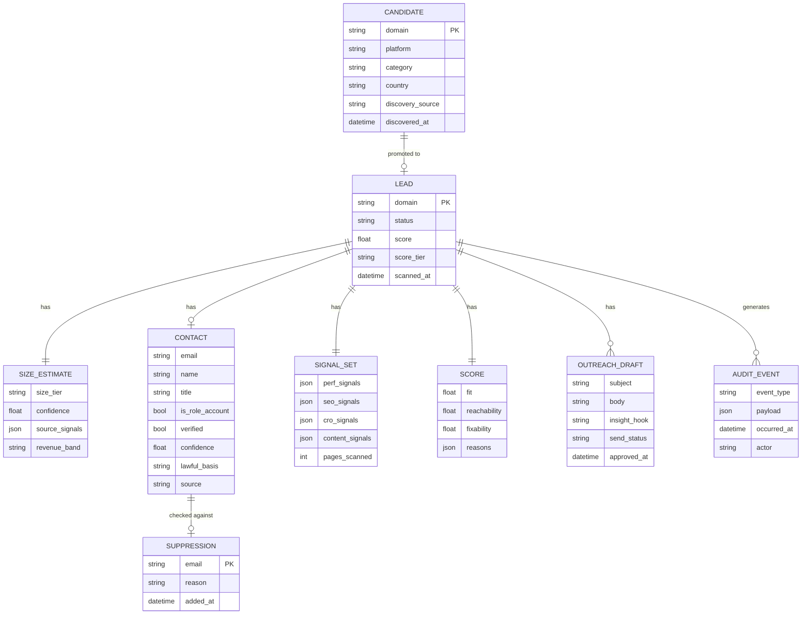

**Notes:**
- **PII isolation (D8):** personal data lives only in `CONTACT`, each row carrying `lawful_basis` + `source` for compliance. `CANDIDATE`/`SIGNAL_SET`/`SIZE_ESTIMATE` are PII-free.
- **Confidence everywhere:** `SIZE_ESTIMATE` and `CONTACT` carry `confidence`; `SCORE` carries machine-readable `reasons` (explainability success criterion).
- **Suppression:** every contact is checked against `SUPPRESSION` before a draft is marked sendable (opt-outs, bounces, do-not-contact).

### 7.3 Data Flows

**Primary flow (discover → drafted lead):**

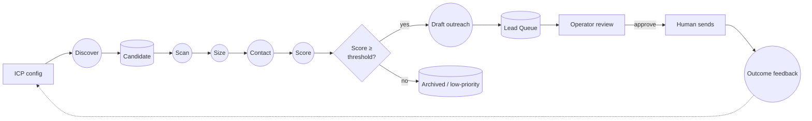

**Cheap-first escalation (within a lead):** free signals (CrUX/Tranco presence, on-site scrape) run first; if the lead clears the ICP gate, paid calls (Store Leads tier, contact waterfall, verification) fire: so spend tracks lead quality, controlling cost-per-lead (B3). Every step appends an `AUDIT_EVENT`.

## 8. Use Cases

The actors are the three direct system participants from [Section 1.4](#14-system-users--personas); the **Growth Operator**, the **Sales/BD Partner**, and the **Scanning Agent**: each with the use cases drawn from the pipeline (D1 to D6) and the operator controls.

**Use-case diagram**: squares = actors (color-coded), circles = use cases; dashed = triggered/feedback flow.

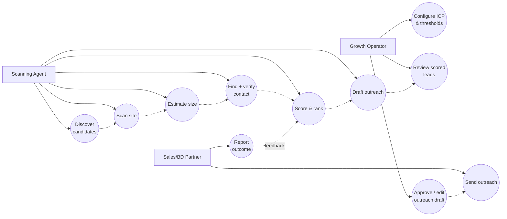

**Key use cases (actor → goal → brief flow):**

- **UC1: Configure ICP & thresholds** *(Growth Operator)* → set the discovery filters, scoring weights, and approval thresholds → operator edits ICP/sources/weights in the console; config drives every downstream stage (D1, D5).
- **UC2: Review scored leads** *(Growth Operator)* → triage the ranked queue → operator opens the lead queue, reads each lead's score *with reasons*, size tier + confidence, and contact + confidence (D5, T3).
- **UC3: Approve / edit outreach draft** *(Growth Operator)* → get a sendable, on-message draft → operator reviews the insight-led draft, edits if needed, and approves; decision is logged (D6, T6).
- **UC4: Send outreach** *(Sales/BD Partner)* → reach the prospect → partner sends the approved draft through the email channel after the compliance/suppression gate clears (D6, D8).
- **UC5: Report outcome** *(Sales/BD Partner)* → close the learning loop → partner records reply/meeting/no-response; the outcome feeds back to scoring (G7, D5).
- **UC6-UC11: Discover → Scan → Estimate size → Find + verify contact → Score & rank → Draft** *(Scanning Agent)* → turn a candidate domain into a scored, contactable, drafted lead → the agent runs the cheap-first staged pipeline, escalating to paid providers only past the ICP fit gate (Section 6.1, D1 to D5).

## 9. Customer Journey

The primary subject the engine acts on is a **candidate ecommerce site**, which the operator and partner shepherd from "unknown domain" to "prospect in conversation." This is the end-to-end journey a candidate travels through the Phase 1 pipeline.

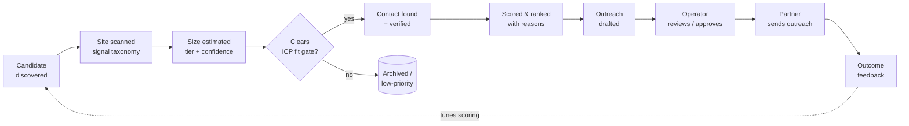

*The fit gate (J4) is the cost-control lever: only candidates that pass size + ICP earn the paid contact/verification and scoring spend (B3). Low-fit candidates are archived, not discarded, and outcomes feed back to tune discovery and scoring.*

## 10. Architecture Diagrams

Several diagrams already live where they add the most context: the **context diagram** is in [Section 1.3](#13-context), the **system-boundaries diagram** in [Section 3.3](#33-system-boundaries), the **target-state + option diagrams** in [Section 6](#6-proposed-design), the **ER + data-flow diagrams** in [Section 7](#7-key-components--data-model), and the **use-case diagram** in [Section 8](#8-use-cases). This section adds the **sequence** view.

### 10.1 Sequence Diagram: One Candidate Through the Pipeline

Shows cheap-first escalation, the score gate, the compliance gate, and the human-on-send loop.

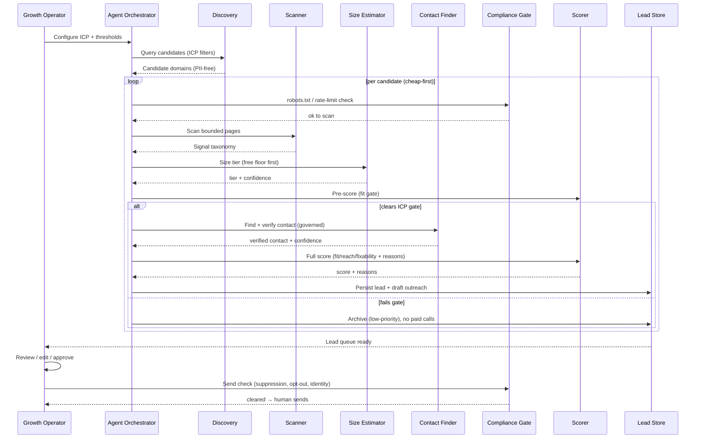

> Note: the **fit gate before contact-finding** is the cost-control lever: paid contact/verification calls only fire for leads that already pass size + ICP, keeping cost-per-lead bounded (B3).

## 11. Non-Functional Requirements & Constraints

### 11.1 Performance

| ID | Requirement | Target | Rationale |
|----|-------------|--------|-----------|
| P1 | Per-candidate scan throughput | Sustain enough volume to yield **50 to 100 qualified leads/week** (Section 2.3) at the assumed ~5% candidate-to-qualified yield | North-star KPI |
| P2 | Cheap-first cost ceiling | Median **cost-per-qualified-lead below an operator-set ceiling** (provider + compute) | B3 unit economics |
| P3 | Scan latency (per site) | Not latency-critical; batch/async; a site scan completing in minutes is fine | It's a pipeline, not interactive |
| P4 | Graceful degradation | A provider timeout/null on one stage never fails the lead; fall back (e.g., size → review/catalog proxy) | Robustness (Appendices B-C) |

### 11.2 Security

| ID | Requirement |
|----|-------------|
| S1 | Provider API keys and the LLM key stored as secrets, never in code or logs. |
| S2 | The Lead Store (esp. `CONTACT` PII) is access-controlled; only the two operators have access in Phase 1. |
| S3 | The Audit Log is append-only and tamper-evident. |
| S4 | Outbound sending uses an authenticated domain (SPF/DKIM/DMARC, see 11.5). |

### 11.3 Scalability

The Phase 1 target is **lean** (Section 2.3), so scalability is about *cost-linear growth*, not massive concurrency. Scaling dimensions: number of candidates scanned/week, provider call volume (cost-bound), and signal-store size. The Option 2 architecture scales by adding headless workers and raising provider tiers; <Assumption>Phase 1 runs comfortably on a single modest worker pool: horizontal scale-out is a later concern.</Assumption> Deferring Option 3 (Common Crawl) means we accept provider costs now and revisit if volume economics demand in-house data.

### 11.4 User Experience

The two personas (Section 1.4) need very different surfaces:

| Persona | UX requirement |
|---------|----------------|
| **Growth Operator** | Configure ICP/sources/weights/thresholds without code; see a **ranked lead queue** where each lead shows its score *with reasons*, size tier + confidence, contact + confidence, and the drafted outreach. One-action approve/edit/reject. Claude-Code-style **configurable autonomy**: operator sets how much the agent does before pausing for review. |
| **Sales/BD Partner** | A clean, read-to-send view: the lead, the insight hook, the draft. Minimal friction from "approved" to "sent." Record outcome in one step (feeds the learning loop). |

**UX principle:** the system **accelerates, never gates** the operator: every score and draft is a starting point the human can override, and nothing is a black box (explainability is a UX requirement, not just a metric).

### 11.5 Compliance & Constraints

These are **hard guardrails** derived from D8 / Appendix D. They are requirements, not best-efforts.

**Crawl / scanning guardrails:**

| ID | Requirement | Source |
|----|-------------|--------|
| C1 | Read-only, **logged-out, public pages only**: no logins, account creation, checkout, or paywall bypass. | [hiQ / Bright Data][bright-data] |
| C2 | **Honor robots.txt** and apply polite rate limiting per host. | [Ziff Davis v. OpenAI][ziff-openai] (advisory, but honored) |
| C3 | **Never bypass anti-bot / CAPTCHA** or other technical barriers. | DMCA §1201 risk |
| C4 | Discovery/scan/size stages are **PII-free**; personal data only enters at the governed contact stage. | [GDPR][gdpr] |

**Outreach / contact guardrails:**

| ID | Requirement | Source |
|----|-------------|--------|
| C5 | Every contact record carries a **lawful basis + source** (legitimate-interest assessment for B2B). | [ICO B2B guidance][ico-b2b] |
| C6 | Every outreach includes **sender identity + valid physical postal address + working opt-out**. | [CAN-SPAM][canspam] |
| C7 | **Honor opt-outs ≤2 days**; maintain a suppression list checked before every send. | [Google/Yahoo bulk rules][google-bulk] |
| C8 | Sending domain configured with **SPF + DKIM + DMARC + one-click unsubscribe (RFC 8058)**; keep spam-complaint rate &lt;0.10%. | [Google/Yahoo bulk rules][google-bulk] |
| C9 | **Human approves every send** in Phase 1 (D6): no unattended sending. | D6 |
| C10 | Contact PII retained under a **data-minimization + retention policy**; honor deletion requests. | [GDPR][gdpr] |

**Technical constraints:**
- **Provider licensing:** several providers restrict storage/redistribution; [Cloudflare Radar/Tranco are CC BY-NC (non-commercial)][cloudflare-radar]: confirm lead-gen rights before relying on any feed commercially.
- **Small-site data quality:** size/traffic estimates are [unreliable below ~5k visits/mo][sparktoro]: the design must treat them as confidence-banded tiers, never facts.
- **Two-person operating capacity:** the design must minimize operational toil: the team cannot babysit infrastructure.

> **Disclaimer:** Appendix D and these guardrails are research-derived, **not legal advice**. The team should validate the outreach posture (especially EU legitimate-interest and per-jurisdiction rules) with counsel before scaling outreach.

## 12. Phases

Phase 1 is built by the **two-person founding team** ([Section 1.4](#14-system-users--personas)): the **Growth Operator** (technical/product, builds the engine) and the **Sales/BD Partner** (commercial, validates leads and runs outreach), with the **Scanning Agent** executing the pipeline once built. Phasing follows the [Section 6.4](#64-recommendation) recommendation: validate cheap first, then own the moat, then defer the heavy in-house data layer.

| Phase | Goal | Who builds it | Key deliverables |
|-------|------|---------------|------------------|
| **1a: Validate cheap** | Prove the scan→score→draft loop and unit economics on real leads fast | Growth Operator builds; Sales/BD Partner validates lead quality | Option 2 pipeline skeleton; one highest-leverage paid API per stage (Store Leads discovery+size; on-site scrape + one waterfall + Bouncer for contact); hybrid scoring; draft-only outreach (D6) |
| **1b: Own the moat** | Deepen the durable assets and hit the cost-per-lead ceiling | Growth Operator builds; Sales/BD Partner tunes ICP + outreach | Deeper scanner + structured **signal taxonomy** (D4, the Phase 2 asset); provider fallbacks behind our interface; cheap-first escalation tuning; audit trail + outcome feedback loop |
| **Future: Defer / extend** | Optimize data economics and seed the north-star service | Future engineering hires (Operator directs) | Optional in-house data layer (Option 3 / Common Crawl) when volume justifies; configurable auto-send autonomy tier; self-healing remediation (separate design, out of scope here) |

**RACI: Phase 1 workstreams × the founding team (R = Responsible, A = Accountable, C = Consulted, I = Informed):**

| Responsible | Accountable | Consulted | Informed | Activity |
|-------------|-------------|-----------|----------|----------|
| Growth Operator | Growth Operator | Sales/BD Partner |; | Configure ICP, sources, scoring weights, thresholds (D1, D5) |
| Growth Operator | Growth Operator | Sales/BD Partner |; | Build discovery + scanner + size + contact pipeline (D1 to D4) |
| Growth Operator | Growth Operator | Sales/BD Partner |; | Build scoring model + outreach drafter (D5) |
| Growth Operator | Growth Operator | Legal counsel | Sales/BD Partner | Compliance gate + guardrails (D8, Section 11.5) |
| Growth Operator | Growth Operator | Sales/BD Partner |; | Review scored leads + approve/edit drafts (D6) |
| Sales/BD Partner | Sales/BD Partner | Growth Operator |; | Send approved outreach + run conversations |
| Sales/BD Partner | Sales/BD Partner | Growth Operator |; | Report outcomes into the learning loop (G7) |
| Growth Operator | Sales/BD Partner | Growth Operator |; | Provider selection + budget per stage (D1 to D3, D7) |

## 13. Risks, Dependencies & Open Questions

### 13.1 Risks

| Risk | Likelihood | Impact | Mitigation |
|------|-----------|--------|------------|
| **Contact-finding hit-rate too low** for small ecommerce → leads die at "who to email" | Medium | High | On-site-first + waterfall + verify (D3); track hit-rate vs. ≥70% target; flag low-confidence for manual hunt |
| **Size estimates so noisy** that scoring mis-prioritizes | High | Medium | Ordinal tiers + confidence, not point values (D2); cross-reference free floor; widen confidence bands for tiny sites |
| **Provider cost compounds** above the cost-per-lead ceiling | Medium | High | Cheap-first escalation + fit gate before paid calls (Section 10.1); monitor P2; defer to in-house (Option 3) if economics demand |
| **Legal/compliance misstep** (scraping ToS, GDPR, CAN-SPAM) | Low-Med | High | Hard guardrails C1 to C10; legal review before scaling outreach; PII isolation; suppression list |
| **Deliverability collapse** (spam flagging) damages sender reputation | Medium | High | SPF/DKIM/DMARC, verification gate, named-contact preference, volume discipline (C8); warm up sending domain |
| **Provider API change / shutdown** (cf. Bing API retired, Google CSE deprecating) | Medium | Medium | Provider-swappable interfaces (Option 2); no single-vendor lock-in; monitor provider roadmaps |
| **Scope creep into self-healing** before Phase 1 proves out | Medium | Medium | Strict scope boundary (Section 3.2); self-healing explicitly deferred |
| **LLM scoring inconsistency / cost** | Medium | Medium | Hybrid model (D5): rules for hard gates, LLM only where judgment is needed; cache; constrain output schema |
| **Two-person bandwidth**: even with the agent, review/send is human | Medium | Medium | Configurable autonomy (11.4); batch review UX; prioritize highest-score leads |

### 13.2 Dependencies

- **External providers** (swappable, but the pipeline depends on *some* provider per stage): discovery ([Store Leads][storeleads-api]/[BuiltWith][builtwith-lists]), size ([CrUX][crux]/[Tranco][tranco]/[Store Leads][storeleads-api]), contact ([Dropcontact][dropcontact]/[Prospeo][prospeo]/[Hunter][hunter] + [Bouncer][bouncer]).
- **LLM provider** for scan judgment, scoring rationale, and drafting (D7: <Assumption>Claude</Assumption>).
- **A CRM / sequencing tool** as system of record and an **email sending channel** (Section 3.3).
- **Headless browser infrastructure** for scanning (D4).
- **Legal counsel** to validate the outreach posture before scaling (Section 11.5).

### 13.3 Open Questions

| # | Question | Tied to | Needed to decide |
|---|----------|---------|------------------|
| OQ1 | What exactly is the ICP (platforms, categories, geos, size band)? | D1, D5 | Operator input; drives discovery filters + scoring |
| OQ2 | What's the concrete **page budget** per scan (which pages, how many)? | D4 | Cost vs. signal-quality tradeoff; tune on real runs |
| OQ3 | What's the **cost-per-lead ceiling** (the P2 number)? | B3, P2 | Operator/business input |
| OQ4 | Which **CRM / sequencing tool** and **email channel**? | 3.3, D7 | Operator preference / existing stack |
| OQ5 | Concrete **D7 stack**: runtime, hosting, database? | D7 | Resolve before build |
| OQ6 | Phase 1a starting **provider per stage** (one each) and budget? | D1 to D3 | Validate economics fast |
| OQ7 | What outcome signals feed the **learning loop**, and how do they adjust scoring? | D5, G7 | Defines the feedback mechanism |
| OQ8 | EU vs. US-only outreach in Phase 1 (changes the legal bar)? | D8 | Counsel + go-to-market scope |

### 13.4 FAQ

_This FAQ doubles as a **question-index** into the document: each answer links to the section that covers it in full._

**Q: Why not just use Clay?** It's the fastest start (Option 1) but costs compound at volume, isn't ecommerce-specialized, and: critically; doesn't produce the **reusable signal taxonomy** the self-healing Phase 2 depends on. We may use it to spot-check enrichment in Phase 1a, but the engine is purpose-built (Section 6.4).
→ [§6.4 Recommendation](#64-recommendation)

**Q: Isn't scraping illegal?** Reading logged-out public pages is broadly defensible in the US ([hiQ][hiq], [Bright Data][bright-data]), but we honor robots.txt, rate-limit, never bypass anti-bot measures, and isolate PII: see guardrails C1 to C10. Not legal advice; counsel reviews before scaling.
→ [§11.5 Compliance & Constraints](#115-compliance--constraints)

**Q: Why is the agent allowed to draft but not send?** Trust, deliverability, and legal safety (Appendix D). Phase 1 keeps a human on every send (D6); configurable auto-send is a future autonomy tier.
→ [§6.5 Key Design Decisions](#65-key-design-decisions) · [§3.2 Out of Scope](#32-out-of-scope)

**Q: How do we handle a site we can't find a contact for?** It's still a scored lead; the contact stage emits low/no-confidence and flags it for a manual hunt rather than dropping it. Hit-rate is tracked against the ≥70% target.
→ [§6.5 Key Design Decisions](#65-key-design-decisions) · [§13.1 Risks](#131-risks)

**Q: What stops cost from exploding?** The fit gate before contact-finding (Section 10.1): paid calls only fire for leads that already pass size + ICP; plus cheap-first escalation throughout.
→ [§10.1 Sequence Diagram. One Candidate Through the Pipeline](#101-sequence-diagram-one-candidate-through-the-pipeline)

**Q: How does this become the self-healing service?** The scanner's structured signal taxonomy (D4) *is* the action space for auto-remediation. Phase 1 builds and validates detection at scale; Phase 2 adds the "fix it" capability on top.
→ [§6.5 Key Design Decisions](#65-key-design-decisions) · [§3.2 Out of Scope](#32-out-of-scope)

**Q: How do we keep scoring from being a black box?** Scoring is a hybrid of deterministic rules for hard ICP gates plus LLM judgment for fixability and insight, and every score carries machine-readable reasons (the explainability success criterion).
→ [§6.5 Key Design Decisions](#65-key-design-decisions) · [§11.4 User Experience](#114-user-experience)

**Q: What happens if a data provider changes pricing or shuts down?** Every external provider sits behind our own interface, so any single vendor is swappable without re-architecting: there's no single-vendor lock-in.
→ [§6.4 Recommendation](#64-recommendation) · [§13.1 Risks](#131-risks)

## Appendices

> **Research provenance:** Appendices A-D were produced by web research on **2026-06-21** to ground the data-sourcing decisions D1 to D3 and the compliance posture (D8). Pricing and accuracy figures are 2026 snapshots and must be re-verified at build time. A fuller legal write-up is archived at `scanning-outreach-legal-compliance-2026.md` (repo root).

### Appendix A: Site Discovery Sources Research (informs D1)

_Researched 2026-06-21 to inform **D1: Site discovery**._

**Headline findings:**

- **The two "obvious" search APIs are gone.** Microsoft [retired the Bing Web Search API on 2025-08-11][bing-retire]; Google's [Custom Search JSON API is closed to new customers and fully deprecates 2027-01-01][gcs-deprecate]. Discovery must lean on purpose-built ecommerce databases and third-party SERP APIs.
- **A vertical database beats generic search for ICP-driven discovery.** [Store Leads][storeleads-api] (ecommerce-only, ~14M stores, REST API) and the [BuiltWith Lists API][builtwith-lists] let you *bulk-query by criteria* (platform + category + country + sales band) rather than guess-and-scrape.
- **Free/bulk substrate exists** via [Common Crawl][commoncrawl] (petabyte public-web corpus, queryable URL index) and [PublicWWW][publicwww] (search over page source for platform fingerprints), but both require you to classify/enrich downstream.
- **Ad libraries are gated.** The [Meta Ad Library API returns political/social-issue ads only][meta-adlib]: commercial ecommerce ads are visible in the UI but not via the open API. [Google Ads Transparency Center has no official API][google-ads-transparency] (third-party SERP scrapers only).
- **Orchestration benchmark:** [Clay.com][clay] is the de-facto glue chaining 150+ providers with waterfall enrichment: the buy-vs-build reference; our agent is essentially an ecommerce-specialized Clay.

**Discovery source comparison (ranked for ICP-driven funnel):**

| Rank | Source | API | Bulk-query by ICP | Rough cost | Key limitation |
|------|--------|-----|-------------------|-----------|----------------|
| 1 | [Store Leads][storeleads-api] | REST | **Yes**: platform/category/country/sales/apps | ~$75-$950/mo | Modeled sales/traffic; rate caps on low tiers |
| 2 | [BuiltWith Lists API][builtwith-lists] | Yes (Pro+) | **Yes**: tech + ecommerce category + revenue | ~$295-$6,000/mo | Expensive; result caps |
| 3 | [Clay.com][clay] (orchestration) | Yes | Indirect; chains others + AI ICP/lookalike | ~$185-$495/mo + credits | Cost compounds; it's glue, not a source |
| 4 | [PublicWWW][publicwww] | Yes | Partial; by source-code snippet only | ~$29-$249/mo | No firmographic filters; stale index |
| 5 | Third-party SERP APIs ([SerpApi][serpapi], [Serper][serper]) | Yes | Indirect; many tailored queries | ~$0.30-$5 / 1k | Pagination grind; SERP-scraping gray zone |
| 6 | [Common Crawl][commoncrawl] | DIY (S3/Athena) | Yes at scale, you build it | ~Free + compute | No filters; freshness lags; heavy eng |
| 7 | [Meta Ad Library API][meta-adlib] | Scope-limited | **No** for commercial ads | Free / researcher-gated | Commercial ads excluded; anti-scrape |

**Free Shopify confirmation trick:** every Shopify store exposes `/{store}/products.json` (250 products/page, no auth); excellent free enrichment once a candidate domain is found.

:::tip[Design implication]
D1 should adopt a **layered funnel**: Store Leads (or BuiltWith Lists) as the primary ICP-queryable source, supplemented by PublicWWW/Common Crawl for coverage and SERP APIs for the long tail, with operator seed-list expansion via fingerprint-extraction (enrich each seed → re-query the DB with its platform/category/sales/app-stack signature). Keep the discovery funnel **PII-free** (domains + firmographics only); isolate contact discovery into a separate governed stage (Appendix C).
:::

### Appendix B: Traffic / Size Estimation Research (informs D2)

_Researched 2026-06-21 to inform **D2: Traffic discovery**._

**Headline finding:** **No single source is reliable for small/long-tail ecommerce sites.** Third-party traffic estimates degrade sharply below ~5,000 monthly visits: exactly the range that matters most. The [SparkToro ground-truth study][sparktoro] (1,000+ sites sharing real Google Analytics data) found correlations to GA of **Semrush 0.79, Similarweb 0.66, Ahrefs 0.50**, with error ranges frequently exceeding ±100% on small sites: *"no 3rd-party estimate today is consistently accurate enough to place high confidence."*

**Recommended approach: cheap free "floor" signal + ecommerce revenue tier, expressed as ordinal buckets with a confidence flag: never a precise visit count.**

| Rank | Source | API | What it gives | Cost | Why |
|------|--------|-----|---------------|------|-----|
| 1 | [Chrome UX Report (CrUX)][crux] | Yes | Presence = site exceeds Google's popularity floor; log10 rank buckets | Free | Best free "is this real?" signal; absence = genuinely tiny |
| 2 | [Store Leads][storeleads-api] | Yes | Ecommerce **revenue tier** (±30%, directional); falls back to review-volume when no traffic data | $29/mo or $4/1k | Only cheap source with a revenue tier that works on long-tail stores |
| 3 | [Tranco][tranco] | Yes | Manipulation-hardened top-1M rank | Free | Strong corroborator for CrUX |
| 4 | DIY Shopify (`products.json` + review counts) | DIY | Catalog size + sales-velocity proxy | Free | Works on any store regardless of size |
| 5 | [DataForSEO Bulk Traffic][dataforseo] | Yes | Estimated monthly traffic, up to 1k domains/request | ~$1.1/1k | Cheapest paid visit-estimate at scale |
| 6 | [Semrush .Trends API][semrush-trends] | Yes | Visits, engagement | ~$289/mo+ | Best GA correlation when a number is needed |
| 7 | [Similarweb API][similarweb] | Yes | Richest panel data | ~$6k/yr+ | Worst small-site accuracy; highest cost |

:::tip[Design implication]
D2 should compute an **ordinal size tier + confidence score**, not a point estimate. Lead with the free floor (CrUX presence + Tranco rank → "is it big enough to bother?"), then Store Leads for a revenue tier with review fallback, escalating to a paid visit estimate ([DataForSEO][dataforseo] cheaply, or [Semrush][semrush-trends]/[Similarweb][similarweb] for high-value borderline leads) only when warranted. Treat wide inter-provider disagreement as a *confidence-lowering* signal. Note [Cloudflare Radar][cloudflare-radar] and Tranco-via-Cloudflare carry **CC BY-NC (non-commercial)** terms: check before baking into a commercial product.
:::

### Appendix C: Contact Discovery Research (informs D3)

_Researched 2026-06-21 to inform **D3: Contact discovery**._

**Headline finding:** No single provider reliably resolves a contactable email for a *small* ecommerce brand; the big B2B databases (ZoomInfo, Apollo, RocketReach) are tuned for mid-market/enterprise and miss sub-20-employee DTC/Shopify brands. The architecture that works is a **layered pipeline: on-site extraction → decision-maker name resolution → email finding/waterfall → verification → deliverability gate.** Single-source email match runs **40 to 65%**; [waterfall enrichment lifts it to 80 to 95%][waterfall-lift].

**Layered pipeline (ranked by usefulness × cost for small ecommerce):**

| Rank | Layer / source | Why | Rough cost |
|------|----------------|-----|-----------|
| 1 | **On-site scrape** (footer/contact/about/policy + `mailto:` + JSON-LD) | Highest reliability; [Shopify requires a public store-contact email][shopify-contact] | ~$0.13 to 1.50 / 1k sites ([Zyte][zyte]/[ScrapingBee][scrapingbee]) |
| 2 | [Dropcontact][dropcontact] or [Prospeo][prospeo] | Best small-ecom hit-rate; algorithmic, GDPR-clean, pay-on-valid | €79/mo / $39 to 99/mo |
| 3 | [Clay waterfall][clay-pricing] (150+ providers, no charge on miss) | Solves low single-provider SMB coverage | $185 to 495/mo |
| 4 | [Hunter.io][hunter] (pattern inference + verify) | Cheap when domain known; API on all tiers | $49 to 149/mo |
| 5 | [Bouncer][bouncer] / [ZeroBounce][zerobounce] (verification gate) | **Mandatory before send**; reduces bounce/spam-trap risk | $0.002 to 0.008/email |
| 6 | [Apollo.io][apollo] (name+title + cheap enrichment) | Good US SMB first pass; verify output (15 to 25% bounce) | $49 to 119/user/mo |
|, | ZoomInfo / Clearbit-Breeze / RocketReach | Overkill / lock-in / weak SMB coverage, *not the backbone* | $15k+/yr / HubSpot-only / $209/mo |

**Key gotchas:**
- **WHOIS is dead for contact discovery**: [ICANN's Registration Data Policy (effective 2025-08-21)][icann-rdp] keeps registrant data redacted. Use only for registrar/domain-age confirmation.
- **Catch-all domains** (~12 to 15% of B2B) accept every address at SMTP handshake, so verifiers can't confirm a real mailbox: segment these, don't blindly trust or discard.
- **Cloudflare email obfuscation** is a simple XOR cipher, trivially reversed by headless browsers.
- **Role accounts** (`info@`, `support@`) get spam-flagged ~3 to 5× more than named mailboxes; prefer a named contact.

:::tip[Design implication]
D3 should put **on-site extraction first** (cheapest, highest reliability, Shopify-favorable), then a waterfall (Dropcontact/Prospeo → Clay/Hunter) for misses, then a **mandatory verification gate** before any draft is marked sendable. Emit a contact-confidence score; flag catch-all/role-only/low-confidence for human review. Keep this stage **isolated and governed** (legitimate-interest basis, opt-out, source disclosure) per Appendix D.
:::

### Appendix D: Crawl & Outreach Compliance Research (informs D8, Section 11.5)

_Researched 2026-06-21 to inform **D8: Compliance posture** and Section 11.5. **Research, not legal advice**: re-verify before relying on it; the CAN-SPAM dollar figure adjusts annually and much scraping/AI doctrine is in flux._

**Scanning / crawling:**
- **Scraping logged-out, public, non-personal pages is broadly defensible in the US** post-[*hiQ v. LinkedIn*][hiq] and [*Meta v. Bright Data* (2024)][bright-data]; but [hiQ still paid $500k on breach-of-contract][hiq], so the risk has moved to **ToS/contract, trespass to chattels (server harm), and DMCA §1201 (circumventing technical barriers)**.
- **robots.txt is advisory, not legally binding**: confirmed by [*Ziff Davis v. OpenAI* (S.D.N.Y., 2025-12-15)][ziff-openai] ("like a keep-off-the-grass sign"). But ignoring it counts against you in a [GDPR balancing test (CNIL)][cnil-scraping]. **Safe posture: stay logged out, honor robots.txt anyway, rate-limit, don't break anti-bot barriers.**

**Cold outreach:**
- **US ([CAN-SPAM][canspam]) is opt-out**: cold B2B email is legal with accurate headers, honest subject, ad identification, a valid physical postal address, and an opt-out honored within 10 business days. Penalty up to **$53,088 per email** (2025 adjustment).
- **EU/UK ([GDPR][gdpr] + [PECR/ICO B2B guidance][ico-b2b]) is consent-or-justify**: B2B email to *corporate* subscribers can rest on **legitimate interest** with a documented assessment, source disclosure (GDPR Art. 14), and opt-out; sole traders/partnerships are treated as individuals needing consent. Member-state variation: DE/IT stricter, FR/NL/IE more permissive.
- **Canada ([CASL][casl]) is strict express opt-in** (penalties to CAD $10M).
- **Scraped/purchased contact data is the biggest GDPR exposure**: [CNIL fined KASPR €240k (2024-12-05)][kaspr] for scraping LinkedIn contacts; Clearview fined €30.5M+.

**Deliverability gates ([Google/Yahoo bulk-sender rules][google-bulk]):** for 5,000+ msgs/day to Gmail: SPF + DKIM + DMARC required, RFC 8058 one-click unsubscribe, spam-complaint rate below 0.10% (never 0.30%). These operationally enforce hygiene the law doesn't.

> **Design implication (hard guardrails for D8 / Section 11.5):** (1) read-only, logged-out, public pages only; (2) honor robots.txt + rate limits; (3) never bypass anti-bot/CAPTCHA; (4) every outreach carries sender identity + physical address + working opt-out; (5) maintain a suppression list and honor opt-outs ≤2 days; (6) record a lawful-basis + source for every contact (legitimate-interest assessment); (7) SPF/DKIM/DMARC + one-click unsubscribe on the sending domain; (8) keep discovery PII-free, isolate contact PII in a governed store with retention limits.

[bing-retire]: https://learn.microsoft.com/en-us/lifecycle/announcements/bing-search-api-retirement
[gcs-deprecate]: https://developers.google.com/custom-search/v1/overview
[storeleads-api]: https://storeleads.app/api
[builtwith-lists]: https://api.builtwith.com/lists-api
[commoncrawl]: https://commoncrawl.org/
[publicwww]: https://publicwww.com/
[meta-adlib]: https://www.facebook.com/ads/library/api/
[google-ads-transparency]: https://serpapi.com/google-ads-transparency-center-api
[clay]: https://www.clay.com/
[clay-pricing]: https://www.clay.com/pricing
[serpapi]: https://serpapi.com/pricing
[serper]: https://serper.dev/
[sparktoro]: https://sparktoro.com/blog/which-3rd-party-traffic-estimate-best-matches-google-analytics/
[crux]: https://developer.chrome.com/docs/crux/methodology
[tranco]: https://tranco-list.eu/
[dataforseo]: https://docs.dataforseo.com/v3/dataforseo_labs-google-bulk_traffic_estimation-live/
[semrush-trends]: https://www.semrush.com/kb/1640-trends-api
[similarweb]: https://www.similarweb.com/packages/marketing/
[cloudflare-radar]: https://developers.cloudflare.com/radar/investigate/domain-ranking-datasets/
[waterfall-lift]: https://syncgtm.com/blog/waterfall-enrichment-meaning
[shopify-contact]: https://help.shopify.com/en/manual/intro-to-shopify/initial-setup/setup-your-email
[zyte]: https://www.zyte.com/zyte-api/
[scrapingbee]: https://www.scrapingbee.com/blog/how-to-scrape-emails-from-any-website-for-sales-prospecting/
[dropcontact]: https://www.dropcontact.com/pricing
[prospeo]: https://prospeo.io/pricing
[hunter]: https://hunter.io/api-documentation
[bouncer]: https://www.usebouncer.com/pricing/
[zerobounce]: https://www.zerobounce.net/email-validation-pricing
[apollo]: https://www.saleshandy.com/blog/apolloio-pricing/
[icann-rdp]: https://www.icann.org/en/contracted-parties/consensus-policies/registration-data-policy
[hiq]: https://en.wikipedia.org/wiki/HiQ_Labs_v._LinkedIn
[bright-data]: https://techcrunch.com/2024/02/26/meta-drops-lawsuit-against-web-scraping-firm-bright-data-that-sold-millions-of-instagram-records/
[ziff-openai]: https://www.lexology.com/library/detail.aspx?g=robots-txt-ziff-davis-openai
[cnil-scraping]: https://www.cnil.fr/en/web-scraping-cnil-publishes-guidance
[canspam]: https://www.ftc.gov/business-guidance/resources/can-spam-act-compliance-guide-business
[gdpr]: https://gdpr-info.eu/art-6-gdpr/
[ico-b2b]: https://ico.org.uk/for-organisations/direct-marketing-and-privacy-and-electronic-communications/business-to-business-marketing/
[casl]: https://crtc.gc.ca/eng/internet/anti.htm
[kaspr]: https://www.cnil.fr/en/scraping-data-linkedin-cnil-fines-kaspr-240000-euros
[google-bulk]: https://support.google.com/a/answer/81126

## 14. Revision Log

| Date | Author | Section | Change |
|------|--------|---------|--------|
| 2026-06-21 | Omar Eid | All | Initial scaffold |
| 2026-06-21 | Omar Eid | 1 to 10, Appendices A-D | Drafted full document; researched and cited D1 to D3 data sources + D8 compliance (Appendices A-D); resolved decision leanings |
