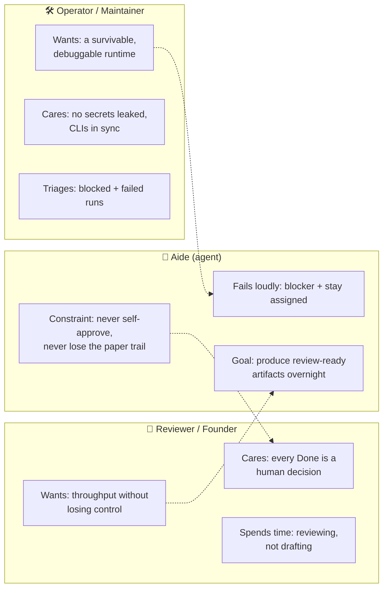
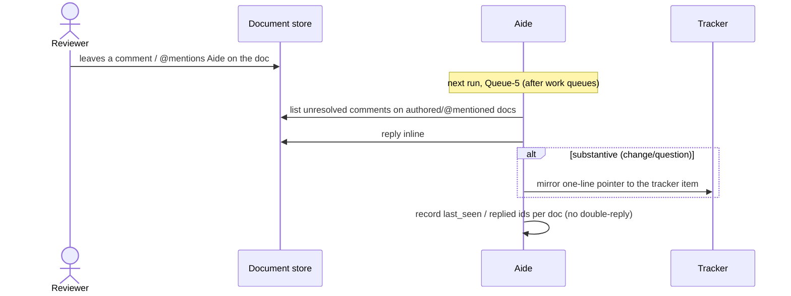
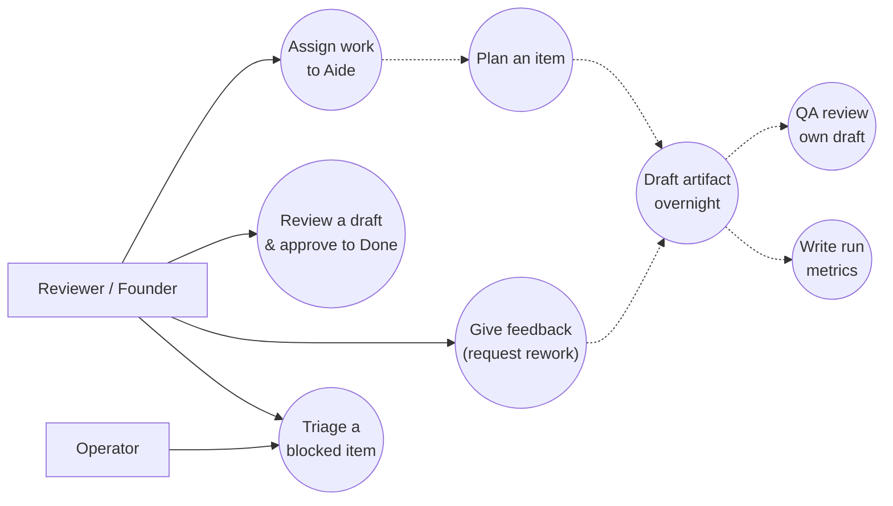
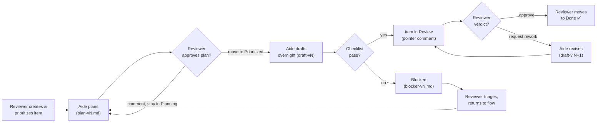
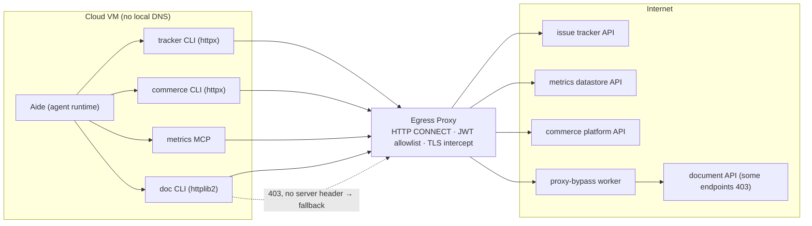
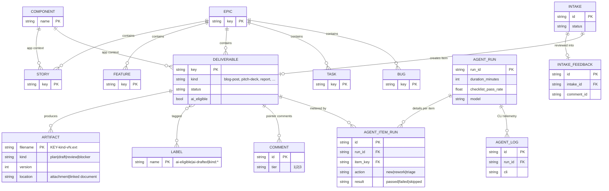
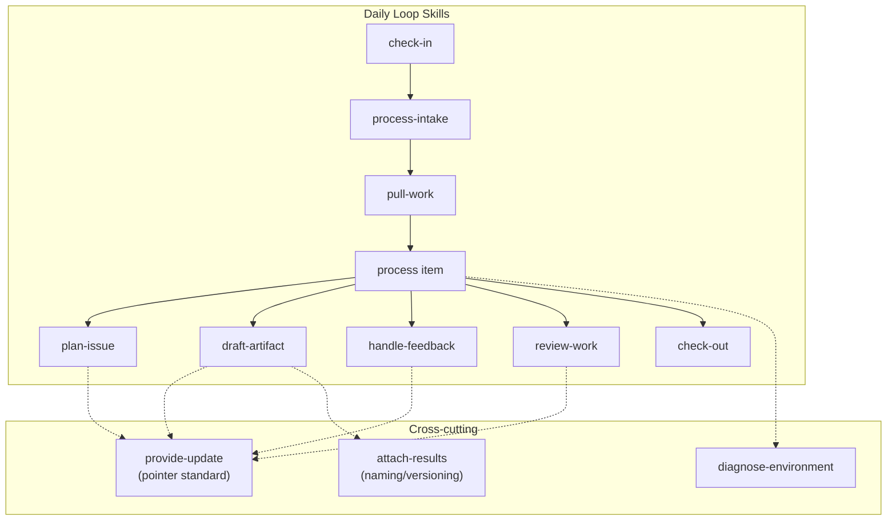

# High-Level Design: Aide: A Supervised Autonomous Delivery Agent

> _This is a generalized, public version of an internal design, retold as an **anonymized industry case study**: how a small commerce venture automated overnight delivery work without ceding control to the machine. Company-, vendor-, and commercial-specific details have been removed; the architecture, decision framework, data model, and guardrails are preserved._

<!-- truncate -->

:::note[Scope]
This design describes **Aide**, an autonomous agent that drafts review-ready delivery artifacts overnight on a kanban board and leaves every one for human approval. It is presented as a reusable reference: the pattern is *supervised autonomy*; the agent produces, a human decides.
:::

---

## Executive Summary

A small commerce venture needs delivery work on its kanban board (store analyses, outreach, sales enablement, content) to keep moving overnight; **without** a person at the keyboard and **without** handing the approval decision to a machine. Before this design, that work was drafted by hand at founder scale, so progress stalled whenever no one had time to draft the next artifact.

**Aide** is the solution: an autonomous agent, hosted on a nightly cloud schedule, that pulls eligible work items from an issue tracker and produces review-ready artifacts (plans, drafts, reviews, blockers): but **never moves work to Done**. A human always approves. Aide is *column-aware*: the board column an item sits in determines exactly what it produces, under a strict "**column-as-contract**" rule where each column has one deliverable type and work-item comments are one-line pointers to attachments.

The three most consequential decisions: **(D1)** draft-and-review with a hard human gate rather than autonomous completion; **(D2)** column-as-contract with all substance in versioned attachments / linked documents rather than verbose comments; **(D3)** a mandatory plan-first gate before any execution. Supporting decisions cover stay-assigned-on-blocked signalling, an egress-proxy-survivable integration layer (purpose-built CLIs + a proxy-bypass worker for document APIs), and a metrics spine for trust-building (graduated-autonomy readiness tracking).

**Expected value:** delivery throughput decoupled from a person's nightly availability, with a fully auditable paper trail and zero loss of human control: one person supervises many work items per night instead of drafting each by hand. The biggest open questions concern two *proposed-but-not-yet-built* loops (human handoff, document-comment handling) and validating the readiness thresholds against real runs.

---

## 1. Purpose & Context

### 1.1 Purpose

This document defines the design of **Aide**, an autonomous agent that performs first-draft delivery work on a kanban board overnight and leaves every artifact for human review. It specifies the operating model, the column-as-contract deliverable rules, the integration surface, and the guardrails that keep a human in control of every consequential decision.

### 1.2 Who Is Building This & Why

The builder is a small commerce venture (store analysis, outreach, sales enablement, and its own storefront). At founder scale, the bottleneck is human hours spent drafting routine artifacts, decks, reports, store analyses, not deciding *what* to build. Aide converts that drafting load into an overnight, supervised pipeline.

### 1.3 Context

Aide sits between a human-run kanban board and the external systems where work products live (a document store, the commerce platform, a metrics datastore). It is deployed as a **scheduled task on a cloud agent runtime**, behind an egress proxy. The high-level context:

```mermaid
graph TB
    subgraph EXEC["Execution Layer &#8212; cloud runtime (scheduled task)"]
        AGENT["Aide (agent runtime)"]
        PROMPT["Operating model<br/>tenets · queues · templates"]
        SETUP["setup script<br/>installs CLIs, env fixes, snapshots"]
    end

    subgraph SKILLS["Agent Skill Layer &#8212; daily loop"]
        SK_CI["check-in"]
        SK_INT["process-intake"]
        SK_PW["pull-work"]
        SK_PLAN["plan-issue"]
        SK_DRAFT["draft-artifact"]
        SK_FB["handle-feedback"]
        SK_REV["review-work"]
        SK_CO["check-out"]
    end

    subgraph TOOLS["Tool / Integration Layer"]
        TRACKER_CLI["tracker CLI"]
        DOC_CLI["doc CLI (+ proxy-bypass worker)"]
        COMMERCE_CLI["commerce CLI"]
        SUPAMCP["metrics MCP"]
        GIT["git (per-item branches)"]
    end

    subgraph EXT["External Systems"]
        JIRA["Issue tracker"]
        GDOCS["Document store"]
        SHOP["Commerce platform"]
        SUPA["Metrics datastore"]
        WEB["Public Web"]
    end

    subgraph HUMAN["Human Control Plane"]
        ADMIN["admin CLI"]
        SOPS["operating SOPs"]
    end

    AGENT --> PROMPT
    SETUP --> AGENT
    PROMPT --> SKILLS
    SKILLS --> TRACKER_CLI --> JIRA
    SKILLS --> DOC_CLI --> GDOCS
    SKILLS --> COMMERCE_CLI --> SHOP
    SKILLS --> SUPAMCP --> SUPA
    SK_DRAFT --> GIT
    SK_DRAFT --> WEB
    ADMIN --> JIRA
    SOPS -.-> ADMIN

```

### 1.4 Key Decisions Summary

| ID | Decision | Status |
|----|----------|--------|
| D1 | Draft-and-review with a hard human approval gate (agent never marks Done) | Decided |
| D2 | Column-as-contract; one deliverable per column, substance in attachments, comments are pointers | Decided |
| D3 | Mandatory plan-first gate before execution (no self-heal) | Decided |
| D4 | Stay-assigned-on-blocked as the block signal (no separate label) | Decided |
| D5 | Eligibility via assignment **or** an `ai-eligible` label (assignment preferred) | Decided |
| D6 | Proxy-survivable integration: purpose-built CLIs + proxy-bypass worker for document APIs | Decided |
| D7 | Metrics spine with server-secret-gated writes; graduated-autonomy readiness tracking | Decided |
| D8 | Tool profile by work-item **type**, widened by `needs-*` labels | Decided |
| D9 | Human handoff / resume loop (flag field + `blocked-on-human` labels, priority-0 resume) | Proposed (designed, not yet built) |
| D10 | Document-comment loop (poll + reply inline + selective mirror to the tracker) | Proposed (designed, not yet built) |

### 1.5 Challenges / Pain Points

Sorted by impact, framed by who feels them.

**Delivery throughput**
- **The founder spends nightly hours drafting routine artifacts** (decks, reports, store analyses) instead of deciding strategy: and when they don't, the board stalls.
- **Review is the scarce resource, not drafting**: a system that drafts cheaply but lets a human approve quickly multiplies the founder's reach.

**Trust & auditability**
- **An autonomous agent that could mark work "done" is unacceptable**: the team needs a guarantee the machine never closes the loop on itself.
- **Verbose agent comments make a work item impossible to follow**: a reviewer cannot reconstruct context from a wall of agent chatter.
- **Without a paper trail, agent work isn't trustable**: every artifact must be reproducible and discoverable from the item alone.

**Operability**
- **The cloud runtime is hostile**: an egress proxy with TLS interception and no local DNS breaks naive HTTP clients; some document APIs are silently blocked.
- **No visibility into whether the agent is "ready"**: the team needs metrics to decide when to trust it with more.

### 1.6 Motivation

Decouple delivery progress from one person's nightly availability, while keeping that person the sole approver; turning "I have to draft this myself" into "I review what Aide drafted."

---

## 2. System Users & Personas

| Actor | Role | Interaction with the System | Primary Surface |
|---|---|---|---|
| **Founder / Reviewer** | Primary human: assigns work, reviews drafts, approves to Done | Direct | Kanban board, admin CLI, daily-review SOP |
| **Aide** | The autonomous agent: drafts, plans, reviews, blocks | System (primary actor) | Tracker, document store, commerce platform, metrics datastore |
| **Operator / Maintainer** | Edits skills, operating model, deploys, triages failures | Indirect (builds/maintains) | Repo, setup script, simulation harness, scheduled-task config |
| **Issue tracker** | System of record for work + paper trail | System-to-system | REST API via the tracker CLI |
| **Document store** | Store for doc-like artifacts + workspace archives | System-to-system | Document API via the doc CLI / proxy-bypass worker |
| **Commerce platform** | Source of store/product data for analyses | System-to-system (read-mostly) | GraphQL via the commerce CLI |
| **Metrics datastore** | Metrics + intake data | System-to-system | MCP / REST |
| **Proxy-bypass worker** | Serverless fallback for blocked document APIs | System-to-system | REST, invoked by the doc CLI |

Canonical terminology: the primary human is the **Reviewer** (also "founder"); the agent is **Aide**; the person who maintains the agent's code/skills is the **Operator**. These names are used consistently throughout.

**Required diagram: user-profiling (personas + motivations):**

---

## 3. Objectives

### 3.1 Business Goals
- Increase delivery throughput on the board without adding headcount.
- Let one person supervise many work items per night instead of authoring each by hand; the role shifts from *author* to *supervisor*.
- Build enough trust in the agent (via metrics) to widen its remit over time.

### 3.2 Technical Goals
- Run reliably as an unattended nightly scheduled task behind the cloud egress proxy.
- Produce **reproducible, auditable** artifacts discoverable from the work item alone.
- Keep work-item timelines clean (pointer comments only; status chatter isolated to a daily subtask).
- Survive proxy TLS interception, the blocked document APIs, and absent local DNS with zero per-run human intervention.

### 3.3 Success Criteria

These define **graduated-autonomy readiness**: the bar the agent must clear before its remit is widened. The thresholds below are **illustrative targets pending validation against real runs** (the metrics spine in D7 measures each one):

| Readiness dimension | Illustrative target | Why it matters |
|---|---|---|
| Clean runs | ≥ 5 consecutive runs with no failed items | Stability; the agent doesn't break unattended |
| First-pass approval | ≥ 60% of items approved without rework | The agent's drafts are usable, not just complete |
| Rework depth | ≤ 2 average rework cycles per item | Feedback converges quickly |
| Checklist pass rate | ≥ 90% of per-kind checks pass | Quality is consistent across kinds |
| Coverage | ≥ 3 distinct deliverable kinds exercised | Breadth, not a single happy path |

*These are starting points; the team should calibrate them once enough runs exist to set evidence-based bars. Until then, treat the dashboard as observational, not a gate.*

### 3.4 Non-Goals
- **Not** autonomous completion: Aide never moves an item to Done (D1).
- **Not** a human-replacement: the Reviewer remains the sole approver (amplify, not replace).
- **Not** editing peers' content: Aide only touches its own comments/attachments.
- **Not** a general tracker-admin bot: scope is the delivery loop on one board.
- Objective-impact note: D1 and D2 gate every business/technical goal; throughput is pursued *only* within the human-approval and paper-trail constraints.

---

## 4. Scope

### 4.1 In Scope
- The nightly daily loop: check-in → intake → pull-work → process → check-out.
- Column-aware production of `plan`, `draft`, `review`, and `blocker` artifacts.
- Integration with the issue tracker, document store, commerce platform (read-mostly), and metrics datastore.
- The proxy-survivable runtime + local simulation harness.
- A human control plane (admin CLI) and operating SOPs.

### 4.2 Out of Scope
- Moving items to **Done** (human-only).
- Authoring the CLIs themselves; they are synced from a shared CLI repo (this design *consumes* them).
- The storefront product itself (Aide analyzes/serves it; it doesn't build it).
- Multi-project / multi-tenant operation; single board. **[Assumption.]**

### 4.3 System Boundaries
Aide **owns** its skills, operating model, daily subtask, and the artifacts it produces. It **assumes** the existence of: the tracker project + workflow, the purpose-built CLIs, the metrics schema + write-secret RPCs, the proxy-bypass worker, and the cloud scheduled-task runtime. The boundary with humans is sharp: humans own item creation, prioritization (moving to Prioritized = plan approval), feedback, and every Done.

---

## 5. Current State (As-Is)

This section describes the world **before Aide existed**: not the agent itself (the agent is the proposed design).

- Delivery artifacts on the board were produced **manually** by the founding team. Drafting a deck, report, or store analysis was a person-hours task, so the board advanced only when someone had time.
- Work items accumulated context as **free-form comments** and ad-hoc attachments, with no enforced contract for "what a column means": making it hard to reconstruct the state of a piece of work at a glance.
- There was **no overnight progress**: work paused outside working hours.
- There was **no structured metric** for delivery throughput, rework, or quality.
- Any earlier attempt to automate would have hit the **cloud proxy environment** unprepared (TLS interception, blocked document APIs, no DNS): a class of failures the current design exists to neutralize.

---

## 6. Problem Statement & Gaps

### 6.1 Problem Statement
The venture needs routine delivery artifacts drafted continuously and overnight, with a complete audit trail and **zero** transfer of approval authority to the machine: on a cloud runtime that actively breaks naive automation.

### 6.2 Gap Analysis
| Gap (pre-Aide) | Consequence | Addressed by |
|---|---|---|
| No unattended drafting | Board stalls outside working hours | Nightly scheduled loop (§7) |
| No "column means X" contract | Items unreadable; reviewers lost | Column-as-contract D2 (§7.5) |
| Risk of agent self-approval | Loss of human control | Human gate D1; never-Done rule |
| Verbose agent output | Unreviewable item timelines | Pointer-comment standard; daily-subtask isolation |
| Hostile runtime | Automation fails on proxy/doc-API/DNS | Proxy-survivable CLIs + worker fallback D6 (§11.1) |
| No trust signal | Can't decide when to widen remit | Metrics + readiness D7 |

### 6.3 Impact Assessment
Closing these gaps shifts the Reviewer from *author* to *supervisor*, makes every artifact reproducible and auditable, and produces the metrics needed to expand the agent's autonomy deliberately rather than blindly.

---

## 7. Proposed Design

### 7.1 Target State Overview
Aide is a **column-aware autonomous agent** running a fixed nightly loop. Behavior is fully determined by the board column an item sits in; it produces exactly one deliverable type per column and announces it with a single pointer comment, keeping all substance in versioned attachments or linked documents. A human owns every transition into Done.

### 7.2 Architecture Options
<Assumption>** options reconstructed from the decision the implementation evidences.**</Assumption>

- **Option A: Autonomous completion.** Agent works items end-to-end, including closing them. *Rejected:* unacceptable loss of human control; no trust runway.
- **Option B: Verbose in-comment working.** Agent posts plans/drafts/reviews as tracker comments. *Rejected:* makes items unreadable; no reproducible artifact; poor audit trail.
- **Option C (chosen): Column-as-contract draft-and-review.** Agent drafts review-ready artifacts per column, substance in attachments, one-line pointer comments, hard human gate at Done. *Chosen:* maximizes throughput while preserving control and auditability.

### 7.3 Comparison Matrix
| Dimension | A: Autonomous | B: In-comment | C: Column-as-contract (chosen) |
|---|---|---|---|
| Human control | Low | Medium | **High** |
| Auditability | Medium | Low | **High** |
| Item readability | Medium | Low | **High** |
| Throughput | High | Medium | **High** |
| Trust runway | None | Weak | **Strong (metrics-gated)** |

### 7.4 Recommendation
**Option C.** Phasing: ship the core loop + column contract first (D1 to D5), then the proxy-survivability layer (D6) and metrics spine (D7), then the proposed human-handoff and document-comment loops (D9, D10) once the core is trusted.

### 7.5 Key Design Decisions

**D1: Approval authority.** *Question:* may the agent complete (close) work? *Options:* autonomous-complete / draft-and-review. *Decided:* **draft-and-review**; Aide can transition `Prioritized→In Progress→Review` and to `Blocked`/`Planning`, but **never to Done**. *Rationale:* trust boundary; the machine produces, the human approves.

**D2: Column-as-contract.** *Question:* where does work product live? *Options:* verbose comments / one-deliverable-per-column attachments. *Decided:* **each column has exactly one deliverable type** produced as an attachment or linked document; work-item comments are one-line pointers; status chatter goes on the daily subtask. *Rationale:* readable timelines, reproducible artifacts, clean audit.

**D3: Plan-first gate.** *Question:* if an item reaches execution with no plan, self-heal or refuse? *Options:* draft a plan on the fly / return to Planning. *Decided:* **return to Planning, no self-heal.** "In Progress" *means* an approved plan exists. *Rationale:* keeps the contract sharp; breakage is surfaced, not papered over.

**D4: Blocked signalling.** *Question:* how to signal a blocked item? *Options:* unassign + comment / stay-assigned + Blocked status. *Decided:* **stay assigned; assignee + Blocked is the signal** (no separate label). *Rationale:* keeps "my in-flight work" queryable and visible on the board.

**D5: Eligibility.** *Question:* how does Aide know what to pick up? *Options:* label-only / assignment-only / both. *Decided:* **assignment `OR` `ai-eligible` label, assignment preferred.** *Rationale:* assignment is the cleaner long-term signal; the label remains for bulk/legacy flows.

**D6: Proxy survivability.** *Question:* how to reach external APIs through a TLS-intercepting, DNS-less proxy that blocks some document APIs? *Options:* per-call workarounds / purpose-built CLIs + transparent fallback. *Decided:* **purpose-built CLIs hardened for the proxy + the doc CLI auto-fallback to a proxy-bypass worker** on document-API 403. *Rationale:* no per-run human intervention; the failure mode is engineered out.

**D7: Metrics & trust.** *Question:* how to know when to trust the agent with more? *Options:* gut feel / metrics spine. *Decided:* **a metrics datastore with run + item + log tables, server-secret-gated writes, graduated-autonomy readiness scoring.** *Rationale:* deliberate autonomy expansion on evidence.

**D8: Guardrails by type.** *Question:* should tool access depend on the work? *Options:* unrestricted / type-based with label overrides. *Decided:* **item type sets the default tool profile; `needs-*` labels widen it.** *Rationale:* a doc-deliverable shouldn't reach for code tools by default; labels add flexibility without removing safety.

**D9: Human handoff & resume loop.** *Status:* **Proposed (not yet implemented).** *Question:* how does Aide pause for a human *decision* mid-task and resume exactly where it left off, without that pause looking like a failure?

*Options:*

| Option | Description | Trade-off |
|---|---|---|
| Reuse Blocked | Treat "need a decision" the same as "I failed" | Pollutes the blocker metric; human can't tell "stuck" from "waiting on me" |
| Unassign + comment | Drop the assignee and leave a question | "My in-flight work" stops being queryable; the item looks unstarted on the board |
| **Flag + handoff labels (chosen)** | A tracker **flag** field + `blocked-on-human` label mark a *resumable pause*, distinct from Blocked; the item stays assigned | One more state to model; but it's the state that makes pause/resume legible |

*Decided mechanism:* When Aide needs human input to continue (an ambiguity a checklist can't resolve, a missing decision), it sets the tracker **flag** field + `blocked-on-human` label, posts a **Tier-3 information-request** pointer with concrete questions, and **stays assigned**: it does *not* transition to Blocked (Blocked stays reserved for "I couldn't," keeping that metric honest). The human answers and swaps `blocked-on-human` → `was-blocked-on-human` (clearing the flag). On the next run a new **priority-0 "Unblocked" queue**: ahead of Review; picks up `was-blocked-on-human` items first, Aide reads the answer, clears the label, and resumes from the paused step.

```mermaid
sequenceDiagram
    participant W as Aide
    participant J as Tracker
    actor H as Reviewer
    W->>J: hits a decision it can't make
    W->>J: set flag + blocked-on-human, Tier-3 question, STAY assigned
    Note over W,J: not Blocked &#8212; this is "waiting on you", not "failed"
    H->>J: answers, swap blocked-on-human → was-blocked-on-human
    Note over W,J: next run
    W->>J: priority-0 Unblocked queue (before Review)
    W->>J: read answer, clear was-blocked-on-human, resume paused step
```

*Rationale:* separating *"I need a decision"* from *"I'm stuck"* keeps the blocker metric meaningful and gives the Reviewer a fast lane to keep work flowing. (This builds on D4: the item is always assigned; D9 adds the resumable *reason* for the pause.)

**D10: Document-comment loop.** *Status:* **Proposed (not yet implemented).** *Question:* reviewers naturally leave feedback *inside* a linked document, not on the tracker item; how does Aide see and act on those comments without the tracker ceasing to be the system of record?

*Options:*

| Option | Description | Trade-off |
|---|---|---|
| Ignore doc comments | Only read tracker comments | Misses where reviewers actually comment; feedback is invisible to the agent |
| Mirror everything both ways | Two-way sync of every comment | Noisy, loops, and two systems both claiming to be the record |
| **Poll + reply + selective mirror (chosen)** | Read doc comments, reply inline, mirror only *substantive* ones to the tracker as a pointer | One-directional record (tracker wins); a little polling cost |

*Decided mechanism:* Once per run (a Queue-5 step after the work queues), Aide lists comments on documents it authored or where it's @mentioned, filters to **unresolved** ones it hasn't handled, and for each: replies **inline on the document**, and if the comment is substantive (requests a change, raises a question) **mirrors a one-line pointer to the tracker item** so the tracker remains the single source of record. Per-document state (`last_seen_comment_id`, `replied_comment_ids`) is tracked in a small state file so it never double-replies across runs.

*Rationale:* meets reviewers where they already comment while keeping the tracker authoritative; the per-doc state file makes the poll idempotent across nightly runs.

---

## 8. Key Components & Data Model

### 8.1 Components
| Component | Responsibility | Interface | Data it owns |
|---|---|---|---|
| **check-in** | Create/find daily subtask, pre-flight probes | tracker CLI | Daily subtask, check-in comment |
| **process-intake** | Review inbound intakes, write feedback | metrics REST, tracker CLI | intake-feedback rows |
| **pull-work** | Build the prioritized work queue from 4 queries | tracker CLI | Work queue (in-memory) |
| **plan-issue** | Draft `plan-vN.md` in Planning | tracker CLI | Plan artifacts |
| **draft-artifact** | Route by `kind:*`, produce `draft-vN`, validate, transition to Review | tracker CLI, doc CLI, git | Draft artifacts, branches |
| **handle-feedback** | Produce `draft-v(N+1)` from feedback, or block | tracker CLI, doc CLI | Revised drafts, blockers |
| **review-work** | QA against checklist, attach `review-vN.md` | tracker CLI | Review artifacts |
| **check-out** | Summary comment + metrics + workspace archive | tracker CLI, metrics MCP, doc CLI | Run + item metrics, archive |
| **provide-update** | Enforce the pointer-comment standard (self-review) | tracker CLI | (corrects comments) |
| **diagnose-environment** | Time-boxed SSL/proxy/auth debugging | shell | (observations) |

### 8.2 Data Model
See the ERD in §11.3. Three clusters: the **work model** (Epic/Story/Feature/Deliverable/Task/Bug + Component + Labels), the **artifacts** (`plan|draft|review|blocker`, monotonic `vN`, attachment or linked document), and the **metrics** (`run` 1:N `item-run`, plus `log`; intake 1:0..1 intake-feedback).

### 8.3 Data Flows
- **Work in:** human creates/prioritizes a work item → Aide reads it via the tracker CLI.
- **Artifact out:** Aide writes a file or a linked document → attaches/links it → posts a pointer comment.
- **Metrics out:** check-out calls secret-gated RPCs → run + item metrics.
- **Intake in:** an intake tool → metrics datastore + an `intake`-labeled work item → Aide reviews → intake-feedback + tracker comment/transition.

---

## 9. Use Cases

Use cases tie back to the personas in §2.

**Required diagram: use-case:**

**Actor → goal → flow:**

- **Reviewer: assign work.** Goal: queue an item for Aide. Flow: create/prioritize a work item → assign to Aide (or add `ai-eligible`) → ensure a `kind:*` label and acceptance criteria → Aide picks it up next run. *Alt:* move an existing plan to Prioritized = approve the plan.
- **Aide: draft artifact overnight.** Goal: produce a review-ready draft. Flow: plan-first gate → route by `kind:*` → research → produce `draft-vN` → validate checklist → attach/link → pointer → `+ai-drafted` → transition to Review. *Exception:* checklist fails after retries / oversize → `blocker-vN.md` + Blocked.
- **Reviewer: review & approve.** Goal: accept or reject. Flow: read pointer → open artifact → approve (move to Done) **or** request rework (move to In Progress + feedback). *Only the human moves to Done.*
- **Reviewer/Operator: triage blocked.** Goal: unblock. Flow: read `blocker-vN.md` → resolve underlying cause → return to Planning/Prioritized. *(D9 would automate the resume.)*

---

## 10. Customer Journey

The Reviewer's end-to-end path through one work item, including the approve/reject loop.

**Required diagram: journey flow:**

The loop has exactly two exits the Reviewer controls: **Done** (approve) and **rework** (back to Aide). Aide never self-exits the loop.

---

## 11. Architecture Diagrams

### 11.1 Context Diagram
See §1.3 for the layered context. The integration/proxy view:

### 11.2 Sequence Diagram
The full nightly loop:

```mermaid
sequenceDiagram
    actor Sched as Scheduled Task
    participant W as Aide
    participant J as Tracker (CLI)
    participant S as Metrics (MCP)
    participant G as Document store (CLI)

    Note over Sched, G: Phase 1 &#8212; Check-In
    Sched->>W: nightly trigger
    W->>J: find/create daily subtask under check-in epic
    W->>J: pre-flight connectivity probes
    W->>J: post Check-In comment

    Note over Sched, G: Phase 2 &#8212; Pull Work
    W->>J: Queue 1 Review, Queue 2 Rework, Queue 3 Planning, Queue 4 Prioritized
    W->>W: build work queue in priority order

    Note over Sched, G: Phase 3 &#8212; Process each item
    loop per item
        W->>J: Step 0 self-review own comments
        alt source = Review
            W->>J: attach review-vN.md, pointer (no transition)
        else source = Rework
            W->>G: draft-v(N+1), re-check, transition Review
        else source = Planning
            W->>J: plan-vN.md, stay in Planning
        else source = New work
            W->>J: plan-first gate
            alt no plan
                W->>J: return to Planning
            else plan exists
                W->>G: route by kind, draft-vN
                alt checklist pass
                    W->>J: attach, ai-drafted, transition Review
                else fail
                    W->>J: blocker-vN.md, transition Blocked
                end
            end
        end
    end

    Note over Sched, G: Phase 4 &#8212; Check-Out
    W->>J: Check-Out comment on subtask
    W->>S: insert run + item metrics
    W->>G: upload workspace archive
```

### 11.3 Entity Relationship Diagram

*Sub-task* is modelled as a field (`hierarchy_level = -1` + parent ref), not a self-referential line, per ERD conventions.

### 11.4 System/Component Diagram

---

## 12. Non-Functional Requirements & Constraints

NFRs are stated as measurable targets. The numbers below are **illustrative starting targets** (this is a generalized case study): the team should calibrate them against real runs, the same way the §3.3 readiness bars are calibrated.

### 12.1 Performance
- **Run budget:** a nightly run completes within **≤ 2 h** wall-clock; the agent self-limits via check-out so it never overruns the scheduled-task window (illustrative).
- **Throughput:** processes **one item at a time**: correctness over parallelism is a deliberate choice, not a limit to optimize away.
- **Liveness:** every run ends with a check-out + metrics write, even on partial completion, so a stalled run is detectable the next morning.

### 12.2 Security
- **No secrets in code, comments, attachments, or commit messages**: env vars only; a secret-scan gate runs on every commit.
- Metrics writes are **server-secret-gated**: even a privileged datastore key can't insert directly without the agent write secret.
- Never disable SSL verification; never modify the proxy bypass list.
- Aide modifies only its own comments/attachments.

### 12.3 Scalability
- Single board; the scaling dimension is *items per night*, bounded by the run budget (§12.1). Growth beyond one board's nightly volume is handled by tightening the run budget or splitting queues, not by parallelising a single run.
- Linked documents are never mutated; each version is a new document (audit-friendly; unbounded document count is accepted as the cost of an immutable history).
- **Retention:** workspace archives and metrics are retained **≥ 90 days** for audit/triage (illustrative target).

### 12.4 User Experience
- **Reviewer:** a clean board where each column means one thing; one pointer comment per transition; substance one click away in the attachment; a morning daily-review SOP (5 to 15 min).
- **Operator:** reproducible runtime, env snapshots, a local proxy simulation, and a time-boxed (2-minute) debugging rule.

### 12.5 Compliance & Constraints
- Cloud egress proxy: HTTP CONNECT, JWT allowlist, TLS interception, no local DNS, selective document-API block.
- Tracker attachment size limit (e.g. 10 MB) → oversize routes to the blocker path.
- Tracker comments/descriptions are markdown (converted to the tracker's rich-text format); no legacy wiki markup.
- CLIs are synced (not edited) from the shared CLI repo; a pre-push hook blocks stale syncs.

---

## 13. Phases

Delivery phasing and ownership. Phase ordering follows module maturity: the core loop (P1) and survivable runtime (P2) are built; the trust spine (P3) is partly built; the two handoff loops (P4/P5) are designed but not yet built (§7.5 D9 to D10).

| Phase | Ships | Status (observed) |
|---|---|---|
| **P1: Core loop** | check-in → pull-work → plan/draft/review → check-out; column-as-contract; D1 to D5, D8 | Built |
| **P2: Survivable runtime** | proxy-hardened CLIs, worker fallback, simulation harness; D6 | Built |
| **P3: Trust spine** | metrics datastore, readiness dashboard; D7 | Metrics built; dashboard design-stage |
| **P4: Human handoff** | flag field + `blocked-on-human`/`was-blocked-on-human`, priority-0 Unblocked queue resume; D9 | Proposed (designed §7.5 D9) |
| **P5: Doc-comment loop** | Queue-5 poll/reply-inline/selective-mirror with per-doc state; D10 | Proposed (designed §7.5 D10) |

### RACI

The ownership split below is the **sensible default** for this design (four roles from §2). It's the recommended assignment for a founder-scale team; a larger org may split the Operator column further.

| Activity | Reviewer/Founder | Operator/Maintainer | Aide | Cloud Platform |
|---|---|---|---|---|
| Create & prioritize work | **A/R** | C | I |: |
| Plan an item | A | C | **R** |: |
| Draft / review artifact | A | C | **R** |: |
| Approve to Done | **A/R** | I |: |; |
| Maintain skills / operating model | C | **A/R** | I |: |
| Deploy & schedule the agent | I | **A/R** |: | C |
| Triage blocked / failed runs | C | **A/R** | I |: |
| Provide runtime (proxy, VM) | I | C |; | **A/R** |

R = Responsible, A = Accountable, C = Consulted, I = Informed.

---

## 14. Risks, Dependencies & Open Questions

### 14.1 Risks
| Risk | Likelihood | Impact | Mitigation |
|---|---|---|---|
| Proxy changes re-break document APIs or other domains | Medium | High | Worker fallback; simulation pre-push gate; allowlist runbook |
| Agent produces plausible-but-wrong artifacts | Medium | Medium | Per-kind checklists; human review gate; review-work QA pass |
| Metrics drift / first-pass-approval proxy is inaccurate | Medium | Low | <Assumption>** add a real `human_approved` flag later (D7 limitation)**</Assumption> |
| CLIs drift from the shared CLI repo | Low | Medium | Sync-commit marker + pre-push sync check |
| Secret leakage | Low | High | Secret-scan gate; env-only credentials; sanitized comments |

### 14.2 Dependencies
- The shared CLI repo (CLI source of truth).
- The proxy-bypass worker for document access under the proxy.
- The metrics schema + secret-gated RPCs.
- The cloud scheduled-task runtime + egress proxy.

### 14.3 Open Questions
- **[Assumption-driven]** What is the real target throughput / run budget?
- Are the readiness thresholds (§3.3) validated against real runs yet?
- D9 (human handoff) and D10 (document-comment loop); build now or defer?
- Is the per-run model fixed or allowed to vary (the recorded `model` metric suggests it's recorded, not pinned)?

### 14.4 FAQ

**Key Design Questions → Where Answered**

| Key question | Decision | Section |
|---|---|---|
| Can the agent ever close work itself? | D1: no, human-only Done | [§7.5 D1](#75-key-design-decisions) |
| Where does the actual work product live? | D2: attachments / linked documents, not comments | [§7.5 D2](#75-key-design-decisions) |
| What happens if an item hits execution with no plan? | D3: back to Planning, no self-heal | [§7.5 D3](#75-key-design-decisions) |
| How is a blocked item signalled? | D4: stay assigned + Blocked status | [§7.5 D4](#75-key-design-decisions) |
| How does Aide reach document APIs under the proxy? | D6: doc CLI → worker fallback | [§11.1 Context](#111-context-diagram) |
| How do we know when to trust Aide more? | D7: metrics + readiness | [§7.5 D7](#75-key-design-decisions) |
| How does Aide pause for a human decision and resume? | D9: flag + handoff labels, priority-0 resume | [§7.5 D9](#75-key-design-decisions) |
| How does Aide see comments left inside a document? | D10: poll + reply inline + selective mirror | [§7.5 D10](#75-key-design-decisions) |
| Why doesn't the agent fix the plan itself? | D3 rationale; keeps the contract sharp | [§7.5 D3](#75-key-design-decisions) |
| Why is a paused handoff not the same as Blocked? | D9 rationale; "waiting on you" vs "I failed" | [§7.5 D9](#75-key-design-decisions) |

**Rationale Q&A**
- *Why one-line pointer comments?* Verbose comments make an item impossible to review; the attachment is the durable, reproducible artifact (D2).
- *Why never auto-Done?* The whole trust model rests on the human being the only one who closes the loop (D1).
- *Why stay assigned on Blocked?* So "my in-flight work" stays queryable and visible on the board (D4).

---

## Appendices

**Appendix A: Provenance.** This is a generalized, public case study derived from an internal design. The agent name, company, project identifiers, and vendor-specific infrastructure have been replaced with generic categories; the architecture, decision framework (D1 to D10), data model, and guardrails are preserved unchanged. Sections marked <Assumption>...</Assumption> are inferred and pending confirmation.

---

## 15. Revision Log

| Date | Author | Section | Change |
|------|--------|---------|--------|
| 2026-06-22 | Engineering | All | Public generalization of an internal supervised-autonomous-delivery-agent design. Retold as an anonymized industry case study (moderate depth). Names, company, project keys, and vendor infrastructure generalized; architecture, decisions, data model, and NFRs preserved. |
| 2026-06-22 | Engineering | §3, §5, §7.5, §12, §13 | Advance pass (co-design): confirmed Current State (manual founder drafting) and cleared duplicate assumption markers; reframed success criteria as a graduated-autonomy readiness table of illustrative targets; firmed D9 (human handoff & resume) and D10 (document-comment loop) into full proposed designs with options tables, mechanisms, and sequence diagrams (propagated to §1.4, §13 P4/P5, §14.4 FAQ); set measurable illustrative NFR targets and a sensible-default RACI. Status → In Review. |
