# High-Level Design: Markdown Review Studio

> A local-first web tool to **view, edit, and visually comment** on markdown documents, track the **history of iterations and comment threads** per doc, and drive **Claude Code** to act on comments: turning review feedback into document edits.

<!-- truncate -->

---

## Executive Summary

Reviewing long markdown documents (such as architecture HLDs) with an AI assistant is slower and lossier than it should be: feedback is unanchored prose typed into a chat window, review state lives only in someone's head or chat scrollback, and the link between a piece of feedback and the edit it produced is never recorded. Every review round, the author has to re-describe *where* in the document a comment applies and *what* should change (§1.6, §5.1).

**Markdown Review Studio** proposes a local-first web application that closes this loop: a reviewer opens a markdown file in the browser, leaves **visually anchored comments** (on a text range, a block, a margin point, or the whole document), and triggers **Claude Code** (Anthropic's command-line coding assistant) to read all open comments and edit the document directly. Each round is committed to **git**, so the history of iterations: what changed, and which comments drove it; is preserved and browsable (§6.1).

The most consequential decisions, all **Decided**: comments are anchored by **inline HTML-comment markers written into the file**, with fuzzy matching as a recovery fallback (D1, the core technical bet); Claude is driven via the **Claude Code command-line interface (CLI) in headless mode** rather than the raw API, reusing the author's existing setup (D2); and edits **auto-apply and commit**, made safe by **validation hooks** that gate every commit (D5, D9). See the decisions summary in [§1.5 Key Decisions Summary](#15-key-decisions-summary).

**Expected value:** a low-friction, repeatable review loop with durable, traceable, directly-actionable feedback: reusable across any markdown repository, not just this one (§1.7). Time savings are an *[Assumption]* pending dogfooding.

**Current status: In Review.** The single-user local mode is Phase 1; a hosted multi-user cloud mode is Phase 3. The biggest open questions concern comment-commit strategy, non-git target folders, and cloud pricing/secrets infrastructure: see [§10.3 Open Questions](#103-open-questions).

---

## 1. Purpose & Context

### 1.1 Purpose

This document defines the high-level design for **Markdown Review Studio**: a local-first web application that turns markdown document review into a tight, repeatable loop:

> **view → comment visually → Claude acts → iterate**, with a durable history of every iteration and comment thread per document.

The tool lets a reviewer open a markdown file in the browser, leave **visually anchored comments** (on a text range, a block, a margin point, or the whole doc), and then trigger **Claude Code** to read the open comments and edit the document accordingly. Every edit round is committed to **git**, so the history of iterations: what changed, driven by which comments; is preserved and browsable.

### 1.2 Who Is Building This & Why

Omar authors **co-design HLDs** and other architecture documents in this repository using the `/co-design` skill (Claude Code). These documents are long, iterative, and reviewed repeatedly; both by the author and, increasingly, by teammates and stakeholders.

Today, feedback on these docs is **verbal, ad-hoc, or buried in chat scrollback**. To get Claude to act on feedback, the author must re-describe *which part* of the doc a comment refers to and *what* should change; re-establishing context every round. There is no persistent, anchored record of what was raised versus resolved.

This tool externalizes review into **anchored, persistent, actionable comments** that Claude Code can pick up and execute directly: closing the loop between "here's my feedback" and "the doc is updated."

### 1.3 Context

Markdown Review Studio sits between three things that already exist on the author's machine:

1. **Markdown files on disk**: git-tracked documents (e.g., the `architecture/co-designs/*.md` in this repo, but the tool is repo-agnostic).
2. **The reviewer**, working in a browser.
3. **Claude Code CLI**: already installed and used by the author, invoked headlessly by the server to act on comments.

The tool is built as a **standalone, reusable** application: you point it at any folder of markdown files, not just this repo.

<div className="mermaid-animated flow-dot">

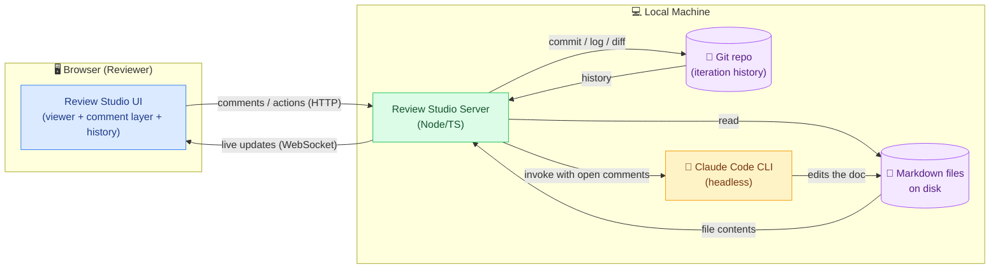

</div>

### 1.4 System Users & Personas

| Actor | Role | Interaction with the System | Primary Surface |
|-------|------|-----------------------------|-----------------|
| **Reviewer** (primary, e.g. Omar) | Opens docs, leaves anchored comments, triggers Claude, browses history | Direct (primary user) | Web UI |
| **Claude Code** | Reads open comments, edits the document, replies to / resolves comment threads, commits | System-to-system (invoked by server) | CLI (headless), driven by the server |
| **Git** | Stores the durable history of doc iterations and committed comment state | System (read/write) | Local repository |
| **Author** (often the same person as Reviewer) | Writes and edits the markdown directly in the editor | Direct | Web UI (editor mode) |
| **Teammate / Stakeholder** | Reviews and comments asynchronously _(future / secondary)_ | Direct (secondary) | Web UI |

**User-profiling diagram**: each persona with what drives them:

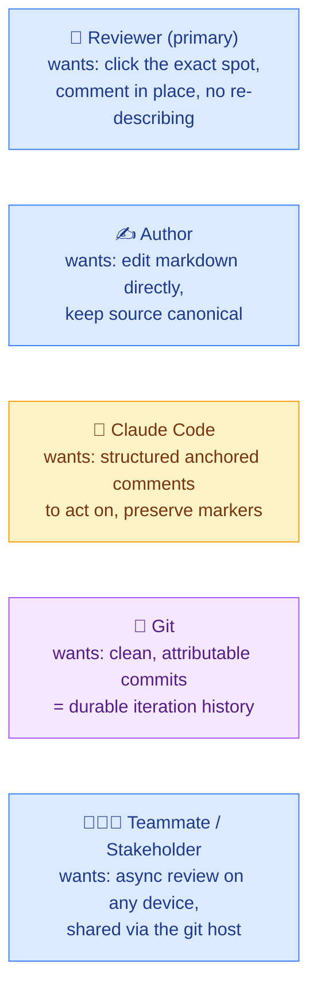

**[Assumption: In the initial version, Reviewer and Author are the same person (Omar) on a single machine. Multi-user / concurrent review is a secondary, later concern: flagged as a key decision in §6.5.]**

### 1.5 Key Decisions Summary

These decisions are developed in detail in §6.5. Listed here for an at-a-glance overview.

| ID | Decision | Status |
|----|----------|--------|
| D1 | **Comment anchoring strategy**: how comments stay attached to the right place as the doc changes | **Decided**: inline HTML-comment markers, fuzzy fallback |
| D2 | **Claude invocation mechanism**: Claude Code CLI headless vs Agent SDK | **Decided**: Claude Code CLI headless |
| D3 | **History model**: git-backed iteration history | **Decided**: git-backed |
| D4 | **Comment storage**: inline anchors vs sidecar vs hybrid | **Decided**: hybrid (inline markers + sidecar threads) |
| D5 | **Edit apply model**: auto-apply + git commit vs diff/accept-reject | **Decided**: auto-apply + commit (gated by D9 hooks) |
| D6 | **Claude processing granularity**: batch all open comments vs per-comment | **Decided**: batch (per-comment in Phase 2) |
| D7 | **Multi-user / concurrency**: single-user local vs shared | **Decided**: dual-mode (local single-user, cloud async multi-user) |
| D8 | **Security model for Claude**: what the headless agent can touch | **Decided**: scoped allow-list + working dir |
| D9 | **Edit-validation hooks**: pre/validate/post guards around every edit | **Decided**: pluggable hook suite (pass/warn/block) |
| D10 | **Deployment topology**: where server + Claude run | **Decided**: dual-mode: local agent + cloud per-user workspace |
| D11 | **Storage substrate / file provider**: what stores the files | **Decided**: git (managed hosting: GitHub/GitLab); no consumer file-sync |
| D12 | **Monetization & hosting model**: how the service is paid for; can it run on Pages | Leaning; local free / cloud subscription + BYO-key; Pages **cannot** host (static only) |

### 1.6 Challenges / Pain Points

Sorted by impact; the biggest friction first.

**Category A: Review feedback is hard to capture and act on**

1. **Feedback isn't anchored to a precise location.** On a 20 to 30 page HLD, saying "*this* assumption in *this* paragraph" is imprecise over chat. The reviewer spends effort describing *where* before they can describe *what*. → The reviewer wants to click the exact span/block and comment in place.
2. **Feedback doesn't persist or thread.** Comments live in chat scrollback or memory. There's no durable record of what was raised, what's still open, and what was resolved. → The reviewer loses track of open items across review rounds.
3. **Turning feedback into edits is manual and repetitive.** To get Claude to act, the author re-explains context every round instead of Claude reading structured, anchored comments directly. → Significant repeated effort per review round.

**Category B: No visibility into a document's iteration history**

4. **No clear record of what changed between iterations, and why.** It's hard to see what edits a given review round produced, or which comment drove which change. → The reviewer can't audit how the doc evolved or tie changes back to feedback.

**Completeness check:** _Is there a major pain point the primary user would mention that isn't listed?_: Candidate: "rendering fidelity" (Mermaid diagrams, tables, reference-style links must render correctly to be reviewable). Captured as a UX requirement in §9.4 rather than a top-line pain point.

### 1.7 Motivation

Building this tool achieves:

- **A low-friction, repeatable review loop** where comments are first-class: anchored, persistent, threaded, and directly actionable by Claude.
- **Faster iteration on long documents**: the author stops re-establishing context every round; Claude reads the structured comments and acts.
- **An auditable history**: every iteration is a git commit, every edit traceable to the comments that drove it.
- **A reusable tool**: usable for any markdown docs, not just this repo's co-designs.

## 2. Objectives

### 2.1 Business / Workflow Goals

This is a personal-and-team productivity tool, so "business value" is workflow value.

- **G1: Cut the friction of iterating on long markdown docs.** Replace "describe where, then describe what, then re-explain to Claude" with "click the spot, write the comment, trigger Claude."
- **G2: Make review feedback durable and traceable.** Comments persist, thread, and tie to the edits they produced: nothing lost in chat scrollback.
- **G3: Be reusable across any markdown repo.** Not coupled to this repository's layout or content.

| Goal | Affected by decisions |
|------|----------------------|
| G1: Reduce iteration friction | D1 (anchoring), D5 (apply model), D6 (batch processing) |
| G2: Durable & traceable feedback | D3 (git history), D4 (comment storage) |
| G3: Reusable across repos | D7 (multi-user), repo-agnostic config |

### 2.2 Technical Goals

- **T1: Local mode: one-command run.** In local mode a single command spins up the server + UI against a target markdown folder with no cloud dependency. (Cloud mode is a hosted Phase-3 offering: D10.)
- **T2: Durable comment anchoring.** Comments survive Claude's edits in the common case without manual re-anchoring (the core technical bet: see D1).
- **T3: Git-backed iteration history.** Each edit round is a clean, attributable git commit; history is browsable in-app (see D3).
- **T4: Headless Claude Code integration.** The server drives Claude Code with structured, anchored comments as input: no copy-paste (see D2, D6).
- **T5: Full studio.** View, edit, and comment in one UI; markdown remains the source of truth.
- **T6: Live reload.** The UI reflects on-disk changes (from Claude or the user's own editor) without a manual refresh.
- **T7: Repo-agnostic.** Point the tool at any markdown folder via a CLI arg / config from day one.

### 2.3 Success Criteria

All three of the following are co-equal headline signals for v1; the loop, the history, and the anchoring must all land.

1. **Frictionless Claude loop.** A full review round: open doc → leave anchored comments → trigger Claude → edits committed → comments updated; completes **without the reviewer re-describing context** to Claude.
2. **Durable, traceable history.** Every doc edit is a **git commit traceable to the comment(s)** that drove it; every comment thread (open/resolved) is preserved and browsable per doc.
3. **Anchoring that just works.** Comments **survive a Claude edit round with no manual re-anchoring in the common case** (text-range, block, and point anchors re-attach correctly).
4. **One-command, any-repo.** The tool spins up against **any** markdown folder with a single command.

### 2.4 Non-Goals (Behavioral Boundaries)

_Scope boundaries (what files/surfaces the tool touches) are in §3. These are behavioral boundaries; things the tool deliberately will not try to be._

- **Not a real-time multi-user collaborative editor.** No live cursors, operational transforms, or CRDT-based concurrent editing: in **either** mode. Collaboration is **async, git-mediated** (D7).
- **Not a WYSIWYG rich-text editor.** Markdown source remains canonical; the editor is markdown-first (with live preview), not a Word-style surface.
- **Not a general CMS or publishing platform.** No site generation, theming, or content management beyond reviewing markdown.
- **Not a git GUI or a replacement for git.** The tool *uses* git for history; it doesn't try to expose branching, merging, or rebase workflows.
- **Phased deployment, not local-only forever.** **Local mode is Phase 1**; a **hosted cloud offering is Phase 3** (D10). The product is dual-mode by design: "local-first" describes the *starting* phase and the local mode, not a permanent ceiling.

## 3. Scope

### 3.1 In Scope

| In Scope (v1) | Notes |
|---------------|-------|
| **Local web server + browser UI** | One command to run against a target markdown folder |
| **Markdown rendering** with Mermaid, tables, code blocks, reference-style links | Must match how the docs render on GitHub (review fidelity) |
| **In-browser markdown editing** (split editor + live preview) | Markdown stays canonical (T5) |
| **Visual commenting**: text-range, block, point/margin, and whole-doc comments | The four anchor types from §1.6 |
| **Durable comment anchoring** across edits | The core technical bet (D1, T2) |
| **Comment threads**: create, reply, resolve, reopen | Persisted per doc (D4) |
| **Trigger Claude Code** to act on open comments (batch by default) | Headless invocation (D2, D6) |
| **Auto-apply Claude edits + git commit** per round | With git as the undo/safety net (D5) |
| **Iteration history view**: browse past versions, diffs, and the comments that drove them | Git-backed (D3) |
| **Live reload** when files change on disk | From Claude or the user's own editor (T6) |
| **Repo-agnostic targeting**: any markdown folder | From day one (T7, G3) |

### 3.2 Scope by Phase (what's deferred, and to when)

| Capability | Phase 1 (local) | Later phase | Notes |
|------------|-----------------|-------------|-------|
| Real-time concurrent editing (live cursors, OT/CRDT) | ❌ Out | ❌ Never (non-goal) | Collaboration is async/git-mediated in all modes (§2.4, D7) |
| Cloud hosting / multi-tenant SaaS | ❌ Out | ✅ Phase 3 (D10) | Per-user isolated workspace; not "never" |
| Authentication / accounts / permissions | ❌ Out (single local user) | ✅ Phase 3 (D13) | Delegated to git-host OAuth where possible |
| Mobile / responsive layout | ❌ Out (desktop) | ✅ Phase 3, cloud mode only (D11) | Local mode stays desktop |
| Non-markdown formats (PDF, docx, AsciiDoc) | ❌ Out | ❌ Out | Markdown only |
| Git branch/merge/rebase management UI | ❌ Out | ❌ Out | Uses git, isn't a git GUI (§2.4) |
| Publishing / static-site generation | ❌ Out | ❌ Out | Reviewing, not publishing |

**People-confusion check:** "Git branch/merge management is out of scope" does **not** mean git is out of scope: the tool *does* read/write git history on the current branch (§3.1). Only the *branching/merging workflow surface* is excluded.

### 3.3 System Boundaries

What this design **touches** versus what it **assumes exists**:

| Boundary | This design owns | Assumed to exist |
|----------|------------------|------------------|
| Markdown files | Reads, renders, edits, writes | The files and their folder are provided by the user |
| Git | Commits edits, reads log/diff for history | A git repo is already initialized in the target folder |
| Claude Code | Invokes it headlessly with structured comments | Claude Code CLI is installed & authenticated on the machine |
| Comment data | Creates & stores comment threads + anchors | A writable location alongside the docs (see D4) |
| Browser | Serves the UI to a local browser | A modern desktop browser |

**[Assumption: The target folder is already a git repository. If not, the tool offers to `git init` it on first run; flagged as an open question in §10.3.]**

## 4. Current State (As-Is)

### 4.1 How Document Review Works Today

The author writes co-design HLDs and other architecture docs as markdown in this repo, primarily via the `/co-design` skill inside Claude Code. Review and iteration happen through a mix of:

- **Reading rendered markdown**: either in an editor's preview pane, on GitHub, or in the terminal. Mermaid diagrams and tables may or may not render depending on the surface.
- **Giving feedback in the Claude Code chat**: the author describes, in prose, what to change and where ("in the security section, the second assumption is wrong because…").
- **Claude editing the file**: Claude applies edits via `Edit`/`Write`, and the author re-reads to verify.
- **Git for versioning**: commits happen manually or via a commit skill; history lives in `git log`.

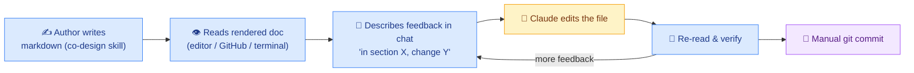

### 4.2 Existing Tooling

| Tool | Role today | Limitation for review |
|------|-----------|----------------------|
| Editor preview (VS Code, etc.) | Renders markdown | No commenting; feedback lives outside the doc |
| GitHub rendered view | Renders markdown + Mermaid; supports PR comments | PR comments are line-based on the *diff*, not on the rendered doc; requires push + PR ceremony; not driving Claude |
| Claude Code chat | Where feedback is given and edits happen | Feedback is unanchored prose; ephemeral; context re-described each round |
| Git | Version history | History is commit-level; not tied to *comments* or review rounds; not browsable in a review-centric way |

### 4.3 Current Pain Points (Recap)

The pain points are detailed in §1.6. In as-is terms:

- Feedback is **prose in a chat window**, not anchored to the rendered doc.
- Review state (open vs. resolved) lives **only in the author's head** or chat scrollback.
- Each review round **re-establishes context** for Claude.
- The link between **"this comment"** and **"that edit/commit"** is implicit, not recorded.

**[Assumption: The author currently does not use GitHub PR review for these co-design docs: review is local and conversational with Claude. If PR-based review is in active use, §6 should consider integrating with it rather than replacing it.]**

## 5. Problem Statement & Gaps

### 5.1 Problem Statement

Reviewing and iterating on long markdown documents with Claude is **slower and lossier than it should be** because feedback is unanchored prose in a chat window, review state is ephemeral, and the connection between a piece of feedback and the edit it produced is never recorded.

The author wants to **point at the exact place in the rendered doc, leave a comment, and have Claude act on all open comments at once**: with every round preserved in git as a traceable iteration. No tool in the current workflow does this: editor previews can't comment, GitHub PR review comments on diffs (not the rendered doc) and requires push/PR ceremony, and chat feedback is unanchored and ephemeral.

### 5.2 Gap Analysis

| # | Gap | Current State | Desired State | Addressed By |
|---|-----|---------------|---------------|--------------|
| GAP-1 | **No visual anchoring** of feedback to the rendered doc | Feedback is prose describing *where* | Click a span/block/point and comment in place | §6 viewer + comment layer; D1 |
| GAP-2 | **No persistent, threaded review state** | Open/resolved lives in chat or memory | Durable comment threads per doc | §6 comment store; D4 |
| GAP-3 | **Manual context hand-off to Claude** each round | Re-describe the doc + change every time | Claude reads structured, anchored comments directly | §6 Claude integration; D2, D6 |
| GAP-4 | **No review-centric iteration history** | `git log` is commit-level, not tied to comments | Browse iterations + the comments that drove each | §6 history view; D3 |
| GAP-5 | **Anchors break when the doc changes** | N/A (no anchors today) | Comments re-attach after Claude's edits | §6 anchoring engine; D1 |
| GAP-6 | **Render fidelity for review** | Depends on surface; Mermaid/tables inconsistent | Faithful render (Mermaid, tables, ref links) in the review UI | §6 renderer; §9.4 |

### 5.3 Impact Assessment

| If unaddressed | Impact |
|----------------|--------|
| Feedback stays unanchored & ephemeral | Continued per-round friction; the author keeps paying the "describe where + re-explain context" tax on every long doc |
| No traceable history of comments → edits | Can't audit how/why a doc evolved; lost rationale; harder to trust agent edits |
| Anchors not durable | Even if commenting is added, comments orphan after the first Claude edit round; the feature degrades to unusable on exactly the docs that need it most (long, frequently-edited HLDs) |
| Tool stays repo-specific | The investment doesn't generalize to other markdown work |

**Why now:** The author is producing co-design HLDs at volume (this is `CO-DESIGN-0003`), each long and iterated repeatedly. The friction compounds with every document, and the Claude-edit loop already exists; it just lacks an anchored, persistent, visual front end.

## 6. Proposed Design

### 6.1 Target State Overview

**Markdown Review Studio** is a local web app with three cooperating layers:

1. **Viewer/Editor + Comment Layer (browser)**: renders the markdown faithfully (Mermaid, tables, ref-links), lets the user edit in a split pane, and overlays a **comment layer** supporting four anchor types: text-range, block, point/margin, and whole-doc.
2. **Studio Server (local, Node/TS)**: owns the files, the **anchoring engine**, the **comment store**, the **git/history service**, and the **Claude orchestrator**. Exposes an HTTP + WebSocket API to the UI.
3. **Claude Code (headless)**: invoked by the server with the open comments + the doc as structured input; it edits the file, replies to threads, and the server commits the result to git.

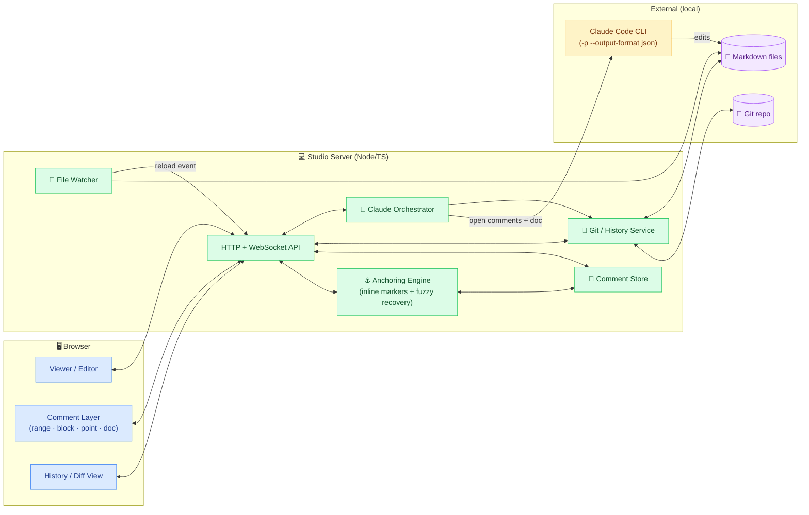

**The core loop:** open doc → leave anchored comments → trigger Claude → server feeds open comments to Claude Code headless → Claude edits the file → server commits to git + re-anchors comments → UI live-reloads showing the new version, the diff, and updated threads.

### 6.2 Architecture Options

The options differ along one main axis: **how the server drives Claude and how edits are applied/committed**. The anchoring engine and UI are common to all options (the durable-anchoring approach is decided separately in D1).

#### Option 1: Claude Code CLI headless, auto-apply + commit _(recommended)_

The server shells out to `claude -p` with the open comments and doc as input, lets Claude edit the file directly (`--permission-mode acceptEdits`), then the server commits the result to git. Uses `--output-format json` to capture Claude's per-comment replies and a session ID for follow-ups.

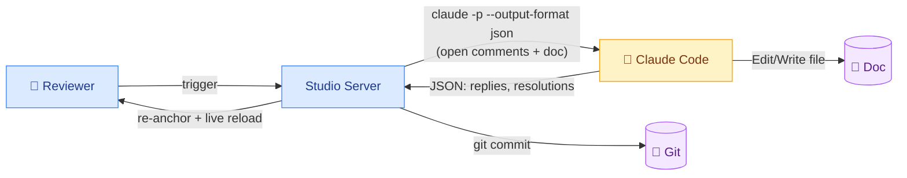

- **Strengths:** Reuses the Claude Code the author already runs (skills, CLAUDE.md, MCP, full tool loop). Minimal new code: the server orchestrates a subprocess. Claude can use the full repo context, not just the single file. Session resume (`--resume`) enables follow-up rounds.
- **Weaknesses:** Subprocess management (timeouts, concurrency, streaming progress to the UI). Claude edits the live file, so the "review before apply" safety net is git (revert), not a pre-apply diff.

#### Option 2: Anthropic API direct, server applies edits

The server calls the Claude API directly with the doc + comments, using a structured tool/output contract to get back edits, then the server applies and commits them.

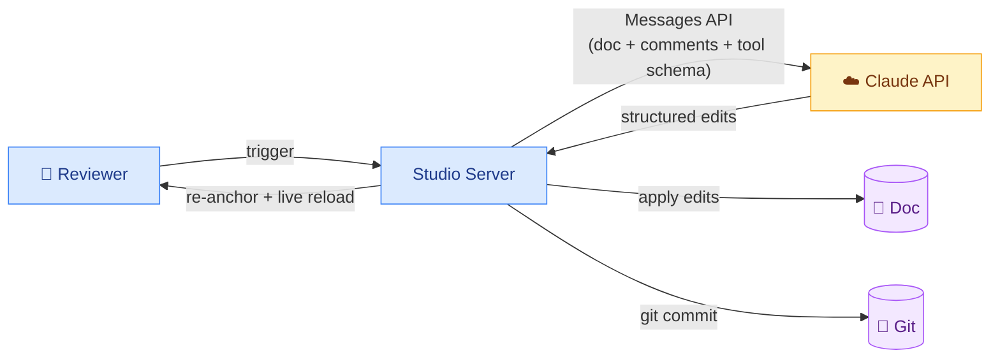

- **Strengths:** Full programmatic control of the edit contract (precise structured output). No CLI dependency. Easier to stream token-level progress. The server, not Claude, controls exactly what gets written.
- **Weaknesses:** Re-implements much of what Claude Code already gives for free (multi-file context, repo awareness, skills, the agent loop). The author's CLAUDE.md / skills / co-design conventions don't apply. More glue code and prompt engineering. Requires API key management separate from the existing Claude Code auth.

#### Option 3: Export structured prompt for manual paste

The tool collects open comments into a structured prompt the user copies into any Claude session manually; edits come back by hand or via the user's own Claude Code session.

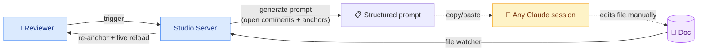

- **Strengths:** Zero integration risk; works with any model/tool. Simplest possible v1. Human fully in the loop.
- **Weaknesses:** Breaks the "frictionless loop" success criterion (§2.3): it's manual copy-paste. No automatic comment→edit traceability. Defeats much of the point.

### 6.3 Comparison Matrix

| Dimension | Option 1: CLI headless | Option 2: API direct | Option 3: Export/paste |
|-----------|------------------------|----------------------|------------------------|
| Reuses existing Claude Code setup (skills, CLAUDE.md, MCP) | ✅ Yes | ❌ No | ⚠️ Only if user pastes into their CC |
| Repo-wide context (not just the one file) | ✅ Native | ⚠️ Must be built | ⚠️ Manual |
| New code / glue required | 🟢 Low | 🔴 High | 🟢 Lowest |
| Control over edit contract | 🟡 Medium (prompt) | 🟢 High (structured) | 🔴 None |
| Frictionless loop (no copy-paste) | ✅ Yes | ✅ Yes | ❌ No |
| Comment→edit traceability automatic | ✅ Yes | ✅ Yes | ❌ Manual |
| Auth model | Existing CC auth | Separate API key | User's own |
| Progress streaming to UI | 🟡 stream-json | 🟢 Native tokens | ❌ N/A |
| Time to first value | 🟢 Fast | 🟡 Medium | 🟢 Fastest (but lowest value) |

### 6.4 Recommendation

**Adopt Option 1 (Claude Code CLI headless, auto-apply + commit).** It best satisfies the success criteria: it reuses the author's existing Claude Code setup (skills, CLAUDE.md, co-design conventions, MCP, repo-wide context), keeps new code minimal, and delivers the frictionless loop with automatic comment→edit traceability. Git is the safety net for the auto-apply model (D5): every round is a revertible commit.

**Phasing:**
- **Phase 1 (core loop):** Viewer + comment layer (all four anchor types) + anchoring engine + comment store + Option 1 Claude orchestration + git history. Single-user, this repo and any other.
- **Phase 2 (polish):** In-browser editor (split pane), richer history/diff browsing, streaming Claude progress (`stream-json`), per-comment (non-batch) processing (D6).
- **Phase 3 (optional):** Async multi-user review (D7); optionally a pre-apply diff/accept mode (D5 alternative) if the auto-apply model proves too aggressive.

**Keep Option 2 in reserve:** if the subprocess model proves limiting (e.g., need for token-level streaming or a strict structured edit contract), the orchestrator can be swapped to the Agent SDK / API behind the same internal interface.

### 6.5 Key Design Decisions

#### D1: Comment anchoring strategy ⭐ (core technical bet)

**Question:** How do comments stay attached to the correct location as the document is edited (especially by Claude)?

**Decision:** Anchors are **inline HTML-comment markers written into the `.md` file**, with the W3C/Hypothesis multi-selector model (Appendix A) demoted to a **recovery fallback** for when a marker is lost. The marker *is* the primary anchor; it moves with the text automatically when Claude or the user edits around it, and is invisible in every markdown renderer (GitHub, VS Code preview, our viewer).

| Option | Description | Trade-off |
|--------|-------------|-----------|
| Fuzzy selectors only (sidecar) | Store block-id + position + quote+context; re-anchor by fuzzy matching after each edit (original D1) | Keeps `.md` pristine; but every edit risks orphaning, and re-anchoring is probabilistic |
| **Inline markers, fuzzy fallback (recommended)** | Paired `<!--rc:start id=…-->…<!--rc:end id=…-->` markers in the `.md`; markers are authoritative; fuzzy selectors stored in sidecar only to recover a dropped marker | Marker moves with text → robust by construction; small inline pollution (invisible on render); depends on Claude preserving markers |
| Inline markers only (no fallback) | Markers, no stored selectors | Simplest; but a single dropped marker = permanently lost comment |

- **Status:** **Decided: inline markers (paired HTML comments), with multi-selector fuzzy matching as the recovery fallback.** This couples tightly to **D4** (storage) and the **Claude contract** (§6.6).
- **How it works:**
  - **Range** comment → paired markers wrap the span: `<!--rc:start id=ab12-->selected text<!--rc:end id=ab12-->`.
  - **Block** comment → a single marker at the end of the block's source line: `<!--rc:block id=cd34-->`.
  - **Point/margin** comment → a single marker at the insertion point: `<!--rc:point id=ef56-->`.
  - **Whole-doc** comment → no marker; recorded in the sidecar against the doc itself.
- **Marker survival contract:** the orchestrator instructs Claude to **preserve and move `<!--rc:*-->` markers** as it edits (§6.6). Markers are the source of truth. If Claude nonetheless drops a marker, the server runs the **fuzzy recovery pass** (block → position → context-fuzzy → quote-fuzzy, Appendix A) using selectors stored in the sidecar; if that also fails, the comment is marked `orphaned` and surfaced for re-placement (§9.5 guardrail; never silently dropped).
- **Rationale:** Durable anchoring is a co-equal success criterion (§2.3) and was explicitly prioritized. An inline marker is *robust by construction*, it travels with its surrounding text through any edit that doesn't delete it, which is strictly stronger than re-deriving an anchor by fuzzy matching after the fact. The fuzzy model still earns its place as the safety net. Markdown's stability helps here: HTML comments are valid, invisible, and survive round-tripping through markdown processors.
- **Trade-off accepted:** the `.md` source carries small invisible markers. They don't render, but they do appear in the raw file and in diffs. Mitigated by D4 (option to keep marker-only changes in separate commits) and by the markers being terse.

#### D2: Claude invocation mechanism

**Question:** How does the server drive Claude?

| Option | Description | Trade-off |
|--------|-------------|-----------|
| **Claude Code CLI headless** | `claude -p --output-format json` subprocess | Reuses skills/CLAUDE.md/repo context; subprocess mgmt |
| Agent SDK (TS) | Embed the SDK in the server | More control; reimplements setup; tighter coupling |
| Messages API direct | Raw API calls | Full control; most glue; loses CC ecosystem |

- **Status:** **Decided: Claude Code CLI headless** (Option 1), with the orchestrator behind an interface so the Agent SDK/API can be swapped in later.
- **Rationale:** See §6.4. Headless flags confirmed in Appendix B (`-p`, `--output-format json`, `--json-schema`, `--allowedTools`, `--permission-mode acceptEdits`, `--resume`).

#### D3: History model

**Question:** Where does iteration history live?

- **Status:** **Decided: git-backed.** Each Claude round (and optionally each manual save) is a commit. The history view reads `git log`/`git diff` for the doc and correlates commits to the review round + comments that produced them.
- **Rationale:** Durable, already present, no separate versioning system (T3). Commit messages reference the comment IDs addressed in that round for traceability.

#### D4: Comment storage (hybrid: inline anchors + sidecar threads)

**Question:** Where do comment threads + anchors persist, relative to the markdown file?

Coupled to D1. The decision is a **hybrid**: the *location* lives inline in the `.md` (the D1 markers); the *thread*, bodies, authors, status, history, and the fuzzy-recovery selectors, lives in a **sidecar JSON** keyed by the marker id.

| Option | Description | Trade-off |
|--------|-------------|-----------|
| Sidecar only | Everything (anchor + thread) in `.review/<doc>.comments.json`; `.md` untouched | Pristine `.md`; but anchor is fuzzy-only (the rejected D1 path) |
| Inline only | Anchor *and* full thread embedded in the `.md` as HTML comments | Self-contained; but pollutes the doc heavily and bloats diffs with comment prose |
| **Hybrid (recommended)** | Tiny inline marker = location; sidecar JSON = thread bodies + fuzzy selectors + status/history | Robust anchor (D1) + clean separation; the marker id is the join key. Two artifacts to keep in sync |

- **Status:** **Decided: hybrid.** Inline `<!--rc:* id=…-->` markers (D1) + `.review/<doc>.comments.json` sidecar, committed in-repo alongside the doc.
- **Sidecar schema (worked example):**

```jsonc
// .review/architecture/co-designs/CO-DESIGN-0003-...md.comments.json
{
  "doc": "architecture/co-designs/CO-DESIGN-0003-...md",
  "schemaVersion": 1,
  "threads": [
    {
      "id": "ab12",                       // join key &#8212; matches <!--rc:* id=ab12-->
      "anchorType": "range",              // range | block | point | doc
      "status": "open",                   // open | resolved | reopened | orphaned
      "createdBy": "reviewer",
      "createdAt": "2026-06-22T14:03:00Z",
      "recovery": {                        // fuzzy fallback if markers are lost (Appendix A)
        "blockId": "h2:6.5/d1#p3",        // heading-path or content-hash block id
        "posStart": 18432, "posEnd": 18491,
        "quote": "the marker IS the anchor",
        "prefix": "…32 chars before…",
        "suffix": "…32 chars after…"
      },
      "comments": [
        { "id": "c1", "author": "reviewer", "body": "Is this strictly stronger than fuzzy?", "createdAt": "2026-06-22T14:03:00Z" },
        { "id": "c2", "author": "claude",   "body": "Yes &#8212; marker moves with the text; fuzzy is the fallback. Clarified in D1.", "createdAt": "2026-06-22T14:09:11Z" }
      ],
      "addressedInCommit": "a1b2c3d"       // set when a Claude round resolves it (D3 traceability)
    }
  ]
}
```

- **Rationale:** Reinforces D3 (everything in git) and traceability (§2.3). The marker keeps the anchor robust (D1); the sidecar keeps the `.md` readable by not embedding thread prose. The `id` is the single join key between the two.
- **Sync invariant:** every inline marker id must have a sidecar thread, and vice versa. A marker with no thread (or a thread whose marker vanished) is a **drift condition** caught by the edit-validation hooks (D9) and repaired via the fuzzy-recovery pass or flagged `orphaned`.
- **Open question (§10.3):** keep marker/sidecar changes in commits separate from content edits to reduce `git log` noise.

#### D5: Edit apply model

**Question:** How are Claude's edits presented before they become "official"?

| Option | Description | Trade-off |
|--------|-------------|-----------|
| **Auto-apply + git commit** | Claude edits the file; server commits; review via diff/revert | Fastest loop; trusts the agent; git is the undo |
| Diff + accept/reject | Stage edits, user approves before commit | Safer; adds a gate; slower loop |

- **Status:** **Decided: auto-apply + git commit** for v1, with diff/accept as a Phase 3 option if needed.
- **Rationale:** User chose this; git revert is a sufficient safety net for a single-user local tool. The history/diff view makes every change visible after the fact.

#### D6: Claude processing granularity

**Question:** Does Claude act on all open comments at once or one at a time?

- **Status:** **Decided: batch all open comments** by default; per-comment processing is a Phase 2 add-on.
- **Rationale:** User chose batch; it matches the "review round" mental model and is more token-efficient than many small invocations. Per-comment is useful for surgical fixes later.

#### D7: Multi-user / concurrency

**Question:** Single-user local, or shared/concurrent review?

- **Status:** **Decided: dual-mode product (see D10).** **Local mode** is single-user (Phase 1). **Cloud mode** (Phase 3) adds multi-user via per-user isolation + git-based sharing. Real-time co-editing remains a non-goal (§2.4) in both modes; collaboration is **async**, mediated by git.
- **Rationale:** The product targets both developers working a project locally *and* a shared/mobile cloud audience. Sidecar-in-git (D4) means comments merge like code, so async multi-user needs no separate sync service; git is the concurrency substrate (D11). Concurrency within a single repo is handled by git (branches/merges, last-writer-wins on the sidecar with conflict surfacing), not by live OT/CRDT.

#### D8: Security & permissions model for Claude

**Question:** What can the headless Claude touch, and how is that bounded?

- **Status:** **Decided: scoped tool allow-list + working directory.** The orchestrator invokes Claude with a constrained `--allowedTools` (e.g., `Read,Edit,Write` on the docs, `Bash(git *)` only as needed) and runs it scoped to the target folder.
- **Rationale:** Even locally, the agent should be bounded to the docs it's reviewing. The user can tighten/loosen this. (NFR detail in §9.2.)

#### D9: Edit-validation hooks ⭐

**Question:** How do we guarantee that edits: whether from Claude, the in-browser editor, or the user's own editor; don't corrupt the document or break the comment/anchor invariants?

**Decision:** A **suite of validation hooks** runs around every edit, modeled on a pre/validate/post lifecycle (similar to git hooks and the Claude Code hooks system). Each hook can **pass, warn, or block** (block = the edit is rejected/rolled back before commit).

| Hook phase | When it fires | Example validators |
|------------|---------------|--------------------|
| **`preEdit`** | Before an edit round (esp. before invoking Claude) | Working tree clean / snapshot taken; capture marker inventory (set of `<!--rc:* id-->` present); doc parses as valid markdown |
| **`validateEdit`** | On the proposed/just-written content, before commit | **Marker integrity**: no marker added/removed/duplicated unless intended (compare to pre-inventory); **anchor sync**: every marker has a sidecar thread and vice versa (D4 invariant); **markdown lint**: parses, no broken Mermaid/tables/ref-links; **structure guard**: required sections/headers still present (configurable); **scope guard**: only the intended file(s) changed (ties to D8) |
| **`postEdit`** | After validation passes, around commit | Re-anchor pass (D1); update sidecar statuses; write the commit referencing addressed thread ids (D3); emit live-reload |
| **`onOrphan`** | When a marker is lost and fuzzy recovery fails | Mark thread `orphaned`; surface in the re-placement tray; never delete (§9.5) |

- **Status:** **Decided: pluggable hook suite with pass/warn/block semantics.** Built-in validators ship for marker integrity, anchor-sync, markdown lint, and scope; users can add project-specific hooks (e.g., "every HLD must keep a Revision Log table").
- **Mechanism:** Hooks are configured per-project (e.g., `.review/hooks.json` or scripts in `.review/hooks/`). The server runs them; a **blocking failure in `validateEdit` aborts the round and reverts** the working-tree change so a bad Claude edit never reaches a commit (this complements D5: auto-apply is safe because validation gates the commit, and git still allows revert after the fact).
- **Rationale:** Auto-apply (D5) without validation is risky; hooks make auto-apply *safe by construction*; the dangerous failure modes (corrupted markdown, dropped anchors, out-of-scope edits, deleted required sections) are caught mechanically before they commit. This directly addresses the top risks in §10.1.
- **Reuses prior art:** Claude Code's own hooks system and git's pre-commit model are the design references; project validators can themselves be `claude -p` calls (an LLM reviewer as a hook) or plain scripts.

#### D10: Deployment topology (dual-mode) ⭐

**Question:** Where does the server + Claude runtime run, given we want both developer-local use and a shared/mobile cloud offering?

**Decision:** **Two modes, one codebase**, sharing the same git substrate (D11) so a repo worked on locally can also be opened in the cloud:

| Mode | Who | Server + Claude runtime | Files | Devices | Phase |
|------|-----|-------------------------|-------|---------|-------|
| **Local mode** | Developers working on a project | On the **user's machine** (today's design) | Local git clone | Desktop; other devices via the git remote (push/pull) | Phase 1 |
| **Cloud mode** | Shared review, mobile/desktop reviewers | **Per-user isolated workspace** (container with the user's repo + a Claude Code runtime) on the service | Server-side git checkout of a hosted repo (D11) | Thin web clients (desktop + mobile) | Phase 3 |

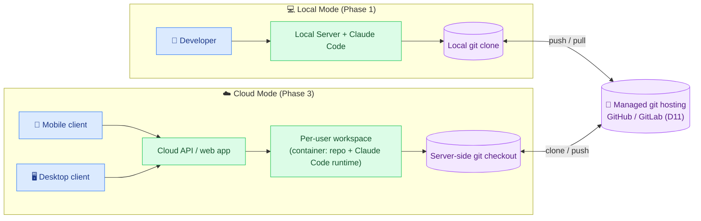

- **Status:** **Decided: dual-mode (local agent + cloud), git-hosting as the shared substrate.** Cloud mode uses a **per-user isolated workspace** (container + Claude runtime per user/session).
- **Why per-user isolated workspace (not a shared runtime):** strong isolation of one user's repo + Claude execution from another's; the workspace *is* a real filesystem + git checkout, which is exactly what Claude Code (D2) needs; no re-architecture of the orchestrator between modes. Trade-off: more standing infra (a container per active user/session); mitigated by spinning workspaces down when idle.
- **The binding constraint this resolves:** Claude Code (D2) shells out to edit files and run `git`; it needs a **real filesystem + git**, which a consumer file-sync API (Drive/Dropbox) is not. By running Claude **server-side against a git checkout** in cloud mode, mobile/desktop clients get sharing and sync *without* Claude ever touching a file-provider API. See D11.
- **Same orchestrator both modes:** the Claude Orchestrator (§7.1) runs identically; only *where* the workspace lives differs. This keeps one codebase.

#### D11: Storage substrate & file provider ⭐

**Question:** What stores the files, and can we use a provider with good sharing + mobile + desktop support?

**Decision:** **Git is the substrate; managed git hosting (GitHub/GitLab) is the file provider.** We deliberately do **not** use a consumer file-sync provider (Google Drive, Dropbox, OneDrive) as the store.

| Option | Sharing | Mobile/Desktop | Works with Claude Code (needs fs+git) | Per-user isolation | Verdict |
|--------|---------|----------------|----------------------------------------|--------------------|---------|
| **Managed git hosting (GitHub/GitLab)** | ✅ Native collaborators, org/repo permissions, PR sharing | ✅ Web + native mobile apps + desktop clients | ✅ Clone to a real fs; Claude operates normally | ✅ Repo-per-user / per-project | **Chosen** |
| Self-hosted bare git repos | ⚠️ Build it yourself | ⚠️ Build it yourself | ✅ | ✅ | Enterprise/on-prem option |
| Consumer file-sync (Drive/Dropbox) | ✅ Great consumer sharing | ✅ Excellent | ❌ API-only blob store; **not** a git filesystem Claude can edit/commit; sync conflicts fight git | ⚠️ Folder-based | **Rejected** |
| App-managed DB / object store | ⚠️ Build it | ⚠️ Build it | ❌ Not a git fs; loses D3 history model | ✅ | Rejected (breaks D3) |

- **Status:** **Decided: managed git hosting (GitHub/GitLab) as the primary provider**, with self-hosted bare repos as an enterprise/on-prem option. Consumer file-sync providers are **explicitly rejected** as the store.
- **How this satisfies your asks:**
  - **Per-user isolation** → each user's docs are their own repo (and, in cloud mode, their own workspace container, D10).
  - **Sharing** → the git host's native model: add a collaborator, share an org/repo, or open a PR. No custom sharing system to build for v1 of cloud mode.
  - **Mobile + desktop** → cloud mode serves a responsive web client to both; the git host *also* provides its own mobile/desktop apps for raw browsing. (Note: this lifts the §2.4 "desktop only" / "no mobile" non-goal **for cloud mode**; local mode stays desktop.)
  - **Git as substrate** → reinforces D3 (history) and D4 (sidecar comments merge like code): the same model already chosen.
- **Auth:** the service acts on the user's behalf via their git-host token / OAuth (cloud mode), or the user's existing local git credentials (local mode).
- **Trade-off:** we depend on an external git host (availability, rate limits, token scoping). The orchestrator's git access is behind the Git/History Service interface (§7.1), so the self-hosted option can be swapped in without touching the rest.

#### D12: Monetization & hosting model

**Question:** How is the service paid for, and can it be hosted on GitHub/GitLab Pages?

**Can it run on Pages? No.** Pages (GitHub/GitLab) serves **static files only**: no server-side process, no persistent filesystem, no ability to run `git` or shell out to Claude Code. Our architecture *requires* a server-side runtime (the Studio Server + a Claude Code runtime against a real git checkout, D2/D10). Therefore:

- **Local mode** is **not** "hosted" at all: it runs on the developer's machine.
- **Cloud mode** needs real compute (containers/VMs for per-user workspaces, D10): a container platform (e.g., Fly.io, Render, ECS/Fargate, Cloud Run, K8s), **not** Pages.
- The only thing Pages *could* host is a **marketing/landing site** or a fully static, read-only export of a doc: neither is the product.

**Monetization (leaning):**

| Tier | Who | What | Pricing model |
|------|-----|------|---------------|
| **Local / OSS** | Individual developers | Local mode, full features, **bring-your-own** Claude + git credentials | Free / open-source |
| **Cloud Pro** | Individuals & small teams | Hosted cloud mode, per-user workspace, git-host sharing, mobile/desktop | **Subscription** (per seat/month); **BYO API key** option to remove model-cost markup |
| **Team / Enterprise** | Orgs | SSO, self-hosted git option (D11), audit, admin controls, on-prem deploy | Per-seat + platform fee; annual |

- **Cost driver to manage:** Claude token spend per review round + standing workspace compute (D10). Mitigations: **BYO-key** pushes model cost to the user; **idle workspace spin-down**; per-tier round/usage quotas. (`--output-format json` returns `total_cost_usd` per invocation, App. B; usable for metering.)
- **Status:** **Leaning: local free/OSS; cloud subscription with BYO-key option; enterprise tier with self-host.** Pages is **ruled out** as a host (static-only). Full pricing TBD (§10.3).
- **Rationale:** Local mode being free/OSS drives adoption and matches "developers working on a project"; the cloud tier monetizes the hosted convenience (sharing, mobile, no local setup) where the real infra cost is.

#### D13: Authentication & secrets management ⭐ (cloud mode)

**Question:** Do we collect GitHub tokens? How are keys kept secure? Does each user get their own encryption key?

These only arise in **cloud mode** (local mode uses the user's existing local git + Claude credentials: the service stores nothing). For cloud mode:

**Do we collect GitHub tokens?: Prefer NOT to hold long-lived tokens.**
- **Primary: GitHub/GitLab App + OAuth**, not raw personal access tokens. The user authorizes our **App** (scoped to selected repos only); the host issues **short-lived installation/OAuth access tokens** the service mints on demand and lets expire. We store the **refresh/installation grant**, not a broad long-lived PAT.
- This means least-privilege (only the repos the user picks), user-revocable from their GitHub settings, and no standing god-token.
- A raw-PAT path may exist for self-hosted git that lacks an App model; flagged, and treated as a secret like any other below.

**How are keys/secrets kept secure?**
- **Dedicated secrets manager** (e.g., cloud KMS-backed secret store such as AWS Secrets Manager / GCP Secret Manager / Vault): **never** in the app DB in plaintext, never in git, never in the repo/sidecar.
- **Envelope encryption:** secrets encrypted with a per-tenant data key, which is itself wrapped by a KMS master key. Secrets are **encrypted at rest and in transit (TLS)**.
- **Scoped to the workspace:** a per-user workspace (D10) only receives the decrypted secrets it needs, at run time, via the runtime's secret injection: not baked into the image, not logged. Workspace teardown clears them.
- **No secrets in Claude's context:** the orchestrator passes tokens to git/CLI via environment/credential helpers, not in the prompt; comment sidecars remain plaintext-but-non-secret (§9.2).

**Does each user get their own encryption key?: Yes, per-tenant.**
- Each user/tenant gets a **distinct data encryption key (DEK)** under the envelope scheme, so one tenant's secrets are cryptographically isolated from another's; keys are **rotatable** without re-encrypting everything (rewrap the DEK).
- **BYO-key users** (D12) provide their own Claude API key, which is stored under the same per-tenant encryption and used only to invoke their rounds.

- **Status:** **Decided (cloud mode): GitHub/GitLab App + OAuth (short-lived tokens, least-privilege), KMS-backed secrets manager with per-tenant envelope encryption, runtime-injected and never persisted in workspace/git/prompt.** Local mode collects/stores nothing.
- **Rationale:** Minimizes what we hold (prefer ephemeral tokens over PATs), isolates tenants cryptographically, and keeps secrets out of every place they could leak (DB, git, logs, Claude context). Directly addresses the "are we collecting tokens / how are keys secure / per-user key" questions.
- **Open questions (§10.3):** exact secrets-manager + KMS choice; whether enterprise self-host requires customer-managed keys (CMK/BYOK at the infra level).

### 6.6 Claude Read/Write Contract

How open comments are fed **to** Claude, and how Claude's edits and replies come **back**: given the inline-marker model (D1/D4).

**Input to Claude (read).** The orchestrator does **not** strip markers. Claude sees the real `.md` *with* its `<!--rc:* id=…-->` markers in place, plus a structured list of the open threads keyed by id. This is what lets Claude edit *exactly* the commented span and keep markers attached.

The orchestrator builds a prompt of the form:

```
You are revising <doc path>. The file contains inline anchor markers like
<!--rc:start id=ab12-->…<!--rc:end id=ab12-->. These mark where each comment applies.

RULES:
1. Address every OPEN comment below by editing the text between/at its markers.
2. PRESERVE all <!--rc:* --> markers. If you move text, move its markers with it.
   Never delete a marker unless the comment explicitly asks to remove that content.
3. Do not touch text unrelated to a comment.

OPEN COMMENTS:
- id=ab12 [range] "Is this strictly stronger than fuzzy?" → (anchored text shown via markers)
- id=cd34 [block] "This heading should be H3 not H2."
- id=ef56 [point] "Add a sentence here about rollback."
```

Invocation (per D2/D8): `claude -p --output-format json --allowedTools "Read,Edit,Write" --append-system-prompt <marker-rules>`, scoped to the doc folder, **without** `--bare` (so skills/CLAUDE.md apply).

**Output from Claude (write).** Two channels:

1. **The edited `.md` file**: Claude edits in place (auto-apply, D5); the edit-validation hooks (D9) gate the commit.
2. **A structured reply payload**: captured from `--output-format json` (optionally `--json-schema` to enforce shape). Per-thread replies and resolutions the server merges into the sidecar:

```jsonc
{
  "replies": [
    { "id": "ab12", "resolution": "resolved", "reply": "Clarified &#8212; marker moves with the text; fuzzy is the fallback." },
    { "id": "cd34", "resolution": "resolved", "reply": "Demoted heading to H3." },
    { "id": "ef56", "resolution": "addressed", "reply": "Added a sentence on git-revert rollback." }
  ]
}
```

**Reconciliation.** After Claude returns, the server: (a) runs `validateEdit` hooks (D9); marker integrity + anchor-sync + lint + scope; (b) on pass, merges `replies` into the sidecar (appends a `claude` comment, sets status, stamps `addressedInCommit`); (c) commits (D3); (d) re-anchors and live-reloads. On a blocking hook failure, the round is reverted and surfaced; no commit, no sidecar mutation.

**Marker-drop handling.** If validation detects a marker Claude dropped, the server first attempts **fuzzy recovery** (D1 selectors in the sidecar `recovery` block) to re-insert the marker into the new text; if recovery fails, the thread is flagged `orphaned` (`onOrphan` hook) and shown in the re-placement tray.

## 7. Key Components & Data Model

### 7.1 Components

| Component | Responsibility (single sentence) | Interface / API surface | Data it owns |
|-----------|----------------------------------|-------------------------|--------------|
| **Viewer/Editor** (browser) | Render markdown faithfully and host the split-pane editor | React components; consumes doc + render API | None (transient UI state) |
| **Comment Layer** (browser) | Capture selections/clicks and overlay comment markers + thread panel | `POST /comments`, `GET /comments`, WS updates | None (reflects server state) |
| **History/Diff View** (browser) | Browse iterations and diffs, and the comments that drove each | `GET /history`, `GET /diff` | None |
| **API Gateway** (server) | HTTP + WebSocket entrypoint; auth-less local routing | REST + WS | None |
| **Anchoring Engine** (server) | Write/move inline markers; run fuzzy recovery when a marker is lost | `insertMarkers(doc, selection)`, `recover(doc, thread)` | Marker + selector logic |
| **Comment Store** (server) | Persist comment threads + recovery selectors as sidecar JSON; keep marker↔thread in sync | CRUD over `.review/<doc>.comments.json` | Threads, recovery selectors, status |
| **Validation/Hook Engine** (server) | Run pre/validate/post hooks around every edit; pass/warn/**block** | `runHooks(phase, ctx)` | Hook registry, per-project config |
| **Git/History Service** (server) | Commit edits, read log/diff, correlate commits↔rounds | `commit()`, `log()`, `diff()` | Commit metadata (round ↔ comment ids) |
| **Claude Orchestrator** (server) | Invoke Claude Code headless with open comments; capture replies; reconcile per §6.6 | `runRound(doc, openComments)` | Session ids, round records |
| **File Watcher** (server) | Detect on-disk changes and push live-reload events | emits `fileChanged` | None |

### 7.2 Data Model

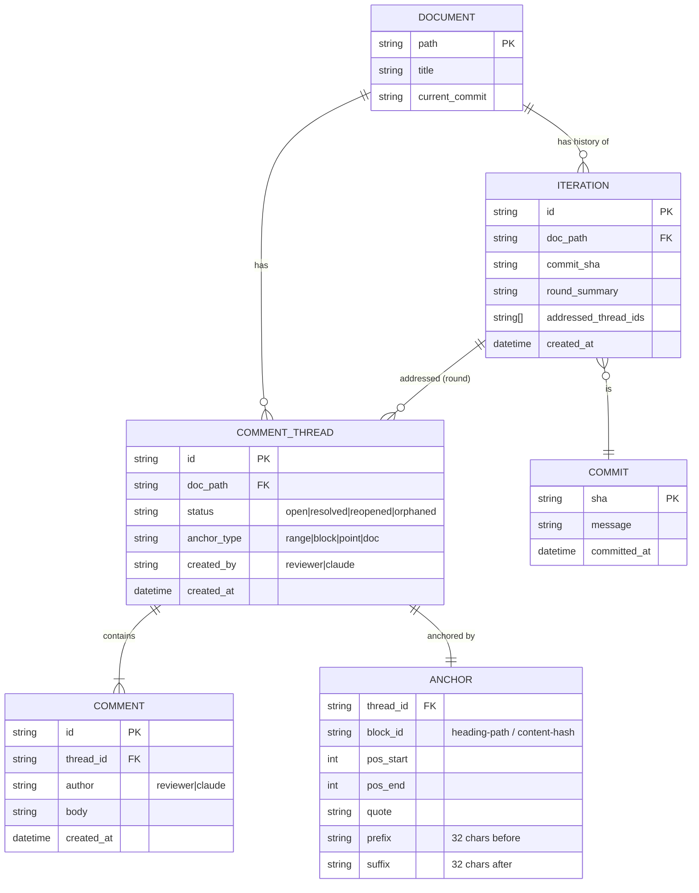

**Key entities:**
- **Document**: a markdown file under the target folder (keyed by path).
- **Comment Thread**: one anchored discussion; has a status and an **anchor type** (the four kinds from §1.6). `created_by` distinguishes reviewer vs Claude.
- **Comment**: a single message in a thread (reviewer or Claude reply).
- **Anchor**: the location, held primarily by **inline `<!--rc:* id=…-->` markers in the `.md`** (D1/D4). The sidecar also stores a **recovery selector payload** (block id + position offsets + quote + 32-char prefix/suffix, per Appendix A) used only if a marker is lost. For `point` anchors, a single marker is the insertion point; for `doc` anchors, there is no marker (recorded against the doc).
- **Iteration**: one review round = one git commit, recording which threads it addressed (`addressed_thread_ids`) for comment→edit traceability.

### 7.3 Data Flows

**Flow 1: Create a comment**

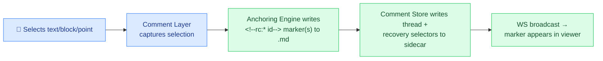

**Flow 2: Claude acts on open comments (the core loop)**

```mermaid
graph LR
    A["👤 Trigger 'Process comments'"] --> P["preEdit hooks<br/>(snapshot, marker inventory)"]
    P --> B["Orchestrator gathers<br/>open threads + doc (markers in place)"]
    B --> C["claude -p --output-format json<br/>(--allowedTools, scoped, §6.6)"]
    C --> D["🤖 Claude edits file +<br/>returns replies/resolutions"]
    D --> V{"validateEdit hooks<br/>marker integrity · anchor-sync · lint · scope"}
    V -->|block| X["⛔ Revert change<br/>surface failure, no commit"]
    V -->|pass| E["Git Service commits<br/>(msg refs thread ids)"]
    E --> F["postEdit: re-anchor /<br/>fuzzy-recover dropped markers"]
    F --> G["Comment Store merges<br/>replies + statuses (§6.6)"]
    G --> H["WS broadcast →<br/>live reload + diff + threads"]

    classDef ui fill:#dbeafe,stroke:#3b82f6,color:#1e3a8a
    classDef srv fill:#dcfce7,stroke:#22c55e,color:#14532d
    classDef agent fill:#fef3c7,stroke:#f59e0b,color:#78350f
    classDef block fill:#fee2e2,stroke:#ef4444,color:#7f1d1d
    class A ui
    class P,B,E,F,G,H,V srv
    class C,D agent
    class X block
```

**Flow 3: Re-anchoring after any edit** (Claude's edit, or the user's own): the Anchoring Engine runs the ordered fallback (block → position → context-fuzzy → quote-fuzzy, per Appendix A); threads that fail all strategies are marked `orphaned` and surfaced to the reviewer to re-place.

## 8. Use Cases

The actors are the personas from §1.4: the **Reviewer** (primary), **Claude Code** (invoked by the server), and **Git** (history). The diagram below maps actors to the use cases each participates in; solid arrows are actor → use case, dotted arrows are the cascade the core loop triggers.

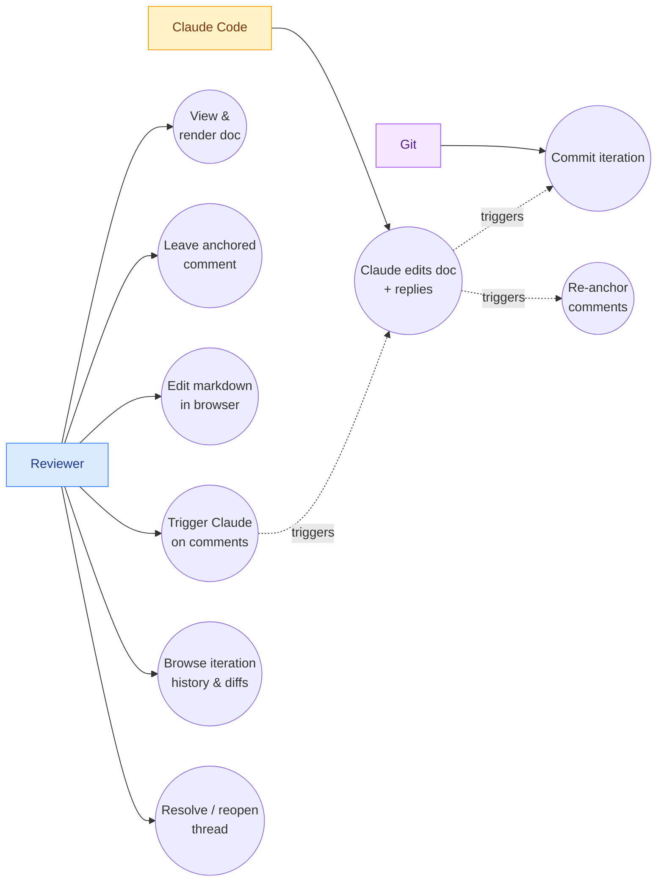

**Key use cases** (actor → goal → flow):

- **Reviewer → leave anchored feedback → review round.** Reviewer selects a span/block/point (or the whole doc) → Comment Layer captures it → Anchoring Engine writes `<!--rc:* id-->` markers → Comment Store persists the thread (§7.3 Flow 1).
- **Reviewer → turn comments into edits → the core loop.** Reviewer clicks "Process open comments" → server feeds open threads + doc to Claude Code headless → Claude edits in place and returns replies → hooks validate → Git commits the round → comments re-anchor and the UI live-reloads (§6.1, §7.3 Flow 2).
- **Reviewer → audit how the doc evolved → history browse.** Reviewer opens the history view → reads each iteration's diff and the comment ids that drove it (D3 traceability).
- **Reviewer → close the loop → resolve/reopen.** Reviewer marks a thread resolved (or reopens it) after reviewing Claude's reply; status persists in the sidecar (D4).

## 9. Customer Journey

The end-to-end journey the **Reviewer** (primary user) goes through, from opening a doc to a committed, traceable iteration:

```mermaid
graph LR
    A["📂 Point tool at a<br/>markdown folder<br/>(one command)"] --> B["👁️ Open & read<br/>rendered doc"]
    B --> C["🖱️ Leave anchored comments<br/>(range · block · point · doc)"]
    C --> D["⚡ Click 'Process<br/>open comments'"]
    D --> E["🤖 Claude edits doc<br/>+ replies to threads"]
    E --> F["✅ Hooks validate<br/>(marker · sync · lint · scope)"]
    F --> G["💾 Git commits the round<br/>(refs comment ids)"]
    G --> H["🔁 Live-reload: diff +<br/>updated threads"]
    H -->|"more feedback"| C
    H --> I["🗂️ Browse iteration history<br/>(what changed & why)"]

    classDef start fill:#dbeafe,stroke:#3b82f6,color:#1e3a8a
    classDef agent fill:#fef3c7,stroke:#f59e0b,color:#78350f
    classDef store fill:#f3e8ff,stroke:#a855f7,color:#581c87
    classDef gate fill:#dcfce7,stroke:#22c55e,color:#14532d
    class A,B,C,D,H,I start
    class E agent
    class F gate
    class G store
```

## 10. Architecture Diagrams

### 10.1 Context Diagram

See **§1.3** for the system context diagram (browser ↔ studio server ↔ filesystem/git/Claude Code) and **§6.1** for the layered target-state component diagram. Not duplicated here.

### 10.2 Use Case Diagram

_See also §8 Use Cases for the textual list of use cases._

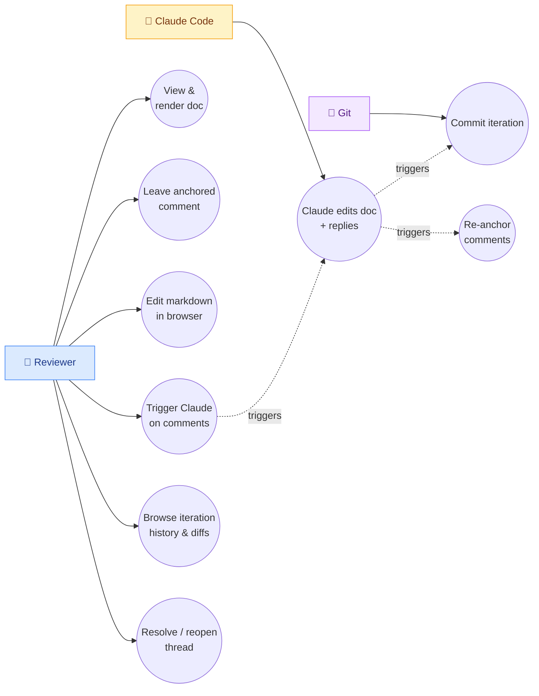

### 10.3 Sequence Diagram: Full Review Round

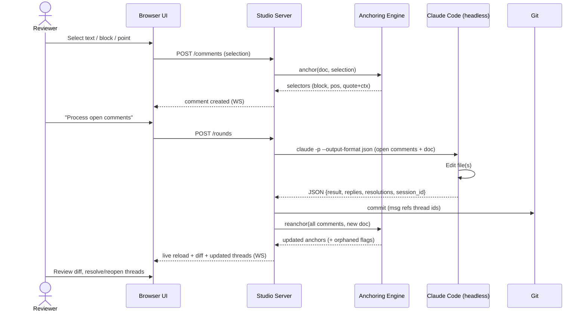

### 10.4 Entity Relationship Diagram

See **§7.2** for the ERD (Document, Comment Thread, Comment, Anchor, Iteration, Commit). Not duplicated here.

### 10.5 System/Component Diagram

See **§6.1** for the layered component diagram (browser layer, studio server internals, external local processes). Not duplicated here.

## 11. Non-Functional Requirements & Constraints

### 11.1 Performance

| NFR | Target |
|-----|--------|
| Initial doc render (typical HLD, ~30 pages) | &lt; 1 s on a modern laptop |
| Comment create → marker visible | &lt; 150 ms (local, no network) |
| Re-anchor pass after an edit (per doc, ~100 comments) | &lt; 500 ms |
| Live-reload latency after on-disk file change | &lt; 300 ms from file write to UI update |
| Claude round | Bounded by Claude Code itself; UI shows progress (`stream-json`) and never blocks the rest of the app |

**[Assumption: A single doc has at most a few hundred comments and is well under the 10MB headless stdin cap; docs are referenced by path to Claude, not piped, so size is not a constraint.]**

### 11.2 Security

**Local mode (Phase 1):**
- **Local-only.** Server binds to `localhost`; no external exposure.
- **Scoped agent (D8).** Claude Code runs with a constrained `--allowedTools` allow-list and scoped to the target folder. The user can tighten/loosen it.
- **Auth reuse, store nothing.** Uses the machine's existing Claude Code + git credentials; the tool stores no keys of its own.
- **No secrets in comments/sidecars.** Sidecar JSON is plain text committed to the repo; the user controls its contents.

**Cloud mode (Phase 3): see D13:**
- **Prefer ephemeral tokens over PATs.** Git access via a GitHub/GitLab **App + OAuth** with least-privilege repo scope and short-lived tokens; we avoid holding long-lived personal access tokens.
- **KMS-backed secrets manager.** All secrets (git grants, BYO API keys) live in a dedicated secrets manager under **per-tenant envelope encryption**, encrypted at rest + in transit: never in the app DB plaintext, git, logs, or Claude's prompt context.
- **Per-tenant isolation.** Each tenant has its own data encryption key; per-user workspaces (D10) receive decrypted secrets only at runtime and clear them on teardown.

### 11.3 Scalability

**Local mode:** scale dimension is **documents-per-folder and comments-per-doc**, not users.
- Folder browsing handles hundreds of markdown files (lazy-load; index on demand).
- Comment sidecars are per-doc, so they scale with the doc, not the whole repo.

**Cloud mode (D10):** scale dimension is **concurrent active workspaces**.
- One container/workspace per active user/session; **idle spin-down** caps standing cost (D12).
- Stateless API tier scales horizontally; git hosting (D11) absorbs storage scale.
- **Still a non-goal:** real-time concurrent editing within a doc: collaboration stays async/git-mediated (§2.4, D7).

### 11.4 User Experience

Per the personas (§1.4), the primary surface is a desktop browser for the **Reviewer**.

- **Render fidelity (GAP-6).** Mermaid diagrams, tables, fenced code, and reference-style links must render correctly: these docs depend on them. The review UI should match GitHub rendering closely.
- **Anchoring feels solid.** Markers stay visually attached to the right place; after a Claude round, comments that moved are clearly re-located, and any `orphaned` comments are surfaced in a "needs re-placement" tray rather than silently lost.
- **The four comment gestures are obvious:** select-to-highlight (range), click-a-block (block), drop-a-pin (point/margin), and a general "comment on whole doc" affordance.
- **The loop is one click.** "Process open comments" triggers Claude; progress streams; the result shows as a diff with updated threads: no context-switching to a terminal.
- **History is review-centric.** The history view answers "what changed in this round, and which comments drove it?": not just a raw `git log`.
- **Editing is markdown-first.** Split editor + live preview; no WYSIWYG surprises (§2.4).

### 11.5 Compliance & Constraints

- **Tech stack constraint:** Node/TS server + React frontend (decided).
- **Git required:** the target folder must be a git repo (or be `git init`-ed on first run; §10.3).
- **Claude Code required:** the CLI must be installed and authenticated on the machine (Appendix B). The tool deliberately runs Claude **without** `--bare` so the author's skills/CLAUDE.md/co-design conventions apply.
- **Markdown only:** no other document formats (§3.2).
- **Single-user in local mode; multi-user is cloud-only (Phase 3, D7/D10):** local mode has no auth/permissions/multi-tenancy.
- **Server-side runtime required:** cannot be hosted on static-only Pages (D12); cloud mode needs container compute.
- **Guardrail: never lose traceability:** every Claude edit must produce a commit that references the comment(s) it addressed; the tool must never apply agent edits without recording the round.
- **Guardrail: never silently drop a comment:** a comment that can't be re-anchored is marked `orphaned` and surfaced, never deleted.

## 12. Phases

Delivery follows the phasing established in §6.4, with each phase building on the same orchestrator interface so cloud work never blocks the local loop.

### 12.1 Delivery Phases & Who Builds Them

| Phase | What ships | Who builds it |
|-------|-----------|---------------|
| **Phase 1: Core loop** | Viewer + comment layer (all four anchor types), Anchoring Engine, Comment Store, Option 1 Claude orchestration, git history, edit-validation hooks (D9). Single-user, any repo. | Author/Reviewer (Omar) dogfooding; Claude Code as the build assistant |
| **Phase 2: Polish** | In-browser split editor, richer history/diff browsing, streaming Claude progress (`stream-json`), per-comment (non-batch) processing (D6). | Author/Reviewer; Claude Code |
| **Phase 3: Cloud (optional)** | Async multi-user (D7), per-user workspace + managed git hosting (D10/D11), auth & secrets (D13), monetization (D12), optional pre-apply diff/accept mode (D5 alternative). | Author + Teammates/Stakeholders as cloud reviewers; Git host as the sharing substrate |

### 12.2 RACI

Responsibilities across the delivery phases (R = Responsible, A = Accountable, C = Consulted, I = Informed). Actors are the personas from §1.4.

| Responsible | Accountable | Consulted | Informed | Activity / Workstream |
|-------------|-------------|-----------|----------|-----------------------|
| Claude Code | Author/Reviewer | Git | Teammate / Stakeholder | Phase 1; core loop (anchoring, comments, orchestration, hooks) |
| Claude Code | Author/Reviewer | Reviewer | Teammate / Stakeholder | Phase 2; editor, history/diff, streaming, per-comment |
| Author/Reviewer | Author/Reviewer | Teammate / Stakeholder | Git | Phase 3; cloud (multi-user, workspaces, auth/secrets, monetization) |
| Claude Code | Reviewer | Git | Author | Each review round (edit → validate → commit) |
| Git | Author/Reviewer | Reviewer | Teammate / Stakeholder | Iteration history & traceability (commits ↔ comments) |

## 13. Risks, Dependencies & Open Questions

### 13.1 Risks

| Risk | Likelihood | Impact | Mitigation |
|------|-----------|--------|------------|
| **Anchoring not robust enough**: comments orphan after big Claude edits | Low-Medium | High | Inline markers are robust by construction (D1); they move with the text; fuzzy recovery (App. A) + `orphaned` tray as fallback, never lose them |
| **Claude drops/duplicates a marker** while rewriting | Medium | Medium | §6.6 marker-preservation rules in the prompt; `validateEdit` marker-integrity hook (D9) blocks the commit; fuzzy recovery re-inserts; else `orphaned` |
| **Auto-apply produces a bad edit** | Low-Medium | Medium | `validateEdit` hooks (D9) gate the commit (lint, structure, scope); a bad edit is reverted before commit; git revert remains as after-the-fact undo (D5) |
| **Claude edits beyond the intended scope** (touches other files/sections) | Low-Medium | Medium | Scoped `--allowedTools` + working dir (D8); `validateEdit` **scope guard** hook (D9) blocks out-of-scope changes; commit-per-round makes scope visible |
| **Inline markers add noise to the `.md` / diffs** | Medium | Low | Markers are terse + invisible on render; option to commit marker/sidecar changes separately from content (D4, §10.3) |
| **Subprocess management complexity** (timeouts, concurrency, hangs) | Medium | Medium | Single in-flight round per doc; honor headless bg-wait cap (App. B); stream progress; surface failures |
| **Render fidelity gaps** (Mermaid/tables differ from GitHub) | Low | Medium | Use a well-supported renderer; visual-diff against GitHub for key docs |
| **Sidecar comment files create git noise** | Medium | Low | Keep comment commits separate from content commits (D4 open question); option to `.gitignore` if desired |
| **Scope creep: Phase-3 cloud pulled into Phase 1** | Medium | Medium | Strict phasing (§6.4, D10): local mode ships first; cloud is a separate phase behind the same orchestrator interface |
| **Cloud cost overrun**: standing workspaces + Claude tokens | Medium | High | Idle workspace spin-down; per-tier quotas; BYO-key option; meter via `total_cost_usd` (D12) |
| **Secret/token leak (cloud)**: git tokens or API keys exposed | Low | High | App+OAuth short-lived tokens (not PATs); KMS secrets manager + per-tenant envelope encryption; never in DB/git/logs/prompt (D13) |
| **Per-user workspace isolation breach (cloud)** | Low | High | Container-per-user isolation (D10); per-tenant keys (D13); least-privilege repo scope |
| **External git-host dependency** (outage, rate limits) | Medium | Medium | Git access behind Git/History Service interface (§7.1); self-hosted git option (D11) for enterprise |

### 13.2 Dependencies

- **Claude Code CLI**: installed & authenticated (headless interface, Appendix B). Cloud mode bundles a Claude runtime per workspace (D10).
- **Git**: present; target folder is a repo.
- **Node.js / TypeScript runtime**: for the server (and React build).
- **A markdown renderer** supporting Mermaid, tables, GFM, and reference-style links.
- **An anchoring library** to reuse/port (anchor-quote / TextQuoteAndPosition, Appendix A) rather than writing selectors from scratch.
- **(Cloud mode, Phase 3)** Managed git hosting (GitHub/GitLab) API + App/OAuth (D11/D13); a container platform for per-user workspaces (D10); a KMS-backed secrets manager (D13).

### 13.3 Open Questions

1. **Comment commit strategy (D4):** Should comment-state changes commit separately from content edits to keep `git log` clean, or be `.gitignore`-d entirely (history then lives only in the doc commits)?; leaning separate `.review/` commits.
2. **Non-git target folders:** If the folder isn't a git repo, do we `git init` it automatically, refuse, or fall back to app-managed snapshots?; leaning offer-to-init.
3. **Editor vs. external edits:** When the user edits in their own editor while the browser editor is open, how do we reconcile? (File watcher + last-writer-wins + reload, or lock?): leaning watcher + reload, browser editor is convenience not authority.
4. **Per-comment vs. batch UX (D6):** Batch is default; what's the interaction for "act on just this one"?: Phase 2.
5. **Pre-apply diff mode (D5):** Do we ever want a gated accept/reject, or is git-revert always enough?: revisit after dogfooding.
6. **Multi-user concurrency (D7):** When two users comment on the same doc in cloud mode, how do sidecar merges resolve: auto-merge non-overlapping threads, surface conflicts?; leaning git-merge with conflict surfacing.
7. **Distribution (local mode):** npm package? `npx` one-shot? Bundled binary?; packaging decision deferred.
8. **Cloud pricing specifics (D12):** exact tiers, seat price, quota limits, BYO-key discount: TBD.
9. **Secrets infra choice (D13):** which secrets manager + KMS; does enterprise self-host require customer-managed keys (BYOK)?: TBD.
10. **Git host coverage (D11):** GitHub first, then GitLab? Bitbucket? Self-hosted GitLab/Gitea for enterprise: sequencing TBD.

### 13.4 FAQ

_This FAQ doubles as a **question-index** into the document: each answer links to the section that covers it in full._

#### Key Design Questions → Where Answered

A navigational index: if you're wondering about X, this is where the document decides it.

| Key question | Decision | Section |
|--------------|----------|---------|
| Where do comments physically live; in the `.md` or beside it? | D1 + D4 | [§6.5 D1](#d1--comment-anchoring-strategy--core-technical-bet), [§6.5 D4](#d4--comment-storage-hybrid-inline-anchors--sidecar-threads) |
| How do comments stay attached when the doc is edited? | D1 (inline markers + fuzzy fallback) | §6.5 D1, Appendix A |
| What does a comment look like on disk? | Sidecar schema worked example | §6.5 D4 |
| How are the four comment types (range/block/point/doc) anchored? | D1 "How it works" | §6.5 D1 |
| How does Claude receive comments and return edits/replies? | Claude read/write contract | §6.6 |
| How are bad/corrupting edits prevented? | D9 edit-validation hooks | §6.5 D9 |
| What stops Claude editing the wrong thing? | D8 scope + D9 scope-guard hook | §6.5 D8, §6.5 D9 |
| How is history of iterations tracked? | D3 git-backed | §6.5 D3, §8.3 |
| Do Claude's edits apply automatically or need approval? | D5 auto-apply (hook-gated) | §6.5 D5 |
| Batch all comments or one at a time? | D6 batch | §6.5 D6 |
| Why drive Claude via the CLI, not the API? | D2 | §6.5 D2, §6.4 |
| Is this multi-user? | D7 (local single-user, cloud async multi-user) | §6.5 D7 |
| How do we deal with storage / where do files live? | D11 git substrate | §6.5 D11 |
| How does each user get an isolated folder of files? | D10 per-user workspace + D11 repo-per-user | §6.5 D10, §6.5 D11 |
| Can we use a file provider with good sharing/mobile/desktop support? | D11 (git hosting yes; Drive/Dropbox rejected) | §6.5 D11 |
| Where does the server + Claude run (local vs cloud)? | D10 dual-mode | §6.5 D10 |
| How would we monetize this service? | D12 | §6.5 D12 |
| Can it be hosted on GitHub/GitLab Pages? | D12 (no; static-only) | §6.5 D12 |
| Would we be collecting GitHub tokens? | D13 (prefer App+OAuth short-lived, not PATs) | §6.5 D13 |
| How would we keep keys secure? | D13 (KMS secrets manager, envelope encryption) | §6.5 D13 |
| Does each user get their own encryption key? | D13 (yes; per-tenant DEK) | §6.5 D13 |
| What is explicitly NOT being built? | Non-goals + scope-by-phase | §2.4, §3.2 |

#### Rationale Q&A

**Q: Why not just use GitHub PR review comments?**
A: PR comments anchor to *diff lines*, not the *rendered* doc (Mermaid/tables/prose), require push+PR ceremony, and don't drive Claude. This tool comments on the rendered doc locally and closes the loop to Claude automatically. → [§4.2 Existing Tooling](#42-existing-tooling) · [§5.1 Problem Statement](#51-problem-statement)

**Q: Why auto-apply instead of review-then-apply?**
A: For a single-user local tool, git revert is a sufficient safety net and keeps the loop fast (§6.5 D5). A gated diff/accept mode is a Phase 3 option if needed. → [§6.5 D5: Edit apply model](#d5--edit-apply-model)

**Q: Why Claude Code CLI instead of the API?**
A: It reuses the author's existing setup, skills, CLAUDE.md, co-design conventions, MCP, and repo-wide context, with minimal new code (§6.4). The orchestrator is behind an interface, so the API/Agent SDK can be swapped in later. → [§6.5 D2: Claude invocation mechanism](#d2--claude-invocation-mechanism) · [§6.4 Recommendation](#64-recommendation)

**Q: What happens to a comment whose text Claude rewrote entirely?**
A: The inline markers normally move with the text (D1). If Claude drops a marker, the `validateEdit` hook catches it (D9) and the server attempts fuzzy recovery (block → position → quote, Appendix A); if that fails the comment is marked `orphaned` and surfaced for re-placement; never silently dropped (§9.5 guardrail). → [§6.5 D1: Comment anchoring strategy](#d1--comment-anchoring-strategy--core-technical-bet) · [§6.5 D9: Edit-validation hooks](#d9--edit-validation-hooks) · [§9.5 Compliance & Constraints](#95-compliance--constraints)

**Q: Won't the inline markers clutter my markdown?**
A: They're terse HTML comments (`<!--rc:start id=ab12-->`); invisible in every renderer (GitHub, VS Code preview, the studio viewer). They appear only in the raw source and diffs; D4 allows committing marker/sidecar changes separately to keep `git log` clean. → [§6.5 D4: Comment storage](#d4--comment-storage-hybrid-inline-anchors--sidecar-threads)

## Appendices

### Appendix A: Comment Anchoring Research

_Researched 2026-06-22 to inform **D1 (comment anchoring strategy)**._

**The problem:** annotations/comments must re-attach to the right place after a document changes. This is a solved problem in the web-annotation community; we adopt its proven model.

**The W3C Web Annotation Data Model** defines multiple [selectors][w3c-model] for targeting a region of content, including a **TextPositionSelector** (start/end character offsets) and a **TextQuoteSelector** (the exact quoted text plus surrounding context). Robust anchoring was an explicit topic of the W3C Web Annotation Working Group.

**Hypothesis** (the reference open-source annotator) achieves durable re-attachment by storing **three selectors per annotation** and trying **four strategies in order** ([Fuzzy Anchoring][hypothesis-fuzzy]):

| Selector stored | What it captures |
|-----------------|------------------|
| RangeSelector | A pair of XPaths (start/end) into DOM elements + string offsets |
| TextPositionSelector | Character offsets for start/end across the whole document |
| TextQuoteSelector | The selected text + the **32 characters** immediately before and **32** after as context |

Re-attachment strategy order:
1. **Range selector**: fast path when the document is unchanged.
2. **Position selector**: handles structural changes when content is stable.
3. **Context-first fuzzy match**: fuzzy-search the stored prefix/suffix context, then the quote.
4. **Quote-only fuzzy match**: last resort: fuzzy-search the exact text directly.

Selectors **hint each other**: e.g., the position selector narrows where the fuzzy quote search looks.

**Design implication (D1):** We use **inline HTML-comment markers as the primary anchor** (robust by construction: they move with the text), and adopt this multi-selector + ordered-fallback model only as the **recovery path** for when a marker is lost. Because our content is **markdown with a stable AST**, the recovery pass adds a **block selector** (heading-path or content-hash block id) as an additional, markdown-native strategy tried before text-position: a structural anchor the generic web model lacks. Libraries such as [anchor-quote][anchor-quote] and [TextQuoteAndPosition][tqp] implement the quote/position pieces and can be reused or ported rather than written from scratch.

[w3c-model]: https://www.w3.org/TR/annotation-model/ "Web Annotation Data Model (W3C Recommendation)"
[hypothesis-fuzzy]: https://web.hypothes.is/blog/fuzzy-anchoring/ "Fuzzy Anchoring. Hypothesis"
[anchor-quote]: https://github.com/robertknight/anchor-quote "anchor-quote: a Web Annotations quote selector anchoring library"
[tqp]: https://github.com/judell/TextQuoteAndPosition "TextQuoteAndPosition"

### Appendix B: Claude Code Headless Integration Research

_Researched 2026-06-22 to inform **D2 (Claude invocation mechanism)** and **D5/D6 (apply model, granularity)**._

Claude Code runs non-interactively via the [Agent SDK / headless mode][cc-headless]:

| Flag | Purpose |
|------|---------|
| `-p` / `--print` | Run non-interactively; prompt passed at invocation, result to stdout |
| `--output-format json` | Structured result with `result`, `session_id`, usage, and `total_cost_usd` |
| `--output-format stream-json` | Newline-delimited events for real-time progress streaming to the UI |
| `--json-schema '<schema>'` | Force the result to conform to a JSON Schema; structured payload in `structured_output` |
| `--allowedTools "Read,Edit,Write,Bash(git *)"` | Auto-approve specific tools (no prompts); bounds what the agent can do |
| `--permission-mode acceptEdits` | Auto-approve file writes + common fs commands without listing each tool |
| `--resume <session_id>` / `--continue` | Continue a prior review round with full context |
| `--append-system-prompt` | Inject reviewer/role instructions for the edit pass |
| `--bare` | Skip auto-discovery for reproducible scripted runs (note: skips skills/CLAUDE.md; we likely do **not** want bare, since we want the co-design conventions) |

Key facts for the orchestrator:
- stdin is accepted and **capped at 10MB**: large docs should be referenced by path, not piped.
- A `session_id` is returned with `--output-format json`, captured via `jq -r '.session_id'`, enabling follow-up rounds with `--resume`.
- Background subagents/workflows are waited on (capped at 10 minutes by default).

**Design implication (D2/D8):** The orchestrator runs `claude -p --output-format json` (or `--json-schema` for a strict reply/resolution contract), scoped to the target folder, with a constrained `--allowedTools` allow-list (D8). It captures `session_id` for multi-round follow-ups (D6) and can switch to `stream-json` to show live progress in the UI (Phase 2). We deliberately **do not** use `--bare`, so the author's skills/CLAUDE.md/co-design conventions apply during edits.

[cc-headless]: https://code.claude.com/docs/en/headless "Run Claude Code programmatically. Claude Code Docs"

## 14. Revision Log

| Date | Author | Section | Change |
|------|--------|---------|--------|
| 2026-06-22 | Omar Eid, Claude | All | Initial scaffold |
| 2026-06-22 | Omar Eid, Claude | 1 to 10 + Appendices | Full draft: purpose/context, objectives, scope, current state, gaps, proposed design (Option 1 recommended), components/data model, diagrams, NFRs, risks/open questions. Research appendices A (anchoring) & B (Claude Code headless). |
| 2026-06-22 | Omar Eid, Claude | 11 / §1.5 | Final review pass: synced Key Decisions Summary (§1.5) with §6.5 (D1/D2/D5/D6 marked Decided, added D8); status → In Review. |
| 2026-06-22 | Omar Eid, Claude | 6, 7, 10 | Comment-structure revisit: reframed **D1** to inline HTML-comment markers (fuzzy fallback); rewrote **D4** as hybrid (inline anchors + sidecar threads) with on-disk schema worked example; added **§6.6 Claude read/write contract**; added **D9 edit-validation hooks**. Propagated to §1.5, §7.1 (Validation/Hook Engine), §7.2 to 7.3 (flows + hook gate), §10.1 risks. |
| 2026-06-22 | Omar Eid, Claude | 10.4 | Added **Key Design Questions → Where Answered** navigational index to the FAQ; split FAQ into index + rationale Q&A. Skill-healed: added FAQ-index guidance to co-design SKILL.md (Phase 10 + scaffold). |
| 2026-06-22 | Omar Eid, Claude | 1.4, 8, 9, 12 | **Validator-required sections.** Added a user-profiling diagram to §1.4 (System Users & Personas); added §8 **Use Cases** (use-case diagram + textual list) and §9 **Customer Journey** (end-to-end flow) near Architecture Diagrams; added §12 **Phases** with a RACI table derived from the §6.4 phasing. Renumbered subsequent sections (Architecture Diagrams → §10, NFRs → §11, Risks → §13, Revision Log → §14). |
| 2026-06-22 | Omar Eid, Claude | 2, 3, 6, 9, 10 | **Dual-mode + storage/security revisit.** Reversed local-only framing → dual-mode product. Added **D10** (deployment topology: local agent + cloud per-user workspace), **D11** (storage substrate: managed git hosting; consumer file-sync rejected), **D12** (monetization: local free/OSS + cloud subscription/BYO-key + enterprise; Pages ruled out as static-only), **D13** (auth & secrets: App+OAuth short-lived tokens, KMS secrets manager, per-tenant envelope encryption). Reframed D7 (dual-mode). Reconciled §2.4 non-goals, §3.2 (scope-by-phase), T1, §9.2/§9.3 (local vs cloud), §9.5. Added cloud risks, deps, open questions. Appended 8 session questions to the FAQ index. |
