# High-Level Design: Self-Healing Storefront: Autonomous Experimentation Agent

:::note[Scope]
This document defines the **autonomous CRO (Conversion Rate Optimization) / A/B-testing agent**: the engine that ideates, runs, and ships experiments on a live ecommerce storefront. It is the realization of the **self-healing growth-marketing site** north star named in [CO-DESIGN-2026-06-21-site-scanner-lead-engine](/designs/design-ecommerce-site-scanner-and-lead-generation-engine) (the Site Scanner & Lead Engine). Where 0002 *finds* what's wrong on a prospect's site, this agent *fixes* it; closing the scan → heal loop. The scanner is the front door; this agent is the service the customer pays for.
:::

<!-- truncate -->

import Mockups from './_mockups/self-healing-storefront.mdx';

<Mockups />

---

## Executive Summary

**The problem.** Continuous, statistically-sound conversion optimization: A/B testing, is the highest-leverage growth lever an online store has, and it is precisely the one a do-it-yourself (DIY) merchant cannot pull. Today's testing tools assume a marketing expert who knows what to test, can build the variants, can interpret the statistics, and is willing to risk live sales. Most small and mid-sized merchants therefore do nothing, or guess and ship changes with no control group, leaving conversion (and revenue) on the table.

**The solution.** A **Self-Healing Storefront Agent**: an AI agent that turns the conversion problems already detected by our Site Scanner ([CO-DESIGN-0002](/designs/design-ecommerce-site-scanner-and-lead-generation-engine)): plus the store's own analytics; into a ranked backlog of experiments, generates on-brand variants, runs them safely on live traffic with statistics suited to the store's traffic level, ships the winners, and reports the dollar lift in plain language. It is delivered as a **managed service**: we (the **operators**) supervise the agent across many stores, while the **store owner** sets the rules and watches the results.

**Key decisions.**
- **D1: Execution (decided, phased):** launch as a **Shopify-native app** to validate the agent fast, then move to **self-hosted serving** for margin and cross-platform reach.
- **D3: Autonomy (decided in principle):** **risk-gated autonomy tiers**: low-risk copy and layout changes ship automatically within guardrails; pricing and checkout changes are supported but always require human approval.
- **D2: Measurement (leaning):** **Bayesian/sequential statistics** so even lower-traffic stores reach trustworthy decisions, never shipping a "win" the data doesn't support.

**Expected value.** A mid-market store doing **$1M/year at a 2% conversion rate** that hits the target of **+10% cumulative conversion lift in 6 months** gains roughly **+$100K/year** in attributable revenue: for essentially no owner time and no expert on payroll. _(Illustrative <Assumption />; to be validated.)_

**Status & what's open.** Status: **In Review.** The architecture, components, and guardrails are settled; the main open items are the scanner→agent interface (OQ2), the attribution-holdback model (OQ3), the "too small to test" traffic floor (OQ5), and validating the placeholder success metrics. Full detail follows; this summary is the front door.

---

## 1. Purpose & Context

### 1.1 Purpose

This document defines the high-level architecture for an **autonomous experimentation agent** that **ideates A/B test hypotheses for an ecommerce storefront, designs the variants, runs the tests safely on live traffic, measures results with statistical rigor, and ships winners**: operating under **configurable autonomy tiers** (from propose-only to fully autonomous, per test category). It is the *fix* half of the **scan → heal loop** opened by [CO-DESIGN-0002](/designs/design-ecommerce-site-scanner-and-lead-generation-engine): where the Site Scanner *finds* growth-marketing problems on a site, this agent *resolves* them through continuous, measured experimentation. The scanner is the front door; this agent is the **service the customer pays for**.

The agent's **action space spans all growth-marketing surfaces**: copy/content, layout/UX, pricing/offers, checkout/funnel, and beyond; but **autonomy is gated by risk**. Low-risk, easily reversible categories (**copy/content** and **layout/UX**) can run **fully autonomously** within guardrails; higher-risk categories (**pricing/offers**, **checkout/funnel**) are **supported but require human approval**: the agent ideates and designs the experiment, but a human ships it. This is the core of the **configurable autonomy tiers** model (D3): the *same* agent works across all areas; what differs per category is how much it may do without a human in the loop. See [Section 3](#3-scope) for the autonomy-by-category matrix.

### 1.2 Who Is Building This & Why

The same two-person founding team behind CO-DESIGN-0002; a **Growth Operator** (technical/product) and a **Sales/BD partner** (commercial): building an agentic growth-marketing service for ecommerce merchants.

The strategic thesis carries forward and completes: **the scanner earns trust by reliably finding what's wrong on a site; this agent monetizes that trust by fixing it: provably, with the customer's revenue protected.** CRO is the chosen wedge for the "heal" half because:

- **Every win is attributable to dollars.** A shipped, statistically-validated experiment that lifts conversion 4% has a directly computable revenue lift. Unlike "SEO improved" or "site got faster," CRO produces a number the merchant can see on their own dashboard: the highest-willingness-to-pay outcome in growth marketing.
- **It compounds the scanner's signal.** The CRO problems the scanner already detects (weak CTAs, buried value props, cluttered layouts) become this agent's **seed hypothesis backlog** on day one: no cold start.
- **It is safe to start small, then widen.** Copy and layout changes are low-risk and trivially reversible, so the agent can begin shipping value *autonomously* on a live store from day one. Pricing, checkout, and other higher-risk areas are supported too, but in human-approved mode, so the agent's reach widens without the autonomy outrunning the customer's trust.

In short: the scanner proved we can *find* what's wrong; this agent proves we can *fix* it; measurably, safely, and without requiring the merchant to be a marketing expert.

### 1.3 Context

The agent sits **on a customer's live storefront**. It consumes signals (the scanner's detected CRO problems, the store's own analytics, the product catalog), runs a continuous **experiment loop**, and produces shipped storefront changes plus a plain-language **wins ledger** the owner can read. The **DIY Store Owner** sets the rules and watches; the **Operator** supervises across many stores.

```mermaid
%% animate: flow
graph LR
    subgraph signals["Inputs / Signals"]
        SCAN[Scanner Findings\nCO-DESIGN-0002]
        ANALYTICS[Store Analytics\n& Conversion Data]
        CATALOG[Catalog & Content]
    end

    subgraph engine["Experimentation Agent &#8212; THIS DESIGN"]
        IDEATE((Ideate\nHypotheses))
        DESIGN((Design\nVariants))
        RUN((Run Test\non Live Traffic))
        MEASURE((Measure\n& Analyze))
        DECIDE((Decide:\nship / kill / iterate))
    end

    subgraph people["People & Systems"]
        OWNER[Store Owner\nDIY &#8212; primary]
        OP[Operator\nus &#8212; supervises]
        STORE[(Commerce Platform\n/ Storefront)]
        SHOPPER[Storefront Visitor]
        LEDGER[(Wins Ledger\n& Experiment Log)]
    end

    SCAN --> IDEATE
    ANALYTICS --> IDEATE
    CATALOG --> IDEATE
    IDEATE --> DESIGN --> RUN --> MEASURE --> DECIDE
    DECIDE -.->|iterate / next hypothesis| IDEATE
    RUN -->|serves variants to| STORE
    STORE -->|exposes| SHOPPER
    SHOPPER -.->|behavior = signal| MEASURE
    DECIDE -->|ships winner to| STORE
    DECIDE --> LEDGER
    LEDGER --> OWNER
    OWNER -.->|sets autonomy tier + guardrails| engine
    OWNER -.->|approves gated tests| DECIDE
    OP -.->|supervises, tunes, intervenes| engine

```

*Legend: solid arrows = experiment data flow; dashed = configuration, approval, or feedback. The loop **Ideate → Design → Run → Measure → Decide → (iterate)** is the heart of the agent. The **Scanner Findings** input is the bridge from CO-DESIGN-0002: its detected problems seed this agent's hypothesis backlog.*

### 1.4 System Users & Personas

| Actor | Role | Interaction with the System | Primary Surface |
|-------|------|------------------------------|-----------------|
| **Store Owner** | **Primary user.** A DIY ecommerce merchant: typically not a marketing expert. Connects their store, picks an **autonomy tier**, sets guardrails (revenue floors, brand/voice rules, no-touch zones), approves gated experiments, and reads the wins ledger. Wants growth on autopilot with control. | Direct | Owner dashboard / app |
| **Operator** | **Secondary user (us).** Runs the agent as a managed service across many customer stores. Supervises experiments, reviews higher-risk hypotheses, tunes the ideation engine, and intervenes on anomalies. The human safety net behind the autonomy. | Direct (supervise) | Operator console |
| **Experimentation Agent** | The autonomous system actor we are building: an LLM-driven orchestrator that ideates hypotheses, designs variants, deploys them, runs the statistics, and decides ship/kill/iterate. | System-to-system | (headless) |
| **Site Scanner** | The CO-DESIGN-0002 engine. Upstream producer of detected CRO problems that seed this agent's hypothesis backlog. | System-to-system | Scanner API / shared store |
| **Storefront Visitor (Shopper)** | The merchant's site visitor. Bucketed into a variant; their behavior (clicks, add-to-cart, purchase) is the measured signal. Never interacts with the agent directly. | Indirect (subject) | The merchant's storefront |
| **Commerce Platform / Variant Server** | The storefront stack (e.g., Shopify, custom) plus whatever mechanism serves variants and the analytics that report outcomes. | System-to-system | Platform / experiment APIs |

:::info[Terminology]
"**Agent**" in this document means the autonomous experimentation system we are building (an LLM-driven orchestrator with tools), not a person. "**Owner**" always means the **Store Owner** (primary, DIY) persona. "**Operator**" always means **us**, supervising the agent as a service. "**Experiment**" and "**test**" are used interchangeably for a single A/B (or A/B/n) trial. "**Variant**" is one version shown to a slice of traffic (the unchanged version is the **control**).
:::

**User profiles: who's involved and what they want:**

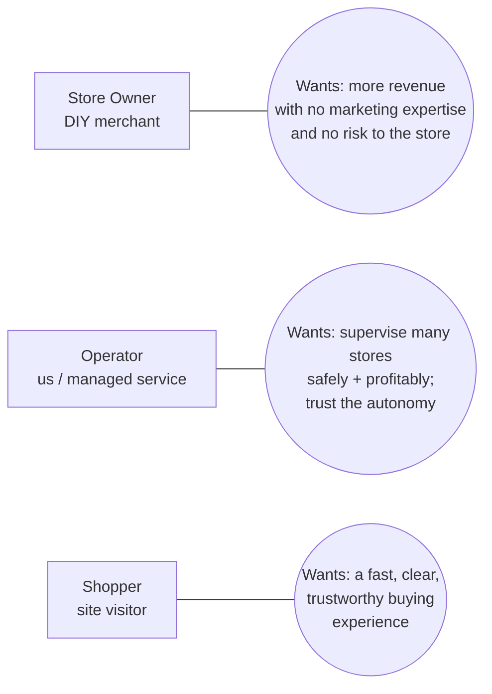

*Interests/motivations per persona; the agent must satisfy all three at once: lift the owner's revenue, stay supervisable by the operator, and never degrade the shopper's experience.*

### 1.5 Key Decisions Summary

These decisions are defined in detail in [Section 6.5](#65-key-design-decisions). The three flagged as **top concerns** by the founding team are **D1 to D3**: execution, measurement rigor, and autonomy/guardrails; the questions that most determine whether the agent is trustworthy on a live, revenue-generating store.

| ID | Decision | Status |
|----|----------|--------|
| **D1** | **Execution / serving model**: how do variants actually get served on a live storefront? (drive a 3rd-party A/B platform via API, self-hosted JS/edge injection, or platform-native app/theme) | **Decided (phased):** Phase A Shopify-native → Phase B self-hosted |
| **D2** | **Measurement rigor across traffic levels**: how do we trust a "win" when stores range from low- to mid-traffic? (frequentist vs. Bayesian vs. sequential/bandit; minimum-runtime and significance rules) | Leaning: hybrid, Bayesian/sequential default |
| **D3** | **Autonomy & guardrails model**: what ships without a human, per category? (configurable tiers; revenue floors, blast-radius caps, auto-rollback) | Decided in principle: configurable tiers |
| **D4** | **Ideation engine**: how are hypotheses generated and prioritized? (scanner findings + analytics + LLM reasoning; prioritization by expected lift × confidence × ease) | Leaning: combined, scanner-seeded + score |
| **D5** | **Variant generation**: how are concrete copy/layout variants produced and kept on-brand? (LLM generation bounded by brand/voice guardrails; safe-mutation constraints) | Leaning: LLM + brand/a11y gate |
| **D6** | **Outcome attribution**: how is dollar lift computed and reported to the owner? (per-experiment conversion + revenue delta; ledger model) | Leaning: per-experiment + portfolio holdback |
| **D7** | **Tech stack & data store**: orchestration runtime, variant-serving infra, experiment store, LLM provider | TBD |
| **D8** | **Compliance & safety posture**: consent/privacy for visitor bucketing, accessibility of generated variants, brand-safety review | Decided in principle (detail in §9.5) |

### 1.6 Challenges / Pain Points

The work is driven by two problem domains: **why DIY owners don't run experiments today**, and **why automating experimentation safely is hard**. Framed below by who feels each pain and what it costs. **Sorted by impact within each category.**

#### Category A: Why DIY store owners don't run experiments today

1. **"I don't know what to test." (D4)**: The Store Owner has hypotheses-shaped intuitions ("maybe my product pages are confusing") but no method to turn them into testable experiments. Forming a good CRO hypothesis requires expertise the owner doesn't have and doesn't want to acquire. So the highest-leverage growth lever in ecommerce simply goes unused; the store stays at whatever conversion rate it launched with.

2. **"I don't have the traffic or time to test properly." (D2)**: Even owners who *want* to experiment hit a wall: classic A/B testing needs meaningful traffic and weeks of patience to reach significance, and the owner is busy running the business. Tests get abandoned half-finished, or "decided" on noise after two days; worse than not testing, because a false win gets shipped.

3. **"The testing tools aren't built for me." (D1)**: Experimentation platforms are built for analysts and CRO consultants: dashboards full of statistical jargon, manual variant setup, code snippets, segment builders. A solo merchant bounces off them. The tooling assumes an expert operator who isn't there.

4. **"I'm afraid I'll break my store or lose sales." (D3)**: The storefront is the owner's livelihood. Any tool that mutates a live, revenue-generating site is a threat unless it can *prove* it won't tank conversions, can roll back instantly, and respects hard limits the owner sets. Fear of breakage keeps owners from touching anything; the safest-feeling choice is to change nothing.

#### Category B: Why automating experimentation safely is hard

1. **"Can we trust a result on a small store?" (D2)**: Mid-market and long-tail stores often lack the traffic for fast, classically-significant results. Naïve automation that calls winners on thin data will confidently ship losers. The agent needs statistically defensible methods (Bayesian / sequential / bandit) that adapt to each store's traffic and never declare a win the data doesn't support.

2. **"Can we mutate a live revenue site without endangering it?" (D3)**: Running variants on real shopper traffic means real money is on the line every minute. The agent must serve variants without breaking the page, cap how much traffic/risk any one test exposes (blast radius), watch for revenue drops in real time, and auto-roll-back on harm; all under guardrails the owner controls.

3. **"Will the ideas actually be good?" (D4, D5)**: Generic experimentation ("make the button green," "add a countdown timer") produces noise, not lift. The agent's ideation must be genuinely good, grounded in the scanner's real findings, the store's actual analytics, and CRO best practice, and its generated variants must stay on-brand and accessible, not off-voice or broken.

4. **"Can we prove the dollar lift?" (D6)**: The entire value proposition rests on attributable revenue. The agent must measure each experiment's conversion and revenue delta rigorously and report it in language the owner believes and understands; a wins ledger, not a stats dump. Without trustworthy attribution, the service is indistinguishable from guesswork.

### 1.7 Motivation

Building this agent achieves the outcomes that make the whole scan → heal business work:

- **Turns the scanner's findings into recurring revenue**: detected problems become shipped fixes the customer pays for monthly.
- **Makes world-class CRO accessible to non-experts**: a solo merchant gets continuous, statistically-sound experimentation without hiring a CRO consultant or learning a testing platform.
- **Protects the customer's revenue while improving it**: configurable autonomy, blast-radius caps, and auto-rollback mean the owner gets upside without betting the store.
- **Compounds over time**: every experiment (win or loss) teaches the ideation engine what works on this store and across the portfolio, so the service gets better the longer it runs.

## 2. Objectives

The agent is delivered as a **managed service**: operators run and supervise it across many customer stores, and the **Store Owner's dashboard is a transparency-and-control surface** (set guardrails, approve gated tests, read the wins ledger) rather than a self-serve experimentation tool. Business goals optimize for **operator → store leverage** and **attributable, recurring revenue**.

Each objective notes the **key decisions** ([§6.5](#65-key-design-decisions)) that most affect it.

### 2.1 Business Goals

- **Close the scan → heal loop into revenue.** Convert scanner-sourced prospects (CO-DESIGN-0002) into paying CRO customers by *fixing* the very problems the scan surfaced. _(D4, D6)_
- **Prove attributable dollar lift per store.** Deliver a visible, believable revenue delta per customer: the proof that sustains a recurring subscription and reduces churn. _(D2, D6)_
- **Maximize operator leverage.** Enable one operator to safely supervise many stores at once; supervision effort per store must fall as trust and automation grow. This ratio is the core margin driver of the managed-service model. _(D3)_
- **Expand the market beyond CRO-literate merchants.** Make continuous, statistically-sound experimentation available to non-expert DIY owners who would never hire a CRO consultant or operate a testing platform. _(D1, D4)_
- **Widen the action space over time without losing trust.** Start with autonomous copy/layout wins, then extend into human-approved pricing/checkout experiments: growing revenue-per-customer as the relationship matures. _(D3)_

### 2.2 Technical Goals

- **Trustworthy measurement across the traffic range.** Produce statistically defensible decisions whether a store sees 1K or 500K visits/month: never declare a win the data doesn't support. _(D2)_
- **Safe live-storefront mutation.** Run variants on real revenue traffic with blast-radius caps, real-time revenue/health monitoring, and automatic rollback on harm. _(D3)_
- **Risk-gated autonomy.** One agent, per-category autonomy tiers: copy/layout may ship autonomously; pricing/checkout require human approval; all configurable by the owner and overridable by the operator. _(D3)_
- **Grounded, prioritized ideation.** Turn scanner findings + store analytics + CRO best practice into a ranked hypothesis backlog (expected lift × confidence × ease), not generic suggestions. _(D4)_
- **On-brand, accessible variant generation.** Generate concrete copy/layout variants that stay within the owner's brand/voice guardrails and meet accessibility standards. _(D5)_
- **Execution-model abstraction.** Decouple the agent's reasoning from the variant-serving mechanism so the serving approach (D1) can change without rewriting the agent. _(D1, D7)_

### 2.3 Success Criteria

_Targets below are <Assumption /> placeholders: directionally right, numerically unvalidated. Tune once live data exists._

- **Time to first shipped win**: <Assumption>≤ 30 days</Assumption> from store onboarding to the first statistically-validated, shipped improvement.
- **Decision yield**: <Assumption>≥ 70%</Assumption> of launched experiments reach a *valid* decision (ship or kill on defensible data) rather than timing out inconclusive.
- **Net conversion lift per store**: <Assumption>+10% cumulative conversion lift within 6 months</Assumption>, measured against a held-back baseline.
- **False-win rate**: <Assumption>≤ 5%</Assumption> of shipped winners later shown (via holdback / re-test) to be neutral or negative.
- **Operator leverage**: <Assumption>1 operator supervises ≥ 25 active stores</Assumption> at steady state, trending upward.
- **Revenue-safety**: <Assumption>zero unrecovered revenue-harm incidents</Assumption>; any experiment causing a material conversion/revenue drop is auto-rolled-back within a bounded window. _(This is a hard guardrail, not a soft target.)_

### 2.4 Non-Goals

- **Not a self-serve experimentation platform for analysts.** We are not building yet another dashboard-driven A/B tool with manual variant setup and segment builders. The agent does the work; the owner supervises.
- **Not autonomous pricing or checkout changes.** Pricing/offers and checkout/funnel experiments are **supported but always human-approved**: autonomy in those categories is explicitly out of scope (the *capability* is in scope; the *autonomy* is not). _(D3)_
- **Not off-site growth.** Paid ads, email/SMS marketing, influencer, and other off-site channels are out of scope: this agent optimizes the **on-site storefront experience** only.
- **Not a brand-strategy or merchandising decision-maker.** The agent optimizes within owner-set brand/voice/no-touch guardrails; it does not redefine the brand, choose the product assortment, or set business strategy.
- **Not the scanner / lead-gen engine.** Discovery, scanning, scoring, and outreach are CO-DESIGN-0002's job. This design consumes scanner output; it does not reproduce it.

## 3. Scope

### 3.1 In Scope

| In Scope | Out of Scope |
|----------|--------------|
| **Autonomous experimentation** on copy/content and layout/UX (ideate → design → run → measure → ship) | **Autonomous** experimentation on pricing/offers and checkout/funnel (supported only in human-approved mode) |
| **Human-approved experimentation** on pricing/offers, checkout/funnel, and other higher-risk on-site areas (agent ideates + designs; human ships) | Off-site growth channels (paid ads, email/SMS, social, influencer) |
| **Adaptive measurement** that fits method to per-store traffic (frequentist / Bayesian / sequential / bandit) | Building a general-purpose, self-serve experimentation platform for analysts |
| **Risk-gated autonomy engine** with owner-set guardrails and operator override | Brand strategy, product assortment / merchandising decisions, business strategy |
| **Grounded ideation** from scanner findings + store analytics + CRO best practice | Site discovery, scanning, scoring, and outreach (owned by CO-DESIGN-0002) |
| **On-brand, accessible variant generation** (copy + layout) | Backend/infra changes to the merchant's commerce platform itself |
| **Outcome attribution & wins ledger** (per-experiment conversion + revenue delta) | Full re-platforming or theme redesign (the agent edits within the existing storefront) |
| **Owner dashboard** (guardrails, approvals, ledger) + **operator console** (supervision, tuning) | Customer-support, fulfillment, inventory, or order-management workflows |
| **Managed-service operation** (operators supervise across many stores) | Self-serve onboarding without operator involvement (not in this phase) |

### 3.2 Out of Scope

See the right column above. The most important boundaries to call out explicitly, to avoid reader confusion:

- **Pricing & checkout are in scope as a *capability*, but autonomy over them is not.** The agent can ideate and design a pricing or checkout experiment, but a human must approve and ship it. "Out of scope" here means *autonomous execution*, not *support*.
- **The scanner/lead engine is not re-built here.** This agent *consumes* CO-DESIGN-0002's output (detected CRO problems) as hypothesis seed input. Discovery, scoring, and outreach remain in 0002.
- **Off-site growth is excluded entirely.** The agent optimizes the on-site storefront experience; it does not touch ad spend, email, or any channel the shopper sees before landing on the store.
- **Self-healing beyond CRO is the north star, not this design.** CO-DESIGN-0002 named a broader self-healing vision (technical/perf, SEO, content auto-remediation). This design delivers the **CRO/experimentation** slice of that vision. Other self-healing domains are future work.

### 3.3 System Boundaries

**This design owns:**
- The experimentation agent (ideation, variant design, execution orchestration, measurement, decisioning)
- The experiment data store and wins ledger
- The autonomy/guardrail engine and approval workflow
- The owner dashboard and operator console surfaces

**This design assumes exists (depends on, does not build):**
- **CO-DESIGN-0002 Site Scanner**: supplies detected CRO problems as hypothesis seeds
- **The merchant's commerce platform** (e.g., Shopify or custom storefront): the surface being experimented on; provides analytics/conversion data
- **A variant-serving mechanism**: the runtime that actually shows variant vs. control to traffic (D1 decides whether this is a 3rd-party A/B platform, self-hosted injection, or platform-native; see [§6](#6-proposed-design))
- **An LLM provider**: powers ideation and variant generation
- **The merchant's analytics / order data**: the source of truth for conversion and revenue outcomes

**Boundary diagram:**

```mermaid
graph LR
    subgraph owned["Owned by THIS design"]
        AGENT((Experimentation\nAgent))
        STORE_DB[(Experiment Store\n& Wins Ledger)]
        GUARD((Autonomy /\nGuardrail Engine))
        UI[Owner Dashboard\n+ Operator Console]
    end

    subgraph assumed["Assumed / Depended On"]
        SCANNER[Site Scanner\nCO-DESIGN-0002]
        COMMERCE[(Commerce Platform\n+ Analytics)]
        SERVE[Variant-Serving\nMechanism &#8212; D1]
        LLM[LLM Provider]
    end

    SCANNER -->|CRO problem seeds| AGENT
    COMMERCE -->|analytics / conversion / revenue| AGENT
    AGENT -->|deploys variants via| SERVE
    SERVE -->|serves to traffic on| COMMERCE
    AGENT -->|generation / reasoning| LLM
    AGENT <--> GUARD
    AGENT --> STORE_DB
    UI --> GUARD
    UI --> STORE_DB

```

## 4. Current State (As-Is)

This section describes how DIY ecommerce merchants approach conversion optimization and experimentation **today**, and the tooling landscape they would have to navigate. See [Appendix A](#appendix-a--cro-tooling--methods-research) for the sourced market and method research behind this section.

### 4.1 How a DIY Merchant Optimizes Conversion Today

For a typical solo/small ecommerce merchant, the current state is one of three modes; none of them good:

1. **Do nothing (most common).** The store launches with whatever conversion rate the theme and the owner's instincts produce, and it stays there. The owner knows "conversion could be better" but has no method, time, or confidence to change it. The highest-leverage growth lever sits untouched.

2. **Guess and ship (no testing).** The owner reads a blog post, changes the headline or button, and ships it to 100% of traffic: with no control group and no measurement. If sales dip, they may never connect it to the change. Improvements and regressions are equally invisible. This is *worse* than nothing when a confident change quietly suppresses conversion.

3. **Adopt a testing tool (rare, and it usually fails).** A motivated owner installs an A/B testing app (Shopify-native like **Shoplift**/**Intelligems**, or a platform like **VWO**/**Optimizely**: see [Appendix A](#appendix-a--cro-tooling--methods-research)). They then face: manual hypothesis creation, manual variant building, statistical dashboards built for analysts, and the patience to wait weeks for significance. Most tests are abandoned, mis-configured, or "decided" on noise. The tool assumes an expert operator who isn't there.

```mermaid
graph LR
    OWNER[DIY Store Owner] --> Q{Wants better\nconversion}
    Q -->|most common| NOTHING((Do nothing\n&#8212; stays flat))
    Q -->|some| GUESS((Guess & ship\nto 100% &#8212; no control))
    Q -->|rare| TOOL((Adopt testing tool))
    TOOL --> WALL[Manual hypotheses +\nmanual variants +\nanalyst dashboards +\nweeks of waiting]
    WALL -.->|most tests| ABANDON((Abandoned or\ndecided on noise))

```

### 4.2 The Tooling Landscape

Today's experimentation tools cluster into three groups, all built for a **human expert operator**, not an autonomous agent or a non-expert owner _([Appendix A](#appendix-a--cro-tooling--methods-research))_:

| Group | Examples | Built for | Gap for our user |
|-------|----------|-----------|------------------|
| **Shopify-native A/B apps** | Shoplift, Intelligems, ABConvert | Shopify merchants who can self-direct | Still manual ideation + setup; no autonomous loop; owner must interpret results |
| **Full experience/CRO platforms** | VWO, Optimizely, Dynamic Yield | Analysts, CRO consultants, enterprise teams | Heavy, expensive, jargon-dense; assumes a dedicated optimizer; overkill for a solo merchant |
| **Analytics/behavior tools** | Heatmaps, session replay, funnels | Humans hunting for insight manually | Produce *signal*, not *action*; the human still has to decide what to test and build it |

**The common thread:** every tool stops at "here's a platform/insight: now *you* do the work." None of them ideate, build, run, decide, and ship on the owner's behalf. **That gap is the agent.**

### 4.3 The Statistical Reality for Mid-Market Stores

Because target stores span low- to mid-traffic, the **classic fixed-sample, frequentist** approach most tools default to is often a poor fit _([Appendix A](#appendix-a--cro-tooling--methods-research))_:

- A store with ~500 weekly users at a 2% baseline conversion needs on the order of **16 weeks** to detect even a large (50%) relative improvement with fixed-sample frequentist methods.[^a3] Most owners won't wait, so tests die inconclusive.
- **Sequential** and **Bayesian** methods adapt during the test and can require **20 to 80% fewer users** than an equivalent fixed-sample test,[^a4] and they yield an intuitive output ("91% chance B beats A") instead of a p-value.[^a2]
- CRO best practice for smaller stores is to test **bold, high-impact changes** (≥30% expected relative lift) rather than micro-tweaks like button color, because only large effects are detectable on thin traffic.[^a1]

<Assumption>** target stores are predominantly Shopify or Shopify-like; the design should not hard-assume Shopify but Shopify is the dominant case to optimize for.**</Assumption> This shapes the execution-model options in [§6](#6-proposed-design).

### 4.4 Where CO-DESIGN-0002 Leaves Off

The Site Scanner (CO-DESIGN-0002) already produces, for each scanned site, a structured set of **detected CRO problems** (weak CTAs, buried value propositions, cluttered layouts, missing trust signals, etc.). Today that output ends at a **sales artifact**: it's used to win the prospect, then it stops. There is no engine that takes those findings and *acts* on them. This agent is that missing engine: the scanner's problem list becomes the agent's **seed hypothesis backlog**.

## 5. Problem Statement & Gaps

### 5.1 Problem Statement

**Continuous, statistically-sound conversion optimization is the single highest-leverage growth lever available to an ecommerce store: and it is precisely the lever a DIY merchant cannot pull.** Every existing path requires expertise, time, and risk tolerance the merchant lacks: forming good hypotheses, building variants, choosing valid statistics, waiting out the runtime, and trusting the result enough to ship it on a live revenue site. The tooling that exists assumes a human expert operator who, for our user, is not in the room (Section 4).

At the same time, the founding team already possesses, via the Site Scanner (CO-DESIGN-0002), a reliable engine that *finds* exactly which conversion problems a given store has. That signal currently dead-ends as a sales artifact. **The problem is that there is no system that turns detected conversion problems into safely-executed, measured, shipped fixes on the owner's behalf.** Building that system both (a) makes world-class CRO accessible to non-experts and (b) converts the scanner's signal into recurring, attributable revenue.

### 5.2 Gap Analysis

Each gap below maps a **current-state limitation (§4)** to the **objective it blocks (§2)** and the **decision that resolves it (§6.5)**.

| # | Gap | Current State (§4) | Objective Blocked (§2) | Resolving Decision |
|---|-----|--------------------|------------------------|--------------------|
| **G1** | **No autonomous ideation**: nothing turns store signals into a prioritized, testable hypothesis backlog | Owner has no method to form hypotheses; tools start at "you decide what to test" | Grounded, prioritized ideation (2.2); expand market beyond experts (2.1) | **D4** |
| **G2** | **No trustworthy measurement on mid-market traffic**: fixed-sample frequentist is too slow; thin data produces false wins | Tests die inconclusive or get decided on noise (16 wks for a 50% lift at 500 users/wk) | Trustworthy measurement across traffic range (2.2); decision yield ≥70%, false-win ≤5% (2.3) | **D2** |
| **G3** | **No safe live-store mutation**: no blast-radius control, real-time harm detection, or auto-rollback | Owners fear breakage; "guess & ship to 100%" has no control or safety net | Safe live-storefront mutation (2.2); zero unrecovered revenue incidents (2.3) | **D3** |
| **G4** | **No risk-gated autonomy**: tools are all-manual; nothing ships safely without a human while still allowing human gates for risky areas | Either fully manual (tools) or recklessly manual (guess & ship) | Risk-gated autonomy (2.2); operator leverage ≥25 stores (2.3) | **D3** |
| **G5** | **No variant generation**: nothing produces on-brand, accessible copy/layout variants automatically | Owner must hand-build every variant | On-brand variant generation (2.2) | **D5** |
| **G6** | **No outcome attribution**: no per-experiment conversion + revenue delta in owner-believable terms | Analyst dashboards, not a wins ledger; lift is invisible to the owner | Prove attributable dollar lift (2.1); wins ledger (2.2) | **D6** |
| **G7** | **No execution abstraction**: serving mechanism is tool-locked; can't evolve without re-work | Each tool is its own silo | Execution-model abstraction (2.2) | **D1, D7** |
| **G8** | **Scanner signal dead-ends**: detected problems aren't acted on | Findings used for sales, then discarded | Close scan→heal loop into revenue (2.1) | **D4** |

### 5.3 Impact Assessment

**If these gaps are not addressed:**

- **The scanner's value is capped at lead-gen.** CO-DESIGN-0002 can win the prospect but the business has nothing to *sell* them; no recurring "heal" product. The strategic thesis (find → fix) stays half-built and the revenue model leans entirely on one-time deal flow.
- **The DIY market stays unreachable.** Without an autonomous, safe, non-expert-friendly agent, this customer segment continues to do nothing (Section 4.1): there is no product they can actually use, so the largest part of the market is uncaptured.
- **Any naïve automation actively destroys trust.** A version that ships changes on thin data (G2) or without rollback (G3) will eventually tank a customer's conversion: a single such incident in a managed service is reputationally fatal. The gaps are not just missing features; leaving G2/G3 unsolved makes the product *dangerous*.

**Quantified illustration <Assumption />:** A mid-market store doing **$1M/year** at a **2% conversion rate** that achieves the §2.3 target of **+10% cumulative conversion lift over 6 months** sees roughly **+$100K/year** in attributable revenue: from changes that cost the owner essentially no time and put no expert on payroll. That attributable delta is both the customer's ROI and the justification for the subscription. _(Illustrative; depends on traffic, AOV, and realized lift; to be validated.)_

## 6. Proposed Design

### 6.1 Target State Overview

The target state is an **autonomous experimentation agent** wrapped in an **autonomy/guardrail engine**, operating a continuous loop on each customer store. The agent's *reasoning* (ideate, design, decide) is **independent of** the *serving mechanism* (how a variant is actually shown to traffic); that separation (the **execution-model abstraction**, G7) is what lets the serving approach in D1 change without rewriting the agent.

```mermaid
graph LR
    subgraph inputs["Signals"]
        S1[Scanner Findings]
        S2[Store Analytics]
        S3[Catalog/Content]
    end

    subgraph brain["Agent Reasoning (serving-independent)"]
        ID((Ideate +\nPrioritize\nD4))
        VG((Generate\nVariants\nD5))
        AN((Analyze +\nDecide\nD2))
    end

    subgraph control["Autonomy / Guardrail Engine &#8212; D3"]
        GATE{Autonomy tier\n+ guardrails}
        ROLL[Real-time health\n+ auto-rollback]
    end

    subgraph exec["Execution Layer &#8212; D1 (abstracted)"]
        SERVE[Variant Serving\n+ Bucketing]
    end

    subgraph out["Outputs"]
        LEDGER[(Wins Ledger\nD6)]
        OWNER[Owner Dashboard]
        OP[Operator Console]
    end

    S1 & S2 & S3 --> ID --> VG --> GATE
    GATE -->|autonomous: ship| SERVE
    GATE -.->|gated: needs approval| OWNER
    OWNER -.->|approves| SERVE
    OP -.->|supervise/override| GATE
    SERVE --> AN
    ROLL -. monitors .-> SERVE
    AN -->|ship/kill/iterate| GATE
    AN --> LEDGER --> OWNER
    AN -.->|iterate| ID

```

The **execution layer (D1)** is deliberately drawn as a single abstracted box. The three architecture options below are three different ways to fill that box; the rest of the agent is unchanged across them.

### 6.2 Architecture Options

All three options share the same agent brain, guardrail engine, and data model. **They differ only in how variants are served to live traffic**: which drives platform coupling, speed-to-value, flicker risk, and how much we build vs. integrate.

---

#### Option 1: Drive a third-party A/B platform via API

The agent uses an existing experimentation platform (e.g., VWO, Optimizely, or a Shopify-native app exposing an API) as the serving engine. The agent ideates and generates variants, then **configures and launches experiments through the platform's API**; the platform handles bucketing, serving, anti-flicker, and raw metric collection. The agent reads results back and decides.

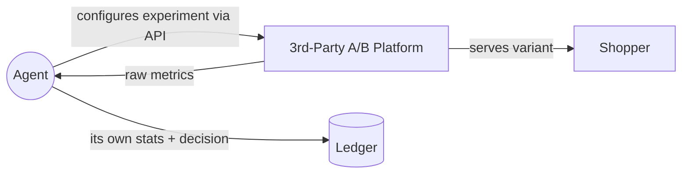

- **Strengths:** Fastest to a working product: bucketing, anti-flicker, and serving are solved. Battle-tested delivery. Lowest engineering build.
- **Weaknesses:** Per-store platform cost and account sprawl; we inherit the platform's stats model and limits (may not support our Bayesian/sequential preference natively, so we re-derive decisions from raw events); dependency on a vendor's roadmap and pricing; integration surface differs per platform.

---

#### Option 2: Self-hosted variant serving via JS snippet / edge worker

We own the serving layer: a lightweight script (and/or an edge worker, e.g., Cloudflare Workers) that we install on the storefront buckets visitors, applies the variant (DOM/content changes), and emits events to our own pipeline. The agent configures experiments directly against **our** serving infrastructure.

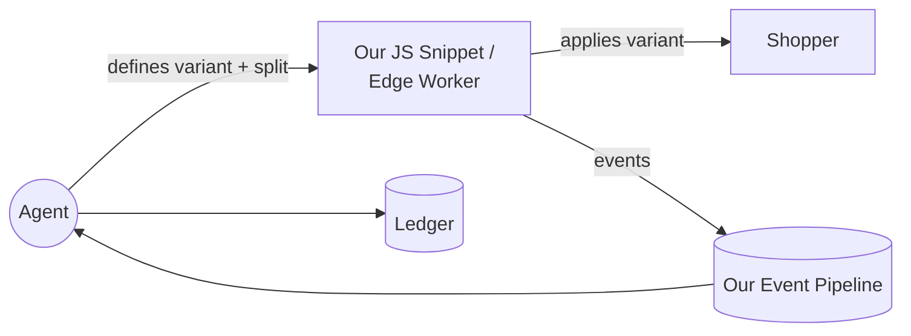

- **Strengths:** Full control: our own bucketing, our own Bayesian/sequential stats end-to-end, no per-store platform fees, uniform integration across all stores. Best long-run margin and flexibility. Owns the data.
- **Weaknesses:** We must build and harden serving ourselves: including **anti-flicker** (FOOC: flash of original content), performance budget, consent/bucketing correctness, and cross-device identity. Higher upfront engineering and ongoing reliability burden. A bug here directly touches the customer's live store.

---

#### Option 3: Platform-native app (e.g., Shopify app/theme)

The agent operates as a **native commerce-platform app** (primarily Shopify), mutating the storefront through the platform's own theme/app surfaces and using platform-native or app-bundled experiment primitives. Deeply integrated with one ecosystem.

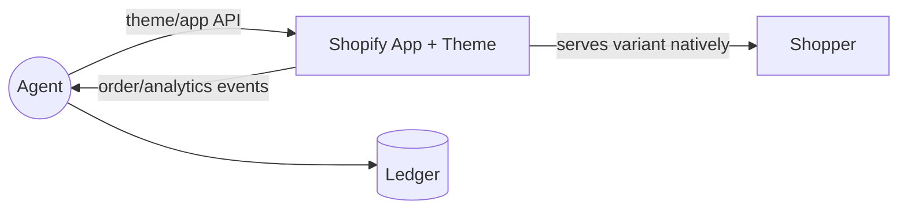

- **Strengths:** Tightest integration with the dominant platform: native install/distribution (app store), direct access to catalog/orders/theme, less flicker risk than injected JS, trusted by merchants. Great onboarding.
- **Weaknesses:** Platform lock-in: non-Shopify stores need a separate path; bound by Shopify's app review, theme constraints, and API limits; least portable. Builds deep value in one ecosystem at the cost of breadth.

---

### 6.3 Comparison Matrix

| Dimension | Option 1, 3rd-party platform | Option 2, Self-hosted JS/edge | Option 3, Platform-native (Shopify) |
|-----------|-------------------------------|--------------------------------|--------------------------------------|
| **Serving owned by** | Vendor | **Us** | Platform |
| **Engineering build** | Low | **High** | Medium |
| **Time to first value** | **Fastest** | Slowest | Fast |
| **Per-store cost** | High (platform fees) | **Low** | Low-medium |
| **Stats flexibility (Bayesian/sequential, D2)** | Constrained by vendor | **Full** | Medium |
| **Anti-flicker / performance** | **Solved by vendor** | We must build | Mostly native |
| **Cross-platform reach** | Broad (any site w/ snippet) | **Broad** | Shopify-bound |
| **Data ownership** | Partial | **Full** | Partial |
| **Vendor/platform lock-in** | High (vendor) | **None** | High (Shopify) |
| **Margin at scale** | Lowest | **Highest** | Medium |

### 6.4 Recommendation

**Recommended: a phased path: start Shopify-native (Option 3), converge on self-hosted serving (Option 2).**

- **Phase A (speed to value, validate the agent):** Ship as a **Shopify-native app (Option 3)**. Target stores are predominantly Shopify (§4.3), so a native app gives the fastest onboarding, native distribution via the app store, direct access to catalog/orders/theme, and the least flicker risk: letting us validate the *agent* (ideation quality, measurement, autonomy) before investing in our own serving infrastructure. Non-Shopify stores are deferred to Phase B. Even in Phase A we run **our own** Bayesian/sequential decisioning on the raw events so the measurement engine (D2) is ours from day one. _(Option 1: driving a 3rd-party A/B platform via API; remains the fallback for any non-Shopify pilot before Phase B.)_
- **Phase B (own the margin and the stack):** Build **Option 2**: self-hosted edge/JS serving; once the agent is proven. This removes per-store platform fees (the managed-service margin driver, §2.1), unifies integration across all stores regardless of platform, and gives end-to-end control of stats and data. The execution-model abstraction (6.1) means this swap doesn't touch the agent brain.

This phasing mirrors CO-DESIGN-0002's philosophy: **earn the right to build the harder, higher-control system by first proving the cheap version works.** It also de-risks D1: we don't have to pick the final serving model before we've validated the agent.

**How this design addresses each gap (§5.2):**

| Gap | Addressed by |
|-----|--------------|
| G1 No autonomous ideation | Ideation engine (D4); §6.1 brain, §7.1 Ideation component |
| G2 No trustworthy measurement | Adaptive Bayesian/sequential measurement engine (D2), ours from Phase A |
| G3 No safe mutation | Guardrail engine: blast-radius caps, real-time health, auto-rollback (D3) |
| G4 No risk-gated autonomy | Configurable autonomy tiers per category (D3) |
| G5 No variant generation | LLM variant generator bounded by brand/accessibility guardrails (D5) |
| G6 No outcome attribution | Attribution + wins ledger (D6) |
| G7 No execution abstraction | Serving-independent agent brain + abstracted execution layer (D1) |
| G8 Scanner signal dead-ends | Scanner findings feed the ideation backlog (D4) |

### 6.5 Key Design Decisions

| ID | Title |
|----|-------|
| D1 | Execution / serving model |
| D2 | Measurement rigor across traffic levels |
| D3 | Autonomy & guardrails model |
| D4 | Ideation engine |
| D5 | Variant generation |
| D6 | Outcome attribution |
| D7 | Tech stack & data store |
| D8 | Compliance & safety posture |

#### D1: Execution / serving model

- **Question:** How are variants actually served to live storefront traffic?
- **Options:**

| Option | Description | Trade-off |
|--------|-------------|-----------|
| 1. 3rd-party A/B platform via API | Drive VWO/Optimizely/native app | Fastest, lowest build; vendor cost + lock-in, constrained stats |
| 2. Self-hosted JS/edge | We own serving + bucketing | Best margin/control; high build, we own flicker/perf risk |
| 3. Platform-native (Shopify) | Native app + theme | Best Shopify onboarding; platform-bound, least portable |

- **Status:** **Decided (phased): Phase A → Shopify-native (Option 3); Phase B → self-hosted edge/JS (Option 2).** Option 1 is the non-Shopify fallback for Phase-A pilots only.
- **Rationale:** Target stores are predominantly Shopify (§4.3), so a native app validates the agent fastest with serving/flicker solved; converge on owned serving in Phase B for margin, full stats control, and cross-platform reach. The execution-model abstraction (§6.1) makes the Phase A→B swap invisible to the agent brain.

#### D2: Measurement rigor across traffic levels

- **Question:** How do we produce trustworthy decisions across low- to mid-traffic stores?
- **Options:** Fixed-sample frequentist · Bayesian · Sequential · Multi-armed bandit · Hybrid (method chosen per store by traffic).
- **Status:** **Leaning: hybrid, Bayesian/sequential default.** Bandits for eligible high-traffic, always-on optimizations.
- **Rationale:** Sequential/Bayesian need 20 to 80% fewer users and give intuitive probabilities ([Appendix A](#appendix-a--cro-tooling--methods-research)); fixed-sample only where traffic supports it. Enforce minimum-runtime and stop rules to prevent peeking errors.

#### D3: Autonomy & guardrails model

- **Question:** What ships without a human, per category, and what stops it from causing harm?
- **Options:** `| Tier | Behavior |`; **Propose-only** (human approves all) · **Auto-run, approve winners** (launches autonomously, human approves roll-to-100%) · **Fully autonomous** (ships within guardrails). Applied **per action category**.
- **Status:** **Decided in principle: configurable autonomy tiers, per category, owner-set + operator-overridable.** Defaults: copy/layout → fully autonomous; pricing/checkout → propose-only.
- **Rationale:** Mirrors a Claude-Code-style permission model. Hard guardrails (revenue floors, blast-radius caps, auto-rollback) apply at every tier and are inviolable (§9.5).

#### D4: Ideation engine

- **Question:** How are hypotheses generated and prioritized?
- **Options:** Scanner-findings-seeded · analytics-anomaly-driven · LLM-reasoned from best practice · all three combined; prioritized by **expected lift × confidence × ease**.
- **Status:** **Leaning: combined, scanner-seeded, with an explicit prioritization score.**
- **Rationale:** Grounding in the scanner's real findings + the store's own analytics avoids generic suggestions (G1); the score keeps the backlog ranked and biases toward high-lift tests on low-traffic stores ([Appendix A](#a1)).

#### D5: Variant generation

- **Question:** How are concrete copy/layout variants produced and kept on-brand and accessible?
- **Options:** LLM generation bounded by a per-store **brand/voice guardrail profile** + accessibility checks + safe-mutation constraints (no breaking selectors/structure).
- **Status:** **Leaning: LLM generation within an explicit brand profile + automated accessibility/safety gate.**
- **Rationale:** On-brand, accessible variants are a hard requirement (G5, §9); a brand profile + automated checks make generation trustworthy enough to run without per-variant human copy review at the autonomous tier.

#### D6: Outcome attribution

- **Question:** How is dollar lift computed and reported to the owner?
- **Options:** Per-experiment conversion delta + revenue delta vs. control; cumulative lift vs. held-back baseline; surfaced as a plain-language **wins ledger**.
- **Status:** **Leaning: per-experiment conversion + revenue delta, plus a portfolio-level holdback for cumulative attribution.**
- **Rationale:** Attributable dollars are the entire value prop (§2.1, G6). A holdback group guards against attribution drift and false-win accumulation (§2.3 false-win ≤5%).

#### D7: Tech stack & data store

- **Question:** Orchestration runtime, serving infra, experiment store, LLM provider?
- **Status:** **TBD.** Constrained by D1 (serving) and the managed-service operating model.
- **Rationale:** Defer until D1's Phase-A pick is made; the agent brain is serving-independent so the store/runtime can be chosen early without blocking on serving.

#### D8: Compliance & safety posture

- **Question:** Consent/privacy for visitor bucketing, accessibility of generated variants, brand-safety review?
- **Status:** **TBD: decided in principle:** respect consent/privacy law for experimentation cookies/bucketing; generated variants must meet accessibility standards; brand-safety gate on all autonomous variants.
- **Rationale:** A managed service mutating customer storefronts inherits the customer's compliance obligations; detailed in §9.5.

## 7. Key Components & Data Model

### 7.1 Components

The agent decomposes into eight components. The first five are the **agent brain** (serving-independent); the last three are the **control, execution, and surface** layers.

| # | Component | Responsibility (single sentence) | Interfaces / API surface | Data it owns |
|---|-----------|----------------------------------|--------------------------|--------------|
| C1 | **Ideation Engine** (D4) | Turns scanner findings + store analytics + CRO best practice into a prioritized hypothesis backlog. | `proposeHypotheses(store) → [Hypothesis]`; reads scanner + analytics | Hypothesis backlog, prioritization scores |
| C2 | **Variant Generator** (D5) | Produces concrete, on-brand, accessible copy/layout variants for a hypothesis. | `generateVariants(hypothesis, brandProfile) → [Variant]` | Variant specs, brand profile |
| C3 | **Experiment Orchestrator** | Configures, launches, and lifecycle-manages an experiment against the execution layer. | `launch(experiment)`, `stop(experiment)`, `ship(variant)` | Experiment definitions, state |
| C4 | **Measurement Engine** (D2) | Chooses the statistical method per store traffic and computes the running decision (ship/kill/continue). | `analyze(experiment) → Decision`; consumes events | Stats models, decision history |
| C5 | **Attribution & Ledger** (D6) | Computes per-experiment and cumulative conversion + revenue lift; renders the owner-facing wins ledger. | `attribute(experiment) → LiftReport`; `ledger(store)` | Wins ledger, holdback baselines |
| C6 | **Guardrail / Autonomy Engine** (D3) | Enforces autonomy tier per category, blast-radius caps, revenue floors; runs real-time health monitoring and auto-rollback. | `gate(action) → allow/approve/deny`; `monitor(experiment)`; `rollback(experiment)` | Autonomy config, guardrail state, health metrics |
| C7 | **Execution Adapter** (D1) | Abstracts the serving mechanism (Shopify app in Phase A, self-hosted edge in Phase B) behind one interface. | `serve(variant, split)`, `collectEvents()` | Adapter config, bucketing state |
| C8 | **Surfaces** | Owner dashboard (guardrails, approvals, ledger) and operator console (supervision, tuning, override). | Web UI + API | UI state, audit log |

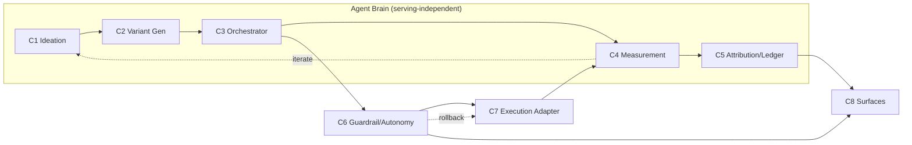

### 7.2 Data Model

Core entities and relationships:

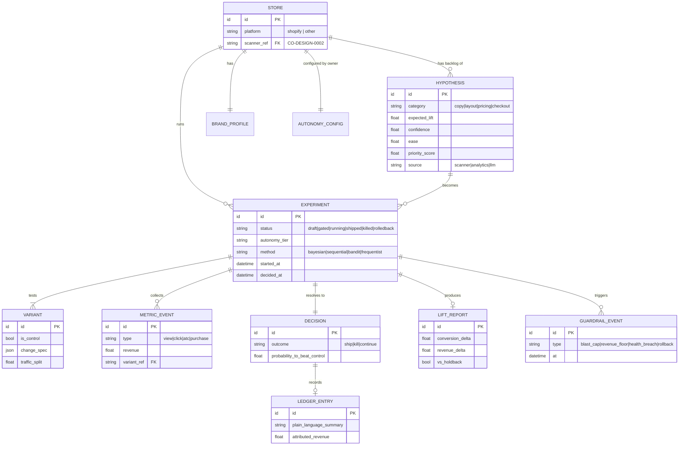

**Key entities:**
- **Store**: a customer storefront; links to its scanner record, brand profile, and autonomy config.
- **Hypothesis**: a testable idea with a prioritization score (expected lift × confidence × ease) and a source.
- **Experiment**: a running trial; carries its autonomy tier, statistical method, and lifecycle status.
- **Variant**: one version (control or treatment) with a change spec and traffic split.
- **Metric Event**: a single observed shopper action with optional revenue.
- **Decision**: the measurement engine's verdict, with the probability it beats control.
- **Lift Report / Ledger Entry**: attributable conversion + revenue delta, and its plain-language owner-facing rendering.
- **Guardrail Event**: any guardrail activation (cap hit, floor breach, rollback); the audit trail.

### 7.3 Data Flows

**Primary flow: one experiment, end to end:**

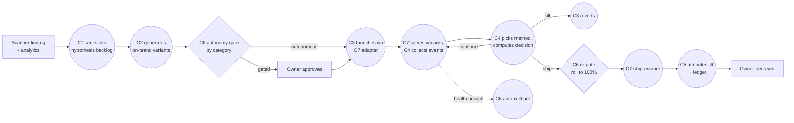

**Two cross-cutting flows:**
- **Real-time safety loop**: while any experiment runs, C6 continuously monitors store health (conversion, revenue, errors) and can auto-rollback independent of the measurement decision. This loop is always-on and overrides autonomy.
- **Learning loop**: every Decision and Lift Report feeds back into C1's priors, so ideation improves per-store and across the portfolio over time (the compounding effect, §1.7).

## 8. Use Cases

The primary use cases, derived from the personas (§1.4). Squares are actors, circles are use cases; dashed arrows show one use case triggering another.

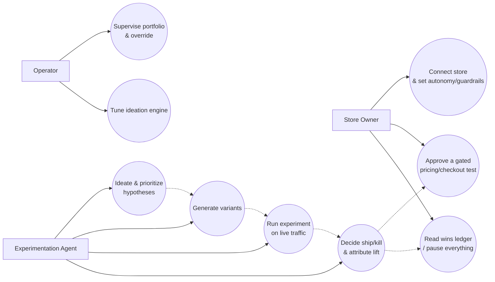

**Key use cases (actor → goal → flow):**

- **UC1: Onboard a store** *(Store Owner)* → start getting safe, automated experiments → connect store, pick autonomy tier, set revenue floor / brand rules / no-touch zones.
- **UC2: Approve a gated experiment** *(Store Owner)* → allow a higher-risk pricing/checkout test → review the agent's proposed change + expected impact on a single approve/decline card.
- **UC3: Review results & control** *(Store Owner)* → see what's working and stay in control → read the wins ledger; pause all experiments instantly if desired.
- **UC4: Supervise the portfolio** *(Operator)* → keep many stores safe and productive → monitor running experiments, triage anomalies and stalled approvals, override autonomy where needed.
- **UC5: Tune ideation** *(Operator)* → improve hypothesis quality → adjust the ideation engine per store or globally.
- **UC6-UC9: Run the loop** *(Agent)* → continuously lift conversion → ideate & prioritize, generate variants, run on live traffic, decide ship/kill and attribute dollar lift.

## 9. Customer Journey

The end-to-end journey of the **Store Owner** (primary user) from signup to recurring value, and where the agent's loop runs underneath.

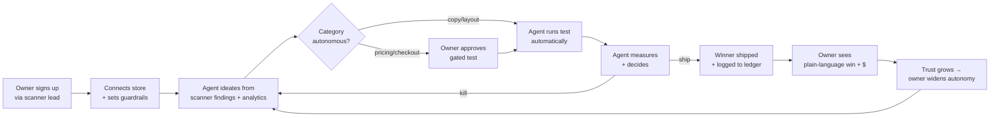

*The journey is a loop, not a funnel: each shipped win compounds trust, which widens the autonomy the owner grants, which lets the agent do more; the flywheel behind the managed-service model.*

## 10. Architecture Diagrams

### 10.1 Context Diagram

The system in its environment; see [§1.3](#13-context) for the annotated context diagram (signals in, experiment loop, owner/operator roles) and [§3.3](#33-system-boundaries) for the owned-vs-assumed boundary diagram. They are placed in those sections because they set the stage for the whole document.

### 10.2 Use Case Diagram

Actors (squares) and the use cases (circles) they drive. The **Store Owner** governs; the **Operator** supervises; the **Agent** does the work; the **Scanner** and **Shopper** are system/indirect actors.

```mermaid
graph LR
    OWNER[Store Owner]
    OP[Operator]
    AGENT[Experimentation Agent]
    SCANNER[Site Scanner 0002]
    SHOPPER[Shopper]

    OWNER --> UC1((Set autonomy tier\n& guardrails))
    OWNER --> UC2((Approve gated\nexperiment))
    OWNER --> UC3((Read wins ledger))
    OP --> UC4((Supervise &\noverride))
    OP --> UC5((Tune ideation\nengine))
    AGENT --> UC6((Ideate\nhypotheses))
    AGENT --> UC7((Generate\nvariants))
    AGENT --> UC8((Run experiment))
    AGENT --> UC9((Decide\nship/kill))
    AGENT --> UC10((Attribute lift))
    SCANNER -.-> UC6
    SHOPPER -.-> UC8
    UC6 -.-> UC7
    UC7 -.-> UC8
    UC8 -.-> UC9
    UC9 -.-> UC10
    UC9 -.-> UC2

```

*Squares = actors (color-coded by type: green = owner, amber = operator, blue = agent, grey = system/indirect); circles = use cases; dashed arrows = use case triggers another or feedback.*

### 10.3 Sequence Diagram: Experiment Lifecycle

The interaction across components for a single autonomous experiment, including the gated-approval branch and the safety rollback.

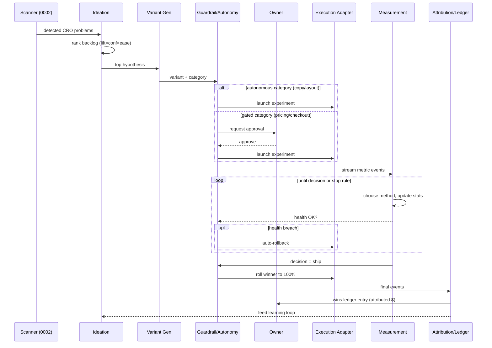

### 10.4 Entity Relationship Diagram

See [§7.2](#72-data-model) for the ERD (Store, Hypothesis, Experiment, Variant, Metric Event, Decision, Lift Report, Ledger Entry, Guardrail Event).

### 10.5 System / Component Diagram

See [§7.1](#71-components) for the component diagram (C1 to C8: agent brain + guardrail + execution adapter + surfaces).

## 11. Non-Functional Requirements & Constraints

_Targets marked <Assumption /> are directionally right but unvalidated: tune with real data._

### 11.1 Performance

- **No measurable storefront slowdown.** The variant-serving layer must add <Assumption>&lt; 50ms</Assumption> to page load and **must not cause flicker (FOOC)**: the shopper never sees control flash before treatment. Native Shopify rendering (Phase A) and anti-flicker on the edge worker (Phase B) are the mechanisms.
- **Real-time health monitoring latency.** Guardrail health checks (C6) evaluate store health on a <Assumption>≤ 1-minute</Assumption> cadence so harm is caught and rolled back fast.
- **Decision freshness.** The measurement engine (C4) recomputes an experiment's decision at least <Assumption>hourly</Assumption>, more often for high-traffic stores.
- **Ideation throughput.** The agent maintains a non-empty hypothesis backlog per active store so there is always a next experiment ready when one concludes.

### 11.2 Security

- **Least-privilege store access.** The agent holds the narrowest scopes needed to read analytics/catalog and serve variants: never more (e.g., no customer PII, no payment data, no order-management write access). Pricing/checkout categories require human approval *and* elevated, audited scopes.
- **Authentication & isolation.** Per-store credentials are isolated; one customer's data, experiments, and config are never visible across the multi-tenant boundary.
- **Full audit trail.** Every agent action, guardrail event, autonomy decision, and human approval is logged immutably (the `GUARDRAIL_EVENT` + audit log, §7.2) and attributable to the agent, the owner, or the operator who took it.
- **Secrets handling.** Store API tokens and LLM provider keys are stored in a secrets manager, never in experiment data or logs.

### 11.3 Scalability

- **Many stores per operator.** The system must support the §2.3 target of <Assumption>≥ 25 active stores per operator</Assumption>, scaling to hundreds of concurrent stores without linear operator growth: the managed-service margin thesis.
- **Concurrent experiments per store.** Support multiple non-overlapping experiments per store with interaction-aware scheduling (avoid two experiments mutating the same page region simultaneously).
- **Event volume.** The measurement pipeline ingests every shopper metric event across all stores; it must scale horizontally with traffic and degrade gracefully (sampling) rather than dropping decisions.

### 11.4 User Experience

UX requirements per persona (from [§1.4](#14-system-users--personas)):

**Store Owner (primary, DIY: non-expert):**
- **Plain language, zero jargon.** The owner sees a **wins ledger** ("Your product-page headline change lifted add-to-cart 6%: about +$1,200/mo"), never p-values, confidence intervals, or method names.
- **Control without complexity.** Setting the autonomy tier and guardrails is a guided, low-friction setup (sliders/toggles, sensible defaults): modeled on a Claude-Code-style permission prompt, not a config console.
- **Approvals are effortless.** Gated experiments (pricing/checkout) surface as a single clear approve/decline card with the expected impact and the exact change.
- **Trust through transparency.** The owner can always see what's running, pause everything instantly ("big red button"), and view the full history.

**Operator (secondary, us: expert):**
- **Supervision at scale.** The operator console surfaces a portfolio view: which stores have running experiments, which need attention (anomalies, gated approvals stalled), and which guardrails fired.
- **Override and tune.** The operator can override any autonomy decision, pause/resume experiments, and tune the ideation engine per store or globally.

### 11.5 Compliance & Constraints

**Hard guardrails ("the agent must never…"): inviolable at every autonomy tier:**

| # | The agent must never… | Enforced by |
|---|------------------------|-------------|
| 1 | …ship a change that breaches the owner's **revenue floor** or **blast-radius cap** | C6 guardrail engine |
| 2 | …leave a harmful experiment running; it must **auto-rollback** on health breach within the monitoring window | C6 real-time loop |
| 3 | …autonomously change **pricing or checkout**: those always require human approval | C6 autonomy tiers |
| 4 | …generate variants that violate the **brand/voice profile** or **accessibility standards** | C2 + brand/a11y gate |
| 5 | …lose the **audit trail**: every action is logged and attributable | Audit log (§9.2) |
| 6 | …touch a customer's **no-touch zones** (owner-designated pages/elements) | C6 + brand profile |
| 7 | …exceed its **least-privilege scopes** (no PII, no payment data) | §9.2 access model |

**Constraints imposed by the environment:**
- **Platform limits (Phase A):** Shopify app review, theme/app API rate limits, and what the platform permits an app to mutate constrain the action space. <Assumption>** Shopify's app + theme APIs permit the copy/layout mutations the autonomous tier needs.**</Assumption>
- **Consent & privacy:** Visitor bucketing uses cookies/identifiers subject to consent and privacy law (GDPR/CCPA-class); experimentation must respect the store's existing consent mechanism. _(D8)_
- **Statistical integrity:** Enforce minimum-runtime and pre-registered stop rules to prevent peeking/false-positive inflation; never declare a win the chosen method doesn't support. _(D2)_
- **Accessibility:** Generated variants must meet accessibility standards (e.g., WCAG-class contrast, alt text, semantic structure): a brand-safety *and* legal requirement. _(D8)_

## 12. Phases

Delivery is phased to mirror the execution-model decision (D1) and the trust-building flywheel: prove the agent cheaply, then own the stack.

| Phase | Focus | Who builds | Exit criteria |
|-------|-------|-----------|---------------|
| **P1: Validate the agent** | Shopify-native app; autonomous copy/layout experiments; our own Bayesian/sequential measurement on raw events | Operator (founding team) + agent | First shipped wins on real stores; decision yield ≥70% |
| **P2: Widen & gate** | Add human-approved pricing/checkout experiments; operator console for portfolio supervision | Operator + agent | Multiple stores per operator; gated-approval flow in use |
| **P3: Own the serving stack** | Self-hosted edge/JS serving (Option 2); cross-platform reach beyond Shopify | Operator (engineering) | Per-store platform fees removed; non-Shopify store live |

**RACI: who is Responsible / Accountable / Consulted / Informed per workstream:**

| Workstream | Responsible | Accountable | Consulted | Informed |
|-----------|-------------|-------------|-----------|----------|
| Ideation engine (D4) | Agent | Operator | Store Owner |; |
| Variant generation (D5) | Agent | Operator | Store Owner (brand) |; |
| Run / measure experiments (D2) | Agent | Operator |; | Store Owner |
| Ship autonomous (copy/layout) | Agent | Operator |; | Store Owner |
| Ship gated (pricing/checkout) | Agent | Store Owner | Operator |; |
| Guardrails & rollback (D3) | Agent | Operator | Store Owner | Store Owner |
| Serving infrastructure (D1) | Operator | Operator |; | Store Owner |
| Attribution & wins ledger (D6) | Agent | Operator |; | Store Owner |

## 13. Risks, Dependencies & Open Questions

### 13.1 Risks

| Risk | Likelihood | Impact | Mitigation |
|------|-----------|--------|------------|
| **R1: False wins on thin traffic.** Agent ships a "winner" that's really noise, hurting conversion. | Medium | High | Bayesian/sequential methods (D2), minimum-runtime + stop rules, portfolio holdback to catch false wins, false-win ≤5% target (§2.3) |
| **R2: Live-store harm.** A variant or serving bug tanks conversion or breaks the page on real revenue traffic. | Medium | **Critical** | Real-time health loop + auto-rollback (C6, hard guardrail #2), blast-radius caps, anti-flicker, staged rollout before 100% |
| **R3: Generic/off-brand ideation.** Agent proposes weak or off-voice changes; customer loses trust in the "intelligence." | Medium | High | Scanner-grounded + analytics-grounded ideation (D4), brand profile + a11y gate (D5), operator tuning |
| **R4: Context/state management across the loop.** Passing scanner findings → ideation → generation → measurement without losing context or exceeding LLM limits. | Medium | Medium | Structured experiment store as the source of truth (§7.2); agent reads from the store, not from one long context; bounded per-phase context |
| **R5: Attribution disputes.** Owner doesn't believe the claimed dollar lift; churns. | Medium | High | Holdback-based attribution (D6), transparent ledger, conservative claims, ability to show the control-vs-variant data |
| **R6: Platform dependency (Phase A).** Shopify app-review, API limits, or policy changes block the autonomous action space. | Low-Med | High | Execution abstraction (G7) enables Phase B self-hosted fallback; stay within documented app capabilities; Option 1 fallback for non-Shopify |
| **R7: Privacy/consent non-compliance.** Bucketing cookies run afoul of consent law in a customer's market. | Low | High | Respect store's consent mechanism, server-side bucketing where possible (D8, §9.5) |
| **R8: Operator overload.** One operator supervising many stores misses an anomaly. | Medium | Medium | Portfolio attention-routing in operator console (§9.4), auto-rollback reduces reliance on human vigilance |

### 13.2 Dependencies

- **CO-DESIGN-0002 Site Scanner**: supplies detected CRO problems as hypothesis seeds. The interface (shared store vs. API) must be defined. _Hard dependency for the grounded-ideation value prop._
- **Commerce platform (Shopify, Phase A)**: app/theme APIs for serving variants and order/analytics data for outcomes.
- **LLM provider**: powers ideation (C1) and variant generation (C2).
- **Variant-serving infrastructure**: Shopify app (Phase A) → self-hosted edge/JS (Phase B).
- **Analytics / order data source**: ground truth for conversion and revenue attribution.
- **Secrets management & multi-tenant data store**: for per-store credentials, config, and experiment data.

### 13.3 Open Questions

- **OQ1 (D7):** What is the orchestration runtime and experiment data store? _(Deferred until Phase-A Shopify build begins; agent brain is serving-independent so this won't block ideation/measurement design.)_
- **OQ2 (D1):** What exactly is the CO-DESIGN-0002 → this-agent interface: shared database, event stream, or API call?
- **OQ3 (D6):** Does every store get a permanent portfolio holdback (cleanest attribution, small lift cost), or only during onboarding? Trade-off between attribution rigor and realized lift.
- **OQ4 (D3):** What are the *default* guardrail values (revenue floor %, blast-radius cap %) shipped before an owner customizes them?
- **OQ5 (D2):** Where exactly is the line where the agent declines to run an experiment because a store's traffic is too low for *any* method to decide in a reasonable window? Is there a "too small to test" floor?
- **OQ6 (R4):** Concrete context-management strategy across the agent phases: flagged as a common top risk in agentic systems.
- **OQ7:** Pricing/packaging of the managed service (per-store flat, % of attributed lift, tiered): affects the operator-leverage math but is a commercial, not architectural, question.

### 13.4 FAQ

_This FAQ doubles as a **question-index** into the document: each answer links to the section that covers it in full._

- **Q: Is this the same product as the Site Scanner?**
  No. The scanner *finds* problems and generates leads (the front door); this agent *fixes* them via experimentation (the paid service). They share the scanner's signal but are distinct systems. → [§1.1 Purpose](#11-purpose), [§3.2 Out of Scope](#32-out-of-scope)

- **Q: Can the agent change prices or checkout on its own?**
  No; those categories are supported but always require human approval (hard guardrail #3). Only copy and layout run fully autonomously by default. → [§3.1 In Scope](#31-in-scope), [§6.5 D3](#65-key-design-decisions), [§11.5 Hard Guardrails](#115-compliance--constraints)

- **Q: What stops it from tanking my store?**
  Blast-radius caps, revenue floors, real-time health monitoring, and automatic rollback, all under limits the owner sets and the operator can tighten. → [§11.5 Compliance & Constraints](#115-compliance--constraints), [§7.1 Guardrail Engine](#71-components)

- **Q: How does it work on a small store with little traffic?**
  It uses Bayesian/sequential methods that need far fewer visitors than classic A/B testing, biases toward high-impact changes, and won't declare a win the data doesn't support; if a store is below the testable floor, it says so rather than guessing. → [§4.3 Statistical Reality](#43-the-statistical-reality-for-mid-market-stores), [§6.5 D2](#65-key-design-decisions), [§13.3 OQ5](#133-open-questions)

- **Q: How do I know it's actually working?**
  The wins ledger shows attributable conversion and revenue lift per shipped change, measured against a held-back baseline; in plain language, not statistics. → [§6.5 D6](#65-key-design-decisions), [§11.4 User Experience](#114-user-experience)

- **Q: How are variants actually served on my live store?**
  Phase A runs as a Shopify-native app; Phase B moves to self-hosted serving. The agent's reasoning is independent of the serving mechanism. → [§6.2 Architecture Options](#62-architecture-options), [§6.4 Recommendation](#64-recommendation), [§6.5 D1](#65-key-design-decisions)

- **Q: Who operates it: me or you?**
  It's a managed service: operators (us) supervise the agent across stores; you (the owner) set guardrails, approve gated tests, and read the ledger. → [§1.4 Personas](#14-system-users--personas), [§2 Objectives](#2-objectives)

## Appendices

### Appendix A: CRO Tooling & Methods Research

_Researched 2026-06-22 to inform Section 4 (Current State) and the execution/measurement decisions D1 to D2 in Section 6._

#### A.1 Tooling landscape (2026)

The ecommerce A/B-testing market in 2026 splits into Shopify-native apps, full experience/CRO platforms, and analytics/behavior tools:

- **Shopify-native A/B apps**: Shoplift integrates directly with the Shopify theme editor so variants are built without leaving Shopify admin, with no site-speed impact; Intelligems and ABConvert occupy similar native niches. These target self-directed Shopify merchants.
- **Full experience/CRO platforms**: VWO is positioned as the operator default for ecommerce stores in the ~£100K-£5M/year band, bundling A/B + multivariate testing, personalization, heatmaps, and session recording. Optimizely and Dynamic Yield target enterprise/Shopify Plus brands needing deep personalization.
- **Analytics/behavior tools**: heatmaps, session replay, and funnel analytics produce insight a human must still turn into a test.

:::tip[Design implication]
Every incumbent stops at "platform + insight; you do the work." None close the ideate → build → run → decide → ship loop autonomously. This confirms the agent's wedge (Sections 4.2, 5) and that the agent likely *drives* one of these serving mechanisms rather than reinventing variant delivery (informs **D1**).
:::

#### A.2 Frequentist vs. Bayesian for low/mid traffic

[^a2]: Convert.com, *Frequentist vs Bayesian A/B Testing: How to Choose*. Bayesian methods yield a direct probability statement ("there's a 91% chance B beats A") rather than a p-value, which is both more usable on constrained sample sizes and easier to communicate. [www.convert.com/blog/a-b-testing/frequentist-vs-bayesian-ab-testing](https://www.convert.com/blog/a-b-testing/frequentist-vs-bayesian-ab-testing/) (accessed 2026-06-22)

:::tip[Design implication]
Favors a Bayesian/sequential default for the measurement engine (**D2**), with frequentist available where traffic supports it.
:::

#### A.3 The low-traffic significance problem

[^a3]: CraftUp, *A/B Testing Low Traffic: Sequential Testing Guide* / Mantas Digital, *A/B Testing for Small eCommerce Stores*; with ~500 weekly users at a 2% baseline conversion rate, detecting a 50% relative improvement via fixed-sample frequentist testing takes on the order of **16 weeks**. Waiting 6 to 8+ weeks for significance kills momentum for small stores. [craftuplearn.com/blog/ab-testing-low-traffic-sequential-testing-smart-baselines](https://craftuplearn.com/blog/ab-testing-low-traffic-sequential-testing-smart-baselines) · [www.mantasdigital.com/cro-2/ab-testing-small-ecommerce-stores](https://www.mantasdigital.com/cro-2/ab-testing-small-ecommerce-stores/) (accessed 2026-06-22)

[^a1]: Same sources; practical guidance for small stores: test **bold, high-impact changes** (≥30% expected relative lift), not micro-tweaks, because only large effects are detectable on thin traffic; test one visible behavior at a time.

:::tip[Design implication]
The ideation engine (**D4**) should bias toward high-expected-lift hypotheses for low-traffic stores and avoid low-effect micro-tests; the measurement engine (**D2**) must adapt method to traffic.
:::

#### A.4 Sequential testing efficiency

[^a4]: Analytics-Toolkit / SplitMetrics; sequential testing can require **20 to 80% fewer users** than an equivalent fixed-sample test to reach a decision; multi-armed bandits further reduce regret by shifting traffic toward winners during the test. [blog.analytics-toolkit.com/2019/a-b-testing-with-a-small-sample-size](https://blog.analytics-toolkit.com/2019/a-b-testing-with-a-small-sample-size/) · [splitmetrics.com/blog/bayesian-a-b-testing](https://splitmetrics.com/blog/bayesian-a-b-testing/) (accessed 2026-06-22)

:::tip[Design implication]
Sequential/bandit methods are the lever that makes mid-market stores viable; central to **D2** and to the "decision yield ≥70%" success criterion (§2.3).
:::

## 14. Revision Log

| Date | Author | Section | Change |
|------|--------|---------|--------|
| 2026-06-22 | Omar Eid | All | Initial scaffold |
| 2026-06-22 | Omar Eid | 1 to 10, App. A | Full co-design draft. Established managed-service framing, risk-gated autonomy (all areas supported; copy/layout autonomous, pricing/checkout human-approved), Shopify-first phased execution model (D1 decided), Bayesian/sequential measurement (D2), 8-component architecture, ERD, NFRs + 7 hard guardrails, risk register. Sourced CRO/methods research in Appendix A. Status → In Review. |
| 2026-06-22 | Omar Eid | Header, Exec Summary, 1.4, 8, 9, 12, 13.4 | Converted metadata to YAML front matter; added Executive Summary; added user-profile diagram to Personas; added Use Cases (§8) + Customer Journey (§9) sections with diagrams; added Phases (§12) with RACI table; converted FAQ to a linked question-index. Renumbered sections. Moved to `public/`. Conforms to co-design schema (`scripts/validate_co_designs.py`). |
