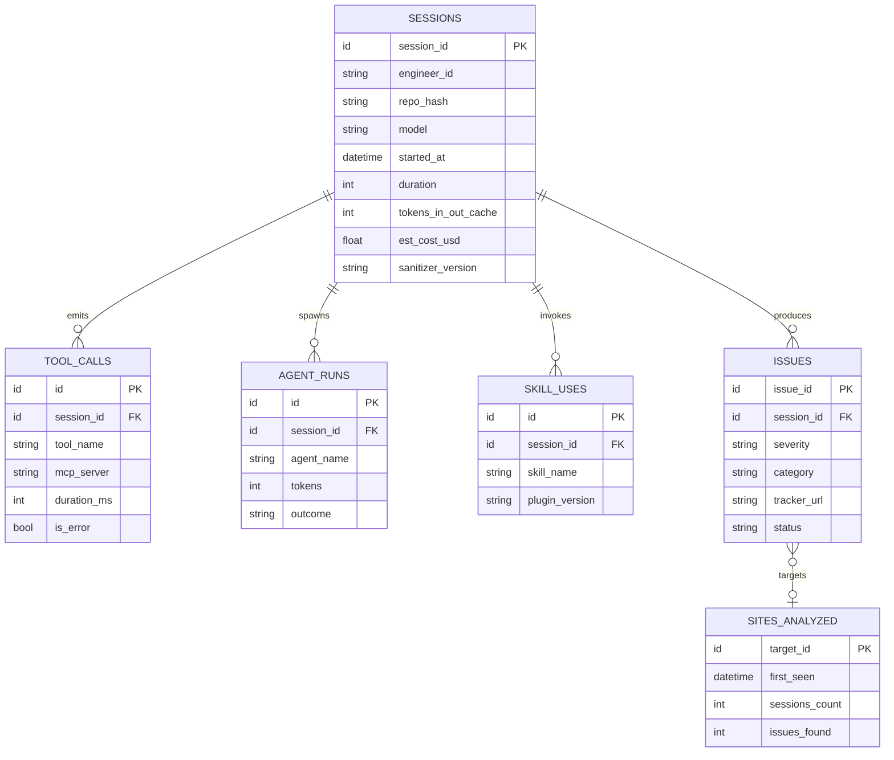
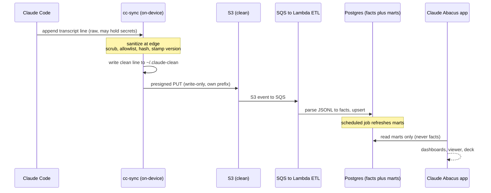
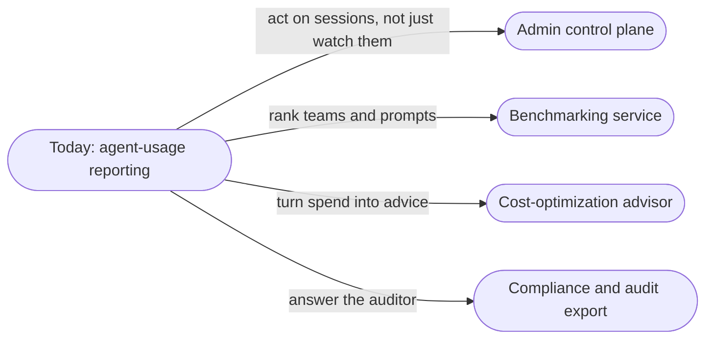

# Claude Abacus: Measuring the Value Claude Adds Across Distributed Sessions

## Who it's for and what they do with it

**Who.** Three people care about how Claude Code is actually being used across a team. A **platform / developer-experience lead** owns the rollout and has to show it is working. An **engineer** runs Claude Code all day and wants their own usage and the bugs it caught visible, without their raw transcripts (and the secrets in them) leaving their laptop. **Engineering leadership** funds the tool and keeps asking what it returns.

**The problem they share.** The richest signal about the value Claude adds, the session transcripts, is trapped on individual laptops next to raw secrets, so no one can measure it. Tool invocations, agents run, insights generated, bugs found, spend: all invisible in aggregate.

**What we build to fix it.** A reporting mechanism that sanitizes each transcript on-device, uploads only the clean metrics, and turns them into dashboards, a bug pipeline, and a deck. What each person then does with it:

<UseCaseDiagram
  title="Claude Abacus"
  actors={[
    {id: 'lead', label: 'Platform lead', kind: 'internal'},
    {id: 'eng', label: 'Engineer', kind: 'internal'},
    {id: 'exec', label: 'Eng leadership', kind: 'internal'},
  ]}
  useCases={[
    {id: 'adopt', label: 'Track adoption', detail: 'See who is using Claude Code and how much, across all sessions.'},
    {id: 'value', label: 'See value delivered', detail: 'Tool invocations, agents run, insights, and bugs found, per team.'},
    {id: 'own', label: 'See my own usage', detail: 'An engineer sees their sessions and the bugs their agents caught, raw transcripts never leaving the laptop.'},
    {id: 'bugs', label: 'Review found bugs', detail: 'Agent-filed issues land in a deduped pipeline for a human to confirm.'},
    {id: 'roi', label: 'Prove ROI', detail: 'Spend against bugs found and work done, ready for a leadership deck.'},
  ]}
  links={[
    {from: 'lead', to: 'adopt'},
    {from: 'lead', to: 'value'},
    {from: 'eng', to: 'own'},
    {from: 'eng', to: 'bugs'},
    {from: 'exec', to: 'value'},
    {from: 'exec', to: 'roi'},
  ]}
/>

**How it makes their life better.** The lead can prove the rollout is landing, the engineer gets credit for the work their agents do without exposing a single secret, and leadership sees spend against value in numbers they trust.

:::note[Scope]
**Claude Abacus** is a reporting mechanism that consolidates agent-usage metrics across **Distributed Claude Code Sessions (DCCS)**: how many tool invocations run, which agents get used, what insights and bugs they surface, and what it all costs. It (1) collects and sanitizes session transcripts **on-device**, (2) turns them into metrics, dashboards, an issue pipeline, and a deck, and (3) ships a small standardized config so every environment reports the same signal. It is written as a **phased, independently shippable** build: each phase stands on its own, and Stage 1 (1 to 100 engineers) is a strict subset of every later stage, so nothing built early is thrown away when you scale.
:::

<!-- truncate -->

import Mockups from './_mockups/claude-abacus.mdx';

<Mockups />

---

## Executive Summary

You rolled Claude Code out across a team, and you cannot measure what it is doing. The richest signal about the value it adds, the session transcripts, is trapped on individual laptops next to raw secrets that must never leave the device. So tool invocations, agents run, insights generated, bugs found, and spend are all invisible in aggregate. And leadership keeps asking for numbers you can't give. There is no way to report on Distributed Claude Code Sessions.

**The solution** splits into two planes that never blur, and the whole design follows from that split:

```mermaid
graph LR
    subgraph config["CONFIG PLANE &#8212; push"]
        C1[versioned config]
        C2[marketplace + MDM]
    end
    subgraph data["DATA PLANE &#8212; pull and analyze"]
        D1[sanitize on-device]
        D2[warehouse]
        D3[dashboards, bugs, deck]
    end
    C1 --> C2 -.enforces.-> LAP[every laptop]
    LAP --> D1 -->|clean only| D2 --> D3
```



A **config plane** ships one versioned, enforced configuration to every laptop through a plugin marketplace plus MDM-deployed managed settings. A **data plane** runs a small on-device agent that sanitizes transcripts at the edge, uploads only the clean output to a warehouse, and feeds dashboards, a bug pipeline, and a deck studio. Raw transcripts never leave the laptop.

Four decisions anchor the design (spelled out in [Key Decisions](#key-decisions)); the invariants below make them concrete.

**Expected value.** Live token and cost dashboards exist after Phase 1, before any transcript pipeline is built. That is the point: value lands before collection. Everything after is layered on a foundation whose only expensive-to-get-wrong pieces (the sanitizer, the schema, the consent model) are over-built early and the rest is kept deliberately small.

**Status and what is open.** The architecture, the invariants, and the star schema are settled. The open items are cultural more than technical: shipping the consent doc and the "what we collect" page before org-wide upload, and running the pilot gate on two or three volunteer laptops with a manual raw-versus-clean diff before rollout.

---

## The invariants that hold at every scale

These rules do not bend as headcount grows. If a change would violate one, that is a signal to stop and flag it, not to proceed.

| # | Invariant | Why it is non-negotiable |
|---|-----------|--------------------------|
| 1 | **Sanitize at the edge.** | Raw transcripts never leave the laptop. Only sanitized output is ever uploaded. |
| 2 | **Transcripts are append-only.** | Sync is incremental by byte offset. On truncation or inode change, re-sanitize from zero. |
| 3 | **The frontend reads marts only.** | The web app never queries fact tables, only pre-aggregated serving tables. |
| 4 | **Everything is IaC.** | The entire cloud stack is reproducible in a fresh AWS account in under an hour. |
| 5 | **Consent before collection.** | Ship the consent doc and the "what we collect" page before enabling org-wide upload. |
| 6 | **The sanitizer is production code.** | It has its own test suite in CI and a version stamped on every uploaded file. |

Rules 1 to 4 are technical. Rules 5 and 6 are cultural, and equally binding. The trap this whole design guards against is building Stage 3 infrastructure at Stage 1 headcount. Over-build only those three, the sanitizer, the schema, and the consent model; keep everything else deliberately small.

---

## Target Architecture (Stage 1: 1 to 100 engineers)

Two planes, cleanly separated. The **config plane** pushes standardized configuration out to laptops. The **data plane** pulls sanitized transcripts back in and analyzes them. The animated view below traces the full loop.

```mermaid
%% animate: flow
graph LR
    subgraph config["CONFIG PLANE &#8212; push"]
        REPO[claude-fleet monorepo<br/>git]
        MKT[Plugin Marketplace]
        CORE[org-core plugin<br/>skills, agents, hooks, MCP]
        MGD[managed-settings.json<br/>via MDM]
        REPO --> MKT
        REPO --> CORE
        REPO --> MGD
    end

    subgraph laptop["ON-DEVICE"]
        CC[Claude Code]
        SYNC[cc-sync agent<br/>launchd / systemd]
        SAN{{sanitize at edge}}
        CLEAN[(clean mirror<br/>~/.claude-clean)]
        CC --> SYNC --> SAN --> CLEAN
    end

    subgraph cloud["DATA PLANE &#8212; pull and analyze"]
        S3[(S3 clean transcripts<br/>SSE-KMS, versioned)]
        ETL[SQS to Lambda ETL]
        PG[(Postgres<br/>facts plus marts)]
        APP[Claude Abacus web app<br/>Fargate, Tailscale-only]
        GRAF[Grafana OSS<br/>live OTel metrics]
    end

    MKT -.installs.-> CC
    CORE -.installs.-> CC
    MGD -.enforces.-> CC
    CLEAN -->|presigned upload| S3
    S3 -->|S3 event| ETL --> PG --> APP
    CC -.OTLP telemetry.-> GRAF

```

<div className="mermaid-animated flow-dot">



</div>

---

## Repository Layout

Two repos, kept separate on purpose: they have different release cadences and different blast radii. A bad config push and a bad cloud deploy should never be the same commit.

### `claude-fleet` (config plus on-device agent)

```
claude-fleet/
├── .claude-plugin/
│   └── marketplace.json                 # marketplace manifest
├── plugins/
│   └── org-core/
│       ├── .claude-plugin/plugin.json
│       ├── skills/
│       │   ├── code-review/SKILL.md
│       │   ├── release-notes/SKILL.md
│       │   ├── fleet-setup/SKILL.md      # onboarding walkthrough
│       │   └── fleet-doctor/SKILL.md     # diagnose broken installs
│       ├── agents/
│       │   ├── bug-hunter.md
│       │   └── security-scan.md
│       ├── hooks/
│       │   ├── hooks.json                # SessionEnd flush + SessionStart self-heal
│       │   └── health_check.py
│       └── .mcp.json                     # issue-logger MCP server
├── managed/
│   └── managed-settings.json            # deployed via MDM, NOT git pull
├── agent/                               # the cc-sync binary
│   ├── src/
│   │   ├── main.py (or main.rs/go)
│   │   ├── sanitizer.py                 # THE critical component
│   │   ├── mirror.py                    # byte-offset tailing + state
│   │   └── upload.py                    # presigned-URL client
│   ├── tests/
│   │   ├── fixtures/                     # transcripts with planted secrets
│   │   ├── test_sanitizer.py
│   │   └── test_mirror.py
│   └── packaging/
│       ├── homebrew/cc-sync.rb
│       ├── launchd/com.yourorg.cc-sync.plist
│       └── systemd/cc-sync.{service,path,timer}
└── ci/
    ├── validate-plugins.yml
    └── test-sanitizer.yml               # BLOCKS merge on any secret escape
```

### `fleetplane` (cloud: infra plus ETL plus web app)

```
fleetplane/
├── infra/                               # Terraform or CDK
│   ├── storage.tf                       # S3, KMS, lifecycle
│   ├── ingest.tf                        # SQS, Lambda, DLQ
│   ├── data.tf                          # RDS Postgres
│   ├── app.tf                           # Fargate, ALB, Tailscale
│   ├── auth.tf                          # upload API, secrets
│   └── observability.tf                 # Grafana, CloudTrail, ADOT
├── etl/
│   ├── handler.py                       # S3-triggered parse → upsert
│   ├── parse.py                         # JSONL → facts
│   └── marts.sql                        # scheduled mart refresh
├── api/                                 # FastAPI (or Next API routes)
│   ├── main.py
│   ├── auth.py                          # OIDC + RBAC
│   ├── routes/{sessions,metrics,deck}.py
│   └── presign.py                       # audited transcript URLs
├── web/                                 # Next.js
│   └── app/{transcripts,plugins,dashboard,deck}/
├── deck/
│   ├── generate.py                      # marts → PPTX
│   └── narrate.py                       # Claude API drafts slide notes
└── db/
    ├── schema.sql                       # facts
    └── marts.sql                        # serving layer
```

---

## Phase 1: Config Plane (week 1)

**Goal:** every laptop runs identical, versioned config, and live token and cost dashboards exist. Ship this before any collection.

- **Task 1.1: Marketplace plus org-core skeleton.** Create the `claude-fleet` repo, `marketplace.json`, and the `org-core` plugin with `plugin.json`; add two starter skills (`code-review`, `release-notes`) and the `bug-hunter` agent. **Acceptance:** on a clean machine, adding the marketplace then installing `org-core` makes the skills and agent available.
- **Task 1.2: Managed settings.** Author `managed/managed-settings.json` with `extraKnownMarketplaces`, `enabledPlugins`, a `strictKnownMarketplaces` allowlist, telemetry `env` vars (`CLAUDE_CODE_ENABLE_TELEMETRY`, the OTLP exporter and endpoint), `permissions.deny` (for example `Read(**/.env)` and `Bash(sudo:*)`), and a cleanup period. Document the MDM paths for macOS, Linux, and Windows. **Acceptance:** with the file in place, user or project settings cannot disable org-core or the telemetry env vars.
- **Task 1.3: CI for plugins.** `validate-plugins.yml` lints every manifest and verifies skill and agent frontmatter. **Acceptance:** a malformed manifest fails the PR check.
- **Task 1.4: Live telemetry dashboards.** Stand up Grafana OSS plus an ADOT collector on Fargate receiving OTLP from laptops into CloudWatch, with panels for active engineers per day, sessions, tokens by model, and estimated spend. **Acceptance:** a session on an enrolled laptop shows up in Grafana within minutes. **This is the Phase 1 win: value before the transcript pipeline exists.**

:::tip[Decision to lock here]
Policy strictness (D4). Start with the marketplace allowlist. Add strict plugin-only customization later, and only if you actually observe config drift.
:::

---

## Phase 2: Collection plus Sanitize (weeks 2 to 3)

**Goal:** sanitized JSONL lands in S3 from every laptop, and raw transcripts never leave a machine.

### Task 2.1: The sanitizer (build this most carefully)

This is the critical path. Everything downstream trusts that its output is clean. The pipeline runs in order, per JSONL line:

1. **Secret scrub.** Gitleaks and trufflehog-style regexes plus a high-entropy detector over every text field. Replace matches with **typed** placeholders (`[REDACTED:aws_key]`, `[REDACTED:jwt]`, and so on) so analytics can still count occurrences.
2. **Field allowlist.** Rebuild each event keeping only event type, timestamps, model, token usage, tool name plus a coarse input summary, subagent name, and error flags. Drop Read and Write file bodies by default (keep byte counts plus hashed paths).
3. **Path and identity mapping.** Replace absolute paths with a salted hash of repo-root plus relative path; map OS user to an opaque `engineer_id`. The salt map lives only server-side.
4. **Stamp `sanitizer_version`** on the output.

The acceptance criteria here are **CI gates, not suggestions**:

```
test_no_secret_survives:  planted secrets → zero matches after sanitize; max entropy < threshold
test_metrics_preserved:   token totals and tool-call counts identical pre/post sanitize
```

`ci/test-sanitizer.yml` **must block merge** on any failure. The two properties it proves, no secret escapes and no metric is lost, are exactly the two things the rest of the system takes on faith.

### Task 2.2: Mirror plus sync (the rsync-like backbone)

`mirror.py` maintains `~/.claude-clean/` mirroring `~/.claude/projects/` with sanitized lines only, tracking `(inode, bytes_sanitized, sha_prefix)` per file in `state.sqlite`. Each pass reads only the bytes beyond `bytes_sanitized` (the append-only tail); on shrink or inode change it re-sanitizes from zero. The sync step is a plain `aws s3 sync` of the clean mirror into a per-engineer prefix, and the binary is **run-to-completion** (`cc-sync --once`), not a resident daemon. **Acceptance:** appending to a transcript sanitizes only the new lines and re-uploads only the changed file; killing the process mid-run and rerunning produces no duplicate or corrupt uploads (idempotent by file plus offset).

### Task 2.3: Triggers (launchd, systemd, hook)

A user LaunchAgent (not a root LaunchDaemon) watches `~/.claude/projects` with a start interval and throttle; Linux gets a systemd user `.path` unit plus a `.timer`. A SessionEnd hook in org-core calls the same binary with a flush trigger. **Acceptance:** transcript writes trigger a sync within the throttle window with no long-lived watcher process, and a reboot with queued offline data flushes on next load.

### Task 2.4: Distribution (brew, setup skill, self-heal)

A Homebrew formula installs the binary and registers the service via `brew services` (with a scoop or winget path for Windows). The `fleet-setup` skill runs the install, verifies the service is loaded, fires a **synthetic-secret test session**, and confirms the redacted file landed in S3. The `fleet-doctor` skill diagnoses service-dead, token-expired, and upload-lag. A SessionStart self-heal hook verifies the service is loaded, the version is at or above the minimum, and the last upload was recent, then repairs or nags. **Acceptance:** a new engineer runs `/fleet-setup` and ends with a verified, uploading agent without touching a terminal manually.

### Task 2.5: Consent plus governance artifacts

Publish the exact field list collected, the consent doc, and the default team-level (not individual) dashboard scope. **Acceptance:** these exist and are linked from the plugin hub before org-wide upload is enabled.

:::warning[Pilot gate]
Enable on two or three volunteer laptops first. Manually diff sanitized output against the raw transcript before any org-wide rollout. The sanitizer is the one component whose failure is unrecoverable, a leaked secret cannot be un-uploaded, so it earns a human diff before it earns trust.
:::

---

## Phase 3: Ingest, Data Model, Dashboards, Bug Pipeline (weeks 3 to 4)

### Task 3.1: Storage plus ingest spine

The `cc-transcripts` bucket is SSE-KMS, versioned, public-access-blocked, with a lifecycle to Standard-IA, then Glacier, then expiry. Upload auth is a **presigned-URL API** (API Gateway plus Lambda): a device token in returns a short-lived presigned PUT scoped to that engineer's own prefix, and the IAM policy is **write-only, own-prefix only** (no List, no Get). Uploads fan out `S3 event → SQS (plus DLQ) → Lambda ETL`, and malformed files divert to a `quarantine/` prefix. **Acceptance:** an uploaded clean file appears as rows in Postgres within minutes; a deliberately corrupt file lands in quarantine, not the warehouse.

### Task 3.2: Data model (star schema)

Build exactly these tables. The skill and agent tables are projections of `tool_calls`, not independent facts.

| Table | Grain | Key columns |
|---|---|---|
| `sessions` | one per session | session_id, engineer_id, repo_hash, model, started_at, duration, input/output/cache tokens, est_cost_usd, sanitizer_version |
| `tool_calls` | one per tool_use | session_id, ts, tool_name, mcp_server, duration_ms, is_error, bytes_in/out |
| `agent_runs` | one per subagent Task | session_id, agent_name, tokens, outcome |
| `skill_uses` | one per skill invocation | session_id, skill_name, plugin_version |
| `issues` | one per logged bug | issue_id, session_id, agent_name, severity, category, target, tracker_url, status |
| `sites_analyzed` | one per audit target | target_id, first_seen, sessions_count, issues_found |

The same shape as an entity model:



**Acceptance:** parsing a fixture transcript populates all applicable tables with correct counts.

### Task 3.3: Marts (serving layer)

A scheduled job (EventBridge to Lambda or Fargate) materializes `mart_daily_usage`, `mart_agent_leaderboard`, `mart_bug_funnel`, and `mart_deck_kpis`, targeting reads under 100ms. **Acceptance:** marts refresh on schedule and each is queryable in under 100ms. This is invariant 3 made concrete: the frontend will only ever touch these.

### Task 3.4: Issue-logger MCP server

One tool, `log_issue(title, severity, category, target, evidence, suggested_fix)`, writes the issues DB **and** opens or updates a GitHub issue, returning a `tracker_url`. It dedups on a fingerprint of `category + target + normalized_title` (repeats increment a counter), gates severity (Sev-1 and Sev-2 ping Slack; Sev-3 and lower go to the tracker only), and labels every agent-filed issue `agent-found`, holding it in triage until a human confirms. The `bug-hunter` agent is instructed to call `log_issue` for every confirmed finding. Critically, the **ETL also extracts the `log_issue` tool_use from transcripts and reconciles it against the live-filed issues**, so a mismatch flags a failed upload. **Acceptance:** a bug-hunter run files a deduplicated GitHub issue live, and the same issue is independently recovered from the transcript ETL.

---

## Phase 4: App Plane (Claude Abacus) (weeks 4 to 5)

Four experiences behind one API and one login. Before the features, the question every engineer will ask: **who can see whose data?** The default is team-level aggregates; individual transcripts are role-gated and every access is logged.

| Role | Team aggregates | Own transcripts | Others' transcripts | Per-engineer drilldown |
|---|---|---|---|---|
| `engineer` | ✓ | ✓ | ✗ | ✗ |
| `lead` | ✓ | ✓ | ✓ team, audited | ✓ team, audited |
| `exec` | ✓ | ✓ | ✗ | ✗ (aggregates only) |
| `admin` | ✓ | ✓ | ✓ audited | ✓ audited |

Every row in the "others' transcripts" column writes an audit-log entry (who viewed whose session). This is the consent model (invariant 5) made concrete in the app.

- **Task 4.1: API plus security model.** FastAPI (or Next API routes) with a DB role that is **read-only on marts**. Auth is OIDC via the IdP with httpOnly, SameSite session cookies. RBAC is enforced **in the API, not the UI** (`engineer`, `lead`, `exec`, `admin`). Transcript bodies are never proxied: the API issues short-lived presigned S3 GET URLs and **logs every access** (who viewed whose session). Hardening covers strict CSP, no third-party scripts, parameterized queries, rate limits, and dependency scanning; the network is reachable only via Tailscale with no public DNS. **Acceptance:** an `engineer`-role token cannot fetch another engineer's session, and every transcript fetch writes an audit-log row.
- **Task 4.2: Transcript viewer.** A session list with filters (engineer, repo, agent), a rendered event stream plus a raw JSONL toggle, redactions visible as badges, and `log_issue` calls shown inline. **Acceptance:** viewing a session shows redaction badges, and raw access is a logged presigned download.
- **Task 4.3: Plugin hub.** A marketplace landing showing org-core contents, current version, adoption percentage (from `skill_uses` by version), changelog, and a one-copy install command. **Acceptance:** adoption bars reflect real warehouse data and the copy button yields a working install command.
- **Task 4.4: Dashboard.** KPI tiles (sessions, tokens, spend, bugs logged, active engineers, cost-per-confirmed-bug), a tokens-per-day trend, bugs by severity, an agent leaderboard with precision, skill adoption, and a fleet-health panel (plugin and sanitizer version spread, upload lag, and a sessions-missing-transcripts leak detector). Team-level by default; per-engineer drilldown is role-gated and audited. **Acceptance:** every panel reads a mart (not a fact table) and renders in under one second.
- **Task 4.5: Deck studio.** A date-range picker drives a live 16:9 slide preview from `mart_deck_kpis` (sites analyzed, bugs by severity, tokens, cost, bug funnel, adoption); slide notes are drafted via the Claude API from the same numbers and frozen at generation time; a human approves before export to PPTX or PDF. **Acceptance:** regenerating for a new range updates all numbers, export produces a valid PPTX, and nothing exports without approval.

---

## The Sanitize-to-Serve Flow

The end-to-end path of a single transcript line, from the laptop to a rendered slide, makes the plane separation concrete: everything left of S3 is on-device and secret-bearing; everything right of it is clean by construction.



---

## AWS Reference (Stage 1 defaults)

| Concern | Stage 1 choice |
|---|---|
| Device auth | Presigned-URL upload API (write-only, own-prefix IAM) |
| Storage | S3 plus SSE-KMS plus versioning plus lifecycle |
| Ingest | S3 event to SQS (plus DLQ) to Lambda |
| Warehouse | Single RDS Postgres (facts plus marts) |
| ETL and jobs | Lambda plus EventBridge Scheduler |
| App | One Fargate service behind an internal ALB |
| Access | Tailscale subnet router (no public ingress) |
| Dashboards | Grafana OSS container |
| OTel | ADOT to CloudWatch |
| Cost | roughly 50 to 150 USD per month |

**Shared plumbing (all stages, non-negotiable):** Secrets Manager (DB creds, upload signing key, GitHub token), one KMS CMK for the bucket and RDS, private subnets with S3 and Secrets VPC endpoints, CloudTrail S3 data-events (the read-audit trail), and Terraform or CDK for everything.

---

## Scaling: build the next stage only when a signal fires

The single most important discipline in this design is **not** building ahead of headcount. Each move below is triggered by an observed signal, never by anticipation.

| Signal | Move to |
|---|---|
| ETL Lambda nears its 15-minute timeout, or analyst queries slow the app | Facts to a Parquet lake (S3 plus Glue plus Athena, dbt on Fargate); Postgres becomes marts only |
| A second team wants different plugins or policy | Per-team plugins plus managed-settings drop-in fragments |
| A plugin release breaks more than 10 laptops | Canary rings (`org-core@next` to 5 percent for 48h, then fleet) plus a fleet-version SLO |
| The 9am sync herd throttles the upload API, or a second region onboards | Streaming ingest (Kinesis or Firehose) plus regional endpoints |
| Any external compliance requirement touches transcripts | Server-side DLP (Macie) as a second scrub, legal hold, SIEM export |
| Finance asks what team X spends | Chargeback marts plus cost-allocation tagging |

**Stage 2 (100 to 1000) introduces SLOs:** upload lag p95 under 15 minutes, dashboard freshness under one hour, and a sanitizer escape rate of zero, verified by scheduled synthetic-secret canary sessions.

**Stage 3 (1000+)** adds a plugin certification pipeline (static analysis plus sanitizer regression plus permission diff before listing), streaming ingest by default, server-side DLP as defense-in-depth, a lakehouse (Iceberg) with Redshift Serverless or Snowflake plus data contracts and lineage, and multi-tenant Claude Abacus with policy-engine authz (Cedar or OPA) and SIEM export.

**The trap, restated:** do not build Stage 3 at Stage 1 headcount. Over-engineer only the sanitizer, the schema, and the consent model early. They are the only things expensive to get wrong later.

---

## Key Decisions

The four architectural commitments, and the reasoning that makes each non-negotiable.

- **D1: Sanitize at the edge (decided).** The sanitizer runs on-device and is production code with its own CI gate, because a leaked secret cannot be un-uploaded. Two CI properties, no secret escapes and no metric is lost, are what the entire warehouse takes on faith, so they block merge.
- **D2: The frontend reads marts only (decided).** Every panel targets a pre-aggregated serving table with sub-100ms reads. This lets the fact tables and even the whole warehouse engine evolve underneath the app without touching the UI, and it is what keeps dashboards fast as the corpus grows.
- **D3: Everything is IaC (decided).** The full cloud stack is reproducible in a fresh AWS account in under an hour. This is what makes disaster recovery, a second region, and a security review tractable rather than heroic.
- **D4: Policy strictness (phased).** Start with a marketplace allowlist and add strict plugin-only customization only if config drift is observed. Enforcing more than the org has earned the trust for creates friction that pushes engineers off the managed path entirely.

The consent model (invariant 5) sits alongside these as an equally binding cultural decision: collection is gated on a published field list and a consent doc, and dashboards default to team-level scope, with per-engineer drilldown role-gated and audited.

---

## Build Order

Each phase is independently shippable; ship them in order.

- [ ] **Phase 0:** write the consent doc plus the "what we collect" page; lock the six invariants.
- [ ] **Phase 1:** marketplace plus org-core plus managed-settings plus plugin CI plus live OTel dashboards.
- [ ] **Phase 2:** the CI-gated sanitizer plus the mirror/sync agent plus launchd/systemd plus brew plus fleet-setup and fleet-doctor plus the self-heal hook; pilot on two or three laptops.
- [ ] **Phase 3:** S3/SQS/Lambda ingest plus the presigned upload API plus the star schema plus marts plus the issue-logger MCP plus reconciliation.
- [ ] **Phase 4:** the API (RBAC plus audited presign) plus the transcript viewer plus the plugin hub plus the dashboard plus the deck studio.
- [ ] **Ongoing:** IaC everything; add scale components only when a trigger fires.

The very first things worth handing to a coding agent, in order: scaffold both repos; implement `sanitizer.py` and its tests **first** (it is the critical path and its tests gate everything); build `org-core` and `managed-settings.json` so a laptop can enroll; then the mirror/sync agent and its triggers; then cloud ingest so uploads have somewhere to land. Everything else layers on those five.

---

## North Star: what the foundation could become

Claude Abacus is a reporting mechanism, and that is deliberately all it is today. But a sanitized, consented, warehoused stream of what every agent actually does is a foundation, and a foundation opens more than one door. These are directions the work **could** take, not a committed roadmap. One of them, or none, or something not drawn here.



The tempting one is the **admin control plane**: once you can see every environment, pushing policy to it is a short step. It is also the one to resist first, because watching is consented and low-risk while administering is neither. The honest framing is that Abacus earns the right to any of these by first being trustworthy at the one thing it claims to do: measure, without ever leaking a secret.
