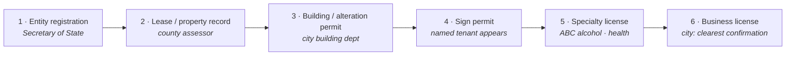
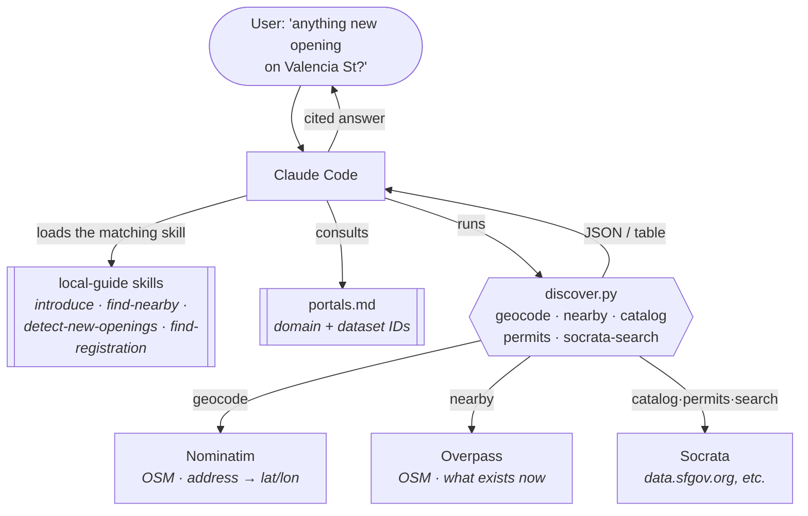
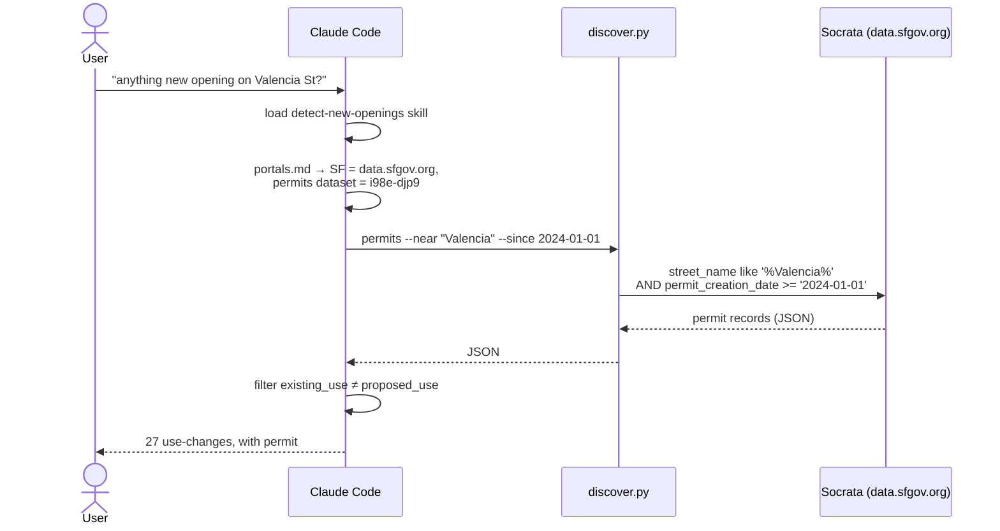
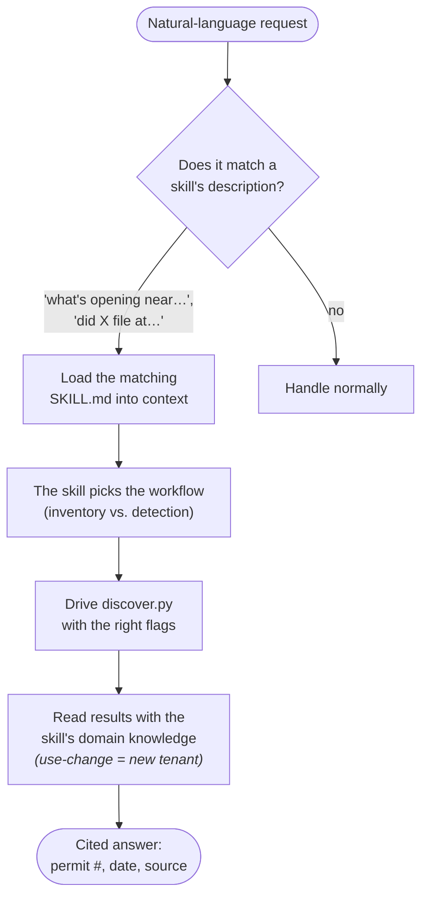

A map tells you what is **already open**. It cannot tell you what is *about to* open.
But a new business leaves a public paper trail long before its doors do: an entity
registration, a lease, a building permit, a sign permit, a liquor license, a business
certificate. Most of that record is free and online. It is just scattered across a
different portal in every city, behind inconsistent schemas, and nobody wants to learn
Socrata's query dialect to check whether the vacant storefront on their block is quietly
becoming a restaurant.

So I packaged the knowledge (where to look, in what order, and how to read it) into a
Claude Code plugin called **`local-guide`**. You ask in plain English; the plugin drives a
small standard-library CLI over open data and reports the filings with citations. No API
keys, no accounts.

<!-- truncate -->

<RepoPointer
  repo="omars-lab/claude-plugin-marketplace"
  path="plugins/local-guide"
  blurb="The local-guide plugin: a role (personal local guide) made of four verb-first skills over one dependency-free Python CLI. No API keys."
/>

## The core idea: a signal chain

New businesses emit public records in a rough order. Earlier signals give earlier warning
but weaker confidence; later ones confirm. The plugin's mental model is this chain:

<div className="mermaid-animated flow-dot">



</div>

**Earlier means earlier warning. Later means stronger confirmation.** Two of these
signals, the building permit and the business license, live on free
[Socrata](https://dev.socrata.com/) open-data portals, so the plugin queries them
directly. The rest (Secretary of State, property records, ABC) are per-jurisdiction web
portals, so the plugin points you to the right one rather than pretending to automate it.

The single most useful automated signal is a **change-of-use building permit**: when a
space's `existing_use` differs from its `proposed_use` (for example `office → retail sales`,
or `retail sales → food/beverage`), someone is building out a new kind of tenant. That is
the needle the detector hunts for.

## Plugins are roles; skills are verbs

The design principle `local-guide` demonstrates: a **plugin is a role** (a noun, an
identity: *your personal local guide*), and its **skills are abilities** (verbs, the things
that role can do). The plugin is the character; the skills are its moves. `local-guide`
carries four verb-first skills over one shared CLI:

| Skill | What you ask it | The verb |
|---|---|---|
| `introduce` | "what is this? what can you find out for me?" | orient the reader |
| `find-nearby` | "what coffee shops are near the Ferry Building?" | inventory what exists now |
| `detect-new-openings` | "is anything new opening on Valencia St?" | detect what is being built out |
| `find-registration` | "did this company file to open in SF?" | confirm a named tenant |

The split matters because the **skills carry the judgment** and the **CLI carries the
muscle**. A skill knows which portal a city uses, which columns hold the street and the
date, and how to read a change-of-use row as a signal. The CLI just makes the requests.
That division is why a plain-English question resolves to the right calls without you
knowing Socrata exists.

:::note[Why four skills and not one big one]
Each skill has its own `description`, and that description is what makes Claude reach for
the right ability on *"is a new restaurant opening at…"* versus *"what is near me?"* without
being told which to use. One monolithic skill would have to describe every job at once and
match none of them cleanly. Verb-first skills keep each trigger sharp.
:::

## Architecture

The plugin is a thin instruction layer over one script. Each skill's `SKILL.md` is the
workflow Claude reads; `discover.py` is the CLI they all drive; `portals.md` is the
per-city lookup table. Everything talks to three free upstreams.

<div className="mermaid-animated flow-dot">



</div>

Design constraints that shaped it:

- **No API keys.** Nominatim, Overpass, and Socrata all serve anonymous requests. The
  plugin works the instant it is installed. No signup, no secrets to manage.
- **Standard library only.** `urllib` plus `json` plus `argparse`. Nothing to `pip install`,
  so the CLI cannot rot when a dependency does.
- **Be a polite citizen.** Nominatim's policy is roughly one request per second, so
  `geocode` sleeps. A descriptive `User-Agent` is set on every call, which Overpass and
  Nominatim both require.
- **JSON by default, `--table` for humans.** Output pipes cleanly into `jq` or into the
  next step, and prints readably when a person wants to read it.

## The CLI

Five subcommands, each a thin wrapper over one upstream:

| Subcommand | Answers | Source |
|---|---|---|
| `geocode "<address>"` | address to lat/lon | Nominatim |
| `nearby --address … --category food` | what is physically open near me | Overpass |
| `catalog --domain … --query …` | which dataset holds permits here | Socrata |
| `permits --near <street> --since <date>` | **who filed to open here** | Socrata |
| `socrata-search --query "<company>"` | did *this company* register | Socrata |

The `permits` command is where the detection logic lives. It builds a query `$where`
clause from friendly flags. `--near "Valencia"` becomes a case-insensitive `like`, and
`--since 2024-01-01` becomes a date filter on whatever `--date-col` the city uses:

```python
clauses = []
if args.near:
    safe = args.near.replace("'", "''")
    clauses.append(f"upper({args.address_col}) like upper('%{safe}%')")
if args.since:
    clauses.append(f"{args.date_col} >= '{args.since}'")
where = " AND ".join(clauses)
```

Column names differ per city. SF calls it `street_name` and `permit_creation_date`;
Chicago splits the street across three columns. So the flags are parameterized, and the
skill instructs Claude to **inspect one raw record before filtering**. That is the kind of
judgment that lives in the skill, not in the code.

## A real detection, end to end

Here is the actual sequence for *"Is anything new opening on Valencia St in San
Francisco?"* Every step ran against live data.



And a sample of what came back. Real filings, real permit numbers:

| Address | Use change | Status | Filed | What |
|---|---|---|---|---|
| **724 Valencia** | `1 family dwelling → retail sales` | filed | 2025-11-24 | *"install new coffee service station (accessory to floral retail)…"* A florist plus coffee bar being built out. Permit `202511240359`, $25k. |
| **510 Valencia** | `retail sales → food/beverage` | issued | 2024-09-09 | *"existing vacant retail space to be converted into a restaurant."* $120k. |
| **1031 Valencia** | `office → retail sales` | issued | 2025-06-05 | *"change of use from … trade office to proposed retail store w/ service center."* $420k. |
| **309 Valencia** | `workshop → barber/beauty salon` | issued | 2025-03-10 | *"change of use from art gallery to nail salon."* |

None of these were on a map yet. All of them are on the public record. That is the thesis
working: the detector surfaced 27 change-of-use permits on one street since 2024.

## Why a plugin and not just a script

The CLI is the muscle; the skills are the judgment. A raw script needs you to already know
which portal, which dataset ID, which columns, and how to read a change-of-use. The skills
encode all of that, so a plain-English question resolves to the right calls.

<div className="mermaid-animated flow-dot">



</div>

And crucially, each skill carries the guardrail the code cannot: **verify, do not assert.**
A permit is a filing, not a fact. Permits get withdrawn, licenses lapse. The skill reports
the record and its date, and lets *convergence of signals* (a permit plus a license plus
still-absent-from-OpenStreetMap means "building out, not yet open") drive any confidence,
rather than declaring "a restaurant is opening here" off one row.

## Honest limits

:::note[What is battle-tested and what is not]
- **SF is battle-tested; other cities are structurally ready.** NYC and Chicago have
  verified dataset IDs in `portals.md`, but the full detection pass has only been run live
  against San Francisco. A new city needs a one-time column check.
- **Half the signal chain is pointers, not automation.** Secretary of State, county
  property and lease records, and ABC (alcohol) records are mostly per-jurisdiction web
  portals. The plugin routes you there, and can drive them with browser tools, but does not
  pretend the CLI queries them.
- **US-scoped.** Socrata plus US Secretary of State and ABC. International portals are not
  covered.
:::

## Try it

:::tip[Run it yourself]

```bash
# What is already open near you
python3 scripts/discover.py nearby --address "Ferry Building, San Francisco" \
    --radius 400 --category food --table

# What is being built out on a street
python3 scripts/discover.py permits --domain data.sfgov.org --dataset i98e-djp9 \
    --address-col street_name --near "Valencia" --since 2024-01-01 --table
```

Or just install the plugin and ask Claude Code: *"is anything new opening on my street?"*
The paper trail is public. Now it is one question away.
:::
