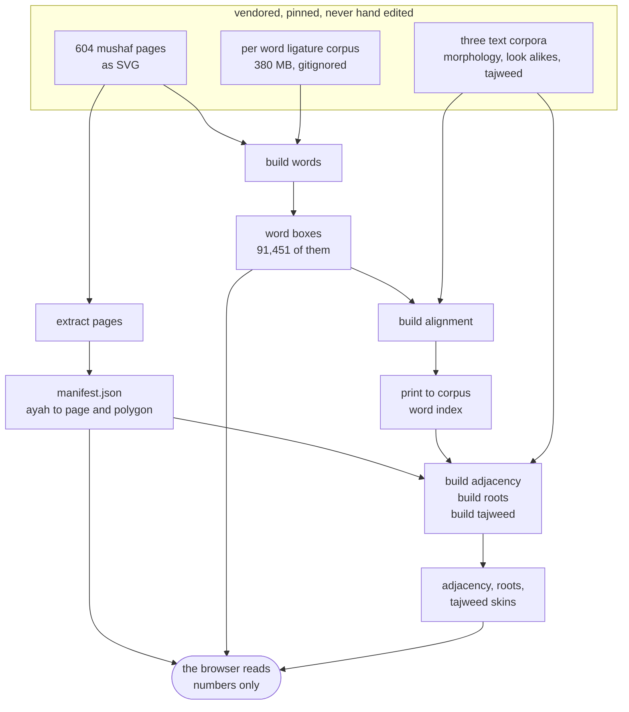
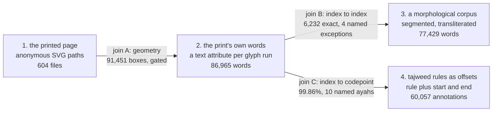
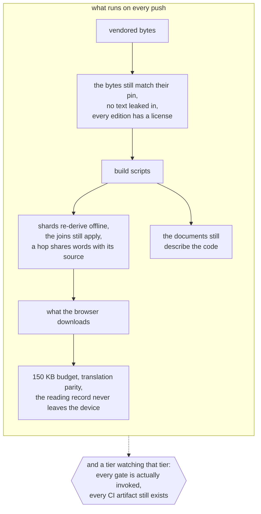
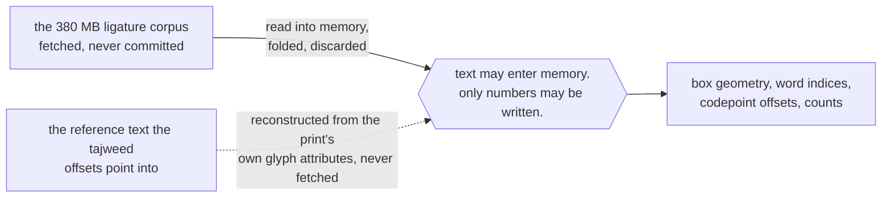

A hafiz is someone who has memorized the Quran, and the hardest part of holding it is not
learning it, it is the *mutashabihat*: passages that nearly repeat each other, so that the
end of one sends you down the wrong path. The traditional fix is a lifetime of pattern
recognition. The fix I wanted was smaller: tap the ayah you keep slipping on, and see every
other place in the book that looks almost exactly like it.

That app is one tap and one list. Everything hard about it happens before the app ever runs,
in the pipeline that decides what a tap on a piece of paper is *pointing at*. Two other
people depend on that pipeline: whoever adds the next build script and needs to know which
join they are about to break, and whoever sits with a printed copy and checks that a claimed
look-alike is actually a look-alike.

<UseCaseDiagram title="The pipeline's three audiences" desc="Who depends on the ETL and what each of them does with it."
  actors={[
    {id:'hafiz', label:'Hafiz', kind:'internal'},
    {id:'dev', label:'Contributor', kind:'internal'},
    {id:'checker', label:'Reviewer with a printed copy'},
  ]}
  useCases={[
    {id:'tap', label:'Tap an ayah', detail:'Touch a shape on the printed page and have the app know which ayah that shape is.'},
    {id:'hop', label:'Hop to a look-alike', detail:'Jump from an ayah to the passages that nearly repeat it, at word granularity.'},
    {id:'script', label:'Add a build script', detail:'Extend the pipeline knowing which join downstream would notice if it broke.'},
    {id:'corpus', label:'Vendor a new corpus', detail:'Bring in a source and know which gate now fences it and which one cannot.'},
    {id:'verdict', label:'Record a verdict', detail:'Read twenty seeded pairs against a real printed page and commit the human answer.'},
  ]}
  links={[
    {from:'hafiz', to:'tap'},
    {from:'hafiz', to:'hop'},
    {from:'dev', to:'script'},
    {from:'dev', to:'corpus'},
    {from:'checker', to:'verdict'},
    {from:'hop', to:'tap', type:'include'},
  ]}/>

:::note[Scope]
This is the data pipeline only: the vendored sources, the scripts that turn them into shards
the browser downloads, and the checks that fence each step. The app's rendering, gestures and
offline behavior are a separate design. The point of interest here is not that an ETL exists;
it is what happens when the same word is described four times, in four incompatible units, by
four groups of people who were solving four different problems.
:::

<!-- truncate -->

<RepoPointer
  repo="omars-lab/hifth"
  path="packages/etl"
  blurb="The pipeline: 14 scripts over seven vendored sources, fenced by 23 gates, and one standing rule about what is allowed to be written to disk."
/>

## The page has nothing in it

A printed mushaf page, vendored as SVG, is a few thousand anonymous outlined `<path>`
elements. Not letters. Not words. Not ayahs. Outlines of shapes that a font once rendered,
flattened so they render identically everywhere without the font. There is nothing in that
file a program can point at.

So the entire pipeline is one job stated many ways: **give those paths names, and never let a
name be quietly wrong.** A missing name is an obvious bug. A confidently wrong name is a
reader sent to the wrong page, and it looks exactly like success.

## Architecture: source, shard, app

Seven vendored inputs go in. Six trees of shards come out, and the browser downloads only
those. Nothing in the pipeline is fetched at runtime, and nothing is generated on a server:
the whole thing is a static site, so every join has to be resolved before deploy.

Two things this picture is for.

**The manifest is the hub.** It is where an ayah key first becomes a page number and a
polygon, and three of the five build scripts read it. Change its shape and you have changed
look-alike hops, root highlighting and tajweed coloring in one move. It is the cheapest thing
in the pipeline to get wrong and the most expensive to change late, so it is the one decision
that got locked first.

**The 380 MB corpus is a source that never becomes a shard.** It is a rendering of every word
in the book as its own tiny SVG, which is exactly what you need to figure out where a word
sits on a page, and exactly what you cannot commit. It is gitignored, and the only things
that leave it are numbers. That has a consequence the next two sections are both about.

## The same word, described four times

Here is the actual difficulty. Four independent projects describe the same word, and no two
of them agree on what a word *is*.

| | join A | join B | join C |
|---|---|---|---|
| **relates** | page geometry to print words | print words to corpus words | print words to codepoint offsets |
| **residual** | none | 4 named exceptions | 10 named ayahs |
| **fenced by** | a gate | a gate | nothing, deliberately |

The counts are the interesting part. 86,965 print words become 77,429 corpus words through
9,533 joins and exactly 1 split. The print breaks words the corpus keeps whole, and it counts
pause marks as words where the corpus counts nothing. **None of that is disagreement about
the text.** It is four tokenization choices made for four purposes, and the pipeline's job is
to measure where they diverge rather than to smooth it over. Smoothing it over is how you get
a hop that lands two words off and nobody notices for a year.

## Where the gates sit

23 checks run on every push. They are grouped by what they are protecting, and the grouping
answers the question you actually have when you are about to change something: *if I break
this, what tells me?*

Three of those gates exist because something shipped broken and nothing noticed. They are the
ones worth understanding before you write a gate of your own.

- **A hop shares words with its source.** The look-alike corpus was off by one for four
  development cycles. 47.8% of the edges pointed at the wrong ayah. Every structural check
  passed the entire time, because the output was a perfectly deterministic rendering of a
  wrong answer. **Determinism is not correctness.**
- **Every gate is actually invoked.** One check was written, reviewed, merged, and then did
  nothing, because it was never added to all three lists that invoke it. A gate nobody runs is
  a comment.
- **Every CI artifact still exists.** CI uploaded build artifacts the repo had stopped
  producing, in plain sight, for several release cycles.

The pattern is identical each time. The failure was not in a check. It was in the space
*between* checks, which is the one place a check cannot look.

## The one-way boundary

The pipeline has a standing rule, and it is stricter than it sounds: **there is no Quran text
in this repo and there will not be.** Not as a config, not as a fixture, not as a test file.

That rule has to survive a pipeline whose entire job is comparing texts, and how it survives
is the most useful structural idea here.

The dotted arrow is the part worth pausing on. The tajweed annotations are codepoint offsets
into a reference text this project does not hold. The obvious way to check whether an offset
lands on the right letter is to go get that text and look. Instead the pipeline
**reconstructs** it: it folds the print's own per-glyph attributes into one string per ayah,
in memory, under eight named corrections, checks the arithmetic, and writes only the
arithmetic. A question that appears to require vendoring a text is answered without that text
existing anywhere on disk.

That is the general shape of the constraint. It does not forbid the comparison. It forbids
the **residue**. Every script reads more than it writes, and the difference is the rule.

## Key Decisions

Each of these had a cheaper alternative that a reasonable person would pick first.

**Numbers cross the boundary; text does not.** The cheap path is to vendor the reference text
and diff against it. Rejected because the license terms on the corpora differ, the repo is
public, and a text file is the one artifact you can never un-ship. The reconstruction above
costs a fold and eight documented corrections, and buys a repo that can be handed to anyone.

**Cache-dependent measurements are probes, not gates.** Two of the most interesting joins can
only be computed with 380 MB that is not in the repo. Making them gates means one of two
things: vendor the corpus, or let CI reach the network. Both are worse than what they buy, so
those scripts carry a `probe-` prefix, run by hand, and are excluded from CI.

| | a gate | a probe |
|---|---|---|
| runs | on every push | by hand, when asked |
| answers | *did this change break something?* | *what is actually true right now?* |
| output | pass or fail | a committed pin file |
| may read the uncommitted cache | no | yes |
| may fail on a clean checkout | never | routinely |

**A probe writes a pin instead.** The thing that replaces enforcement is a small committed
JSON file holding the last measured answer. The measurement is not reproducible offline, but
the *result* is in version control, so a number that moves shows up in a diff and has to be
explained by a human. That is the cheapest way I know to version-control a fact you cannot
recompute in CI.

**Residuals are named, not rated.** The tempting form is a threshold: 99.86% of offsets land
correctly, so gate at 99.8% and move on. Rejected, because a rate absorbs a new failure
silently: break something small and the number barely moves. Instead the residual is a
literal list of the ten ayahs that do not resolve, and anything outside that list prints a
warning. A rate hides a new problem inside an old allowance. A list cannot.

**Cache-dependent builds are excluded from the default chain, but their output is committed
and re-derived.** The two scripts that need the big corpus are not in the standard build
command, so a clean checkout works. Their outputs are committed, and a gate re-derives those
outputs *from committed bytes only*. That is the whole trick that lets a build with an
uncommittable input still be verified offline.

**One input is checked against and never built from.** A fixture of human verdicts, filled in
by a reviewer with a printed copy, is replayed against whatever the pipeline just produced. It
is the only check in the system that knows whether the output is *true* rather than merely
consistent. Everything else proves the pipeline is deterministic, and the 47.8% story is what
that is worth on its own.

## What carries over

Three things here are not about Arabic, or SVG, or this app at all.

**Determinism is not correctness, and structural checks cannot tell the difference.** If your
pipeline's only checks are "the output is stable" and "the schema validates," it will happily
ship a stable, valid, wrong answer indefinitely. Somewhere in the system you need one check
whose ground truth came from a human looking at the real thing.

**A pin file is how you version-control a measurement you cannot reproduce.** Not every fact
about a system can be recomputed in CI. Committing the last measured value turns an
unreproducible check into a reviewable diff, which is most of what you wanted from the check.

**Name the residual instead of rating it.** Any allowance expressed as a percentage is a
budget that new failures can be spent from without anyone approving the spend. An allowance
expressed as a list of specific known cases makes the next failure introduce itself.

And the one that surprised me: every gate in this pipeline was bought by a failure in the gap
between two other gates. None of them were designed in advance. That is an argument for
writing down the *shape* of a pipeline, separately from documenting its parts, because the
parts were all documented the whole time the corpus was 47.8% wrong.
