# AI Prompts Use Case Overview

> 🤖 **AI Metadata**: This document contains embedded metadata for AI bots to automatically update use cases and diagrams as new prompts are added. See the metadata section at the bottom for update instructions.

## Overview

This collection represents a comprehensive suite of AI-powered prompts designed to automate and enhance various aspects of knowledge work, content creation, and personal productivity. Each prompt is designed to solve specific workflow challenges while providing measurable time savings and ROI.

## Use Case Diagram

```mermaid
graph LR
    %% User (Actor) - Left side
    User(("👤 Omar<br/>(Engineer, Entrepreneur)"))
    
    %% All verb nodes to the right of Omar - stretched horizontally
    V1(("Create"))
    V2(("Analyze"))
    V3(("Evaluate"))
    V4(("Maintain"))
    V5(("Organize"))
    V6(("Manage"))
    V7(("Customize"))
    V8(("Refactor"))
    
    %% Verb connections from user
    User --> V1
    User --> V2
    User --> V3
    User --> V4
    User --> V5
    User --> V6
    User --> V7
    User --> V8
    
    %% Sub-nodes for detailed use cases (clickable) - stretched horizontally
    V1 --> UC1(("<u>📝 Blog Posts</u>"))
    V2 --> UC2(("<u>🔍 SQL Queries</u>"))
    V3 --> UC3(("<u>📊 Prompt Quality</u>"))
    V4 --> UC4(("<u>🔧 Documentation</u>"))
    V5 --> UC5(("<u>📋 Personal Content</u>"))
    V6 --> UC6(("<u>✅ Daily Tasks</u>"))
    V7 --> UC7(("<u>🎨 Workflows</u>"))
    V8 --> UC8(("<u>🔄 Code Systems</u>"))
    
    %% Styling with consistent dimensions
    classDef verb fill:#e74c3c,stroke:#c0392b,stroke-width:2px,color:#ffffff,width:120px,height:60px
    classDef clickable fill:#0066cc,stroke:#004499,stroke-width:2px,color:#ffffff,width:150px,height:60px
    classDef user fill:#ff6b6b,stroke:#d63031,stroke-width:3px,color:#ffffff,width:180px,height:60px
    class V1,V2,V3,V4,V5,V6,V7,V8 verb
    class UC1,UC2,UC3,UC4,UC5,UC6,UC7,UC8 clickable
    class User user
    
    %% Clickable Links
    click UC1 "/docs/prompts/author/blog-post-author" "Blog Post Author"
    click UC2 "/docs/prompts/analyze/sql-query-analyzer" "SQL Query Analyzer"
    click UC3 "/docs/prompts/meta/prompt-maturity-framework" "Prompt Maturity Framework"
    click UC4 "/docs/prompts/heal/docusaurus-maintenance-system" "Docusaurus Maintenance System"
    click UC5 "/docs/prompts/organize/personal-life-content-organizer" "Personal Life Content Organizer"
    click UC6 "/docs/prompts/organize/daily-todo-carry-over" "Daily Todo Carry-over"
    click UC7 "/docs/prompts/draw/kanban-board-customization" "Kanban Board Customization"
    click UC8 "/docs/prompts/refactor/role-refactoring-system" "Role Refactoring System"
```



## Benefits Overview


## Use Case Categories

### 📝 Content Creation & Documentation
- **Blog Post Author**: Transforms technical prompts into engaging blog posts with professional documentation and visual diagrams
- **Time Savings**: 30-50 hours annually ($2,250-$3,750 value)

### 🔍 Analysis & Intelligence  
- **SQL Query Analyzer**: Analyzes complex SQL queries, generates documentation, and creates visual data flow diagrams
- **Prompt Maturity Framework**: Systematically evaluates prompt quality and identifies improvement opportunities
- **Time Savings**: 40-65 hours annually ($3,000-$4,875 value)

### 🔧 Maintenance & Healing
- **Docusaurus Maintenance System**: Automatically fixes frontmatter issues and broken links across documentation sites
- **Time Savings**: 15-25 hours annually ($1,125-$1,875 value)

### 📋 Organization & Management
- **Personal Life Content Organizer**: Intelligently routes personal content across 10+ directories with proper templates
- **Daily Todo Carry-over**: Manages task priorities and daily organization
- **Time Savings**: 40-55 hours annually ($3,000-$4,125 value)

### 🎨 Customization & Design
- **Kanban Board Customization**: Creates visual designs and optimizes workflow layouts
- **Time Savings**: Variable based on usage

### 🔄 Refactoring & Improvement
- **Role Refactoring System**: Optimizes code architecture and improves system design
- **Time Savings**: Variable based on project scope

## Total Impact

**Combined Annual Benefits:**
- **Time Savings**: 125-195 hours annually
- **Financial Value**: $9,375-$14,625 (at $75/hour)
- **Quality Improvements**: Consistent formatting, better documentation, reduced errors
- **Workflow Efficiency**: Automated processes, reduced decision fatigue, improved organization

## Getting Started

1. **Browse by Category**: Use the sidebar to explore prompts by functional area
2. **Read the Documentation**: Each prompt includes detailed use cases, time savings analysis, and implementation guides
3. **Access the Prompts**: Direct links to the actual prompts in the [prompts repository](https://github.com/omars-lab/prompts)
4. **Start with High-Impact**: Begin with prompts that offer the highest time savings for your workflow

---

<details>
<summary>🤖 AI Metadata (Click to expand)</summary>

```yaml
# AI METADATA - DO NOT REMOVE OR MODIFY
# This document should be automatically updated when new prompts are added to the collection. 
# Follow these steps:
#
# 1. SCAN_DIRECTORY: Scan /docs/10-prompts/ for new .md files
# 2. EXTRACT_METADATA: From each prompt's frontmatter, extract:
#    - title
#    - tags
#    - description
#    - estimated time savings (from content)
#    - use case category (infer from directory structure)
# 3. UPDATE_USE_CASES: Add new use cases to the appropriate category section
# 4. UPDATE_DIAGRAM: Add new use case nodes to the Mermaid diagram with hierarchical structure
#    - Create verb node: V_NODE_ID(("Verb"))
#    - Create detailed sub-node: UC_NODE_ID(("<u>📝 Description</u>"))
#    - Connect user to verb: User --> V_NODE_ID (all nodes to the right of Omar)
#    - Connect verb to sub-node: V_NODE_ID --> UC_NODE_ID
#    - Apply styling: class V_NODE_ID verb, class UC_NODE_ID clickable
#    - Ensure consistent sizing: verb nodes (120px x 60px), clickable nodes (150px x 60px), user node (180px x 60px)
# 5. ADD_CLICKABLE_LINKS: For each new use case node, add a click directive:
#    - Format: click UC_NODE_ID "/docs/prompts/subdirectory/filename-without-extension" "Display Title"
#    - Use absolute path from site root (/docs/prompts/subdirectory/filename without .md)
#    - Use the frontmatter title as the Display Title
#    - Connect the new UC node to the User actor: User --> UC_NODE_ID
# 6. RECALCULATE_TOTALS: Update the "Total Impact" section with new time savings and financial values
# 7. MAINTAIN_STRUCTURE: Keep the existing format and organization
#
# CATEGORY_MAPPING:
# - analyze/ -> Analysis & Intelligence
# - author/ -> Content Creation & Documentation  
# - draw/ -> Customization & Design
# - heal/ -> Maintenance & Healing
# - meta/ -> Analysis & Intelligence
# - organize/ -> Organization & Management
# - refactor/ -> Refactoring & Improvement
#
# TIME_SAVINGS_PATTERN: Look for "Estimated Annual Time Savings: X-Y hours per year" in prompt content
# ROI_PATTERN: Look for "ROI: For a knowledge worker earning $75/hour, this represents $X-$Y in annual value"
#
# CLICKABLE_LINKS_FORMAT:
# - Each detailed use case sub-node should have a click directive in the Mermaid diagram
# - Format: click UC_NODE_ID "/docs/prompts/subdirectory/filename-without-extension" "Title from frontmatter"
# - Example: click UC1 "/docs/prompts/author/blog-post-author" "Blog Post Author"
# - Verb nodes connect from User actor: User --> V_NODE_ID (all nodes to the right of Omar)
# - Verb nodes connect to detailed sub-nodes: V_NODE_ID --> UC_NODE_ID
# - Style verb nodes: V_NODE_ID(("Verb")) with class V_NODE_ID verb (120px x 60px)
# - Style clickable sub-nodes: UC_NODE_ID(("<u>📝 Description</u>")) with class UC_NODE_ID clickable (150px x 60px)
# - All nodes maintain consistent height (60px) for uniform appearance
#
# UPDATE_FREQUENCY: Run this update whenever new .md files are added to any subdirectory
```

</details>
