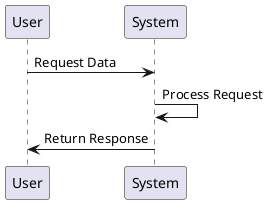
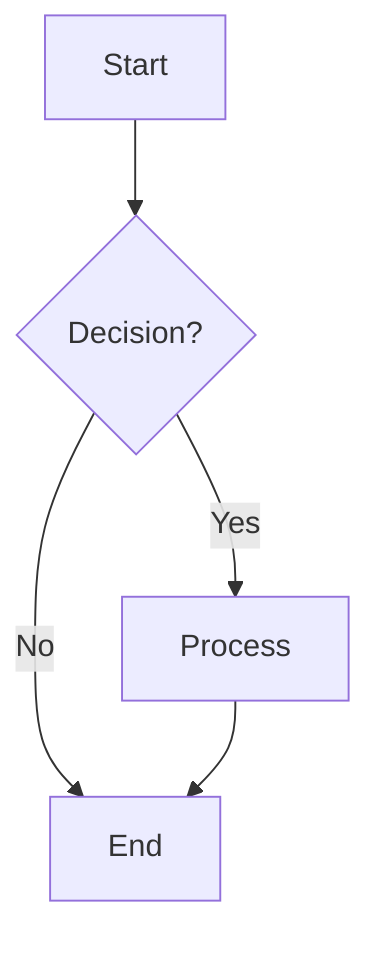
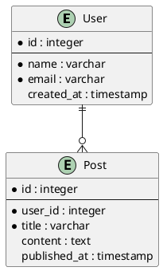
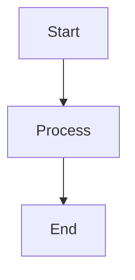
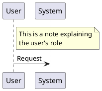
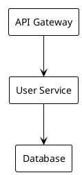
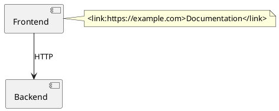

# Diagrams as Text

This guide explores using text-based diagramming tools for creating documentation and architecture diagrams. Text-based diagrams offer version control, easy collaboration, and automated generation capabilities.

## Why Text-Based Diagrams?

### Advantages
- **Version Control**: Track changes in Git alongside your code
- **Collaboration**: Easy to review and merge diagram changes
- **Automation**: Generate diagrams from code or data
- **Consistency**: Maintain uniform styling across all diagrams
- **Accessibility**: Screen readers can interpret text descriptions
- **Diffing**: See exactly what changed between versions

### Use Cases
- **Architecture Documentation**: System design and component relationships
- **Database Design**: Entity Relationship Diagrams (ERDs)
- **API Documentation**: Sequence diagrams and flow charts
- **Process Flows**: Business process and workflow diagrams
- **Code Documentation**: Class diagrams and dependency graphs

## Popular Text-Based Diagram Tools

### PlantUML
PlantUML is one of the most popular text-based diagramming tools.

**Features:**
- Multiple diagram types (sequence, class, component, etc.)
- Integration with many tools and platforms
- Extensive customization options
- Active community and documentation

**Example:**


### Mermaid
Mermaid is a JavaScript-based diagramming tool that's widely supported.

**Features:**
- Built into many platforms (GitHub, GitLab, Notion)
- Real-time rendering
- Multiple diagram types
- Easy to learn syntax

**Example:**


### C4 Model
C4 model is an architecture modeling framework that works well with text-based tools.

**Levels:**
1. **Context**: System context and external dependencies
2. **Container**: Application containers and technology choices
3. **Component**: Major components within containers
4. **Code**: Detailed class and object diagrams

## Database Diagrams

### DBML (Database Markup Language)
DBML allows you to define database schemas in text format.

**Example:**
```dbml
Table users {
  id integer [primary key]
  name varchar
  email varchar [unique]
  created_at timestamp
}

Table posts {
  id integer [primary key]
  user_id integer [ref: > users.id]
  title varchar
  content text
  published_at timestamp
}
```

### PlantUML for Databases
PlantUML can also create ERDs from text descriptions.

**Example:**


## Architecture Diagrams

### System Context Diagrams
Show the system in its environment with external dependencies.

```plantuml
@startuml
!include https://raw.githubusercontent.com/plantuml-stdlib/C4-PlantUML/master/C4_Context.puml

LAYOUT_WITH_LEGEND()

Person(user, "User", "A user of the system")
System(system, "My System", "The system under development")
System_Ext(external, "External API", "Third-party service")

Rel(user, system, "Uses")
Rel(system, external, "Calls")
@enduml
```

### Component Diagrams
Show the major components and their relationships.

```plantuml
@startuml
!include https://raw.githubusercontent.com/plantuml-stdlib/C4-PlantUML/master/C4_Container.puml

LAYOUT_WITH_LEGEND()

Person(user, "User", "A user of the system")
Container(web, "Web Application", "JavaScript, React", "Provides functionality to users")
Container(api, "API", "Java, Spring Boot", "Handles business logic")
ContainerDb(db, "Database", "PostgreSQL", "Stores data")

Rel(user, web, "Uses")
Rel(web, api, "Calls")
Rel(api, db, "Reads/Writes")
@enduml
```

## Integration with Documentation

### Docusaurus Integration
You can embed PlantUML diagrams in Docusaurus using plugins or custom components.

**Using @theme/CodeBlock:**
```jsx
import CodeBlock from '@theme/CodeBlock';

<CodeBlock language="plantuml">
{`@startuml
participant User
participant System
User -> System: Request
System -> User: Response
@enduml`}
</CodeBlock>
```

### GitHub Integration
GitHub natively supports Mermaid diagrams in markdown files.

```markdown

```

## Best Practices

### 1. Keep Diagrams Simple
- Focus on the most important relationships
- Avoid cluttering with unnecessary details
- Use consistent naming conventions

### 2. Version Control
- Store diagram source files in Git
- Use meaningful commit messages for diagram changes
- Review diagram changes in pull requests

### 3. Documentation
- Include descriptions with your diagrams
- Explain the purpose and context
- Keep diagrams up to date with code changes

### 4. Automation
- Generate diagrams from code when possible
- Use CI/CD to validate diagram syntax
- Automate diagram updates based on data changes

## Tools and Resources

### Online Editors
- [PlantUML Online Server](http://www.plantuml.com/plantuml/uml/)
- [Mermaid Live Editor](https://mermaid.live/)
- [DBML Editor](https://dbdiagram.io/)

### IDE Extensions
- **VS Code**: PlantUML, Mermaid Preview
- **IntelliJ**: PlantUML Integration
- **Eclipse**: PlantUML Plugin

### Libraries and Frameworks
- [C4-PlantUML](https://github.com/plantuml-stdlib/C4-PlantUML)
- [Mermaid.js](https://mermaid.js.org/)
- [DBML](https://www.dbml.org/)

## Advanced Features

### Comments and Documentation


### Styling and Themes


### Links and Navigation


## References

- [PlantUML Documentation](https://plantuml.com/)
- [Mermaid Documentation](https://mermaid.js.org/)
- [C4 Model](https://c4model.com/)
- [DBML Documentation](https://www.dbml.org/)
- [Kroki (Diagram Rendering Service)](https://kroki.io/)