import Tabs from '@theme/Tabs';
import TabItem from '@theme/TabItem';

A structured learning path for mastering Generative AI, from core concepts to building production systems.

<!-- truncate -->

# GenAI Learning Guide

<Tabs>
<TabItem value="overview" label="Overview" default>

This guide provides a comprehensive learning path for mastering Generative AI, organized by skill level and topic area. Follow the progression from fundamentals to advanced system design.

**Learning Path:**
1. **Fundamentals** → Understand core concepts and terminology
2. **Hands-On Practice** → Run LLMs locally and build simple applications
3. **Framework Selection** → Choose the right tools for your use case
4. **System Design** → Design production-ready GenAI systems
5. **Advanced Topics** → Evaluation, security, optimization, and deployment

</TabItem>
<TabItem value="who" label="Who This Is For">

- Developers new to GenAI who want a structured learning path
- Engineers building GenAI applications who need design guidance
- Architects designing AI systems who need decision frameworks
- Anyone wanting to understand the GenAI ecosystem comprehensively

</TabItem>
<TabItem value="structure" label="How to Use">

- **Sequential Learning**: Follow the path from top to bottom for comprehensive understanding
- **Topic-Based**: Jump to specific sections based on your current needs
- **Reference Guide**: Use as a reference when making design decisions
- **Resource Hub**: Access curated resources and tools for each topic

</TabItem>
</Tabs>

## 🎯 Learning Path Overview

```mermaid
flowchart TD
    Start([Start Learning GenAI]) --> Fundamentals[📚 Fundamentals]
    Fundamentals --> HandsOn[🛠️ Hands-On Practice]
    HandsOn --> Frameworks[🔧 Framework Selection]
    Frameworks --> Design[🏗️ System Design]
    Design --> Advanced[🚀 Advanced Topics]
    Advanced --> Production[✅ Production Systems]
    
    Fundamentals --> |Core Concepts| F1[Foundation Models]
    Fundamentals --> |Core Concepts| F2[Prompting]
    Fundamentals --> |Core Concepts| F3[RAG & Vector DBs]
    Fundamentals --> |Core Concepts| F4[Agents & Tools]
    
    HandsOn --> |Local Setup| H1[Run LLMs Locally]
    HandsOn --> |Practice| H2[Build Simple Apps]
    HandsOn --> |Tools| H3[CLI Integration]
    
    Frameworks --> |Compare| FR1[LangChain vs Others]
    Frameworks --> |Choose| FR2[Framework Decision]
    
    Design --> |Decisions| D1[Architecture Patterns]
    Design --> |Decisions| D2[Design Framework]
    
    Advanced --> |Quality| A1[Evaluation]
    Advanced --> |Safety| A2[Security]
    Advanced --> |Performance| A3[Optimization]
```



## 📚 Phase 1: Fundamentals

**Goal**: Understand core GenAI concepts and terminology

### Essential Reading

- **[The Fundamentals of Agentic Systems](/docs/mental-models/understanding-the-genai-domain/understanding-fundamentals-of-genai-systems)** - Comprehensive glossary covering:
  - Foundation Models (LLMs)
  - Prompting techniques
  - RAG (Retrieval-Augmented Generation)
  - Vector Databases
  - Memory Systems
  - Agentic Systems
  - Tool Integration
  - Evaluation & Security

### Key Concepts to Master

1. **Foundation Models**
   - What are LLMs and how do they work?
   - Model types: text, multimodal, code-specialized
   - Commercial vs. open-source models
   - Context windows and token limits

2. **Prompting**
   - Zero-shot, few-shot, chain-of-thought
   - Prompt engineering best practices
   - Role-playing and structured prompts
   - Iterative refinement

3. **RAG (Retrieval-Augmented Generation)**
   - When to use RAG vs. direct prompting
   - Vector databases and semantic search
   - Document processing and chunking
   - Retrieval strategies

4. **Agentic Systems**
   - Single vs. multi-agent architectures
   - Tool integration and function calling
   - Memory systems (short-term vs. long-term)
   - Agent communication patterns

### Practice Exercises

- [ ] Read the fundamentals guide completely
- [ ] Understand the difference between RAG and fine-tuning
- [ ] Learn when to use agents vs. simple LLM calls
- [ ] Practice writing effective prompts for different use cases

## 🛠️ Phase 2: Hands-On Practice

**Goal**: Get practical experience running LLMs and building simple applications

### Running LLMs Locally

- **[Running LLMs Locally](/docs/craftsmanship/workspace/running-llms-locally)** - Complete guide covering:
  - **LM Studio**: User-friendly local LLM interface
  - **Ollama**: Command-line LLM runner
  - Tool support and CLI integration
  - Hardware considerations (Apple Silicon, clustering)
  - Network setup and remote access

### Getting Started

1. **Install Ollama or LM Studio**
   ```bash
   # Ollama on Mac
   brew install ollama
   ollama serve
   ollama run llama3
   ```

2. **Integrate with Existing Tools**
   - Codex CLI integration
   - Claude Code router setup
   - Custom MCP servers

3. **Build Your First App**
   - Simple Q&A application
   - Document summarization tool
   - Basic chatbot

### Practice Exercises

- [ ] Set up Ollama or LM Studio locally
- [ ] Run a model and test basic prompts
- [ ] Integrate with an existing CLI tool
- [ ] Build a simple RAG application with local LLM

## 🔧 Phase 3: Framework Selection

**Goal**: Understand the AI framework landscape and choose the right tools

### Framework Comparison

- **[The AI Framework Landscape](/blog/ai-framework-landscape)** - Interactive guide covering:
  - **Frameworks**: LangChain, LangGraph, Haystack, Semantic Kernel
  - **Specialized Libraries**: LlamaIndex, Guidance, Outlines, Instructor
  - **Multi-Agent**: AutoGen, CrewAI
  - **Platforms**: AWS Bedrock, Google ADK
  - **Tools**: LangSmith, Langfuse, evaluation frameworks

### Decision Framework

**Choose LangChain if:**
- You need a versatile, modular framework
- You want extensive integrations
- You're prototyping quickly
- You need a large community

**Choose LangGraph if:**
- You need complex, stateful workflows
- You're building multi-agent systems
- You need loops and retries
- You require graph-based orchestration

**Choose LlamaIndex if:**
- You're focused on RAG applications
- You need optimized data indexing
- You want specialized retrieval

**Choose Cloud Platforms if:**
- You need fully managed infrastructure
- You want enterprise security
- You're building at scale
- You prefer serverless architecture

### Practice Exercises

- [ ] Explore the interactive framework graph
- [ ] Compare 2-3 frameworks for your use case
- [ ] Build a simple app with your chosen framework
- [ ] Understand the trade-offs between frameworks

## 🏗️ Phase 4: System Design

**Goal**: Design production-ready GenAI systems with proper architecture

### Design Framework

- **[Designing GenAI Systems](/docs/skills/solving-system-design/framework-for-designing-genai-systems)** - Complete decision framework covering:
  - **Foundation Decisions**: RAG vs. prompting, memory, fine-tuning, model selection
  - **Architecture Decisions**: Single vs. multi-agent, vector DB selection, evaluation strategy
  - **Advanced Decisions**: Specialized databases, processing patterns, runtime environments

### Key Design Decisions

1. **RAG vs. Direct Prompting**
   - Use RAG when: You need up-to-date information, domain-specific knowledge
   - Use prompting when: General knowledge is sufficient, simple use cases

2. **Memory Strategy**
   - Short-term: Conversation context, recent interactions
   - Long-term: User preferences, historical data, knowledge bases

3. **Agent Architecture**
   - Single agent: Simple tasks, linear workflows
   - Multi-agent: Complex tasks, parallel processing, specialized roles

4. **Evaluation Strategy**
   - Implement evaluation before deployment
   - Use automated testing and human evaluation
   - Monitor production performance

### Practice Exercises

- [ ] Work through the design decision framework
- [ ] Design a system architecture for a real use case
- [ ] Document your design decisions and trade-offs
- [ ] Review and refine your architecture

## 🚀 Phase 5: Advanced Topics

**Goal**: Master evaluation, security, optimization, and production deployment

### Evaluation & Testing

**Key Areas:**
- **Automated Evaluation**: Metrics for quality, relevance, accuracy
- **Human Evaluation**: Subjective quality, user satisfaction
- **A/B Testing**: Compare different models and prompts
- **Monitoring**: Track performance in production

**Tools:**
- LangSmith, Langfuse for observability
- Ragas for RAG evaluation
- DeepEval for comprehensive testing
- Custom evaluation frameworks

### Security & Guardrails

**Critical Considerations:**
- **Input Validation**: Sanitize user inputs
- **Output Filtering**: Prevent harmful content
- **Data Privacy**: Protect sensitive information
- **Access Control**: Secure API endpoints
- **Rate Limiting**: Prevent abuse

**Resources:**
- AWS DataZone for data governance
- Content moderation APIs
- Prompt injection prevention
- Secure model deployment

### Cost Optimization

**Strategies:**
- **Model Selection**: Choose cost-effective models for tasks
- **Caching**: Cache common queries and responses
- **Batching**: Process multiple requests together
- **Token Management**: Optimize prompt length and context
- **Infrastructure**: Use appropriate compute resources

### Performance Tuning

**Optimization Areas:**
- **Latency**: Reduce response times
- **Throughput**: Handle more concurrent requests
- **Context Management**: Efficient context window usage
- **Retrieval Optimization**: Improve RAG retrieval speed
- **Model Optimization**: Quantization, pruning, distillation

### Production Deployment

**Considerations:**
- **Scalability**: Handle variable load
- **Reliability**: Error handling and retries
- **Monitoring**: Track metrics and errors
- **Versioning**: Manage model and prompt versions
- **CI/CD**: Automated testing and deployment

## 📖 Additional Resources

### AWS Services
* Govern Your Data
	* https://aws.amazon.com/datazone/?trk=f1a9bceb-ae49-49c6-923d-15295100389e&sc_channel=el

### Books & Courses

- [ ] [Applied LLMs](https://applied-llms.org/) - Practical LLM applications
- [ ] [AI Engineer Handbook](https://github.com/swirl-ai/ai-angineers-handbook) - Building agents from scratch
- [ ] [AI Engineering Book](https://github.com/chiphuyen/aie-book) - Comprehensive AI engineering guide
- [ ] [O'Reilly AI Agents](https://github.com/sinanuozdemir/oreilly-ai-agents) - Agent development guide

### Design Patterns & Architecture

- **Agent as a Judge**: [Video Tutorial](https://www.youtube.com/watch?v=YhT6PhG_05U)
- **Deep Research Agent**: [Implementation Guide](https://github.com/swirl-ai/ai-angineers-handbook/tree/main/building_agents_from_scratch/deep_research_agent)
- **AWS GenAI Patterns**: [PlantUML Diagrams](https://github.com/awslabs/aws-icons-for-plantuml)

### Data Governance

- **AWS DataZone**: [Data Governance Platform](https://aws.amazon.com/datazone/)
- Document complexity for LLM use cases
- Data privacy and compliance

### Practical Examples

- **[How I Use GenAI](/blog/how-i-use-genai)** - Personal workflow and tools
- MCP server implementations
- Prompt library examples
- Integration patterns

## 🎓 Learning Checklist

### Fundamentals ✅
- [ ] Understand foundation models and LLMs
- [ ] Master prompting techniques
- [ ] Learn RAG and vector databases
- [ ] Understand agentic systems

### Hands-On ✅
- [ ] Set up local LLM environment
- [ ] Build a simple application
- [ ] Integrate with existing tools
- [ ] Practice with different models

### Frameworks ✅
- [ ] Explore framework landscape
- [ ] Choose appropriate framework
- [ ] Build app with chosen framework
- [ ] Understand framework trade-offs

### Design ✅
- [ ] Work through design framework
- [ ] Make key architecture decisions
- [ ] Design a complete system
- [ ] Document design rationale

### Advanced ✅
- [ ] Implement evaluation strategy
- [ ] Add security and guardrails
- [ ] Optimize for cost and performance
- [ ] Deploy to production

## 🔗 Related Content

- **[Fundamentals Guide](/docs/mental-models/understanding-the-genai-domain/understanding-fundamentals-of-genai-systems)** - Core concepts glossary
- **[Framework Landscape](/docs/mental-models/understanding-the-genai-domain/2025-11-10-ai-framework-landscape)** - Interactive framework comparison
- **[System Design Guide](/docs/skills/solving-system-design/framework-for-designing-genai-systems)** - Complete design framework
- **[Local LLMs](/docs/craftsmanship/workspace/running-llms-locally)** - Running LLMs locally

---

**Next Steps**: Start with the fundamentals, then progress through hands-on practice, framework selection, and system design. Use this guide as both a learning path and a reference for building production GenAI systems.
