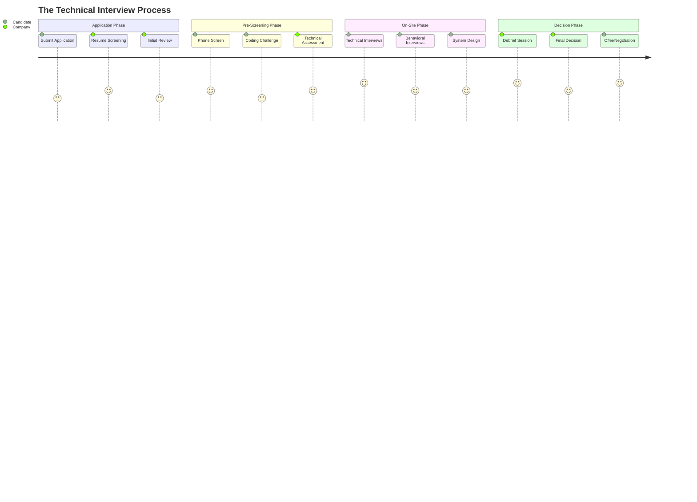

import Tabs from '@theme/Tabs';
import TabItem from '@theme/TabItem';

<style>{`
  .tabs-container {
    background-color: #f8f9fa;
    border-radius: 8px;
    padding: 16px;
    margin: 16px 0;
    border: 1px solid #e9ecef;
  }
  
  .tabs-container .tabs {
    background-color: transparent;
  }
  
  .tabs-container .tabItem {
    background-color: transparent;
  }
  
  .process-step {
    background-color: #e8f5e8;
    border-left: 4px solid #28a745;
    padding: 16px;
    margin: 16px 0;
  }
  
  .process-step h4 {
    color: #155724;
    margin-top: 0;
  }
  
  .insider-tip {
    background-color: #fff3cd;
    border-left: 4px solid #ffc107;
    padding: 16px;
    margin: 16px 0;
  }
  
  .insider-tip h4 {
    color: #856404;
    margin-top: 0;
  }
`}</style>

# The Complete Technical Interview Process: From Application to Offer

A comprehensive guide to understanding the technical interview process from both candidate and company perspectives, including preparation, execution, and decision-making.

## Purpose

This guide was created to address three critical needs:

- **I need to understand the complete interview process**: Learn what happens from application submission to final decision, including behind-the-scenes activities
- **I need to prepare effectively for each stage**: Know what to expect at each phase and how to position myself for success
- **I need to handle outcomes professionally**: Understand how decisions are made and how to respond to different results

The goal is to demystify the technical interview process and help you navigate it with confidence and strategic awareness.

## The Interview Process Overview

The technical interview process is a multi-stage journey that involves both visible activities (what you experience) and behind-the-scenes activities (what companies do internally). Understanding both perspectives is crucial for success.

### Process Flow Diagram



## Phase 1: Application and Initial Screening

### What You Experience

<div className="process-step">
<h4>📝 Application Submission</h4>
<ul>
<li>Submit your resume and cover letter</li>
<li>Complete any required application forms</li>
<li>Wait for initial response (typically 1-2 weeks)</li>
</ul>
</div>

### What Happens Behind the Scenes

**Resume Screening Process:**
- **ATS (Applicant Tracking System)**: Automated filtering based on keywords and requirements
- **Recruiter Review**: Initial human screening for basic qualifications
- **Hiring Manager Review**: Technical assessment of experience and skills
- **Team Calibration**: Discussion of candidate fit and interview readiness

**Selection Criteria:**
- Technical skills alignment with role requirements
- Experience level matching the position
- Cultural fit indicators from resume and application
- Availability and location considerations

<div className="insider-tip">
<h4>💡 Insider Tip</h4>
<p>Companies typically review hundreds of applications for each position. Your resume needs to clearly demonstrate relevant technical skills and quantifiable achievements to pass the initial screening.</p>
</div>

## Phase 2: Pre-Screening and Technical Assessment

### What You Experience

<div className="process-step">
<h4>📞 Phone/Video Screen</h4>
<ul>
<li>Initial conversation with recruiter or hiring manager</li>
<li>Basic technical questions and experience discussion</li>
<li>Cultural fit assessment and role alignment</li>
<li>Timeline and process explanation</li>
</ul>
</div>

<div className="process-step">
<h4>💻 Coding Challenge</h4>
<ul>
<li>Take-home coding assignment (2-4 hours typical)</li>
<li>Algorithm and data structure problems</li>
<li>Code quality and documentation evaluation</li>
<li>Submission deadline and review process</li>
</ul>
</div>

### What Happens Behind the Scenes

**Technical Assessment:**
- **Code Review**: Evaluation of solution quality, efficiency, and style
- **Problem-Solving Assessment**: Analysis of approach and methodology
- **Communication Review**: Assessment of code documentation and comments
- **Timeline Evaluation**: Consideration of completion time and effort

**Decision Making:**
- **Pass/No-Pass Decision**: Based on technical competency demonstration
- **Interview Scheduling**: Coordination of on-site or virtual interviews
- **Panel Assembly**: Selection of interviewers for different competencies

## Phase 3: On-Site Interview Loop

### What You Experience

<div className="process-step">
<h4>🔧 Technical Interviews</h4>
<ul>
<li>Coding problems on whiteboard or computer</li>
<li>Algorithm and data structure challenges</li>
<li>Problem-solving methodology discussion</li>
<li>Code optimization and improvement</li>
</ul>
</div>

<div className="process-step">
<h4>🏗️ System Design Interviews</h4>
<ul>
<li>High-level architecture discussions</li>
<li>Scalability and performance considerations</li>
<li>Technology selection and trade-offs</li>
<li>Real-world system design challenges</li>
</ul>
</div>

<div className="process-step">
<h4>👥 Behavioral Interviews</h4>
<ul>
<li>Leadership principle demonstrations</li>
<li>Past experience and project discussions</li>
<li>Conflict resolution and teamwork examples</li>
<li>Cultural fit and values alignment</li>
</ul>
</div>

### What Happens Behind the Scenes

**Interview Coordination:**
- **Panel Assembly**: Each interviewer assigned specific competencies
- **Question Preparation**: Standardized questions with evaluation rubrics
- **Environment Setup**: Technical setup and interview logistics
- **Documentation**: Real-time note-taking and feedback collection

**Evaluation Process:**
- **Competency Assessment**: Each interviewer evaluates assigned areas
- **Behavioral Indicators**: Evidence collection for leadership principles
- **Technical Depth**: Problem-solving approach and solution quality
- **Communication Skills**: Clarity, collaboration, and explanation ability

## Phase 4: Decision Making and Debrief

### What Happens Behind the Scenes

<div className="insider-tip">
<h4>🎯 The Debrief Process</h4>
<p>The debrief is where the hiring decision is made. It's a structured discussion led by a "Bar Raiser" (experienced interviewer) where all interviewers present their feedback and reach a consensus decision.</p>
</div>

**Debrief Timeline:**
- **Within 1-3 business days** of the interview (4-5 days maximum)
- **30 minutes typical duration** for the discussion
- **All feedback must be submitted** before the debrief occurs

**Decision-Making Process:**

<div className="tabs-container">
<Tabs>
<TabItem value="unanimous" label="Unanimous Inclined" default>

**Everyone Inclined:**
- Candidate easily hired with little discussion
- Strong performance across all competencies
- Clear cultural fit and technical capability
- Immediate offer preparation

</TabItem>

<TabItem value="mixed" label="Mixed Feedback">

**Some Inclined, Others Not:**
- Bar Raiser leads discussion of trade-offs
- Shortcomings can be addressed with growth plan
- Hiring Manager takes note of development areas
- Panel decides to hire with conditions

</TabItem>

<TabItem value="downlevel" label="Down-Level Offer">

**Panel Decides to Accept at Lower Level:**
- Candidate shows potential but not ready for target level
- Specific competency gaps identified
- Growth plan and timeline established
- Offer made at appropriate level

</TabItem>

<TabItem value="reject" label="No Hire">

**Panel Rejects:**
- Significant competency gaps identified
- Cultural fit concerns
- Candidate placed on 6-month pause
- Constructive feedback provided

</TabItem>
</Tabs>
</div>

**Debrief Ground Rules:**
- **Specificity Required**: Vague or personality-based feedback is challenged
- **All Voices Heard**: Round-robin format ensures everyone contributes
- **Data-Driven**: Focus on evidence and examples, not opinions
- **Bias Interruption**: Active identification and mitigation of unconscious bias

## Phase 5: Offer and Negotiation

### What You Experience

<div className="process-step">
<h4>📞 Offer Call</h4>
<ul>
<li>Hiring manager or recruiter calls with decision</li>
<li>Offer details and compensation package</li>
<li>Timeline for response (typically 1-2 weeks)</li>
<li>Next steps and onboarding process</li>
</ul>
</div>

### What Happens Behind the Scenes

**Offer Preparation:**
- **Compensation Analysis**: Market research and internal equity review
- **Level Confirmation**: Final level determination based on interview feedback
- **Package Assembly**: Salary, equity, benefits, and perks
- **Approval Process**: Management approval for offer terms

**Negotiation Process:**
- **Counter-Offer Review**: Analysis of candidate requests
- **Budget Constraints**: Understanding of flexibility limits
- **Alternative Options**: Creative solutions for non-monetary requests
- **Final Agreement**: Terms confirmation and acceptance

## Understanding the Company Perspective

### FAANG Company Standards

**High Hiring Bar:**
- **Technical Excellence**: Demonstrated problem-solving and coding ability
- **Leadership Principles**: Evidence of company values in action
- **Cultural Fit**: Alignment with team dynamics and company culture
- **Growth Potential**: Ability to scale with increasing responsibility

**Legal and Ethical Standards:**
- **Objective Evaluation**: Structured assessment based on competencies
- **Bias Mitigation**: Active identification and interruption of unconscious bias
- **Consistent Process**: Standardized approach across all candidates
- **Documentation**: Comprehensive feedback and decision rationale

**Candidate Experience Focus:**
- **Customer Mindset**: Treating candidates like customers
- **Positive Experience**: Ensuring professional and respectful interactions
- **Brand Representation**: Every interaction reflects company values
- **Future Opportunities**: Maintaining relationships for potential future roles

## Handling Different Outcomes

### Receiving an Offer

**Acceptance Process:**
- **Review Terms**: Carefully evaluate compensation and benefits
- **Negotiate Respectfully**: Professional discussion of terms
- **Timeline Management**: Respond within agreed timeframe
- **Documentation**: Ensure all terms are clearly documented

### Receiving a Rejection

**Professional Response:**
- **Thank the Team**: Acknowledge the time and effort invested
- **Request Feedback**: Ask for specific areas of improvement
- **Maintain Relationships**: Keep connections for future opportunities
- **Learn and Grow**: Use feedback to improve for next time

**Growth Mindset:**
- **Every Interview is Learning**: Each experience builds your skills
- **Identify Gaps**: Use feedback to focus your preparation
- **Continuous Improvement**: Address shortcomings systematically
- **Increased Success Rate**: Each interview improves your chances

### Handling a Down-Level Offer

**Evaluation Process:**
- **Understand the Reasoning**: Ask for specific feedback on level determination
- **Growth Plan**: Discuss development path to target level
- **Timeline**: Understand expected progression timeline
- **Decision Factors**: Consider long-term career goals and learning opportunities

## Action Items

This section contains specific action items that readers can take to enhance their understanding or apply the concepts from this post:

- [ ] **Map Your Interview Process**: Document the complete interview process for your target companies, including timelines, interview types, and decision criteria
- [ ] **Prepare for Each Phase**: Create specific preparation strategies for application screening, technical assessments, on-site interviews, and offer negotiation
- [ ] **Practice Professional Communication**: Role-play different scenarios including receiving offers, handling rejections, and negotiating terms
- [ ] **Build Your Network**: Connect with current employees at target companies to understand their interview experiences and company culture

**Implementation Notes:**
- Each action item should be specific and measurable with clear deliverables
- Focus on understanding the process from both candidate and company perspectives
- Practice handling different outcomes professionally and constructively
- Consider different company types: startups, mid-size companies, and FAANG companies have different processes
- Provide context: understanding the process reduces anxiety and improves performance

## Conclusion

The technical interview process is a complex, multi-stage journey that requires preparation, patience, and professionalism. By understanding both the candidate experience and the company's behind-the-scenes activities, you can navigate the process more effectively and increase your chances of success.

Remember: Every interview is a learning opportunity. Whether you receive an offer, a rejection, or a down-level opportunity, use the experience to grow and improve. The process itself makes you a better engineer, and with each interview, you increase your chances of success in future opportunities.

The key is to approach each stage with preparation, maintain professionalism throughout, and use every outcome as a stepping stone toward your career goals.

<details>
<summary>🤖 AI Metadata (Click to expand)</summary>

```yaml
# AI METADATA - DO NOT REMOVE OR MODIFY
# AI_UPDATE_INSTRUCTIONS:
# This blog post is a comprehensive guide to the technical interview process that requires
# careful maintenance to ensure accuracy and relevance.
#
# 1. SCAN_SOURCES: Monitor changes in hiring practices, interview processes, and company standards
# 2. EXTRACT_DATA: Identify new interview formats, evaluation criteria, and decision-making processes
# 3. UPDATE_CONTENT: Update process phases, timelines, and behind-the-scenes activities
# 4. VERIFY_CHANGES: Ensure all process steps are current and accurate
# 5. MAINTAIN_FORMAT: Preserve tabbed interface, process steps, and structured approach
#
# CONTENT_PATTERNS:
# - Purpose Section: Must use "I need to..." format for each bullet point
# - Process Overview: Mermaid diagram showing complete interview journey
# - Phase-Based Structure: 5 phases with candidate and company perspectives
# - Insider Tips: Behind-the-scenes information and company processes
# - Action Items: 4 specific, measurable tasks with implementation notes
#
# DATA_SOURCES:
# - Primary: Real interview processes from major tech companies
# - Secondary: Hiring manager and recruiter insights
# - Tertiary: This document (structured process overview and guidance)
#
# UPDATE_TRIGGERS:
# - Changes to interview formats or evaluation criteria
# - New hiring practices or company standards
# - Updates to debrief processes or decision-making criteria
# - Changes to offer and negotiation practices
#
# FORMATTING_RULES:
# - Maintain exact tabbed interface format for decision outcomes
# - Preserve process step format with green styling and clear headings
# - Keep insider tip format with yellow styling and key insights
# - Use consistent technical terminology and clear explanations
# - Action items must be specific, measurable, and include implementation notes
# - Purpose section must use "I need to..." format for all bullet points
# - AI metadata must be collapsible and follow exact format
#
# PROCESS_PHASE_REQUIREMENTS:
# - Phase 1: Application and Initial Screening (candidate and company perspectives)
# - Phase 2: Pre-Screening and Technical Assessment (phone screens, coding challenges)
# - Phase 3: On-Site Interview Loop (technical, system design, behavioral)
# - Phase 4: Decision Making and Debrief (behind-the-scenes decision process)
# - Phase 5: Offer and Negotiation (offer process and negotiation strategies)
# - Each phase must include both candidate experience and company activities
#
# BEHIND_THE_SCENES_REQUIREMENTS:
# - Resume screening process and ATS systems
# - Technical assessment and code review processes
# - Interview coordination and panel assembly
# - Debrief process and decision-making criteria
# - Offer preparation and negotiation processes
# - Each behind-the-scenes activity must be clearly explained
#
# DECISION_OUTCOMES_REQUIREMENTS:
# - Unanimous Inclined: Strong performance across all areas
# - Mixed Feedback: Some concerns with growth plan
# - Down-Level Offer: Potential but not ready for target level
# - No Hire: Significant gaps or cultural fit issues
# - Each outcome must include explanation and next steps
#
# COMPANY_PERSPECTIVE_REQUIREMENTS:
# - FAANG company standards and hiring bar
# - Legal and ethical standards for interviewing
# - Candidate experience focus and brand representation
# - Bias mitigation and objective evaluation processes
# - Each perspective must be grounded in real company practices
#
# OUTCOME_HANDLING_REQUIREMENTS:
# - Professional response to offers and rejections
# - Growth mindset and learning from each experience
# - Networking and relationship maintenance
# - Continuous improvement strategies
# - Each outcome must include actionable guidance
#
# UPDATE_FREQUENCY: Check quarterly or when significant changes occur in hiring practices
```

</details>
