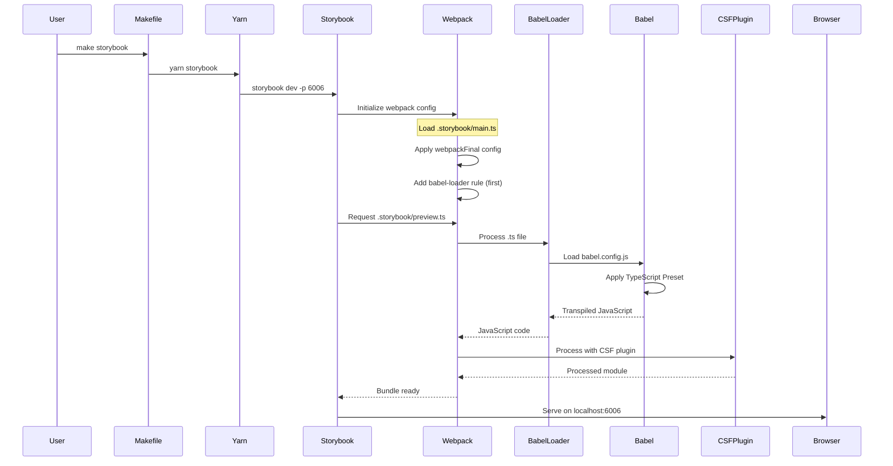
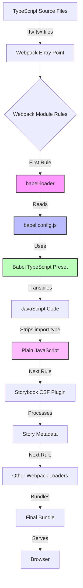
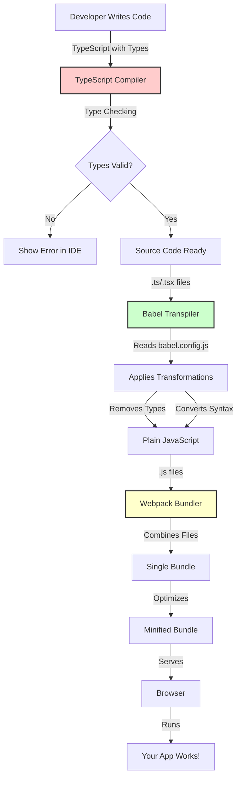
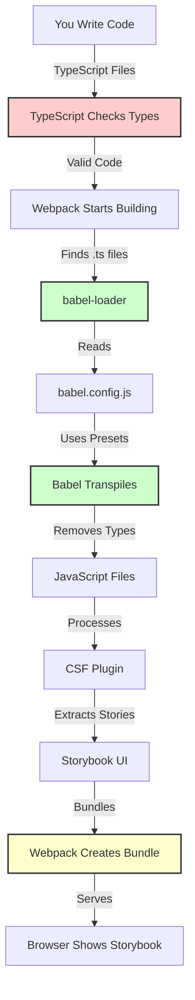

## Questions Answered by This Post

- What happens when I run `make storybook`?
- How does code flow from TypeScript source to the browser?
- What is the step-by-step execution flow of the build process?
- Why does loader order matter in webpack?
- What happens to my TypeScript code during the build?
- How does the development experience work with these tools?
- What is the complete journey from writing code to seeing it in the browser?


This guide provides a deep dive into the development process and build flow when using Storybook with TypeScript and Babel. You'll understand what happens step-by-step from writing code to seeing it in the browser. For understanding the tools themselves, see [Understanding the Tools](./understanding-tools).

## How the Build Process Works

Let me break down what happens when you run `make storybook`:

### Step-by-Step Execution Flow



**What's happening here:**

1. **You run the command** → `make storybook` triggers the build
2. **Storybook starts** → Initializes and loads configuration
3. **Webpack configures** → Reads `.storybook/main.ts` and sets up loaders
4. **babel-loader rule added** → Ensures TypeScript files are processed first
5. **File processing begins** → Storybook requests a TypeScript file
6. **Babel transpiles** → Converts TypeScript to JavaScript
7. **CSF plugin processes** → Extracts story metadata from JavaScript
8. **Webpack bundles** → Combines everything into a bundle
9. **Browser receives** → Final JavaScript bundle is served

### The Build Pipeline Architecture



**The flow:**
1. **TypeScript files** enter the webpack pipeline
2. **babel-loader** processes them first (because of `unshift()`)
3. **Babel** reads config and transpiles to JavaScript
4. **CSF plugin** processes the JavaScript (can't handle TypeScript)
5. **Other loaders** do final processing
6. **Webpack** bundles everything
7. **Browser** receives the final bundle

## The Complete Picture: From Source to Browser

Here's the full journey your code takes:



### Phase 1: Development (Type Checking)

**What happens:**
- You write TypeScript code in your editor
- TypeScript compiler (via IDE) checks types in real-time
- Errors are shown immediately in your editor
- **No build required** - this happens as you type

**Example:**
```typescript
// You write this:
function add(a: number, b: number): number {
  return a + b;
}

add("hello", 5); // ❌ TypeScript shows error immediately
```

### Phase 2: Build (Transpilation)

**What happens:**
- You run `make storybook` or `yarn storybook`
- Webpack starts the build process
- babel-loader processes each TypeScript file
- Babel reads `babel.config.js` and applies transformations
- TypeScript syntax is converted to JavaScript
- Type annotations are stripped

**Example transformation:**
```typescript
// Input (TypeScript):
import type { Preview } from '@storybook/react';

function greet(name: string): string {
  return `Hello, ${name}!`;
}
```

```javascript
// Output (JavaScript after Babel):
import { Preview } from '@storybook/react';

function greet(name) {
  return "Hello, " + name + "!";
}
```

### Phase 3: Processing (Story Extraction)

**What happens:**
- CSF plugin processes the JavaScript files
- Extracts story metadata and component information
- Generates story exports for Storybook UI
- **Note**: This must happen after Babel (CSF plugin can't handle TypeScript)

### Phase 4: Bundling

**What happens:**
- Webpack combines all processed files
- Resolves dependencies and imports
- Applies optimizations
- Creates a single (or multiple) bundle file(s)

### Phase 5: Serving

**What happens:**
- Storybook serves the bundle on `localhost:6006`
- Browser requests the bundle
- JavaScript executes in the browser
- Your Storybook UI appears!

## How They All Work Together: The Complete Picture



### The Journey: Step by Step

1. **You write** TypeScript code with types
   - Happens in your editor
   - TypeScript checks types in real-time
   - Errors shown immediately

2. **TypeScript checks** if the types are correct
   - Catches errors early
   - Provides autocomplete
   - No build required for this step

3. **Webpack starts** the build process
   - Triggered by `yarn storybook`
   - Loads configuration from `.storybook/main.ts`
   - Sets up module rules

4. **babel-loader** takes each TypeScript file
   - Matches `.ts` and `.tsx` files
   - Processes them through Babel
   - Returns JavaScript

5. **Babel reads** `babel.config.js` to know how to translate
   - Loads presets (TypeScript, Docusaurus)
   - Applies transformations
   - Strips type annotations

6. **Babel removes** all the type annotations
   - `import type` → removed
   - `: Type` → removed
   - Type-only syntax → stripped

7. **Babel converts** modern syntax to compatible JavaScript
   - Template strings → string concatenation (if needed)
   - Arrow functions → regular functions (if needed)
   - Modern features → compatible versions

8. **CSF Plugin** processes the JavaScript to extract Storybook stories
   - Reads story files
   - Extracts metadata
   - Generates story exports

9. **Webpack bundles** everything into optimized files
   - Combines all modules
   - Resolves dependencies
   - Applies optimizations

10. **Browser loads** and runs the final JavaScript
    - Requests bundle from Storybook server
    - Executes JavaScript
    - Renders Storybook UI

## Why Order Matters

The webpack loader chain executes in **reverse order** (right to left), but rules are processed **top to bottom**. By using `unshift()`, we ensure:

1. **babel-loader runs first** → TypeScript becomes JavaScript
2. **CSF plugin runs second** → Processes the JavaScript
3. **Other loaders run** → Final processing

### What Happens If Order Is Wrong?

**Wrong order (babel-loader after CSF plugin):**
```
TypeScript file → CSF plugin → ❌ Error: Can't parse TypeScript syntax
```

**Correct order (babel-loader before CSF plugin):**
```
TypeScript file → babel-loader → JavaScript → CSF plugin → ✅ Success
```

### The Loader Chain

When webpack processes a file, it applies loaders in sequence:

```
TypeScript File
    ↓
[babel-loader] → Converts to JavaScript
    ↓
JavaScript File
    ↓
[CSF Plugin] → Extracts story metadata
    ↓
Processed Module
    ↓
[Other Loaders] → Final processing
    ↓
Final Bundle
```

Each loader transforms the file and passes it to the next one. The order is critical because:
- CSF plugin can't handle TypeScript
- babel-loader must run first to convert TypeScript to JavaScript
- Other loaders expect JavaScript input

## Development Experience

### Real-Time Type Checking

**What you see:**
- Type errors appear immediately in your IDE
- Red squiggles under problematic code
- Hover tooltips show type information
- Autocomplete suggests correct types

**What's happening:**
- TypeScript compiler runs in the background
- Analyzes your code as you type
- No build required for type checking

### Build-Time Transpilation

**What you see:**
- You run `yarn storybook`
- Build output shows progress
- Storybook starts on `localhost:6006`

**What's happening:**
- Webpack processes files through babel-loader
- Babel transpiles TypeScript to JavaScript
- Files are bundled and served

### Hot Module Replacement (HMR)

**What you see:**
- You change a file
- Browser updates automatically
- No full page reload needed

**What's happening:**
- Webpack detects file changes
- Re-processes changed files through babel-loader
- Updates bundle and pushes to browser
- Browser updates only changed components

## Common Scenarios

### Scenario 1: Writing a New Story

1. You create `Button.stories.tsx`
2. TypeScript checks types as you type
3. You run `yarn storybook`
4. babel-loader processes the file
5. Babel converts TypeScript to JavaScript
6. CSF plugin extracts story metadata
7. Storybook displays your story

### Scenario 2: Fixing a Type Error

1. TypeScript shows error in IDE
2. You fix the type annotation
3. TypeScript error disappears
4. You save the file
5. HMR updates Storybook automatically
6. No full rebuild needed

### Scenario 3: Adding a New Import

1. You add `import type { Props } from './types'`
2. TypeScript validates the import
3. Build time: Babel strips `import type`
4. Runtime: Only the value import remains (if any)
5. Everything works seamlessly

## Conclusion

Understanding the development process helps you:
- Debug build issues more effectively
- Understand why certain configurations are needed
- Optimize your development workflow
- Make informed decisions about tooling

The key insight is that **the process happens in phases**:
1. **Development**: Type checking (real-time, no build)
2. **Build**: Transpilation (TypeScript → JavaScript)
3. **Processing**: Story extraction and bundling
4. **Runtime**: Browser execution

Each phase has different tools and requirements, and understanding this flow helps you configure everything correctly.

## Related Posts

- For the **setup guide**, see [Setup & Overview](./setup-overview)
- For understanding **the tools themselves**, see [Understanding the Tools](./understanding-tools)
- For **common pitfalls and debugging tips**, see [Common Pitfalls & Issues](./common-pitfalls)

## References

- [Storybook TypeScript Configuration](https://storybook.js.org/docs/configure/typescript)
- [Babel TypeScript Preset](https://babeljs.io/docs/en/babel-preset-typescript)
- [Webpack Loaders](https://webpack.js.org/concepts/loaders/)
- [Storybook Webpack Configuration](https://storybook.js.org/docs/builders/webpack)

