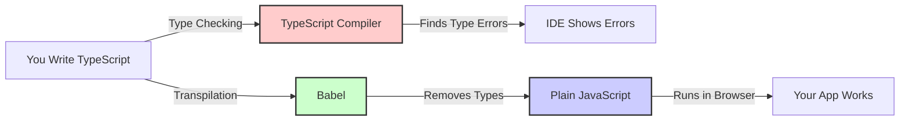
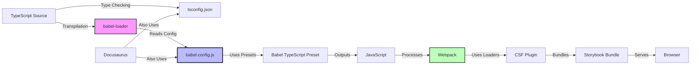

## Questions Answered by This Post

- What does each tool in the stack actually do?
- What are the responsibilities of TypeScript, Babel, and Webpack?
- How do the tools depend on each other?
- What are the configuration files and what do they control?
- How do TypeScript and Babel differ in their roles?
- What is babel-loader and how does it connect webpack to Babel?
- How do all the tools interact with each other?


This guide provides a deep dive into understanding each tool in the Storybook + TypeScript + Babel stack. You'll learn what each tool does, their responsibilities, dependencies, and how they work together. For the development process and build flow, see [Development Process & Experience](./development-process).

## Understanding TypeScript and Babel: A Layman's Guide

Before we dive into the technical details, let's understand what these tools actually do in simple terms.

### What is TypeScript?

Think of TypeScript as a **safety net** for JavaScript. When you write JavaScript, you can accidentally do things like:

```javascript
function add(a, b) {
  return a + b;
}

add("hello", 5); // Returns "hello5" - probably not what you wanted!
```

TypeScript lets you add **type annotations** to catch these mistakes:

```typescript
function add(a: number, b: number): number {
  return a + b;
}

add("hello", 5); // ❌ Error: "hello" is not a number!
```

**Key Point**: TypeScript is like a spell-checker for your code. It checks for errors **before** your code runs, but it doesn't actually run your code. The type information is like comments that help developers and tools understand the code better.

### What is Babel?

Babel is like a **translator**. Imagine you wrote a book in modern English, but you need to publish it in a language that older readers can understand. Babel does something similar for code:

1. **You write**: Modern JavaScript with TypeScript types
2. **Babel reads it**: Understands the modern syntax
3. **Babel translates**: Converts it to older JavaScript that browsers can run
4. **Babel removes**: All the TypeScript type annotations (they're not needed at runtime)

Here's what Babel does:

```typescript
// What you write (TypeScript):
function greet(name: string): string {
  return `Hello, ${name}!`;
}
```

```javascript
// What Babel produces (JavaScript):
function greet(name) {
  return "Hello, " + name + "!";
}
```

Notice that:
- The `: string` type annotations are **removed** (they were just for checking)
- The template string is converted to regular string concatenation (for older browser support)

**Key Point**: Babel **transpiles** (transforms + compiles) your code. It doesn't check types - it just converts syntax.

### How They Work Together



**The Flow:**
1. **You write TypeScript** → TypeScript checks for type errors (in your IDE)
2. **Babel transpiles** → Removes types and converts to JavaScript
3. **Browser runs** → The JavaScript executes

**Important**: TypeScript and Babel have different jobs:
- **TypeScript**: "Is this code correct?" (type checking)
- **Babel**: "Can I convert this to runnable JavaScript?" (transpilation)

## Layman's Guide to All Tools

Here's a simple explanation of every tool in our stack, using everyday analogies:

### The Writing Tools (Development)

**TypeScript** (`tsconfig.json`)
- **Analogy**: Like a grammar checker for code
- **What it does**: Checks if your code makes sense before you run it
- **Example**: Catches mistakes like trying to add a number to a word
- **When it runs**: While you're writing code (in your editor)

**Babel** (`babel.config.js`)
- **Analogy**: Like a translator that converts modern language to older language
- **What it does**: Converts your modern TypeScript/JavaScript to code that old browsers can understand
- **Example**: Converts `const x = 5` to `var x = 5` for older browsers
- **When it runs**: During the build process

**babel-loader**
- **Analogy**: Like a worker who takes files to Babel and brings back the translated version
- **What it does**: Connects Webpack (the build system) to Babel (the translator)
- **Example**: "Hey Babel, translate this TypeScript file for me"
- **When it runs**: During the build process, for each file

### The Assembly Line (Build System)

**Webpack**
- **Analogy**: Like a factory assembly line that takes raw materials and creates a finished product
- **What it does**: Takes all your code files, processes them through various tools, and bundles them into files the browser can use
- **Example**: Combines 100 small files into 3 optimized files
- **When it runs**: During the build process

**Storybook CSF Plugin**
- **Analogy**: Like a specialized worker on the assembly line who handles component documentation
- **What it does**: Processes Storybook story files to extract component information
- **Example**: Reads your component stories and creates the Storybook UI
- **When it runs**: During the build process, after Babel has converted TypeScript

### The Presentation Tools (Development Environment)

**Storybook**
- **Analogy**: Like a showroom where you can see and test individual components
- **What it does**: Creates an isolated environment to develop and test React components
- **Example**: Shows your button component in different states (clicked, hovered, disabled)
- **When it runs**: When you start the Storybook development server

**Docusaurus**
- **Analogy**: Like a website builder for documentation
- **What it does**: Takes your Markdown files and creates a beautiful documentation website
- **Example**: Converts this blog post from Markdown to HTML
- **When it runs**: When you build or start the documentation site

### The Configuration Files

**`babel.config.js`**
- **Analogy**: Like a recipe card for Babel
- **What it does**: Tells Babel how to translate your code
- **Contains**: Instructions like "remove TypeScript types" and "convert modern JavaScript"

**`tsconfig.json`**
- **Analogy**: Like a style guide for TypeScript
- **What it does**: Tells TypeScript how strict to be and what rules to follow
- **Contains**: Settings like "check all files" and "allow modern JavaScript features"

**`.storybook/main.ts`**
- **Analogy**: Like a blueprint for Storybook
- **What it does**: Tells Storybook where to find stories and how to build them
- **Contains**: Instructions like "use babel-loader for TypeScript files"

## The Toolchain: What Each Component Does

Let's understand each tool in the stack in detail:

### Core Build Tools

#### 1. **TypeScript** (`tsconfig.json`)
- **Purpose**: Type system and developer experience
- **What it does**:
  - Provides static type checking
  - Enables IDE autocomplete and IntelliSense
  - Catches type errors before runtime
  - **Important**: TypeScript does NOT compile code - it only checks types
- **Configuration**: `tsconfig.json` defines compiler options and project structure
- **When it runs**: During development (IDE) and optionally during build (type checking)
- **Dependencies**: None (runs independently for type checking)

#### 2. **Babel** (`babel.config.js` + `babel-loader`)
- **Purpose**: JavaScript transpiler and transformer
- **What it does**:
  - **Transpiles** TypeScript syntax → JavaScript
  - Strips type annotations (`import type`, `: Type`, etc.)
  - Converts modern JavaScript to compatible versions
  - Transforms JSX to JavaScript
  - Applies code transformations (plugins)
- **Configuration**: `babel.config.js` defines presets and plugins
- **When it runs**: At build time via `babel-loader` in webpack
- **Key insight**: Babel is the bridge between TypeScript source and webpack's JavaScript requirement
- **Dependencies**: 
  - Reads `babel.config.js` for configuration
  - Uses `@babel/preset-typescript` for TypeScript support
  - Invoked by `babel-loader` (webpack integration)

#### 3. **Webpack**
- **Purpose**: Module bundler and build orchestrator
- **What it does**:
  - Orchestrates the entire build process
  - Manages module resolution and dependencies
  - Processes files through loaders (transformations)
  - Bundles everything into optimized output files
  - Handles code splitting and optimization
- **Configuration**: `.storybook/main.ts` (webpackFinal function)
- **When it runs**: During build/development server startup
- **Key limitation**: Webpack only understands JavaScript - it needs loaders to process other file types
- **Dependencies**:
  - Uses loaders (like `babel-loader`) to process different file types
  - Configured via Storybook's webpack configuration

#### 4. **babel-loader**
- **Purpose**: Webpack loader that runs Babel
- **What it does**:
  - Acts as a bridge between webpack and Babel
  - Processes `.ts`/`.tsx` files through Babel
  - Automatically finds and uses `babel.config.js`
  - Returns JavaScript that webpack can understand
- **Configuration**: Defined in webpack rules
- **When it runs**: During webpack's module processing phase
- **Dependencies**:
  - Requires `babel-core` (or `@babel/core`)
  - Automatically discovers `babel.config.js` from project root
  - Invoked by webpack when processing TypeScript files

### Development Tools

#### 5. **Storybook**
- **Purpose**: Component development and documentation environment
- **What it does**:
  - Provides isolated component development environment
  - Renders components in different states (stories)
  - Generates interactive documentation
  - Uses webpack under the hood for bundling
  - Adds Storybook-specific loaders (CSF plugin, etc.)
- **Configuration**: `.storybook/main.ts` and `.storybook/preview.ts`
- **When it runs**: Development server (`yarn storybook`) or build (`yarn build-storybook`)
- **Dependencies**:
  - Uses webpack for bundling
  - Uses CSF plugin for processing story files
  - Can use the same Babel config as the rest of the project

#### 6. **Storybook CSF Plugin**
- **Purpose**: Processes Storybook story files
- **What it does**:
  - Parses `.stories.tsx` files
  - Extracts story metadata
  - Generates story exports
  - **Requires**: JavaScript input (not TypeScript)
- **When it runs**: After babel-loader has transpiled TypeScript
- **Dependencies**:
  - Requires JavaScript (not TypeScript) - must run after babel-loader
  - Part of Storybook's webpack configuration

#### 7. **Docusaurus**
- **Purpose**: Documentation and blog platform
- **What it does**:
  - Generates static documentation site
  - Processes Markdown and MDX files
  - Uses the same Babel configuration as Storybook
  - Provides the blog where this post lives!
- **Configuration**: `docusaurus.config.js`
- **When it runs**: During site build or development server
- **Dependencies**:
  - Uses `babel.config.js` (shared with Storybook)
  - Uses `tsconfig.json` (shared with Storybook)

### Configuration Files

#### 8. **`babel.config.js`**
- **Purpose**: Central Babel configuration
- **What it contains**:
  - Presets (TypeScript, Docusaurus)
  - Plugins (transformations)
  - Shared by Docusaurus and Storybook
- **Location**: Project root
- **Used by**: 
  - Babel (via babel-loader in webpack)
  - Docusaurus build process
  - Any tool that uses Babel

#### 9. **`tsconfig.json`**
- **Purpose**: TypeScript compiler configuration
- **What it contains**:
  - Compiler options (module system, target, etc.)
  - Path mappings
  - Include/exclude patterns
- **Location**: Project root (shared)
- **Used by**:
  - TypeScript compiler (for type checking)
  - IDE (for autocomplete and IntelliSense)
  - Docusaurus (for type checking)
  - Storybook (for type checking, if enabled)

#### 10. **`.storybook/main.ts`**
- **Purpose**: Storybook configuration
- **What it contains**:
  - Story file patterns
  - Addon configuration
  - Webpack customization (webpackFinal)
  - Babel configuration (via webpack rules)
- **Location**: `.storybook/` directory
- **Used by**: Storybook (to configure webpack and find stories)

## Understanding the Dependencies

### Tool Responsibilities

1. **TypeScript (`tsconfig.json`)**
   - Provides type checking (when enabled)
   - IDE support and autocomplete
   - **Does NOT compile code** - that's Babel's job
   - **Independent**: Can run without other tools (for type checking)

2. **Babel (`babel.config.js` + `babel-loader`)**
   - **Transpiles** TypeScript → JavaScript
   - Strips type annotations (`import type`, `: Type`, etc.)
   - Applies transformations (JSX, modern syntax, etc.)
   - Runs **at build time** via webpack
   - **Depends on**: `babel.config.js` for configuration
   - **Invoked by**: `babel-loader` (webpack integration)

3. **Webpack**
   - Orchestrates the build process
   - Manages module resolution
   - Bundles everything together
   - **Does NOT understand TypeScript** - needs babel-loader
   - **Depends on**: Loaders (like babel-loader) to process files
   - **Configured by**: `.storybook/main.ts`

4. **Storybook**
   - Provides the development environment
   - Uses webpack under the hood
   - Adds Storybook-specific loaders (CSF plugin, etc.)
   - **Depends on**: Webpack, CSF plugin
   - **Configured by**: `.storybook/main.ts`

### Tool Interaction Summary



### Dependency Chain

```
TypeScript Source Files
    ↓
TypeScript Compiler (type checking only)
    ↓
babel-loader (webpack integration)
    ↓
Babel (reads babel.config.js)
    ↓
JavaScript Output
    ↓
Webpack (orchestrates, bundles)
    ↓
Storybook/Docusaurus (serves)
    ↓
Browser
```

### Key Dependencies

1. **babel-loader depends on Babel**
   - babel-loader is just a webpack integration
   - It calls Babel to do the actual transpilation
   - Babel reads `babel.config.js` automatically

2. **Webpack depends on loaders**
   - Webpack can't process TypeScript directly
   - Needs babel-loader to convert TypeScript to JavaScript
   - Loaders are configured in webpack rules

3. **CSF Plugin depends on JavaScript**
   - Can't parse TypeScript syntax
   - Must run after babel-loader has transpiled files
   - This is why loader order matters

4. **Shared configuration**
   - `babel.config.js` is shared between Docusaurus and Storybook
   - `tsconfig.json` is shared between Docusaurus and Storybook
   - This ensures consistency across the project

## Conclusion

Understanding each tool's role and dependencies is crucial for configuring and debugging the build process. The key insights are:

- **TypeScript** provides type checking but doesn't compile code
- **Babel** transpiles TypeScript to JavaScript (the bridge)
- **babel-loader** connects webpack to Babel
- **Webpack** orchestrates everything but needs loaders for TypeScript
- **Configuration files** are shared to maintain consistency

Each tool has a specific role, and understanding these roles helps you configure them correctly and troubleshoot issues when they arise.

## Related Posts

- For the **setup guide**, see [Setup & Overview](./setup-overview)
- For the **development process and build flow**, see [Development Process & Experience](./development-process)
- For **common pitfalls and debugging tips**, see [Common Pitfalls & Issues](./common-pitfalls)

## References

- [Storybook TypeScript Configuration](https://storybook.js.org/docs/configure/typescript)
- [Babel TypeScript Preset](https://babeljs.io/docs/en/babel-preset-typescript)
- [Webpack Loaders](https://webpack.js.org/concepts/loaders/)
- [Storybook Webpack Configuration](https://storybook.js.org/docs/builders/webpack)

