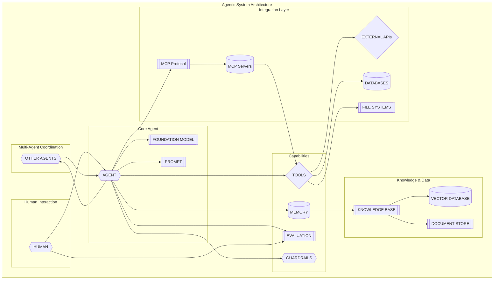

import Tabs from '@theme/Tabs';
import TabItem from '@theme/TabItem';

# Designing GenAI Systems: Complete Decision Framework

## Core Questions

**Foundation Decisions (Start Here):**
- Should I use RAG or direct prompting for my use case?
- Should I enable memory on my agent? Short-term or long-term?
- Should I fine-tune an LLM or just use prompt engineering?
- What model should I choose for my use case?

**Architecture Decisions (Next Level):**
- Should I have a single agent or decompose into multiple agents?
- Should I use a vector database or traditional search?
- Should I implement evaluation before or after deployment?
- How should my agents communicate and collaborate?

**Advanced Decisions (Complex Systems):**
- Should I use specialized vector databases or general-purpose ones?
- Should I implement real-time or batch processing?
- What runtime environment should I choose?
- How should I handle agent communication and coordination?

## When to Use This Guide

- You understand GenAI fundamentals and need to make design decisions
- You're building GenAI systems of any complexity
- You need guidance on architectural trade-offs
- You want to avoid common design mistakes
- You're scaling from simple to complex systems

## Agentic System Architecture Overview



### Shape Legend

| Shape | Symbol | Meaning | Examples |
|-------|--------|---------|----------|
| **Diamond** | `{{}}` | Decision/Control Nodes | AGENT, HUMAN, GUARDRAILS, OTHER AGENTS |
| **Subroutine** | `[[]]` | External Services/Protocols | FOUNDATION MODEL, MCP Protocol, APIs, Knowledge Base |
| **Cylinder** | `[()]` | Data Storage | MEMORY, DATABASES, VECTOR DATABASE |
| **Hexagon** | `{}` | Process/Action Nodes | TOOLS, EXTERNAL APIs |
| **File** | `[[]]` | Documents/Files | PROMPT, DOCUMENT STORE |


## Design Decision Framework

This framework provides the **right level of detail** for making GenAI system design decisions. Each decision point includes:

- **Clear alternatives** with tabbed options for easy comparison
- **When to choose** each option with specific criteria
- **Implementation guidance** without overwhelming technical details
- **Trade-offs** to help you make informed decisions
- **Decision factors** that matter most for your use case

The framework focuses on **architectural decisions** rather than implementation details, giving you the information you need to make the right choices without getting lost in technical minutiae.

## 🎯 Critical Success Factors

**Before diving into architectural decisions, understand that these three elements are the most important to get right in any agentic system:**

### 1. **Prompt Engineering & Design**
- **Why it matters**: Prompts are the interface between users and your AI system - they determine what the system understands and how it responds
- **What to focus on**: Clear instructions, context setting, few-shot examples, output formatting, and edge case handling
- **Common mistakes**: Vague prompts, missing context, poor examples, inconsistent formatting

### 2. **Feedback Loops & Learning**
- **Why it matters**: Systems that can learn and improve from interactions become more valuable over time
- **What to focus on**: User feedback collection, performance monitoring, automatic retraining, and continuous improvement
- **Common mistakes**: No feedback mechanism, ignoring user signals, static systems that don't evolve

### 3. **Success Metrics & Evaluation**
- **Why it matters**: Without proper measurement, you can't know if your system is working or how to improve it
- **What to focus on**: Task completion rates, user satisfaction, response quality, system reliability, and business impact
- **Common mistakes**: No metrics, wrong metrics, infrequent evaluation, ignoring qualitative feedback

### 4. **Tools & Integrations**
- **Why it matters**: Tools are how your agents interact with the world - they determine what your system can actually do and how well it can do it
- **What to focus on**: Tool selection, API reliability, error handling, data quality, and integration complexity
- **Common mistakes**: Poor tool selection, unreliable APIs, no error handling, complex integrations, ignoring tool limitations

> **💡 Pro Tip**: Spend 40% of your development time on these four areas. They have the highest impact on system success and user satisfaction.

## Decision Priorities

**Start with these decisions in order of importance:**

### 🎯 **Foundation Decisions** (Must Get Right First)
These decisions have the highest impact on system success and are hardest to change later:

1. **Knowledge Integration** - Determines your system's intelligence foundation
2. **Model Selection** - Affects performance, cost, and capabilities
3. **Memory Strategy** - Shapes user experience and system behavior
4. **Evaluation Strategy** - Determines how you measure and improve success

### 🏗️ **Architecture Decisions** (Build on Foundation)
These decisions shape your system's structure and scalability:

5. **Single vs. Multi-Agent** - Determines system complexity and capabilities
6. **Fine-tuning vs. Prompt Engineering** - Affects development speed and performance
7. **Agent Communication** - Critical for multi-agent coordination

### ⚡ **Advanced Decisions** (Optimize for Scale)
These decisions optimize performance and handle complexity:

8. **Vector Database Strategy** - Affects search performance and cost
9. **Processing Strategy** - Determines user experience and infrastructure needs
10. **Runtime Environment** - Affects deployment, security, and operations

> **💡 Quick Start**: If you're building your first system, focus on decisions 1-4. Add decisions 5-7 as you scale. Consider decisions 8-10 for production systems with high scale or complexity requirements.

## Decisions You'll Need To Make

### Deciding on Knowledge Infusion

<Tabs>
<TabItem value="why" label="Why" default>

**Why this decision matters:**
Knowledge integration is the foundation of your GenAI system's intelligence. The approach you choose directly impacts accuracy, cost, complexity, and user experience. Getting this wrong can lead to hallucination, poor performance, or over-engineered solutions.

**Key questions to ask yourself:**
1. **What type of knowledge does my system need?** (General vs. domain-specific, static vs. dynamic)
2. **How accurate do responses need to be?** (Can tolerate some hallucination vs. need citations and sources)
3. **What's my infrastructure complexity tolerance?** (Simple setup vs. can handle vector databases)
4. **How often does my knowledge change?** (Static content vs. frequently updated information)
5. **What's my latency requirement?** (Real-time responses vs. can tolerate retrieval delays)

</TabItem>
<TabItem value="how" label="How">

**Due diligence checklist for knowledge integration:**

1. **Assess your knowledge requirements**
   - [ ] Identify what type of knowledge your system needs (general vs. domain-specific)
   - [ ] Determine if knowledge changes frequently or is relatively static
   - [ ] Evaluate the volume and complexity of your knowledge base
   - [ ] Consider if you need citations and source attribution

2. **Evaluate your constraints**
   - [ ] Define your latency requirements (real-time vs. can tolerate delays)
   - [ ] Assess your infrastructure complexity tolerance
   - [ ] Determine your budget for knowledge management
   - [ ] Consider your team's technical capabilities

3. **Test and validate your approach**
   - [ ] Create a small proof of concept with sample data
   - [ ] Measure response accuracy and relevance
   - [ ] Test with edge cases and difficult queries
   - [ ] Validate that the approach meets your quality standards

4. **Plan for production**
   - [ ] Design your knowledge update and maintenance process
   - [ ] Plan for monitoring and quality assurance
   - [ ] Consider backup and disaster recovery
   - [ ] Document your knowledge management procedures

</TabItem>
<TabItem value="embedded" label="Knowledge Embedded in Prompts">

**Core Concept:** Embed knowledge directly in prompts using few-shot learning and prompt engineering techniques.

**Choose when**:
- You have general knowledge requirements
- You need fast, low-latency responses
- You want to minimize infrastructure complexity
- You're working with well-known, stable information
- You have limited domain-specific data

**Implementation approach**:
- Design effective prompts with examples
- Use few-shot learning techniques
- Implement prompt templates
- Set up response validation
- Configure model parameters

**Benefits**:
- Simple implementation
- Low latency
- No additional infrastructure
- Easy to iterate and test
- Cost-effective for simple use cases

**Considerations**:
- Limited to model's training data
- Potential for hallucination
- Less control over information accuracy
- May not handle domain-specific queries well
- Limited ability to provide citations

</TabItem>
<TabItem value="rag" label="RAG (Retrieval Augmented Generation)">

**Core Concept:** Retrieve relevant information from a knowledge base and use it to augment model responses.

**Choose when**:
- You have large amounts of domain-specific knowledge
- You need to answer questions about specific documents or data
- You want to provide citations and sources
- You need to handle dynamic or frequently updated information
- You want to reduce hallucination and improve accuracy

**Implementation approach**:
- Set up vector database (OpenSearch, Pinecone, etc.)
- Create knowledge base with your documents
- Implement retrieval pipeline
- Configure embedding model
- Set up response generation with context

**Benefits**:
- Access to specific, up-to-date information
- Reduced hallucination
- Source attribution and citations
- Better handling of domain-specific queries
- Scalable knowledge management

**Considerations**:
- Additional infrastructure complexity
- Latency overhead for retrieval
- Need for good chunking and embedding strategies
- Ongoing maintenance of knowledge base

</TabItem>
<TabItem value="mcp" label="Knowledge Base with MCP">

**Core Concept:** Intelligent integration between language models and enterprise knowledge bases using MCP for enhanced discovery and retrieval.

**Key Components:**
- **Knowledge Base Discovery:** Resource for identifying available knowledge bases
- **Natural Language Querying:** Tool for semantic search across knowledge bases
- **Reranking Capabilities:** Enhanced relevance using language models
- **Metadata Integration:** Leveraging document metadata for better filtering

**Integration Components:**
- **Data Source Configuration:** S3 bucket integration for document storage
- **Document Processing:** Automated text extraction and chunking
- **Vector Embedding:** Titan Embeddings V2 for semantic search
- **Retrieval System:** OpenSearch Serverless for vector similarity search
- **MCP Integration:** Standardized protocol for agent-tool communication

**Supported Document Types:**
- **Text Files:** .txt, .md, .html formats
- **Office Documents:** .doc, .docx, .csv, .xls, .xlsx
- **PDF Documents:** Multi-page PDF processing
- **Structured Data:** JSON and other structured formats

**Architecture Benefits:**
- **Intelligent Discovery:** AI can discover and use appropriate knowledge bases
- **Enhanced Relevance:** Reranking improves search result quality
- **Flexible Querying:** Natural language queries without complex search parameters
- **Metadata Utilization:** Leverages document structure for better results

**Workflow Components:**
- **Data Ingestion:** Automated document processing and indexing
- **Vector Generation:** Embedding creation for semantic search
- **Query Processing:** Natural language query understanding
- **Response Generation:** Contextual answer synthesis
- **MCP Communication:** Standardized agent-tool interactions

**Implementation Strategy:**
- Use MCP resource for knowledge base discovery
- Implement natural language query tools
- Configure reranking for improved relevance
- Set up metadata-based filtering

**Production Components:**
- **Monitoring Setup:** Performance and usage tracking
- **Scaling Configuration:** Auto-scaling based on demand
- **Security Implementation:** Data encryption and access controls
- **Backup and Recovery:** Data protection and disaster recovery

**Operational Considerations:**
- **Performance Monitoring:** Query latency and throughput tracking
- **Cost Optimization:** Resource usage and cost management
- **Security Compliance:** Data privacy and regulatory requirements
- **Maintenance Procedures:** Regular updates and system health checks

**Quality Assurance:**
- **Testing Framework:** Automated testing for RAG components
- **Performance Benchmarking:** Response quality and speed assessment
- **User Feedback Integration:** Continuous improvement based on usage
- **A/B Testing:** Model and configuration comparison

**Decision Points:**
- Document format and processing requirements
- Vector embedding model selection
- Search and retrieval optimization
- Response quality and accuracy needs
- Production scale and user requirements
- Compliance and security needs
- Monitoring and observability requirements
- Maintenance and operational capabilities

</TabItem>
</Tabs>

### Deciding on Memory Strategy

<Tabs>
<TabItem value="why" label="Why" default>

**Why this decision matters:**
Memory strategy determines how your system handles context, personalization, and user experience continuity. The wrong choice can lead to frustrating user experiences, privacy violations, or unnecessary complexity.

**Key questions to ask yourself:**
1. **Do users expect the system to remember them?** (Personalized experience vs. anonymous interactions)
2. **How important is conversation context?** (Each query independent vs. building on previous interactions)
3. **What are my privacy requirements?** (No data retention vs. user consent for memory)
4. **How complex should the user experience be?** (Simple stateless vs. rich contextual interactions)
5. **What's my operational complexity tolerance?** (Simple deployment vs. managing user data)

</TabItem>
<TabItem value="how" label="How">

**Due diligence checklist for memory strategy:**

1. **Analyze your user experience requirements**
   - [ ] Determine if users expect personalized experiences
   - [ ] Assess the importance of conversation context continuity
   - [ ] Evaluate if you need cross-session learning and adaptation
   - [ ] Consider user privacy expectations and consent requirements

2. **Evaluate your technical constraints**
   - [ ] Assess your data storage and management capabilities
   - [ ] Determine your privacy and compliance requirements
   - [ ] Evaluate your operational complexity tolerance
   - [ ] Consider your team's expertise with memory systems

3. **Design your memory architecture**
   - [ ] Define what information needs to be remembered (conversation history, user preferences, facts)
   - [ ] Plan your data retention and deletion policies
   - [ ] Design your memory retrieval and context injection strategy
   - [ ] Plan for memory performance and scalability

4. **Test and validate your approach**
   - [ ] Create test scenarios with different memory requirements
   - [ ] Validate that memory enhances rather than complicates user experience
   - [ ] Test memory performance under load
   - [ ] Ensure compliance with privacy regulations

</TabItem>
<TabItem value="no-memory" label="No Memory">

**Choose no memory when**:
- Each conversation is independent
- You don't need personalization
- You want the simplest implementation
- Privacy is a major concern
- You're building stateless services

**Trade-offs**:
- ✅ Simple to implement
- ✅ No privacy concerns
- ❌ No personalization
- ❌ No conversation context

</TabItem>
<TabItem value="short-term" label="Short-term Memory">

**Choose short-term memory when**:
- You need conversation context
- You want to maintain session state
- You need to reference previous messages
- You're building conversational interfaces

**Implementation**:
- Store conversation history in session
- Use conversation context in prompts
- Implement session management
- Plan for session cleanup

</TabItem>
<TabItem value="long-term" label="Long-term Memory">

**Choose long-term memory when**:
- You need user personalization
- You want to learn from past interactions
- You need cross-session continuity
- You're building persistent AI assistants

**Implementation**:
- Set up user-specific data storage
- Implement semantic fact extraction
- Design memory retrieval systems
- Plan for data privacy and retention

</TabItem>
</Tabs>


### Deciding on Fine-tuning vs. Prompt Engineering

<Tabs>
<TabItem value="why" label="Why" default>

**Why this decision matters:**
This choice determines your model's performance, development speed, and ongoing costs. The wrong approach can lead to poor accuracy, excessive costs, or unnecessary complexity that delays your time to market.

**Key questions to ask yourself:**
1. **How domain-specific are my requirements?** (General tasks vs. specialized domain knowledge)
2. **What's my data situation?** (Limited examples vs. large labeled datasets)
3. **What's my performance requirement?** (Good enough vs. optimal accuracy)
4. **What's my time to market constraint?** (Quick prototype vs. can invest in training)
5. **What's my budget for model customization?** (Prompt engineering costs vs. fine-tuning infrastructure)

</TabItem>
<TabItem value="how" label="How">

**Due diligence checklist for model strategy:**

1. **Assess your domain and data requirements**
   - [ ] Evaluate how domain-specific your use case is (general vs. specialized knowledge)
   - [ ] Assess the quality and quantity of your training data
   - [ ] Determine if you have sufficient labeled examples for fine-tuning
   - [ ] Consider if your domain knowledge changes frequently

2. **Evaluate your performance and cost constraints**
   - [ ] Define your accuracy and quality requirements
   - [ ] Assess your latency and throughput needs
   - [ ] Determine your budget for model customization and inference
   - [ ] Consider your time-to-market constraints

3. **Test and compare approaches**
   - [ ] Start with prompt engineering to establish baseline performance
   - [ ] Create a small fine-tuning experiment with your data
   - [ ] Compare performance, cost, and complexity of both approaches
   - [ ] Test with edge cases and difficult scenarios

4. **Plan for production and maintenance**
   - [ ] Design your model update and retraining process
   - [ ] Plan for monitoring model performance and drift
   - [ ] Consider your team's expertise with each approach
   - [ ] Plan for long-term maintenance and evolution

</TabItem>
<TabItem value="prompting" label="Prompt Engineering">

**Choose prompt engineering when**:
- You have limited training data
- You need quick iteration and fast time-to-market
- You want to avoid training costs and infrastructure complexity
- You're building general-purpose systems
- You need to change behavior frequently
- You're prototyping or building MVPs

**Best practices**:
- Use few-shot examples with high-quality demonstrations
- Implement prompt templates for consistency
- Test different prompt variations systematically
- Monitor prompt performance and user feedback
- Use chain-of-thought prompting for complex reasoning
- Implement prompt versioning and A/B testing

**Benefits**:
- Fast to implement and iterate
- No additional infrastructure costs
- Easy to update and modify
- Works with any pre-trained model
- No data preparation required

**Limitations**:
- Limited by model's training data
- May not handle domain-specific tasks well
- Performance depends on prompt quality
- Limited control over model behavior
- May require extensive prompt engineering

</TabItem>
<TabItem value="finetuning" label="Fine-tuning">

**Choose fine-tuning when**:
- You have domain-specific data and requirements
- You need specialized behavior for your use case
- You have sufficient high-quality training data (1000+ examples)
- You need consistent, reliable performance
- You're building production systems with specific requirements
- Prompt engineering isn't achieving desired results

**Fine-tuning approaches**:
- **Full Fine-tuning**: Complete model retraining (highest performance, most expensive)
- **LoRA (Low-Rank Adaptation)**: Efficient fine-tuning with reduced parameters
- **QLoRA**: Quantized LoRA for memory efficiency
- **Adapter Layers**: Add specialized layers to existing models

**Implementation considerations**:
- **Data Quality**: Prepare high-quality, diverse training data
- **Data Volume**: Ensure sufficient examples (1000+ for good results)
- **Evaluation**: Set up comprehensive evaluation metrics and validation
- **Infrastructure**: Plan for training compute and storage requirements
- **Versioning**: Implement model versioning and rollback strategies
- **Monitoring**: Track model performance and drift in production

**Benefits**:
- Specialized performance for your domain
- Consistent behavior across similar inputs
- Better handling of domain-specific terminology
- Reduced prompt engineering requirements
- Higher accuracy for specialized tasks

**Considerations**:
- Requires significant training data
- Higher infrastructure and compute costs
- Longer development and iteration cycles
- Need for ongoing model maintenance
- Potential for overfitting to training data

</TabItem>
</Tabs>

### Deciding on Automated vs. Human Model Evaluation

<Tabs>
<TabItem value="why" label="Why" default>

**Why this decision matters:**
Evaluation strategy determines how you measure success, catch issues, and ensure quality. The wrong approach can lead to undetected problems, slow feedback loops, or evaluation bottlenecks that slow down development.

**Key questions to ask yourself:**
1. **How do I define success for my system?** (Objective metrics vs. subjective quality)
2. **What's my evaluation volume?** (Few test cases vs. large-scale testing)
3. **How fast do I need feedback?** (Real-time evaluation vs. can wait for human review)
4. **What's my quality tolerance?** (Good enough vs. must be perfect)
5. **What's my evaluation budget?** (Automated costs vs. human evaluation costs)

</TabItem>
<TabItem value="how" label="How">

**Due diligence checklist for evaluation strategy:**

1. **Define your success metrics**
   - [ ] Identify what "good" means for your specific use case
   - [ ] Determine if you need objective metrics or subjective quality assessment
   - [ ] Define your minimum acceptable performance thresholds
   - [ ] Consider both accuracy and user experience metrics

2. **Assess your evaluation capacity and constraints**
   - [ ] Determine your evaluation volume (few test cases vs. large-scale testing)
   - [ ] Assess your budget for evaluation (automated costs vs. human evaluation costs)
   - [ ] Evaluate your team's expertise with evaluation frameworks
   - [ ] Consider your timeline for evaluation feedback

3. **Design your evaluation framework**
   - [ ] Create test datasets that represent your use cases
   - [ ] Design evaluation metrics that align with your success criteria
   - [ ] Plan for both automated and human evaluation where appropriate
   - [ ] Establish evaluation processes and workflows

4. **Implement and validate your approach**
   - [ ] Start with automated evaluation for objective metrics
   - [ ] Add human evaluation for subjective quality assessment
   - [ ] Test your evaluation framework with known good/bad examples
   - [ ] Plan for continuous evaluation and monitoring

</TabItem>
<TabItem value="automated" label="Automated Model Evaluation">

**Core Concept:** Systematic evaluation of foundation models using predefined metrics and automated assessment.

**Key Components:**
- **Built-in Datasets:** Curated datasets for specific tasks (summarization, Q&A, classification)
- **Predefined Metrics:** Accuracy, robustness, toxicity, and task-specific measures
- **Automated Assessment:** No manual intervention required for evaluation
- **Comparative Analysis:** Side-by-side model performance comparison

**Evaluation Tasks:**
- **Content Summarization:** Automatic summarization quality assessment
- **Question Answering:** Accuracy and relevance evaluation
- **Text Classification:** Categorization performance measurement
- **Text Generation:** Quality and coherence assessment

**Implementation Strategy:**
- Use JSON Lines format for custom datasets
- Leverage built-in evaluation metrics for standard tasks
- Implement automated evaluation workflows
- Generate comprehensive evaluation reports

**Decision Factors:**
- Task-specific evaluation requirements
- Dataset availability and quality
- Evaluation metric relevance
- Automation vs. manual assessment needs

</TabItem>
<TabItem value="human" label="Human Model Evaluation">

**Core Concept:** Incorporate human judgment for subjective and custom evaluation metrics.

**Evaluation Types:**
- **Custom Metrics:** Relevance, style, brand voice alignment
- **Subjective Assessment:** Friendliness, creativity, appropriateness
- **Domain Expertise:** Specialized knowledge evaluation
- **Brand Alignment:** Consistency with organizational voice

**Team Options:**
- **Internal Teams:** Use existing organizational reviewers
- **AWS Managed Teams:** Leverage AWS expert evaluation services
- **Hybrid Approach:** Combine internal and external evaluation

**Workflow Components:**
- **Dataset Preparation:** Format data for human evaluation
- **Reviewer Setup:** Configure evaluation teams and criteria
- **Evaluation Execution:** Systematic human assessment process
- **Report Generation:** Comprehensive evaluation results

**Decision Points:**
- Evaluation team selection (internal vs. managed)
- Custom metric definition and weighting
- Evaluation scale and timeline requirements
- Cost vs. quality trade-offs

</TabItem>
</Tabs>


### Deciding on Agent Runtime Environment

<Tabs>
<TabItem value="why" label="Why" default>

**Why this decision matters:**
Your runtime environment determines scalability, security, compliance, and operational complexity. The wrong choice can lead to performance bottlenecks, security vulnerabilities, or compliance issues that are expensive to fix later.

**Key questions to ask yourself:**
1. **What are my compliance requirements?** (Data residency, industry regulations, security standards)
2. **What's my scale requirement?** (Small team vs. enterprise-scale deployment)
3. **What's my operational complexity tolerance?** (Managed services vs. custom infrastructure)
4. **What's my budget for infrastructure?** (Cloud costs vs. on-premises investment)
5. **What's my integration requirement?** (Standalone vs. integrated with existing systems)

</TabItem>
<TabItem value="how" label="How">

**Due diligence checklist for runtime environment:**

1. **Assess your compliance and security requirements**
   - [ ] Identify data residency and sovereignty requirements
   - [ ] Determine industry-specific compliance needs (HIPAA, SOC 2, PCI DSS)
   - [ ] Assess your security and access control requirements
   - [ ] Consider your audit and logging needs

2. **Evaluate your scale and performance needs**
   - [ ] Define your expected user load and growth projections
   - [ ] Assess your latency and throughput requirements
   - [ ] Determine your availability and uptime needs
   - [ ] Consider your global distribution requirements

3. **Assess your operational capabilities**
   - [ ] Evaluate your team's expertise with different cloud platforms
   - [ ] Determine your operational complexity tolerance
   - [ ] Assess your budget for infrastructure and operations
   - [ ] Consider your integration with existing systems

4. **Plan for production deployment**
   - [ ] Design your deployment and scaling strategy
   - [ ] Plan for monitoring, logging, and observability
   - [ ] Consider disaster recovery and backup strategies
   - [ ] Plan for cost optimization and resource management

</TabItem>
<TabItem value="aws" label="AWS Service Integration">

**Core Concept:** Seamless integration between MCP and AWS services, particularly Amazon Bedrock, for enterprise-scale AI applications.

**Key Components:**
- **Bedrock Converse API Integration:** Tool use capabilities for external data access
- **AWS Service Connectivity:** Direct access to S3, DynamoDB, RDS, CloudWatch, and Knowledge Bases
- **Security Boundary Respect:** Consistent access control through existing AWS mechanisms
- **Unified Access Pattern:** Standardized interface regardless of underlying service architecture

**Architecture Benefits:**
- **Enterprise Integration:** Leverages existing AWS infrastructure and security
- **Reduced Development Overhead:** No custom connectors for each data source
- **Consistent Security:** Uses established AWS IAM and access controls
- **Scalable Architecture:** Aligns with AWS best practices

**Decision Points:**
- AWS service integration requirements
- Security and compliance needs
- Development team AWS expertise
- Production deployment and scaling requirements

</TabItem>
<TabItem value="azure" label="Azure Cloud Services">

**Core Concept:** Deploy agentic systems on Microsoft Azure with integrated AI services and enterprise-grade security.

**Key Components:**
- **Azure OpenAI Integration:** Direct access to GPT models and Azure AI services
- **Azure Cognitive Services:** Pre-built AI capabilities for vision, speech, and language
- **Azure Functions:** Serverless execution for agent workflows
- **Azure Active Directory:** Enterprise identity and access management

**Architecture Benefits:**
- **Microsoft Ecosystem:** Seamless integration with Office 365 and Microsoft tools
- **Enterprise Security:** Advanced threat protection and compliance features
- **Hybrid Cloud:** Support for on-premises and cloud deployments
- **Cost Optimization:** Pay-per-use pricing with reserved capacity options

**Decision Points:**
- Microsoft ecosystem integration requirements
- Enterprise security and compliance needs
- Hybrid cloud deployment scenarios
- Cost optimization and resource management

</TabItem>
<TabItem value="local" label="Local Data Center">

**Core Concept:** Deploy agentic systems in on-premises data centers for maximum control, security, and compliance.

**Key Components:**
- **On-Premises Infrastructure:** Full control over hardware and network configuration
- **Private AI Models:** Deploy open-source models locally for complete data privacy
- **Custom Security:** Implement organization-specific security policies
- **Air-Gapped Deployment:** Complete isolation from external networks

**Architecture Benefits:**
- **Complete Control:** Full ownership of infrastructure and data
- **Maximum Security:** No data leaves the organization's network
- **Compliance:** Meet strict regulatory requirements for data sovereignty
- **Customization:** Tailor infrastructure to specific organizational needs

**Decision Points:**
- Regulatory compliance and data sovereignty requirements
- Security and privacy concerns
- Infrastructure management capabilities
- Cost and resource availability

</TabItem>
<TabItem value="hybrid" label="Hybrid Cloud">

**Core Concept:** Combine on-premises infrastructure with cloud services for optimal flexibility and security.

**Key Components:**
- **Hybrid Architecture:** On-premises for sensitive data, cloud for scalability
- **Data Classification:** Route data based on sensitivity and compliance requirements
- **Unified Management:** Single pane of glass for hybrid infrastructure
- **Flexible Scaling:** Cloud bursting for peak workloads

**Architecture Benefits:**
- **Flexibility:** Choose optimal environment for each workload
- **Security:** Keep sensitive data on-premises while leveraging cloud scale
- **Cost Optimization:** Balance between capital and operational expenses
- **Compliance:** Meet diverse regulatory requirements across regions

**Decision Points:**
- Data sensitivity and classification requirements
- Regulatory compliance across multiple jurisdictions
- Cost optimization and resource utilization
- Operational complexity and management overhead

</TabItem>
</Tabs>


### Deciding on Model Selection

<Tabs>
<TabItem value="why" label="Why" default>

**Why this decision matters:**
Model selection directly impacts your system's performance, cost, and user experience. The wrong model can lead to poor accuracy, excessive costs, or performance bottlenecks that are difficult to fix later.

**Key questions to ask yourself:**
1. **What are my performance requirements?** (Accuracy, latency, throughput needs)
2. **What's my budget for model inference?** (Cost per token, monthly budget)
3. **How complex are my tasks?** (Simple Q&A vs. complex reasoning and analysis)
4. **What's my scale requirement?** (Low volume vs. high-throughput production)
5. **What are my compliance needs?** (Data privacy, model transparency, audit requirements)

</TabItem>
<TabItem value="how" label="How">

**Due diligence checklist for model selection:**

1. **Define your requirements and constraints**
   - [ ] Identify your specific use cases and task types
   - [ ] Define your performance thresholds (accuracy, latency, throughput)
   - [ ] Determine your budget constraints for inference and training
   - [ ] Assess your compliance and security requirements

2. **Research and compare available models**
   - [ ] Identify models that match your use case (general vs. specialized)
   - [ ] Compare model capabilities, strengths, and limitations
   - [ ] Evaluate cost structures and pricing models
   - [ ] Consider model availability and access requirements

3. **Design and run evaluation experiments**
   - [ ] Create test datasets that represent your use cases
   - [ ] Set up automated evaluation for objective metrics
   - [ ] Add human evaluation for subjective quality assessment
   - [ ] Compare models side-by-side with the same test cases

4. **Plan for production deployment**
   - [ ] Assess model serving and scaling requirements
   - [ ] Plan for model monitoring and performance tracking
   - [ ] Consider model update and retraining processes
   - [ ] Design fallback and backup strategies

</TabItem>
<TabItem value="claude" label="Claude (Anthropic)">

**Core Concept:** Advanced language model optimized for complex reasoning, analysis, and safety.

**Choose when**:
- You need high-quality reasoning and analysis
- You're building applications that require careful, thoughtful responses
- You need strong safety and alignment features
- You're working with complex, multi-step tasks
- You prioritize response quality over speed

**Key Strengths**:
- **Advanced Reasoning:** Excellent at complex analysis and problem-solving
- **Safety Features:** Built-in safety and alignment considerations
- **Code Generation:** Strong capabilities for programming tasks
- **Long Context:** Large context window for complex documents
- **Consistency:** Reliable, high-quality responses

**Considerations**:
- Higher cost per token compared to some alternatives
- May be slower for simple, high-volume tasks
- Limited fine-tuning options compared to open-source models
- Requires API access and usage monitoring

**Best Use Cases**:
- Complex analysis and research tasks
- Code generation and programming assistance
- Content creation requiring high quality
- Applications where safety and alignment are critical
- Multi-step reasoning and problem-solving

</TabItem>
<TabItem value="gpt" label="GPT-4 (OpenAI)">

**Core Concept:** Versatile language model with broad capabilities and strong performance across many tasks.

**Choose when**:
- You need a well-rounded model for diverse tasks
- You want strong performance across multiple domains
- You need good code generation capabilities
- You're building general-purpose applications
- You want a proven, widely-adopted model

**Key Strengths**:
- **Versatility:** Strong performance across many different tasks
- **Code Generation:** Excellent programming capabilities
- **Creativity:** Good at creative writing and brainstorming
- **Ecosystem:** Large community and tool ecosystem
- **Reliability:** Well-tested and widely used

**Considerations**:
- API rate limits and usage restrictions
- Cost can be high for high-volume applications
- Limited transparency about model details
- May require prompt engineering for optimal results

**Best Use Cases**:
- General-purpose chatbots and assistants
- Content creation and writing tasks
- Code generation and programming help
- Educational and tutoring applications
- Creative writing and brainstorming

</TabItem>
<TabItem value="open-source" label="Open Source Models">

**Core Concept:** Self-hosted models that provide full control and customization capabilities.

**Choose when**:
- You need full control over model deployment and data
- You have specific compliance or security requirements
- You want to customize or fine-tune models extensively
- You're building applications with unique requirements
- You want to avoid vendor lock-in

**Key Strengths**:
- **Full Control:** Complete control over deployment and data
- **Customization:** Ability to fine-tune and modify models
- **Cost Control:** Predictable costs without per-token pricing
- **Privacy:** Data never leaves your infrastructure
- **Flexibility:** Can optimize for specific use cases

**Considerations**:
- Requires significant infrastructure and expertise
- Higher upfront costs for hardware and setup
- Need to manage model updates and maintenance
- May require more prompt engineering and optimization
- Limited to your team's technical capabilities

**Best Use Cases**:
- Applications with strict data privacy requirements
- High-volume applications where cost control is critical
- Custom use cases requiring model modification
- Compliance-heavy industries (healthcare, finance)
- Research and experimentation projects

</TabItem>
</Tabs>

### Deciding on Vector Database Strategy

<Tabs>
<TabItem value="why" label="Why" default>

**Why this decision matters:**
Vector database choice directly impacts search performance, cost, and scalability. The wrong choice can lead to slow queries, expensive infrastructure, or scalability bottlenecks that are difficult to fix later.

**Key questions to ask yourself:**
1. **What's my scale requirement?** (Small datasets vs. millions of vectors)
2. **What's my performance need?** (Fast queries vs. cost optimization)
3. **What's my operational complexity tolerance?** (Managed services vs. self-hosted)
4. **What's my budget for vector storage?** (Pay-per-use vs. fixed costs)
5. **What are my integration requirements?** (Simple setup vs. custom optimization)

</TabItem>
<TabItem value="how" label="How">

**Due diligence checklist for vector database strategy:**

1. **Assess your scale and performance requirements**
   - [ ] Estimate your current and future vector count
   - [ ] Define your query latency and throughput requirements
   - [ ] Determine your data update frequency and patterns
   - [ ] Assess your concurrent user load

2. **Evaluate your operational capabilities**
   - [ ] Assess your team's expertise with vector databases
   - [ ] Determine your operational complexity tolerance
   - [ ] Evaluate your budget for managed vs. self-hosted solutions
   - [ ] Consider your integration with existing infrastructure

3. **Compare database options**
   - [ ] Test query performance with your data and use cases
   - [ ] Evaluate cost models and pricing structures
   - [ ] Assess ease of setup, maintenance, and scaling
   - [ ] Consider vendor lock-in and migration options

4. **Plan for production deployment**
   - [ ] Design your data ingestion and indexing strategy
   - [ ] Plan for monitoring, backup, and disaster recovery
   - [ ] Consider data privacy and security requirements
   - [ ] Plan for cost optimization and resource management

</TabItem>
<TabItem value="general" label="General-Purpose Vector DB">

**Choose general-purpose when**:
- You have moderate scale requirements (< 100M vectors)
- You want managed services and ease of use
- You need quick setup and deployment
- You have standard use cases

**Options**:
- **Pinecone**: Managed vector database service
- **Weaviate**: Open-source with managed options
- **Chroma**: Lightweight, easy to deploy
- **Qdrant**: High-performance, self-hosted

**Benefits**:
- Easy to set up and use
- Managed infrastructure
- Good documentation and support
- Standard APIs and integrations

</TabItem>
<TabItem value="specialized" label="Specialized Vector DB">

**Choose specialized when**:
- You have large-scale requirements (> 100M vectors)
- You need custom optimization
- You have specific performance requirements
- You need cost optimization

**Implementation patterns**:
- **Scalable Vector Database**: LanceDB with S3 storage
- **Data Bucketing**: Split large datasets (200M vectors per bucket)
- **Parallel Indexing**: Index multiple buckets simultaneously
- **Serverless Querying**: Lambda functions for on-demand searches

**Optimization techniques**:
- **Index Configuration**: Tune IVF-PQ parameters
- **Batch Processing**: Handle large query batches
- **Storage Optimization**: Use storage-optimized instances
- **Query Aggregation**: Merge results from multiple splits

</TabItem>
</Tabs>

### Deciding on Real-time vs. Batch Processing

<Tabs>
<TabItem value="why" label="Why" default>

**Why this decision matters:**
Processing strategy determines user experience, system complexity, and infrastructure costs. The wrong choice can lead to poor user experience, unnecessary complexity, or excessive costs.

**Key questions to ask yourself:**
1. **What's my user experience requirement?** (Immediate responses vs. can wait for results)
2. **What's my data volume?** (Small real-time vs. large batch processing)
3. **What's my cost tolerance?** (Real-time infrastructure vs. batch efficiency)
4. **What's my complexity tolerance?** (Simple batch vs. complex real-time systems)
5. **What are my latency requirements?** (Sub-second vs. minutes/hours acceptable)

</TabItem>
<TabItem value="how" label="How">

**Due diligence checklist for processing strategy:**

1. **Analyze your use case requirements**
   - [ ] Determine if users need immediate responses or can wait
   - [ ] Assess your data volume and processing complexity
   - [ ] Evaluate your accuracy vs. speed trade-offs
   - [ ] Consider your user interaction patterns

2. **Evaluate your infrastructure and cost constraints**
   - [ ] Assess your budget for real-time vs. batch infrastructure
   - [ ] Determine your operational complexity tolerance
   - [ ] Evaluate your team's expertise with different processing patterns
   - [ ] Consider your scaling requirements

3. **Design your processing architecture**
   - [ ] Plan your data ingestion and processing pipelines
   - [ ] Design your result storage and retrieval mechanisms
   - [ ] Plan for error handling and failure recovery
   - [ ] Consider your monitoring and observability needs

4. **Test and validate your approach**
   - [ ] Create test scenarios with realistic data volumes
   - [ ] Validate that your approach meets user experience requirements
   - [ ] Test performance under different load conditions
   - [ ] Ensure your system can handle edge cases and failures

</TabItem>
<TabItem value="realtime" label="Real-time Processing">

**Choose real-time when**:
- Users need immediate responses
- You have interactive applications
- You need to process streaming data
- You're building conversational interfaces

**Benefits**:
- Immediate user feedback
- Interactive user experience
- Real-time insights and monitoring
- Responsive applications

**Considerations**:
- Higher infrastructure costs
- More complex system architecture
- Requires robust error handling
- May need caching and optimization

</TabItem>
<TabItem value="batch" label="Batch Processing">

**Choose batch when**:
- Users can wait for results
- You have large data volumes
- You need cost-effective processing
- You're doing analysis and reporting

**Benefits**:
- Cost-effective for large volumes
- Simpler system architecture
- Better resource utilization
- Easier to optimize and tune

**Considerations**:
- Delayed results
- Less interactive user experience
- May need result storage and retrieval
- Requires scheduling and orchestration

</TabItem>
</Tabs>

### Deciding on Single Agent vs. Multi-Agent

<Tabs>
<TabItem value="why" label="Why" default>

**Why this decision matters:**
Agent architecture fundamentally shapes your system's capabilities, complexity, and scalability. The wrong choice can lead to over-engineered solutions, performance bottlenecks, or limited functionality that doesn't meet user needs.

**Key questions to ask yourself:**
1. **How complex are the tasks I need to solve?** (Simple single-purpose vs. complex multi-step workflows)
2. **Do I need specialized expertise?** (General-purpose agent vs. domain-specific specialists)
3. **What's my scalability requirement?** (Single user vs. multiple concurrent users with different needs)
4. **How important is fault tolerance?** (Single point of failure vs. distributed resilience)
5. **What's my development complexity tolerance?** (Simple single agent vs. complex coordination logic)

</TabItem>
<TabItem value="how" label="How">

**Due diligence checklist for agent architecture:**

1. **Analyze your problem complexity**
   - [ ] Map out all the tasks your system needs to perform
   - [ ] Identify if tasks require specialized expertise or can be handled generically
   - [ ] Assess if you need parallel processing or sequential workflows
   - [ ] Determine if tasks are independent or interdependent

2. **Evaluate your scalability and reliability needs**
   - [ ] Define your expected user load and concurrent usage patterns
   - [ ] Assess your fault tolerance requirements (single point of failure vs. distributed resilience)
   - [ ] Consider if you need to scale different capabilities independently
   - [ ] Plan for system growth and evolution

3. **Assess your development and operational capabilities**
   - [ ] Evaluate your team's expertise with agent coordination and communication
   - [ ] Determine your development timeline and complexity tolerance
   - [ ] Assess your debugging and monitoring capabilities
   - [ ] Consider your operational overhead tolerance

4. **Design and test your architecture**
   - [ ] Create a detailed system architecture diagram
   - [ ] Design agent communication protocols and data flow
   - [ ] Plan for agent failure scenarios and recovery
   - [ ] Test the architecture with realistic scenarios and edge cases

</TabItem>
<TabItem value="single" label="Single Agent">

**Choose single agent when**:
- Your problem is well-defined and focused
- You want the simplest architecture
- You don't need specialized capabilities
- You're building a proof of concept
- You have limited resources

**Benefits**:
- Simple to implement and debug
- Easier to maintain
- Lower complexity
- Faster development

**Limitations**:
- Limited specialization
- Harder to scale
- Single point of failure
- Less modular

</TabItem>
<TabItem value="multi" label="Multi-Agent">

**Choose multi-agent when**:
- You have distinct problem domains requiring specialized expertise
- You need to handle complex, multi-faceted problems
- You want better fault tolerance and redundancy
- You're building complex workflows with multiple steps
- You need to scale across different capabilities

**Pros**:
- **Domain Expertise**: Specialized agents for specific areas
- **Scalability**: Handle complex problems beyond single agent capabilities
- **Fault Tolerance**: System continues if individual agents fail
- **Flexibility**: Dynamic agent composition based on needs
- **Variable Autonomy**: Different agents can have different autonomy levels (fully automated, supervised, collaborative, advisory)
- **Risk Management**: High-risk tasks can use supervised agents, low-risk tasks can be fully automated

**Cons**:
- **Complexity**: More complex to design, implement, and debug
- **Coordination Overhead**: Need communication protocols and orchestration
- **Development Time**: Longer development and testing cycles
- **Resource Requirements**: More infrastructure and computational resources
- **Failure Points**: Multiple agents mean more potential failure points

**Architecture Patterns**:
- **Supervisor Pattern**: Central coordinator managing sub-agents
- **Peer-to-Peer**: Agents communicate directly with each other
- **Hierarchical**: Multi-level agent organization with clear reporting
- **Workflow-based**: Agents orchestrated by workflow engine
- **Swarm Intelligence**: Decentralized agents with emergent behavior

**Key Implementation Decisions**:
- **Communication**: Stateless vs. stateful, real-time vs. asynchronous
- **Security**: OAuth for enterprise vs. basic authentication
- **Coordination**: Supervisor patterns vs. peer-to-peer collaboration
- **Autonomy Levels**: Risk-based autonomy assignment per agent
- **Agent Discovery**: How agents find and register with each other
- **Data Sharing**: How agents share information and context
- **Failure Handling**: How the system handles agent failures and recovery

</TabItem>
</Tabs>

### Deciding on Agent Communication and Collaboration

> **Note:** This section only applies if you chose to implement a multi-agent system in the previous section. If you selected a single agent, you can skip this section.

<Tabs>
<TabItem value="why" label="Why" default>

**Why this decision matters:**
Communication and collaboration patterns determine how your agents work together and with humans. The wrong approach can lead to coordination failures, inefficient workflows, or poor user experiences that undermine the value of your multi-agent system.

**Key questions to ask yourself:**
1. **How do my agents need to coordinate?** (Independent tasks vs. complex workflows requiring coordination)
2. **What's my human involvement requirement?** (Fully autonomous vs. human oversight and collaboration)
3. **How complex are my workflows?** (Simple sequential tasks vs. complex multi-step processes)
4. **What's my failure tolerance?** (Can handle agent failures vs. need robust coordination)
5. **What's my user experience goal?** (Seamless automation vs. transparent human-AI collaboration)

</TabItem>
<TabItem value="how" label="How">

**Due diligence checklist for agent communication and collaboration:**

1. **Analyze your workflow requirements**
   - [ ] Map out all the tasks and decision points in your workflows
   - [ ] Identify which tasks can be automated vs. require human oversight
   - [ ] Determine if tasks are independent or interdependent
   - [ ] Assess the complexity of coordination needed between agents

2. **Evaluate your human involvement needs**
   - [ ] Determine where human judgment and oversight are required
   - [ ] Assess your users' comfort level with autonomous vs. collaborative systems
   - [ ] Consider your regulatory and compliance requirements for human oversight
   - [ ] Plan for human feedback and intervention mechanisms

3. **Design your communication architecture**
   - [ ] Define how agents will share information and coordinate actions
   - [ ] Plan for error handling and failure recovery between agents
   - [ ] Design human-AI interaction patterns and interfaces
   - [ ] Consider security and access control for agent communications

4. **Test and validate your approach**
   - [ ] Create test scenarios with different coordination requirements
   - [ ] Validate that human-AI collaboration enhances rather than complicates workflows
   - [ ] Test failure scenarios and recovery mechanisms
   - [ ] Ensure the system meets your reliability and user experience goals

</TabItem>
<TabItem value="human-agent" label="Human-Agent Collaboration">

**Core Concept:** Design agents that augment human intelligence by working with us rather than replacing us, focusing on collaborative intelligence and cognitive augmentation.

**Key Components:**
- **Collaborative Intelligence:** Agents that enhance human thinking rather than replace it
- **Cognitive Augmentation:** Offload repetitive tasks to free up human cognitive bandwidth
- **Collective Subconscious:** Agents as background processors for routine work
- **Human-Agent Co-evolution:** Reciprocal elevation of human and agent capabilities
- **Context-Aware Interaction:** Agents that understand and adapt to human goals

**Architecture Benefits:**
- **Enhanced Human Agency:** Maintains human control while augmenting capabilities
- **Cognitive Liberation:** Frees humans from digital drudgery to focus on higher-level thinking
- **Collaborative Learning:** Agents learn from human expertise and redistribute skills
- **Scalable Intelligence:** Collective knowledge sharing across teams and domains

**Design Principles:**
- **Human-Centric Design:** Align agents with human cognition and workflows
- **Reliability First:** Focus on reliable atomic interactions before complex tasks
- **Flexible Integration:** Deterministic scaffolding with probabilistic model calls
- **Contextual Adaptation:** Agents that understand and respond to changing contexts

**Implementation Strategy:**
- Start with reliable atomic interactions (clicking, typing, form filling)
- Build deterministic scaffolding with probabilistic model calls
- Create workflows that evolve in complexity over time
- Measure both agent capabilities and human productivity improvements
- Design for human-agent co-evolution and skill sharing

**Use Case Examples:**
- **Form Automation:** Reliable form filling to reduce repetitive data entry
- **Knowledge Transfer:** Agents that learn and share expertise across teams
- **Cognitive Offloading:** Background processing of routine digital tasks
- **Collaborative Problem Solving:** Human-agent teams tackling complex challenges
- **Skill Redistribution:** Agents that learn and teach human skills

**Decision Points:**
- Human-agent interaction design and collaboration models
- Cognitive load distribution and task automation levels
- Learning and adaptation requirements
- Team collaboration and knowledge sharing needs

</TabItem>
<TabItem value="agent-agent" label="Agent-to-Agent Communication">

**Core Concept:** Build small, focused agents that interact with each other rather than monolithic systems, enabling autonomous agents to communicate, coordinate, and collaborate to accomplish complex multi-agent tasks.

**Key Components:**
- **Inter-Agent Messaging:** Structured communication protocols between agents
- **Task Coordination:** Distributed task assignment and workload balancing
- **Shared Memory:** Common knowledge base accessible to all agents
- **Conflict Resolution:** Mechanisms for handling conflicting agent decisions
- **Hierarchical Organization:** Agent roles and responsibilities in multi-agent systems
- **Modular Architecture:** Small, focused agents with clear separation of concerns
- **Supervisor-Sub Agent Pattern:** Supervisor agents set application tone and define functionality usage

**Architecture Benefits:**
- **Scalable Coordination:** Handle complex tasks beyond single agent capabilities
- **Specialized Expertise:** Different agents with domain-specific knowledge
- **Fault Tolerance:** System continues functioning if individual agents fail
- **Parallel Processing:** Multiple agents working simultaneously on different aspects
- **Improved Modularity:** Better maintainability and testing capabilities
- **Flexibility:** Use different foundation models for specific tasks
- **Enhanced Scalability:** Easy to add or remove agents as needed
- **Clear Separation:** Distinct concerns and permissions for each agent

**Communication Patterns:**
- **Broadcast Messaging:** One-to-many communication for announcements
- **Direct Messaging:** Point-to-point communication for specific tasks
- **Shared Workspace:** Common environment where agents can observe and interact
- **Event-Driven:** Agents respond to events and state changes
- **Request-Response:** Formal protocols for task delegation and results

**Implementation Strategy:**
- Define clear agent roles and responsibilities
- Implement robust communication protocols
- Establish shared memory and knowledge bases
- Create conflict resolution mechanisms
- Monitor and optimize agent coordination
- **Supervisor-Sub Agent Pattern:** Supervisor agents set application tone and define functionality usage
- **Domain-Specific Agents:** Sub-agents handle specific domains (e.g., meetings, knowledge retrieval)
- **Reusable Components:** Build components that can be shared across multiple agents
- **Clear Separation:** Maintain distinct concerns and permissions for each agent

**Use Case Examples:**
- **Multi-Domain Research:** Agents specializing in different research areas
- **Complex Problem Solving:** Breaking down problems across specialized agents
- **Workflow Orchestration:** Coordinating multi-step business processes
- **Resource Management:** Agents managing different aspects of system resources
- **Quality Assurance:** Agents reviewing and validating each other's work

**Decision Points:**
- Agent specialization and role definition requirements
- Communication protocol complexity and reliability needs
- Coordination and conflict resolution mechanisms
- Scalability and fault tolerance requirements

</TabItem>
<TabItem value="swarm" label="Swarm Intelligence">

**Core Concept:** Deploy multiple simple agents that work together to achieve complex emergent behaviors through collective intelligence.

**Key Components:**
- **Emergent Behavior:** Complex outcomes from simple agent interactions
- **Decentralized Control:** No central coordinator, agents make local decisions
- **Collective Problem Solving:** Swarm intelligence for optimization and search
- **Adaptive Coordination:** Agents adjust behavior based on swarm feedback
- **Scalable Architecture:** Add or remove agents without system redesign

**Architecture Benefits:**
- **Resilience:** System continues functioning with agent failures
- **Scalability:** Easy to scale by adding more agents
- **Flexibility:** Agents can adapt to changing conditions
- **Efficiency:** Parallel processing across multiple agents

**Swarm Behaviors:**
- **Flocking:** Agents move together in coordinated patterns
- **Foraging:** Agents search and collect resources efficiently
- **Optimization:** Swarm algorithms for finding optimal solutions
- **Consensus Building:** Agents reach agreement through local interactions
- **Task Allocation:** Dynamic assignment of tasks to available agents

**Implementation Strategy:**
- Design simple agent behaviors with local rules
- Implement swarm communication protocols
- Create feedback mechanisms for collective learning
- Establish emergence detection and monitoring
- Optimize swarm parameters for specific tasks

**Use Case Examples:**
- **Resource Optimization:** Swarm agents optimizing resource allocation
- **Search and Discovery:** Multiple agents exploring solution spaces
- **Load Balancing:** Agents distributing workload across systems
- **Environmental Monitoring:** Swarm agents tracking and responding to changes
- **Collaborative Filtering:** Agents working together to identify patterns

**Decision Points:**
- Swarm size and agent complexity requirements
- Emergent behavior design and monitoring needs
- Communication overhead and coordination costs
- Task complexity and optimization requirements

</TabItem>
<TabItem value="federated" label="Federated Agent Networks">

**Core Concept:** Connect distributed agents across different organizations, systems, or domains to share capabilities and collaborate on complex tasks.

**Key Components:**
- **Cross-Organizational Agents:** Agents from different entities working together
- **Federated Identity:** Secure authentication across organizational boundaries
- **Capability Sharing:** Agents exposing and consuming services from each other
- **Trust Networks:** Establishing trust relationships between agent systems
- **Interoperability Standards:** Common protocols for agent communication

**Architecture Benefits:**
- **Capability Aggregation:** Combine specialized agents from different organizations
- **Resource Sharing:** Access to distributed resources and expertise
- **Innovation Acceleration:** Cross-pollination of ideas and approaches
- **Cost Optimization:** Share expensive specialized capabilities

**Federation Models:**
- **Peer-to-Peer:** Direct agent-to-agent communication
- **Hub-and-Spoke:** Central coordinator managing distributed agents
- **Hierarchical:** Multi-level federation with different trust levels
- **Market-Based:** Agents trading capabilities and services
- **Consortium:** Formal agreements between organizations for agent collaboration

**Implementation Strategy:**
- Establish federation governance and standards
- Implement secure cross-organizational authentication
- Create capability discovery and registration systems
- Develop trust and reputation mechanisms
- Monitor and audit federated agent interactions

**Use Case Examples:**
- **Supply Chain Coordination:** Agents from different companies coordinating logistics
- **Research Collaboration:** Academic and industry agents sharing research capabilities
- **Emergency Response:** Government and NGO agents coordinating disaster response
- **Financial Services:** Banks and fintech agents collaborating on transactions
- **Healthcare Networks:** Medical agents sharing patient care capabilities

**Decision Points:**
- Federation governance and trust requirements
- Security and privacy across organizational boundaries
- Capability sharing and interoperability standards
- Legal and regulatory compliance needs

</TabItem>
<TabItem value="mcp-agents" label="Calling Agents through MCP">

**Core Concept:** Integrate MCP servers with Amazon Bedrock Agents using inline agents and action groups for enhanced agent capabilities.

**Key Components:**
- **Inline Agent SDK:** Streamlined agent creation and invocation
- **MCP Client Integration:** Direct access to MCP server tools
- **Action Group Configuration:** Grouping multiple MCP clients
- **Return Control Flow:** Seamless tool execution and response handling

**Architecture Benefits:**
- **Standardized Integration:** Consistent access to diverse data sources
- **Reduced Development Overhead:** No custom connectors for each integration
- **Enhanced Agent Capabilities:** Access to specialized tools and data sources
- **Scalable Architecture:** Easy addition of new MCP servers

**Implementation Strategy:**
- Use InlineAgent SDK for agent creation
- Configure MCP clients with server parameters
- Group MCP clients into action groups
- Implement return control for tool execution

**Use Case Examples:**
- **AWS Cost Analysis:** Connect to Cost Explorer and CloudWatch for spend insights
- **Multi-Data Source Agents:** Integrate with Knowledge Bases, SQLite, and filesystem
- **Developer Productivity:** Slack and GitHub integration for development workflows
- **ML Experiment Tracking:** Comet ML integration for experiment management

**Choose when**:
- You need agents to access multiple external data sources
- You want standardized tool integration
- You're building complex workflows with diverse data needs
- You need to scale agent capabilities across different domains
- You want to leverage existing MCP server ecosystem

**Decision Points:**
- Agent complexity and tool requirements
- MCP server selection and configuration
- Development team expertise with MCP protocol
- Production deployment and scaling needs

</TabItem>
</Tabs>

### Deciding on Tool Integration and Agent Capabilities

<Tabs>
<TabItem value="why" label="Why" default>

**Why this decision matters:**
Tool integration determines what your agents can actually do in the real world. The wrong approach can lead to limited functionality, complex integrations, or security vulnerabilities that prevent your agents from delivering value.

**Key questions to ask yourself:**
1. **What external systems do my agents need to interact with?** (APIs, databases, file systems, third-party services)
2. **How complex are my integration requirements?** (Simple API calls vs. complex multi-step workflows)
3. **What's my security and compliance tolerance?** (Basic authentication vs. enterprise-grade security)
4. **How important is standardization vs. customization?** (Standard protocols vs. custom integrations)
5. **What's my team's expertise with different integration approaches?** (MCP vs. custom connectors vs. API wrappers)

</TabItem>
<TabItem value="how" label="How">

**Due diligence checklist for tool integration:**

1. **Assess your integration requirements**
   - [ ] Map all external systems your agents need to access
   - [ ] Identify data types and access patterns (read, write, real-time, batch)
   - [ ] Evaluate security and compliance requirements
   - [ ] Assess integration complexity and maintenance needs

2. **Evaluate your technical constraints**
   - [ ] Review your team's expertise with different integration approaches
   - [ ] Assess your infrastructure and deployment capabilities
   - [ ] Consider your development timeline and resource constraints
   - [ ] Evaluate your monitoring and debugging capabilities

3. **Analyze your scalability and performance needs**
   - [ ] Define your expected usage patterns and volume
   - [ ] Assess your performance and latency requirements
   - [ ] Consider your scaling and growth projections
   - [ ] Plan for system evolution and new integrations

4. **Design and test your integration approach**
   - [ ] Create integration architecture diagrams
   - [ ] Design security and access control mechanisms
   - [ ] Plan for error handling and failure scenarios
   - [ ] Test integrations with realistic data and scenarios

</TabItem>
<TabItem value="mcp" label="Model Context Protocol (MCP)">

**Core Concept:** Standardized protocol for AI systems to communicate with external data sources, tools, and services, solving the M×N integration problem.

**Key Components:**
- **MCP Clients:** AI applications that need access to external data
- **MCP Servers:** Standardized interfaces to specific data sources
- **Three Primitives:** Tools (functions), Resources (data), and Prompts (templates)
- **Client-Server Architecture:** Supports both local and remote implementations

**Architecture Benefits:**
- **Reduced Complexity:** Transforms M×N integration problem into M+N solution
- **Standardized Access:** Universal language for AI-data connections
- **Security Integration:** Leverages existing AWS security mechanisms (IAM)
- **Scalable Design:** Works across local development and enterprise deployments

**Choose when**:
- You need standardized access to multiple data sources
- You want to leverage existing MCP server ecosystem
- You're building complex multi-tool workflows
- You need both local and remote tool access
- You want to reduce integration maintenance overhead

**Decision Points:**
- Local vs. remote MCP server deployment
- Security and access control requirements
- Integration complexity and maintenance needs
- Team expertise with protocol implementations

</TabItem>
<TabItem value="direct-api" label="Direct API Integration">

**Core Concept:** Agents directly call external APIs and services using custom connectors and wrappers.

**Key Components:**
- **API Clients:** Direct HTTP/gRPC clients for external services
- **Authentication Handlers:** OAuth, API keys, and credential management
- **Data Transformers:** Convert between agent and external system formats
- **Error Handlers:** Retry logic, circuit breakers, and fallback mechanisms

**Architecture Benefits:**
- **Direct Control:** Full control over integration behavior
- **Performance:** Optimized for specific use cases
- **Customization:** Tailored to specific business requirements
- **Debugging:** Easier to trace and debug issues

**Choose when**:
- You need highly customized integration behavior
- You're integrating with proprietary or legacy systems
- You require specific performance optimizations
- You have complex data transformation needs
- You want full control over error handling and retry logic

**Decision Points:**
- API complexity and authentication requirements
- Data transformation and format conversion needs
- Performance and latency optimization requirements
- Team expertise with API integration patterns

</TabItem>
<TabItem value="embedded-tools" label="Embedded Tools">

**Core Concept:** Tools and capabilities are built directly into the agent system as embedded functions and services.

**Key Components:**
- **Internal Functions:** Built-in capabilities within the agent framework
- **Local Services:** Microservices running in the same environment
- **Database Connectors:** Direct database access and query capabilities
- **File System Access:** Local and network file system operations

**Architecture Benefits:**
- **Low Latency:** No network calls for internal operations
- **High Security:** No external network exposure
- **Simple Deployment:** Everything in one system
- **Easy Debugging:** All code in one codebase

**Choose when**:
- You need maximum performance and low latency
- You're working with sensitive data requiring high security
- You have simple, well-defined tool requirements
- You want to minimize external dependencies
- You're building proof-of-concept or prototype systems

**Decision Points:**
- Performance and latency requirements
- Security and data sensitivity needs
- Tool complexity and maintenance requirements
- System scalability and growth projections

</TabItem>
<TabItem value="hybrid-approach" label="Hybrid Integration">

**Core Concept:** Combine multiple integration approaches based on specific tool requirements and constraints.

**Key Components:**
- **MCP for Standard Tools:** Use MCP for common, standardized integrations
- **Direct APIs for Custom:** Direct integration for specialized systems
- **Embedded for Critical:** Built-in tools for performance-critical operations
- **Gateway Pattern:** Centralized routing and management of different integration types

**Architecture Benefits:**
- **Flexibility:** Choose the best approach for each tool
- **Performance:** Optimize critical paths while maintaining flexibility
- **Maintainability:** Standardize where possible, customize where needed
- **Scalability:** Scale different integration types independently

**Choose when**:
- You have diverse integration requirements
- You need to balance performance, security, and flexibility
- You're building enterprise systems with complex needs
- You want to optimize for both development speed and production performance
- You're evolving from simple to complex systems

**Decision Points:**
- Tool categorization and integration strategy mapping
- Performance vs. flexibility trade-offs
- Development and maintenance resource allocation
- System evolution and migration planning

</TabItem>
</Tabs>

## Common Pitfalls

### Design Mistakes
- **Over-engineering**: Starting with complex patterns when simple ones suffice
- **Under-evaluating**: Not setting up proper testing and evaluation
- **Ignoring costs**: Not considering API costs and infrastructure needs
- **Poor prompt design**: Not investing time in prompt engineering

### Technical Mistakes
- **No error handling**: Not planning for API failures and timeouts
- **Poor data quality**: Using low-quality training or context data
- **Security oversights**: Not implementing proper input validation
- **Scalability issues**: Not planning for increased load

## Key Takeaways

1. **Start Simple**: Begin with basic prompting before adding complexity
2. **Data is King**: Good data makes good AI
3. **Standards Help**: Use standards like MCP to make connections easier
4. **Feedback Loops Matter**: Agentic control is about giving up control to the agent! Let it iterate but make sure it has a clear feedback loop!
5. **Test Everything**: AI can be wrong, so always test and measure!


## Next Steps

Ready to implement your GenAI system? Here's your action plan:

### Immediate Actions
- [ ] **Evaluate your current architecture**: Assess your existing system against the decision framework in this guide
- [ ] **Implement systematic evaluation**: Set up automated model evaluation starting with basic metrics
- [ ] **Design a proof of concept**: Create a simple system using the patterns outlined, focusing on clear responsibilities
- [ ] **Establish infrastructure practices**: Implement IaC deployment patterns for your GenAI systems

### Advanced Learning
- [Preparing GenAI Systems for Production](./preparing-genai-systems-for-production) for production readiness
- [Understanding GenAI Fundamentals](./understanding-the-fundamentals-of-genai) for foundational concepts
- [Understanding Intermediate GenAI Concepts](./understanding-intermediate-genai-concepts) for advanced patterns


<details>
<summary>🤖 AI Metadata (Click to expand)</summary>

```yaml
# AI METADATA - DO NOT REMOVE OR MODIFY
# AI_UPDATE_INSTRUCTIONS:
# This document should be updated when new GenAI architectural patterns emerge,
# AWS services are updated, or industry best practices change significantly.
#
# 1. SCAN_SOURCES: Monitor AWS blogs, Anthropic engineering posts, Martin Fowler articles,
#    and GitHub repositories for new architectural patterns and best practices
# 2. EXTRACT_DATA: Extract new patterns, decision factors, implementation strategies,
#    and architectural trade-offs from authoritative sources
# 3. UPDATE_CONTENT: Add new patterns to appropriate sections, update decision factors,
#    and ensure all examples remain current and relevant
# 4. VERIFY_CHANGES: Cross-reference new content with multiple sources and ensure
#    consistency with existing patterns and decision frameworks
# 5. MAINTAIN_FORMAT: Preserve the structured format with clear pattern descriptions,
#    decision factors, and implementation strategies
#
# CONTENT_MERGE_STATUS:
# - Simple and Complex Systems: Merged into single comprehensive decision framework
# - Decision Priority: Organized by importance and difficulty (Foundation → Architecture → Advanced)
# - Complete Coverage: All major GenAI system design decisions in one document
# - Quick Start Guidance: Clear progression from simple to complex decisions
#
# CONTENT_PATTERNS:
# - Pattern Name: Core Concept, Key Components, Architecture Benefits, Implementation Strategy, Decision Factors
# - Decision Framework: When to use, trade-offs, implementation considerations
# - Architecture Benefits: Scalability, maintainability, performance, cost considerations
# - Real-World Example: Comprehensive enterprise customer support system with PlantUML diagram
# - Decision Framework Principles: Right level of detail, clear alternatives, architectural focus
#
# BLOG_STRUCTURE_REQUIREMENTS:
# - Frontmatter: slug, title, description, authors, tags, date, draft status
# - Import Statements: Tabs, TabItem from @theme for interactive content
# - Core Questions: List of key questions the guide answers
# - When to Use: Clear guidance on when to use this specific guide
# - Tabbed Decision Framework: All major decisions in tabbed format for easy comparison
# - Implementation Guidance: Practical steps and considerations
# - Common Pitfalls: Mistakes to avoid with specific examples
# - Next Steps: Clear progression to related guides
# - Action Items: Specific, measurable next steps for readers
# - AI Metadata: Comprehensive metadata for future AI updates
#
# DATA_SOURCES:
# - AWS Blog Posts: /prompts/research/research-genai-arch-patterns.md (comprehensive research completed)
# - Anthropic Engineering: Claude Code best practices and agentic patterns
# - Industry Standards: Martin Fowler GenAI patterns and architectural principles
# - Additional Resources: MCP protocols, Nova Act, AgentCore, vector databases, LLM experimentation
#
# RESEARCH_STATUS:
# - Primary Sources: All AWS blog posts researched and documented
# - Additional Sources: All discovered resources researched and integrated
# - Real-World Example: Enterprise customer support system with full architecture
# - Components Section: Comprehensive GenAI components and their roles documented
# - Blog Post Structure: Adheres to /prompts/author/blog-post-structure.md
# - Decision Framework Consolidation: All "Deciding on..." sections moved to centralized Decision Framework
# - Autonomy Gradient Integration: Multi-agent pros enhanced with variable autonomy and risk management
# - Section Restructuring: Removed standalone patterns, integrated into decision tabs
# - Decision Framework Guidance: Added right level of detail guidance and decision framework principles
#
# CONTENT_SECTIONS:
# 1. Core Architectural Patterns (Direct Prompting, RAG, Agentic, Multi-Agent)
# 2. Vector Database and Storage Patterns (LanceDB, OpenSearch, caching strategies)
# 3. LLM Experimentation and MLOps Patterns (MLflow, SageMaker, evaluation frameworks)
# 4. Foundation Model Evaluation Patterns (automated evaluation, benchmarking)
# 5. End-to-End RAG Solution Patterns (Infrastructure as Code, knowledge bases)
# 6. Model Deployment and Serving Patterns (SageMaker JumpStart, CDK deployment)
# 7. Model Context Protocol (MCP) Patterns (universal integration, Bedrock agents)
# 8. GenAI Components and Their Roles (comprehensive component analysis)
# 9. Real-World Example: Enterprise Customer Support Agent System
#
# DECISION_FRAMEWORK_PRINCIPLES:
# - Right Level of Detail: Architectural decisions, not implementation minutiae
# - Clear Alternatives: Tabbed options for easy comparison
# - When to Choose: Specific criteria for each option
# - Implementation Guidance: Sufficient detail without overwhelming
# - Trade-offs: Informed decision-making factors
# - Decision Factors: Most important criteria for each use case
# - Architectural Focus: Strategic decisions over technical details
#
# WHY_TAB_GUIDANCE:
# - Default First Tab: Every tabbed decision section must start with a "Why" tab as default
# - Why This Decision Matters: Explain the importance and consequences of the decision
# - Key Questions Format: Provide 5 key questions users should ask themselves
# - Question Structure: "What/How/When/Where/Why" format with clear alternatives in parentheses
# - Decision Impact: Explain what happens if they get this decision wrong
# - Context Setting: Help users understand the stakes before diving into options
# - Examples of Why Content:
#   - Knowledge Integration: "Foundation of system intelligence, impacts accuracy, cost, complexity"
#   - Memory Strategy: "Determines context handling, personalization, user experience continuity"
#   - Agent Architecture: "Shapes system capabilities, complexity, and scalability"
#   - Model Strategy: "Determines performance, development speed, and ongoing costs"
#   - Evaluation Strategy: "Determines success measurement, issue detection, quality assurance"
#   - Runtime Environment: "Determines scalability, security, compliance, operational complexity"
#
# HOW_TAB_GUIDANCE:
# - Second Tab: Every tabbed decision section must have a "How" tab as the second tab
# - Due Diligence Checklist: Provide a structured checklist for making the decision
# - Checklist Format: 4 main categories with specific actionable items
# - Categories: Requirements Analysis, Constraints Evaluation, Testing/Validation, Production Planning
# - Actionable Items: Use checkbox format with specific, measurable tasks
# - Decision Process: Guide users through the systematic process of arriving at the right decision
# - Examples of How Content:
#   - Knowledge Integration: "Assess knowledge requirements, evaluate constraints, test approach, plan production"
#   - Memory Strategy: "Analyze UX requirements, evaluate constraints, design architecture, test validation"
#   - Agent Architecture: "Analyze problem complexity, evaluate scalability needs, assess capabilities, design/test"
#   - Model Strategy: "Assess domain requirements, evaluate constraints, test approaches, plan production"
#   - Evaluation Strategy: "Define success metrics, assess capacity, design framework, implement/validate"
#   - Runtime Environment: "Assess compliance needs, evaluate scale requirements, assess capabilities, plan deployment"
#
# REAL_WORLD_EXAMPLE:
# - Use Case: Enterprise customer support platform for 10,000+ concurrent users
# - Architecture: Complete PlantUML diagram with AWS sprites
# - Decision Factors: Foundation model selection, agent architecture, memory management
# - Scale Analysis: Performance metrics, bottlenecks, scaling opportunities
# - Cost Analysis: Monthly cost breakdown and optimization strategies
# - Security: Compliance features (GDPR, SOC 2, PCI DSS, HIPAA)
# - Monitoring: Comprehensive observability and alerting strategy
#
# UPDATE_TRIGGERS:
# - New AWS Bedrock features or services are released
# - Significant changes to Anthropic Claude capabilities or best practices
# - Major updates to industry-standard GenAI architectural patterns
# - New research papers or case studies on GenAI system architecture
# - Updates to MCP protocol or agent interoperability standards
#
# PLANTUML_DIAGRAM_MAINTENANCE:
# - AWS Icons: Use correct include paths from /prompts/author/plantuml-diagram.md
# - Version Control: Always use AWS Icons v20.0+ for latest compatibility
# - Include Syntax: Use !include AWSPuml/... not !includeurl for AWS icons
# - Common Fixes: SimpleStorageService.puml, SageMaker.puml, APIGateway.puml paths
# - Validation: Always check SVG content for "Cannot open URL" errors
# - Tab Structure: Diagram tab first (default), then PlantUML code tab
# - Static Files: Save corrected SVGs to /bytesofpurpose-blog/static/img/
# - Blog Integration: Use proper MDX syntax with <Tabs> and <TabItem> components
# - Iteration Process: Read SVG errors → Fix include paths → Regenerate → Validate
#
# FORMATTING_RULES:
# - Maintain consistent pattern structure: Core Concept → Key Components → Benefits → Implementation → Decision Factors
# - Use bullet points for lists and decision factors
# - Include specific examples and use cases for each pattern
# - Preserve the "I need to..." format in the Purpose section
# - Include PlantUML diagrams for complex architectures
# - Document real-world examples with comprehensive analysis
# - Use tabbed structure for PlantUML diagrams (diagram first, code second)
#
# MERMAID_DIAGRAM_GUIDANCE:
# - Use flowchart TB for architecture diagrams with proper shape semantics
# - Diamond {{}} for decision/control nodes (AGENT, HUMAN, GUARDRAILS, OTHER AGENTS)
# - Subroutine [[]] for external services/protocols (FOUNDATION MODEL, MCP, APIs, Knowledge Base)
# - Cylinder [()] for data storage (MEMORY, DATABASES, VECTOR DATABASE)
# - Hexagon {} for process/action nodes (TOOLS, EXTERNAL APIs)
# - File [[]] for documents/files (PROMPT, DOCUMENT STORE)
# - Include clickable links using click syntax: click A href "#section" "tooltip"
# - Add shape legend below diagram explaining each shape type and meaning
# - Use subgraphs to group related components logically
# - Show clear flow relationships between components
# - Include MCP servers in integration layer to show protocol implementation
# - Show human involvement and multi-agent coordination clearly
# - Make diagram interactive with links to relevant decision sections
#
# ARCHITECTURE_DIAGRAM_REQUIREMENTS:
# - High-level overview of agentic system components
# - Clear visual representation of relationships and flows
# - Interactive navigation to decision sections
# - Semantic shapes that match component functions
# - Logical grouping of related components
# - Show both single-agent and multi-agent scenarios
# - Include human involvement patterns
# - Demonstrate MCP integration architecture
# - Provide shape legend for clarity
# - Use professional, clean visual design
#
# UPDATE_FREQUENCY: Quarterly review, immediate updates for major AWS/Anthropic releases
```

</details>


