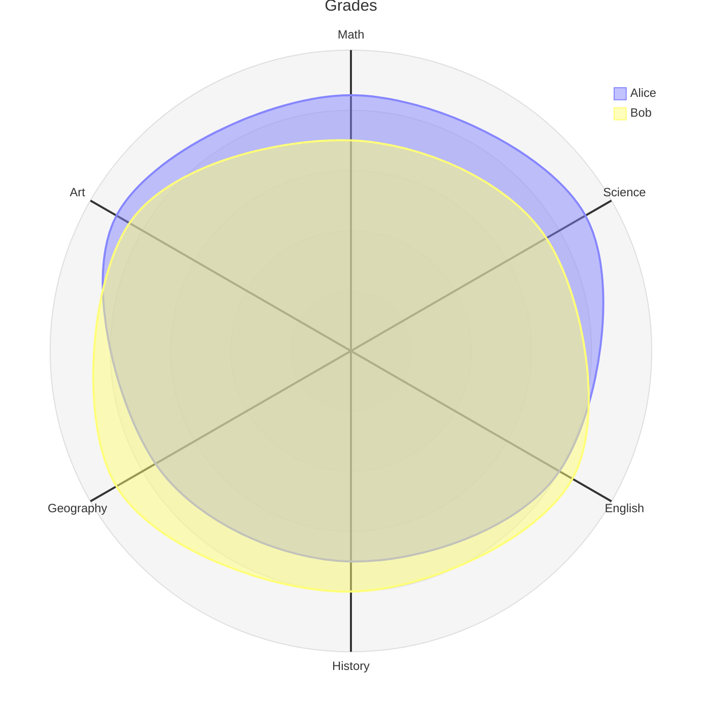
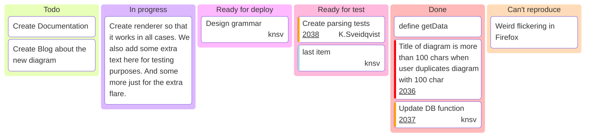

import Tabs from '@theme/Tabs';
import TabItem from '@theme/TabItem';

# Embedding Mermaid Diagram

<Tabs>
<TabItem value="diagram" label="Mermaid Diagram" default>


</TabItem>
<TabItem value="code" label="Mermaid Code">

```
graph TD;
    A-->B;
    A-->C;
    B-->D;
    C-->D;
```

</TabItem>
</Tabs>


<Tabs>
<TabItem value="diagram" label="Mermaid Diagram" default>



</TabItem>
<TabItem value="code" label="Mermaid Code">

```
---
title: "Grades"
---
radar-beta
  axis m["Math"], s["Science"], e["English"]
  axis h["History"], g["Geography"], a["Art"]
  curve a["Alice"]{85, 90, 80, 70, 75, 90}
  curve b["Bob"]{70, 75, 85, 80, 90, 85}

  max 100
  min 0
```

</TabItem>
</Tabs>


<Tabs>
<TabItem value="diagram" label="Mermaid Diagram" default>



</TabItem>
<TabItem value="code" label="Mermaid Code">

```
---
config:
  kanban:
    ticketBaseUrl: 'https://github.com/mermaid-js/mermaid/issues/#TICKET#'
---
kanban
  Todo
    [Create Documentation]
    docs[Create Blog about the new diagram]
  [In progress]
    id6[Create renderer so that it works in all cases. We also add some extra text here for testing purposes. And some more just for the extra flare.]
  id9[Ready for deploy]
    id8[Design grammar]@{ assigned: 'knsv' }
  id10[Ready for test]
    id4[Create parsing tests]@{ ticket: 2038, assigned: 'K.Sveidqvist', priority: 'High' }
    id66[last item]@{ priority: 'Very Low', assigned: 'knsv' }
  id11[Done]
    id5[define getData]
    id2[Title of diagram is more than 100 chars when user duplicates diagram with 100 char]@{ ticket: 2036, priority: 'Very High'}
    id3[Update DB function]@{ ticket: 2037, assigned: knsv, priority: 'High' }

  id12[Can't reproduce]
    id3[Weird flickering in Firefox]
```

</TabItem>
</Tabs>
<details>
    <summary>References...</summary>
    * [ ] Look into: 
        * https://docusaurus.io/docs/markdown-features/diagrams#installation
        * Mermaid Charts -> https://github.com/sjwall/mdx-mermaid
        * github.com/sjwall/mdx-mermaid/blob/main/src/mdxast-mermaid.ts #2022-04-20
</details>