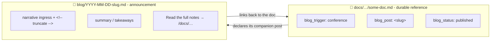

# Blog Post Triggers

[Docs vs Blog Posts](/craft/blogging/docs-vs-blog-posts) answers *which format* a piece of content
should take. This page answers the question that comes **before** that: **when should a
blog post exist at all?**

A *trigger* is an event that reliably produces share-worthy narrative, a conference I
attended, a book I finished, a thing I shipped. When a trigger fires, I expect a post
along the lines of *"I attended X, here's what I learned,"* with the durable detail
living in a doc the post links to.

## The trigger taxonomy

Each trigger below has a controlled-vocabulary value used in doc frontmatter (see
[How to classify a doc](#how-to-classify-a-doc)). The cadence is the promise to myself:
when the event happens, a post is owed.

| Trigger (`blog_trigger`) | What fires it | Example | Cadence |
|---|---|---|---|
| `conference` | I attend a conference / event | [AI Engineer World Fair 2025](/craft/generative-ai/mental-models/2025-06-15-ai-engineer-world-fair) | one post per event |
| `book` | I finish a book worth a take | - | one post per book |
| `solution` | I ship a real thing that solves a problem | - | one post per solution |
| `poc` | I finish a proof-of-concept / tinkering session | - | one post per POC |
| `milestone` | A repo or career milestone | [The Evolution of a Repository](/initiatives/evolution-of-a-repo) | per milestone |
| `opinion` | A stance worth a timestamped take | - | as the take forms |

This formalizes the *"1 post per solution, 1 post per poc/tinkering"* note from
**The Habit of Blogging**.

## The loop: doc is durable, post is the announcement

A triggered post does **not** replace the doc. The doc stays the durable reference; the
post is the point-in-time announcement that links back to it:



- The **post** is the *discovery* surface (it appears in the blog feed, has an `image:`,
  a narrative hook, and a `<!-- truncate -->` fold).
- The **doc** is the *durable* surface (it lives in the topic hierarchy at a frozen slug).
- The post links **forward** to the doc; the doc declares its companion post **back** via
  `blog_post:`, so the link is verifiable and the post can be regenerated.

## How to classify a doc

Add an **optional** `blog_*` frontmatter block to any doc that qualifies for a paired
post. The keys are inert to Docusaurus (unknown frontmatter is ignored) and greppable:

```yaml
# in a docs/**/*.md(x) file
blog_trigger: conference                  # presence = "this doc deserves a paired post"
blog_post: ai-engineer-world-fair-2025    # slug of the paired /blog/ post (once it exists)
blog_status: published                    # planned | drafted | published
```

- **`blog_trigger`**: one of the controlled-vocabulary values in the table above. Its
  *presence* is what classifies the doc as post-worthy.
- **`blog_post`**: the slug of the companion post. Leave it off until the post exists.
- **`blog_status`**: lifecycle of the companion post: `planned` (owed, not written),
  `drafted` (stub exists), `published`.

This is purely additive, it changes no existing frontmatter and never affects a URL.

## Scaffolding the post

Once a doc carries `blog_trigger`, generate its companion post stub:

```bash
make generate-blog-stub DOC=docs/path/to/your-doc.md
```

The generator reads the doc's frontmatter and writes a `/blog/YYYY-MM-DD-<slug>.md` stub
with the narrative ingress, the `<!-- truncate -->` fold, a `## Takeaways` placeholder,
and the back-link to the doc. It is **read-only on the source doc** (it prints the
one-line `blog_post:` / `blog_status:` edit for you to apply) and **refuses to overwrite**
an existing post, so it is safe to re-run.

To see which post-worthy docs still owe a post:

```bash
make blog-pending
```

## See also

- [Docs vs Blog Posts](/craft/blogging/docs-vs-blog-posts), which *format* a piece of content takes.
- [Adding Blog Posts](/craft/blogging/adding-content/adding-blog-posts), the mechanics of authoring a post.
- **The Habit of Blogging**: the broader content-planning habit (draft).
