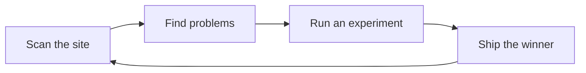
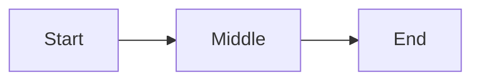

# Animated Diagrams

A static diagram shows you the parts. An animated one shows you the **flow**. On this blog,
any mermaid diagram can opt into a light layer of motion that makes a data or activity flow
easier to follow, while staying readable, on-brand, and dark-mode aware.

This page explains the system, when to use it, and how to opt a diagram in.

## What you get

There are two layers of motion, and they are deliberately separate:

1. **Marching dashes** on every animated diagram. The edges become dashed lines that scroll
   in the direction of the arrow, so the whole diagram reads as "live."
2. **A traveling dot** on *flow* diagrams only. A single dot rides the edges in sequence,
   tracing the journey through the system one hop at a time, then loops.

The dashes suit any diagram. The dot suits a genuine flow (a pipeline, a request and
response, an experiment loop). On a static relationship or context diagram, a dot hopping
between boxes looks random, so it is left off.

Here is a live example (a simple scan to heal loop):

<div className="mermaid-animated flow-dot">



</div>

## How to opt a diagram in

Wrap the mermaid code block in a `mermaid-animated` container:

````mdx
<div className="mermaid-animated">



</div>
````

That alone gives you the marching dashes. The traveling dot is a **content decision** (is
this a flow worth tracing?), so you state your intent with a class on the wrapper:

| Wrapper class | Effect |
|---------------|--------|
| `mermaid-animated flow-dot` | Force the traveling dot (use for a genuine flow). |
| `mermaid-animated no-flow-dot` | Dashes only, never a dot. |
| `mermaid-animated` | A heuristic decides from the edge labels (action verbs read as a flow). |

````mdx
<div className="mermaid-animated flow-dot">


</div>
````

**Mark real flows explicitly.** The automatic heuristic reads the edge *labels*: if they are
action verbs ("invoke", "edits", "commit", "scan", "score") it treats the diagram as a flow.
It cannot see a flow whose verbs live in the node names with unlabeled edges, so when a
diagram is clearly a journey, add `flow-dot` and remove the guesswork.

> Co-design system designs imported from the architecture repo declare this the same way at
> the source, with an `%% animate: flow` comment in the mermaid block; the importer turns
> that into the `flow-dot` class for you. When you hand-author a diagram in a post, put the
> class on the wrapper directly as shown above.

## Why the dot follows the real path

The dot does not move by screen position. Mermaid records each edge's source and target
node, so the dot walks the graph node to node (start at a source, follow each edge to the
next node, and on through every edge) the way data actually moves. That keeps the motion
sensible even when the layout places boxes in surprising spots.

## Colors and dark mode

Diagrams use the blog's palette, not mermaid's default theme: warm-paper node fills with
terracotta borders on the light cream background, and the editorial body font. In dark mode
the diagram switches to dark surfaces with light text and edges automatically, so it stays
readable in both themes.

The one rule that makes this work: **do not hardcode node colors** (no `classDef` or
`style ... fill:` color directives in the diagram source). Hardcoded fills override the
theme and stay light in dark mode, which makes boxes unreadable. Leave coloring to the theme
and the diagram adapts on its own.

## Accessibility

The motion respects the reader's `prefers-reduced-motion` setting. A reader who has asked
their system for less motion sees the diagram without the marching dashes or the traveling
dot, so the animation never becomes a barrier.

## Where the pieces live

- The marching-dash CSS and the dark-mode-aware theme are wired site wide, so the only thing
  an author touches is the `mermaid-animated` wrapper and the optional `%% animate:`
  directive.
- For the full menu of post components (numbered diagram legends, callouts, carousels, and
  more), see the related diagramming and embedding guides in this section.
